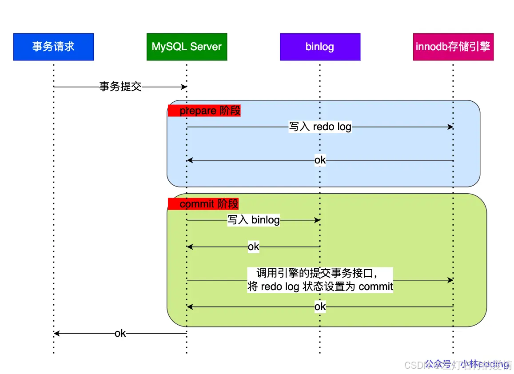
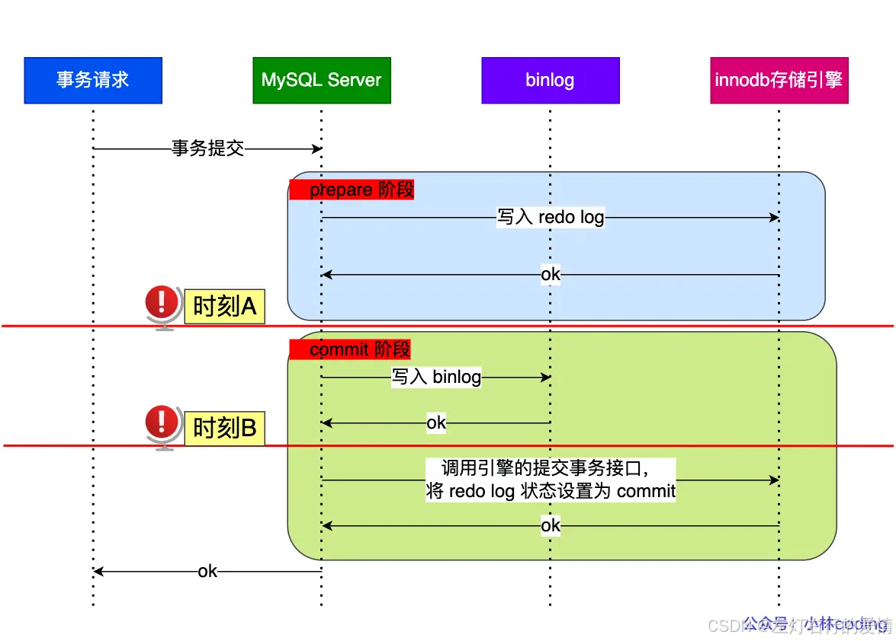
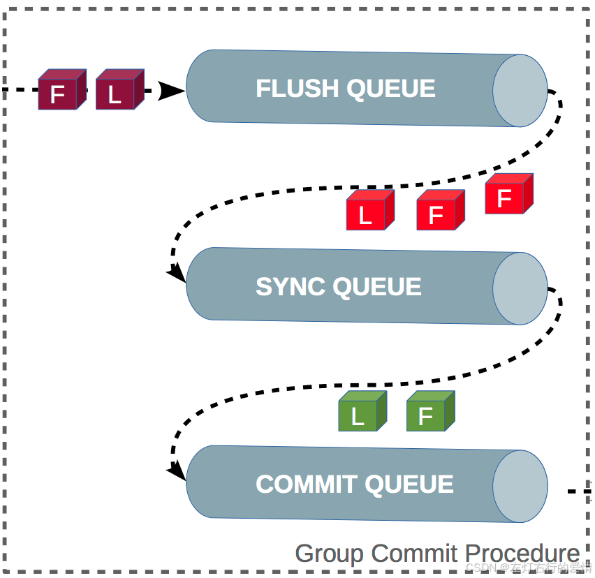
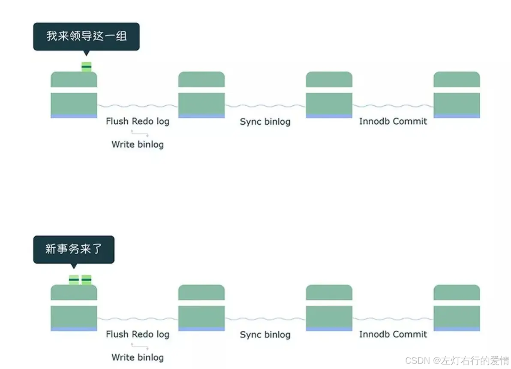
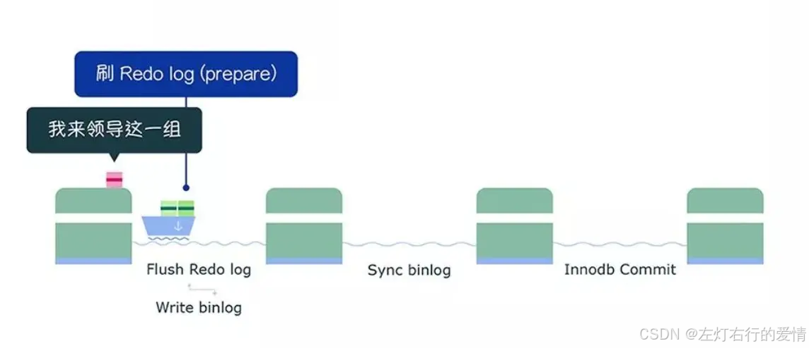
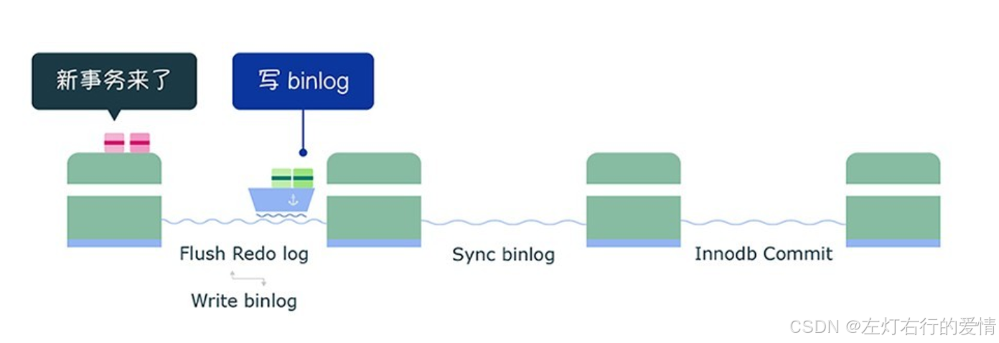
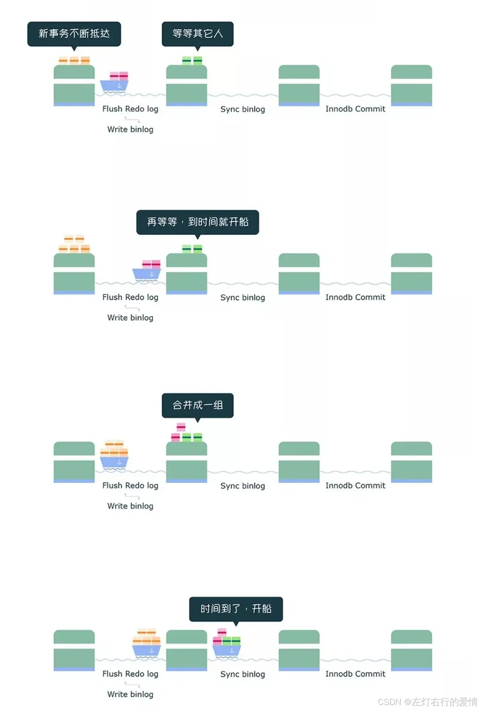
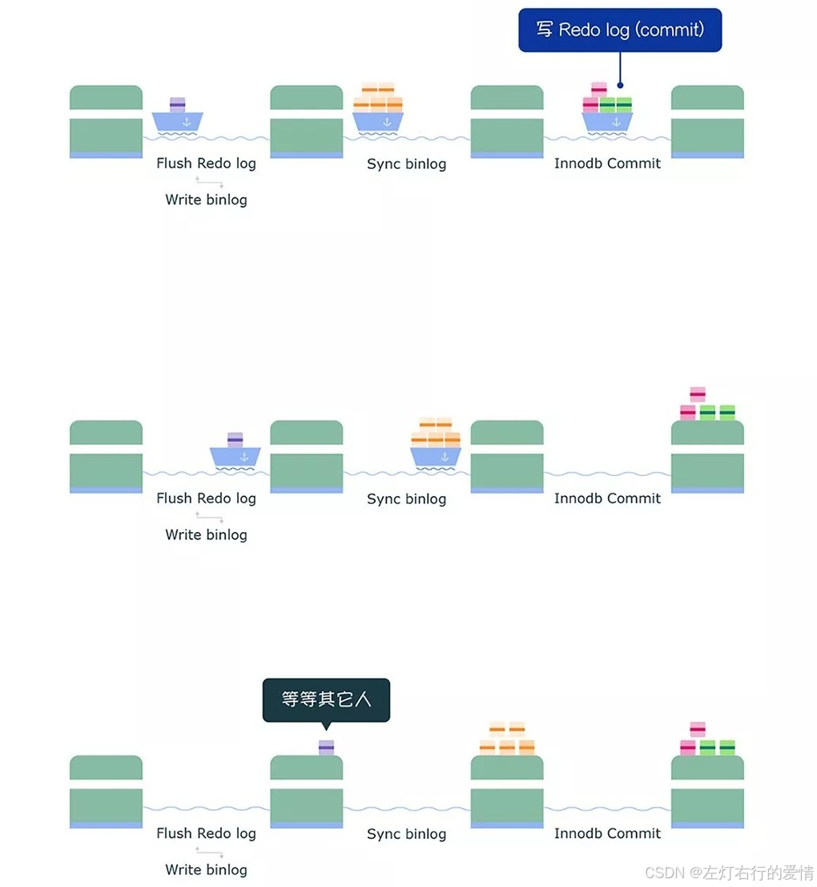

> 原文：[CSDN](https://blog.csdn.net/qq_45852626/article/details/145589737)（历史文章导入，当前状态为草稿）

### 前言

之前三种日志类型我们都了解过了,下面我们通过一个例子来引出我们要聊的二阶段提交.

### 引例-update 语句的执行过程

优化器分析出成本最小的执行计划后,执行器就按照执行计划开始进行更新操作.  
 假如目前有条记录:

```
UPDATE t_user SET name = 'xiaolin' WHERE id = 1;


运行项目并下载源码sql


```

流程如下:

* 执行器负责具体执行，会调用存储引擎的接口  
   通过主键索引树搜索获取 id = 1 这一行记录,然后需要判定记录所在的数据页是否在buffer pool中,如果在直接返回给执行器,如果不在,那么要从磁盘读入到buffer pool,然后返回给执行器.
* 执行器得到聚簇索引记录后，会看一下更新前的记录和更新后的记录是否一样  
   如果一样则结束.  
   如果不一样就把更新前的记录和更新后的记录都当作参数传给 InnoDB 层,让 InnoDB 真正的执行更新记录的操作；
* 开启事务， InnoDB 层更新记录前，首先要记录相应的 undo log,因为这是更新操作，需要把被更新的列的旧值记下来，也就是要生成一条 undo log.  
   因为这是更新操作，需要把被更新的列的旧值记下来，也就是要生成一条 undo log,需要记录对应的 redo log.
* InnoDB 层开始更新记录，会先更新内存（同时标记为脏页）.  
   将记录写到 redo log 里面，这个时候更新就算完成了。
* 至此，一条记录更新完了。
* 在一条更新语句执行完成后，然后开始记录该语句对应的 binlog,此时记录的 binlog 会被保存到 binlog cache，在事务提交时才会统一将该事务运行过程中的所有 binlog 刷新到硬盘。
* 事务提交,剩下就是两阶段提交了.

### 为什么需要两阶段提交

事务提交后，redo log 和 binlog 都要持久化到磁盘，但是这两个是独立的逻辑.  
 但如果出现半成功的状态,就会造成两份日志之间的逻辑不一致.  
 举个例子:  
 假设 id = 1 这行数据的字段 name 的值原本是 ‘jay’,执行下面语句:

```
UPDATE t_user SET name = 'xiaolin' WHERE id = 1;


运行项目并下载源码sql


```

如果在持久化 redo log 和 binlog 两个日志的过程中，出现了半成功状态，那么就有两种情况.

#### redo刷入磁盘, MySQL 突然宕机,导致bin log 没写入

MySQL 重启后，通过 redo log 能将 Buffer Pool 中 id = 1 这行数据的 name 字段恢复到新值 xiaolin，但是 binlog 里面没有记录这条更新语句，**在主从架构中，binlog 会被复制到从库，由于 binlog 丢失了这条更新语句，从库的这一行 name 字段是旧值 jay，与主库的值不一致性；**

#### bin log刷入磁盘, MySQL 突然宕机,导致redo log没写入

由于 redo log 还没写，崩溃恢复以后这个事务无效,所以 id = 1 这行数据的 name 字段还是旧值 jay，而 binlog 里面记录了这条更新语句，在主从架构中，binlog 会被复制到从库，从库执行了这条更新语句，那么这一行 name 字段是新值 xiaolin，与主库的值不一致性；

在持久化 redo log 和 binlog 这两份日志的时候，如果出现半成功的状态,就会造成主从环境的数据不一致性。  
 这是因为 **redo log 影响主库的数据，binlog 影响从库的数据,所以 redo log 和 binlog 必须保持一致才能保证主从数据一致。**

**MySQL 为了避免出现两份日志之间的逻辑不一致的问题，使用了「两阶段提交」来解决**

### 什么是两阶段提交

两阶段提交其实是**分布式事务一致性协议**，它可以保证多个逻辑操作要不全部成功,要不全部失败，不会出现半成功的状态。

两阶段提交把单个事务的提交拆分成了 2 个阶段，分别是「准备（Prepare）阶段」和「提交（Commit）阶段」,每个阶段都由协调者（Coordinator）和参与者（Participant）共同完成.

> 注意:不要把提交（Commit）阶段和 commit 语句混淆了，commit 语句执行的时候，会包含提交（Commit）阶段。

#### 拳击例子

两位拳击手（参与者）开始比赛之前，裁判（协调者）会在中间确认两位拳击手的状态，类似于问你准备好了吗？

* 准备阶段  
   裁判（协调者）会依次询问两位拳击手（参与者）是否准备好了，然后拳击手听到后做出应答，如果觉得自己准备好了，就会跟裁判说准备好了；  
   如果没有自己还没有准备好（比如拳套还没有带好），就会跟裁判说还没准备好。
* 提交阶段  
   裁判（协调者）宣布比赛正式开始，两位拳击手就可以直接开打；如果任何一位拳击手（参与者）回答没有准备好,裁判（协调者）会宣布比赛暂停，对应事务中的回滚操作。

### 两阶段提交过程

为了保证这两个日志的一致性，MySQL 使用了内部 XA 事务,内部XA事务由binlog作为协调者,存储引擎是参与者.  
 当客户端执行commit语句或者在自动提交情况下,MySQL内部开启一个XA事务,分两阶段完成XA事务提交,如下图:  
   
 事务的提交过程有两个阶段，就是将 redo log 的写入拆成了两个步骤：  
 prepare 和 commit，中间再穿插写入binlog，具体如下.

* **prepare 阶段**  
   将 XID（内部 XA 事务的 ID） 写入到 redo log，同时将 redo log 对应的事务状态设置为 prepare,然后将 redo log 持久化到磁盘.
* **commit 阶段**  
   把 XID 写入到 binlog，然后将 binlog 持久化到磁盘,接着调用引擎的提交事务接口，将 redo log 状态设置为 commit,此时该状态并不需要持久化到磁盘，只需要 write 到文件系统的 page cache 中就够了,因为只要 binlog 写磁盘成功，就算 redo log 的状态还是 prepare 也没有关系，一样会被认为事务已经执行成功.

#### 异常重启出现的现象

下图中有时刻 A 和时刻 B 都有可能发生崩溃：  
   
 不管是时刻 A（redo log 已经写入磁盘， binlog 还没写入磁盘），还是时刻 B（redo log ,binlog 已经写入磁盘,但redolog的状态没改变），**此时的 redo log 都处于 prepare 状态**。

MySQL 重启后会按顺序扫描 redo log 文件,碰到处于 prepare 状态的 redo log，就拿着 redo log 中的XID 去 binlog 查看是否存在此 XID:

* 如果 binlog 中没有当前内部 XA 事务的 XID  
   说明 redolog 完成刷盘，但是 binlog 还没有刷盘，则回滚事务。
* 如果 binlog 中有当前内部 XA 事务的 XID  
   说明 redolog 和 binlog 都已经完成了刷盘，则提交事务。

**对于处于 prepare 阶段的 redo log，即可以提交事务，也可以回滚事务,这取决于是否能在 binlog 中查找到与 redo log 相同的 XID.**

**两阶段提交是以 binlog 写成功为事务提交成功的标识**

#### 事务没提交的时候，redo log 会被持久化到磁盘吗？

会的.  
 事务执行中间过程的 redo log 也是直接写在 redo log buffer 中的，这些缓存在 redo log buffer 里的 redo log 也会被「后台线程」每隔一秒一起持久化到磁盘.

那如果 mysql 崩溃了，还没提交事务的 redo log 已经被持久化磁盘了，mysql 重启后，数据不就不一致了？  
 这个可以放心,事务没提交的时候，binlog 是还没持久化到磁盘的,这种情况 mysql 重启会进行回滚操作.

##### 两阶段提交有什么问题

它是性能很差!主要是两方面影响:

* 磁盘 I/O 次数高  
   对于“双1”配置，每个事务提交都会进行两次 fsync（刷盘）,一次是 redo log 刷盘，另一次是 binlog 刷盘。
* 锁竞争激烈  
   虽然能够保证「单事务」两个日志的内容一致，但在「多事务」的情况下，却不能保证两者的提交顺序一致，因此，在两阶段提交的流程基础上，还需要加一个锁来保证提交的原子性，从而保证多事务的情况下，两个日志的提交顺序一致。

###### 为什么两阶段提交的磁盘 I/O 次数会很高？

binlog 和 redo log 在内存中都对应的缓存空间:

* binlog 会缓存在 binlog cache
* redo log 会缓存在 redo log buffer  
   它们持久化到磁盘的时机分别由下面这两个参数控制.  
   一般我们为了避免日志丢失的风险，会将这两个参数设置为 1：
* 当 sync\_binlog = 1 的时候,每次提交事务都会将 binlog cache 里的 binlog 直接持久到磁盘；
* 当 innodb\_flush\_log\_at\_trx\_commit = 1 时,每次事务提交时，都将缓存在 redo log buffer 里的 redo log 直接持久化到磁盘.

所以在每个事务提交过程中， 都会至少调用 2 次刷盘操作，一次是 redo log 刷盘，一次是 binlog 落盘.

###### 为什么锁竞争激烈？

使用 prepare\_commit\_mutex 锁来保证事务提交的顺序,在一个事务获取到锁时才能进入 prepare 阶段，一直到 commit 阶段结束才能释放锁，下个事务才可以继续进行 prepare 操作。  
 虽然完美地解决了顺序一致性的问题,但是在并发量较大的时候，就会导致对锁的争用，性能不佳。

### binlog组提交(group commit)

针对上面的问题,MySQL引入了组提交.

#### 概念

当有多个事务提交的时候，会将多个 binlog 刷盘操作合并成一个，从而减少磁盘 I/O 的次数.  
 举例:  
 如果说 10 个事务依次排队刷盘的时间成本是 10，那么将这 10 个事务一次性一起刷盘的时间成本则近似于 1.  
 引入了组提交机制后,，prepare 阶段不变，只针对 commit 阶段,将 commit 阶段拆分为三个过程：

* flush 阶段：多个事务按进入的顺序将 binlog 从 cache 写入文件(不刷盘)
* sync 阶段：对 binlog 文件做 fsync 操作(多个事务的 binlog 合并一次刷盘)
* commit 阶段：各个事务按顺序做 InnoDB commit 操作  
   **上面的每个阶段都有一个队列，每个阶段有锁进行保护**.  
   锁就只针对每个队列进行保护，不再锁住提交事务的整个过程  
   保证了事务写入的顺序.  
   队列的规则:  
   第一个进入队列的事务会成为 leader,leader来领导所在队列的所有事务，全权负责整队的操作,完成后通知队内其他事务操作结束。  
     
   可以看的出来，锁粒度减小了，这样就使得多个阶段可以并发执行,从而提升效率.

#### 有 binlog 组提交，那有 redo log 组提交吗？

MySQL 5.7 开始有 redo log 组提交.  
 改进如下:  
 在 prepare 阶段不再让事务各自执行 redo log 刷盘操作,而是推迟到组提交的 flush 阶段，也就是说 prepare 阶段融合在了 flush 阶段。

这个优化是将 redo log 的刷盘延迟到了 flush 阶段之中，sync 阶段之前.  
 通过延迟写 redo log 的方式，为 redolog 做了一次组写入，这.样 binlog 和 redo log 都进行了优化

#### 组提交流程

注意下面的过程针对的是“双 1” 配置（sync\_binlog 和 innodb\_flush\_log\_at\_trx\_commit 都为1).

##### flush阶段

第一个事务会成为 flush 阶段的 Leader，此时后面到来的事务都是 Follower ：  
   
 获取队列中事务组,由绿色事务组的 Leader 对 redo log 做一次 write + fsync，即一次将同组事务的 redolog 刷盘：  
   
 完成prepare 阶段后，将绿色这一组事务执行过程中产生的 binlog Cache写入 binlog 文件(调用 write，不会调用 fsync，所以不会刷盘，binlog 文件在操作系统的文件系统中).  
   
 从上面这个过程，可以知道 **flush 阶段队列的作用是用于支撑 redo log 的组提交**.  
 这一步完成后数据库崩溃，由于 binlog 中没有该组事务的记录，所以 MySQL 会在重启后回滚该组事务。

##### sync阶段

写入到 binlog 文件后，并不会马上执行刷盘的操作,而是会等待一段时间，这个等待的时长由`Binlog_group_commit_sync_delay` 参数控制,目的:为了组合更多事务的 binlog，然后再一起刷盘.  
 如下图  
   
 等待的过程中，如果事务的数量提前达到了`Binlog_group_commit_sync_no_delay_count`参数设置的值,就不用继续等待了，就马上将 binlog 刷盘，如下图：  
   
 从上面的过程，可以知道 sync 阶段队列的作用是用**于支持 binlog 的组提交**。

那如果你想优化,相信你能感觉到可以调哪些参数,当然是等待时间和等待事务.

* `binlog_group_commit_sync_delay= N`  
   等待 N 微妙后，直接调用 fsync，将处于文件系统中 page cache 中的 binlog 刷盘，也就是将「 binlog 文件」持久化到磁盘.
* `binlog_group_commit_sync_no_delay_count = N`  
   如果队列中的事务数达到 N 个，就忽视`binlog_group_commit_sync_delay` 的设置，直接调用 fsync,将处于文件系统中 page cache 中的 binlog 刷盘。  
   如果在这一步完成后数据库崩溃，由于 binlog 中已经有了事务记录,MySQL会在重启后通过 redo log 刷盘的数据继续进行事务的提交。

> 解释:  
>  整个事务没走完,binlog刷盘,主从状态下,从数据库是正常的,但是主数据库因为事务没走完,所以数据是旧数据,需要数据库读盘redo日志来恢复主数据库.

##### commit阶段

调用引擎的提交事务接口，将 redo log 状态设置为 commit。  
   
 commit 阶段队列的作用是承接 sync 阶段的事务，完成最后的引擎提交,使得 sync 可以尽早的处理下一组事务，最大化组提交的效率。

### MySQL磁盘I/O很高,有什么优化的方法

我们可以通过控制以下参数，来 “延迟” binlog 和 redo log 刷盘的时机，从而降低磁盘 I/O 的频率:

#### 优化组提交的两个参数

* `binlog_group_commit_sync_delay`
* `binlog_group_commit_sync_no_delay_count`  
   延迟 binlog 刷盘的时机，从而减少 binlog 的刷盘次数。  
   这个方法是基于“**额外的故意等待**”来实现的，因此可能会增加语句的响应时间.  
   但即使 MySQL 进程中途挂了，也没有丢失数据的风险，因为 binlog 早被写入到page cache 了，只要系统没有宕机，缓存在 page cache 里的 binlog 就会被持久化到磁盘。

#### sync\_binlog

将sync\_binlog 设置为大于 1 的值（比较常见是 100~1000），表示每次提交事务都 write,但累积 N 个事务后才 fsync.  
 相当于延迟了 binlog 刷盘的时机。但是这样做的风险是，主机掉电时会丢 N 个事务的 binlog 日志。

#### innodb\_flush\_log\_at\_trx\_commit

设置为 2.  
 表示每次事务提交时，都只是将缓存在 redo log buffer 里的redo log 写到 redo log 文件.  
 注意这里的redo log 文件!  
 并不意味着写入到了磁盘，因为操作系统的文件系统中有个 Page Cache,专门用来缓存文件数据的，所以写入「 redo log文件」意味着写入到了操作系统的文件缓存,然后交由操作系统控制持久化到磁盘的时机。  
 但是这样做的风险是，主机掉电的时候会丢数据。

### 总结

回顾一遍我们开头那个update的例子,补全一下.

* 执行器负责具体执行，会调用存储引擎的接口  
   通过主键索引树搜索获取 id = 1 这一行记录,然后需要判定记录所在的数据页是否在buffer pool中,如果在直接返回给执行器,如果不在,那么要从磁盘读入到buffer pool,然后返回给执行器.
* 执行器得到聚簇索引记录后，会看一下更新前的记录和更新后的记录是否一样  
   如果一样则结束.  
   如果不一样就把更新前的记录和更新后的记录都当作参数传给 InnoDB 层,让 InnoDB 真正的执行更新记录的操作；
* 开启事务， InnoDB 层更新记录前，首先要记录相应的 undo log,因为这是更新操作，需要把被更新的列的旧值记下来，也就是要生成一条 undo log.  
   因为这是更新操作，需要把被更新的列的旧值记下来，也就是要生成一条 undo log,需要记录对应的 redo log.
* InnoDB 层开始更新记录，会先更新内存（同时标记为脏页）.  
   将记录写到 redo log 里面，这个时候更新就算完成了。
* 至此，一条记录更新完了。
* 在一条更新语句执行完成后，然后开始记录该语句对应的 binlog,此时记录的 binlog 会被保存到 binlog cache，在事务提交时才会统一将该事务运行过程中的所有 binlog 刷新到硬盘。
* 事务提交(只考虑两阶段提交)
  + prepare 阶段:将 redo log 对应的事务状态设置为 prepare，然后将 redo log 刷新到硬盘；
  + commit 阶段:将 binlog 刷新到磁盘，接着调用引擎的提交事务接口，将 redo log 状态设置为 commit（将事务设置为 commit 状态后，刷入到磁盘 redo log 文件）
  + 至此，一条更新语句执行完成。
