> 原文：[CSDN](https://blog.csdn.net/qq_45852626/article/details/145491524)（历史文章导入，当前状态为草稿）

#### 索引失效原理
### 前言

如果我们想提高一条语句查询速度，通常都会想对字段建立索引.  
 但是索引并不是万能的。建立了索引，并不意味着任何查询语句都能走索引扫描。  
 稍不注意，可能你写的查询语句是会导致索引失效，从而走了全表扫描，虽然查询的结果没问题，但是查询的性能大大降低。  
 下面我们用实例一起来看看并解释一些索引失效的场景,如果是面试的话建议至少熟悉至少六种并学会排查索引失效的方法.  
 (ps: 我这边亲测都可以复现的,可以跟着一起做一下)

### 数据库及索引准备

#### 创建表结构

为了逐项验证索引的使用情况，我们先准备一张表t\_user：

```
CREATE TABLE `t_user` (
  `id` int(11) unsigned NOT NULL AUTO_INCREMENT COMMENT 'ID',
  `id_no` varchar(18) CHARACTER SET utf8mb4 COLLATE utf8mb4_bin DEFAULT NULL COMMENT '身份编号',
  `username` varchar(32) CHARACTER SET utf8mb4 COLLATE utf8mb4_bin DEFAULT NULL COMMENT '用户名',
  `age` int(11) DEFAULT NULL COMMENT '年龄',
  `create_time` datetime DEFAULT CURRENT_TIMESTAMP COMMENT '创建时间',
  PRIMARY KEY (`id`),
  KEY `union_idx` (`id_no`,`username`,`age`),
  KEY `create_time_idx` (`create_time`)
) ENGINE=InnoDB DEFAULT CHARSET=utf8mb4 COLLATE=utf8mb4_bin;


```

在上述表结构中有三个索引：

* id：为数据库主键；
* union\_idx：为id\_no、username、age构成的联合索引；
* create\_time\_idx：是由create\_time构成的普通索引；

#### 初始化数据

初始化数据分两部分：基础数据和批量导入数据。

基础数据insert了4条数据，其中第4条数据的创建时间为未来的时间，用于后续特殊场景的验证：

```
INSERT INTO `t_user` (`id`, `id_no`, `username`, `age`, `create_time`) VALUES (null, '1001', 'Tom1', 11, '2022-02-27 09:04:23');
INSERT INTO `t_user` (`id`, `id_no`, `username`, `age`, `create_time`) VALUES (null, '1002', 'Tom2', 12, '2022-02-26 09:04:23');
INSERT INTO `t_user` (`id`, `id_no`, `username`, `age`, `create_time`) VALUES (null, '1003', 'Tom3', 13, '2022-02-25 09:04:23');
INSERT INTO `t_user` (`id`, `id_no`, `username`, `age`, `create_time`) VALUES (null, '1004', 'Tom4', 14, '2023-02-25 09:04:23');


```

除了基础数据，还有一条存储过程及其调用的SQL，方便批量插入数据，用来验证数据比较多的场景,这里分两个版本,因为这边版权问题只能用DBeaver,所以我用的第二版,如果第一版创建失败可以试试第二版：

* 第一版

```
-- 删除历史存储过程
DROP PROCEDURE IF EXISTS `insert_t_user`

-- 创建存储过程
delimiter $

CREATE PROCEDURE insert_t_user(IN limit_num int)
BEGIN
    DECLARE i INT DEFAULT 10;
    DECLARE id_no varchar(18) ;
    DECLARE username varchar(32) ;
    DECLARE age TINYINT DEFAULT 1;
    WHILE i < limit_num DO
        SET id_no = CONCAT("NO", i);
        SET username = CONCAT("Tom",i);
        SET age = FLOOR(10 + RAND()*2);
        INSERT INTO `t_user` VALUES (NULL, id_no, username, age, NOW());
        SET i = i + 1;
    END WHILE;

END $
-- 调用存储过程
call insert_t_user(100);


```

* 第二版

```
-- 删除历史存储过程
DROP PROCEDURE IF EXISTS `insert_t_user`

-- 创建存储过程
CREATE PROCEDURE insert_t_user(IN limit_num int)
BEGIN
    DECLARE i INT DEFAULT 10;
    DECLARE id_no varchar(18) ;
    DECLARE username varchar(32) ;
    DECLARE age TINYINT DEFAULT 1;
    WHILE i < limit_num DO
        SET id_no = CONCAT("NO", i);
        SET username = CONCAT("Tom",i);
        SET age = FLOOR(10 + RAND()*2);
        INSERT INTO `t_user` VALUES (NULL, id_no, username, age, NOW());
        SET i = i + 1;
    END WHILE;
END 
-- 调用存储过程
call insert_t_user(100);


```

#### 数据库版本及执行计划

查看当前数据库的版本：

```
select version();
8.0.33


```

上述为本人测试的数据库版本：8.0.33。

查看SQL语句执行计划，一般我们都采用explain关键字，通过执行结果来判断索引使用情况。

##### 分析SQL示例

```
explain select * from t_user where id = 1;


```

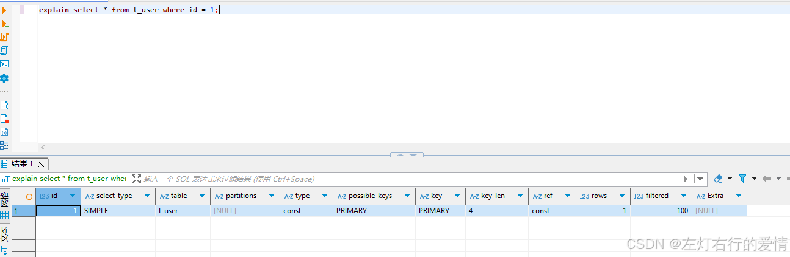  
 可以看到上述SQL语句使用了主键索引（PRIMARY），key\_len为4；  
 其中key\_len的含义为：表示索引使用的字节数，根据这个值可以判断索引的使用情况，特别是在组合索引的时候，判断该索引有多少部分被使用到非常重要。

做好以上数据及知识的准备，下面就开始讲解具体索引失效的实例了。

我们创建的索引如下:  
 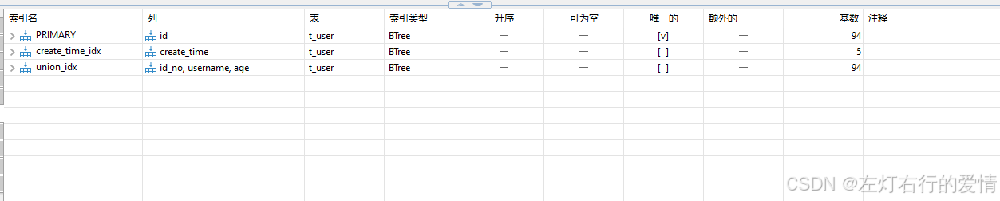

### 索引失效场景

#### 联合索引不满足最左匹配原则

在联合索引中，最左侧的字段优先匹配。因此，在创建联合索引时，where子句中使用最频繁的字段放在组合索引的最左侧。  
 而在查询时，要想让查询条件走索引，则需满足：**最左边的字段要出现在查询条件中。**  
 实例中，union\_idx联合索引组成：

```
KEY `union_idx` (`id_no`,`username`,`age`)


```

最左边的字段为id\_no，一般情况下，只要保证id\_no出现在查询条件中，则会走该联合索引。

##### 成功示例一

```
explain select * from t_user where id_no = '1002';


```

explain结果：  
 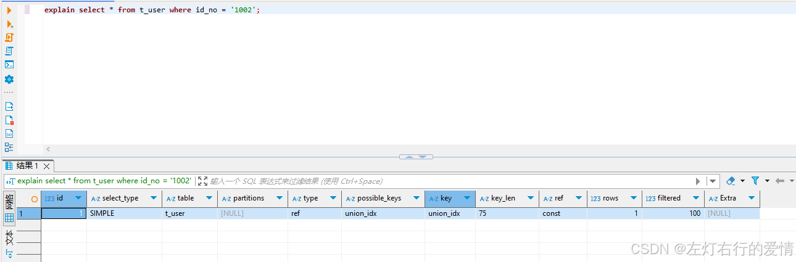  
 通过explain执行结果可以看出，上述SQL语句走了union\_idx这条索引。  
 这里再普及一下key\_len的计算：

* id\_no 类型为varchar(18)，字符集为`utf8mb4_bin`，也就是使用4个字节来表示一个完整的UTF-8。此时，`key_len = 18* 4 = 72`；
* 由于该字段类型varchar为变长数据类型，需要再额外添加2个字节。此时，`key_len = 72 + 2 = 74`；
* 由于该字段运行为`NULL（default NULL）`，需要再添加1个字节。此时，`key_len = 74 + 1 = 75`；  
   上面演示了key\_len一种情况的计算过程，后续不再进行逐一推演，知道基本组成和原理即可，更多情况大家可自行查看。

##### 成功示例二

```
explain select * from t_user where id_no = '1002' and username = 'Tom2';


```

explain结果：  
 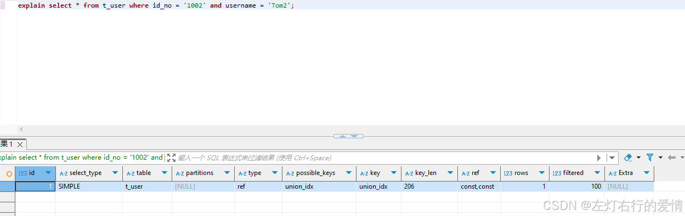  
 很显然，依旧走了union\_idx索引，根据上面key\_len的分析，大胆猜测，在使用索引时，不仅使用了id\_no列，还使用了username列。

##### 成功示例三

```
explain select * from t_user where id_no = '1002' and age = 12;


```

explain结果：  
 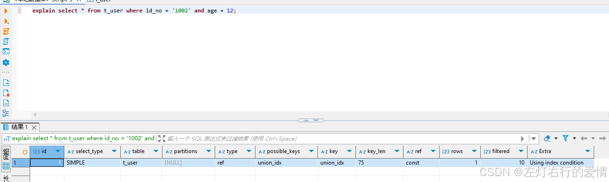  
 走了union\_idx索引，但跟示例一一样，只用到了id\_no列。

当然，还有三列都在查询条件中的情况，就不再举例了。上面都是走索引的正向例子，也就是满足最左匹配原则的例子，下面来看看，不满足该原则的反向例子。

##### 失效示例

```
explain select * from t_user where username = 'Tom2' and age = 12;


```

explain结果：  
 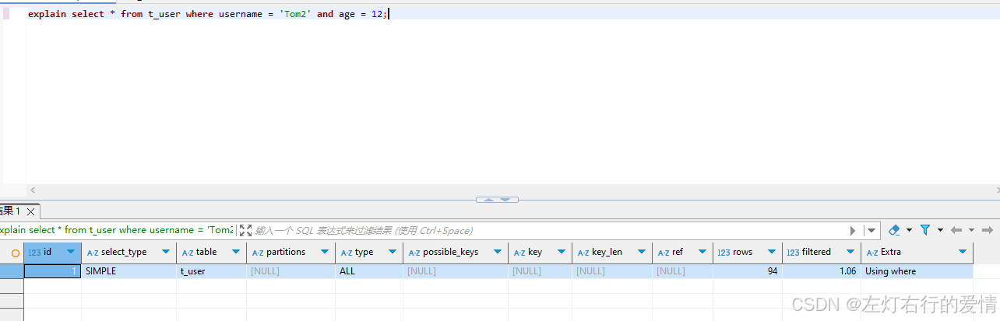  
 此时，可以看到未走任何索引，也就是说索引失效了。  
 同样的，下面只要没出现最左条件的组合，索引也是失效的：  
 **在联合索引的场景下，查询条件不满足最左匹配原则**

```
explain select * from t_user where age = 12;
explain select * from t_user where username = 'Tom2';


```

#### 使用了select \*

在[阿里巴巴开发手册](https://alibaba.github.io/p3c/MySQL%E6%95%B0%E6%8D%AE%E5%BA%93/ORM%E6%98%A0%E5%B0%84.html)的ORM映射章节第一条规定:

```
【强制】在表查询中，一律不要使用 * 作为查询的字段列表，需要哪些字段必须明确写明。
说明：1）增加查询分析器解析成本。2）增减字段容易与resultMap配置不一致。


```

虽然在规范手册中没有提到索引方面的问题，但禁止使用select \* 语句可能会带来的附带好处就是：某些情况下可以走覆盖索引。  
 在上面的联合索引中，如果查询条件是age或username，当使用了select \* ，肯定是不会走索引的。  
 但如果希望根据username查询出id\_no、username、age这三个结果（均为索引字段），明确查询结果字段，是可以走覆盖索引的：

```
explain select id_no, username, age from t_user where username = 'Tom2';


```

explain结果：  
 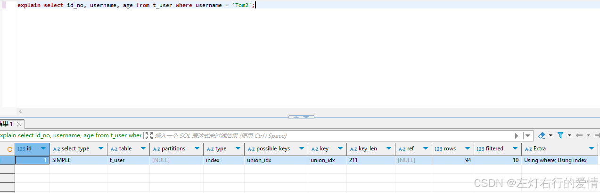

```
explain select id_no, username, age from t_user where age = 12;


```

explain结果：  
 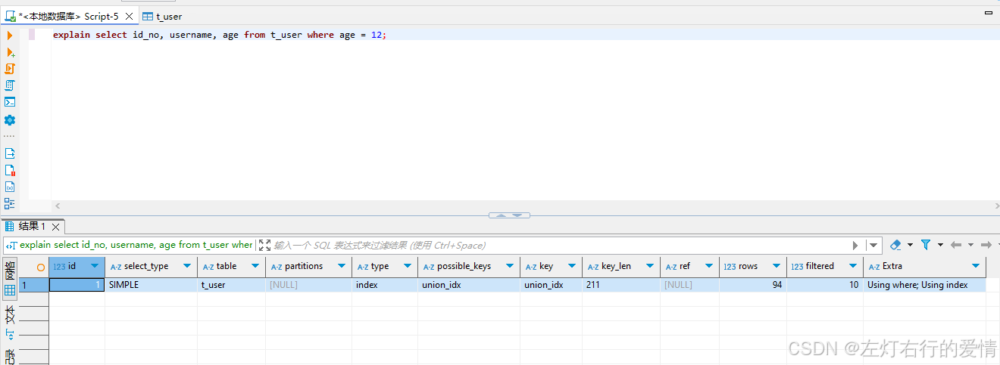  
 无论查询条件是username还是age，都走了索引，根据key\_len可以看出使用了索引的所有列。

我们换成\*号  
 第一条explain执行:  
 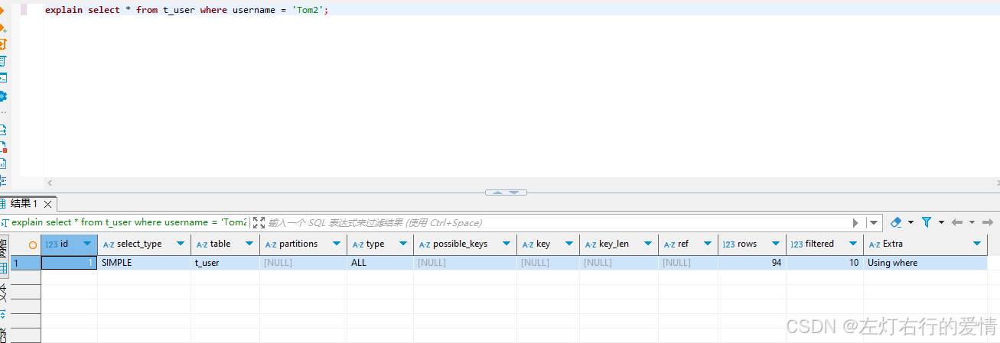  
 第二条explain执行:  
 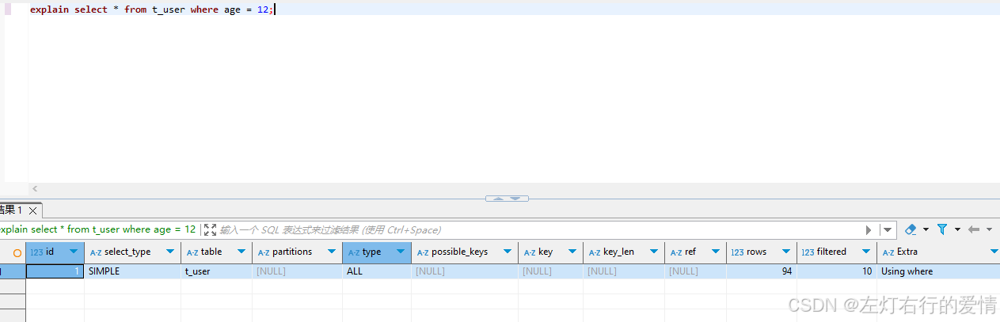  
 可以看到他们都没有走索引  
 .  
 但是看到这里你是不是有个疑问呢?

##### 不满足最左匹配原则,但为什么走了索引

我们按下面例子去解释:

```
explain select id_no, username, age from t_user where age = 12;


```

首先我们的索引如下:  
 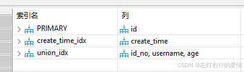  
 也就是说只有第三个union\_idex索引才可能用到age去查.  
 但是它并不满足最左匹配原则啊!!!  
 为什么最后还是显示用了索引呢?  
 答:  
 虽然 union\_idx 无法用于 WHERE age = 12 的索引查找，但 它可以作为覆盖索引，这是因为：

1. 索引中包含 id\_no, username, age，刚好覆盖查询所需的所有列，不需要回表。
2. 即使 MySQL 不能高效利用 age 进行索引查找，它仍然可以进行索引扫描（INDEX 类型），即

* MySQL 可能直接扫描整个 union\_idx 索引，然后在索引中筛选 age = 12。
* 由于所有需要的列 (id\_no, username, age) 已经在索引里，所以 MySQL 可以避免回表查询。

所以最后还是用到了索引.

---

那第二种索引失效场景是：在联合索引下，尽量使用明确的查询列来趋向于走覆盖索引；

#### 索引列参与运算

直接来看示例：

```
explain select * from t_user where id + 1 = 2 ;


```

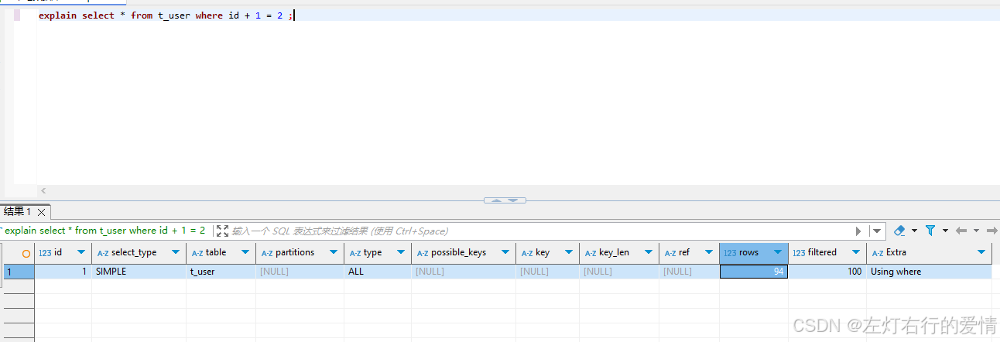  
 可以看到，即便id列有索引，由于进行了计算处理，导致无法正常走索引。  
 针对这种情况，其实不单单是索引的问题，还会增加数据库的计算负担。  
 数据库需要全表扫描出所有的id字段值，然后对其计算，计算之后再与参数值进行比较。如果每次执行都经历上述步骤，性能损耗可想而知。  
 建议的使用方式是：先在内存中进行计算好预期的值，或者在SQL语句条件的右侧进行参数值的计算。  
 那优化如下:

```
-- 内存计算，得知要查询的id为1
explain select * from t_user where id = 1 ;
-- 参数侧计算
explain select * from t_user where id = 2 - 1 ;


```

下面只分析一种,另外一条同理,explain如下:  
 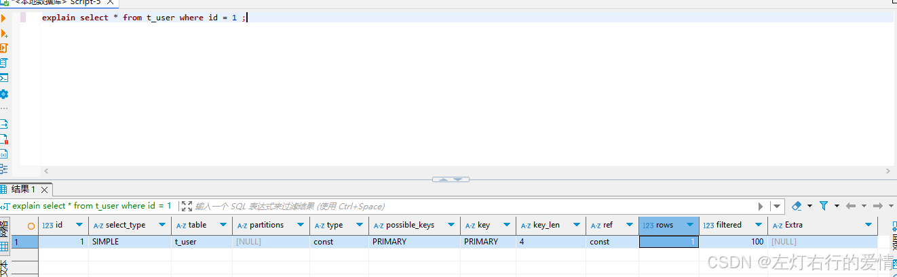

#### 索引列使用了函数

```
explain select * from t_user where SUBSTR(id_no,1,3) = '100';


```

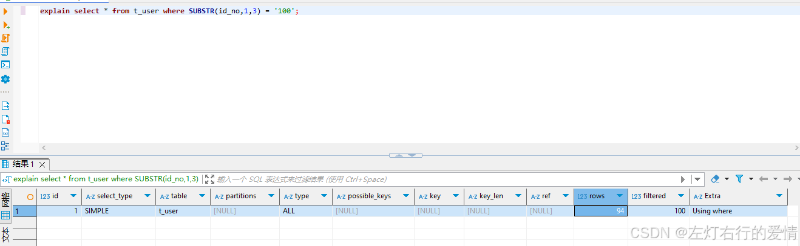  
 索引失效的原因与第三种情况一样，都是因为数据库要先进行全表扫描，获得数据之后再进行截取、计算，导致索引索引失效。同时，还伴随着性能问题。  
 解决方案可参考第三种场景，可考虑先通过内存计算或其他方式减少数据库来进行内容的处理。

#### 错误的Like使用-模糊匹配占位符位于条件首部

```
explain select * from t_user where id_no like '%00%';


```

explain结果:  
 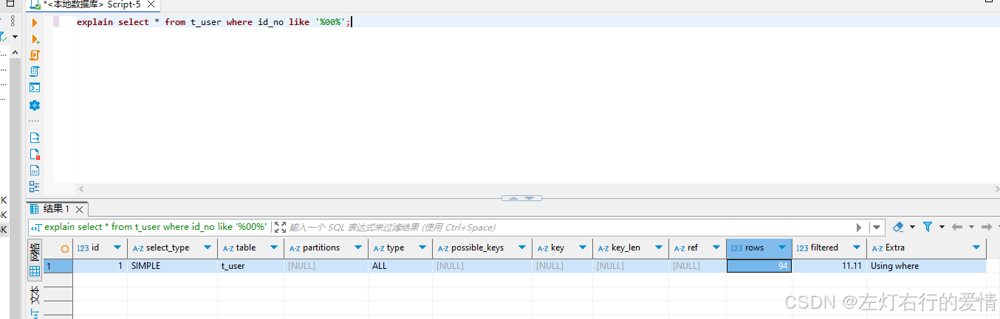  
 针对like的使用非常频繁，但使用不当往往会导致不走索引。常见的like使用方式有：  
 方式一：like ‘%abc’；  
 方式二：like ‘abc%’；  
 方式三：like ‘%abc%’；  
 其中方式一和方式三，由于占位符出现在首部，导致无法走索引。这种情况不做索引的原因很容易理解，索引本身就相当于目录，从左到右逐个排序。而条件的左侧使用了占位符，导致无法按照正常的目录进行匹配，导致索引失效就很正常了。  
 方式二的explain可以看到是走索引了:  
 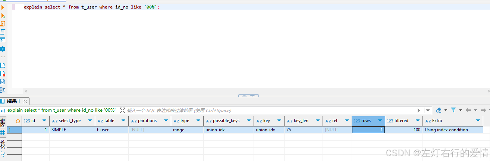

第五种索引失效情况：模糊查询时（like语句），模糊匹配的占位符位于条件的首部。

#### 类型隐式转换

```
explain select * from t_user where id_no = 1002;


```

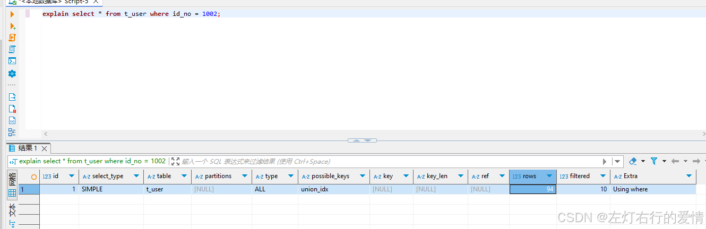  
 id\_no字段类型为varchar，但在SQL语句中使用了int类型，导致全表扫描。  
 **出现索引失效的原因是：varchar和int是两个种不同的类型。**  
 解决方案就是将参数1002添加上单引号或双引号。  
 但是有个特例–字段是Int类型时,查询条件添加单引号或者双引号,MySQL会转换参数为Int类型(虽然使用了单引号或者双引号):

```
explain select * from t_user where id = '2';


```

下图可以看出是走索引了的:  
 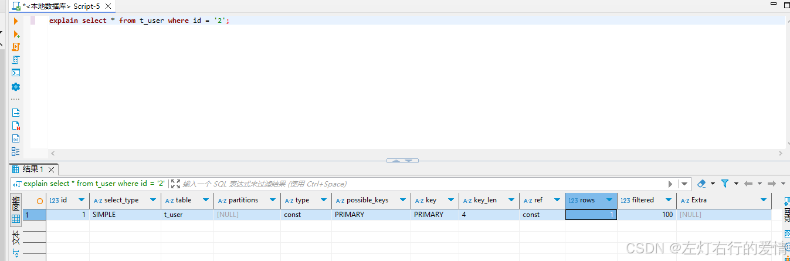

#### 使用OR操作-存在一个条件不走索引

OR是日常使用最多的操作关键字了，但使用不当，也会导致索引失效。  
 示例：

```
explain select * from t_user where id = 2 or username = 'Tom2';


```

explain结果：  
 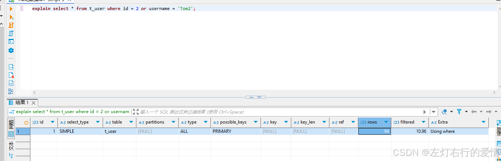明明id字段是有索引的，由于使用or关键字，索引竟然失效了。  
 其实，换一个角度来想，如果单独使用username字段作为条件很显然是全表扫描，既然已经进行了全表扫描了，前面id的条件再走一次索引反而是浪费了。所以，在使用or关键字时，切记两个条件都要添加索引，否则会导致索引失效。  
 我们现在加上针对username的索引,再执行一次看看:  
 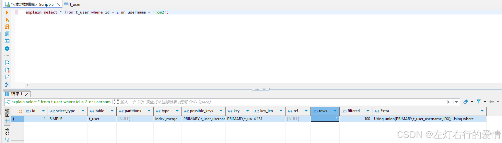  
 发现现在是有索引了.

---

如果or两边同时使用“>”和“<”，则索引也会失效：

```
explain select * from t_user where id  > 1 or id  < 80;


```

explain结果：  
 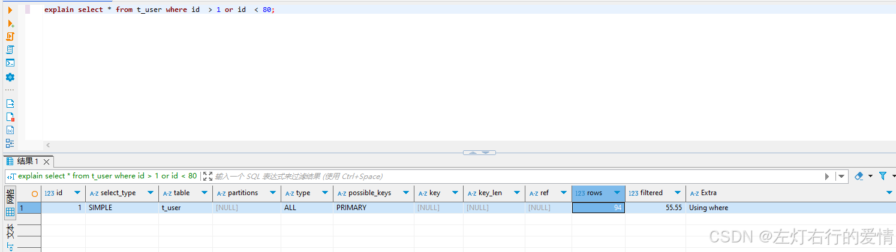

查询条件使用or关键字，其中一个字段没有创建索引，则会导致整个查询语句索引失效； or两边为“>”和“<”范围查询时，索引失效。

#### 两列作比较

如果两个列数据都有索引，但在查询条件中对两列数据进行了对比操作，则会导致索引失效。

**这里举个不恰当的示例**，比如age小于id这样的两列（真实场景可能是两列同维度的数据比较，这里迁就现有表结构,注意我这里是不恰当的,是不恰当的示例,仅仅是为了说明这种情况,不代表会有这样的业务场景!!!）：

```
explain select * from t_user where id > age;


```

explain结果：  
 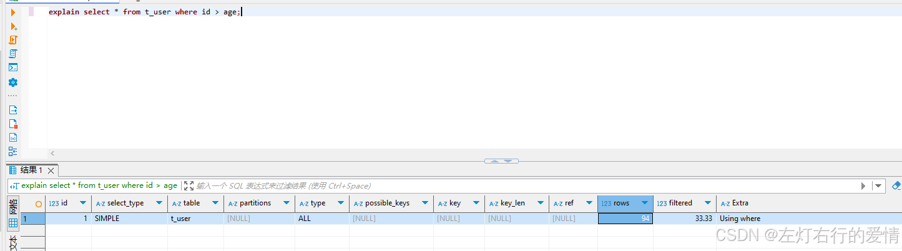  
 **两列数据做比较，即便两列都创建了索引，索引也会失效。**

#### 不等于比较(只有字符串)-不一定会失效

示例：

```
explain select * from t_user where id_no <> '1002';


```

explain结果：  
 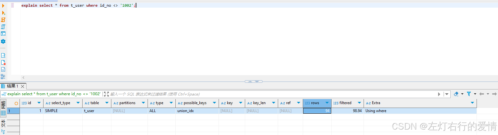  
 当**查询条件为字符串时**，使用”<>“或”!=“作为条件查询，**有可能不走索引，但也不全是。**  
 比如:

```
explain select * from t_user where create_time != '2022-02-27 09:56:42';


```

上述SQL中，由于“2022-02-27 09:56:42”是存储过程在同一秒生成的，大量数据是这个时间。执行之后会发现，当查询结果集占比比较小时，会走索引，占比比较大时不会走索引。此处与结果集与总体的占比有关。  
 **所以是不是会走索引不是一定的情况,而是分析器会去分析,选出成本最小的方案.**

需要注意的是：上述语句如果是id进行不等操作，则正常走索引。

```
explain select * from t_user where id != 2;


```

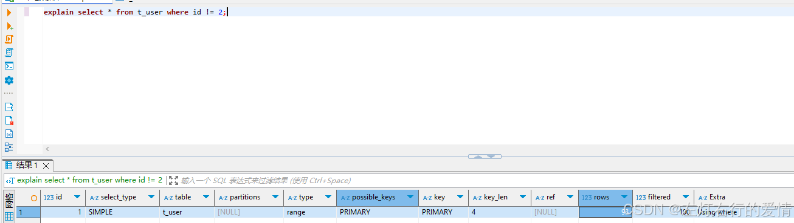  
 **查询条件使用不等进行比较时，需要慎重，普通索引会查询结果集占比较大时索引会失效。**

#### Is Not Null

示例：

```
explain select * from t_user where id_no is not null;


```

explain结果：  
 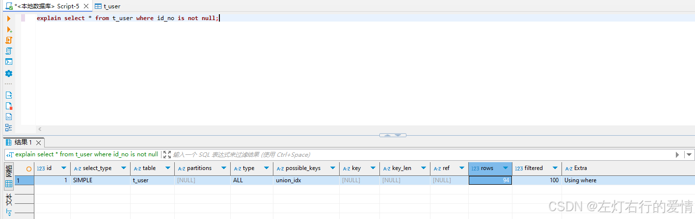  
 查询条件使用is null时正常走索引，使用is not null时，不走索引。

#### Not In(主键不会失效) && Not Exists

下例:

```
explain select * from t_user where id_no not in('1002' , '1003');


```

explain结果：  
 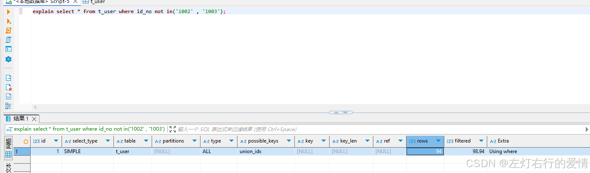  
 当使用not in时，不走索引？把条件列换成主键试试：

```
explain select * from t_user where id not in (2,3);


```

explain结果：  
 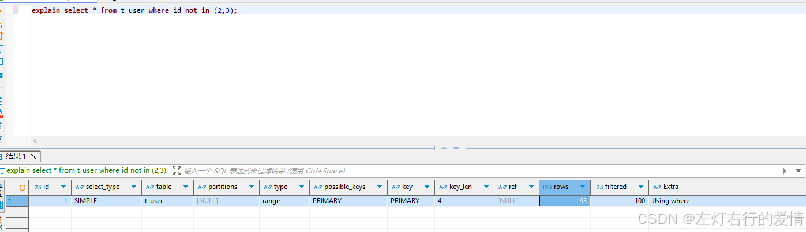  
 查询条件使用not in时，如果是主键则走索引，如果是普通索引，则索引失效。

---

对于Not Exists 而言:

```
explain select * from t_user u1 where not exists (select 1 from t_user u2 where u2.id  = 2 and u2.id = u1.id);


```

explain结果：  
 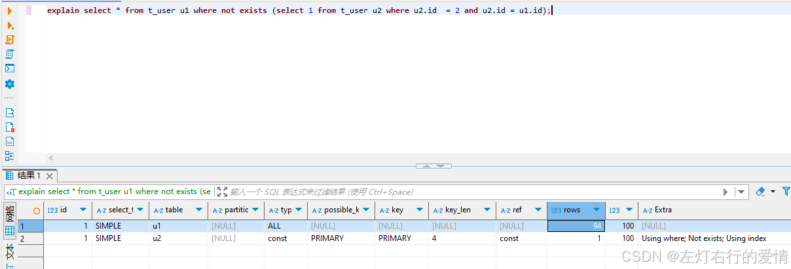  
 **当查询条件使用not exists时，不走索引。**

#### Order By导致索引失效(但不是全部失效,有特例)

示例：

```
explain select * from t_user order by id_no ;


```

explain结果：  
 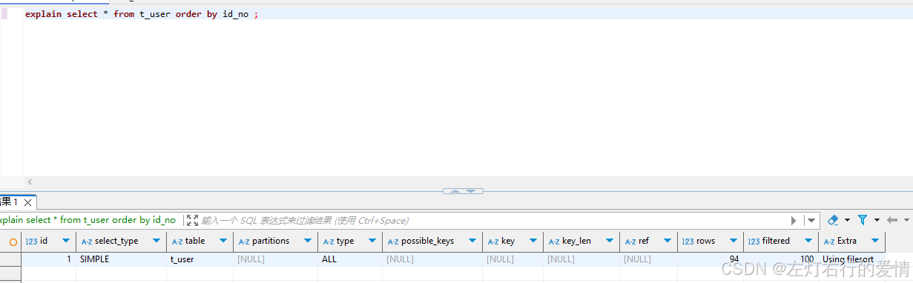  
 其实这种情况的索引失效很容易理解，毕竟需要对全表数据进行排序处理。

那么，添加添加limit关键字是否就走索引了呢？

```
explain select * from t_user order by id_no limit 10;


```

explain结果：  
 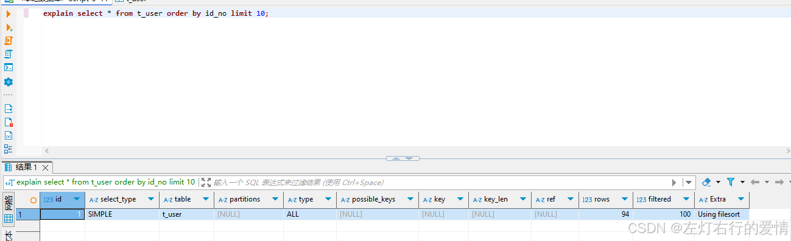  
 其实从执行过程也可以想到,limit是最后才处理的,前面该怎么查还是怎么查.  
 网上说order by条件满足最左匹配则会正常走索引这种情况会比较复杂一点,我们来直接给结论:  
 **如果 ORDER BY 满足最左匹配，且排序方向一致，就能走索引，避免 filesort**  
 举例:

```
explain SELECT * FROM t_user WHERE id_no = '123456' ORDER BY username, age;


```

explain如下:  
 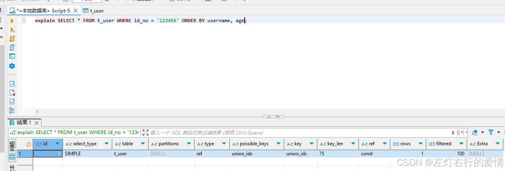  
 上面这种就是用order by可以走索引的情况

还有个特例,就是主键使用order by时，可以正常走索引。

```
explain select * from t_user order by id desc;


```

explain结果:  
 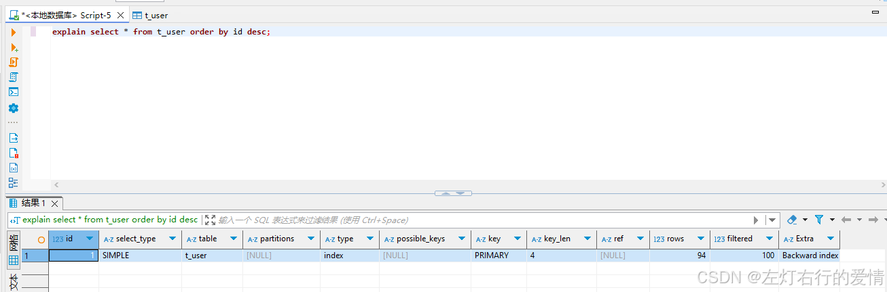

#### 全表扫描比索引快

Mysql优化器的其他优化策略，比如优化器认为在某些情况下，全表扫描比走索引快，则它就会放弃索引。  
 针对这种情况，一般不用过多理会，当发现问题时再定点排查即可。
