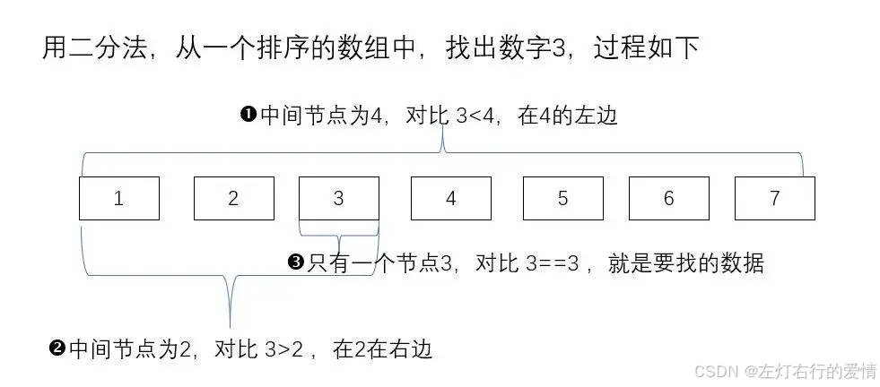
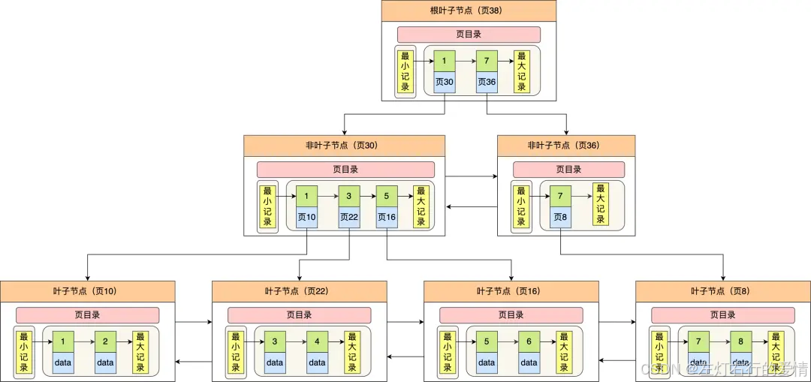

> 原文：[CSDN](https://blog.csdn.net/qq_45852626/article/details/145485391)（历史文章导入，当前状态为草稿）

## B+树索引数据结构
## 前言

相信你在面试时，通常会被问到“什么是索引？”而你一定要能脱口而出：**索引是提升查询速度的一种数据结构。**  
 索引之所以能提升查询速度，在于它在插入时对数据进行了排序.  
 那么它的缺点也显而易见,**影响插入或者更新的性能**.  
 所以，索引是一门排序的艺术，有效地设计并创建索引，会提升数据库系统的整体性能。  
 在目前的 MySQL 8.0 版本中，InnoDB 存储引擎支持的索引有 B+ 树索引、全文索引、R 树索引。这一章我们就先关注使用最为广泛的 B+ 树索引。

## 什么样的索引数据结构是好的

### 搜索速度要求

MySQL 的数据是持久化的,那么数据(索引+记录)是保存在磁盘上的.  
 磁盘是一个慢的离谱的存储设备(比从内存中读取要慢上万甚至几十万倍).  
 磁盘读写的最小单位是扇区(大小512B),OS一次读写多个扇区,所以OS最小读写单位是块(Block).  
 Linux中的块大小为4KB,也就是一次磁盘 I/O 操作会直接读写 8 个扇区。  
 因为索引是存在磁盘上,所以通过索引去找数据就会经历下面的路径:  
 读取索引:磁盘–>内存  
 读取数据(通过索引): 磁盘上找到某行–>内存  
 整个查询过程发生多次磁盘I/O,次数越多,消耗时间越大.  
 所以,索引的数据结构应该能在尽可能少的磁盘I/O操作中查询工作,因为磁盘I/O操作越小,所消耗的时间也就越小.

### 支持范围查找

MySQL 是支持范围查找的，所以索引的数据结构不仅要能高效地查询某一个记录,而且还要能高效地执行范围查找.

---

所以设计一个适合MySQL索引的数据结构,要满足下面要求:

* 能在尽可能少的磁盘的 I/O 操作中完成查询工作
* 能高效地查询某一个记录，也要能高效地执行范围查找；

### 寻求适合查找的算法

既然我们的索引数据最后肯定是排列好的,那么二分查找算法可以高效去定位数据.二分查找法每次都把查询的范围减半，这样时间复杂度就降到了 O(logn).  
 但是注意: **每次查找都需要不断计算中间位置**  
 

### 寻求合适的数据结构

用数组来实现线性排序的数据虽然简单好用,但是插入元素的时候性能太低,如果是发生在磁盘中,那性能是灾难性的,而且每次查找都要不断计算中间位置.  
 那什么是非线性且天生适合二分查找的数据结构呢?  
 二叉树是非常适合的,但是普通的二叉树是不行的,因为普通二叉树没有顺序的概念.  
 但是二叉查找树可以.

#### 二叉查找树

**二叉查找树的特点:一个节点的左子树所有节点都小于这个节点,右子树所有节点都大于这个节点.**  
 这样我们无需计算中间节点的位置,且节点是有序的.  
 另外也解决了插入新节点的问题,因为是跳跃结构,不必连续排列.  
 但是它会有个极端情况:  
 每次插入元素如果都是二叉树最大的元素,会退化成一条链表,查找数据时间复杂度变为了O(n).  
 由于树是存储在磁盘中的，访问每个节点，都对应一次磁盘 I/O 操作,也就是说**树的高度就等于每次查询数据时磁盘 IO 操作的次数**,所以树的高度不能太高.  
 那怎么解决呢?

#### 自平衡二叉树

为了解决二叉查找树会在极端情况下退化成链表的问题,那我用平衡二叉查找树(AVL树)不就好了嘛.  
 它的特点是: 在二叉查找树基础上添加一些条件约束:  
 **每个节点的左子树和右子树的高度差不能超过 1**.  
 这样查询操作的时间复杂度就会一直维持在 O(logn) 。  
 可以这样问题解决了,不会退化成链表了,但是还有个问题,树的高度太高了,这肯定是不行的,磁盘I/O操作次数必须要低.  
 因为二叉树每个节点只有两个子节点,所以高度肯定会高,那怎么办呢?

#### B树

B树的特点: 每个节点可以有M个子节点(M>2),从而降低树的高度.  
 这样就解决了树的高度问题.  
 但是节点包含的数据都是索引+记录.  
 所以存在一些问题:

1. **记录数据的大小可能会远远超过索引数据**,这样就需要花费更多磁盘I/O操作次数来读到有用的索引数据.
2. **我们查询的数据从磁盘加载到内存,那是记录的数据是没用的**,我们只想读取这些节点的索引数据来做比较查询,这样会占用内存资源.
3. 我们做范围查询时,需要使用中序遍历,这会涉及多个节点磁盘I/O问题,导致整体速度下降.(因为B树叶子节点没有链表,每次查询都需要回溯父节点,继续中序遍历,导致额外的磁盘I/O)  
    那这三个问题如何解决?

#### B+树

##### 数据结构

B+树节点是数据页,存放用户的记录和各种信息,每个数据页默认大小是16KB.

1. 内部节点(非叶子节点)

* 只存储键值(key),不存储实际数据
* 每个内部节点维护多个子节点指针,提供高效查询路径

2. 叶子节点

* 存储实际数据,是终端节点
* 所有数据只存储在叶子节点
* 叶子节点之间通过双向链表相连,支持范围查询的高效遍历  
   如下图所示:  
   

##### B+与B树比较

| 对比项 | B 树 | B+ 树 |
| --- | --- | --- |
| **数据存储** | 内部节点 & 叶子节点都存数据 | 只有叶子节点存数据 |
| **索引结构** | 无叶子节点之间的链表连接 | 叶子节点用链表连接 |
| **范围查询** | 需要回溯父节点，较慢 | 叶子节点顺序扫描，较快 |
| **单点查询** | `O(log N)` | `O(log N)` |
| **树的高度** | 相对较高 | 更矮更宽，查询路径更短 |

## 总结

MySQL 默认的存储引擎 InnoDB 采用的是 B+ 作为索引的数据结构，原因有:

* 树的非叶子节点不存放实际的记录数据，仅存放索引，因此数据量相同的情况下，相比存储即存索引又存记录的 B 树，B+树的非叶子节点可以存放更多的索引.**因此 B+ 树可以比 B 树更「矮胖」，查询底层节点的磁盘 I/O次数会更少。**
* B+ 树有大量的冗余节点（所有非叶子节点都是冗余索引），这些冗余索引让 B+ 树在插入、删除的效率都更高，比如删除根节点的时候，不会像 B 树那样会发生复杂的树的变化；
* B+ 树叶子节点之间用链表连接了起来，有利于范围查询，而 B 树要实现范围查询，B+ 树叶子节点之间用链表连接了起来，有利于范围查询，而 B 树要实现范围查询，
