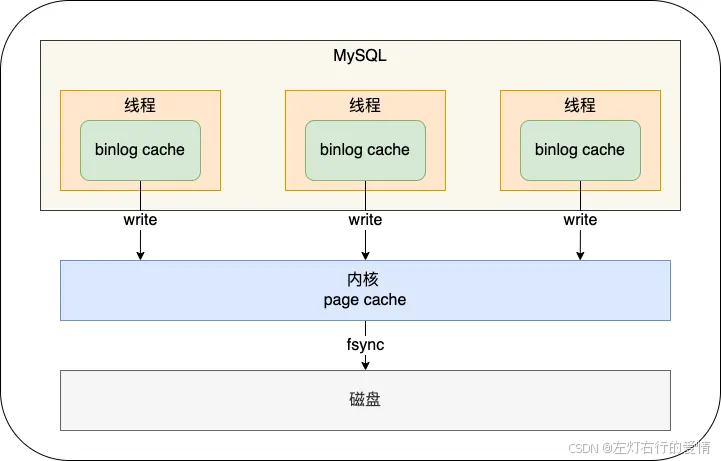

> 原文：[CSDN](https://blog.csdn.net/qq_45852626/article/details/145588432)（历史文章导入，当前状态为草稿）

## undo Log日志工作原理
## 前言

前面介绍的 undo log 和 redo log 这两个日志都是 Innodb 存储引擎生成的。  
 一定要先明白什么是undo log和redo log再来看这篇哈.

## 什么是bin log

binlog是Mysql sever层维护的一种二进制日志，与innodb引擎中的redo/undo log是完全不同的日志；  
 其主要是用来记录对mysql数据更新或潜在发生更新的SQL语句，并以"事务"的形式保存在磁盘中；  
 换句话说:  
 MySQL 在完成一条更新操作后，Server 层还会生成一条 binlog，等之后事务提交的时候，会将该事物执行过程中产生的所有binlog 统一写 入 binlog 文件。  
 **binlog 文件是记录了所有数据库表结构变更和表数据修改的日志，不会记录查询类的操作，比如 SELECT 和 SHOW 操作**。

## bin log 和redo log 的区别是什么

### 用途不同

binlog 用于备份恢复、主从复制;  
 redo log 用于掉电等故障恢复

redo log 是循环写，是会边写边擦除日志的，只记录未被刷入磁盘的数据的物理日志，已经刷入磁盘的数据都会从 redo log 文件里擦除。

bin log 保存的全量日志,也就是保存了所有数据变更的情况，理论上只要记录在 binlog 上的数据，都可以恢复,所以如果不小心整个数据库的数据被删除了，得用 binlog 文件恢复数据。

### 写入方式不同

binlog 是追加写，写满一个文件，就创建一个新的文件继续写，不会覆盖以前的日志，保存的是全量的日志。

redo log 是循环写，日志空间大小是固定，全部写满就从头开始，保存未被刷入磁盘的脏页日志。

### 文件格式不同

#### binlog

binlog 有 3 种格式类型，分别是 STATEMENT（默认格式）、ROW、 MIXED.

##### statement

每一条修改数据的 SQL 都会被记录到 binlog 中,相当于记录了逻辑操作，所以针对这种格式， binlog 可以称为逻辑日志.  
 主从复制中 slave 端再根据 SQL 语句重现。

##### 缺点:动态函数的问题

比如你用了 uuid 或者 now 这些函数，你在主库上执行的结果并不是你在从库执行的结果，这种随时在变的函数会导致复制的数据不一致；

##### row

记录行数据最终被修改成什么样了.  
 这种格式的日志，就不能称为逻辑日志.

##### 缺点:每行数据的变化结果都会被记录

比如执行批量 update 语句，更新多少行数据就会产生多少条记录，使 binlog 文件过大.

##### mixed

包含了 STATEMENT 和 ROW 模式，它会根据不同的情况自动使用 ROW 模式和 STATEMENT 模式；

#### redo log

是物理日志，记录的是在某个数据页做了什么修改,比如对 XXX 表空间中的 YYY 数据页 ZZZ 偏移量的地方做了AAA 更新；

### 适用对象不同

* binlog 是 MySQL 的 Server 层实现的日志，所有存储引擎都可以使用.
* redo log 是 Innodb 存储引擎实现的日志；

## bin log 什么时候刷盘

事务执行过程中，先把日志写到 binlog cache（Server 层的 cache）.  
 事务提交的时候，再把 binlog cache 写到 binlog 文件中。  
 一个事务的 binlog 是不能被拆开的，因此无论这个事务有多大（比如有很多条语句），也要保证一次性写入。  
 不能拆开的原因:  
 一个线程只能同时有一个事务在执行的设定,每当执行一个 begin/start transaction 的时候，就会默认提交上一个事,务.  
 如果一个事务的 binlog 被拆开的时候，在备库执行就会被当做多个事务分段自行,这样破坏了原子性，是有问题的.

MySQL 给每个线程分配了一片内存用于缓冲 binlog ，该内存叫 binlog cache,MySQL 给每个线程分配了一片内存用于缓冲 binlog ，该内存叫 binlog cache.  
 如果超过了这个参数规定的大小，就要暂存到磁盘。

### 什么时候会写入磁盘

在事务提交的时候，执行器把 binlog cache 里的完整事务写入到 binlog 文件中,并清空 binlog cache。如下图：  
   
 每个线程有自己 binlog cache，但是最终都写到同一个 binlog 文件:

* 图中的 write，指的就是指把日志写入到 binlog 文件,write 的写入速度还是比较快的，因为不涉及磁盘 I/O。
* 图中的 fsync，才是将数据持久化到磁盘的操作，这里就会涉及磁盘 I/O，所以频繁的 fsync 会导致磁盘的 I/O 升高。  
   MySQL提供一个 sync\_binlog 参数来控制数据库的 binlog 刷到磁盘上的频率:
* sync\_binlog = 0  
   每次提交事务都只 write，不 fsync，后续交由操作系统决定何时将数据持久化到磁盘；
* sync\_binlog = 1  
   每次提交事务都会 write，然后马上执行 fsync
* sync\_binlog = 2  
   每次提交事务都 write，但累积 N 个事务后才 fsync

在MySQL中系统默认的设置是 sync\_binlog = 0，也就是不做任何强制性的磁盘刷新指令.  
 性能是最好的，但是风险也是最大的,一旦主机发生异常重启，还没持久化到磁盘的数据就会丢失。

如果能容少量事务的 binlog 日志丢失的风险，为了提高写入的性能，一般会 sync\_binlog 设置为 100~1000 中的某个数值。

## 总结

当学完bin log 的时候,应该是对三种日志的概念,作用,和区别有清楚的认知,这样后面了解二阶段提交的时候才不会懵.
