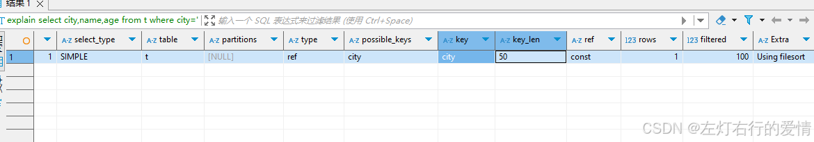
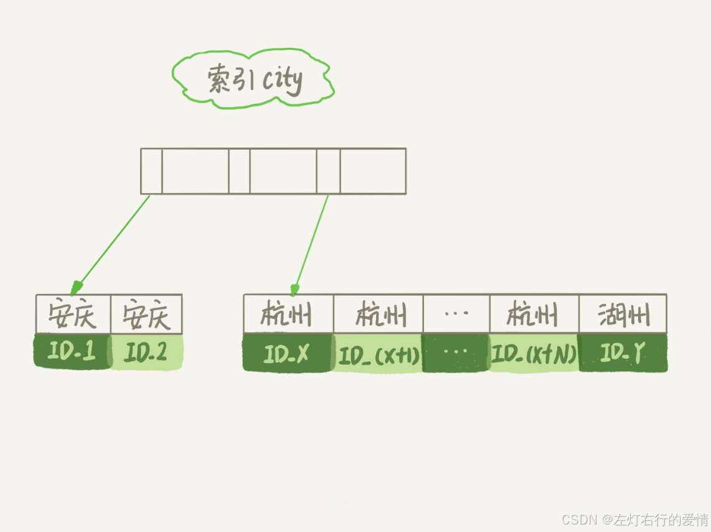
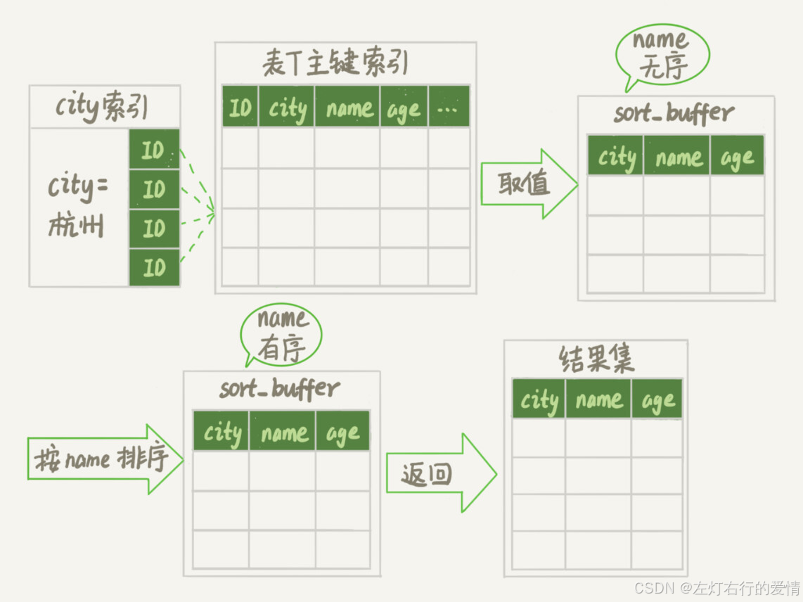
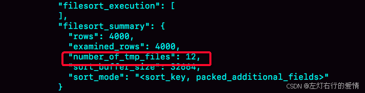
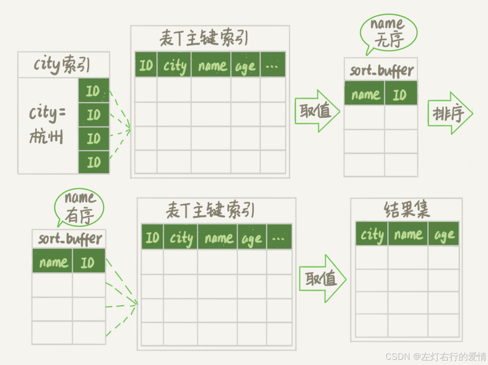
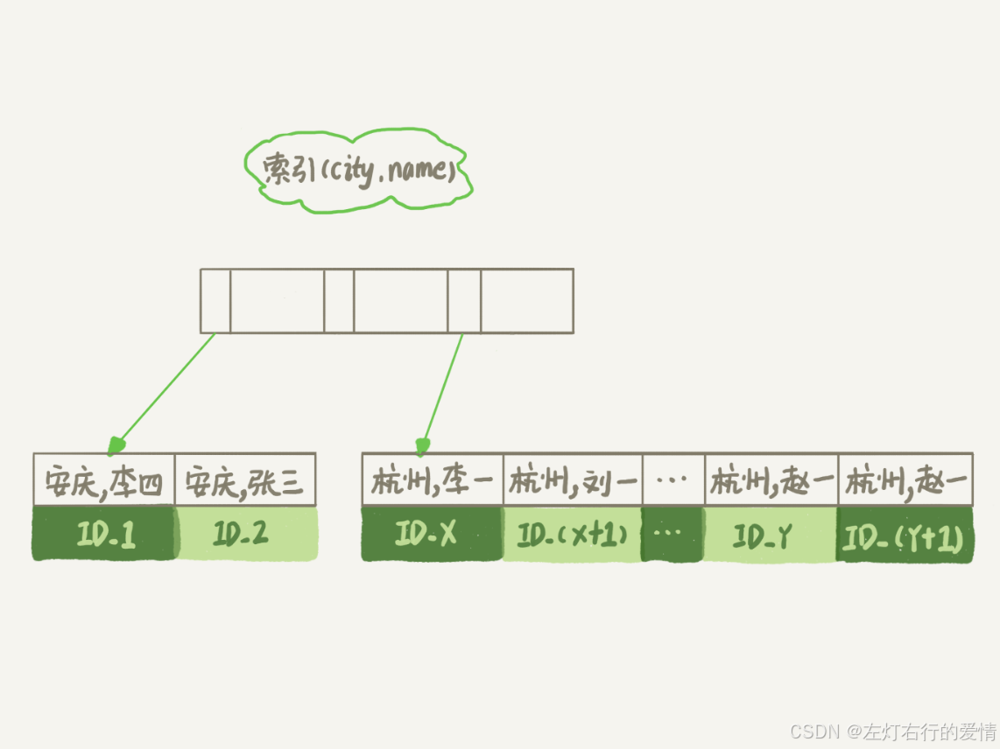
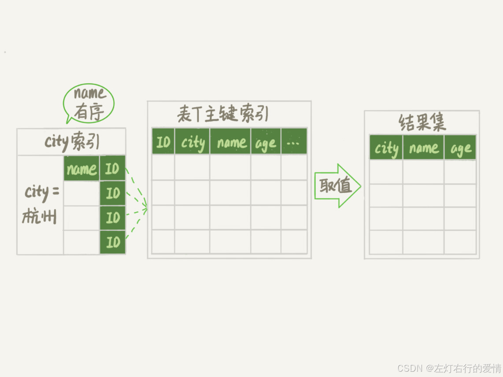
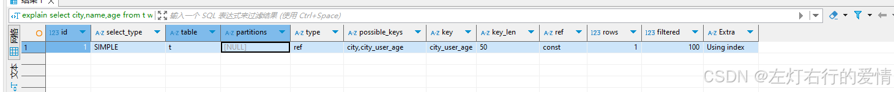

> 原文：[CSDN](https://blog.csdn.net/qq_45852626/article/details/145448311)（历史文章导入，当前状态为草稿）

### 前言

这篇文章是对知识内容进行整合加上自己的理解,文章内容来自于各种文章,书籍,工作号内容.  
 下面的内容我会列举是在哪里看的,然后写一下我自己的理解和总结.  
 如果感觉不清楚的,可以去看一下原创.

### Order by 工作原理

Order by我学习的文章是极客时间mysql45讲里面的内容.

#### 前置知识 - sort\_buffer

SortBuffer（排序缓冲区）是用于执行ORDER BY和GROUP BY等需要进行**排序操作**的查询时使用的一种内存缓冲区。MySQL使用它来优化这些操作，以提高查询性能。

##### 关键的变量

* sort\_buffer\_size: 分配给每个需要进行排序操作线程的缓冲区大小
* read\_rnd\_buffer\_size: 指定用于顺序读取按排序顺序存储的行缓冲区大小.

##### 工作原理

执行一个包含ORDER BY或GROUP BY的查询时，MySQL可能会使用SortBuffer来对数据进行排序。  
 如果所需排序的数据量小于或等于sort\_buffer\_size设定的值，那么整个排序过程可以在内存中完成，这通常更快。  
 但如果数据量超过了SortBuffer的容量，MySQL将不得不使用磁盘临时文件来辅助排序，这会显著降低性能。  
 所以能看到,sort\_buffer\_size值的设置还是很重要的,它会影响到排序进行在内存中还是磁盘中.

##### 优化建议

**调整sort\_buffer\_size：**  
 对于大型数据集，适当增加sort\_buffer\_size可以帮助减少排序操作的时间。不过，需要注意的是，过大的值可能导致内存消耗过多，尤其是在高并发环境下。  
 **索引优化：**  
 很多时候，通过添加合适的索引可以直接避免某些排序操作，因为MySQL能够直接利用索引的有序性来满足查询需求，从而不需要额外的排序步骤。

---

order by可以让指定的字段排序来显示结果.  
 那么排序有几种方式:

* 全字段排序
* rowId排序  
   下面我们分别对它们进行介绍和比较

下面我们给出一个sql例子来帮助我们去分析这个流程,如下:  
 假设你要查询城市是“杭州”的所有人名字，并且按照姓名排序返回前 1000 个人的姓名、年龄。  
 这个表的部分定义是这样的:

```
CREATE TABLE `t` (
  `id` int(11) NOT NULL,
  `city` varchar(16) NOT NULL,
  `name` varchar(16) NOT NULL,
  `age` int(11) NOT NULL,
  `addr` varchar(128) DEFAULT NULL,
  PRIMARY KEY (`id`),
  KEY `city` (`city`)
) ENGINE=InnoDB;

我们SQL语句如下:
select city,name,age from t where city='杭州'
order by name limit 1000  ;


```

我们就根据上面给的表和sql去分析它的执行流程.

### 全字段和rowId

全字段排序 (Full Field Sort / Sort by Tuple)：MySQL 读取所有需要参与排序的列（以及 SELECT 出来的列），把这些列的数据一起放到排序缓冲区（sort buffer）里进行排序。排完序后，直接就能得到最终结果。

rowid 排序 (Sort by RowID / Tag Sort)：MySQL 先只读取排序依据的列和行的唯一标识（比如 InnoDB 表的主键，可以理解为 rowid），把这些 “(排序键, rowid)” 对放到排序缓冲区里排序。排序完成后，MySQL 得到一个排好序的 rowid 列表，然后再根据这些 rowid 回到原始表中去读取 SELECT 子句中需要的其他列。

MySQL 会根据 max\_length\_for\_sort\_data 参数来决定使用哪种排序算法:

```
-- 查看参数值(默认 1024 字节)
SHOW VARIABLES LIKE 'max_length_for_sort_data';


```

判断逻辑:

* 如果单行数据长度 ≤ max\_length\_for\_sort\_data,使用全排序
* 如果单行数据长度 > max\_length\_for\_sort\_data,使用rowid 排序

#### 全字段排序

首先你可以看到,为了避免全表扫描,我们在city字段上加了索引.  
 那么用explain执行一下就可以发现:  
   
 Extra 这个字段中的“Using filesort”表示的就是需要排序，MySQL 会给每个线程分配一块内存用于排序，称为 sort\_buffer。  
 为了说明这个 SQL 查询语句的执行过程，我们先来看一下 city 这个索引的示意图。  
   
 满足 city=‘杭州’条件的行，是从 IDX 到 ID(X+N) 的这些记录。  
 这个语句执行流程如下:

1. 初始化sort\_buffer,确定放入 name、city、age 这三个字段；
2. 从索引 city 找到第一个满足 city=‘杭州’条件的主键 id，也就是图中的 ID\_X；
3. 拿主键 id 索引取出整行，取 name、city、age 三个字段的值，存入 sort\_buffer 中；
4. 从索引 city 取下一个记录的主键 id；
5. 重复步骤 3、4 直到 city 的值不满足查询条件为止，对应的主键 id 也就是图中的 ID\_Y；
6. 对 sort\_buffer 中的数据按照字段 name 做快速排序；
7. 按照排序结果取前 1000 行返回给客户端。  
    用示意图来表示如下:  
      
    从上面我们可以看到,全字段排序是mysql需要将**查询涉及的**(sql要查的)所有列数据都加载到排序缓冲区,然后在内存或者磁盘上进行排序,是一种在缺乏有效索引支持时MySQL用来对查询结果进行排序的机制.

##### 内存排序OR磁盘排序

图中“按 name 排序”这个动作，可能在内存中完成，也可能需要使用外部排序，这取决于排序所需的内存和参数 sort\_buffer\_size。  
 你可以用下面介绍的方法，来确定一个排序语句是否使用了临时文件。

```
/* 打开 optimizer_trace，只对本线程有效 */
SET optimizer_trace='enabled=on'; 
 
/* @a 保存 Innodb_rows_read 的初始值 */
select VARIABLE_VALUE into @a from  performance_schema.session_status where variable_name = 'Innodb_rows_read';
 
/* 执行语句 */
select city, name,age from t where city='杭州' order by name limit 1000; 
 
/* 查看 OPTIMIZER_TRACE 输出 */
SELECT * FROM `information_schema`.`OPTIMIZER_TRACE`\G
 
/* @b 保存 Innodb_rows_read 的当前值 */
select VARIABLE_VALUE into @b from performance_schema.session_status where variable_name = 'Innodb_rows_read';
 
/* 计算 Innodb_rows_read 差值 */
select @b-@a;


```

这个方法是通过查看 OPTIMIZER\_TRACE 的结果来确认的，你可以从 number\_of\_tmp\_files 中看到是否使用了临时文件。  
   
 number\_of\_tmp\_files 表示的是，排序过程中使用的临时文件数。你一定奇怪，为什么需要 12 个文件？内存放不下时，就需要使用外部排序，外部排序一般使用归并排序算法。可以这么简单理解，MySQL 将需要排序的数据分成 12 份，每一份单独排序后存在这些临时文件中。然后把这 12 个有序文件再合并成一个有序的大文件。

如果 sort\_buffer\_size 超过了需要排序的数据量的大小，number\_of\_tmp\_files 就是 0，表示排序可以直接在内存中完成。

否则就需要放在临时文件中排序。sort\_buffer\_size 越小，需要分成的份数越多，number\_of\_tmp\_files 的值就越大。

接下来，我再和你解释一下图 4 中其他两个值的意思。

我们的示例表中有 4000 条满足 city=‘杭州’的记录，所以你可以看到 examined\_rows=4000，表示参与排序的行数是 4000 行。

sort\_mode 里面的 packed\_additional\_fields 的意思是，排序过程对字符串做了“紧凑”处理。即使 name 字段的定义是 varchar(16)，在排序过程中还是要按照实际长度来分配空间的。

同时，最后一个查询语句 select @b-@a 的返回结果是 4000，表示整个执行过程只扫描了 4000 行。

这里需要注意的是，为了避免对结论造成干扰，我把 internal\_tmp\_disk\_storage\_engine 设置成 MyISAM。否则，select @b-@a 的结果会显示为 4001。

这是因为查询 OPTIMIZER\_TRACE 这个表时，需要用到临时表，而 internal\_tmp\_disk\_storage\_engine 的默认值是 InnoDB。如果使用的是 InnoDB 引擎的话，把数据从临时表取出来的时候，会让 Innodb\_rows\_read 的值加 1。

#### rowId排序

在上面这个算法过程里面，只对原表的数据读了一遍，剩下的操作都是在 sort\_buffer 和临时文件中执行的。  
 那如果我要返回的字段特别多,那么 sort\_buffer 里面要放的字段数太多，这样内存里能够同时放下的行数很少，要分成很多个临时文件，排序的性能会很差,所以如果单行很大，这个方法效率不够好。  
 所以在 MySQL 认为排序的单行长度太大时,我们可以通过修改一下参数,让MySQL采用另外一个算法:

```
SET max_length_for_sort_data = 16;


```

max\_length\_for\_sort\_data，是 MySQL 中专门控制用于排序的行数据的长度的一个参数。它的意思是，如果单行的长度超过这个值，MySQL 就认为单行太大，要换一个算法。  
 city、name、age 这三个字段的定义总长度是 36，我把 max\_length\_for\_sort\_data 设置为 16，我们再来看看计算过程有什么改变。  
 放入 sort\_buffer 的字段只有需要排序的列（即 name 字段）和主键 id。  
 导致排序后的结果因为少了 city 和 age 字段的值，不能直接返回了,整个执行流程如下:

1. 初始化 sort\_buffer，确定放入两个字段，即 name 和 id；
2. 从索引 city 找到第一个满足 city=‘杭州’条件的主键 id，也就是图中的 ID\_X；
3. 到主键 id 索引取出整行，取 name、id 这两个字段，存入 sort\_buffer 中；
4. 从索引 city 取下一个记录的主键 id；
5. 重复步骤 3、4 直到不满足 city=‘杭州’条件为止，也就是图中的 ID\_Y；
6. 对 sort\_buffer 中的数据按照字段 name 进行排序；
7. 遍历排序结果，取前 1000 行，并按照 id 的值回到原表中取出 city、name 和 age 三个字段返回给客户端。  
      
    rowId排序多访问了一次表t的主键索引,就是步骤7.  
    最后的“结果集”是一个逻辑概念，实际上 MySQL 服务端从排序后的 sort\_buffer 中依次取出 id，然后到原表查到 city、name 和 age 这三个字段的结果，不需要在服务端再耗费内存存储结果，是直接返回给客户端的。

#### 全字段排序 VS rowId排序

如果MySQL担心排序内存大小,会影响排序效率,才会使用rowId排序算法.  
 好处: 在排序过程中一次可以排序更多行  
 坏处: 需要再回到原表去取数据  
 如果排序内存足够大,会优先选择全字段排序,把需要的字段都放到sort\_buffer中,这样排序后可以直接从内存中返回查询结果.  
 这里体现了MySQL的一个设计思想: **如果内存够，就要多利用内存，尽量减少磁盘访问。**

#### 必须要执行排序吗?

看到这你应该明白一件事情,MySQL做排序是一个成本较高的操作.  
 但并不是所有的order by都需要去排序.  
 从上面的分析过程可以看出,**MySQL生成临时表并去排序,本质来说是原来的数据都是无序的.**  
 可以设想下，如果能够保证从 city 这个索引上取出来的行，天然就是按照 name 递增排序的话，是不是就可以不用再排序了呢？

确实是这样的。

所以，我们可以在这个市民表上创建一个 city 和 name 的联合索引，对应的 SQL 语句是：

```
alter table t add index city_user(city, name);


```

  
 这样整个查询过程的流程就变成了：

1. 从索引 (city,name) 找到第一个满足 city=‘杭州’条件的主键 id；
2. 到主键 id 索引取出整行，取 name、city、age 三个字段的值，作为结果集的一部分直接返回；
3. 从索引 (city,name) 取下一个记录主键 id；
4. 重复步骤 2、3，直到查到第 1000 条记录，或者是不满足 city=‘杭州’条件时循环结束。  
      
    最后用explain来印证一下:  
      
    可以看到,Extra里面是Using Index,表示的使用了覆盖索引,性能上会快很多很多.  
    当然，这里并不是说要为了每个查询能用上覆盖索引，就要把语句中涉及的字段都建上联合索引，毕竟索引还是有维护代价的。这是一个需要权衡的决定。

### 特殊情况-不创建内存缓冲区,直接使用内存临时表

存在的优化场景

```
  SELECT category, COUNT(*) as cnt
  FROM products
  GROUP BY category
  ORDER BY category;  -- 按分组键排序

  如果 GROUP BY 创建临时表时已经按 category 有序（比如使用了索引），那么 ORDER BY category
  就不需要再排序，直接使用临时表结果即可。

  EXPLAIN 结果：
  - Extra: Using temporary ✓（有临时表）
  - Extra: Using filesort ✗（无需额外排序）

 最佳实践是让 GROUP BY 和 ORDER BY 使用相同的列顺序：
  -- 好的写法（可能避免 filesort）
  GROUP BY a, b ORDER BY a, b

  -- 需要额外排序
  GROUP BY a, b ORDER BY COUNT(*)
  


```

典型场景对比

| 场景 | 临时表 | 排序缓冲区 | Extra 信息 |
| --- | --- | --- | --- |
| GROUP BY category ORDER BY category | ✓ | 可能不需要 | Using temporary |
| GROUP BY category ORDER BY COUNT(\*) | ✓ | ✓ 需要 | Using temporary; Using filesort |
| ORDER BY name（无索引） | ✗ | ✓ 需要 | Using filesort |
| ORDER BY id（有索引） | ✗ | ✗ | 直接用索引 |

#### 思考题

假设你的表里面已经有了 city\_name(city, name) 这个联合索引，然后你要查杭州和苏州两个城市中所有的市民的姓名，并且按名字排序，显示前 100 条记录。如果 SQL 查询语句是这么写的 ：

```
select * from t where city in ('杭州'," 苏州 ") order by name limit 100;


```

那么，这个语句执行的时候会有排序过程吗，为什么？

如果业务端代码由你来开发，需要实现一个在数据库端不需要排序的方案，你会怎么实现呢？

进一步地，如果有分页需求，要显示第 101 页，也就是说语句最后要改成 “limit 10000,100”， 你的实现方法又会是什么呢？

---

解答  
 a.首先有排序过程的  
 虽然有 (city,name) 联合索引，对于单个 city 内部，name 是递增的。但是由于这条 SQL 语句不是要单独地查一个 city 的值，而是同时查了”杭州”和” 苏州 “两个城市，因此所有满足条件的 name 就不是递增的了。也就是说，这条 SQL 语句需要排序。  
 b. 如何避免呢?  
 这里，我们要用到 (city,name) 联合索引的特性，把这一条语句拆成两条语句，执行流程如下：

1. 执行 select \* from t where city=“杭州” order by name limit 100; 这个语句是不需要排序的，客户端用一个长度为 100 的内存数组 A 保存结果。
2. 执行 select \* from t where city=“苏州” order by name limit 100; 用相同的方法，假设结果被存进了内存数组 B。
3. 现在 A 和 B 是两个有序数组，然后你可以用归并排序的思想，得到 name 最小的前 100 值，就是我们需要的结果了。  
    c. 分页改写

如果把这条 SQL 语句里“limit 100”改成“limit 10000,100”的话，处理方式其实也差不多，即：要把上面的两条语句改成写：

```
select * from t where city=" 杭州 " order by name limit 10100; 
和
 select * from t where city=" 苏州 " order by name limit 10100。


```

这时候数据量较大，可以同时起两个连接一行行读结果，用归并排序算法拿到这两个结果集里，按顺序取第 10001~10100 的 name 值，就是需要的结果了。

当然这个方案有一个明显的损失，就是从数据库返回给客户端的数据量变大了。  
 所以，如果数据的单行比较大的话，可以考虑把这两条 SQL 语句改成下面这种写法：

```
select id,name from t where city=" 杭州 " order by name limit 10100; 
和
select id,name from t where city=" 苏州 " order by name limit 10100。


```

然后，再用归并排序的方法取得按 name 顺序第 10001~10100 的 name、id 的值，然后拿着这 100 个 id 到数据库中去查出所有记录。
