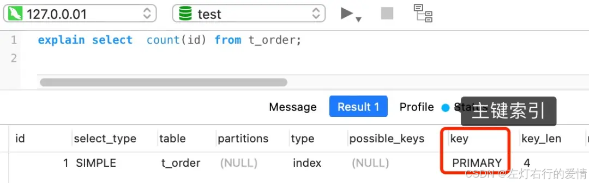
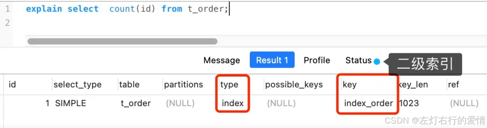
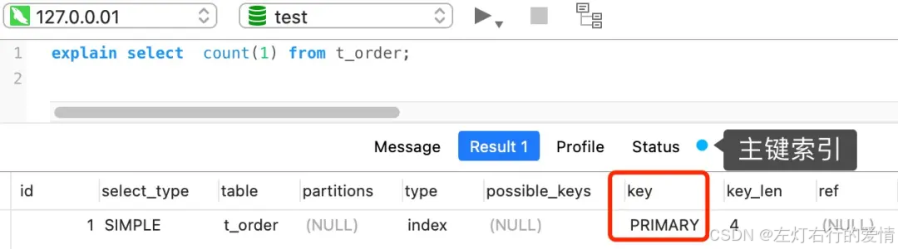
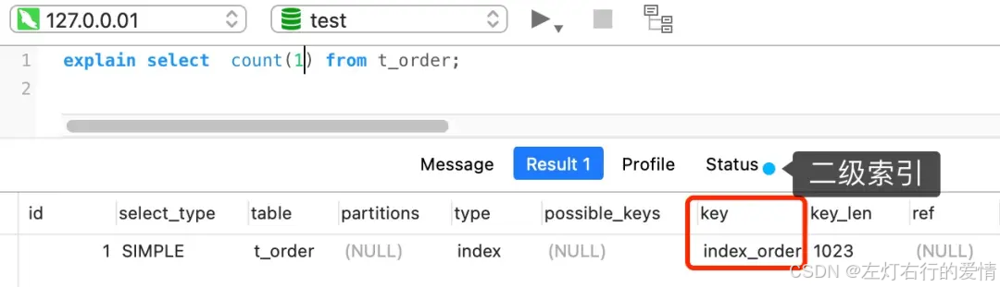
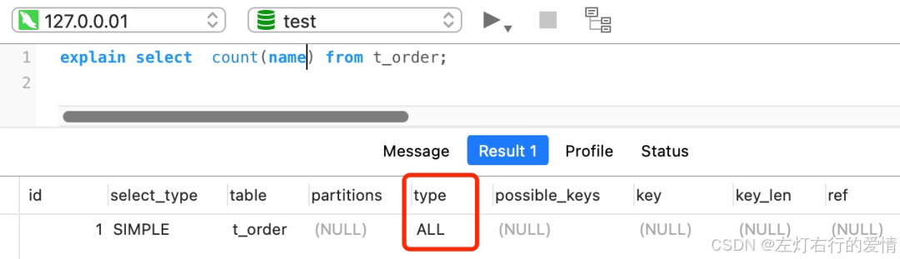
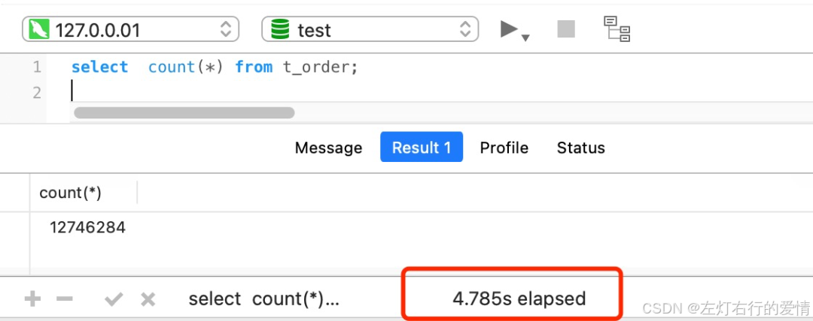
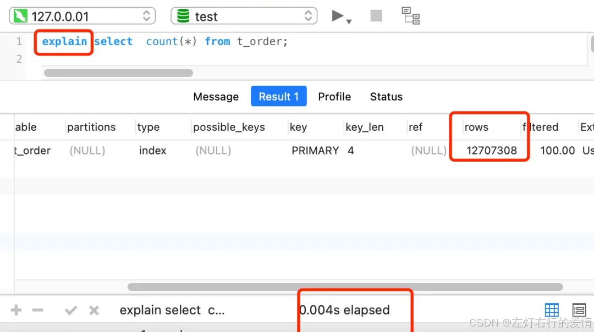

> 原文：[CSDN](https://blog.csdn.net/qq_45852626/article/details/145461951)（历史文章导入，当前状态为草稿）

## 前言

我们对数据表统计的时候,习惯性用count函数来统计,但是count函数里面参数有很多,比如count(1),count(\*),count(字段),它们的效率有区别吗?

## 结论

按照性能排序  
 count(\*)=count(1)>count(主键字段)>count(字段)

## count是什么

count()是一个聚合函数,函数的参数可以是任意表达式,不限于字段名.  
 该函数的作用是: 统计符合查询条件的记录中,函数指定参数不为null的记录有多少个  
 假设 count() 函数的参数是字段名,如下:

```
select count(name) from t_order


```

语句是统计「 t\_order 表中，name 字段不为 NULL 的记录」有多少个.也就是说,如果某一条记录中的name为null,则不会被统计进去.  
 假设 count() 函数的参数是数字 1 这个表达式，如下:

```
select count(1) from t_order


```

语句是统计「 t\_order 表中，1 这个表达式不为 NULL 的记录」有多少个.  
 1表达式为单纯的数字,它永远不是NULL,所以上面的语句就是统计t\_order表中有多少个记录.

## count(主键字段)执行过程是什么样的

在通过count函数统计多少记录时,MySQL的Server层会统计维护一个名为count的变量.  
 Server层会循环向InnoDB读取一条记录,如果count函数指定的参数不为Null,那么就会对count+1,直到符合查询的全部记录读取完,就退出循环.  
 最后将count变量的值发送给客户端.  
 nnoDB 是通过 B+ 树来保存记录的，根据索引的类型又分为聚簇索引和二级索引，它们区别在于,聚簇索引的叶子节点存放的是实际数据，而二级索引的叶子节点存放的是主键值，而不是实际数据.  
 下面举个例子来说:

```
select count(id) from t_order


```

如果表里只有主键索引，没有二级索引时，那么，InnoDB 循环遍历聚簇索引，将读取到的记录返回给 server 层，然后读取记录中的 id 值，就会 id 值判断是否为 NULL，如果不为NULL,就将count变量+1.  
   
 但是如果表中有二级索引,那么InnoDB 循环遍历的对象就不是聚簇索引，而是二级索引.  
   
 因为相同数量的二级索引记录比聚簇索引记录占用更少存储空间,所以二级索引树更小,遍历二级索引I/O成本比遍历聚簇索引的I/O成本小,因此优化器优先选择的是二级索引.

## count(1)执行过程是什么样子的

下面这条语句作为例子:

```
select count(1) from t_order


```

表里只有主键索引,没有二级索引时:  
   
 InnoDB 循环遍历聚簇索引（主键索引），将读取到的记录返回给 server 层，但是不会读取记录中的任何字段的值.  
 因为 count 函数的参数是 1，不是字段，所以不需要读取记录中的字段值。  
 因此server层每从InnoDB读取到一条记录,就将count变量+1.  
 count(1) 相比 count(主键字段) 少一个步骤，就是不需要读取记录中的字段值,所以count(1)的执行效率比count(主键字段)高一点.  
 但是如果表里有二级索引,遍历对象就是二级索引了.  
 

## count(0)执行过程是怎么样的

和count(1)一样哦.

## count(字段)执行过程是怎么样的

执行效率相比前面的 count(1)、 count(\*)、 count(主键字段) 执行效率是最差.  
 下面这条语句作为例子:

```
select count(name) from t_order


```

对于这个查询,会触发全表扫描,所以它的执行效率是比较差的.  
 

## 如何优化count(\*)

对一张大表经常用 count(\*) 来做统计，其实是很不好的.  
 下面我这个案例，表 t\_order 共有 1200+ 万条记录，我也创建了二级索引，但是执行一次 `select count(*) from t_order`要花费将近5秒!  
   
 我们下面介绍两种方法key进行优化

### 近似值处理

业务对于统计个数不需要很精确，比如搜索引擎在搜索关键词的时候，给出的搜索结果条数是一个大概值.  
   
 我们就可以使用 show table status 或者 explain 命令来表进行估算.  
 行 explain 命令效率是很高的，因为它并不会真正的去查询,下图中的 rows 字段值就是 explain 命令对表的估算值:  
 

### 额外表保存计数值

想精确的获取表的记录总数，我们可以将这个计数值保存到单独的一张计数表中.  
 我们在数据表插入一条记录的同时，将计数表中的计数字段 + 1。也就是说，在新增和删除操作时，我们需要额外维护这个计数表.

## 小结

count函数执行时,如果表里有二级索引,优化器会优先选择二级索引进行扫描.  
 所以如果要执行count函数时,进行在数据表上建立二级索引,这样优化器会自动采用key\_len最小的二级索引进行扫描  
 还有尽量不要用count(字段)来统计个数,效率是最差的,会采用全表扫描,如果非要这样做,建议给字段创建一个二级索引.
