> 原文：[CSDN](https://blog.csdn.net/qq_45852626/article/details/145478383)（历史文章导入，当前状态为草稿）

### 前言

用系统分层架构，为了加速数据访问，会把最常访问的数据，放在缓存(cache)里，避免每次都去访问数据库。  
 操作系统，会有缓冲池(buffer pool)机制，避免每次访问磁盘，以加速数据的访问。  
 MySQL作为一个存储系统，同样具有缓冲池(buffer pool)机制，以避免每次查询数据都进行磁盘IO。

### 为什么会有Buffer Pool

虽然说 MySQL 的数据是存储在磁盘里的，但是也不能每次都从磁盘里面读取数据,这样性能太差了.  
 要想提升查询性能，加个缓存就行了嘛。把磁盘上的数据加载到内存中，避免每次访问都进行磁盘IO，起到加速访问的作用。  
 所以,InnoDB设计了一个缓冲池（Buffer Pool），来提高数据库的读写性能。  
 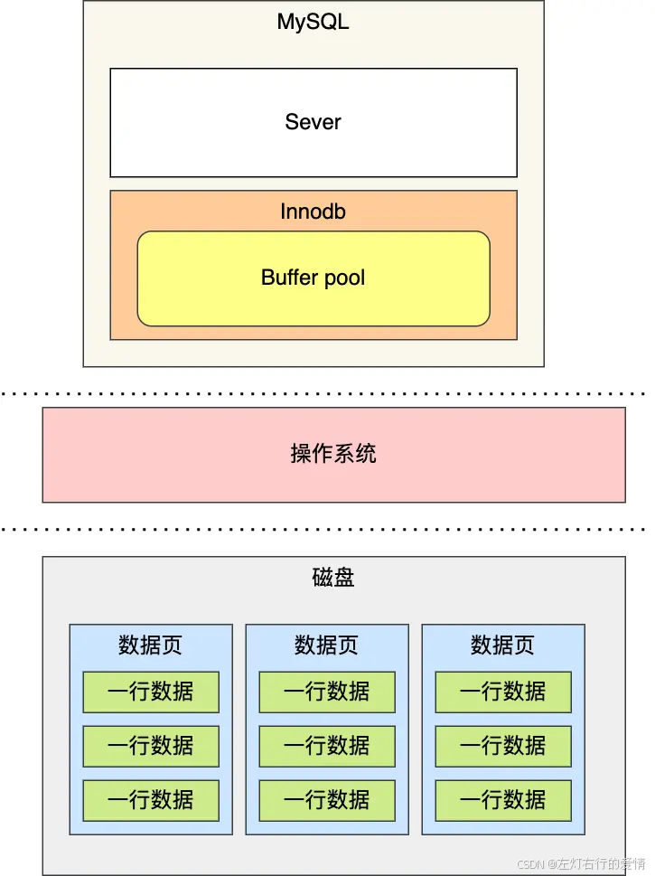  
 有了缓冲池,我们可以看到:

* 当读取数据时，如果数据存在于 Buffer Pool 中，客户端就会直接读取 Buffer Pool 中的数据，否则再去磁盘中读取。
* 当修改数据时，首先是修改 Buffer Pool 中数据所在的页，然后将其页设置为脏页，最后由后台线程将脏页写入到磁盘。

### Buffer Pool介绍

#### Buffer Pool有多大

uffer Pool 是在 MySQL 启动的时候，向操作系统申请的一片连续的内存空间，默认配置下 Buffer Pool 只有 128MB 。  
 不过你可以根据`innodb_buffer_pool_size`参数来设置Buffer Pool 的大小.

#### Buffer Pool缓存什么呢

InnoDB 会把存储的数据划分为若干个「页」，以页作为磁盘和内存交互的基本单位，一个页的默认大小为 16KB。因此，Buffer Pool 同样需要按「页」来划分。  
 InnoDB 会为 Buffer Pool 申请一片连续的内存空间，然后按照默认的16KB的大小划分出一个个的页， Buffer Pool 中的页就叫做缓存页,此时这些缓存页都是空闲的，之后随着程序的运行，才会有磁盘上的页被缓存到 Buffer Pool 中。

Buffer Pool 除了缓存「索引页」和「数据页」，还包括了 undo 页，插入缓存、自适应哈希索引、锁信息等等。  
 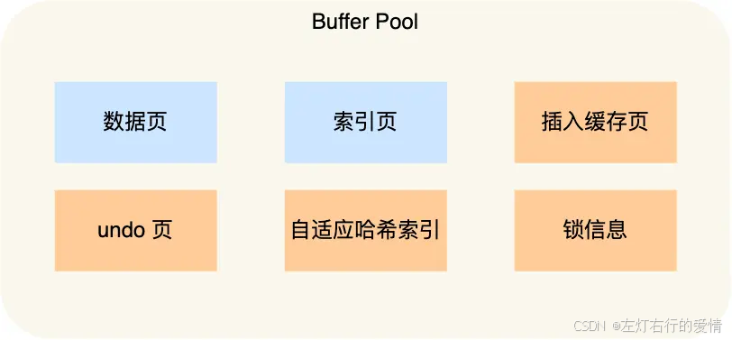  
 数据类型一多就不好管理了,所以为每个缓存页都设置了一个控制块,控制块的信息包括:缓存页的表空间、页号、缓存页地址、链表节点等.  
 控制块也是占有内存空间的，它是放在 Buffer Pool 的最前面，接着才是缓存页.  
 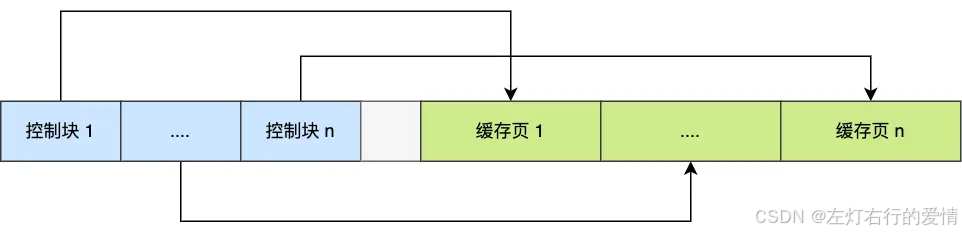  
 上图中控制块和缓存页之间灰色部分称为碎片空间。

再补充一下:  
 Buffer Pool是InnoDB用来缓存数据的内存区域，它由两部分组成：

* 控制块区域（前部分）
* 缓存页数据区域（后部分）

每个缓存页（通常16KB）都有一个对应的控制块，作用如下：

* 记录这个缓存页属于哪个表空间
* 记录这个缓存页的页号
* 存储缓存页在内存中的地址指针
* 包含链表节点信息（如LRU链表、脏页链表的节点指针）

这种设计的好处：

* 所有控制块集中存储，便于统一管理
* 系统可以快速查找和定位特定的缓存页
* 控制块比缓存页小很多，集中放置提高了内存访问效率

简单理解：控制块就像是每个缓存页的"身份证"和"地址簿"，集中放在Buffer Pool的前面部分，方便系统快速找到并管理每个缓存页。

##### Buffer Pool碎片空间

每一个控制块都对应一个缓存页，那在分配足够多的控制块和缓存页后，可能剩余的那点儿空间不够一对控制块和缓存页的大小，用不到的那点儿内存空间就被称为碎片了.

##### 查询一条记录，就只需要缓冲一条记录吗

不是的.  
 当我们查询一条记录时，InnoDB 是会把整个页的数据加载到 Buffer Pool 中，因为，通过索引只能定位到磁盘中的页，而不能定位到页中的一条记录。将页加载到 Buffer Pool 后，再通过页里的页目录去定位到某条具体的记录。

#### 如何管理Buffer Pool

##### 如何管理空闲页

为了能够快速找到空闲的缓存页，可以使用链表结构，将空闲缓存页的「控制块」作为链表的节点，这个链表称为 Free 链表（空闲链表）.  
 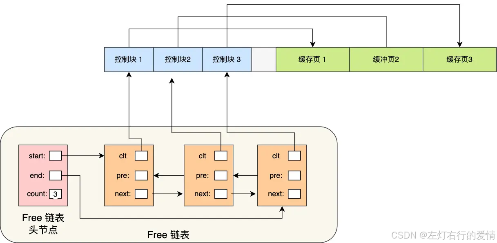  
 Free 链表上除了有控制块，还有一个头节点，该头节点包含链表的头节点地址，尾节点地址，以及当前链表中节点的数量等信息。  
 Free 链表节点是一个一个的控制块，而每个控制块包含着对应缓存页的地址,所以相当于 Free 链表节点都对应一个空闲的缓存页。

有了 Free 链表后，每当需要从磁盘中加载一个页到 Buffer Pool 中时，就从 Free链表中取一个空闲的缓存页，并且把该缓存页对应的控制块的信息填上，然后把该缓存页对应的控制块从 Free 链表中移除。

##### 如何管理脏页

设计 Buffer Pool 除了能提高读性能，还能提高写性能，也就是更新数据的时候，不需要每次都要写入磁盘，而是将 Buffer Pool 对应的缓存页标记为脏页，然后再由后台线程将脏页写入到磁盘。  
 那为了能快速知道哪些缓存页是脏的，于是就设计出 Flush 链表，它跟 Free 链表类似的，链表的节点也是控制块，区别在于 Flush 链表的元素都是脏页。  
 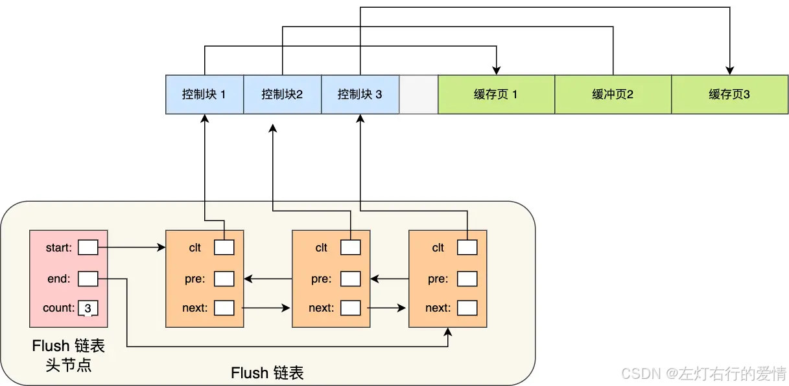

##### 如何提高缓存命中率

Buffer Pool 的大小是有限的，对于一些频繁访问的数据我们希望可以一直留在 Buffer Pool 中,而一些很少访问的数据希望可以在某些时机可以淘汰掉.  
 要实现这个，最容易想到的就是 LRU（Least recently used）算法.  
 **该算法的思路是，链表头部的节点是最近使用的，而链表末尾的节点是最久没被使用的。**  
 那么，当空间不够了，就淘汰最久没被使用的节点，从而腾出空间。

简单的 LRU 算法的实现思路是这样的

* 当访问的页在 Buffer Pool 里,就直接把该页对应的 LRU 链表节点移动到链表的头部。
* 当访问的页不在 Buffer Pool 里,除了要把页放入到 LRU 链表的头部，还要淘汰 LRU 链表末尾的节点.  
   比如下图，假设 LRU 链表长度为 5，LRU 链表从左到右有 1，2，3，4，5 的页.  
   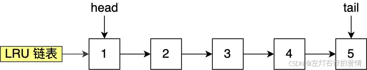  
   如果访问了 3 号的页，因为 3 号页在 Buffer Pool 里，所以把 3 号页移动到头部即可。  
   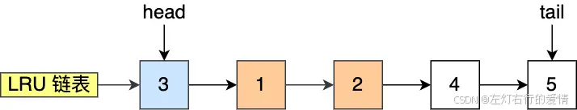  
   而如果接下来，访问了 8 号页，因为 8 号页不在 Buffer Pool 里，所以需要先淘汰末尾的 5 号页，然后再将 8 号页加入到头部。  
   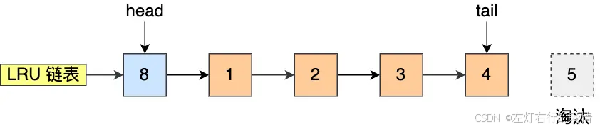

到这里我们可以知道，Buffer Pool 里有三种页和链表来管理数据。  
 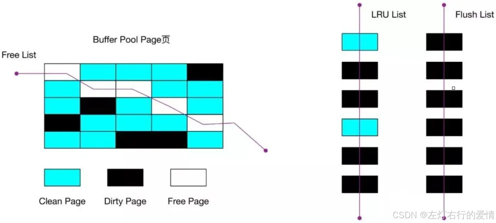

* Free Page（空闲页），表示此页未被使用，位于 Free 链表；
* Clean Page（干净页），表示此页已被使用，但是页面未发生修改，位于LRU 链表。
* Dirty Page（脏页），表示此页「已被使用」且「已经被修改」，其数据和磁盘上的数据已经不一致。当脏页上的数据写入磁盘后，内存数据和磁盘数据一致，那么该页就变成了干净页。脏页同时存在于 LRU 链表和 Flush 链表。

#### LRU带来的问题

简单的 LRU 算法并没有被 MySQL 使用,简单的 LRU 算法无法避免下面这两个问题:

* 预读失效；
* Buffer Pool 污染；

##### 预读失效

预读机制:程序是有空间局部性的，靠近当前被访问数据的数据，在未来很大概率会被访问到。  
 MySQL 在加载数据页时，会提前把它相邻的数据页一并加载进来，目的是为了减少磁盘 IO。  
 预读失效:但是可能这些被提前加载进来的数据页，并没有被访问，相当于这个预读是白做了，

如果这些预读页如果一直不会被访问到，就会出现一个很奇怪的问题:

1. 不会被访问的预读页却占用了 LRU 链表前排的位置
2. 末尾淘汰的页，可能是频繁访问的页  
    这样大大降低了缓存命中率.

如何解决呢?

要避免预读失效带来影响，最好就是**让预读的页停留在 Buffer Pool 里的时间要尽可能的短,让真正被访问的页才移动到 LRU 链表的头部,从而保证真正被读取的热数据留在 Buffer Pool 里的时间尽可能长.**  
 那到底怎么去做呢?  
 MySQL 是这样做的，它改进了 LRU 算法，将 LRU 划分了 2 个区域：old 区域 和 young 区域。  
 young 区域在 LRU 链表的前半部分，old 区域则是在后半部分，如下图：  
 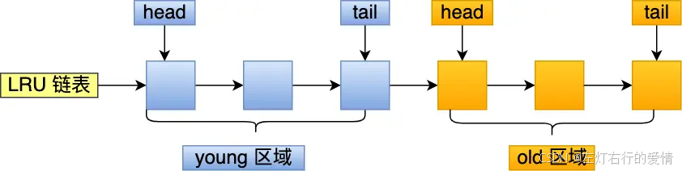  
 old 区域占整个 LRU 链表长度的比例可以通过 `innodb_old_blocks_pct` 参数来设置，默认是 37，代表整个 LRU 链表中 young 区域与 old 区域比例是 63:37。  
 **划分这两个区域后，预读的页就只需要加入到 old 区域的头部，  
 当页被真正访问的时候，才将页插入 young 区域的头部**。  
 如果预读的页一直没有被访问，就会从 old 区域移除，这样就不会影响 young 区域中的热点数据。

举例子来看:  
 假设有一个长度为 10 的 LRU 链表，其中 young 区域占比 70 %，old 区域占比 30 %。  
 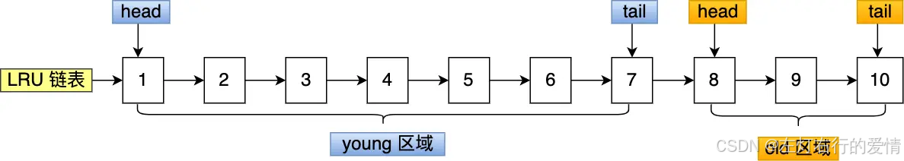  
 现在有个编号为 20 的页被预读了，这个页只会被插入到 old 区域头部，而 old 区域末尾的页（10号）会被淘汰掉。  
 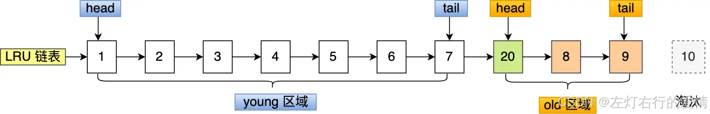  
 如果 20 号页一直不会被访问，它也没有占用到 young 区域的位置，而且还会比 young 区域的数据更早被淘汰出去。  
 如果 20 号页被预读后，立刻被访问了，那么就会将它插入到 young 区域的头部，young 区域末尾的页（7号），会被挤到 old 区域，作为 old 区域的头部，这个过程并不会有页被淘汰。  
 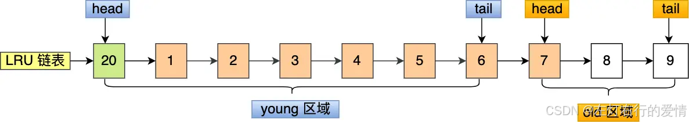  
 但是但是,还有个问题无法解决，那就是 Buffer Pool 污染的问题。

##### Buffer Pool污染

当某一个 SQL 语句扫描了大量的数据时，在 Buffer Pool 空间比较有限的情况下,**可能会将 Buffer Pool 里的所有页都替换出去，导致大量热数据被淘汰了**，等这些热数据又被再次访问的时候，由于缓存未命中，就会产生大量的磁盘 IO,MySQL 性能就会急剧下降，这个过程被称为 Buffer Pool 污染。

如何解决呢?  
 发生BufferPool污染本质上是:像前面这种全表扫描的查询，很多缓冲页其实只会被访问一次，但是它却只因为被访问了一次而进入到 young 区域，从而导致热点数据被替换了。  
 LRU 链表中 young 区域就是热点数据，只要我们提高进入到 young 区域的门槛，就能有效地保证 young 区域里的热点数据不会被替换掉。  
 全表扫描时，许多页只会被访问一次，但却会挤占热点数据的位置。  
 解决方案 - 提高进入young区域的门槛：

* 当old区域的页第一次被访问时，记录这个时间点
* 设置了一个时间窗口(默认1000ms)
* 只有当页在old区域停留超过这个时间窗口后再次被访问，才会被移到young区域

这样可以过滤掉短时间内密集访问但实际不是热点的数据  
 young区域的额外优化：

* young区域被分成了前1/4和后3/4
* 即使在young区域，前1/4的页被访问也不会移动到头部
* 只有后3/4的页被访问才会移到头部
* 这样减少了频繁移动节点的开销

**只有同时满足「被访问」与「在 old 区域停留时间超过 1 秒」两个条件，才会被插入到 young 区域头部.**.

还有一点:MySQL 针对 young 区域其实做了一个优化，为了防止 young 区域节点频繁移动到头部。young 区域前面 1/4 被访问不会移动到链表头部，只有后面的 3/4被访问了才会。

#### 脏页什么时候会被刷入磁盘

若每次修改数据都刷入磁盘，则性能会很差，因此一般都会在一定时机进行批量刷盘。  
 InnoDB 的更新操作采用的是 Write Ahead Log 策略,即先写日志，再写入磁盘，通过 redo log 日志让 MySQL 拥有了崩溃恢复能力。  
 下面几种情况会触发脏页的刷新：

* 当 redo log 日志满了的情况下，会主动触发脏页刷新到磁盘；
* Buffer Pool 空间不足时，需要将一部分数据页淘汰掉，如果淘汰的是脏页，需要先将脏页同步到磁盘；
* MySQL 认为空闲时，后台线程会定期将适量的脏页刷入到磁盘；
* MySQL 正常关闭之前，会把所有的脏页刷入到磁盘；

### 总结

Innodb 存储引擎设计了一个缓冲池（Buffer Pool），来提高数据库的读写性能。  
 Innodb 通过三种链表来管理缓页：

* Free List （空闲页链表），管理空闲页；
* Flush List （脏页链表），管理脏页；
* LRU List，管理脏页+干净页，将最近且经常查询的数据缓存在其中，而不常查询的数据就淘汰出去。  
   InnoDB 对 LRU 做了一些优化，我们熟悉的 LRU 算法通常是将最近查询的数据放到 LRU 链表的头部，而 InnoDB 做 2 点优化：
* 将 LRU 链表 分为young 和 old 两个区域，加入缓冲池的页，优先插入 old 区域；页被访问时，才进入 young 区域，目的是为了解决预读失效的问题。
* 当**页被访问且 old 区域停留时间超过innodb\_old\_blocks\_time 阈值（默认为1秒）时**，才会将页插入到 young 区域，否则还是插入到 old 区域，目的是为了解决批量数据访问，大量热数据淘汰的问题。
* 为了防止 young 区域节点频繁移动到头部。young 区域前面 1/4 被访问不会移动到链表头部，只有后面的 3/4被访问了才会.
