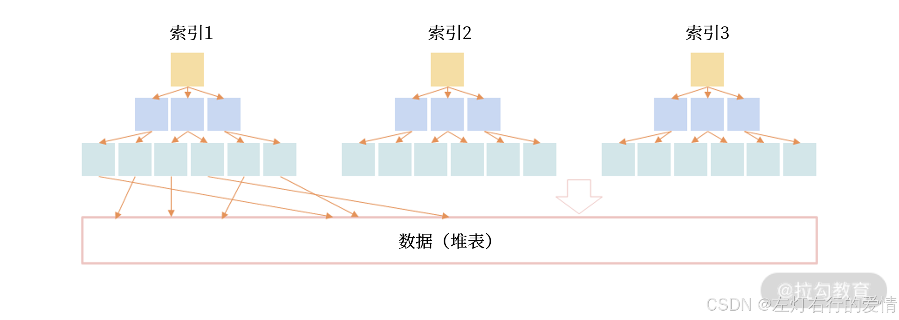
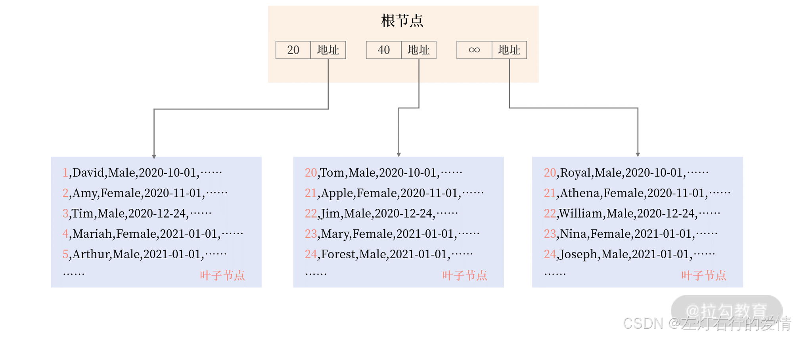
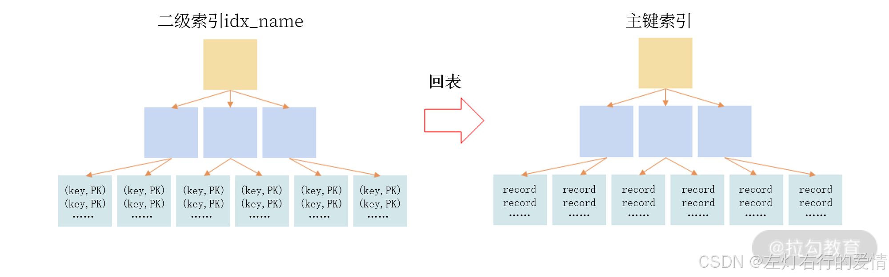

> 原文：[CSDN](https://blog.csdn.net/qq_45852626/article/details/145488386)（历史文章导入，当前状态为草稿）

### 前言

InnoDB 存储引擎是 MySQL 数据库中使用最为广泛的引擎，在海量大并发的 OLTP 业务中，InnoDB 必选。这一章我们聊一聊 MySQL InnoDB 存储引擎的索引结构。

### 数据存储

数据存储有堆表和索引组织表两种方式.

#### 堆表

堆表中的数据无序存放， 数据的排序完全依赖于索引.（Oracle、Microsoft SQL Server、PostgreSQL 早期默认支持的数据存储都是堆表结构）。  
   
 数据和索引分开存储。索引是排序后的数据，而堆表中的数据是无序的，索引的叶子节点存放了数据在堆表中的地址，当堆表的数据发生改变，且位置发生了变更，所有索引中的地址都要更新，这非常影响性能，特别是对于 OLTP 业务。

#### 索引组织表

，数据根据主键排序存放在索引中，主键索引也叫聚集索引（Clustered Index）。在索引组织表中，数据即索引，索引即数据。  
 MySQL InnoDB 存储引擎就是这样的数据组织方式；Oracle、Microsoft SQL Server 后期也推出了支持索引组织表的存储方式。  
 **数据按照主键的顺序存储在 B+ 树索引中**，而不是采用传统的堆表（Heap Table）存储方式。这意味着：

* 数据是按主键排序存储的，不像普通表那样是无序的。
* 数据和索引存储在一起，不需要额外的索引来定位数据。
* 查询主键时更快，因为主键索引本身就包含数据。  
     
   表 User 的主键是 id，所以表中的数据根据 id 排序存储，叶子节点存放了表中完整的记录，可以看到表中的数据存放在索引中，即表就是索引，索引就是表。

### 二级索引

InnoDB 存储引擎的数据是根据主键索引排序存储的，**除了主键索引外，其他的索引都称之为二级索引（Secondeary Index）， 或非聚集索引（None Clustered Index）。**  
 二级索引也是一颗 B+ 树索引，但它和主键索引不同的是**叶子节点存放的是索引键值、主键值**。  
 举个例子:

```
CREATE TABLE User (

    id BIGINT AUTO_INCREMENT,

    name VARCHAR(128) NOT NULL,

    sex CHAR(6) NOT NULL,

    registerDate DATETIME NOT NULL,
    ...
    PRIMARY KEY(id), -- 主键索引

    KEY idx_name(name) -- 二级索引

)
如果用户通过列 name 进行查询，比如下面的 SQL：
SELECT * FROM User WHERE name = 'David'，


```

整个流程是:  
 通过二级索引 idx\_name 只能定位主键值，需要额外再通过主键索引进行查询，才能得到最终的结果。\*\*这种“二级索引通过主键索引进行再一次查询”的操作叫作“回表”，\*\*你可以通过下图理解二级索引的查询：  
   
 二级索引的设计有个非常大的好处:  
 如果记录发生修改,其他索引无须进行维护,除非记录的主键发生修改.(因为二级索引存储的是主键，而不是数据的物理地址！)  
 举个例子:

```
UPDATE employees SET salary = salary * 1.1 WHERE emp_id = 1001;


```

salary 发生了变化，但 emp\_id 没变，因此二级索引无需更新。  
 **📌 索引组织表的二级索引维护情况总结**

| **情况** | **是否需要更新二级索引？** | **原因** |
| --- | --- | --- |
| **非主键字段更新**（如 `salary`） | ❌ 无需更新 | 二级索引指向主键，不受物理位置影响 |
| **数据物理位置变更** | ❌ 无需更新 | 物理存储位置变了，但主键没变 |
| **主键 `emp_id` 变更** | ✅ 需要更新 | 因为二级索引存的是主键值 |
| **删除记录** | ✅ 需要更新 | 需要删除二级索引中的主键引用 |
| **插入新记录** | ✅ 需要更新 | 需要在二级索引中添加新主键 |

**👉 结论**：索引组织表的二级索引维护成本低，**除非主键变更，否则二级索引无需维护！**  
 你会发现索引组织表在存在大量变更的场景下，性能优势会非常明显，因为大部分情况下都不需要维护其他二级索引。🚀

#### 二级索引的性能评估

我们给出一个业务的表User:

```
CREATE TABLE User (

    id  BINARY(16) NOT NULL,

    name VARCHAR(255) NOT NULL,

    sex CHAR(1) NOT NULL,

    password VARCHAR(1024) NOT NULL,

    money BIG INT NOT NULL DEFAULT 0,

    register_date DATETIME(6) NOT NULL DEFAULT CURRENT_TIMESTAMP(6),

    last_modify_date DATETIME(6) NOT NULL DEFAULT CURRENT_TIMESTAMP(6) ON UPDATE CURRENT_TIMESTAMP(6),

    uuid CHAR(36) AS (BIN_TO_UUID(id)),

    CHECK (sex = 'M' OR sex = 'F'),

    CHECK (IS_UUID(UUID)),

    PRIMARY KEY(id),

    UNIQUE KEY idx_name(name),

    KEY idx_register_date(register_date),

    KEY idx_last_modify_date(last_modify_date)

);


```

在 User 表中，有三个二级索引：

* idx\_name(name)
* idx\_register\_date(register\_date)
* idx\_last\_modify\_date(last\_modify\_date)

##### 🔹为什么 idx\_name 的性能开销最大？

**二级索引 idx\_name 的数据是无序的，导致 B+ 树频繁分裂，影响性能。**  
 🌟 解决方案：限制用户每天/每年可修改昵称的次数，减少 idx\_name 的更新次数，从而减少二级索引的维护开销。

##### 🔹 为什么 idx\_last\_modify\_date 更新频繁会影响性能？

**每次用户修改 money，都会导致 last\_modify\_date 更新，从而更新 idx\_last\_modify\_date 索引。**  
 🌟 解决方案：  
 业务层优化：如果某些操作不需要 last\_modify\_date 频繁更新，**可以在业务代码中做条件判断，避免无意义的更新**。  
 批量更新：对于高并发写入场景，**可以考虑 定时批量更新** last\_modify\_date，而不是每次更新 money 都更新时间戳。

##### 分析二级索引性能表格

二级索引的 **插入性能** 主要受 **插入数据的顺序性** 影响，插入是否有序决定了 **索引的维护成本**。  
 **📌 索引的维护成本分析**

| **索引** | **插入成本** | **更新成本** | **维护成本原因** |
| --- | --- | --- | --- |
| `PRIMARY KEY (id)` | ✅ 低 | ✅ 低 | 主键索引是顺序插入，且不会发生更新（除非主键变更）。 |
| `idx_name(name)` | ❌ 高 | ❌ 高 | 随机插入，导致 B+ 树频繁分裂，影响插入性能；用户可修改昵称，更新时需要维护索引。 |
| `idx_register_date(register_date)` | ✅ 低 | ✅ 低 | 顺序插入，不会更新，因此维护成本较低。 |
| `idx_last_modify_date(last_modify_date)` | ✅ 低 | ❌ 高 | 顺序插入但更新频繁，每次用户数据变更都会触发索引更新，影响性能。 |

##### 为什么主键应该“紧凑且顺序”？

主键的设计影响索引的存储和查询性能。  
 在 InnoDB 引擎下：

* 索引组织表 使用 B+ 树存储数据，主键决定了数据的存储顺序。
* 所有二级索引都会存储主键值，查询时先在二级索引查找，再回表通过主键找到完整数据。  
   因此：

1. **主键应该尽量顺序（如自增 ID、顺序 UUID）**

* 这样数据插入是 顺序填充 B+ 树，不会造成索引频繁分裂，提高插入性能。

2. **主键应该尽量紧凑（占用字节少）**

* 二级索引存储的是“索引列 + 主键”，如果主键太大（如 36 字节的 UUID），会导致索引数据量变大，影响查询性能。  
   🌟 解决方案：
* 推荐使用 16 字节的顺序 UUID（BINARY(16)），而不是 36 字节的字符串 UUID（CHAR(36)）。
* 如果可以，使用自增 ID（BIGINT）作为主键，查询效率最高。

##### 二级索引总结

| **优化点** | **建议** |
| --- | --- |
| **二级索引插入性能** | 避免创建随机插入的索引（如 `idx_name`），如果必须使用，尽量限制更新频率。 |
| **二级索引更新开销** | 频繁更新的字段（如 `last_modify_date`）的索引可能影响性能，可以减少无意义的更新或批量更新。 |
| **主键设计** | 主键应该尽量紧凑（如 `BINARY(16)` 的顺序 UUID），避免使用大字段（如 `CHAR(36)` 的 UUID）。 |
| **索引顺序性** | 选择顺序性高的字段作为索引，提高索引插入效率，如 `register_date`。 |

**📌 结论**

* **尽量使用顺序插入的索引**（如 `register_date`），避免随机插入的索引（如 `name`）。
* **减少不必要的索引更新**，如 `last_modify_date`，可以通过业务优化降低更新频率。
* **主键设计要紧凑且顺序**，这样可以减少二级索引的存储和查询开销，提高整体性能。 🚀

### 堆表和索引组织表有什么区别,分别的应用场景是什么?

堆表（Heap Table）数据无序存储，是MyISAM使用的存储方式.主键索引存的是数据的物理地址，查询时需要回表获取完整数据.  
 因为所有索引都是平级,增删改性能较好.  
 但是查询需要回表,所以查询较慢,查询没有索引组织表好,且由于只支持行锁,适用于低并发场景,

索引组织表（IOT）数据按主键顺序存储，是InnoDB使用的存储方式.  
 主键索引的叶子节点直接存整行数据，主键查询不需要回表，但插入性能较低.  
 不过高并发场景下性能远高于堆表方式,适用于CRUD比较多的高并发场景(包括OLTP业务).
