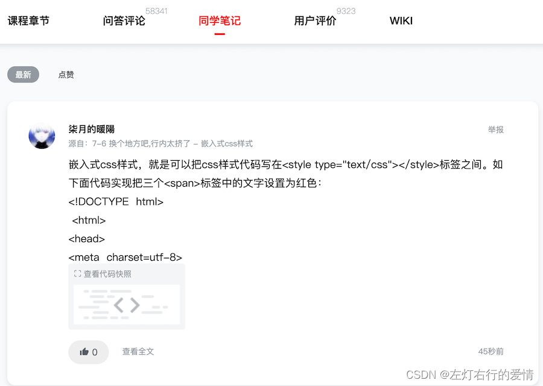
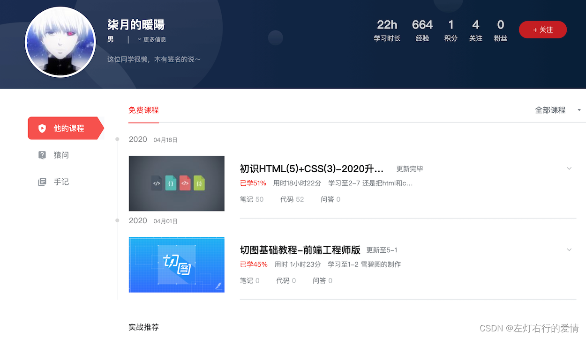
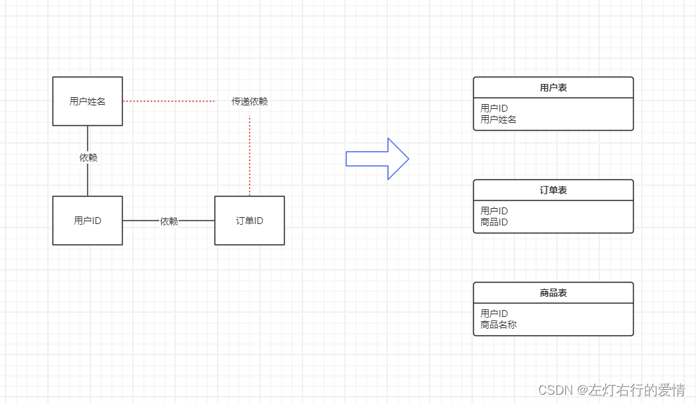

> 原文：[CSDN](https://blog.csdn.net/qq_45852626/article/details/137580987)（历史文章导入，当前状态为草稿）

## 前言

业务上被分配了一个模块去开发,模块挺大的,马上都抵得上一个系统了.  
 突然发现自己对于数据库表设计还没写过文章,想了想有必要记录一下自己对于数据库表的设计思路,内容也参考了很多博客和书.

## 设计思路

1. 对业务需求调研
2. 面向对象设计:根据数据库三范式,对项目属性进行建模
3. 对宽表进行范式化设计
4. 反范式化设计
5. 物理设计
6. 数据类型选择
7. 对象命名

## 实战项目需求分析

下面根据对应的页面,进行分析  
   
 条件筛选: 方向,分类,难度  
 课程信息(列表页): 主标题,副标题,图标,学习人数,学习难度.  
   
 课程信息(详情页): 学习难度,时长,学习人数,中和评分,讲师等信息  
 课程信息(章节列表): 名称,说明,小节名称,小节时长.

  
 讲师信息(点击讲师信息后的页面):  
 性别,省份,职业,描述,经验,积分,关注,粉丝,讲师所讲课程列表.  
   
 问答评论:  
 评论类型: 评论,问答,未解决,精华标识信息;  
 问答标题,浏览数量,关联章节信息等.

  
 同学笔记: 昵称(用户信息),关联章节,内容,发布时间等信息  
   
 和讲师信息类似

  
 用户评价: 课程的评分,评论,评论内容,评论时间.

## 实战项目需求总结

根据业务分析总结,上述观察总结出下面信息

* 课程的属性  
   主标题、副标题、方向、分类、难度、最新、最热、时长、简介、人数、需知、收获、讲师名、讲师职位、课程图片、综合评分、内容实用、简洁易懂、逻辑清晰
* 课程列表属性  
   章节名、小节名、说明、小节时长、章节 URL、视频格式
* 讲师属性  
   讲师昵称、密码、性别、省、市、职位、说明、经验、积分、关注人数、粉丝人数
* 问答评论属性  
   类型、标题、内容、关联章节、浏览量、发布时间、用户昵称
* 同学笔记  
   用户昵称、关联章节、笔记标题、笔记内容、发布时间
* 用户属性  
   用户昵称、密码、说明、性别、省、市、职位、说明、经验、积分、关注人数、粉丝人数
* 评价属性  
   用户、课程主标题、内容、综合评分、内容实用、简洁易懂、逻辑清晰、发布时间

上面是项目的所有涉及到的对象属性,下面开始表逻辑设计

## 逻辑设计

### 宽表模式

宽表模式: 一行数据的列比较多,则为宽表(实际是把不同的内容放在同一张表中)  
 以课程属性来看,至少有19个左右属性,把这些属性都放在课程表中,那么这就是一个宽表,这就需要考虑存储时是否会有一些问题了.

| 主标题 | 副标题 | 方向 | 分类 | 难度 | 讲师名 | 讲师职位 | 综合评分 | … |
| --- | --- | --- | --- | --- | --- | --- | --- | --- |
| MySQL 面试指南 | 中高级 IT 开发人员晋升加薪的必备佳品 | 数据库 | MySQL | 中级 | sqlsercn | 高级 DBA | 10 |  |
| MyCat + MyCat | MyCat 高可用数据库架构 | 数据库 | MySQL | 中级 | sqlsercn | 高级 DBA | 10 |  |
| MySQL 架构设计 | 高性能可扩展 MySQL 架构设计与优化 | 数据库 | MySQL | 中级 | sqlsercn | 高级 DBA | 9.15 |  |

### 宽表存在的问题

* 数据冗余: 相同的数据在一个表内出现了很多次
* 数据更新异常: 修改一行中某列的值时,同时修改了多行数据
* 数据插入异常: 部分数据由于缺失主键信息而无法写入表中
* 数据删除异常: 删除某一数据时不得不删除另一数据

### 宽表应用场景

* 配合列存储的数据报表应用  
   不同内容冗余在每行数据中,但不需要关联多表查询,性能上有一定优势

## 数据库设计范式

一般来说只要符合前3个范式就足够了

### 第一范式

数据库表中所有字段属性都是原子性的,不可再分.  
 这种情况比较好理解,在设计某个字段时,对于字段X来说,就不能把字段X拆分成字段X-1 和 字段X-2.

### 第二范式

数据库表里的非主属性都要和这个数据表的候选键有完全依赖关系.  
 假设存在用户,商品两个数据模型  
 用户模型的主键是用户ID,那么用户模型其他字段都应该依赖于用户ID  
 商品模型的主键是商品ID,它和用户没有直接关系,则这个属性不能放在用户模型,而应该放在用户-商品 相关联的订单表中.

### 第三范式

在满足一, 二范式的同时,模型非主键字段不能相互依赖.  
 例如: 订单表(订单ID,商品ID,用户ID,用户姓名)  
 初看该表没有问题,满足第二范式,每列都和主键列"订单编号"相关.  
 细看会发现"用户姓名"和"用户ID"相关联,"用户ID"和"订单ID"又相关联,最后经过传递依赖,"用户姓名"和"订单ID"相关联.  
 为了满足第三范式,应去掉订单表中"用户姓名"列,放入用户表中.

**总结一下**

* 1NF需要保证表中每个属性都保持原子性
* 2NF需要保证表中的非主属性与候选键完全依赖
* 3NF需要保证表中的非主属性与候选键不存在**传递依赖**

## 面向对象设计

根据数据库三范式,来对我们的项目属性进行建模  
 注意: 这里是一个过程,并不是最终的表结构,还会不断的优化

### 课程对象逻辑建模

课程的属性:  
 主标题、副标题、方向、分类、难度、最新、最热、时长、简介、人数、需知、收获、讲师名、讲师职位、课程图片、综合评分、内容实用、简洁易懂、逻辑清晰  
 根据三范式分析,得到一个合理的表结构:

* 课程表  
   主标题（pk）、副标题、方向、分类、难度、上线时间、学习人数、时长、简介、人数、需知、收获、讲师昵称、课程图片、综合评分、内容实用、简洁易懂、逻辑清晰

1. 最新: 上线时间,可通过排序计算得到
2. 最热: 学习人数,可通过排序计算得到
3. 讲师信息: 通过讲师昵称关联讲师表

* 讲师表  
   讲师昵称,讲师职位
* 课程方向表  
   课程方向名称,添加时间
* 课程分类表  
   分类名称,添加时间
* 课程难度表  
   课程难度,添加时间

### 课程列表对象逻辑建模

课程列表属性：章节名、小节名、说明、小节时长、章节 URL、视频格式  
 如果使用一张表来装以下属性,选择一个主键的话,需要选择[章节名,小节名]作为复合组件,那么:

* 说明属性: 只与章节名有关系
* 小节时长,章节URL,视频格式: 只与小节名有关系  
   显然是不满足第二范式的(奇案非业务组件必须与其都有关系),那么如下分裂:
* 课程章节表: 课程章节名（pk）、说明、章节编号
* 课程同章节的关系表: 课程名称、课程章节名称
* 课程小节表: 小节名称（pk）、小节视频 URL、视频格式、小节时长、小节编号
* 课程章节同课程小节表的关系表: 课程主标题、课程章节名、小节名

### 讲师对象逻辑建模

讲师属性: 讲师昵称、密码、性别、省、市、职位、说明、经验、积分、关注人数、粉丝人数  
 这里选择[讲师昵称]作为主键,然后再分析其他属性是否有相互依赖的关系,结果发现没有.  
 讲师表:讲师昵称（pk）、密码、性别、省、市、职位、说明、经验、积分、关注人数、粉丝人数  
 在课程对象中分出来一个讲师表,只有两个字段也都包含在此表中,另外,用户信息对象和讲师表类似,先来分析下用户信息对象.

### 用户对象逻辑建模

用户属性：用户昵称、密码、说明、性别、省、市、职位、说明、经验、积分、关注人数、粉丝人数  
 与讲师基本类似,且讲师为一个特殊用户,所以可以合并为一个用户表  
 用户表: 用户昵称（pk）、密码、说明、性别、省、市、职位、说明、经验、积分、关注人数、粉丝人数，讲师标识.

### 问答评论对象逻辑建模

问答评论属性: 类型、标题、内容、关联章节、浏览量、发布时间、用户昵称  
 以上属性选择哪一项作为唯一标识比较合适?  
 最优可能就是标题了,但是无法保证没有重复的标题.  
 需要使用[标题,用户昵称,关联章节]来作为一个复合组件,但是[关联章节]需要使用课程主标题,课程章节名,小节名,形成如下的表结构:  
 问答评论表:（标题、用户昵称、课程主标题、课程章节名、小节名）（pk）类型、内容、浏览量、发布时间，父评论

上表很怪异,且有很多数据冗余,如用户信息、课程信息、章节信息；  
 新增的父评论: 因为评论是可以被回复的；  
 同样与上表结构类似的有同学笔记

### 同学笔记对象逻辑建模

同学笔记: 用户昵称、关联章节、笔记标题、笔记内容、发布时间  
 同学笔记表: （标题、用户昵称、课程主标题、课程章节名、小节名）（pk）内容、发布时间

### 评价对象逻辑建模

评价属性: 用户、课程主标题、内容、综合评分、内容实用、简洁易懂、逻辑清晰、发布时间  
 课程评分通过三个维度: 简洁易懂,逻辑清晰,发布时间 来进行评分,最后可以得到一个综合评分,评价是针对课程来进行的,所以可以选用[用户,课程主标题]作为主键,标识出一个用户对一个课程的评价数据,其他属性也是与之进行关联的,那么评价表的结构如下:  
 评价表: (用户、课程主标题)(pk)、内容、综合评分、内容实用、简洁易懂、逻辑清晰、发布时间  
 发现一个问题: 只有用户选择了这门课程才能进行评价.因此还需要一个用户与课程的关联关系表  
 用户选课表: （用户昵称、课程主标题）（pk）、选课时间、累积听课时长

## 逻辑设计总结

对涉及到的属性需求进行数据库三范式进行了拆分涉及,总结如下:

### 与课程相关的表

* 课程表（课程主表）  
   主标题（pk）、副标题、方向、分类、难度、上线时间、学习人数、时长、简介、人数、需知、收获、讲师昵称、课程图片、综合评分、内容实用、简洁易懂、逻辑清晰
* 课程章节表  
   课程章节名（pk）、说明、章节编号
* 课程同章节的关系表  
   课程名称、课程章节名称
* 课程小节表  
   小节名称（pk）、小节视频 URL、视频格式、小节时长、小节编号
* 课程章节同课程小节表的关系表  
   课程主标题、课程章节名、小节名

### 课程新增了字典数据表

* 课程方向表  
   课程方向名称（pk），添加时间
* 课程分类表  
   分类名称（pk）、添加时间
* 课程难度表  
   课程难度（pk），添加时间

### 与用户有关的表

* 用户表  
   用户昵称（pk）、密码、说明、性别、省、市、职位、说明、经验、积分、关注人数、粉丝人数，讲师标识
* 问答评论表  
   （标题、用户昵称、课程主标题、课程章节名、小节名）（pk）类型、内容、浏览量、发布时间，父评论
* 同学笔记表  
   用户昵称、关联章节、笔记标题、笔记内容、发布时间
* 评价表  
   (用户、课程主标题)(pk)、内容、综合评分、内容实用、简洁易懂、逻辑清晰、发布时间
* 用户选课表  
   （用户昵称、课程主标题）（pk）、选课时间、累积听课时长

## 范式化设计结果思考

根据数据库三范式设计出来了13张表,这样是否合理呢?  
 这需要思考一些场景使用(可以套用一些在页面上展示出来的功能):  
 **如何获取一门课程包括所有章节和小节的信息?**  
 这里所需要的信息,分别存放在课程表,章节表,小节表. 且还需要使用课程章节表关联关系表,章节表与小节表关联关系表,一共需要关联5张表.

对于数据库性能来说,关联越多的表,性能越差,而且在使用场景上来看,每个用户要学习课程,点击进入的课程信息页面,就需要获取一次,这个场景应该是比较频繁的.

虽然按照范式化完成对表结构的设计,但是出于**业务查询性能**的考虑,还需要对范式化设计的表进行优化,通常优化后的表或多或少的会违反一些范式化的规定和冗余一些信息,这种方式叫做**反范式化设计**  
 进行范式化设计时,多数是使用以空间换时间.

## 反范式化设计

### 课程章节表的反范式化设计

课程表与章节表的关系:课程表 1------> N 章节表, 一个课程有多个章节.

* 课程章节表:课程章节名（pk）、说明、章节编号
* 课程同章节的关系表: 课程名称、课程章节名称  
   可将上面两张表合并为一个表:  
   课程章节表: (课程章节名称, 课程名称)(pk),说明,章节编号  
   虽然看似违反了 第三范式，但是在一个 频繁查询的表 上使用反范式设计，能让我们少关联一张表，提高了查询性能，还是很划算的

### 课程小节表反范式化设计

同样类似的：课程章节表 1 ------> N 课程小节表，一个章节表可以有多个课程小节。

* 课程小节表: 小节名称（pk）、小节视频 URL、视频格式、小节时长、小节编号
* 课程章节同课程小节表的关系表: 课程主标题、课程章节名、小节名  
   合并之后的表为: （课程主标题、课程章节名、小节名称）（pk）、小节视频 URL、视频格式、小节时长、小节编号

## 反范式化设计总结

现在来看: 如何获取一门课程包括所有章节和小节的信息?  
 现在只需要关联：课程表、课程章节表、课程小结表 ，使用三张表就可以了  
 不能过度范式化和反范式化设计，那么如何度量呢？取决于我们关联表的数量.  
 由于只对课程相关表进行了反范式化设计，课程相关表由 5 个变成了 3 个：

课程表（课程主表）：{主标题（pk）、副标题、方向、分类、难度、上线时间、学习人数、时长、简介、人数、需知、收获、讲师昵称、课程图片、综合评分、内容实用、简洁易懂、逻辑清晰}  
 课程章节表：{（课程章节名、课程章节名称）（pk）、说明、章节编号}  
 课程小节表：{（课程主标题、课程章节名、小节名称）（pk）、小节视频 URL、视频格式、小节时长、小节编号}  
 其他表暂未发生任何变化  
 到目前为止，我们完成了数据库逻辑的设计，还需要对数据库进行 物理设计，也就是要设计表的存储结构，包括：

* 每一列所使用的列类型
* 如何对库表进行命名
* 选择表的存储引擎（对于 MySQL 来说）

## 物理设计

### MySQL常见的存储引擎

| 引擎名称 | 事物 | 说明 |
| --- | --- | --- |
| MyIsam | N | MySQL 5.6 之前的默认引擎，最常用的非事务型存储引擎 |
| CSV | N | 以 CSV格式存储的非事务型存储引擎 |
| Archive | N | 只允许查询和新增数据而不允许修改的非事务型存储引擎 |
| Memory | N | 是一种易失性非事务型存储引擎 |
| InnoDB | Y | 最常用的事务型存储引擎 |

### InnoDB存储引擎的特点

* 事务型存储引擎支持ACID  
   不要混合使用事务和非事务型的表,否则会导致事务不完整
* 数据按主键聚集存储  
   那么在选择什么数据作为主键就显得至关重要了.  
   非主键的叶子节点所指向的都是物理行的主键而不是位置(这是聚簇索引的特点),因此主键的大小就影响到索引查找数据的性能.  
   数据是按主键的逻辑顺序进行存储的,因此建议使用自增ID作为主键  
   对于之前设计的业务主键,可以在这些列上新增唯一索引,来保证它的查询效率
* 支持行级锁及MVCC  
   适合在高并发的读写混合场景下使用
* 支持Btree和自适应Hash索引  
   自适应Hash索引: 由InnoDb根据数据的统计信息,自动建立hash索引,只适合等值查找
* 支持全文和空间索引(MySQL5.7之后)  
   自增列的主键比实际业务主键要小很多,性能上有一定优势,主键使用自增列,业务关联关系也使用自增列的主键.

### 根据InnoDB特性优化表逻辑结构

* 课程表(课程主表)  
   课程 ID（PK 自增 ID）、主标题（唯一索引）、副标题、方向 ID、分类 ID、难度 ID、上线时间、学习人数、时长、简介、人数、需知、收获、讲师 ID、课程图片、综合评分、内容实用、简洁易懂、逻辑清晰
* 课程章节表  
   章节 ID（PK）、课程 ID、课程章节名、说明、章节编号
* 课程小节表  
   小节 ID（PK）、课程 ID、章节 ID、小节名称、小节视频 URL、视频格式、小节时长、小节编号
* 课程方向表  
   课程 ID（PK）、课程方向名称、添加时间
* 课程分类表  
   分类 ID（PK）、分类名称、添加时间
* 课程难度表  
   课程难度 ID（PK）、课程难度、添加时间
* 用户表  
   用户 ID（PK）、用户昵称（非空唯一索引）、密码、说明、性别、省、市、职位、说明、经验、积分、关注人数、粉丝人数，讲师标识
* 问答评论表  
   评论 ID（PK）、父评论 ID、课程 ID、小节 ID、评论标题、用户 ID、类型、内容、浏览量、发布时间，父评论
* 同学笔记表  
   笔记 ID（PK）、课程 ID、章节 ID、小节 ID、用户 ID、笔记标题、笔记内容、发布时间
* 评价表  
   评价 ID（PK）、用户 ID、课程 ID、内容、综合评分、内容实用、简洁易懂、逻辑清晰、发布时间
* 用户选课表  
   选课 ID（PK）、用户 ID、课程 ID、选课时间、累积听课时长
