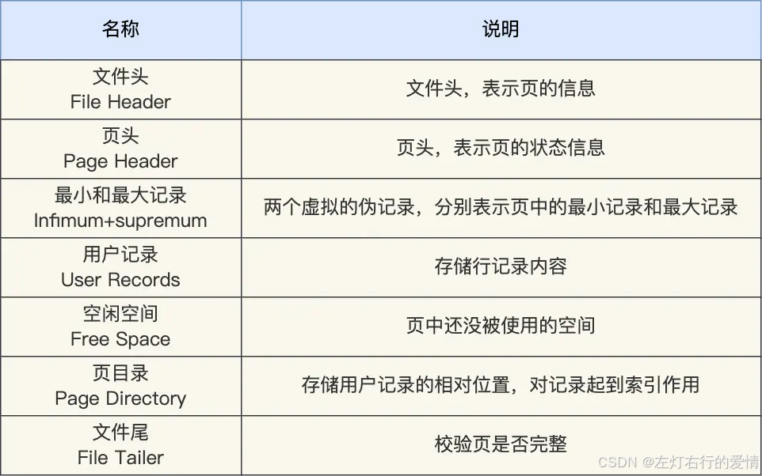
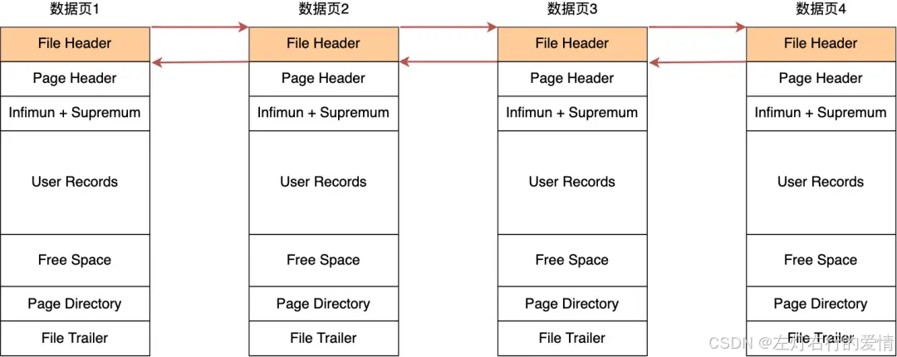
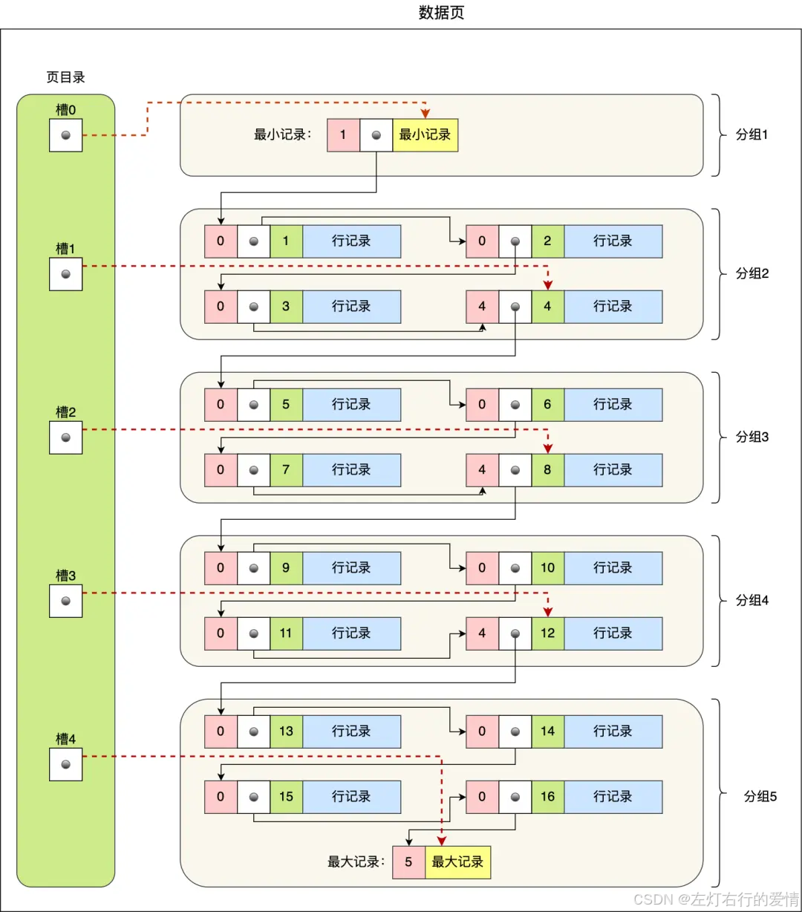
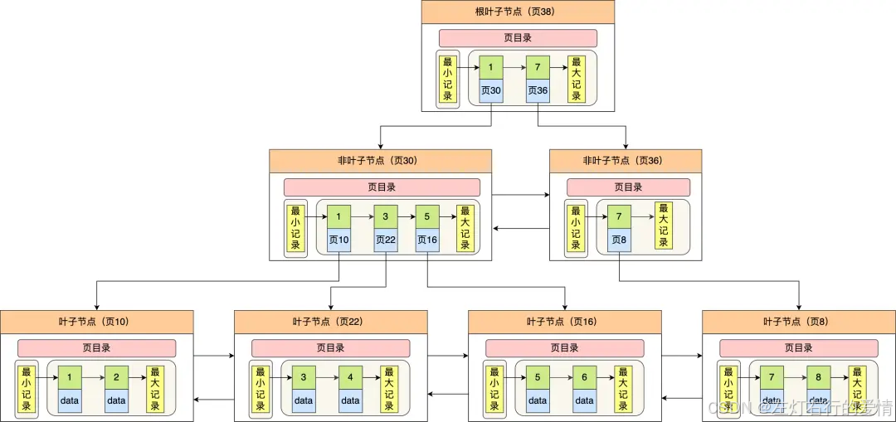

> 原文：[CSDN](https://blog.csdn.net/qq_45852626/article/details/145477883)（历史文章导入，当前状态为草稿）

## 数据页结构
## 前言

页是InnoDB管理存储空间的基本单位，一个页的大小一般是16KB。InnoDB为了不同的目的而设计了许多种不同
类 
型的页，比如存放表空间头部信息的页，存放Insert Buffer信息的页，存放index信息的页，存放undo日志信息的页等等等等。  
 本章聚焦在存放我们表中记录的那种类型的页，官方称这种存放记录的页为索引（index）页,我们也可以叫做数据页.

## 页的结构

数据页包括七个部分，结构如下图:  
   
 这 7 个部分的作用如下图：  
   
 在 File Header 中有两个指针，分别指向上一个数据页和下一个数据页，连接起来的页相当于一个双向的链表，如下图所示：  
   
 采用链表的结构是让数据页之间不需要是物理上的连续的，而是逻辑上的连续。

### 如何组织数据

数据页的主要作用是存储记录，也就是数据库的数据,所以重点说一下数据页中的 User Records 是怎么组织数据的。  
 数据页中的记录按照「主键」顺序组成单向链表，单向链表的特点就是插入、删除非常方便，但是检索效率不高，最差的情况下需要遍历链表上的所有节点才能完成检索。  
 因此，数据页中有一个页目录，起到记录的索引作用，为了能快速找到记录.  
 那 InnoDB 是如何给记录创建页目录的呢？页目录与记录的关系如下图：  
   
 页目录创建的过程如下：

1. 将所有的记录划分成几个组，这些记录包括最小记录和最大记录，但不包括标记为“已删除”的记录；
2. 组的最后一条记录是组内最大记录,并且这条记录头信息会存储该组一共多少条记录,作为n\_owned字段.（上图中粉红色字段）
3. 页目录用来存储每组最后一条记录的地址偏移量,这些地址偏移量会按照先后顺序存储起来,每组的地址偏移量也被称之为槽（slot）,每个槽相当于指针指向了不同组的最后一个记录

**页目录就是由多个槽组成的，槽相当于分组记录的索引。**

查询过程如下:  
 **我们通过槽查找记录时，可以使用二分法快速定位要查询的记录在哪个槽（哪个记录分组）,定位到槽后，再遍历槽内的所有记录，找到对应的记录.**

可能你会问:如果某个槽内的记录很多，然后因为记录都是单向链表串起来的，那这样在槽内查找某个记录的
时间复杂度 
不就是 O(n) 了吗？  
 答:这点不用担心，InnoDB 对每个分组中的记录条数都是有规定的，槽内的记录都是有限制的：

* 第一个分组中的记录只能有 1 条记录；
* 最后一个分组中的记录条数范围只能在 1-8 条之间；
* 剩下的分组中记录条数范围只能在 4-8 条之间。

## B+数是如何进行查询的

为了方便定位记录所在的页,InnoDB使用了B+数作为索引.  
 因为磁盘的 I/O 操作次数对索引的使用效率至关重要,因此在构造索引的时候，我们更倾向于采用“矮胖”的 B+ 树数据结构,这样需要进行磁盘I/O次数更少,而且B+数更适合进行关键字范围的查找.  
 InnoDB 里的 B+ 树中的每个节点都是一个数据页，结构示意图如下:  
   
 通过上图可以发现B+树特点:

* 只有叶子节点（最底层的节点）才存放了数据,非叶子节点（其他上层节）仅用来存放目录项作为索引.
* 非叶子节点分为不同层次，通过分层来降低每一层的搜索量；
* 所有节点按照索引键大小排序，构成一个双向链表，便于范围查询；

## 总结

nnoDB 的数据是按「数据页」为单位来读写的，默认数据页大小为 16 KB。每个数据页之间通过双向链表的形式组织起来，物理上不连续，但是逻辑上连续。  
 数据页内包含用户记录，每个记录之间用单向链表的方式组织起来，为了加快在数据页内高效查询记录，设计了一个页目录，页目录存储各个槽（分组），且主键值是有序的,于是可以通过二分查找法的方式进行检索从而提高效率
