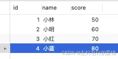
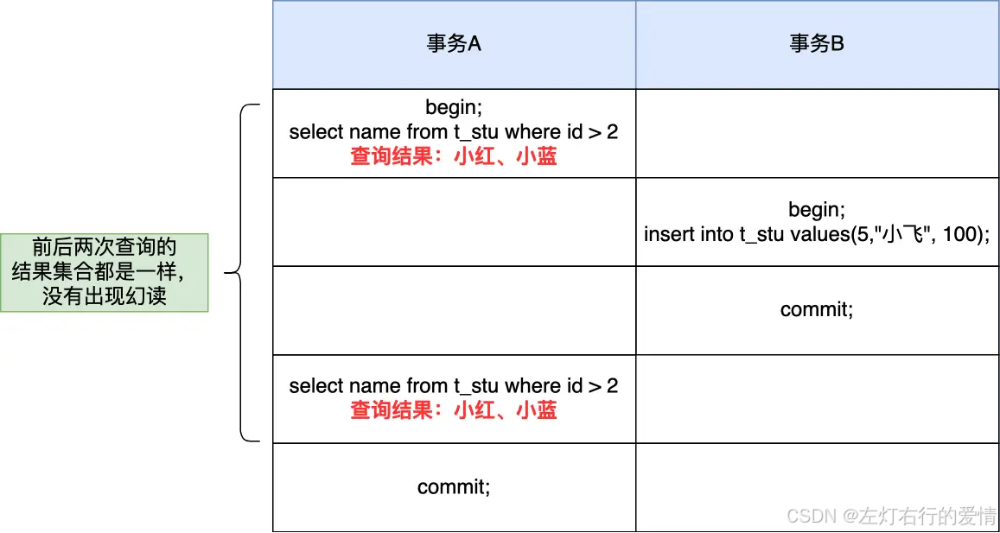
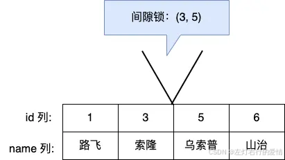
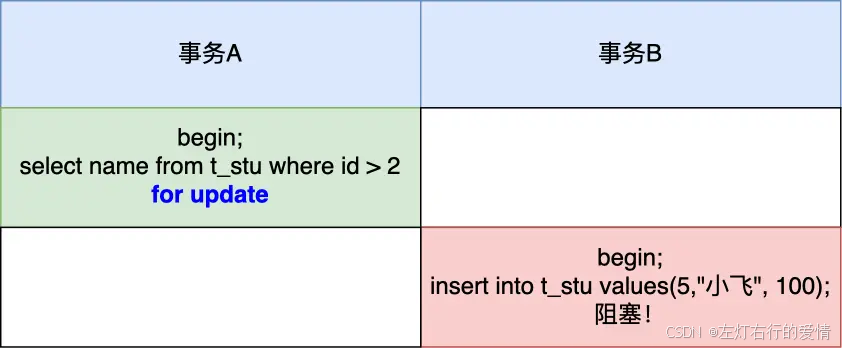
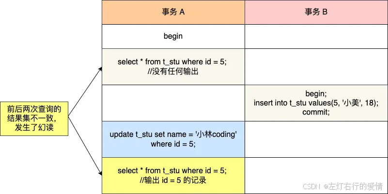

> 原文：[CSDN](https://blog.csdn.net/qq_45852626/article/details/145519650)（历史文章导入，当前状态为草稿）

#### 可重复读是否完全解决幻读
### 前言

前面我们介绍了几种隔离级别和并发执行下MySQL在不同隔离级别会出现的问题.  
 那我们也知道可重复读隔离级别是可以规避一些幻读的,它并不能完全解决幻读.  
 它虽然做了两种解决方案,但是还是不能完全解决:

* 针对快照读（普通 select 语句）,是通过 MVCC 方式解决了幻读.
* 针对当前读（select … for update 等语句）,是通过 next-key lock（记录锁+间隙锁）方式解决了幻读.  
   那什么样的幻读避免不了呢?下面我们来看看.

### 什么是幻读

同一个查询在不同的时间产生不同的结果集时，事务中就会出现所谓的幻象问题  
 例如，如果 SELECT 执行了两次，但第二次返回了第一次没有返回的行，则该行是“幻像”行.  
 举个例子:  
 假设一个事务在 T1 时刻和 T2 时刻分别执行了下面查询语句，途中没有执行其他任何语句

```
SELECT * FROM t_test WHERE id > 100;


```

只要 T1 和 T2 时刻执行产生的结果集是不相同的，那就发生了幻读的问题,比如:

* T1 时间执行的结果是有 5 条行记录，而 T2 时间执行的结果是有 6 条行记录
* T1 时间执行的结果是有 5 条行记录，而 T2 时间执行的结果是有 4 条行记录

### 快照读如何避免幻读

在执行第一个查询语句后，会创建一个 Read View,后续的查询语句利用这个 Read View,通过这个 Read View 就可以在 undo log 版本链找到事务开始时的数据，所以事务过程中每次查询的数据都是一样的，即使中途有其他事务插入了新纪录，是查询不出来这条数据的，所以就很好了避免幻读问题。  
 举例:  
 数据库表 t\_stu 如下，其中 id 为主键。  
   
 然后在可重复读隔离级别下，有两个事务的执行顺序如下：  
   
 即使事务 B 中途插入了一条记录，事务 A 前后两次查询的结果集都是一样的，并没有出现所谓的幻读现象。

### 当前读如何避免幻读

除了普通查询是快照读，其他都是当前读，比如 update、insert、delete，这些语句执行前都会查询最新版本的数据,然后再做进一步的操作。  
 这很好理解，假设你要 update 一个记录，另一个事务已经 delete 这条记录并且提交事务了，这样不是会产生冲突吗?  
 所以 update 的时候肯定要知道最新的数据。

假设，表中有一个范围 id 为（3，5）间隙锁，那么其他事务就无法插入 id = 4 这条记录了，这样就有效的防止幻读现象的发生.  
   
 举个例子如下:

  
 事务 A 执行了这面这条锁定读语句后，就在对表中的记录加上 id 范围为 (2, +∞] 的 next-key lock（next-key lock 是间隙锁+记录锁的组合）.  
 关于锁后面我会详细出文章聊的,目前看不懂也没关系的.  
 然后，事务 B 在执行插入语句的时候，判断到插入的位置被事务 A 加了 next-key lock,于是事物 B 会生成一个插入意向锁，同时进入等待状态，直到事务 A 提交了事务。这就避免了由于事务 B 插入新记录而导致事务 A 发生幻读的现象。

### 幻读当前没有被完全解决

可重复读隔离级别下虽然很大程度上避免了幻读,但是还是没有能完全解决幻读。

#### 幻读场景一

还是以这张表作为例子：  
   
 事务 A 执行查询 id = 5 的记录，此时表中是没有该记录的，所以查询不出来。

```
# 事务 A
mysql> begin;
Query OK, 0 rows affected (0.00 sec)
mysql> select * from t_stu where id = 5;
Empty set (0.01 sec)


```

然后事务 B 插入一条 id = 5 的记录，并且提交了事务。

```
# 事务 B
mysql> begin;
Query OK, 0 rows affected (0.00 sec)
mysql> insert into t_stu values(5, '小美', 18);
Query OK, 1 row affected (0.00 sec)
mysql> commit;
Query OK, 0 rows affected (0.00 sec)


```

事务 A 更新 id = 5 这条记录，对没错，事务 A 看不到 id = 5 这条记录，但是他去更新了这条记录.  
 这是不是非常违和,然后再次查询 id = 5 的记录,事务 A 就能看到事务 B 插入的纪录了，幻读就是发生在这种违和的场景。

```
# 事务 A
mysql> update t_stu set name = '小林coding' where id = 5;
Query OK, 1 row affected (0.01 sec)
Rows matched: 1  Changed: 1  Warnings: 0

mysql> select * from t_stu where id = 5;
+----+--------------+------+
| id | name         | age  |
+----+--------------+------+
|  5 | 小林coding   |   18 |
+----+--------------+------+
1 row in set (0.00 sec)


```

整个发生幻读的时序图如下  
   
 在可重复读隔离级别下，事务 A 第一次执行普通的 select 语句时生成了一个 ReadView，之后事务 B 向表中新插入了一条 id = 5 的记录并提交。  
 接着，事务 A 对 id = 5 这条记录进行了更新操作,在这个时刻，这条新记录的 trx\_id 隐藏列的值就变成了事务 A 的事务 id，之后事务 A 再使用普通 select 语句去查询这条记录时就可以看到这条记录了，于是就发生了幻读。

我再解释一下这个幻读发生的原因:

* **隔离级别的设计:** 在可重复读隔离级别下，事务 A 第一次查询时创建了一个 Read View，使得它只看到了事务开始时已经提交的版本。然后，事务 B 插入了记录并提交，导致事务 A 没有看到这个变化。
* **更新操作的逻辑**: 当事务 A 尝试更新 id = 5 的记录时，尽管它的查询没有找到任何记录，但由于隔离级别的关系，它可以在逻辑上“创建”这条记录，**因为它是对 “即将存在”的记录进行了更新。这个操作使得记录的 trx\_id 被标记为事务 A 的 ID。**
* **再次查询的结果**: 事务 A 再次查询 id = 5 时，发现了自己“创建”的这条记录，这就造成了幻读的现象。

#### 幻读场景二

除了上面这一种场景会发生幻读现象之外，还有下面这个场景也会发生幻读现象。

* T1 时刻：事务 A 先执行「快照读语句」：select \* from t\_test where id > 100 得到了 3 条记录。
* T2 时刻：事务 B 往插入一个 id= 200 的记录并提交
* T3 时刻：事务 A 再执行「当前读语句」select \* from t\_test where id > 100 for update就会得到 4 条记录，此时也发生了幻读现象。

解释一下为什么会发生幻读:  
 主要是**当前读**的原因.  
 **当前读会直接从数据库读取最新的记录，忽略 Read View**  
 它会看到所有已提交的变化，包括其他事务的插入、更新和删除操作。  
 避免方法:  
 在开启事务之后，马上执行 select … for update 这类当前读的语句,因为它会对记录加 next-key lock，从而避免其他事务插入一条新记录

### 总结

MySQL 可重复读隔离级别并没有彻底解决幻读，只是很大程度上避免了幻读现象的发生.

文章参考小林Coding,做了适量的改动和加上一点自己的解读.
