> 原文：[CSDN](https://blog.csdn.net/qq_45852626/article/details/145552674)（历史文章导入，当前状态为草稿）

## 前言

上篇我们聊过锁都有哪些类型,那这篇我们聊MySQL什么时候会把锁添加在索引上.  
 顺便解释一下为什么MySQL加锁会加在索引上.  
 文章列举的表和数据代码都经过验证,你直接复制粘贴结果不会错(我这个数据库版本下是这样的).

---

25年5月份我重新回顾了一下我这篇文章,发现在加锁规则这块有点逆天,确实不太好读,于是我加了一点示例帮助理解,希望可以帮助到你.

## 前置知识- 锁为什么加在索引上

MySQL 在执行锁操作时，将锁加在索引上，而不是直接加在表的数据上，这一做法有几个重要的原因。主要是为了提高数据库操作的效率和并发性，减少锁的粒度，从而提高系统的性能。具体原因如下.

### 锁的粒度优化

MySQL 使用索引加锁，是为了减少锁的粒度，使得锁只作用于相关数据范围，而不是锁定整个表。通过锁定索引，MySQL 能够更精确地定位到需要操作的行，从而仅对需要的行加锁，而不是对整个表加锁。这样可以显著提升并发性能。

### 提高并发性

加锁索引使得多个事务可以同时在同一张表上进行不同的数据操作，而不会互相干扰。  
 举个例子，如果两个事务同时查询同一个表，但它们的查询条件不同，并且有索引，MySQL 就可以根据索引定位到不同的数据行，对它们分别加锁，而不需要锁定整个表，这样就能让两个事务同时执行，从而提高并发性能。

### 避免全表扫描

在没有索引的情况下，MySQL 需要对整个表进行扫描来查找数据，而这个过程会锁住整个表。而如果表上有索引，MySQL 就可以通过索引快速定位到目标数据，从而只锁定满足条件的行。这不仅减少了锁定的范围，还大大提高了查询性能。

### 优化死锁处理

由于 MySQL 将锁加在索引上，索引的有序性和结构化可以帮助 MySQL 更好地处理死锁问题。在涉及多个事务的并发操作中，通过对索引的加锁，可以确保事务按照一定的顺序进行锁定，这样可以减少死锁发生的几率。

### 解决幻读问题

在高并发环境下，通过加锁索引，MySQL 可以有效防止幻读现象。  
 通过对索引的加锁，可以确保在事务过程中，读取的数据范围是稳定的，不会因为其他事务的插入或删除操作而导致不一致。  
 例如，如果事务 A 查询某个范围的数据，使用了索引扫描，事务 B 插入了一些符合该范围的数据。通过索引加锁，事务 A 可以确保在整个事务期间，数据范围不被改变，从而避免幻读。

## 什么SQL语句会加行级锁

在说 MySQL 是怎么加行级锁的时候，是在说 InnoDB 引擎是怎么加行级锁的,因为MyISAM 引擎并不支持行级锁。  
 普通的 select 语句是不会对记录加锁的（除了串行化隔离级别），因为它属于快照读，是通过 MVCC（多版本并发控制）实现的。  
 如果要在查询时对记录加行级锁，可以使用下面这两个方式，这两种查询会加锁的语句称为**锁定读**.

```
//对读取的记录加共享锁(S型锁)
select ... lock in share mode;
//对读取的记录加独占锁(X型锁)
select ... for update;


```

上面这两条语句类型在使用的必须在一个事务中，因为当事务提交了，锁就会被释放，所以在使用这两条语句的时候，要加上 begin 或者 start transaction 开启事务的语句。

update 和 delete 操作都会加行级锁，且锁的类型都是独占锁(X型锁)

```
//对操作的记录加独占锁(X型锁)
update table .... where id = 1;
//对操作的记录加独占锁(X型锁)
delete from table where id = 1;


```

共享锁（S锁）满足读读共享，读写互斥。独占锁（X锁）满足写写互斥、读读互斥, 读写互斥。  
 **共享锁仅仅共享度,独占锁什么都不共享!**

## MySQL是如何加行级锁

行级锁加锁规则比较复杂，不同的场景，加锁的形式是不同的。  
 MySQL 的行级锁是通过索引来加锁的。具体来说，MySQL 在执行 SELECT、UPDATE、DELETE 等操作时，会基于索引（主键索引、唯一索引或非唯一索引）来加锁，确保同一时刻只有一个事务对某一行数据进行修改。  
 但是既然是根据索引类型来加,那就是有规律的,熟悉之后也不算苦难,还是挺有意思的,有种把脑子缠住的美.  
 有个现象挺有意思的,行级锁上面提到有三类: Record Lock,Gap Lock(里面分纯Gap Lock和Next-key Lock).  
 你猜猜哪种锁是最常用的.  
 如果我说这三种锁实际上可以用一种锁来取代,你猜猜是哪种锁.  
 那肯定是Next-Key Lock.  
 Next-Key Lock 结合了这两种锁的功能——它既能锁住某一行（像行锁一样），又能锁住行之间的间隙（像间隙锁一样）。这样就能在很多情况下做到锁住整个查询的区域，确保没有其他事务在中间插入数据或者修改数据。

* **Next-Key Lock 锁住的是 [X, X] 区间，前闭后闭的范围**.这意味着它锁住了目标行的数据以及行之间的空隙，防止其他事务在这个范围内插入新数据或修改现有数据。
* **Gap Lock 锁住的是 ( , ) 区间，前开后开的范围**.仅仅锁住了行与行之间的空隙，防止其他事务插入数据。
* **Record Lock 锁住的是 [X, X]，即特定的一行数据**.防止修改或删除。

那如果Next-key 像替代Gap Lock 和Record Lock的话,肯定是要有个退化的,根据不同的场景,退化为Gap Lock 或 Record Lock.  
 那实际上退化的场景我们大概也能想到:

* **退化为 Gap Lock**：如果没有实际的数据行被锁住（比如查询的范围内没有数据），那么 Next-Key Lock 就会退化为锁住空隙，即 Gap Lock。
* **退化为 Record Lock**：如果查询范围只包含单个数据行（例如精确查找某一行），那么 Next-Key Lock 会退化为 Record Lock，即仅锁住这行数据.

### 场景模拟代码

```
-- 创建表
CREATE TABLE employees (
    id INT PRIMARY KEY,
    name VARCHAR(100),
    salary DECIMAL(10, 2)
);

-- 插入一些模拟数据
INSERT INTO employees (id, name, salary) VALUES
(1, 'Alice', 5000.00),
(2, 'Bob', 6000.00),
(3, 'Charlie', 5500.00),
(4, 'David', 7000.00),
(5, 'Eva', 6500.00),
(6, 'Frank', 7500.00);

-- 创建唯一索引
CREATE UNIQUE INDEX idx_id_name ON employees(id, name);

-- 创建非唯一索引
CREATE INDEX idx_salary ON employees(salary);


```

### 唯一索引等值查询

#### 退化为记录锁

场景:  
 当查询的记录是「存在」的, next-key lock 会退化成「记录锁」

#### 为什么会退化为记录锁

当我们执行唯一索引等值查询时，如果查询的记录存在，Next-Key Lock 退化为 记录锁（Record Lock）的原因，主要是因为 唯一索引查询 本身能精确定位到单一的记录。这种情况下，MySQL 只需要对该行数据加锁，而无需再加上对间隙的锁定，防止其他事务插入数据。

* 唯一索引查询的性质  
   唯一索引查询能精确地定位到一个具体的行。例如，当你查询某个表的主键或者一个唯一索引列时，MySQL 知道查询的结果只会有一条记录。比如：

```
SELECT * FROM employees WHERE id = 2 FOR UPDATE;


```

这条查询会根据唯一索引（假设 id 是唯一索引）定位到 id = 2 这一行数据，而 id = 2 只能有一个值。这个查询会直接锁住这一行数据。

* 没有并发插入的风险  
   由于唯一索引查询只能返回一个结果，所以如果查询的记录存在，MySQL 不需要担心其他事务插入数据到这个位置，因为该行数据唯一，插入不可能发生在该记录的范围内。也就是说，不存在插入“间隙”的问题。
* 该记录无法删除,因为加了记录锁,其他事务也无法删除该记录,不会出现前后两次查询的结果集不同,也避免了幻读问题.
* 不需要加Gap Lock

1. 对于 唯一索引等值查询，查询的条件足够精确.只会匹配一个唯一的值（比如 id = 2）。因为这个值是唯一的，只有这一行数据存在。
2. Gap Lock 锁的是行与行之间的“空白”区域，防止其他事务在该区域插入新记录。但由于 唯一索引等值查询 只涉及一条数据，MySQL 知道不会有其他事务插入数据在该位置，所以没有必要加锁该行之间的空隙区间。

#### 分析加了什么锁

我们可以通过`SELECT * FROM performance_schema.data_locks;`语句来查询事务执行SQL过程中加了什么锁.  
 比如上面我们执行的语句:

```
SELECT * FROM employees WHERE id = 2 FOR UPDATE;


```

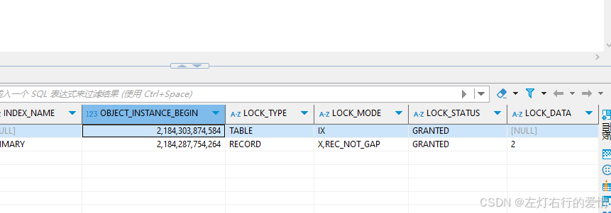  
 我们可以在Lock\_Type字段里看到一共加了两个锁，分别为：

* 表锁： X类型的意向锁
* 行锁： X类型的记录锁

在Lock\_Mode 可以确认是next-key锁,间隙锁,记录锁:

* 如果 LOCK\_MODE 为 X，说明是 next-key 锁；
* 如果 LOCK\_MODE 为 X, REC\_NOT\_GAP，说明是记录锁；
* 如果 LOCK\_MODE 为 X, GAP，说明是间隙锁；

#### 为什么会退化为间隙锁

假设事务 执行了这条等值查询语句，查询的记录是「不存在」于表中的.

```
begin;
SELECT * FROM employees WHERE id = 20 FOR UPDATE;

SELECT * FROM performance_schema.data_locks;


```

执行后获取的结果如下:  
 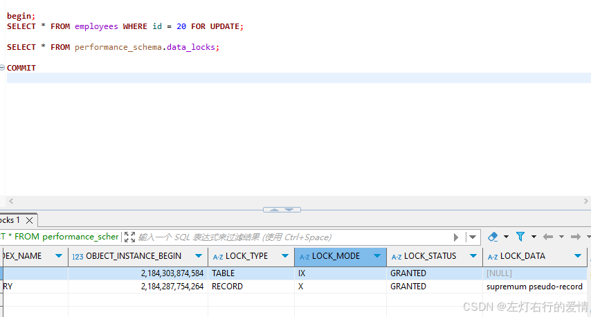  
 从上图可以看到，共加了两个锁，分别是：

* 表锁：X 类型的意向锁；
* 行锁：X 类型的间隙锁；  
   此时事务 在 id = 20 记录的主键索引上加的是间隙锁，锁住的范围是 (19, 21)

#### 为什么我可以插入id=19的数据?

接下来,如果有其他事务插入19,21这一些记录的话,这些插入的雨具都会阻塞(插入id=19会被阻塞,但是插入id=9不会被阻塞).  
 注意如果你用本地同一个事务插入是可以成功插入的,即使你在加了间隙锁后成功插入 id = 19，并不意味着这个锁没有生效。实际上，在你插入记录时，锁住的间隙并没有阻止插入操作，因为没有其他事务在此位置竞争。**间隙锁主要是防止其他事务插入新记录，而不是阻止当前事务插入。**

#### 为什么锁住的范围是(19,21)

* MySQL 根据索引的有序性来推断出加锁的区间，间隙锁的目的是防止在当前查询的区间内插入新的记录。
* 如果该查询所涉及的范围是 id = 20，但没有找到，那么 间隙锁会锁住的是 20 的位置区间，即锁住 (19, 21) 这个区间，防止其他事务插入 id = 20 或者更新 id = 19 和 id = 21 的位置。
* 这并不意味着会锁住 19 或 21 本身，而是锁住了一个范围，阻止其他事务在该范围内插入记录。

### 唯一索引范围查询

在 MySQL 中，当使用 唯一索引 执行范围查询时，系统会对每个扫描到的索引条目加 next-key 锁。但在以下几种情况下，next-key 锁会退化成 记录锁 或 间隙锁，具体规则如下：

1. 针对 >=（大于等于）范围查询

* 如果查询条件中包括 **等值查询**，且 **该等值记录已经存在**，则：
  + **`next-key` 锁会退化成记录锁**。即，如果查询到的记录是具体存在的，那么只会锁住该记录，而不再锁住它前后的区间。

2. 针对 < 或 <=（小于或小于等于）范围查询

* **当条件值对应的记录不在表中时**：

  + 扫描到 **终止范围记录** 时，`next-key` 锁会退化成 **间隙锁**，表示锁住该记录与其前一条记录之间的间隙。
  + 其他扫描到的记录仍然加上 **`next-key` 锁**，锁住记录和前后间隙。
* **当条件值对应的记录在表中时**：

  + **如果是 `<` 查询条件**：当扫描到终止范围记录时，`next-key` 锁会退化成 **间隙锁**，但其他记录会加 **`next-key` 锁**。
  + **如果是 `<=` 查询条件**：当扫描到终止范围记录时，**`next-key` 锁不会退化成间隙锁**，直接锁住该记录。  
     下面我们详细解释.我们目前表中数据如下:  
     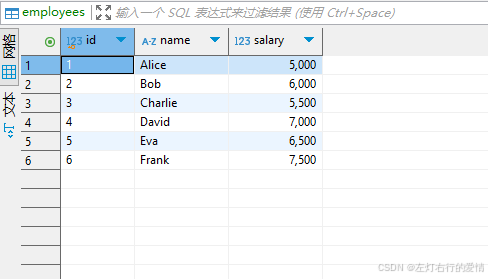

#### > 或>=的情况

##### > 的情况

假设事务 执行了这条范围查询语句:

```
SELECT * FROM employees WHERE id > 5 FOR UPDATE;


```

执行结果如下:  
 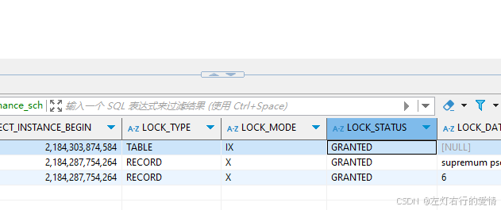  
 我们可以看到加的是两个行级锁:

* X型的临键锁,范围(6,+正无穷)
* X型的临键锁,范围(5,6]

加锁过程:

1. 开始找第一行id=6,由于查询该记录不是一个等值查询（不是大于等于条件查询）,所以对该主键索引加的是范围为(5,6]的临键锁.
2. 由于是范围查找，就会继续往后找存在的记录，虽然我们看见表中最后一条记录是 id =6 的记录，但是实际在 Innodb 存储引擎中，会用一个特殊的记录来标识最后一条记录，该特殊的记录的名字叫 **supremum pseudo-record** ，所以扫描第二行的时候，也就扫描到了这个特殊记录的时候，会对该主键索引加的是范围为 (6, +∞] 的 next-key 锁。
3. 停止扫描。

##### >=的情况

假设事务执行了这条范围查询语句：

```
SELECT * FROM employees WHERE id >= 5 FOR UPDATE;


```

执行结果如下:  
 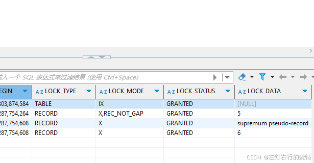  
 可以看到了加了三个锁:

* 记录锁,id=5
* 临键锁,范围(6,正无穷)
* 临键锁,(5.6]  
   针对「大于等于」条件的唯一索引范围查询的情况下， 如果条件值的记录存在于表中，那么由于查询该条件值的记录是包含一个等值查询的操作，所以该记录的索引中的 next-key 锁会退化成记录锁.

#### <或<=的情况

现在我们修改一下表的数据,修改后如下: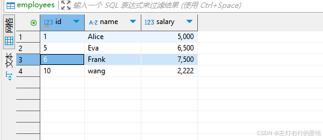

##### < 且条件值记录不存在的情况

我们执行下面sql:

```
SELECT * FROM employees WHERE id < 6 FOR UPDATE;


```

分析锁如下:  
 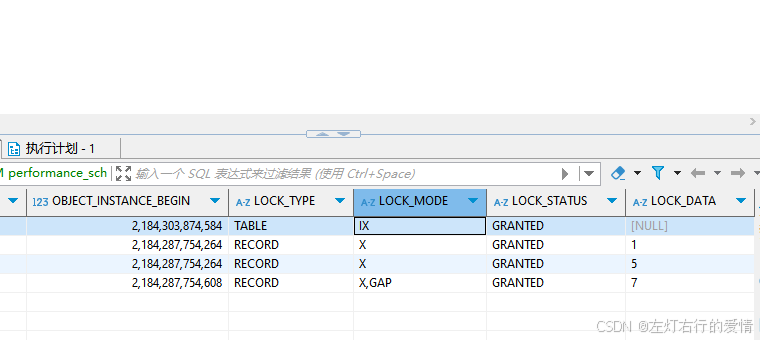  
 可以看出加了三个锁:

* 临键锁 (负无穷,1]
* 临键锁(1,5]
* 间隙锁(5,7)

**如果条件值的记录不在表中，那么不管是「小于」还是「小于等于」的范围查询，扫描到终止范围查询的记录时，该记录中索引的 next-key 锁会退化成间隙锁，其他扫描的记录，则是在这些记录的索引上加 next-key 锁。**

##### <=且查询记录在表中

执行的sql如下:

```
SELECT * FROM employees WHERE id <=5 FOR UPDATE;


```

分析锁得出:  
 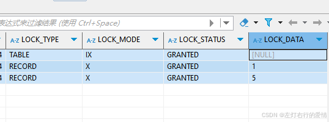  
 可以看出加了两个锁:

* 临键锁,范围(负无穷,1]
* 临键锁,范围(1,5]

##### < 且查询条件值记录存在

执行的sql如下:

```
SELECT * FROM employees WHERE id <5 FOR UPDATE;


```

分析锁得到如下:  
 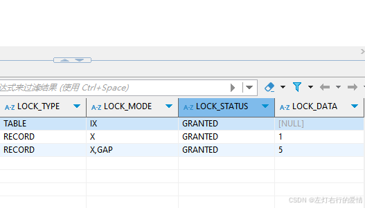  
 可以看出获取的锁:

* 临键锁,范围(负无穷,1]
* 间隙锁,范围(1,5)

##### <或<=总结

存在这两种情况会将索引的 next-key 锁会退化成间隙锁的：

* 当条件值的记录「不在」表中时，那么不管是「小于」还是「小于等于」条件的范围查询,扫描到终止范围查询的记录时，该记录的主键索引中的 next-key 锁会退化成间隙锁，其他扫描到的记录，都是在这些记录的主键索引上加 next-key 锁。
* 当条件值的记录「在」表中时
  + 如果是「小于」条件的范围查询  
     扫描到终止范围查询的记录时，该记录的主键索引中的 next-key 锁会退化成间隙锁，其他扫描到的记录，都是在这些记录的主键索引上，加 next-key 锁。
  + 如果是「小于等于」条件的范围查询  
     扫描到终止范围查询的记录时，该记录的主键索引中的next-key 锁「不会」退化成间隙锁，其他扫描到的记录，都是在这些记录的主键索引上加 next-key 锁。

### 非唯一索引等值查询

因为存在两个索引，一个是主键索引，一个是非唯一索引（二级索引），所以在加锁时，**同时会对这两个索引都加锁，但是对主键索引加锁的时候，只有满足查询条件的记录才会对它们的主键索引加锁。**  
 查询的记录存不存在，加锁的规则也会不同,分为两种情况:

* 当查询的记录「存在」
* 当查询的记录「不存在」

下面我们详细说明.

表格数据如下:  
 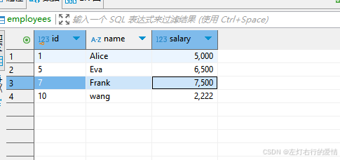

#### 记录不存在

由于不是唯一索引，所以肯定存在索引值相同的记录,**于是非唯一索引等值查询的过程是一个扫描的过程**.  
 扫描规则是什么呢?

1. 扫描到第一个不符合条件的二级索引记录就停止扫描
2. 对扫描到的二级索引记录加的是 next-key 锁
3. 对于第一个不符合条件的二级索引记录,该二级索引的 next-key 锁会退化成间隙锁。
4. 在符合查询条件的记录的主键索引上加记录锁。

我们举例来说

```
SELECT * FROM employees WHERE salary  = 7000 FOR UPDATE;


```

分析锁如下:  
 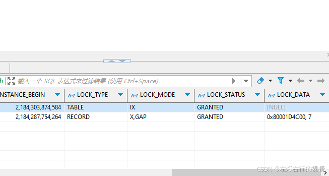  
 加锁流程如下:

* 定位第一条不符合查询条件的二级索引,即扫描到salary=7500,该二级索引的临键锁会退化成间隙锁,范围是(6500,7500).
* 停止查询

如果有事务插入salary值在6500到7500之间的新纪录,那么会发生阻塞.  
 不过如果插入7501,则可以插入,但有些情况也无法成功插入.

我们先搞清楚,什么情况插入语句会阻塞.  
 **插入语句在插入一条记录之前，需要先定位到该记录在 B+树 的位置，如果插入的位置的下一条记录的索引上有间隙锁，才会发生阻塞。**

我们要先要知道二级索引树是如何存放记录的.  
 **二级索引树是按照二级索引值（salary列）按顺序存放的，在相同的二级索引值情况下， 再按主键 id 的顺序存放。**

我们重新举个例子:  
 我们现在要插入salary 为500的记录,那么有两种情况

* 插入成功  
   插入一条salary=500,id=3的记录,在二级索引树上定位到插入的位置，而该位置的下一条salary=400,id=20，该记录的二级索引上没有间隙锁，所以这条插入语句可以执行成功。
* 插入失败  
   插入一条salary=500,id=30的记录,在二级索引树上定位到插入的位置，而该位置的下一条是salary= 1000,id =40,正好该记录的二级索引上有间隙锁，所以这条插入语句会被阻塞，无法插入成功。

我们现在要插入salary 为1000的记录,那么有两种情况

* 插入成功  
   当其他事务插入一条 salary = 1000,id=60的记录,在二级索引树上定位到插入的位置，而该位置的下一条记录不存在,也就没有间隙锁了，所以这条插入语句可以插入成功。
* 插入失败  
   当其他事务插入一条 salary = 1000,id=10的记录,在二级索引树上定位到插入的位置,而该位置的下一条是 salary = 800,id=40,正好该记录的二级索引上有间隙锁，所以这条插入语句会被阻塞，无法插入成功。

**语句是否可以执行成功，关键还要考虑插入记录的主键值，因为「二级索引值（salary 列）+主键值（id列）」才可以确定插入的位置，确定了插入位置后，就要看插入的位置的下一条记录是否有间隙锁，如果有间隙锁，就会发生阻塞，如果没有间隙锁，则可以插入成功。**

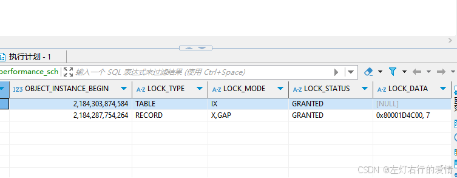  
 上面图片的LOCK\_DATA是什么意思呢?  
 第一个数值是表示的二级索引,也就是我们salary的值.  
 第二个数值表示的是主键值,它代表的是Id值.  
 那边表示的意思就是:  
 事务在salary=7000记录的二级索引上,加了()6500,7500)的间隙锁,同时不允许插入新纪录的id值小于7.

但是我们无法从select \* from performance\_schema.data\_locks\G;  
 输出的结果分析出「在插入 age =22 新记录时，哪些范围的 id 值是可以插入成功的」，**这时候就得自己画出二级索引的 B+ 树的结构，然后确定插入位置后，看下该位置的下一条记录是否存在间隙锁，如果存在间隙锁，则无法插入成功，如果不存在间隙锁，则可以插入成功。**

#### 记录存在

执行下面sql语句:

```
select * from demo.employees where salary = 7500 for update;


```

执行结果如下:  
 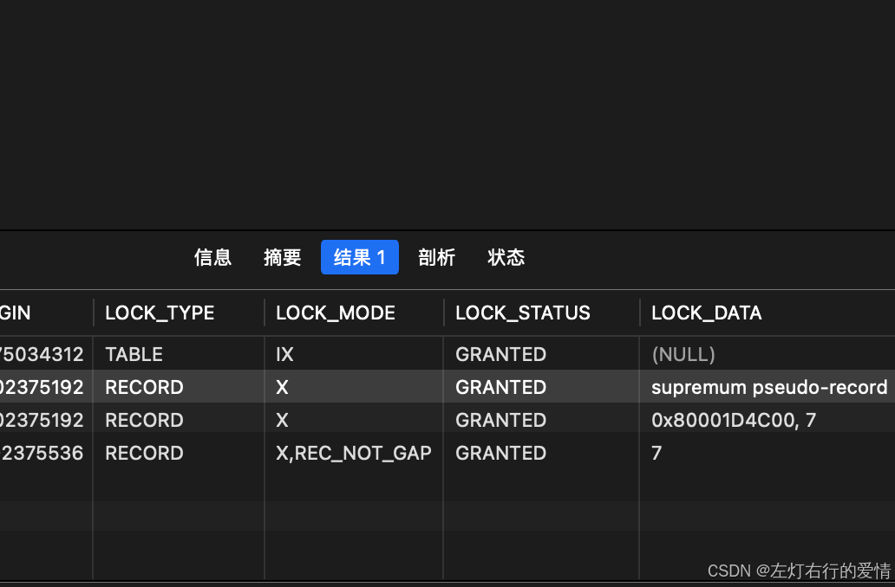  
 我们可以看到是加了三个锁:

* 主键索引  
   Lock\_Mode 为x,REC\_NOT\_GAP的为记录锁.
* 二级索引

1. 左边是(负无穷,7]
2. 右边是(7,下一条记录)

建议画一个图去看,列出主键等信息,然后对比着看.

### 非唯一索引范围查询

非唯一索引和主键索引的范围查询的加锁也有所不同.  
 不同之处在于非唯一索引范围查询，**索引的 next-key lock 不会有退化为间隙锁和记录锁的情况，也就是非唯一索引进行范围查询时，对二级索引记录加锁都是加 next-key 锁。**  
 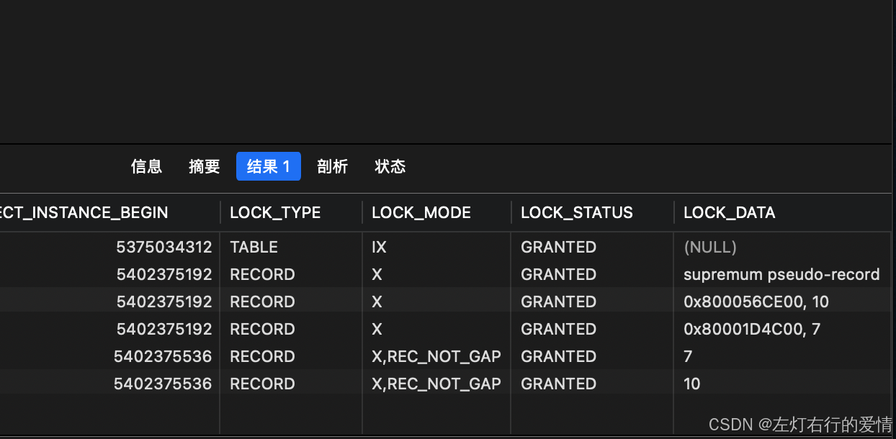  
 我们可以看到是加了五个锁:

* 主键索引  
   Lock\_Mode 为x,REC\_NOT\_GAP的为记录锁.  
   对主键7,10 分别加了一个记录锁.
* 二级索引

1. 临键锁(最后一条记录,正无穷]
2. 临键锁(上一个记录,7]
3. 临键锁(本条记录,10]

### 没有加索引的查询

如果锁定读查询语句，没有使用索引列作为查询条件，或者查询语句没有走索引查询，导致扫描是全表扫描。那么，每一条记录的索引上都会加 next-key 锁，这样就相当于锁住的全表，这时如果其他事务对该表进行增、删、改操作的时候，都会被阻塞。  
 这样就相当于锁住的全表，这时如果其他事务对该表进行增、删、改操作的时候，都会被阻塞。  
 一定要检查语句是否走了索引，如果是全表扫描的话，会对每一个索引加 next-key 锁，相当于把整个表锁住了，这是挺严重的问题。

## 示例

### ✅ 示例 1：唯一索引 + 等值查询（记录存在）

```
SELECT * FROM employees WHERE id = 2 FOR UPDATE;


```

#### 加锁类型：

* **Record Lock**（记录锁）

#### 加锁范围：

* 仅锁住 `id = 2` 这一条记录

#### 加锁原因：

* 使用的是**唯一索引**
* 条件为**等值查询**
* 且**记录存在**

#### 解释：

InnoDB 确认该条件最多只能返回一条记录，并且定位到了该记录，不需要防止其他事务插入 → **退化为 Record Lock**

---

### ✅ 示例 2：唯一索引 + 等值查询（记录不存在）

```
SELECT * FROM employees WHERE id = 2 FOR UPDATE;


```

（前提：id=2 在表中不存在，且有记录 id=1 和 id=3）

#### 加锁类型：

* **Gap Lock**（间隙锁）

#### 加锁范围：

* 间隙区间 `(1, 3)`（2 所在的逻辑空隙）

#### 加锁原因：

* 这是唯一索引 + 等值查询
* 但目标记录不存在
* 为了防止其他事务插入 `id=2` 的记录造成“幻读”

#### 解释：

InnoDB 无法对“不存在的记录”加 Record Lock，于是加锁该记录应处于的**间隙范围** → Gap Lock。

---

### ✅ 示例 3：唯一索引 + 范围查询（记录存在）

```
SELECT * FROM employees WHERE id >= 5 FOR UPDATE;


```

（假设当前有 id=5、6、7 三条记录）

#### 加锁类型：

* 对 `id=5` → **Record Lock**（退化）
* 对 `id=6`, `id=7` → **Next-Key Lock**

#### 加锁范围：

* `[5]`：记录锁
* `[6,7)`：区间锁（Next-Key）

#### 加锁原因：

* 第一个值 `id=5` 是**范围的起点，精确命中** → 加 Record Lock
* 后续都是范围遍历 → 加 Next-Key Lock 防止插入

#### 解释：

起始点精确定位（唯一索引退化），后续记录按 InnoDB 默认使用 Next-Key Lock 处理。

---

### ✅ 示例 4：唯一索引 + 范围查询（终止记录不存在）

```
SELECT * FROM employees WHERE id < 5 FOR UPDATE;


```

（假设记录为 id=1, 3）

#### 加锁类型：

* 对 `[MIN,1)` → Gap Lock
* 对 `[1,3)` → Next-Key Lock
* 对 `[3,5)` → Gap Lock

#### 加锁范围：

锁住所有小于5的区间，终止值 `id=5` 不存在 → 最后一段是 Gap Lock

#### 加锁原因：

* 范围查询本身 → 触发默认的 Next-Key Lock
* 范围终止值 `5` 不存在 → InnoDB 不能锁具体记录，只能锁终止区间

#### 解释：

对于 **范围终止值不存在** 的查询，MySQL 不加 Record Lock，而是加 **终止区间上的 Gap Lock**

---

### ✅ 示例 5：非唯一索引 + 等值查询

```
SELECT * FROM employees WHERE salary = 6000 FOR UPDATE;


```

（假设 salary 是普通索引，有3条 salary=6000 的记录）

#### 加锁类型：

* 对 salary 索引中满足条件的每个 entry → 加 **Next-Key Lock**
* 同时对应的主键记录 → 加 **Record Lock**

#### 加锁范围：

* 所有满足条件的索引记录（Next-Key）
* 所有对应的主键记录（Record Lock）

#### 加锁原因：

* salary 是**非唯一索引**
* 即便是等值查询，也可能命中多条记录
* InnoDB 不知道是否会有更多记录 → 使用 Next-Key Lock
* 为了读取主键数据，还需加主键的 Record Lock（回表）

#### 解释：

非唯一索引**无法精准定位唯一记录**，即使是等值查询，也会使用 Next-Key Lock；同时由于 InnoDB 是**聚簇索引结构**，需要对主键对应记录加 Record Lock。

---

### ✅ 示例 6：无索引列查询

```
SELECT * FROM employees WHERE name = 'Tom' FOR UPDATE;


```

（假设 name 列没有任何索引）

#### 加锁类型：

* **全表扫描锁主键记录**（Record Lock）

#### 加锁范围：

* 表中所有满足 `name='Tom'` 条件的主键记录

#### 加锁原因：

* name 字段未建索引 → 必须扫描全表
* 加锁也只能落在主键记录上

#### 解释：

MySQL 的行锁是**基于索引加锁**，非索引列无法利用索引定位 → 只能退化为全表扫描并加锁主键。
