> 原文：[CSDN](https://blog.csdn.net/qq_45852626/article/details/128187466)（历史文章导入，当前状态为草稿）

## 前言

整理回顾MySQL的核心内容，后面每天会抽时间更新整理。  
 内容来自各个博客和书籍整理而来。

## 什么是事务

事务就是由单独单元的一个或多个
SQL语句
组成，在这个单元中，每个SQL语句都是相互依赖，而整个单独单元是不可分割的存在。  
 事务是一个整体，事务中的内容只能是都成功或者都不成功，不存在部分执行成功或者部分失败。

### 事务的特性

事务的特性内容简称ACID：

* 原子性 Atomicity  
   过程的保证  
   事务是数据库的逻辑工作单位，事务中包含的各操作要么都做，要么都不做。
* 一致性 consistency  
   结果的保证  
   事务执行的结果必需是使数据库从一个一致性状态变到另一个一致性状态。  
   因此当数据库只包含成功事务提交的结果时，就说数据库处于一致性状态，如果数据库系统运行中发生故障，有些事务尚未完成就被迫中断，这些未完成事务对数据库所做的修改有一部分已写入物理数据库，这时数据库就处于一种不正确的状态，或者说是不一致的状态。
* 隔离性 Isolation  
   防止并发事物相互干扰  
   一个事物的执行不能被其他事物干扰。即一个事务内部的操作及使用的数据对其他并发事物是隔离的，并发执行的各个事务之间不能相互干扰。
* 持久性 （永久性）Durability  
   永久性保存  
   一个事务一旦提交，它对数据库中的数据的改变就应该是永久性的。接下来的其他操作或故障不应该对其执行结果有任何影响。

InnoDB引擎通过什么技术来保证事务这四个特性呢？

* 原子性通过 undo log（回滚日志）保证
* 一致性通过持久性+原子性+隔离性来保证
* 隔离性是通过MVCC（多版本并发控制）或锁机制保证
* 持久性是通过redo log（重做日志）保证  
   这些具体的日志，MVCC，锁在后面专辑内容里 我们都会介绍，这篇文章只谈涉及到的。

### 事务的状态

我们现在知道 事务 是一个抽象的概念，它其实对应着一个或多个数据库操作，MySQL根据这些操作所执  
 行的不同阶段把 事务 大致划分成几个状态：

* 活动的（Active）  
   事务对应的数据库操作正在执行过程中时，我们就说该事务处在活动的状态。
* 部分提交的（Partially Committed）  
   当事务中的最后一个操作执行完成，但由于操作都在内存中执行，**所造成的影响并没有刷新到磁盘时**，我们就说该事务处在部分提交的状态。
* 失败的（Failed）  
   当事务处在活动的或者部分提交的状态时，可能遇到了某些错误（数据库自身的错误，操作系统或者直接断电等）而无法继续执行，或者人为的停止当前事务的执行，我们就说该事务处在失败的状态
* 中止的（Aborted）  
   如果事务执行了一部分而变为失败的状态，那么就需要把已经修改的事务中的操作还原到事务执行前的状态。  
   换句话说，就说要撤销失败事务对当前数据库造成的影响。  
   我们把这个撤销称为回滚。当回滚操作执行完毕时，也就是数据库恢复到了执行事务前的状态，我们就说事务处在了中止的状态。
* 提交的（Committed）  
   当一个处在部分提交的状态的事务将修改过的数据都同步到磁盘上之后，我们就可以说该事务处在了提交的状态。

状态转换图如下所示：  
 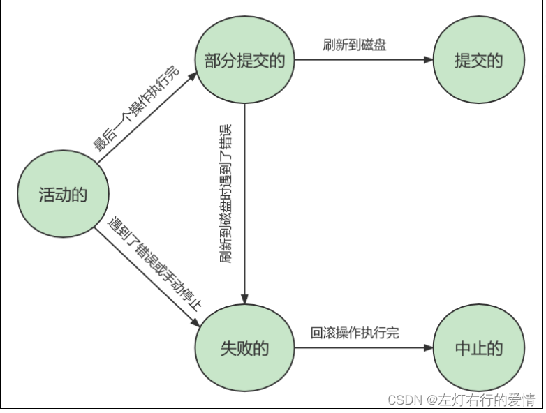

### 事务会引发什么问题？

MySQL服务端是允许多个客户端链接的，这意味着MySQL会出现同时处理多个事务的情况。  
 那么在处理多个事务，会出现以下几种问题：

* 脏读（Dirty Read）  
   一个事务在处理过程中读取了另外一个事务未提交的数据。  
   当一个事务正在访问数据并且对其进行了修改，但是还没提交事务，这时另外一个事务也访问了这个数据，然后使用了这个数据，因为这个数据的修改还没提交到数据库，所以另外一个事务读取的数据就是“脏数据”，这种行为就是“脏读”，依据“脏数据”所做的操作可能是会出现这个问题。  
   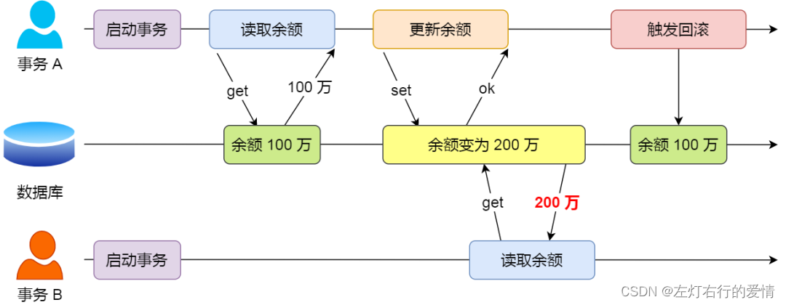
* 修改丢失（Lost of Modify）  
   是指一个事务读取一个数据时，另外一个数据也访问了该数据，那么在第一个事务修改了这个数据之后，第二个事务也修改了这个数据。  
   这样第一个事务内的修改结果就被丢失。  
   **这个其实不会影响到程序的结果，只是逻辑上不正确。**
* 不可重复读（Unrepeatableread）  
   指在一个事务内多次读取同一数据，在这个事务还没结束时，另外一个事务也访问了这个数据并对这个数据进行了修改，那么就可能造成第一个事务两次去读的数据不一致。  
   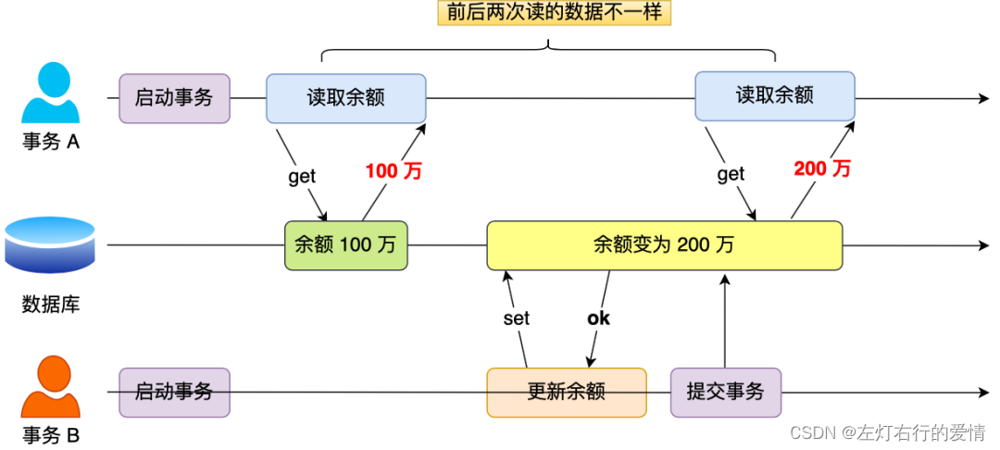
* 幻读（Phantom Read）  
   指同一个事务内多次查询返回的结果集不一样（比如增加了或者减少了行记录）  
   幻读与不可重复读类似，幻读是指一个事务读取了几行数据，这个事务还没结束，接着另外一个事务插入了一些数据，在随后的查询中，第一个事务读取的数据就会别原本读取的多，就像发生幻觉了一样。  
   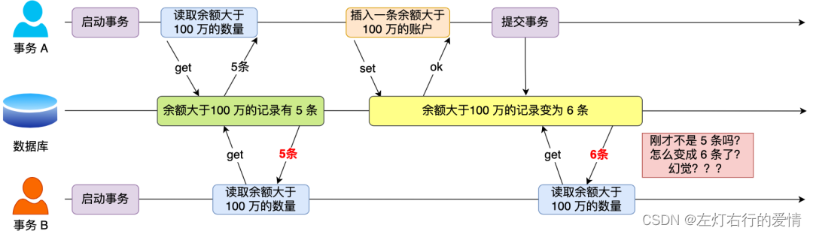  
   总结一下：
* 脏读：读到其他事物未提交的数据
* 不可重复读：前后读取的数据不一致
* 幻读：前后读取的记录数量不一致  
   这三个现象的严重性排序如下：  
     
   那么如何解决上面的问题呢？

### 解决事物引发的问题手段

SQL标准提出了四种隔离级别来规避这些现象，隔离级别越高，性能越低，这四个隔离级别如下：

* 读未提交：指一个事务还没提交，它做的变更就能被其他事物看到；
* 读提交：指一个事务提交之后，它做的变更才能被其他事物看到；
* 可重复读：指一个事务执行过程中看到的数据，一直跟这个事务启动时看到的数据是一致的，MySQL InnoDB引擎的默认隔离级别；
* 串行化：会对记录加上读写锁，在多个事务对这条记录进行读写操作时，如果发生了读写冲突的时候，后访问的事务必需等前一个事务执行完成，才能继续执行。  
   按隔离水平高低排序如下：  
     
   针对不同的隔离级别，并发事物时可能发生的现象也会不同：  
   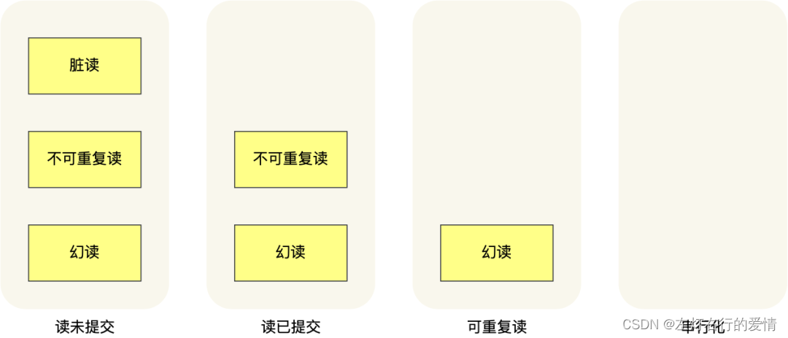  
   那么这四种隔离级别具体是如何实现的呢？

## 事务日志

我们知道了事务有四种特性：原子性，一致性，隔离性和持久性。  
 事务的原子性，一致性和持久性可以由事务日志实现，我们下面具体来看一看。  
 日志大概分为三种：

* undo log（回滚日志）：是InnoDB存储引擎层生成的日志，实现了事务中的原子性，主要用于事务回滚和MVCC。
* redo log‘（重做日志）：是InnoDB存储引擎层生成的日志，实现了事务中的持久性，主要用于掉电等故障回复
* binlog（归档日志）：是Server层生成的日志，主要用于数据备份和主从赋值。  
   注意，undo log是逻辑日志，对事物回滚时，只是将数据库逻辑地恢复到原来的样子。  
   redo log是物理日志，记录的是数据页的物理变化，undo log不是redo log的逆过程。

### Undo Log 日志

#### 简单介绍

我们在执行执行一条“增删改”语句的时候，虽然没有输入 begin 开启事务和 
commit 
 提交事务，但是 MySQL 会**隐式开启事务**来执行“增删改”语句的，执行完就自动提交事务的，这样就保证了执行完“增删改”语句后，我们可以及时在数据库表看到“增删改”的结果了。  
 是否开启自动提交事务，是由**autocommit**参数决定的，默认是开启。  
 有个问题需要考虑一下：  
 **一个事务执行过程中，在还没有提交事务之前，如果MySQL发生了崩溃，要怎么回滚到事务之前的数据呢？**

答案：我们在事务在执行过程中，都记录下回滚需要的信息到一个日志里，那么事务执行中途发生了MySQL崩溃后，就不需要担心无法回滚到事务之前的数据，我们可以通过这个日志回滚到事务之前的数据。

实现这一机制就是 Undo log（回滚日志），它保证了事务的ACID特性中的原子性（Atomicity）。

undo log 是一种用于撤销回退的日志。在事务没提交之前，MySQL会先记录更新前的数据到Undo log日志文件里面，当事务回滚时，可以利用undo log 来记录回滚，如下图：  
 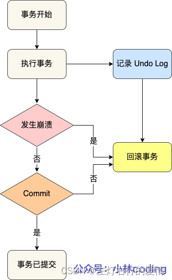  
 每当InnoDB引擎对一条记录进行操作（新增，修改，删除）时，就把回滚时需要的信息都记录到undo log里，比如：

* 在插入一条记录时  
   要把这条记录的主键值记下来，这样之后回滚时只需要把这个主键值对应的记录删掉就好了；
* 在删除一条记录时  
   要把这条记录中的内容都记下来，这样之后回滚时再把由这些内容组成的记录插入到表中就好了；
* 在更新一条记录时  
   要把被更新的列的旧值记下来，这样之后回滚时再把这些列更新为旧值就好了。

在发生回滚时，就读取undo log里的数据，然后做原先相反的操作。

#### 具体实现

不同的操作，需要记录的内容也是不同的，所以不同类型的操作产生的undo  
 log格式也不同，具体每个操作产生的undo log格式就不详细介绍了，感兴趣自己去查查吧。

一个记录的每一次更新操作产生的undo log格式都有一个roll\_pointer指针和一个trx\_id事务id：

* 通过trx\_id可以知道该记录被哪个事务修改的；
* 通过roll\_pointer指针可以将这些undo log串成一个链表，这个链表就称为版本链，如下图：  
   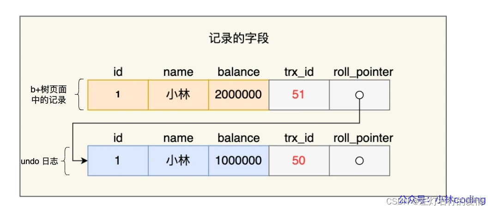  
   另外，undo log还有一个作用，通过ReadView+undo log 实现MVCC（多版本并发控制）。

对于【读提交】和【可重复读】隔离级别，他们快照读（普通select语句）是通过ReadView+undo log来实现的，它们的区别在于创建
Read 
 View的时机不同：

* 【读提交】隔离级别是在每个select都会生成一个新的Read View，事务期间多次读取同一条数据，前后两次读的数据可能会出现不一致，因为这期间可能另外一个事务修改了该记录，并提交了事务。
* 【可重复读】隔离级别是启动事务时生成了一个Read View，然后整个事务期间都在用这个Read View,这样就保证了在事务期间读到的数据都是事务启动前的记录。

这两个级别实现通过【事务的Read View里的字段】和【记录中的两个隐藏列（trx\_id和roll\_pointer指针）】的比对，如果不满足可见行，就会顺着undo log版本链里找到满足其可见性的记录，从而控制并发事物访问同一个记录时的行为，这就叫MVCC（多版本并发控制），

因此 undo log两大作用：

* 实现事务回滚，保障事务的原子性。  
   事务处理过程中，如果出现了错误或者用户执行了ROLLBACK语句，MYSQL可以易用undo log中的历史数据将数据恢复到事务开始之前的状态。
* 实现MVCC（多版本并发控制）关键因素之一。  
   MVCC是通过ReadView+undo log实现的。  
   undo log为每条记录保存多份历史数据，MySQL在执行快照读（普通select语句）的时候，会根据事物的Read View里的信息，顺着undo log 的版本链找到满足其可见性的记录。

### Buffer Pool

MySQL的数据都是存在磁盘中，那么我们要更新一条记录时，得先要从磁盘读取记录，然后在内存中修改这条记录。那修改完这条记录是选择直接写回磁盘，还是选择缓存起来呢？

当然是缓存起来好，这样下次有查询语句命中管理这条记录，直接读取缓存中的记录，就不需要从磁盘获取数据了。

为此InnoDB存储引擎设计了一个缓冲池（Buffer Pool），来提高数据库的读写性能。  
 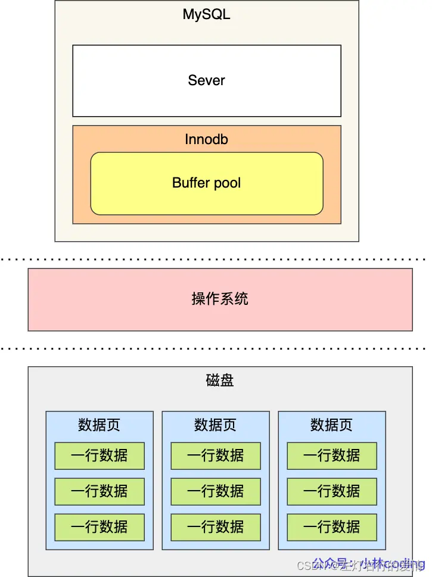  
 有了Buffer Pool之后：

* 读取数据时  
   如果数据存在Buffer Pool中，客户端就会直接读取Buffer Pool中的数据，否则再去磁盘中读取。
* 修改数据时  
   如果数据存在Buffer Pool中，那直接修改Buffer Pool中数据所在的页，然后将其页设置为脏页（该页的内存数据和磁盘上的数据已经不一致），为了减少磁盘I/O，不会立即将脏页写入磁盘，后续由后台线程选择合适时机将脏页写入磁盘。

#### Buffer Pool缓存什么？

InnoDB会把存储的数据划分为若干个【页】，以页作为磁盘和内存交互的基本单位，一个页的默认大小为16KB，因此，Buffer Pool同样按照【页】来划分。  
 在 MySQL 启动的时候，InnoDB 会为 Buffer Pool 申请一片连续的内存空间，然后按照默认的16KB的大小划分出一个个的页， Buffer Pool 中的页就叫做缓存页。此时这些缓存页都是空闲的，之后随着程序的运行，才会有磁盘上的页被缓存到 Buffer Pool 中。

所以，MySQL 刚启动的时候，你会观察到使用的
虚拟内存 
空间很大，而使用到的物理内存空间却很小，这是因为只有这些虚拟内存被访问后，操作系统才会触发缺页中断，申请物理内存，接着将虚拟地址和物理地址建立映射关系。

Buffer Pool 除了缓存「索引页」和「数据页」，还包括了 Undo 页，插入缓存、自适应哈希索引、锁信息等等。  
 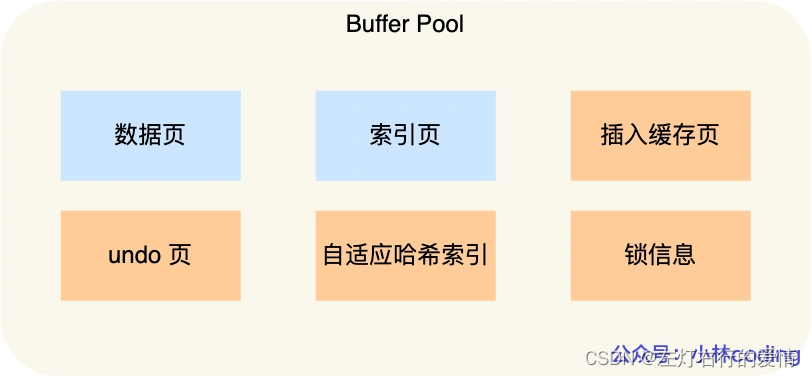  
 注意：并不是查询一条记录，就只缓冲一条记录的。  
 InnoDB会把整个页的数据加载到Buffer Pool中，将页加载到Buffer Pool

### Redo Log日志

#### 为什么需要Redo Log?

我们知道了Buffer Pool是提高了读写效率，但是问题来了，Buffer Pool是基于内存的，而内存是不可靠的，万一断点重启，还没来得及落盘的脏页数据就会丢失。  
 为了防止断电导致数据丢失的问题，当有一条记录需要更新时，InnoDB引擎就会先更新内存（同时标记为脏页），然后将本次对这个页的修改以redo log的形式记录下来，这个时候更新就算完成了。  
 后续，InnoDB引擎在适当的时候，由后台线程将缓存在Buffer Poll的脏页刷新到磁盘里，这就是WAL（Write-Ahead Logging）技术  
 WAL技术指的是：MySQL的写操作并不是立刻写到磁盘上，而是先写日志，然后在合适的时间再写到磁盘上。  
 过程如下：  
 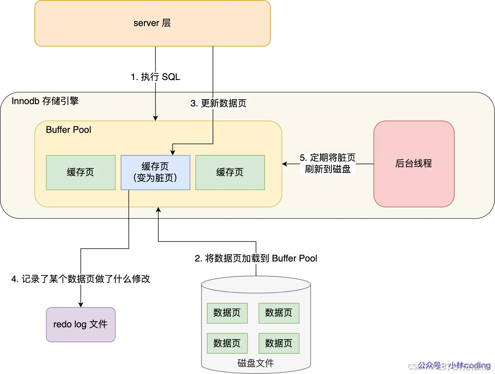

#### 什么是 redo log？

redo log 是物理日志，记录了某个数据页做了什么修改（比如对 XXX 表空间中的 YYY 数据页 ZZZ 偏移量的地方做了AAA 更新），每当执行一个事务就会产生这样的一条或者多条物理日志。

在事务提交时，只要先将 redo log持久化到磁盘即可，可以不需要等到缓存在Buffer Pool里的脏页数据持久化到磁盘。

当系统崩溃时，虽然脏页数据没有持久化，但是redo log已经持久化，接着MySQL重启后，根据redo log的内容，将所有数据恢复到最新的状态。

注意：被修改undo log时，需要记录对应的redo log  
 开始事务后，InnoDB层更新记录前，首先要记录相应的undo log，如果是更新操作，需要把更新的列的旧值记下来，也就是要生成一条undo log，undo log会写入Buffer Pool中的Undo页面。  
 不过在内存修改undo log页面后，需要记录对应的redo log。

#### redo log要写入磁盘，数据也要写磁盘，为什么要多此一举？

写入redo log的方式使用了追加操作，所以磁盘操作是**顺序写**，而写入数据需要**先找到写入位置，然后才写到磁盘，所以磁盘操作是随机写**。

磁盘的顺序写比随机写高效的多，因此redo log写入磁盘的开销更小。

针对顺序写为什么比随机写更快这个问题（举个例子，你有一个本子）

#### redo log什么时候刷盘

### Redo Log和Undo Log的区别在哪？

这两种日志都属于InnoDB存储引擎的日志，它们的区别在于：

* redo log记录了此次事务【完成后】的数据状态，记录的是更新之后的值；
* undo log记录了此次事务【开始前】的数据状态，记录的是更新之前的值；  
   事务提交之前发生了崩溃，重启后会通过undo log回滚事务，事务提交之后发生了崩溃，重启后会通过redo log恢复事务，如下图：  
   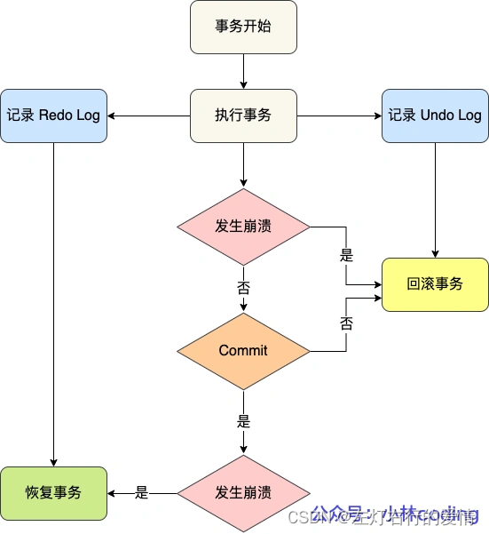  
   所以有了redo log，再通过WAL技术，InnoDB就可以保证即使数据库发生异常重启，之前已提交的记录都不会丢失，这个能力称为crash-safe（崩溃恢复），

---

后面内容待更新，近期补上，上面的内容细节也会补上。
