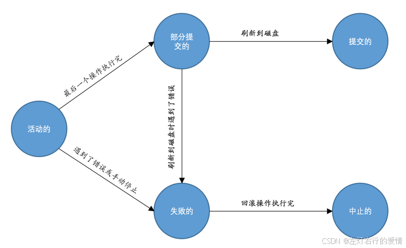

> 原文：[CSDN](https://blog.csdn.net/qq_45852626/article/details/145508618)（历史文章导入，当前状态为草稿）

## 什么是事务

事务(Transaction) 是指一组操作的集合,集合中的操作作为一个整体被执行,全部成功或全部失败.  
 核心目的: 保证数据的一致性和可靠性,尤其是系统发生故障或错误时,能够保证数据的一致性.

## 为什么需要事务

我们以一个简单的银行转账为例，来说明为什么数据库需要保证数据的可靠性。  
 场景：  
 小王和小黎都在银行有账户，账户表如下：

```
CREATE TABLE account (
    id INT NOT NULL AUTO_INCREMENT COMMENT '自增id',
    name VARCHAR(100) COMMENT '客户名称',
    balance INT COMMENT '余额',
    PRIMARY KEY (id)
) Engine=InnoDB CHARSET=utf8;


```

当小王和小黎分别存入11元和2元时，数据库中对应记录是：

| id | name | balance |
| --- | --- | --- |
| 1 | 小王 | 11 |
| 2 | 小黎 | 2 |
| 假设有一天，小黎因为学习买资料，需要借10元钱，小王决定帮他转账。现实世界中，小王在ATM机上输入小黎的账户信息，确认转账。对应的数据库操作如下： |  |  |

```
UPDATE account SET balance = balance - 10 WHERE id = 1; -- 小王账户减10
UPDATE account SET balance = balance + 10 WHERE id = 2; -- 小黎账户加10


```

问题：  
 如果在执行这两条语句时，突然发生了
服务器 
崩溃，可能导致：

* 小王的账户已经扣了10元
* 但小黎的账户却没有得到这10元  
   这种情况就意味着，小黎仍然会面临借了钱,但没有买到资料并且还要还钱的风险！  
   你也不想这样的事情发生在你身上对吧.  
   如何解决：  
   为了解决这种问题，数据库设计者提出了事务的概念。事务保证了所有数据库操作要么完全成功，要么完全失败，这样就避免了数据不一致的情况。  
   事务的四个特性（ACID）：

| 特性 | 说明 |
| --- | --- |
| 原子性（Atomicity） | 事务中的所有操作要么全部成功，要么全部失败，不会出现只执行了部分操作的情况。 |
| 一致性（Consistency） | 事务执行前后，数据库的状态是符合所有约束和规则的。 |
| 隔离性（Isolation） | 多个事务并发执行时，互不干扰，保证每个事务的独立性。 |
| 持久性（Durability） | 一旦事务成功提交，对数据库的修改是永久保存的，不会丢失。 |

下面我们细聊这些特性帮助更好的理解.

## 事务特性

### 原子性

我们从下面几个方面去理解原子性.

#### 现实世界的转账操作是不可分割的

现实世界中的转账操作是一个整体，**不能被拆分**为“转账了一部分”或“转账失败一部分”的情况。要么转账完全成功，要么完全不成功，这就是我们在实际操作中想要的结果。  
 例如，如果小王要给小黎转账10元.这件事只会是下面这样的结果:

1. 要么小王扣了10元
2. 小黎得到了10元
3. 要么转账完全没有发生。

#### 数据库世界的转账操作可能是多个步骤

在数据库世界中，转账操作可能包含多个不同的操作。  
 例如:

1. 首先需要更新小王的账户余额
2. 接着更新小黎的账户余额，还可能涉及缓存更新、磁盘写入等步骤。  
    每个步骤可能都有不同的延迟和潜在风险，这些操作看似独立，实际上都属于同一个业务过程。

#### 可能发生的错误和故障

数据库的操作过程中，可能会发生许多不可预见的错误，像是数据库本身的故障、操作系统错误，甚至是硬件故障（如断电）。**如果在执行过程中某个步骤成功执行了，另一个步骤却因为故障未能完成，数据库就会处于一个不一致的状态，导致数据丢失或不准确。**

---

总结原子性:  
 原子性就是确保一系列操作在数据库中作为一个不可分割的整体要么完全成功，要么完全失败。数据库设计者需要通过事务管理来确保，即使在发生错误的情况下，也能恢复操作之前的状态，从而避免数据库进入不一致的状态。

### 隔离性

现实世界中的两次状态转换应该是互不影响的.  
 举个例子: 小王对小黎同时进行两次金额为5元的转账(在两个ATM上操作).  
 最后结果肯定是小王账户少10元,小黎账户多10元.  
 小王的两次操作是互不影响的,这也很符合我们的直觉判断.  
 但是在数据库里事情就复杂了,我们简化一下问题,来分析小王给小黎转5元的转账流程是什么样的:

1. 读取小王的账户余额到变量A
2. 从小王账户余额减去5元
3. 将修改后的小王账户余额写到磁盘里
4. 读取小黎的账户余额到变量B
5. 从小黎账户余额加上5元
6. 将修改后的小黎账户余额写到磁盘里  
    这么一看,如果是单独执行且不考虑数据库错误的情况下,整个流程是没有问题的.  
    但是如果说我们模拟计算机中常见的并发执行情况,那就问题不小了.  
    假设我们还是小王给小黎同时进行2次转5元,我们记为T1,T2操作.  
    理想状态是,先执行T1或T2,然后结束转账.  
    但是很不幸，真实的数据库中T1和T2的操作可能交替执行.  
    那就有可能我T1变量A读取为11,然后执行T1的线程挂起了.  
    然后T2的变量A也紧跟着读取为11.  
    但正确情况应该是T2变量A读取为6(因为T1要先执行一次转账).  
    那么最后的结果是小王只扣了一次钱,但是小黎获取了10块钱,银行亏麻了.

---

所以不仅要以原子性的方式执行完成,还要保证它的状态转换不会被其他状态转换影响,这种规则就叫做隔离性.  
 怎么实现我们后面去聊.

### 一致性

我们生活的这个世界存在着形形色色的约束，比如身份证号不能重复，性别只能是男或者女，高考的分数只能在0～750之间.  
 比如有个小孩儿跟你说他高考考了1000分，你一听就知道他胡扯呢。  
 数据库世界只是现实世界的一个映射，现实世界中存在的约束当然也要在数据库世界中有所体现。**如果数据库中的数据全部符合现实世界中的约束（all defined rules），我们说这些数据就是一致的，或者说符合一致性的。**

#### 数据库的一致性

一致性在数据库中意味着，\*\*数据在执行操作之前和之后必须符合数据库定义的所有约束规则。\*\*比如，在银行系统中，账户余额不应该小于 0，这是一个一致性的要求。  
 那么我们如何保证一致性呢?

* **数据库内建机制**  
   数据库提供了很多内建的功能来保证数据一致性。例如，MySQL 可以为表设置 主键（Primary Key）、唯一索引（Unique Index）、外键（Foreign Key） 和 NOT NULL 约束。这些机制能够保证插入或更新数据时，不会违反一些基础的规则。  
   举例来说:

```
CREATE TABLE account (
   id INT NOT NULL AUTO_INCREMENT COMMENT '自增id',
   name VARCHAR(100) COMMENT '客户名称',
   balance INT COMMENT '余额',
   PRIMARY KEY (id),
   CHECK (balance >= 0)  -- 确保账户余额不为负
);


```

这里的 
CHECK 
 (balance >= 0) 约束表示，账户余额不可以为负数。

* **CHECK 约束的实际问题**  
   但是，MySQL 中的 CHECK 约束实际上并没有被启用（即使语法正确，数据库并不会检查数据是否满足该条件）。这意味着如果你插入一个余额为负数的记录，MySQL 并不会报错。  
   对于这类情况，像 SQL Server 和 Oracle 这样的数据库系统会检查 CHECK 约束，并拒绝插入不符合条件的数据。
* **通过触发器保证一致性**  
   由于 MySQL 不支持 CHECK 约束，通常可以通过编写 触发器（Triggers） 来保证一致性。触发器是数据库中的一类机制，可以在特定操作（如插入、更新）之前或之后执行一些自动化的检查或操作。
* **业务代码保证一致性**  
   在一些复杂的情况下，一致性需求可能无法仅依靠数据库自身的功能来保证。例如，银行可能要求每次交易都检查所有账户的余额和交易的总金额，确保系统总的余额是对的。这种操作很复杂，可能影响系统的性能，因此数据库并不直接处理，往往交给应用层的业务代码来完成。

总结而言呢,**一致性 是保证数据符合现实世界规则的约束，确保数据合法有效。**

### 持久性

当这个现实世界的转账操作映射到数据库时，持久性确保了一旦事务成功提交，所有的数据库修改都会保存在磁盘中。无论后续发生什么意外（如数据库崩溃、系统断电等），这些操作的结果都不会丢失。  
 **它保证了所有经过提交的事务都不可撤销，即使发生系统崩溃或故障后，数据的变化仍会被恢复并保留，避免丢失。**

## 事务的状态

我们现在知道事务是一个抽象的概念，它其实对应着一个或多个数据库操作，事务在执行过程中经历的各个阶段都对数据库的状态产生不同的影响。理解这些状态有助于我们更好地掌握事务管理和处理错误,让我们来详细分析每个状态及其含义：

### 状态分析

#### 活动的（Active）

**定义**：事务正在执行过程中，所有的数据库操作都在进行中，但还没有提交或回滚。  
 **举例**：小王正在向小黎转账5元，读取数据、修改余额、计算等操作正在进行时，事务处于“活动的”状态。

#### 部分提交的(Partially Committed)

**定义**：事务中的最后一个操作执行完成，但数据还没有刷新到磁盘。也就是说，虽然操作在内存中完成，但还没有写入持久化
存储 
中。  
 **举例**：小王正在向小黎转账5元，所有数据库操作（如扣除小王余额、增加小黎余额）都已完成，但修改还只存在于内存中，并未最终写入磁盘，事务就处于“部分提交”的状态。

#### 提交的(Committed)

**定义**：当事务的所有操作成功执行，并且所有修改都已经同步到磁盘时，事务进入“提交”状态。此时，事务对数据库的所有修改都永久生效。  
 **举例**：在转账完成后，小王账户的余额已减少，小黎账户的余额已增加，这些修改成功写入磁盘，事务进入“提交”状态，转账完成。

#### 失败的(Failed)

**定义**：事务在“活动”或“部分提交”状态时，因某些错误（如数据库错误、操作系统错误、系统崩溃等）无法继续执行。这时，事务无法完成，状态变为“失败的”。  
 **举例**：小王正在向小黎转账时，系统崩溃，事务处于“活动”状态，但由于错误，事务无法继续执行，进入“失败”的状态。

#### 中止的(Aborted)

**定义**：：事务已经处于“失败”状态，需要进行回滚操作，即撤销事务对数据库的修改。回滚会将数据恢复到事务开始前的状态。完成回滚后，事务变为“中止”状态。  
 **举例**：如果在转账过程中，小王账户扣款成功，但小黎账户没有增加金额，发生系统崩溃，事务进入“失败”状态。在这种情况下，已经执行的操作（如扣款）需要回滚，以确保数据库状态不受影响，最终事务进入“中止”状态。

### 事务生命周期总结

* 活动状态（Active）：事务正在执行中，数据库操作尚未提交。
* 部分提交状态（Partially Committed）：事务的操作完成，但数据尚未写入磁盘。
* 失败状态（Failed）：事务因为某些错误无法继续执行。
* 中止状态（Aborted）：事务由于失败需要回滚，撤销之前做出的所有更改。
* 提交状态（Committed）：事务成功执行，所有更改已保存并且持久化。

### 举例说明

* 活动状态：小王向小黎转账操作开始，读取并修改账户余额。
* 部分提交状态：操作在内存中完成，但尚未写入磁盘。
* 失败状态：操作未能继续完成，可能因为数据库错误、系统崩溃等。
* 中止状态：由于操作失败，小王账户的余额被回滚，恢复到未扣款前的状态。
* 提交状态：如果操作成功，小王账户余额减少，小黎账户余额增加，修改持久保存到磁盘，操作完成。  
   

## 事务语法

### 开启事务

* BEGIN  
   BEGIN语句代表开启一个事务.  
   开启事务后，就可以继续写若干条语句，这些语句都属于刚刚开启的这个事务。

```
mysql> BEGIN;
Query OK, 0 rows affected (0.00 sec)
mysql> 加入事务的语句...


```

* START TRANSACTION  
   START TRANSACTION语句和BEGIN语句有着相同的功效，都标志着开启一个事务，比如这样：

```
mysql> START TRANSACTION;
Query OK, 0 rows affected (0.00 sec)
mysql> 加入事务的语句...


```

不过比BEGIN语句牛逼一点儿的是，可以在START TRANSACTION语句后边跟随几个修饰符，就是它们几个：

1. READ ONLY:标识当前事务是一个只读事务
2. READ WRITE:标识当前事务是一个读写事务
3. WITH CONSISTENT SNAPSHOT:启动一致性读

### 提交事务

开启事务之后就可以继续写需要放到该事务中的语句了，当最后一条语句写完了之后，我们就可以提交该事务了，提交的语句也很简单：

```
COMMIT 


```

COMMIT语句就代表提交一个事务.比如我们上面说小王给小黎转10元钱其实对应MySQL中的两条语句，我们就可以把这两条语句放到一个事务中，完整的过程就是这样：

```
mysql> BEGIN;
Query OK, 0 rows affected (0.00 sec)

mysql> UPDATE account SET balance = balance - 10 WHERE id = 1;
Query OK, 1 row affected (0.02 sec)
Rows matched: 1  Changed: 1  Warnings: 0

mysql> UPDATE account SET balance = balance + 10 WHERE id = 2;
Query OK, 1 row affected (0.00 sec)
Rows matched: 1  Changed: 1  Warnings: 0

mysql> COMMIT;
Query OK, 0 rows affected (0.00 sec)


```

### 手动中止事务

如果我们写了几条语句之后发现上面的某条语句写错了，我们可以手动的使用下面这个语句来将数据库恢复到事务执行之前的样子：

```
ROLLBACK 


```

比如我们在写小王给小黎转账10元钱对应的MySQL语句时，先给小王扣了10元，然后一时大意只给小黎账户上增加了1元，此时就可以使用ROLLBACK语句进行回滚，完整的过程就是这样：

```
mysql> BEGIN;
Query OK, 0 rows affected (0.00 sec)

mysql> UPDATE account SET balance = balance - 10 WHERE id = 1;
Query OK, 1 row affected (0.00 sec)
Rows matched: 1  Changed: 1  Warnings: 0

mysql> UPDATE account SET balance = balance + 1 WHERE id = 2;
Query OK, 1 row affected (0.00 sec)
Rows matched: 1  Changed: 1  Warnings: 0

mysql> ROLLBACK;
Query OK, 0 rows affected (0.00 sec)


```

ROLLBACK语句是我们程序员手动的去回滚事务时才去使用的，如果事务在执行过程中遇到了某些错误而无法继续执行的话，事务自身会自动的回滚。

### 自动提交

MySQL中有一个
系统变量
autocommit：

```
mysql> SHOW VARIABLES LIKE 'autocommit';
+---------------+-------+
| Variable_name | Value |
+---------------+-------+
| autocommit    | ON    |
+---------------+-------+
1 row in set (0.01 sec)


```

以看到它的默认值为ON，也就是说默认情况下，如果我们不显式的使用START TRANSACTION或者BEGIN语句开启一个事务，那么每一条语句都算是一个独立的事务，这种特性称之为事务的自动提交。  
 假如我们在小王向小黎转账10元时不以START TRANSACTION或者BEGIN语句显式的开启一个事务，那么下面这两条语句就相当于放到两个独立的事务中去执行：

```
UPDATE account SET balance = balance - 10 WHERE id = 1;
UPDATE account SET balance = balance + 10 WHERE id = 2;


```

当然，如果我们想关闭这种自动提交的功能，可以使用下面两种方法之一：

* 显式的的使用START TRANSACTION或者BEGIN语句开启一个事务。
* 把系统变量autocommit的值设置为OFF，就像这样:`SET autocommit = OFF;`

### 隐式提交

当我们使用START TRANSACTION或者BEGIN语句开启了一个事务，或者把系统变量autocommit的值设置为OFF时，事务就不会进行自动提交，但是如果我们输入了某些语句之后就会悄悄的提交掉，就像我们输入了COMMIT语句了一样，这种因为某些特殊的语句而导致事务提交的情况称为隐式提交.  
 这些会导致事务隐式提交的语句包括:

* 定义或修改数据库对象的数据定义语言（Data definition language，缩写为：DDL）。  
   所谓的数据库对象，指的就是数据库、表、视图、存储过程等等这些东西。当我们使用CREATE、ALTER、DROP等语句去修改这些所谓的数据库对象时，就会隐式的提交前面语句所属于的事务，就像这样：

```
BEGIN;

SELECT ... # 事务中的一条语句
UPDATE ... # 事务中的一条语句
... # 事务中的其它语句

CREATE TABLE ... # 此语句会隐式的提交前面语句所属于的事务


```

* 隐式使用或修改mysql数据库中的表

```
当我们使用ALTER USER、CREATE USER、DROP USER、GRANT、RENAME USER、REVOKE、SET PASSWORD等语句时也会隐式的提交前面语句所属于的事务。


```

* 事务控制或关于锁定的语句  
   当我们在一个事务还没提交或者回滚时就又使用START TRANSACTION或者BEGIN语句开启了另一个事务时，会隐式的提交上一个事务，比如这样：

```
BEGIN;

SELECT ... # 事务中的一条语句
UPDATE ... # 事务中的一条语句
... # 事务中的其它语句

BEGIN; # 此语句会隐式的提交前面语句所属于的事务


```

* 还有其他的一些语句,也不经常用,遇到了搜一下就可以了

### 保存点

如果你开启了一个事务，并且已经敲了很多语句，忽然发现上一条语句有点问题，你只好使用ROLLBACK语句来让数据库状态恢复到事务执行之前的样子，然后一切从头再来，总有一种一夜回到解放前的感觉。  
 就像是打空洞骑士(难度高,死忙代价很高,会丢失很多东西)一样,死一次就让你抓狂.  
 相反奥日的森林就很轻松一点,里面的存档点很多,死亡代价小,让玩家更敢操作.  
 那这个游戏里的存档点就像这里的保存点一样:  
 在事务对应的数据库语句中打几个点，我们在调用ROLLBACK语句时可以指定会滚到哪个点，而不是回到最初的原点。定义保存点的语法如下：

```
SAVEPOINT 保存点名称;


```

当我们想回滚到某个保存点时，可以使用下面这个语句：

```
ROLLBACK TO 保存点名称;

如果ROLLBACK语句后边不跟随保存点名称的话，会直接回滚到事务执行之前的状态。


```

如果我们想删除某个保存点，可以使用这个语句：

```
RELEASE SAVEPOINT 保存点名称;


```

下面还是以小王向小黎转账10元的例子展示一下保存点的用法，在执行完扣除小王账户的钱10元的语句之后打一个保存点：

```
mysql> SELECT * FROM account;
+----+--------+---------+
| id | name   | balance |
+----+--------+---------+
|  1 | 小王   |      11 |
|  2 | 小黎   |       2 |
+----+--------+---------+
2 rows in set (0.00 sec)

mysql> BEGIN;
Query OK, 0 rows affected (0.00 sec)

mysql> UPDATE account SET balance = balance - 10 WHERE id = 1;
Query OK, 1 row affected (0.01 sec)
Rows matched: 1  Changed: 1  Warnings: 0

mysql> SAVEPOINT s1;    # 一个保存点
Query OK, 0 rows affected (0.00 sec)

mysql> SELECT * FROM account;
+----+--------+---------+
| id | name   | balance |
+----+--------+---------+
|  1 | 小王   |       1 |
|  2 | 小黎   |       2 |
+----+--------+---------+
2 rows in set (0.00 sec)

mysql> UPDATE account SET balance = balance + 1 WHERE id = 2; # 更新错了
Query OK, 1 row affected (0.00 sec)
Rows matched: 1  Changed: 1  Warnings: 0

mysql> ROLLBACK TO s1;  # 回滚到保存点s1处
Query OK, 0 rows affected (0.00 sec)

mysql> SELECT * FROM account;
+----+--------+---------+
| id | name   | balance |
+----+--------+---------+
|  1 | 小王   |       1 |
|  2 | 小黎   |       2 |
+----+--------+---------+
2 rows in set (0.00 sec)


```
