> 原文：[CSDN](https://blog.csdn.net/qq_45852626/article/details/145510931)（历史文章导入，当前状态为草稿）

## 事务隔离级别简介
## 前言

上文我们聊过什么是事务,已经事务的特征和语法.  
 那么你是否会好奇事务特征都是怎么实现的,这章我们来聊聊事务隔离性,其他三个性质我们放在后面去说.  
 文章参考了小林博主和pdai博主 的文章,进行加工再整合,加入了自己的一些思考和想法,自我感觉还是挺全面了.

## 什么是隔离性

数据库**允许多个并发事务同时对其数据进行读写和修改的能力**,隔离性可以**防止多个事务并发执行时由于交叉执行而导致数据的不一致**,因为多个事务同时使用相同的数据时，不会相互干扰，每个事务都有一个完整的数据空间，对其他并发事务是隔离的.

## 并发事务会引发什么问题

MySQL 服务端是允许多个客户端连接的，这意味着 MySQL 会出现同时处理多个事务的情况.  
 处理多个事务的时候,会出现几种情况,有大佬已经总结下来了,是以下三种:

* **脏读（dirty read）**
* **不可重复读（non-repeatable read）**
* **幻读（phantom read）**

### 脏读

#### 🏴‍☠️ 什么是脏读？

脏读，就像你 **不小心看到了不该看的东西**，让你感觉很反胃，忍不住吐槽：

> **“真是脏了我的眼！”** 🤢

在数据库中，**脏读** 发生的情况是：

> **一个事务读取了另一个未提交事务修改过的数据**，最终这些修改可能会被撤销，导致读取到的内容不真实。

---

🎭 **脏读案例：小王向小黎转账**

#### 🎬 事务过程

🎲 **步骤 1：事务A（小王转账）开始**

* **小王给小黎转账 100 元**，先从小王账户中扣除 100 元。
* 但此时 **事务还未提交**，数据库只是暂时修改了余额。  
   👀 **步骤 2：事务B（小黎查询余额）**
* **小黎此时查询账户余额**，发现已经多了 100 元！💰
* 但她并不知道这 100 元来自一个 **未提交的事务**。  
   💥 **步骤 3：事务A回滚**
* 由于某些原因（例如：系统崩溃、业务校验失败等），**小王的转账事务失败并回滚**，账户恢复到原来的状态。
* 也就是说，**小黎实际上并没有真正收到 100 元**！  
   🚨 **步骤 4：数据不一致**
* **小黎查询到的余额（多 100 元）是错误的**，因为它来自一个未提交的事务。
* 这个数据最终 **被撤销**，就像从来没发生过一样。

---

#### 🎭 **脏读的严重后果**

**如果小黎直接消费了这 100 块呢？**  
 假设小黎看到余额增加了 **100 元**，立刻消费掉了，那么可能会出现 **两种情况**：

| 结果 | 影响 |
| --- | --- |
| **账户透支** | 如果银行允许透支，那么小黎的账户会变成 **负数**，她需要补上这 100 元。 |
| **银行或商家承担损失** | 如果银行不允许透支，但钱已经被消费，银行或商家可能会遭受损失。 |

总之，**脏读会导致数据不一致**，在现实中是一个 **非常离谱的存在**！🤯

### 不可重复读

**不可重复读**，顾名思义，就是 **同一个事务在不同时间点多次读取同一条数据，结果却不一致**，这让人感觉像是在玩魔术 🎩✨。

#### 🎭 **案例：小王给小黎加薪**

🎬 事务过程  
 🎲 **步骤 1：事务A（小黎查询工资）**

* 小黎在事务A中查询自己的工资，发现是 **5000 元**💰。
* 📝 **步骤 2：事务B（小王调整工资）**
* 小王在 **事务B** 中给小黎 **加薪 1000 元**，把工资从 **5000 元更新为 6000 元**，并 **提交事务** ✅。
* 👀 **步骤 3：事务A 再次查询工资**
* 小黎在 **同一个事务A** 中再次查询自己的工资，发现变成了 **6000 元**！
* \*\*但她明明在同一个事务中，第一次查的时候工资是 5000 元，现在却变成了 6000 元！\*\*🤯

#### ⚠️ **不可重复读的严重后果**

| 影响 | 现实案例 |
| --- | --- |
| **数据不一致** | 小黎在事务A中查工资是 **5000**，过了一会儿 **变成6000**，让她以为自己看错了 🤔。 |
| **业务逻辑混乱** | 假如工资计算逻辑基于第一次查询的结果，会导致错误决策。 |
| **并发事务数据问题** | 事务A在整个过程中**没有修改数据**，却因为事务B的修改，读取到不同的结果，影响业务稳定性。 |

**不可重复读 = 事务内数据变来变去，容易让人怀疑人生！** 😵‍💫

### 幻读

#### 🎭 **什么是幻读？**

**幻读（Phantom Read）**，听起来像是鬼影重重 👻，其实它的本质是：

> **同一个事务两次查询相同范围的数据，第二次查询时发现数据变多了或变少了**，就像幻觉一样，导致事务看到的数据“飘忽不定”。

🎬 **案例：小黎统计员工工资**  
 🎲 **步骤 1：事务A（小黎查询员工数）**

* 小黎正在处理财务，她在 **事务A** 里执行：

  ```
  SELECT COUNT(*) FROM employees WHERE department = '技术部';


  + 1
  ```

  结果返回：10 人 👥。

📝 **步骤 2：事务B（小王新增员工）**  
 小黎在 事务A 中 再次查询 技术部的员工数：

```
SELECT COUNT(*) FROM employees WHERE department = '技术部';


```

结果返回：11 人 🤯！  
 **但她明明在事务A中，没有新增员工，怎么员工数量突然变多了？**

#### ⚠️ 幻读的严重后果

| **影响** | **描述** |
| --- | --- |
| 数据不一致 | 事务A在两次查询之间可能会看到不同的结果，导致数据不一致。 |
| 业务逻辑错误 | 依赖于稳定数据的业务逻辑可能会因幻读而产生错误。 |
| 难以调试 | 幻读问题往往不易复现，增加了系统调试的复杂性。 |
| 事务的完整性风险 | 可能导致事务的预期效果不达成，从而影响系统的整体可靠性。 |

### 对比

* 脏读：读到其他事务未提交的数据；
* 不可重复读：前后读取的数据不一致；
* 幻读：前后读取的记录数量不一致。

#### ⚖️严重性对比

| **特性** | **脏读** | **不可重复读** | **幻读** |
| --- | --- | --- | --- |
| **严重性** | 高 | 中 | 高 |
| **说明** | - 由于读取未提交的数据，可能导致事务完整性严重受损。 - 数据可能完全不可靠，直接影响业务逻辑和决策。 | - 虽然数据是已提交的，但同一事务内读取的结果不一致，可能导致不准确的判断。 - 影响用户体验和业务流程。 | - 由于其他事务的插入，导致查询结果发生变化，可能引发业务逻辑错误。 - 影响数据的稳定性和一致性。 |
| **后果** | - 业务决策失误 - 财务损失 - 信誉受损 | - 计算错误 - 用户体验下降 | - 数据分析错误 - 业务逻辑混乱 |

  
 那如何解决呢?肯定是不能放任不管的呀!

## 事务的隔离级别

SQL 标准提出了四种隔离级别来规避这些现象，隔离级别越高，性能效率就越低，这四个隔离级别如下:

* 读未提交
* 读已提交
* 可重复读
* 串行化

针对不同的隔离级别,并发事务可能发生的现象也会不同,如下图:  
 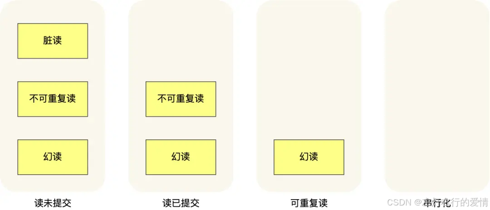  
 MySQL 在「可重复读」隔离级别下，可以很大程度上避免幻读现象的发生（注意是很大程度避免，并不是彻底避免），所以 MySQL 并不会使用「串行化」隔离级别来避免幻读现象的发生,因为使用「串行化」隔离级别会影响性能。  
 InnoDB 引擎的默认隔离级别虽然是「可重复读」，但是它很大程度上避免幻读现象,解决的方案有两种:

* 针对快照读（普通 select 语句），是通过 MVCC 方式解决了幻读.  
   因为可重复读隔离级别下，事务执行过程中看到的数据，一直跟这个事务启动时看到的数据是一致的，即使中途有其他事务插入了一条数据，是查询不出来这条数据的，所以就很好了避免幻读问题。
* 针对当前读（select … for update 等语句）,是通过 next-key lock（记录锁+间隙锁）方式解决了幻读.  
   是通过 next-key lock（记录锁+间隙锁）方式解决了幻读,如果有其他事务在 next-key lock 锁范围内插入了一条记录，那么这个插入语句就会被阻塞，无法成功插入，所以就很好了避免幻读问题。

### 四种隔离级别如何实现

#### 读未提交

因为可以读到未提交事务修改的数据，所以直接读取最新的数据就好了；

#### 串行化

通过加读写锁的方式来避免并行访问

#### 读提交&&可重复读

通过 Read View 来实现的,它们的区别在于创建 Read View 的时机不同.  
 可以把 Read View 理解成一个数据快照，就像相机拍照那样,定格某一时刻的风景.  
 读提交是在「每个语句执行前」都会重新生成一个 Read View.  
 可重复读是在隔离级别是「启动事务时」生成一个 Read View,然后整个事务期间都在用这个 Read View。

**注意，执行「开始事务」命令，并不意味着启动了事务。**  
 在 MySQL 有两种开启事务的命令，分别是：

* begin/start transaction 命令；  
   执行了 begin/start transaction 命令后，并不代表事务启动了。只有在执行这个命令后，执行了第一条 select 语句，才是事务真正启动的时机；
* start transaction with consistent snapshot 命令；  
   马上启动事务。

## MVCC

### 前置知识- 当前读和快照读

#### 当前读

当前读会读取数据最新提交版本,并通过加锁机制确保数据在事务执行期间不被其他事务修改.  
 这种读操作主要出现在下面场景:

##### 显式加锁的select语句

```
SELECT ... FOR UPDATE;      -- 加排他锁（X锁）
SELECT ... LOCK IN SHARE MODE; -- 加共享锁（S锁）


```

##### 写操作(DML语句)

UPDATE、INSERT、DELETE等操作需要先读取最新数据版本，因此也会触发当前读

##### 特点

* 每次读取的都是数据库当前的最新数据
* 通过行锁(共享锁或排他锁)或间隙锁保证并发安全,但可能降低系统吞吐量
* 是悲观锁一种实现方式,适用于需要强一致性的场景(金融扣款等)

#### 快照读

快照读通过MVCC机制读取数据的历史版本(快照),无需加锁,例如:

```
SELECT * FROM table WHERE ...; -- 普通SELECT语句（默认快照读）


```

##### 特点

* 读取的是事务开始时(RR隔离级别)或语句执行时(RC隔离级别)的数据快照
* 基于’undolog’(回滚日志)实现多版本存储,通过’Read View’(可见性视图)判断哪些版本对当前事务可见.
* 不会阻塞其他事务的写操作,并发性能更高.

---

说白了MVCC就是为了实现读-写冲突不加锁，而这个读指的就是快照读, 而非当前读，当前读实际上是一种加锁的操作，是悲观锁的实现

### 什么是MVCC

是一种用于数据库管理系统重的**并发控制技术**,目的解决多个事务并发执行可能产生的数据一致性的问题.

### 为什么产生这种技术

传统数据库中,并发控制通常通过加锁来实现.  
 经典的并发控制方式是**行级锁,表级锁等**.  
 这些锁的基本思想: **当一个事务正在访问某一行或表的数据时,其他事务必须等待,知道当前事务释放锁**.

#### 传统并发控制问题

* 锁竞争  
   多个事务同时争夺资源,尤其是当事务持有锁的时间比较长,会导致大量事务进入等待状态,严重影响并发性能.
* 死锁问题  
   复杂事务操作中,事务之间可能相互等待对方释放锁,导致死锁,需要系统介入进行死锁检测和回滚
* 读操作阻塞  
   当一个事务修改数据时,其他事务即使只是读取这些数据,也必须等待锁的释放,在只读操作占比很高的场景中,性能损失的很明显.

#### MVCC的灵感

MVCC提出的是: 为了避免锁的使用,特别是提了提高读取操作的性能.  
 它利用数据库的**数据版本管理**来解决并发问题,而不是依赖于加锁机制.  
 每个事务都有自己的数据视图(快照),它可以看到自己开始时数据状态,而不会被其他事务影响.  
 总结来说MVCC的灵感来自:

* **事务隔离性要求**
* **读操作的性能问题**
* **乐观锁的思想**

#### MVCC优点

我们前面也聊到了,它的目的是实现读写冲突不加锁,为事务分配单向增长的时间戳,为每个修改保存一个版本,版本与事务时间戳关联,读操作只读该失误开始前的数据库的快照.  
 在并发读写数据库时,可以做到写读不冲突,同时还可以解决脏读,幻读,不可重复读的隔离问题,但不能解决更新丢失问题.

### MVCC实现原理

> MVCC的目的就是多版本并发控制，在数据库中的实现，就是为了解决读写冲突.  
>  它的实现原理**主要是依赖记录中的 4个隐式字段，undo日志 ，Read View 来实现的。**

#### 隐式字段

每行记录除了我们自定义的字段外,还有数据库隐式定义的字段.

* DB\_ROW\_ID (6byte)  
   隐含的自增ID（隐藏主键），如果数据表没有主键，InnoDB会自动以DB\_ROW\_ID产生一个聚簇索引
* DB\_TRX\_ID (6byte)  
   最近修改(修改/插入)事务ID：记录创建这条记录/最后一次修改该记录的事务ID
* DB\_ROLL\_PTR(7byte)  
   回滚指针，指向这条记录的上一个版本（存储于rollback segment里）
* DELETED\_BIT(1byte)  
   记录被更新或删除并不代表真的删除，而是删除flag变了  
   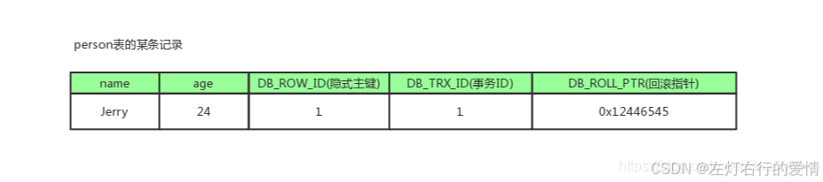  
   如上图，DB\_ROW\_ID是数据库默认为该行记录生成的唯一隐式主键；DB\_TRX\_ID是当前操作该记录的事务ID； 而DB\_ROLL\_PTR是一个回滚指针，用于配合undo日志，指向上一个旧版本；delete flag没有展示出来。

#### Undo Log

InnoDB把这些为了回滚而记录的这些东西称之为undo log。  
 这里需要注意的一点是，由于查询操作（SELECT）并不会修改任何用户记录，所以在查询操作执行时，并不需要记录相应的undo log。undo log主要分为3种:`Insert undo log,Update undo log,Delete undo log`  
 用表格会清楚一点:

##### Undo Log 主要类型及回滚操作

| **类型** | **触发操作** | **记录内容** | **回滚方式** | **回滚后的处理** |
| --- | --- | --- | --- | --- |
| **Insert Undo Log** | `INSERT` | 记录插入记录的主键值 | **直接删除**该记录 | 数据从表中**消失** |
| **Update Undo Log** | `UPDATE` | 记录修改前的**旧值** | **还原**旧值 | 数据恢复成修改前的状态 |
| **Delete Undo Log** | `DELETE` | 记录被删除的**整条数据** | **重新插入**被删除的数据 | 数据恢复成删除前的状态 |

这里对Delete undo log解释一下:

* 删除操作都只是设置一下老记录的DELETED\_BIT，并不真正将过时的记录删除。
* 为了节省磁盘空间，InnoDB有专门的purge线程来清理DELETED\_BIT为true的记录。为了不影响MVCC的正常工作，purge线程自己也维护了一个read view（这个read view相当于系统中最老活跃事务的read view）;如果某个记录的DELETED\_BIT为true，并且DB\_TRX\_ID相对于purge线程的read view可见，那么这条记录一定是可以被安全清除的。

#### Rollback Segment

这里先解释一下Rollback Segment:

* 本质上是一个存放 Undo Log 的存储区域，每个 Rollback Segment 里维护多个 Undo Log 链表。
* 事务修改数据时，会在 Rollback Segment 申请一个 undo log 记录点，并将 修改前的旧数据 按顺序存入 Undo Log 链表。  
   简单的例子如下:

```
Rollback Segment
 ├── Undo Log 1 (更新 name='A' → 'B')
 ├── Undo Log 2 (更新 name='B' → 'C')
 ├── Undo Log 3 (删除 id=5)
 └── ...


```

---

对MVCC有帮助的实质是update undo log ，undo log实际上就是存在rollback segment中旧记录链，它的执行流程如下：

1. 有一个事务插入进来,如下,隐式主键为1,事务ID和回滚指针，我们假设为NULL.  
    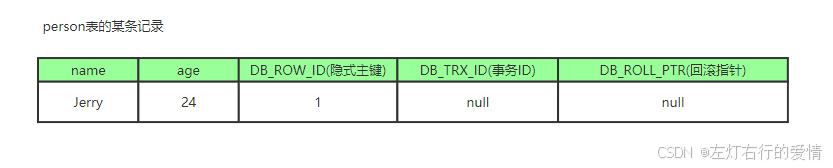
2. 又来了一个事务1对该记录的name做修改,改为Tom  
    这里会执行的步骤如下:

* 在事务1修改该行(记录)数据时，数据库会先对该行加排他锁
* 然后把该行数据拷贝到undo log中，作为旧记录，即在undo log中有当前行的拷贝副本
* 拷贝完毕后，修改该行name为Tom，并且修改隐藏字段的事务ID为当前事务1的ID, 我们默认从1开始，之后递增，**回滚指针指向拷贝到undo log的副本记录**，即表示我的上一个版本就是它
* 事务提交后，释放锁  
   最后变为如下:  
   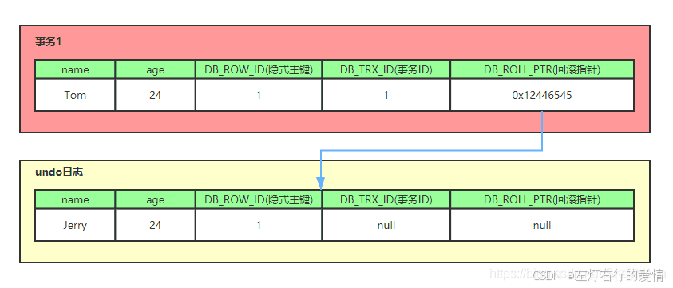

3. 又来了个事务2修改person表的同一个记录，将age修改为30岁  
    执行流程如下:

* 在事务2修改该行数据时，数据库也先为该行加锁
* 然后把该行数据拷贝到undo log中，作为旧记录，发现该行记录已经有undo log了，那么**最新的旧数据作为链表的表头，插在该行记录的undo log最前面**
* 修改该行age为30岁，并且修改隐藏字段的事务ID为当前事务2的ID, 那就是2，回滚指针指向刚刚拷贝到undo log的副本记录
* 事务提交，释放锁  
   最后结果如下:  
   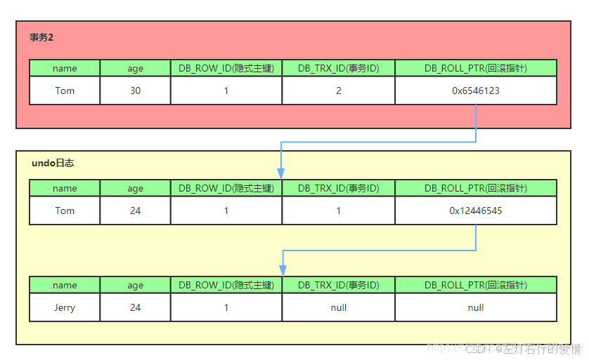  
   我们就可以看出，不同事务或者相同事务的对同一记录的修改，会导致该记录的undo log成为一条记录版本线性表，即链表，undo log的链首就是最新的旧记录，链尾就是最早的旧记录（当然就像之前说的该undo log的节点可能是会purge线程清除掉，比如图中的第一条insert undo log(事务ID为null的)，其实在事务提交之后可能就被删除丢失了，不过这里为了演示，所以还放在这里).

#### Read View(读视图)

##### 概念

Read View就是事务进行快照读操作的时候生产的读视图(Read View)，在该事务执行的快照读的那一刻，会生成数据库系统当前的一个快照.  
 它记录并维护系统当前活跃事务的ID.

所以Read View主要是用来做**可见性判断**.  
 即当我们某个事务执行快照读时,对该记录创建一个Read View读视图，把它比作条件用来判断当前事务能够看到哪个版本的数据，即可能是当前最新的数据，也有可能是该行记录的undo log里面的某个版本的数据。

##### 为什么需要Read View

##### 主要作用: 确保一致性读取(快照读)

场景：

* 事务 A 修改了一行数据，但还未提交。
* 事务 B 也要查询这行数据，但 不能直接看到事务 A 未提交的修改，否则可能导致 脏读（Dirty Read）。
* Read View 让事务 B 看到事务 A 修改前的快照数据，而不是事务 A 的未提交数据，保证数据一致性。

如果没有 Read View，查询可能会读取到未提交的数据，导致事务之间的隔离性被破坏。

##### 避免加锁，提高性能

不使用 Read View 的话，常见的做法是加锁：

* 事务 B 读取数据时，必须等事务 A 提交后才能读取（加共享锁，阻塞其他事务）。
* 这样会降低并发性能，影响数据库的吞吐量。  
   使用 Read View 后：
* 事务 B 可以直接读取事务 A 修改前的版本（快照），而不用等待事务 A 提交。
* 事务 A 仍然可以继续修改，不受影响。
* 不需要加锁，提高并发性能！

结论： Read View 让数据库支持高并发读，而不会影响写操作。

##### 避免幻读

假如有这样的sql:

```
BEGIN;
SELECT COUNT(*) FROM users WHERE age > 18;  -- 结果是 10


```

* 事务 A 查询 users 表，统计 age > 18 的用户数量（10 个）。
* 事务 B 在事务 A 运行期间插入了一条 age=20 的数据，并提交。
* 如果事务 A 重新查询，结果可能变成 11，这就是 幻读（Phantom Read） 问题。

引入Read View后可以避免这样的情况:

* Read View 让事务 A 查询时始终使用事务开始时的快照，不会看到事务 B 插入的新数据.
* 事务 A 直到提交前，看到的数据都是事务开始时的状态，避免了幻读问题。

结论： Read View 确保事务期间的数据一致性，避免幻读。

##### Read View实现原理

Read View 遵循**可见性算法**.  
 主要记录**当前所有未提交的事务ID(活跃事务列表)**.  
 每个事务都有一个唯一递增的ID(DB\_TRX\_ID),新事务ID一定比旧事务的大.  
 Read View维护3个关键属性:

* `m_ids`(活跃事务列表)  
   定义：当前所有未提交的事务ID列表,记录了当前数据库中所有活跃事务。  
   作用：用来标记哪些事务仍在进行，它帮助数据库判断是否需要跳过这些事务的数据（因为它们还未提交）。  
   理解方式： 假设当前有事务 T1（ID=105）、T2（ID=106）正在进行，那么 m\_ids = {105, 106}。这些事务的数据对于其他事务来说不可见。
* `min_trx_id`:  
   定义：这是系统中所有活跃事务（即当前还未提交或回滚的事务）中的最小事务 ID。  
   作用：代表当前系统中活跃的事务中最早创建的事务 ID。

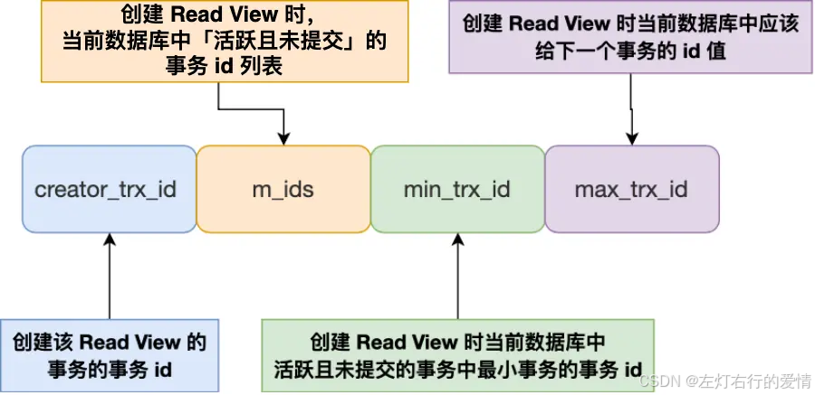

理解方式：如果有事务 T1、T2、T3，其中 T1（ID=105）最早启动并仍在运行，而 T2（ID=106）和 T3（ID=107）也是活跃事务，则 min\_trx\_id = 105。

* `max_trx_id`L下一个即将创建的新事务ID,比当前所有事务ID都大.  
   定义：这是下一个即将启动的事务的 ID，也就是当前事务系统中尚未分配的最大事务 ID。  
   作用：它是数据库中的“未来”事务 ID，任何已经执行的事务的 ID 都会小于这个值。  
   理解方式： 假设当前的最大事务 ID 是 115，那么下一个新开启的事务的 ID 就是 116。

##### 最大事务ID的疑问

当前最大事务ID是5,  
 那我T1事务启动,获得6.  
 那我T2事务启动,该如何获取ID值呢,目前max\_trx\_id还没有更新依旧是5,那T2不应该也是6吗?

解答:  
 这里牵扯到事务ID分配机制:  
 事务 ID 分配系统通常有 事务 ID 分配器，它会确保每个事务都能获得唯一且递增的事务 ID。

顺便提一嘴,max\_trx\_id的更新是在事务提交后更新.

##### 可见性判断规则(核心逻辑)

目标: 找到当前事务能看到的正确数据版本.  
 数据库存储数据时，每一行记录都有一个事务 ID（DB\_TRX\_ID），表示最后修改该行的事务。当事务读取数据时，它会检查这行数据的 DB\_TRX\_ID 是否可见：

1. trx\_id == creator\_trx\_id → 可见（自己改的）
2. trx\_id < min\_trx\_id → 可见（早期已提交）
3. trx\_id >= max\_trx\_id → 不可见（未来的）
4. min ≤ trx\_id < max:  
    ├─ 在 m\_ids 中 → 不可见（活跃未提交）  
    └─ 不在 m\_ids 中 → 可见（已提交）

说明这个事务 在当前事务开启前提交了，所以数据可见。✅

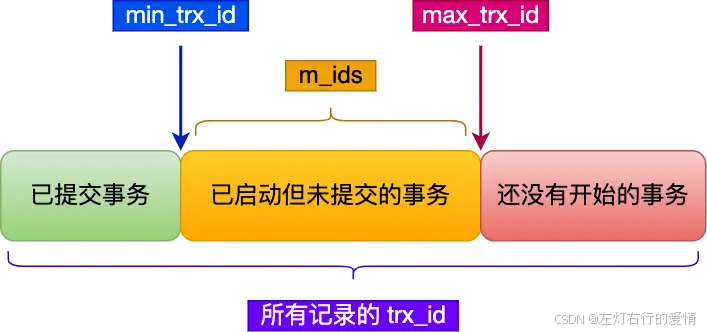

---

我来解释一下关于第三点通过回滚指针找可见版本是什么情况.  
 如果当前版本的 DB\_TRX\_ID 不可见，数据库会使用 回滚指针 (DB\_ROLL\_PTR)，去 Undo Log 里找 上一个版本的数据，然后重复上面的可见性判断，直到找到一个可见的版本。  
 Undo Log 就像一条数据的“历史记录链”，每次修改数据时，都会把旧版本存到 Undo Log，形成一条 版本链，链表的头部是最近的修改，尾部是最早的修改。  
 👉 遍历这个链表，就能找到当前事务可见的最新旧版本！

我们吧Read View 的图拿出来看:  
   
 上面提到的能回滚,是依靠与隐藏列,如下图:  
 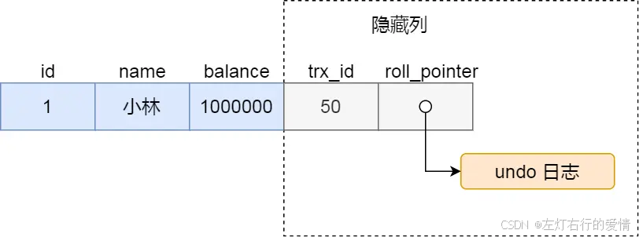

##### 整体流程走一遍

我们在了解了隐式字段，undo log， 以及Read View的概念之后，就可以来看看MVCC实现的整体流程是怎么样了  
 整体的流程是怎么样的呢？我们可以模拟一下:  
 假设背景：  
 当前数据库中有四个事务：事务1、事务2、事务3、事务4。  
 事务 1、事务 3 依然处于活跃状态。  
 事务 4 在事务 2 执行快照读之前已经提交。

事务 2 执行快照读：  
 当 事务 2 开始执行“快照读”时，数据库会为事务 2 创建一个 Read View，它会记录：

* 当前活跃的事务 ID：即系统中仍在执行的事务 ID（比如，事务 1 和事务 3）
* up\_limit\_id：这个属性记录事务 ID 列表中最小的 ID（即最早启动的事务）。在我们的例子中，up\_limit\_id = 1（事务 1）。
* low\_limit\_id：记录下一个事务 ID，也就是所有事务 ID 中最大的那个值 + 1。假设目前最大的事务 ID 是 4，那么 low\_limit\_id = 5。
* trx\_list：这是当前活跃事务的 ID 列表。在我们的例子中，trx\_list = [1, 3]，因为事务 1 和事务 3 还在运行。

如下图

| 事务1 | 事务2 | 事务3 | 事务4 |
| --- | --- | --- | --- |
| 事务开始 | 事务开始 | 事务开始 | 事务开始 |
| … | … | … | 修改且已提交 |
| 进行中 | 快照读 | 进行中 |  |
| … | … | … |  |

判断数据可见性:  
 在事务 2 执行快照读时，它会根据 Read View 来判断数据的可见性：

1. 数据库记录的事务 ID（DB\_TRX\_ID），也就是数据行修改时的事务 ID，和当前事务 2 的 Read View 中的属性进行对比。
2. 具体来说:

* 如果 DB\_TRX\_ID < up\_limit\_id：表示该修改是在事务 2 启动之前就提交的，事务 2 可以看到这个数据版本。
* 如果 DB\_TRX\_ID ≥ low\_limit\_id：表示该修改是在事务 2 启动之后才提交的，事务 2 看不到这个数据版本。
* 如果 DB\_TRX\_ID 在 trx\_list 中（即当前活跃事务列表中）：说明该事务还没有提交，事务 2 也看不到这个数据版本。
* 如果 DB\_TRX\_ID 不在 trx\_list 中，且不满足前两种条件：表示该事务已经在事务 2 启动之前提交，因此数据对事务 2 可见。

例子中的情况：  
 在我们这个例子中，假设事务 4 修改了某行数据，并且在事务 2 执行快照读前就已经提交。  
 假设 事务 4 的 DB\_TRX\_ID = 4。事务 2 在快照读时，会查看该数据行的 DB\_TRX\_ID。  
 因为DB\_TRX\_ID = 4 是大于 up\_limit\_id = 1，小于 low\_limit\_id = 5，所以数据是可见的。

流程图如下:  
 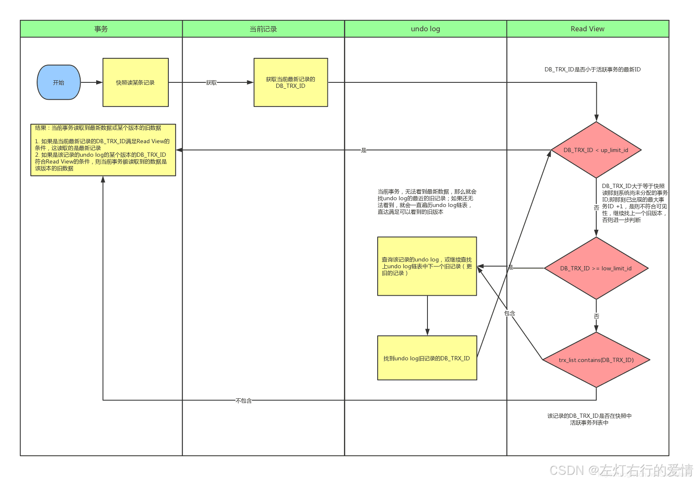

## 可重复读如何工作

可重复读隔离级别是**启动事务时**生成一个 Read View,然后整个事务期间都在用这个 Read View.

### 例子

假设事务 A （事务 id 为51）启动后，紧接着事务 B （事务 id 为52）也启动了，那这两个事务创建的 Read View 如下：  
 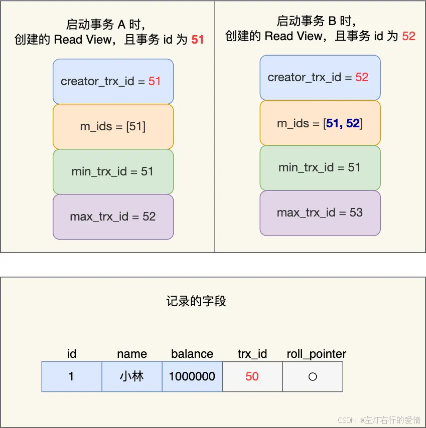  
 在可重复度隔离级别下, 事务A和事务B按顺序执行了以下操作:

1. 事务 B 读取小王的账户余额，发现余额是 100 万。
2. 事务 A 修改小王的账户余额，将余额改为 200 万，但 事务 A 并没有提交事务。
3. 事务 B 再次读取小王的账户余额，依然看到余额是 100 万，因为事务 B 读取的是事务开始时的数据快照，不受事务 A 未提交的修改影响。
4. 事务 A 提交了修改，账户余额更新为 200 万。
5. 事务 B 再次读取小王的账户余额，结果仍然是 100 万，因为事务 B 看到的是事务开始时的快照数据，而不是最新提交的更新。

事务 B 第一次读小王的账户余额记录，在找到记录后，它会先看这条记录的 trx\_id,此时发现 trx\_id 为 50，**比事务 B的 Read View 中的 min\_trx\_id 值（51）还小,这意味着修改这条记录的事务早就在事务 B 启动前提交过了,所以该版本的记录对事务 B 可见的**，也就是事务 B 可以获取到这条记录.

接着，事务 A 通过 update 语句将这条记录修改了（还未提交事务）,将小林的余额改成 200 万，这时 MySQL 会记录相应的 undo log，并以链表的方式串联起来，形成版本链,如下图:  
 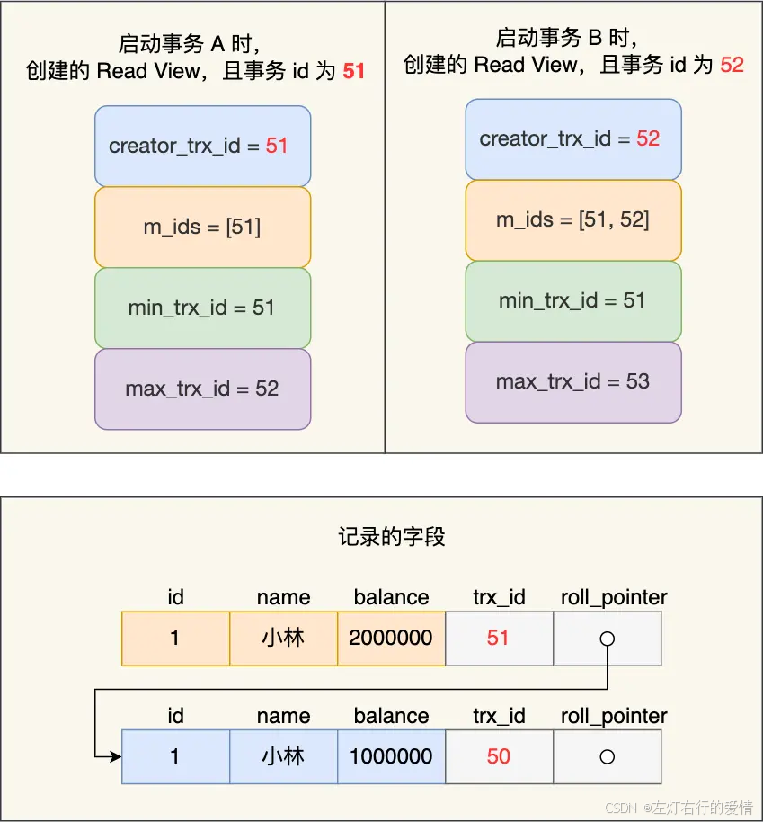

1. 事务 A 修改了小王的账户余额，将余额改为 200 万。此时，之前的余额（100 万）变成了旧版本，并通过链表的方式和新的记录相连接。最新记录的 trx\_id 是 51，代表事务 A 的事务 ID。
2. 事务 B 第二次读取小林的账户余额时，看到这条记录的 trx\_id 值是 51，这是事务 A 修改后的记录。  
    由于这个 trx\_id 在当前事务 B 的 Read View 中的 min\_trx\_id 和 max\_trx\_id 之间，并且还在活跃事务列表 m\_ids 中（说明事务 A 还没有提交），事务 B 判断这个记录是事务 A 修改但还未提交的版本，所以 事务 B 不读取这个版本。
3. 由于事务 B 无法读取未提交的修改，它会继续沿着 undo log 链 查找旧版本的记录。它找到的第一条符合条件的旧版本记录是 trx\_id 为 50 的版本（即事务 B 启动时看到的记录），这是余额 100 万 的记录。
4. 直到 事务 A 提交事务，这时事务 A 对小林账户的余额更新为 200 万。但因为事务 B 在执行过程中已经基于它启动时的 Read View 来读取数据，所以即使事务 A 已经提交了修改，事务 B 还是会读取它启动时看到的旧记录，即 100 万。
5. 事务 B 第三次读取 小林的账户余额时，还是会读取到 100 万，因为事务 B 依然在使用它启动时的 Read View 来判断数据是否可见。即使事务 A 提交了更新，事务 B 也不会看到这些提交后的更新数据，仍然看到的是启动时的快照数据。

## 读提交如何工作

读提交隔离级别是在**每次读取数据时**，都会生成一个新的 Read View。  
 事务期间的多次读取同一条数据，前后两次读的数据可能会出现不一致，因为可能这期间另外一个事务修改了该记录，并提交了事务。

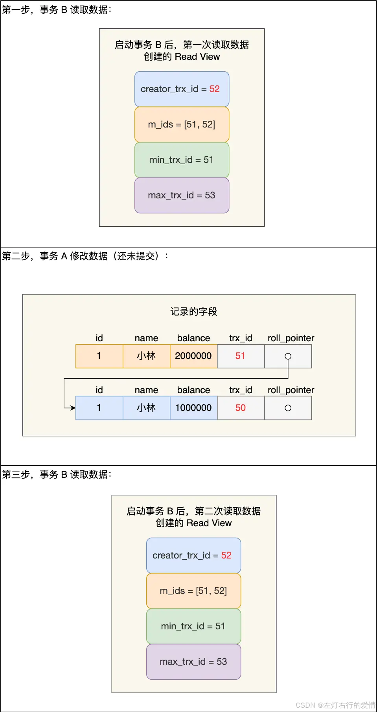

### 为什么事务B第二次读不到事务A修改数据

事务 B 第二次读取时的过程:

* 首先会查看该记录的 trx\_id（事务 A 修改后的记录的 trx\_id 是 51）。
* 事务 B 会将记录的 trx\_id 与它自己 Read View 中的 min\_trx\_id 和 max\_trx\_id 比较。

在事务 B 的 Read View 中，min\_trx\_id 和 max\_trx\_id 分别是 51 和 53:

* 事务 B 在找到小王这条记录时，会看这条记录的 trx\_id 是 51,发现是在 min\_trx\_id 和 max\_trx\_id 之间。
* 然后再判断 trx\_id 值是否在 m\_ids 范围内。

结果发现是在的=>**说明这条记录是被还未提交的事务修改的.**  
 所以这时事务 B 并不会读取这个版本的记录,而是沿着 undo log 链条往下找旧版本的记录,**直到找到trx\_id 「小于」事务 B 的 Read View 中的 min\_trx\_id 值的第一条记录**,所以事务 B 能读取到的是 trx\_id 为 50 的记录,也就是小王余额是 100 万的这条记录。

### 为什么事务 A 提交后，事务 B 就可以读到事务 A 修改的数据

由于隔离级别是「读提交」，所以事务 B 在每次读数据的时候，会重新创建 Read View,此时事务 B 第三次读取数据时创建的 Read View 如下：  
 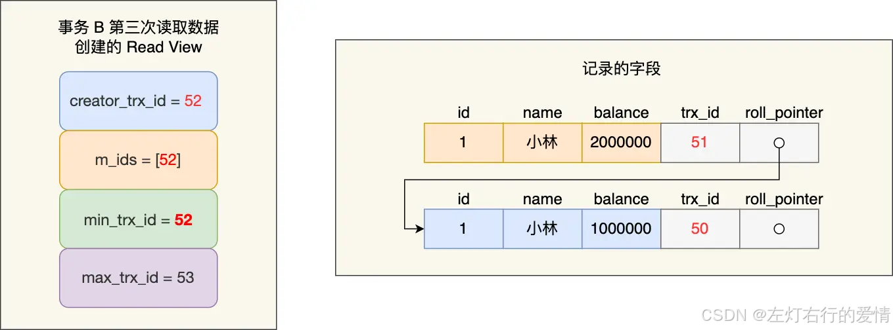  
 事务 B 在找到小林这条记录时，会发现这条记录的 trx\_id 是 51，比事务 B 的 Read View 中的 min\_trx\_id 值（52）还小，这意味着修改这条记录的事务早就在创建 Read View 前提交过了，所以该版本的记录对事务 B 是可见的。
