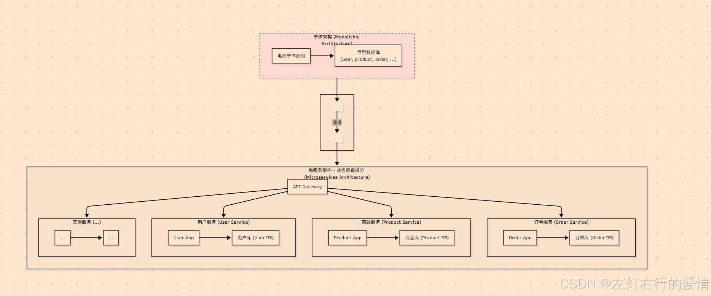
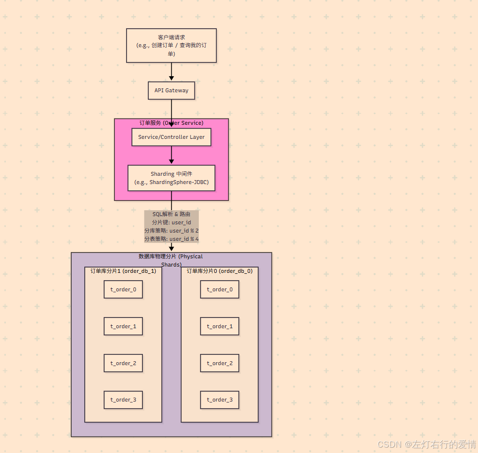
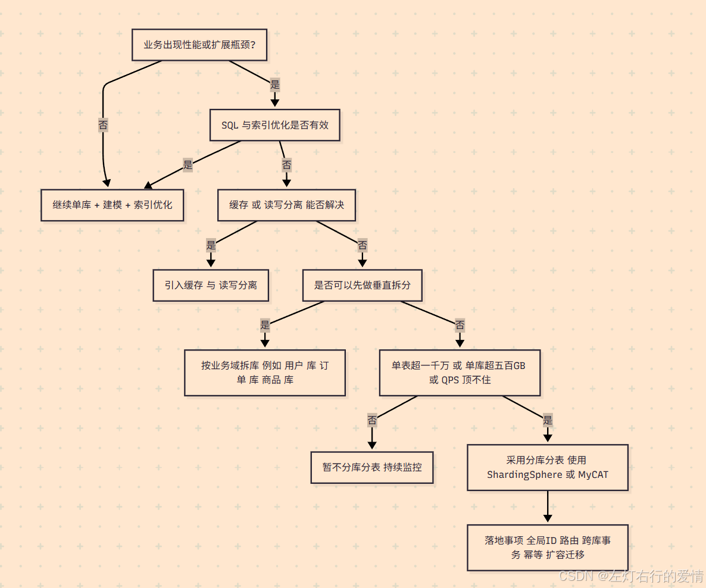

> 原文：[CSDN](https://blog.csdn.net/qq_45852626/article/details/150636441)（历史文章导入，当前状态为草稿）

### 前言

由于分库分表内容不是一个“零散学点
API 
就能用”的东西，而是一个涉及**数据库原理、架构设计和业务场景**结合的系统性内容。  
 所以我在总结的时候是把它当做一个系列来学即:

1. 基础内容
2. 核心内容
3. 工具学习
4. 实战经验

本篇文章重点描述了**数据库的瓶颈**与一些**核心概念**以及**拆分思想**.

### 什么是分库分表

这是一种应对海量
数据处理
需求的技术方案.  
 单个数据库或表中数据量过于多,导致数据库性能不断下降时,需要分库分表,**即将数据分开存储在多个不同的数据库或表中**.‘’

#### 分库

数据分散到不同的数据库中,每个数据库都可以在同一台服务器,也可以在不同服务器上.

#### 分表

将同一个表的数据分散到多个表中,通常这些表会在同一个数据库中,也可以在不同的数据库中.

**分库分表包含了分库和分表这两个独立的概念.**

然而实际操作中,通常会同时进行,所以我们习惯将他们合并称为分库分表.

### 为什么需要分库分表

**这需要我们去理解瓶颈的根源: 为什么单个数据库会撑不住?**  
 随着业务量的增长，无论是用户请求的并发量，还是存储的数据总量，都会给单一的数据库服务器带来巨大的压力。这种压力最终会体现在几个核心的瓶颈上。

#### 数据库性能瓶颈

当我们将所有请求都压向一个数据库实例时，它的\*\*物理资源（CPU、
内存 
、磁盘I/O）**和**软件资源（连接数）\*\*会最先达到极限。

##### 物理资源

**IO瓶颈 (磁盘读写瓶颈)**

**原因:**  
 数据库的数据最终都存储在磁盘上。无论是查询（读）还是写入（写），都需要通过磁盘IO来完成。  
 机械硬盘的随机读写性能非常有限（通常在100-200 IOPS，即每秒读写次数），即使是高性能的SSD，其IOPS也存在上限。  
 当并发请求量巨大时，大量的随机读写请求会使磁盘IO达到饱和，导致请求处理速度急剧下降，响应时间大幅增加。

**场景举例:**  
 在一个高并发的社交应用中，用户不断刷新朋友圈（大量读请求），同时又有大量用户在发动态、评论点赞（大量写请求）。  
 这些操作最终都会转化为对数据库底层数据文件和索引文件的读写，磁盘很快就会成为瓶颈。

**CPU瓶颈**

**原因:** CPU在数据库中扮演着多重角色：

**1. 处理连接:** 每个客户端连接的建立和管理。  
 **2. 解析和优化SQL:** 对接收到的SQL语句进行词法分析、语法分析，并生成最优的执行计划。  
 **3. 数据计算与排序:** 执行复杂的查询，如
JOIN 
、GROUP BY、ORDER BY等操作，尤其是在内存中对大量数据进行排序或聚合时，会消耗大量CPU资源。  
 **4. 数据页管理:** 在内存（Buffer Pool）和磁盘之间移动数据页。

**场景举例:**  
 在电商大促期间，后台系统需要生成复杂的销售报表，这些报表查询通常包含大量的JOIN和GROUP BY操作，需要对亿级订单数据进行计算和聚合。这种“计算密集型”的SQL会迅速将CPU使用率推高至100%，导致其他业务（如用户下单）的SQL执行变慢。

**连接数限制**  
 **原因:**  
 \*\*数据库能够同时处理的客户端连接是有限的。每个连接都会消耗数据库服务器的内存和线程资源。\*\*为了保护数据库自身不被过多的连接拖垮，数据库软件（如MySQL）通常会有一个最大连接数的配置（max\_connections）。当应用的并发请求数超过这个限制时，新的请求将无法建立连接，直接导致业务报错：“Too many connections”。

**场景举例:** 假设一个应用的服务器实例有500个，每个实例的数据库连接池配置了20个连接。在理想情况下，理论上就需要 500 \* 20 = 10000 个数据库连接。如果数据库的最大连接数只配置了2000，那么在高并发时段，大量的应用服务器将无法获取到数据库连接，导致服务大面积不可用。

##### 数据量瓶颈

当单张表的数据量变得极其庞大时（行业内通常认为超过1000万到2000万行就进入了“大表”的范畴），**即使查询命中了索引，性能也会显著下降**。  
 **操作性能急剧下降:**  
 索引就像一本书的目录。如果这本书只有100页，目录可能就几页，查找很快。但如果这本书有1亿页，它的目录本身就会变得非常庞大（B+树的层级会更深）。即使是索引查找，也需要更多的IO操作来读取索引页，定位到最终的数据页。全表扫描更是灾难。  
 **增删改 (INSERT, UPDATE, DELETE):**  
 \*\*这些操作不仅要修改数据行本身，更重要的是维护索引。\*\*每插入一条新数据，就需要更新表中所有的索引，确保索引的有序性。数据量越大，索引树就越庞大，维护索引的成本（CPU和IO开销）就越高。**对于UPDATE操作，如果修改了索引字段，实际上相当于先删除旧的索引记录，再插入新的索引记录，开销更大。**

##### 可维护性瓶颈

当单一数据库的整体数据规模变得巨大（例如达到TB级别）时，日常的运维工作会变得异常困难和耗时。

**备份与恢复:**

**备份时间长:** 对一个几TB大小的数据库进行一次完整的物理备份（如使用mysqldump或XtraBackup），可能需要数小时之久。在备份期间，通常会对数据库性能产生一定影响。  
 **恢复时间更长 (RTO):** 这是最致命的。如果数据库发生灾难性故障需要从备份中恢复，整个恢复过程（包括数据拷贝、应用日志等）可能需要十几个小时甚至更长。对于核心业务来说，这么长的停机时间是绝对无法接受的。恢复时间目标（RTO）是衡量系统可用性的一个关键指标。

**数据迁移:**  
 当需要进行硬件升级、数据库版本升级或机房搬迁时，迁移一个TB级别的巨大数据库实例是一个高风险、耗时长的复杂工程。数据的导出、传输、导入过程漫长，且极易出错。

##### 微服务场景业务拆分

在微服务的典型场景中,进行微服务拆分时,我们通常会根据**业务边界**,将各个业务的数据从单一数据库中拆分出来.  
 这样可以让业务职责更独立,同时单一库的连接数不至于太多

###### 从单体到微服务的业务垂直拆分

这是架构演进的第一步，我们将一个庞大的单体应用，按照业务边界拆分成多个职责单一的微服务。  
   
 **图文解析:**

**左侧 (单体架构):** 所有业务功能（用户、商品、订单等）都集中在一个应用里，共用一个数据库。随着业务发展，这种架构会变得难以维护和扩展。  
 **右侧 (微服务架构):** 我们将单体按业务领域拆分。用户服务只关心用户信息，商品服务只关心商品，订单服务只处理订单流程。  
 每个服务都有自己独立的数据库，实现了服务解耦和数据隔离。  
 API网关作为统一入口，将请求路由到正确的服务。

###### 核心服务的数据库水平拆分 (分库分表)

当订单量和用户量激增时，单一的订单库或用户库会再次成为瓶颈。这时，我们需要对这些核心服务进行数据层面的水平拆分。  
 以**订单服务**为例，我们将演示如何对其进行分库分表。  
   
 **图文解析:**  
 **请求流转:** 客户端请求通过API网关进入订单服务。  
 **中间件拦截:** 订单服务的业务代码和以前一样编写SQL，但其底层集成了Sharding
中间件 
。当SQL执行时，中间件会自动拦截。  
 **智能路由:** 中间件会解析SQL，根据预设好的规则（例如，根据user\_id进行取模运算）来判断这条数据应该存入哪个物理数据库（order\_db\_0 或 order\_db\_1）的哪张物理表（t\_order\_0 到 t\_order\_3）。  
 **数据落盘:** 最终，数据被精确地写入到目标库表中，实现了将海量订单数据分散存储的目标，从而极大地提升了数据库的性能和容量。

#### 分库的好处

##### 增加容量

当单机实例数据库的容量无法承载这么多数据,最简单的方式就是增加容量.  
 我们可以选择增加单实例磁盘空间,但是总有上限,且价值昂贵.  
 另一种方式就是采用多库来存储,增加数据库实例,采用分库存储

##### 增加连接数

高并发业务场景下,多个业务同时操作数据库,很容易将链接耗尽,后续数据库访问无法正常进行,所以数据分库存储可以有效解决连接数有限问题.

#### 分表的好处

分表和分库比较类似,都是数据量太大了而无法保证数据的读写性能,下面是业务上需要分表的几个原因.

##### 提高查询性能

当表的数据量非常大时,查询会变得很慢.分表可以减少每个表中的数据量,从而提高查询速度.

##### 提升写入性能

写入操作也会因为数据量大而变慢.分表可以分散写入压力,提高整体写入性能.

##### 减轻锁竞争

高并发场景下,大表容易出现锁竞争,导致性能下降.  
 分表可以减少锁的竞争,提高并发处理能力.

##### 存储优化

单个表的数据量过大会导致存储管理上的问题,比如索引维护成本增加,备份和恢复时间变长等,分表有助于优化存储管理.

### 什么时候需要分库分表

分库分表包含三种情况:

1. 只分库不分表 - 只有并发量大
2. 只分表不分库 - 只有数据量大
3. 既分库又分表 - 并发和数据量都大

#### 必须要分库分表的情况

* **单表数据量过大**  
   a. 一般经验：单表 1000万行以上（MySQL InnoDB 下，索引和磁盘 IO 会明显拖慢性能）。  
   b. 查询明显变慢：分页、索引扫描、更新锁等待。
* **单库容量接近瓶颈**  
   a. 单机存储达到 500GB~1TB，备份、恢复、DDL 都很难操作。  
   b. QPS（并发请求）超过单库连接和 CPU/IO 能承受的极限。
* **高并发写入热点**  
   a. 订单、日志、交易流水等场景，每秒几千甚至上万条写入，单表 insert/update 明显卡顿。

#### 可以考虑分库分表的情况

**业务预计会高速增长**

* 现在数据量可能不大，但业务规划明确未来要上亿级数据。
* 提前做合理分片设计，避免后期被迫迁移。

**读写分离 & 缓存都顶不住**

* 一般优化顺序：  
   SQL 优化 → 索引优化 → 水平/垂直拆分 → 缓存/读写分离 → 分库分表
* 如果这些都做了还不行，再考虑分库分表。

**大促/秒杀等极端流量**

* 特定业务场景下写入压力极端集中，比如双11下单。
* 可以用分表 + 预分配（按时间/范围）来消峰。

#### 不必分库分表的情况

**数据量不大（千万级以下）**

* 单机 MySQL + 合理索引 + 读写分离 + 缓存就能轻松抗住。
* 很多中小企业的系统几年也不会到达这个量。

**业务查询复杂，跨表 JOIN 多**

* 贸然分库分表会导致跨库 JOIN，性能反而更差，维护更麻烦。
* 这种情况更适合垂直拆分（按业务拆库），而不是水平分表。

**团队缺乏维护能力**

* 分库分表后涉及路由、事务、全局 ID、扩容迁移、跨库查询优化，复杂度比单库高数倍。
* 如果团队经验不足，反而是灾难。

##### 常用的决策思路(顺序执行)

1. SQL 优化、加索引
2. 缓存（Redis）、读写分离
3. 垂直拆分（按业务领域拆库）
4. 水平分库分表

**只有在前三步不够用了，才上第四步。**

总结一句话：  
 **当单库单表的容量、QPS 或运维成本达到瓶颈，且常规优化手段已经不足时，就该分库分表。否则不要轻易上。**

