> 原文：[CSDN](https://blog.csdn.net/qq_45852626/article/details/150639406)（历史文章导入，当前状态为草稿）

### 前言

本文介绍分库分表的常用解决方案以及设计.  
 如果是第一次了解分库分表,建议先看一下系列中的上一篇内容后再来看.

### 分库分表的常用解决方案

#### 垂直切分

垂直切分是按照**业务维度**进行拆分，将不同业务的数据分流到不同的数据库或表中。  
 就像“切蛋糕”一样，把不同功能的模块分到不同的服务器上。

##### 垂直分库

将用户相关的表放入user\_db，订单相关的表放入order\_db，商品相关的表放入product\_db。  
 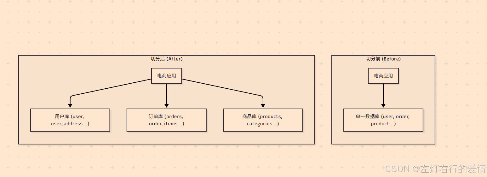

##### 垂直分表

**核心思想：**  
 将一个列非常多（“宽表”）的表，按照列的相关性、访问频率或大小，拆分成多个列较少（“窄表”）的表。  
 这些拆分后的表通常通过一对一（1-to-1）的关系关联起来。

**典型场景：**  
 在电商的 products (商品) 表中，有些字段如 id, name, price (商品ID、名称、价格) 会被频繁查询（例如商品列表页），而另一些字段如 description (商品详情，可能是很长的HTML文本) 或 specifications (规格参数，可能是JSON) 只在用户点击进入商品详情页时才需要加载，而且它们占用的存储空间很大。  
 将这两类字段放在同一张表里，会导致：

1. 查询列表页（只需要 id, name, price）时，数据库的IO操作会扫描包含 description 等大字段的数据页，效率降低。
2. 缓存利用率低，因为大字段占用了宝贵的内存空间。  
    因此，我们可以进行垂直分表。

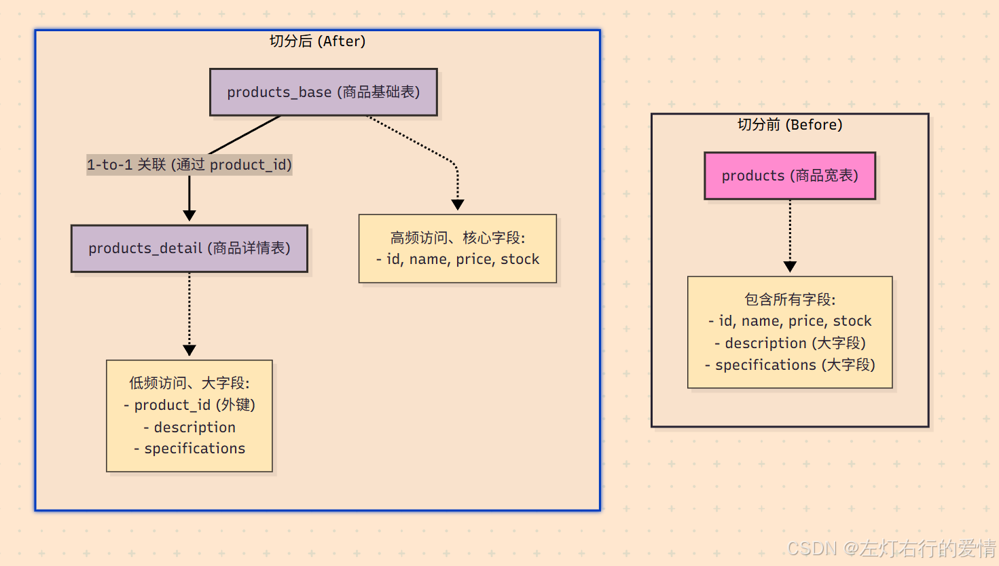  
 **切分后的工作流程：**

**用户浏览商品列表页：**  
 应用只需要查询 products\_base 表，返回大量商品的核心信息。这个查询会非常快，因为表更窄，同样的数据页可以容纳更多的行。

**用户点击某个商品，查看详情：**  
 应用先根据 product\_id 从 products\_base 表获取基础信息，然后用同一个 product\_id 再去 products\_detail 表获取详细描述和规格参数，最后将两部分数据组合起来展示给用户。

##### 垂直切分的优缺点

**优点：**

1. 业务逻辑清晰，耦合度降低。
2. 不同业务的压力被隔离，互不影响。
3. 可以针对不同业务库做针对性的优化。

**缺点：**

1. 无法解决单表数据量过大的问题（例如order\_db里的orders表依然会很大）。
2. 涉及多业务的查询（JOIN）需要通过应用层逻辑或分布式事务来解决，变得复杂。

---

#### 水平切分

水平切分是当垂直切分后，某个业务的单表数据量依然巨大时（如订单表），按照一定的规则将这张表的数据行（rows）分散到多个结构相同的表中。  
 这些表可以分布在同一个库（分表），也可以分布在不同的库（分库分表）。

##### 水平分库

将单表的数据切分到多个数据库服务器上去,每个服务器具有相应的库表,每个库的结构都一样,只是表中的数据集合不同.  
 这种方式可以缓解单机和单裤的性能瓶颈,网络IO,连接数等硬件资源的限制.

**切分前**  
 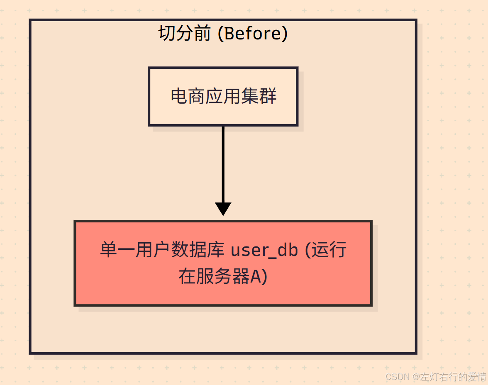  
 **切分后**  
 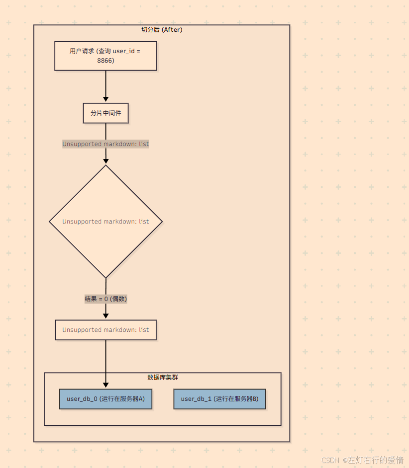  
 **图示解读：**

**切分前：**  
 所有应用服务器都连接到同一个 user\_db 数据库，该数据库所在的服务器A承受了全部的压力。

**切分后：**

* 引入了分片中间件（Sharding Middleware），它对应用层是透明的。
* 当一个针对 user\_id = 8866 的请求到达时，中间件会根据预设的路由规则（user\_id % 2）进行计算。
* 计算结果为 0，因此中间件只会将这个请求转发到 user\_db\_0（运行在服务器A）。
* 同理，如果一个 user\_id 为奇数的请求过来，它将被转发到 user\_db\_1（运行在服务器B）。

##### 水平分表

单个数据库中,根据一定规则将一个大的数据表切割成多个具有相同结构的小表,每个小表存储原始表一部分内容.  
 往往应对的是单表数据过大而导致的查询或写入慢等问题.  
 **但是因为表还是在一个数据库中,所以数据库级别的操作还是有IO瓶颈的.**

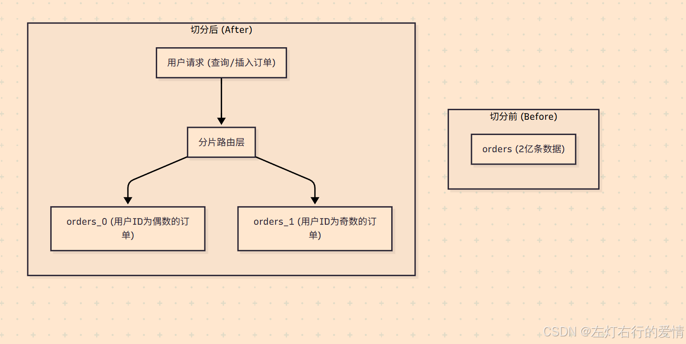

##### 水平切分的优缺点

**优点：**

* 直接解决了单表数据量过大的问题。
* 理论上可以无限扩展（增加服务器节点）。  
   **缺点：**
* 引入了数据路由（Routing）的复杂性，应用需要知道一条数据应该去哪个库/表。
* 跨分片的数据查询、统计、排序等操作变得非常困难。
* 会引入分布式事务、全局唯一ID等技术难题。

#### 分库分表的算法

决定“一条数据究竟应该去哪个库/表”的核心——**分片算法 (Sharding Algorithm)。**  
 这些算法主要解决的是**数据路由 (Data Routing)** 的问题。

##### hash分片

这是最常用的一类算法，核心思想是将**分片键（Sharding Key）通过哈希函数转换成一个数值，再根据这个数值决定数据分布。**

**取模算法 (Modulo Sharding)**

* 核心思想：对一个数值型的分片键进行取模运算。这是最简单、最经典的哈希算法。
* 算法逻辑：shard\_index = sharding\_key % N
  + sharding\_key：分片键，必须是数值类型（如 user\_id, order\_id）。
  + N：分库或分表的总数量。

**举例：**  
 4个库，user\_id = 8866。8866 % 4 = 2，所以该用户的数据路由到第2个库。  
 **优点：**

* 算法简单，实现成本低。
* 数据分布非常均匀，不容易出现数据倾斜。

**缺点：**

* 扩容是灾难性的。一旦分片数量 N 发生变化（例如从4个库扩容到5个库），几乎所有的数据都需要根据新的取模规则重新计算和迁移（即rehash），成本极高。

**适用场景：**  
 业务规模相对稳定，在可预见的未来内分片数量不会频繁变动的场景

##### 一致性哈希算法

**传统哈希的痛点：牵一发而动全身，缺乏对动态扩缩容的适应性。**

一致性哈希通过一个巧妙的设计，将“全体起立”变成了“局部调整”。

**它的核心思想是构建一个哈希环 (Hash Ring)。**

下图展示了3个服务器节点（Node A, B, C）和4个数据键（Key 1-4）在哈希环上的分布与归属关系。  
 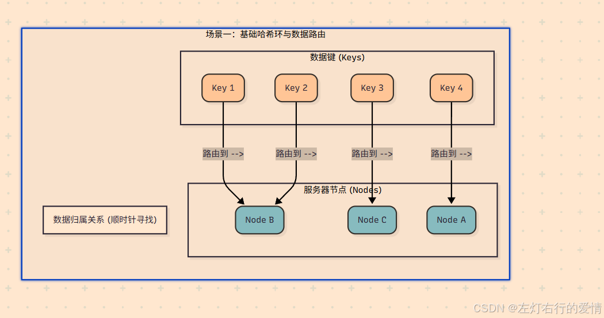

* 构建哈希环：  
   首先，想象一个巨大的、闭合的圆环。这个环代表了所有可能的哈希值，例如从 0 到 2 ^32−1。  
   这个环的范围是固定的，与服务器数量无关。
* 服务器（节点）上环：  
   将每一台服务器（例如根据其IP地址或主机名）进行哈希计算，得到一个哈希值，然后将这个服务器“放置”在环上对应值的位置。
* 数据（键）上环与寻址：  
   当一个数据键（比如user\_id）需要存储时，同样对这个键进行哈希计算，得到它在环上的位置。然后，从这个数据键的位置开始，顺时针方向寻找，遇到的第一个服务器节点，就是该数据应该存储的目标节点。

###### 一致性哈希如何解决扩容问题？

**场景一：增加一台服务器 (Node D)**  
 假设我们在 Node B 和 Node C 之间增加了一台新的服务器 Node D。

**影响范围：**  
 观察上图，只有那些哈希值落在 Node B 和新加入的 Node D 之间的键（上图中的 Key 5）受到了影响。

**数据迁移：**  
 在 Node D 加入之前，这些键本来是归 Node C 管理的（顺时针找到的第一个节点是C）。现在 Node D 加入了，它们顺时针找到的第一个节点变成了 D。因此，只需要将这一小部分数据从 Node C 迁移到 Node D 即可。

**其他节点：**  
 Node A 和 Node B 所管辖的数据完全不受影响，无需任何迁移。

此图演示了当我们在 Node B 和 Node C 之间增加一个新节点 Node D 时，数据路由和迁移是如何发生的。  
 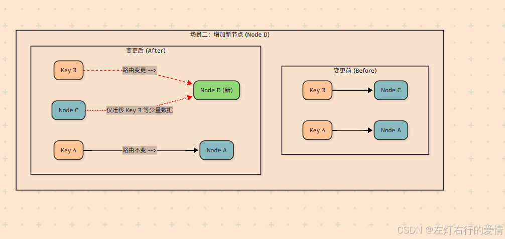  
 **场景二：移除一台服务器 (Node B)**  
 假设 Node B 因为故障下线了。

\*\*影响范围：\*\*之前所有应该存储在 Node B 上的数据（例如 Key 4），现在从它们的位置出发顺时针寻找，遇到的第一个节点将变成 Node C。

\*\*数据迁移：\*\*因此，只需要将原属于 Node B 的所有数据，全部迁移到 Node C 即可。

\*\*其他节点：\*\*Node A 所管辖的数据同样不受任何影响。

\*\*结论：\*\*无论增加还是删除节点，一致性哈希都只影响环上相邻的一小部分数据，最大限度地抑制了数据迁移的规模。

此图演示了当 Node B 因故障下线时，数据路由和迁移是如何发生的。  
 **核心逻辑：**  
 原属于 Node B 的所有数据（Key 1, Key 2），其路由会“顺延”到环上的下一个节点，即 Node C。

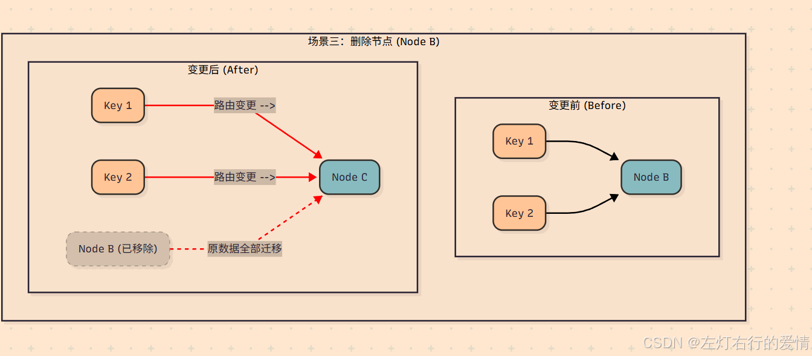

##### 范围算法

这类算法根据分片键的数值范围来划分数据。

###### 基于数值区间的范围分片

**核心思想：**  
 设定一系列的数值区间，每个区间对应一个分片。

**算法逻辑：**  
 `IF sharding_key >= range_start AND sharding_key < range_end THEN goto shard_X`

**举例：**  
 按 user\_id 分片。

* user\_id 在 [1, 100万] -> user\_db\_0
* user\_id 在 [100万+1, 200万] -> user\_db\_1
* …

**优点：**

* **扩容非常方便。** 只需增加一个新的区间和对应的分片即可，完全不需要移动历史数据。
* **范围查询性能好。** 例如查询 user\_id 在150万到160万之间的所有用户，可以快速定位到 user\_db\_1，无需扫描所有分片。

**缺点：**

* \*\*容易产生数据热点和倾斜。\*\*如果分片键是自增ID，那么所有新的写入请求都会集中在最后一个分片上，导致该分片压力巨大。
* **适用场景：** 数据可以被明确地、均匀地划分区间的场景。经常需要进行范围查询的业务。

###### 以时间维度来

**核心思想：**  
 按年、按季度、按月、按天等时间维度来切分数据。

**算法逻辑：**  
 从时间戳类型的分片键中提取出年、月等信息来决定表名。

**举例：**  
 订单表按月分表。

* 2025年8月的订单 -> orders\_2025\_08
* 2025年9月的订单 -> orders\_2025\_09

**优点：**

* 逻辑清晰，符合业务直觉。
* 天然具备“冷热数据”分离的特性，便于管理和归档历史数据。
* 扩容简单，时间向前走，自动创建新表即可。

**缺点：**

* 存在明显的写入热点。所有当前的新订单都会写入到最新的表中，对该表压力很大。
* 适用场景：时间序列数据，如订单、日志、流水、聊天记录等。

##### 查表分片

也称为**目录分片 (Directory-Based Sharding)**，它引入了一个中间层来管理映射关系。

**映射表算法**  
 **核心思想：**  
 建立一个独立的映射表（或配置中心），专门存储分片键与分片位置的对应关系。

**算法逻辑：**

1. 接收到请求后，根据分片键 `sharding_key` 去查询映射表。
2. 从映射表中获取该键对应的 `shard_index`。
3. 将请求路由到 `shard_index` 指向的物理分片。

**举例：**  
 一个`user_location_map`表记录了每个`user_id`所在的数据库节点。

**优点：**

* 极其灵活。可以随意定义路由规则，甚至可以为每个用户单独指定分片。
* 扩容和数据迁移非常方便，只需迁移完数据后，更新映射表中的记录即可，对应用层无感。

**缺点：**

* 每次请求都需要额外进行一次（或多次）查询，有性能开销。
* 映射表本身会成为新的**单点故障**和性能瓶颈，需要为它设计高可用方案。

**适用场景：**  
 对灵活性和扩容便利性要求极高的场景，例如多租户（SaaS）平台，可以为不同租户灵活分配和迁移数据。

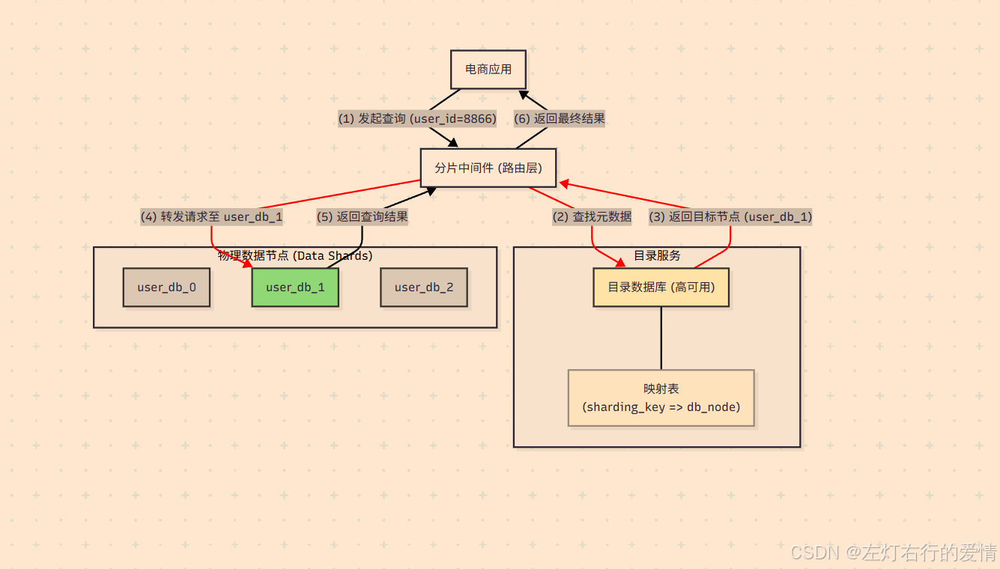

### 如何选择分片算法?

真实业务场景下,我们选择合适分片方式需要考虑一些内容:

* 综合考虑业务数据规模,数据特性,查询和写入模式,以及系统扩展性等因素.
* 充分结合各种分片方式的优缺点,看哪种方式的优点更适合当下业务场景,同时又能有效规避他的缺点.

#### 第一步（也是最重要的一步）：选择合适的分片键 (Sharding Key)

必须先选定用于分片的字段，即分片键。这是地基，如果地基选错了，再好的算法也无济于事。

**一个优秀的分片键应具备以下特点：**

**查询驱动 (Query-Driven)：**  
 分片键必须出现在绝大多数关键查询的 WHERE 条件中。否则，当查询不带分片键时，中间件不知道数据在哪，只能将查询广播到所有分片，进行全表扫描后再聚合结果，这会造成“分片灾难”。

**高基数性 (High Cardinality)：**  
 分片键的取值范围应该足够大，足够分散。例如，user\_id、order\_id 是很好的分片键，而gender（性别）、city（城市，如果大部分用户集中在一两个城市）则是不合格的分片键，因为它们会导致严重的数据倾斜。

**均匀分布 (Even Distribution)：**  
 分片键的值最好能均匀地分布到各个分片中，避免产生数据热点。

**选定分片键后，我们再根据业务诉求来选择算法。**

#### 第二步：根据几个核心问题来选择算法

##### 问题一：“我的业务需要频繁或平滑地扩容吗？”

这是决定算法方向的第一个，也是最重要的问题。  
 如果是:  
 说明业务处于高速增长期，未来需要不断增加数据库服务器来应对压力，那么“扩容成本”就是我们首要考虑的因素。

**算法推荐：**  
 **目录分片 (Directory-Based)：**  
 灵活性最高。通过更新映射关系，可以实现非常平滑、精细化的数据迁移和扩容，对业务影响最小。  
 **一致性哈希 (Consistent Hashing)：**  
 为扩容而生。其核心优势就是在增删节点时，只需迁移少量数据，成本远低于取模算法。  
 **范围分片 (Range)：**  
 扩容也很简单，只需增加新的数据区间和节点即可，无需移动历史数据。

如果否:  
 说明业务规模相对稳定，几年内分片数固定。  
 如果系统规模可预测，或者是一次性投入，未来几乎不会增减服务器数量。  
 **算法推荐：**  
 **哈希取模 (Modulo)：**  
 简单高效。在这种场景下，它扩容难的缺点可以忽略不计，而其数据分布均匀、实现简单的优点则被放大，是性价比非常高的选择。

##### 问题二：“我的核心查询是点查还是范围查询？”

**回答：**  
 绝大多数是点查（例如 WHERE user\_id = ?）。

那么点查追求的是快速定位到唯一分片。

**算法推荐：**

**所有哈希类算法（取模、一致性哈希）：**  
 哈希的本质就是将离散的ID映射到固定的位置，非常适合点查，路由效率极高。

**目录分片：**  
 虽然多了一次目录查询，但最终也是精确定位，同样适合点查。

若是：范围查询非常频繁（例如 WHERE create\_time BETWEEN ? AND ?）。

那么范围查询希望相关的数据能存放在一起，避免跨分片查询。

**算法推荐：**

**范围分片 (Range)：**  
 唯一选择。它能保证ID或时间上连续的数据落在同一个或相邻的分片上，执行范围查询时，只需扫描少数几个分片，性能极高。

**应避免的算法：**  
 所有哈希类算法。它们会将连续的ID打散到不同的分片上，导致一个简单的范围查询需要请求所有分片，造成性能灾难。

##### 问题三：“我的业务是否存在明显的‘写入热点’？”

若回答是，存在热点（例如，所有新数据都写在最近的时间片里）。  
 则这是一个典型的“时序数据”场景，如订单、日志。  
 **算法推荐：**

**时间范围分片 (Time-Range)：**  
 虽然它会产生写入热点（所有新数据都写在当前月份的表），但这通常是可接受的，因为这种业务模式下，读操作也大多集中在新数据上。我们可以为“热”分片配置更好的硬件，并对“冷”分片进行压缩归档。这种架构模式非常成熟。  
 **但是注意,如果是很大电商平台,做双十一等这样的活动,这时候次算法就不行了.**

**需要权衡的算法：**  
 哈希类算法。它们能将写入压力均匀打散，避免热点。但代价是牺牲了时间范围查询的能力。您需要权衡“避免写入热点”和“高效范围查询”哪个对您更重要。

##### 问题四：“我的架构对复杂度和维护成本的容忍度如何？”

回答：追求简单、直接、低成本。

**算法推荐：**  
 哈希取模 和 范围分片。这两种算法的逻辑最清晰，最容易理解和实现，心智负担比较小。

若回答：可以接受更高的复杂度以换取长期的灵活性。

**算法推荐：**

\*\*目录分片：\*\*最灵活，但需要额外维护一个高可用的目录服务，增加了架构的复杂度和运维成本。

\*\*一致性哈希：\*\*算法本身比取模要复杂，尤其是在引入虚拟节点后。

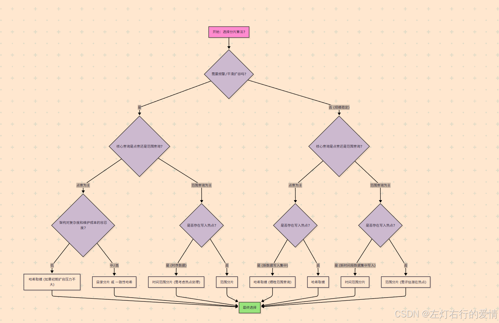

### 架构模式

当决定引入分库分表后，一个核心的架构问题摆在面前：  
 **“负责解析SQL、执行数据路由、合并结果的这套复杂逻辑，应该放在哪里？”**  
 根据这套逻辑（我们称之为“分片中间件”）部署位置的不同，主要衍生出两种主流的架构模式：**客户端模式 (Client-Side Sharding) 和 代理模式 (Proxy-Side Sharding)。**

#### 客户端模式(Client-Side Sharding)

客户端模式也称之为SDK模式.  
 **核心思想：**  
 将分片的所有核心逻辑（SQL解析、路由、重写、结果归并等）都封装在一个 SDK Jar包（或对应语言的Library）中，这个Jar包与业务应用部署在同一个进程里。应用层通过代码配置和引用这个Jar包，使其“增强”了本地数据源，使其拥有了分库分表的能力。

**工作流程:**

1. 应用启动时，加载分片SDK，并配置好数据源、分片规则等。
2. 应用执行一个SQL查询。
3. 分片SDK在应用内部拦截该SQL。
4. SDK对SQL进行解析，提取分片键，根据本地配置的分片算法计算出目标数据库。
5. SDK改写SQL（例如将逻辑表名orders改为物理表名orders\_2），然后直接从本地连接池中获取到目标物理数据库的连接，并执行查询。
6. 如果需要，SDK会在应用内存中对来自多个分片的结果进行合并，最终返回给业务代码。

**优缺点分析**  
 **优点：**  
 **性能极致：**  
 因为没有额外的网络中转，应用直接连接物理数据库，链路最短，性能损耗最低，延迟最低。  
 **架构简单：**  
 无需额外部署和维护一个独立的中间件集群，运维相对简单。

**缺点：**  
 **应用侵入性强：**  
 需要在业务代码中引入SDK并进行配置，与业务应用紧密耦合。

**升级困难：**  
 当分片SDK需要升级时，所有集成了该SDK的应用都需要修改依赖、重新打包和部署，升级成本高。

**语言绑定：**  
 通常这类SDK是与特定语言绑定的（例如ShardingSphere-JDBC主要服务于Java），如果公司内有Java、Go、PHP等多种语言栈，就需要为每种语言寻找或开发相应的客户端库，维护成本高。

代表产品：ShardingSphere-JDBC (前身为 Sharding-JDBC)、TDDL (淘宝内部使用)。

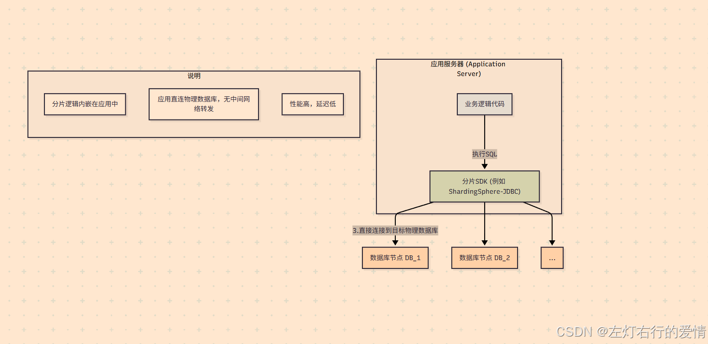

#### 代理模式 (Proxy-Side Sharding)

也称为“中间件代理 (Middleware Proxy)”模式。

**核心思想：**  
 将分片的核心逻辑独立部署成一个或多个**代理服务器**，形成一个中间件集群。业务应用不再直连物理数据库，而是像连接一个普通的单一数据库一样，连接到这个**分片代理**。应用本身对后端的分库分表状态**完全无感知**。

**工作流程:**

1. 应用启动时，像连接MySQL一样，连接到分片代理的地址。
2. 应用执行一个SQL查询，发送给分片代理。
3. 分片代理接收到SQL后，在其独立的进程中进行解析、路由、重写。
4. 代理服务器根据路由结果，从自己管理的连接池中获取到目标物理数据库的连接，并将SQL发往执行。
5. 代理服务器接收来自各个分片的结果，进行合并，最终将完整的结果集返回给应用。

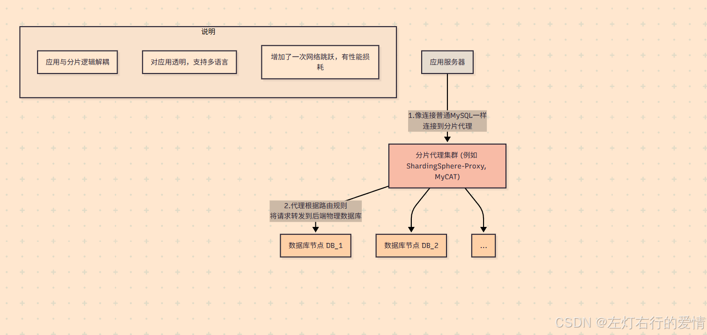

**优缺点分析**  
 **优点：**  
 **对应用透明：**  
 业务应用无需任何改造，可以用任何语言、任何ORM框架，只需将数据库连接地址指向分片代理即可，耦合度极低。  
 **支持异构语言：**  
 由于代理实现了数据库协议（如MySQL协议），因此任何语言的客户端都可以无缝接入。  
 **便于统一管理：**  
 分片规则、数据库连接、监控等都在代理层统一管理，升级和维护更方便。  
 **缺点：**  
 **增加网络延迟：**  
 所有请求都需要经过一次代理的转发，相比客户端模式，增加了一次网络跳跃，性能会有所下降，延迟会增加。  
 **架构更复杂：**  
 需要额外部署和维护一个高可用的分片代理集群，增加了运维的复杂性。  
 **代理可能成为瓶颈：**  
 分片代理自身的性能和稳定性至关重要，如果代理集群出现问题，会影响所有后端数据库的访问。  
 **代表产品：**  
 ShardingSphere-Proxy、MyCAT、Vitess (Google开源)。

##### 如何选择？

* 如果系统是单一Java技术栈，且对性能要求极为苛刻，不希望有任何额外的网络延迟，那么客户端模式 (ShardingSphere-JDBC) 是一个很好的选择。
* 如果系统是多语言的微服务架构，或者希望数据库中间层与业务应用完全解耦，便于统一管理和维护，那么代理模式 (ShardingSphere-Proxy, MyCAT) 是更合适的选择。
