> 原文：[CSDN](https://blog.csdn.net/qq_45852626/article/details/130828424)（历史文章导入，当前状态为草稿）

### 基本概念

什么是分布式锁  
 满足
分布式 
系统或者集群模式下多进程可见并且互斥的锁。  
 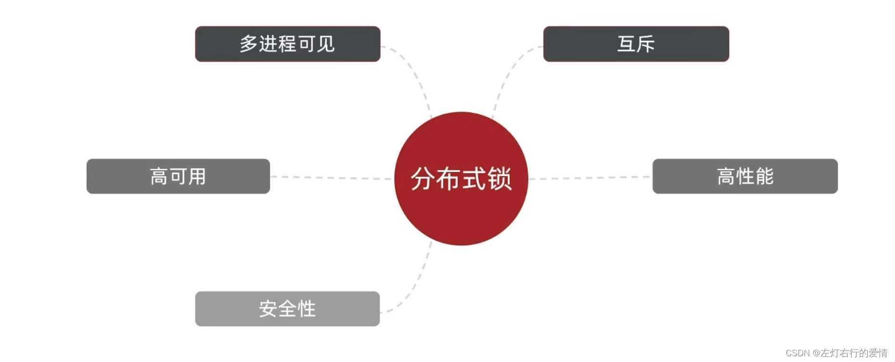  
 不同分布式锁的实现方案  
 分别从互斥，高可用，高性能，安全性方面来分析。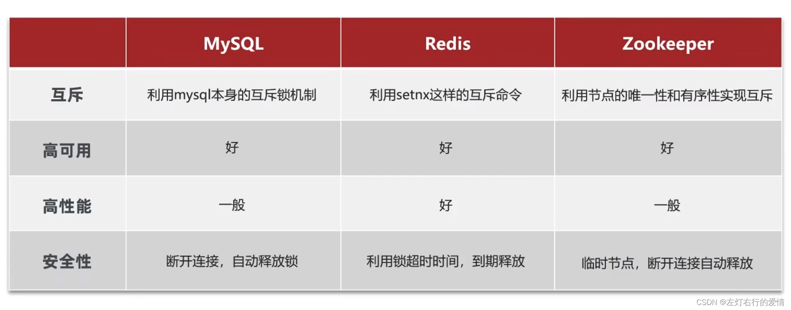

### 基于Redis的分布式锁

#### 基本用法

获取锁：

* 互斥：确保只能有一个线程获取锁。
* 非阻塞：尝试一次，成果返回true，失败返回false。
* + 超时释放：获取锁时添加一个超时时间。

`SETNX lock thread1` # 添加锁，利用setnx的互斥特性。  
 `EXPIRE lock 10` # 添加锁过期时间，避免服务宕机引起的死锁。

释放锁：

* 手动释放

`DEL key` # 释放锁，删除即可。

上面的方式有一个问题：如果在获取锁时，只来得及执行第一句后，就宕机了，过期时间没执行怎么办？

答：将这两个动作设置为原子动作，使用`SET`命令：`SET lock thread1 EX 10 NX`。

流程图如下：  
 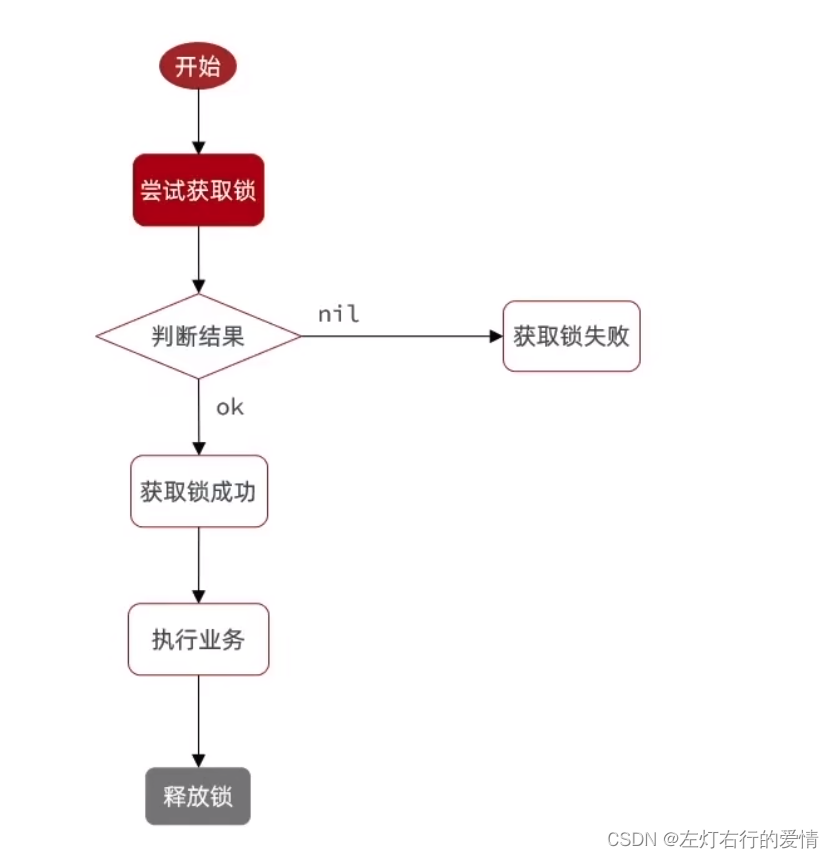

#### 基于Redis实现分布式锁初级版本

先写一个接口：

```
public interface ILock {
    /**
     * 尝试获取锁
     * @param timeoutSec  锁持有的超时时间，过期后自动释放。
     * @return  true 代表获取锁成功，false代表获取锁失败。
     */
    boolean tryLock(long timeoutSec);

    void unlock();

}


```

再用redis实现一个锁：

```
import com.wang.Base.ILock;
import org.springframework.data.redis.core.StringRedisTemplate;

import java.util.concurrent.TimeUnit;

public class SimpleRedisLock implements ILock {

    private static final String KEY_PRIFIX = "lock";
    private String name;
    private StringRedisTemplate stringRedisTemplate;

    public SimpleRedisLock(String name ,StringRedisTemplate stringRedisTemplate){
        this.name= name;
        this.stringRedisTemplate = stringRedisTemplate;
    }
    @Override
    public boolean tryLock(long timeoutSec) {
        //获取线程标示
        long threadId = Thread.currentThread().getId();
        //获取锁
        Boolean success = stringRedisTemplate.opsForValue().
                setIfAbsent(KEY_PRIFIX + name, threadId+"", timeoutSec, TimeUnit.SECONDS);
       // return success; 最好不要这样写，因为boolean如果为null，一拆箱就空指针了。
        return Boolean.TRUE.equals(success);
    }

    @Override
    public void unlock() {
         stringRedisTemplate.delete(KEY_PRIFIX+name);
    }
}


```

上面代码存在一个问题：释放锁的时候并没有判断锁是不是自己的，那么在一些极端情况下，会出现问题，下面举个例子。  
 线程1因为业务阻塞的时间超过了锁持有的时间，在未完成业务的情况下释放了。  
 那么线程2此时获取到了锁，在线程2执行业务的期间线程1的业务完成，直接释放了锁。  
 那么此时线程3拿到了锁，开始了执行业务。  
 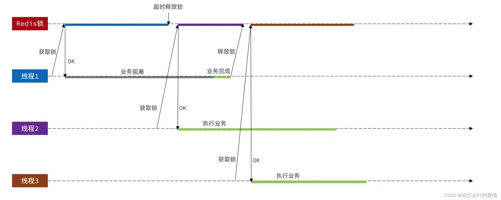  
 解决方法：  
 在释放锁前，判断一下锁标示是否是自己的。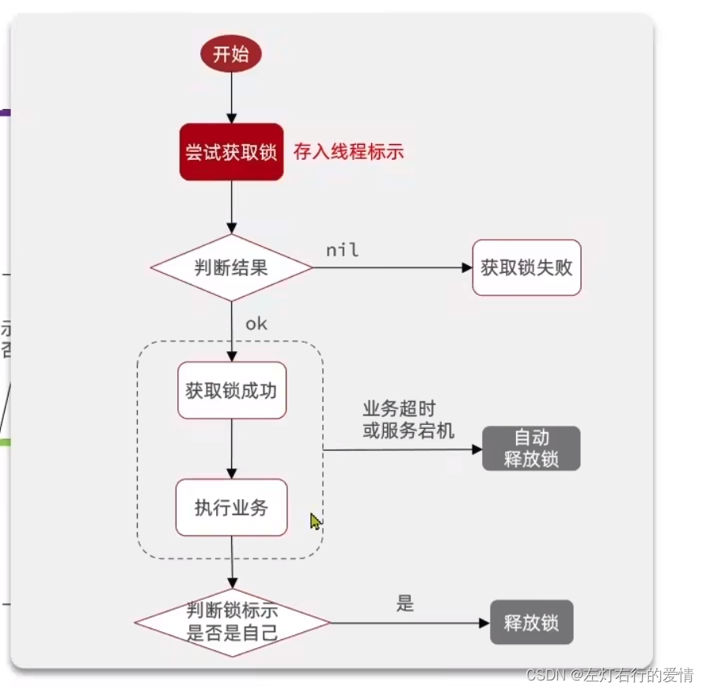

#### 改进Redis的分布式锁

需求：  
 修改之前的分布式锁实现，满足：

1. 在获取锁时存入线程标识（可以用UUID表示，用UUID确保不同的服务，线程id确保不同的线程，确保不同线程标示一定不一样。）
2. 在释放锁时先获取锁中的线程标示，判断是否与当前线程标示一致：

* 如果一致则释放锁。
* 如果不一致则不释放锁。

优化如下代码所示：

```
import java.util.UUID;
import java.util.concurrent.TimeUnit;

public class SimpleRedisLock implements ILock {

    private static final String KEY_PRIFIX = "lock";
    private static  final String ID_PREFIX = UUID.randomUUID().toString()+"-";
    private String name;
    private StringRedisTemplate stringRedisTemplate;

    public SimpleRedisLock(String name ,StringRedisTemplate stringRedisTemplate){
        this.name= name;
        this.stringRedisTemplate = stringRedisTemplate;
    }
    @Override
    public boolean tryLock(long timeoutSec) {
        //获取线程标示
        String threadId = ID_PREFIX +Thread.currentThread().getId();
        //获取锁
        Boolean success = stringRedisTemplate.opsForValue().
                setIfAbsent(KEY_PRIFIX + name, threadId, timeoutSec, TimeUnit.SECONDS);
       // return success; 最好不要这样写，因为boolean如果为null，一拆箱就空指针了。
        return Boolean.TRUE.equals(success);
    }
    @Override
    public void unlock() {
        //获取线程标示
        String threadId = ID_PREFIX + Thread.currentThread().getId();
        //获取锁中的标示
        String id = stringRedisTemplate.opsForValue().get(KEY_PRIFIX + name);
        //判断标示是否一致
        if(threadId.equals(id)){
            stringRedisTemplate.delete(KEY_PRIFIX+name);
        }
    }
}


```

##### 问题

那么那么，上面的代码就是完美无缺的吗？

答：不是的，在更极端的条件下，依旧会出现问题，现在我们假设一个场景。  
 线程1正常执行了自己的业务完成后，获取锁标示并判断是否一致后，发生了阻塞（这个阻塞并不是代码层面，而是JVM层面，当垃圾回收执行到了Full 
GC 
的时，因为JVM发生阻塞），如果这个阻塞的时间超过了锁的过期时间，那么其他线程就可以趁虚而入了。  
 这时线程2获取到了锁，执行自己的业务。  
 那么线程1跳出阻塞，会直接把线程2的锁释放掉。  
 线程3就会趁虚而入。

如何避免上面的问题发生呢？  
 解决方法：  
 要把判断和释放并为原子性。  
 这里redis 的事务可以保证原子性，但是无法保证一致性。所以在这里先查询再判断是不行的，拿不到结果，是最后一次性执行的。没有办法把它们放在一个事务中。可以利用乐观锁解决，但是会很麻烦。  
 这里推荐使用Lua脚本去做。

##### Redis的 Lua脚本

Redis提供了Lua脚本功能，在一个脚本中编写多条Redis命令，确保多条命令执行时的原子性。Lua是一种编程语言。

* Lua中使用Redis：  
   Redis在Lua里面给我们提供了一个函数：redis.call(‘命令名称’,‘key’,‘其他参数’)。
* Redis的Lua脚本：  
   写好脚本以后，需要用Redis命令来调用脚本，调用脚本的常见命令如下：  
   `EVAL script numkeys key [key] arg [arg]`

1. 无参数  
    例如我们要执行`redis.call('set','name','jack')这个脚本，语法如下：` EVAL “return redis.call(‘set’,‘name’,‘jacl’)” 0 `  
    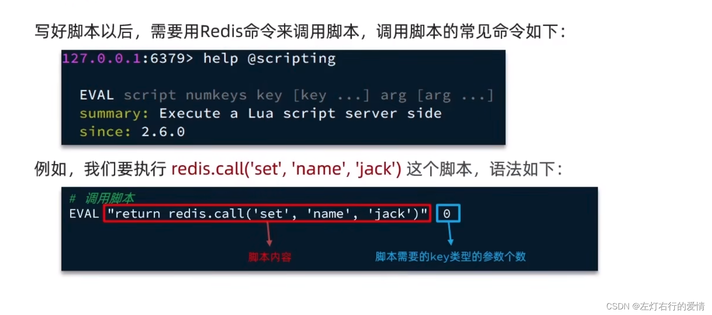
2. 有参数  
    如果脚本中的key，value不写死，可以作为参数传递。  
    key类型参数会放入KEYS数组，其他参数会放入ARGV数组，在脚本中可以从KEYS和ARGV数组获取这些参数：  
    `EVAL "return redis.call('set',KEYS[1], ARGV[1] ) " 1 name wang`   
    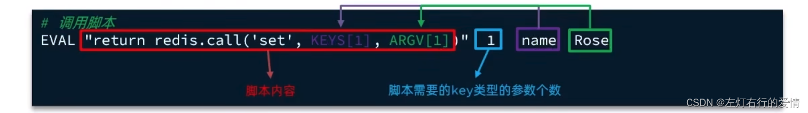

##### 利用Lua脚本写释放锁业务流程

1. 获取锁中的线程标示。
2. 判断是否与指定的标示（当前线程标示）一致。
3. 如果一致则释放锁（删除）。
4. 如果不一致则什么都不做。

```
-- 锁的key
local key = KEYS[1]
-- 当前线程标示
local threadId = ARGV[1]
-- 获取锁中的线程标示 get key
local id = redis.call('get',key)
-- 比较线程标示与锁中标示是否一致
if (id == threadId) then
    -- 释放锁 del key
    return redis.call('del',key)
end
return 0


```

简化写法：

```
local id = redis.call('get',KEYS[1])
-- 比较线程标示与锁中标示是否一致
if (id == ARGV[1]) then
    -- 释放锁 del key
    return redis.call('del',KEYS[1])
end
return 0


```

##### 再次改进Redis的分布式锁

需求：基于Lua脚本实现分布式锁的释放锁逻辑  
 提示：RedisTemplate调用Lua脚本的API如下：  
 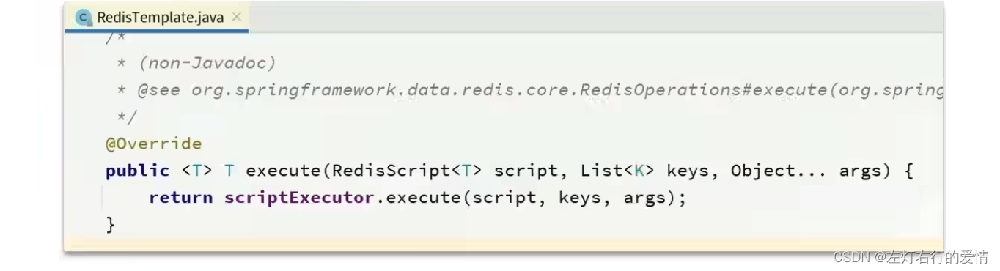  
 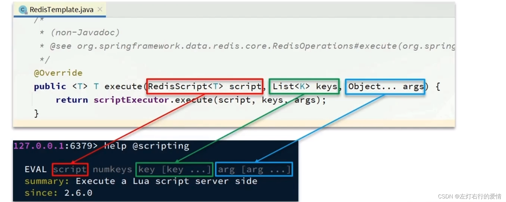  
 在
idea 
中写lua文件：  
 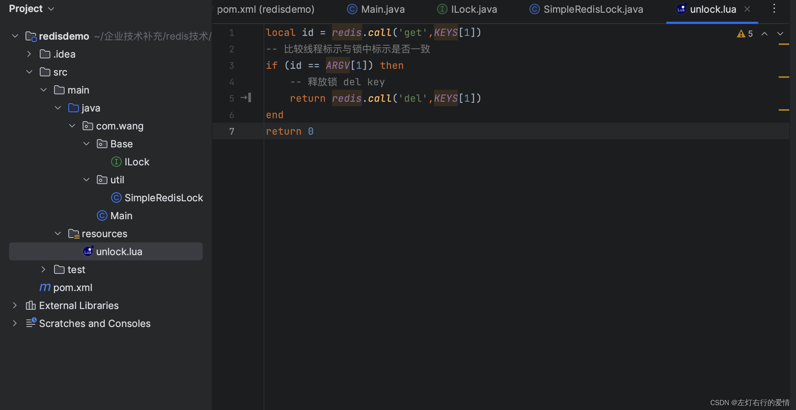  
 对锁的实现进行改造：

```
    private static final String KEY_PRIFIX = "lock";
    private static  final String ID_PREFIX = UUID.randomUUID().toString()+"-";

    private static final DefaultRedisScript<Long> UNLOCK_SCRIPT;
      //不要每次释放的时候读取文件，要提前读取好。
    static {
        UNLOCK_SCRIPT = new DefaultRedisScript<>();
        UNLOCK_SCRIPT.setLocation(new ClassPathResource("unlock.lua"));
        UNLOCK_SCRIPT.setResultType(Long.class);
    }
    private String name;
    private StringRedisTemplate stringRedisTemplate;

    public SimpleRedisLock(String name ,StringRedisTemplate stringRedisTemplate){
        this.name= name;
        this.stringRedisTemplate = stringRedisTemplate;
    }
    @Override
    public boolean tryLock(long timeoutSec) {
        //获取线程标示
        String threadId = ID_PREFIX +Thread.currentThread().getId();
        //获取锁
        Boolean success = stringRedisTemplate.opsForValue().
                setIfAbsent(KEY_PRIFIX + name, threadId, timeoutSec, TimeUnit.SECONDS);
       // return success; 最好不要这样写，因为boolean如果为null，一拆箱就空指针了。
        return Boolean.TRUE.equals(success);
    }

    @Override
    public void unlock() {

//        //获取线程标示
//        String threadId = ID_PREFIX + Thread.currentThread().getId();
//        //获取锁中的标示
//        String id = stringRedisTemplate.opsForValue().get(KEY_PRIFIX + name);
//        //判断标示是否一致
//        if(threadId.equals(id)){
//            stringRedisTemplate.delete(KEY_PRIFIX+name);
//        }

        //调用Lua脚本
  
        stringRedisTemplate.execute(UNLOCK_SCRIPT,
                Collections.singletonList(KEY_PRIFIX+name),
                ID_PREFIX+Thread.currentThread().getId()
                );
    }


```

#### 总结

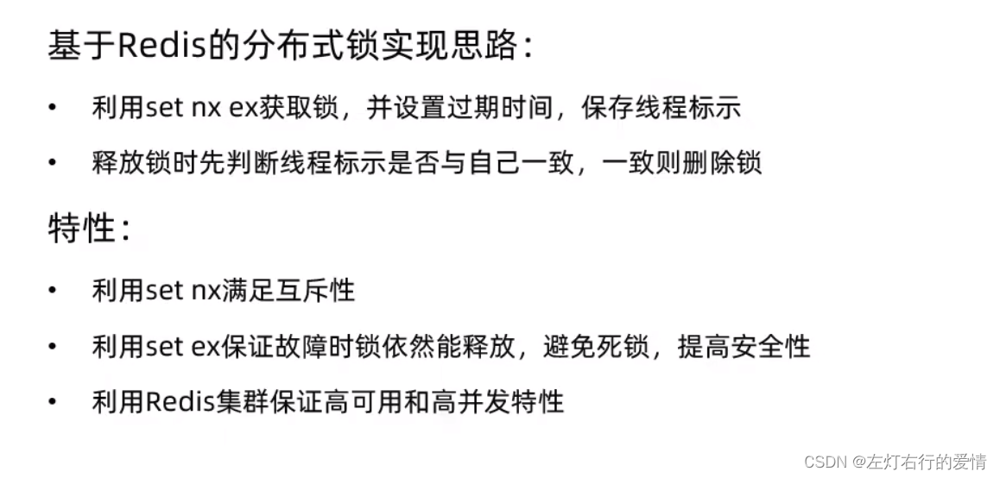  
 那么，目前为止，我们的分布式锁已经相对完善了，当然好学的你肯定不满足于当前的现状，那么就继续走下去吧。

### Redisson

#### 基于setnx实现的分布式锁存在下面的问题

1. 不可重入  
    同一个线程无法多次获取同一把锁。
2. 不可重试  
    获取锁只尝试一次就返回false，没有重试机制。
3. 超时释放  
    锁超时释放虽然可以避免思索，但如果业务执行耗时较长，也会导致锁释放，存在安全隐患。
4. 主从一致性  
    如果Redis提供了主从集群，主从同步存在延迟，当主宕机时，如果从并去同步主中的锁数据，则会出现锁实现。

#### Redisson入门

1. 引入依赖

```
    <dependency>
            <groupId>org.redisson</groupId>
            <artifactId>redisson</artifactId>
            <version>3.13.6</version>
        </dependency>


```

2. 配置Redisson客户端：

```
import org.redisson.Redisson;
import org.redisson.api.RedissonClient;
import org.redisson.config.Config;
import org.springframework.context.annotation.Bean;
import org.springframework.context.annotation.Configuration;

@Configuration
public class RedisConfig {
   @Bean
   public RedissonClient redissonClient() {
       //配置类
       Config config = new Config();
       //添加redis地址，这里添加了单点地址，也可以使用config.useClusterServers()添加集群地址
       config.useSingleServer().setAddress("redis://47.115.226.111:6379").setPassword("123321");
       //创建客户端
       return Redisson.create(config);
   }
}


```


```
   @Resource
    private RedissonClient redissonClient;
    
    public void testRedisson() throws InterruptedException {
        //获取锁（可重入），指定锁的名称。
        RLock lock = redissonClient.getLock("anyLock");
        //尝试获取锁，参数分别是：获取锁的最大等待时间（期间会重试），锁自动释放时间，时间单位。
        boolean isLock = lock.tryLock(1,10,TimeUnit.SECONDS);
        //判断释放获取成功
        if(isLock){
            try{
                System.out.println("执行业务");
            }finally {
                //释放锁
                lock.unlock();
            }
        }
    }


```

##### Redisson可重入锁原理

我们先举一个场景，代码如下：

```
@Slf4j
@SpringBootTest
class RedissonTest {

    @Resource
    private RedissonClient redissonClient;

    private RLock lock;

    @BeforeEach
    void setUp() {
        lock = redissonClient.getLock("order");
    }

    @Test
    void method1() throws InterruptedException {
        // 尝试获取锁
        boolean isLock = lock.tryLock(1L, TimeUnit.SECONDS);
        if (!isLock) {
            log.error("获取锁失败 .... 1");
            return;
        }
        try {
            log.info("获取锁成功 .... 1");
            method2();
            log.info("开始执行业务 ... 1");
        } finally {
            log.warn("准备释放锁 .... 1");
            lock.unlock();
        }
    }
    void method2() {
        // 尝试获取锁
        boolean isLock = lock.tryLock();
        if (!isLock) {
            log.error("获取锁失败 .... 2");
            return;
        }
        try {
            log.info("获取锁成功 .... 2");
            log.info("开始执行业务 ... 2");
        } finally {
            log.warn("准备释放锁 .... 2");
            lock.unlock();
        }
    }


```

如果我们用redis来做的话，不能实现可重入锁，原因如下：

* 首先我们来看一下这个流程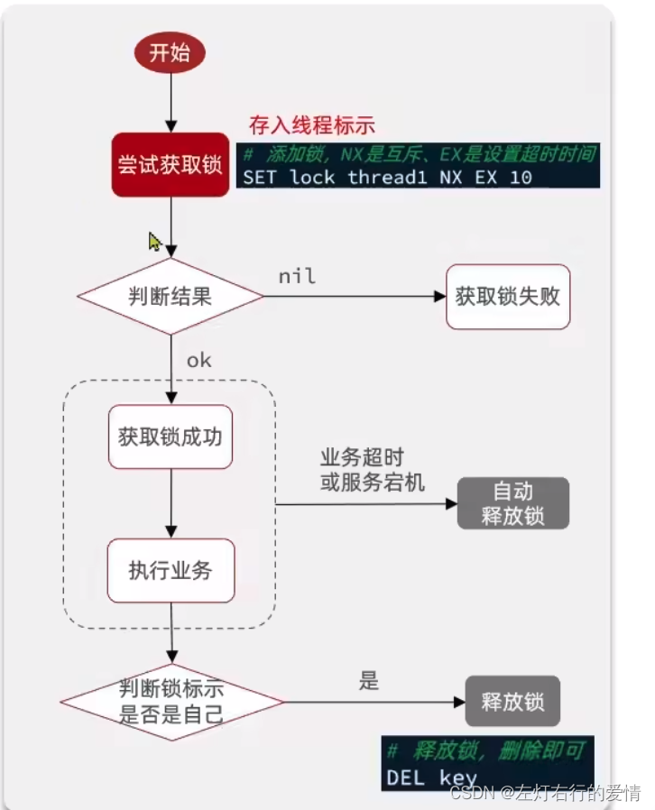
* 数据结构  
   那么这样的数据结构不支持可重入锁的实现，因为我们没有字段去记录重入的次数，只能判断是否为自己的锁。

redisson的数据结构可以支持，它的数据结构如下：  
 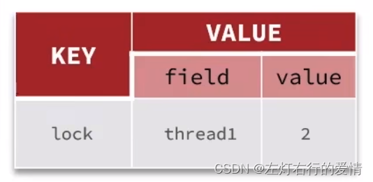  
 它的流程如下：  
 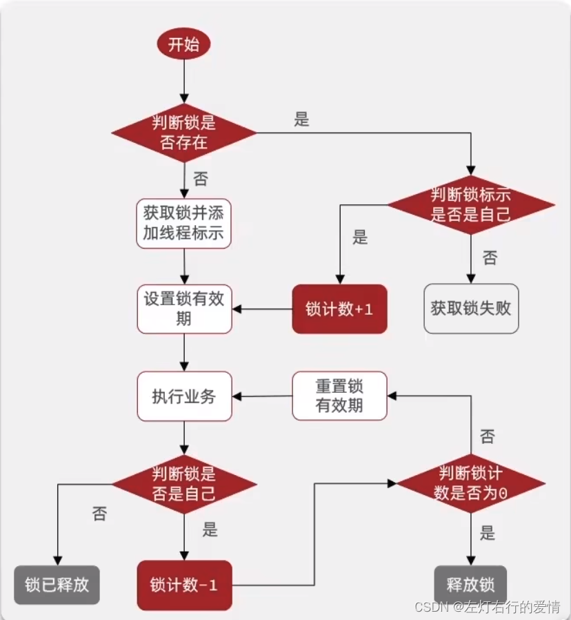  
 redisson底层是通过Lua脚本去实现的，具体如下所示：

```
local key = KEY[1]; -- 锁的key
local threadId = ARGV[1]; -- 线程的唯一标识
local releaseTime = ARGV[2]; -- 锁的自动释放时间

-- 判断当前锁是否还是被自己持有
if (redis.call('HEXISTS',key,threadId)==0) then
  return nil; --如果已经不是自己，则直接返回
end;

-- 是自己的锁，则重入次数-1
local count = redis.call('HINCRBY’，key ,threadId,-1);
-- 判断是否重入次数是否已经为0
if (count > 0) then
 -- 大于0说明不能释放锁，重置有效期然后返回
 redis.call('EXPIRE',key,releaseTime);
 return nil;
else  -- 等于0说明可以释放锁，直接删除
  redis.call('DEL',key);
  return nil;
end;


```

##### Redisson锁重试原理和 Watch Dog机制

### 结尾

准备面试八股没时间，有时间再补上吧。
