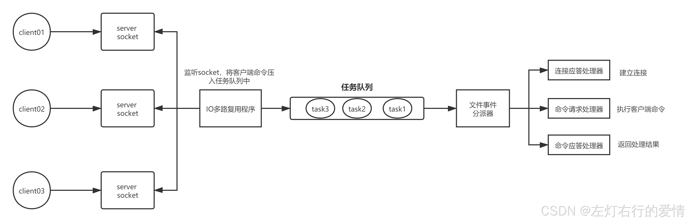
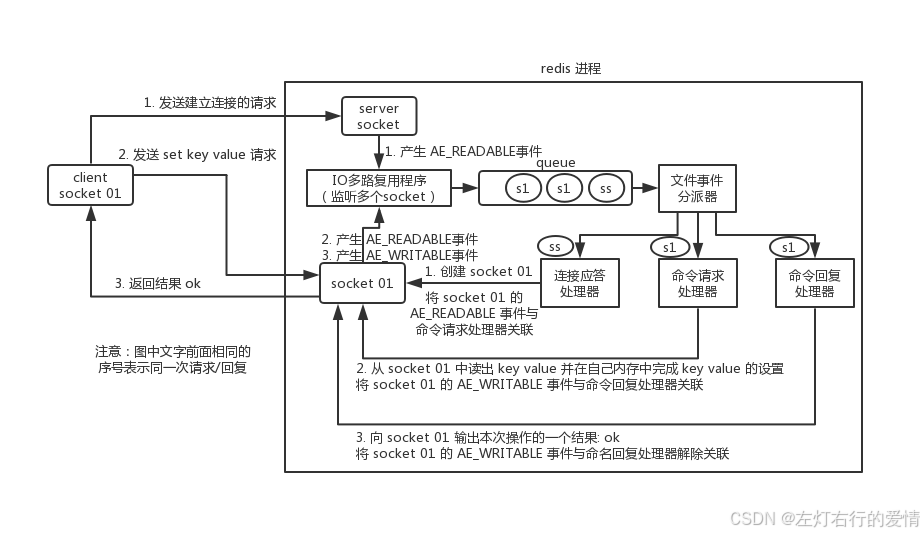
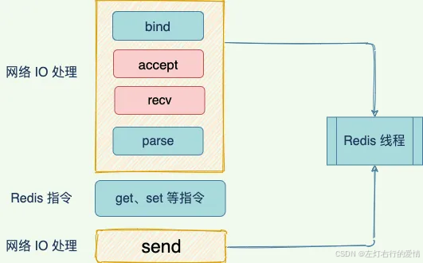
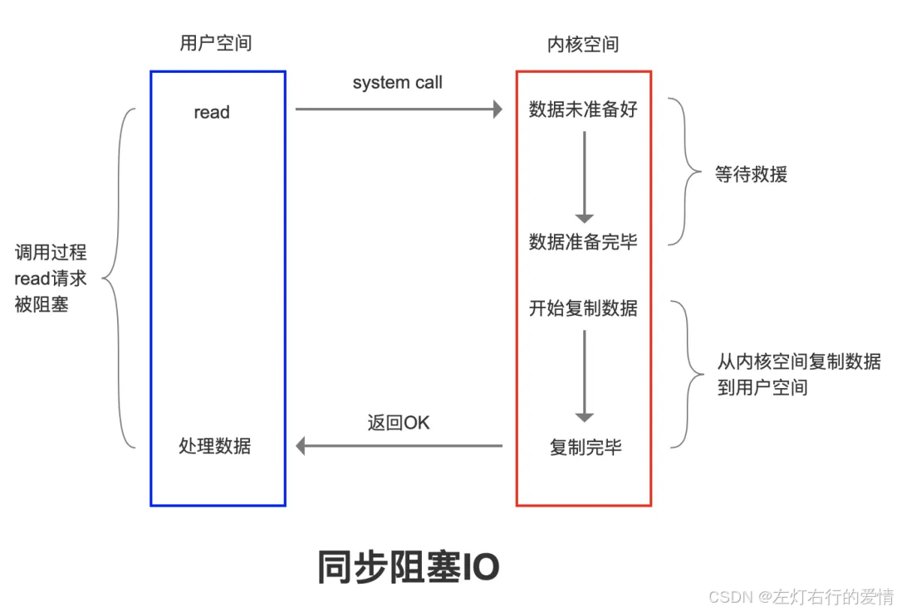
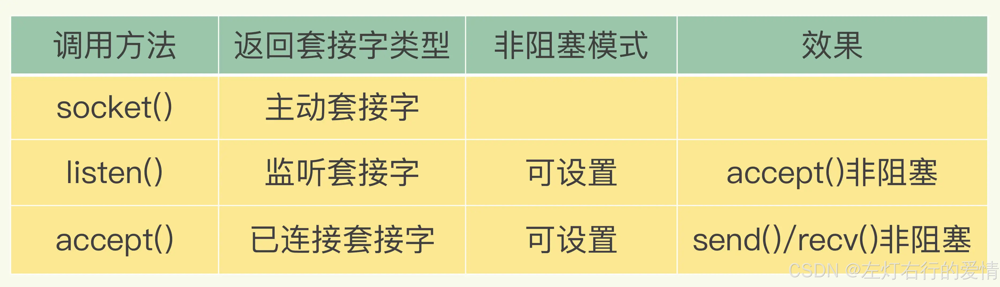
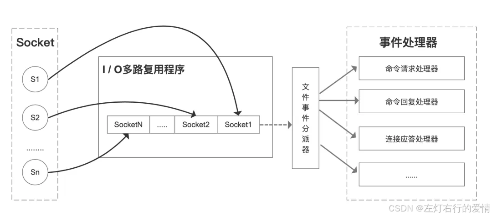
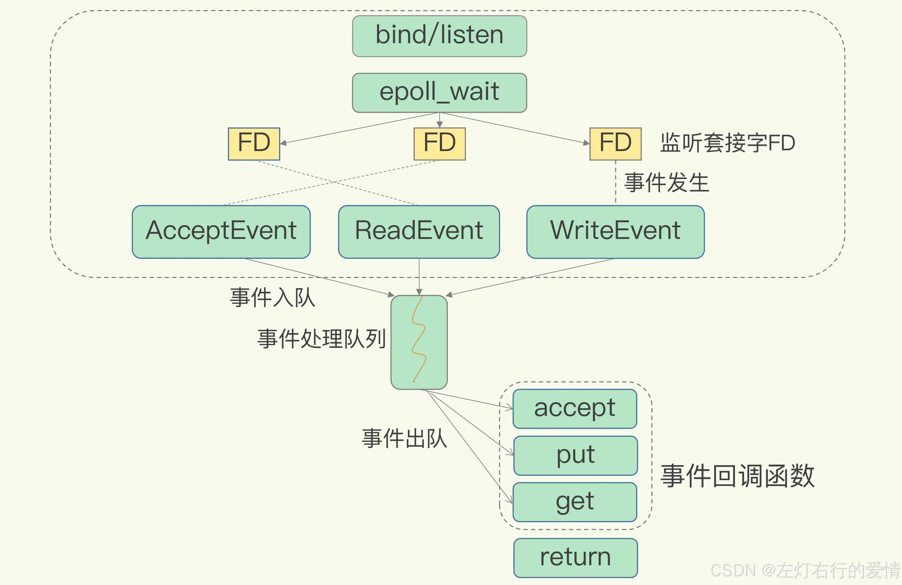

> 原文：[CSDN](https://blog.csdn.net/qq_45852626/article/details/145711338)（历史文章导入，当前状态为草稿）

### 前言

Redis 的线程模型其实是分两块的：  
 Redis 6.0 之前的单线程模型。其实从 4.0 开始，Redis 并不是严格意义上的单线程模型，因为 Redis 除了主线程外，也有一些后台的线程或者子进程在处理任务（例如清理脏数据、生成快照、AOF 重写），这个时候大家所说的单线程应该是 Redis 的主线程模型。  
 Redis 6.0 之后的多线程模型。Redis 在 6.0 之后引入了一种多线程模型，用于处理网络 I/O 的任务。  
 所以，你的回答要涉及这两个方面。  
 Redis 的单线程是指Redis 在执行一次命令时是单线程的。其过程包括「接收客户端请求 -> 解析请求 ->数据读写等操作->返回结果给客户端」，这个过程是由一个主线程来完成的，这也是我们常说 Redis 是单线程的原因。Redis 的模型是基于单线程事件驱动模型，内部使用文件事件处理器，而这个文件事件处理是单线程的，也就决定了 Redis 是单线程的。其核心原理是：采用 IO多路复用机制同时监听多个 socket，将产生事件的 socket 压入
内存 
队列中，事件分派器根据 socket 上的事件类型来选择对应的事件处理器进行处理。  
 随着底层网络硬件越来越好，Redis 的性能瓶颈逐渐体现在网络 I/O 的读写上，单个线程处理网络 I/O 读写的速度跟不上底层网络硬件执行的速度。所以为了提高 Redis 的性能，在 Redis 6.0 引入多线程模型，该多线程模型只用来处理网络数据的读写和协议解析，执行读写命令的仍然是单线程。

### 单线程模型

首先强调:  
 Redis核心处理逻辑是单线程,其他辅助模块会有一些多线程,多进程的功能,比如:

1. 复制模块是多进程
2. 某些异步流程从4.0开始用的多线程.
3. 网络I/O解包从6.0开始用的多线程

**redis 内部使用文件事件处理器 `file event handler`，它是单线程的，所以redis才叫做单线程模型。它采用IO多路复用机制同时监听多个 socket，将产生事件的 socket 压入内存队列中，事件分派器根据 socket 上的事件类型来选择对应的事件处理器进行处理。**

#### 一次客户端与Redis完整通信过程

##### 建立连接

1. 首先，redis 服务端进程初始化的时候，会将 server socket 的 AE\_READABLE 事件与连接应答处理器关联。
2. 客户端 socket01 向 redis 进程的 server socket 请求建立连接，此时 server socket 会产生一个 AE\_READABLE 事件，IO 多路复用程序监听到 server socket 产生的事件后，将该 socket 压入队列中。
3. 文件事件分派器从队列中获取 socket，交给连接应答处理器。
4. 连接应答处理器会创建一个能与客户端通信的 socket01，并将该 socket01 的 AE\_READABLE 事件与命令请求处理器关联。

##### 执行一个set请求

1. 客户端发送了一个 set key value 请求，此时 redis 中的 socket01 会产生 AE\_READABLE 事件，IO 多路复用程序将 socket01 压入队列
2. 此时事件分派器从队列中获取到 socket01 产生的 AE\_READABLE 事件，由于前面 socket01 的 AE\_READABLE 事件已经与命令请求处理器关联
3. 因此事件分派器将事件交给命令请求处理器来处理。命令请求处理器读取 socket01 的 key value 并在自己内存中完成 key value 的设置
4. 操作完成后，它会将 socket01 的 AE\_WRITABLE 事件与命令回复处理器关联
5. 如果此时客户端准备好接收返回结果了，那么 redis 中的 socket01 会产生一个 AE\_WRITABLE 事件，同样压入队列中
6. 事件分派器找到相关联的命令回复处理器，由命令回复处理器对 socket01 输入本次操作的一个结果，比如 ok，之后解除 socket01 的 AE\_WRITABLE 事件与命令回复处理器的关联。  
    整个流程如下图:  
    

##### 为什么选择单线程

官方答案：因为 Redis 是基于内存的操作，CPU 不是 Redis 的瓶颈，Redis 的瓶颈最有可能是机器内存的大小或者网络带宽。既然单线程容易实现，而且 CPU 不会成为瓶颈，那就顺理成章地采用单线程的方案了。

##### 多线程就不行吗

使用多线程，通常可以增加系统吞吐量，充分利用 CPU 资源。

但是，使用多线程后，没有良好的系统设计，可能会出现如下图所示的场景，增加了线程数量，前期吞吐量会增加，再进一步新增线程的时候，系统吞吐量几乎不再新增，甚至会下降！  
   
 多线程引入后需要考虑到:

* 极大增加复杂性:
  + 所有底层数据结构都要改造为线程安全
  + 顺序执行特性也不存在,需要引入一些复杂的实现.
* 额外的成本
  + 上下文切换成本
  + 同步机制的开销
  + 线程本身也占据内存大小.

#### I/O多路复用模型

此模型可以让Redis在网络I/O 操作中能并发处理大量的客户端请求，实现高吞吐率。  
 采用了 epoll + 自己实现的简单的事件框架。epoll 中的读、写、关闭、连接都转化成了事件，然后利用 epoll 的多路复用特性，绝不在 IO 上浪费一点时间。

##### 基本的IO模型

一个基本的网络 IO 模型，当处理 get 请求，会经历以下过程：

1. 和客户端建立建立 accept;
2. 从 socket 种读取请求 recv;
3. 解析客户端发送的请求 parse;
4. 执行 get 指令；
5. 响应客户端数据，也就是 向 socket 写回数据。  
    其中，`bind/listen、accept、recv、parse,send` 属于网络 IO 处理，而 get 属于键值数据操作。既然 Redis 是单线程，那么，最基本的一种实现是在一个线程中依次执行上面说的这些操作。

**关键点就是 accept 和 recv 会出现阻塞.**  
 当 Redis 监听到一个客户端有连接请求，但一直未能成功建立起连接时，会阻塞在 accept() 函数这里，导致其他客户端无法和 Redis 建立连接。  
 
类 
似的，当 Redis 通过 recv() 从一个客户端读取数据时，如果数据一直没有到达，Redis 也会一直阻塞在 recv()。  
   
 阻塞的原因由于使用传统阻塞 IO ，也就是在执行 read、accept 、recv 等网络操作会一直阻塞等待。如下图所示：  
 

##### 非阻塞模式

Socket 网络模型的非阻塞模式设置，主要体现在三个关键的函数调用上，如果想要使用 socket 非阻塞模式，就必须要了解这三个函数的调用返回类型和设置模式。接下来，我们就重点学习下它们。  
 在 socket 模型中，不同操作调用后会返回不同的套接字类型。  
 socket() 方法会返回主动套接字，然后调用 listen() 方法，将主动套接字转化为监听套接字，此时，可以监听来自客户端的连接请求。  
 最后，调用 accept() 方法接收到达的客户端连接，并返回已连接套接字。  
   
 针对监听套接字，我们可以设置非阻塞模式：当 Redis 调用 accept() 但一直未有连接请求到达时，Redis 线程可以返回处理其他操作，而不用一直等待。但是，你要注意的是，调用 accept() 时，已经存在监听套接字了。  
 **虽然 Redis 线程可以不用继续等待，但是总得有机制继续在监听套接字上等待后续连接请求，并在有请求时通知 Redis。**  
 这样才能保证 Redis 线程，既不会像基本 IO 模型中一直在阻塞点等待，也不会导致 Redis 无法处理实际到达的连接请求或数据。  
 到此，
Linux
 中的 IO 多路复用机制就要登场了。

##### IO多路复用

Linux 中的 IO 多路复用机制是指一个线程处理多个 IO 流，就是我们经常听到的 
select 
/epoll 机制。简单来说，在 Redis 只运行单线程的情况下，**该机制允许内核中，同时存在多个监听套接字和已连接套接字。内核会一直监听这些套接字上的连接请求或数据请求。一旦有请求到达，就会交给 Redis 线程处理，这就实现了一个 Redis 线程处理多个 IO 流的效果。**

多路指的是多个 socket 连接，复用指的是复用一个线程。多路复用主要有三种技术：select，poll，epoll。epoll 是最新的也是目前最好的多路复用技术。  
 下面是它们的对比表格:

| 特性 | select | poll | epoll |
| --- | --- | --- | --- |
| **支持的文件描述符数量** | 最大文件描述符数由 `FD_SETSIZE` 限制（通常为 1024） | 没有限制，理论上支持更多文件描述符 | 理论上支持的文件描述符数是无限的（受内存限制） |
| **性能** | 每次调用时都需要重新遍历所有文件描述符，性能较差 | 每次调用时都需要重新遍历所有文件描述符，性能较差 | 高效，事件只在状态变化时通知，避免每次遍历 |
| **阻塞方式** | 阻塞或非阻塞（通过设置） | 阻塞或非阻塞（通过设置） | 支持阻塞、非阻塞和水平触发（LT）、边沿触发（ET） |
| **内存使用** | 内核和用户空间都需要维护文件描述符集合，占用较多内存 | 内核和用户空间需要维护文件描述符集合，占用较多内存 | 内核内部管理文件描述符，用户空间只需要管理事件通知 |
| **适用场景** | 适用于文件描述符数目少的场景 | 适用于文件描述符数目较多但不是非常大的场景 | 适用于大量并发连接，性能最佳 |
| **灵活性** | 不支持边沿触发，只支持水平触发 | 不支持边沿触发，只支持水平触发 | 支持水平触发和边沿触发，灵活性更高 |
| **事件通知** | 每次调用都需要重新检查文件描述符状态，效率较低 | 每次调用都需要重新检查文件描述符状态，效率较低 | 通过回调机制，只有状态变化时才会通知 |
| **优缺点** | **优点**：简单易用； **缺点**：性能差，文件描述符数目有限，效率低 | **优点**：没有文件描述符数量限制； **缺点**：性能不如 epoll，仍然需要遍历所有文件描述符 | **优点**：高效，支持高并发，性能最好； **缺点**：实现稍复杂，支持的操作系统较少（Linux 最为成熟） |

所以epoll是现在最好的多路复用技术.  
 **它的基本原理是，内核不是监视应用程序本身的连接，而是监视应用程序的文件描述符。**

当客户端运行时，它将生成具有不同事件类型的套接字。在服务器端，I / O 多路复用程序（I / O 多路复用模块）会将消息放入队列（也就是 下图的 I/O 多路复用程序的 socket 队列），然后通过文件事件分派器将其转发到不同的事件处理器。

简单来说：Redis 单线程情况下，内核会一直监听 socket 上的连接请求或者数据请求，一旦有请求到达就交给 Redis 线程处理，这就实现了一个 Redis 线程处理多个 IO 流的效果。

select/epoll 提供了基于事件的回调机制，即针对不同事件的发生，调用相应的事件处理器。所以 Redis 一直在处理事件，提升 Redis 的响应性能。  
   
 那么，回调机制是怎么工作的呢？其实，select/epoll 一旦监测到 FD 上有请求到达时，就会触发相应的事件。  
   
 这些事件会被放进一个事件队列，Redis 单线程对该事件队列不断进行处理。这样一来，Redis 无需一直轮询是否有请求实际发生，这就可以避免造成 CPU 资源浪费。同时，Redis 在对事件队列中的事件进行处理时，会调用相应的处理函数，这就实现了基于事件的回调。因为 Redis 一直在对事件队列进行处理，所以能及时响应客户端请求，提升 Redis 的响应性能。

这就像病人去医院瞧病。在医生实际诊断前，每个病人（等同于请求）都需要先分诊、测体温、登记等。如果这些工作都由医生来完成，医生的工作效率就会很低。所以，医院都设置了分诊台，分诊台会一直处理这些诊断前的工作（类似于 Linux 内核监听请求），然后再转交给医生做实际诊断。这样即使一个医生（相当于 Redis 单线程），效率也能提升。

### 多线程模型

虽然 Redis 的主要工作（网络 I/O 和执行命令）一直是单线程模型，但是在 Redis 6.0 版本之后，也采用了多个 I/O 线程来处理网络请求，这是因为随着网络硬件的性能提升，Redis 的性能瓶颈有时会出现在网络 I/O 的处理上。

所以为了提高网络请求处理的并行度，Redis 6.0 对于网络请求采用多线程来处理。但是对于命令执行，Redis 仍然使用单线程来处理，所以大家不要误解 Redis 有多线程同时执行命令。

Redis 官方表示，Redis 6.0 版本引入的多线程 I/O 特性对性能提升至少是一倍以上。  
 Redis 6.0 版本支持的 I/O多线程特性，默认是 I/O 多线程只处理写操作（write 
client
 socket），并不会以多线程的方式处理读操作（read client socket）。要想开启多线程处理客户端读请求，就需要把Redis.conf配置文件中的 io-threads-do-reads 配置项设为 yes。

```
//读请求也使用 io 多线程
io-threads-do-readsyes


```

同时， Redis.conf配置文件中提供了IO 多线程个数的配置项。

```
//io-threadsN，表示启用N-1个I/O多线程（主线程也算一个I/O线程）
io-threads4


```

关于线程数的设置，官方的建议是如果为 4 核的 CPU，建议线程数设置为 2 或 3，如果为 8 核 CPU 建议线程数设置为 6，线程数一定要小于机器核数，线程数并不是越大越好。因此， Redis 6.0 版本之后，Redis 在启动的时候，默认情况下会有 6 个线程：

* Redis-server ：Redis 的主线程，主要负责执行命令；
* bio\_close\_file、bio\_aof\_fsync、bio\_lazy\_free：三个后台线程，分别异步处理关闭文件任务、AOF 刷盘任务、释放内存任务；
* io\_thd\_1、io\_thd\_2、io\_thd\_3：三个 I/O 线程，io-threads 默认是 4 ，所以会启动 3（4-1）个 I/O 多线程，用来分担 Redis 网络 I/O 的压力。
