> 原文：[CSDN](https://blog.csdn.net/qq_45852626/article/details/145731773)（历史文章导入，当前状态为草稿）

### 前言

普通链表的时间复杂度很有意思,增删改都是O(1),只有查是O(n).  
 而且无论这个链表元素是否有序,查询时间复杂度都是O(n),这就很让人沮丧了.  
 如果是数据的话,元素有序我们可以去用二分法,那就快很多了.  
 但是链表的查询让人有点绝望.  
 难道一点办法都没有吗?  
 如果链表是有序的,还是有办法的,新的数据结构-跳表!

### 什么是跳表

链表在查找元素的时候，因为需要逐一查找，所以查询效率非常低，时间复杂度是O(N)，于是就出现了跳表。  
 跳表是在链表基础上改进过来的，实现了一种「多层」的有序链表，这样的好处是能快读定位数据.  
 跳表示例图如下,层级为 3 的跳表::  
 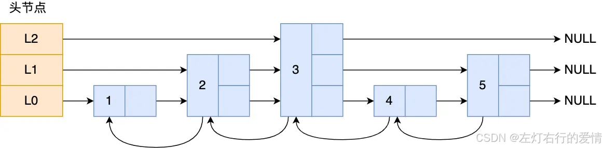  
 图中头节点有 L0~L2 三个头指针，分别指向了不同层级的节点，然后每个层级的节点都通过指针连接起来：

* L0 层级共有 5 个节点，分别是节点1、2、3、4、5；
* L1 层级共有 3 个节点，分别是节点 2、3、5；
* L2 层级只有 1 个节点，也就是节点 3 。  
   如果我们要在链表中查找节点 4 这个元素，只能从头开始遍历链表，需要查找 4 次.  
   使用了跳表后，只需要查找 2 次就能定位到节点 4:

1. 在头节点直接从 L2 层级跳到节点 3
2. 再往前遍历找到节点 4。  
    这个查找过程就是在多个层级上跳来跳去，最后定位到元素。当数据量很大时，跳表的查找复杂度就是 O(logN)。  
    这是个什么概念呢?  
    假设我们要找的是1024的话，你会发现原始链表要查1024次最后得到这个元素，那么这里的话就只需要查（2的10次方是1024次）十次这样一个数量级。  
    但是!  
    在现实中我们在用跳表的情况下，它会由于这个元素的增加和删除而导致的它的索引的话，有些数它并不是完全非常工整的，最后经过多次改动后，它最后索引有些地方会跨几步，有些地方会少只跨两步，这是因为里面的一些元素会被增加和删除了，而且它的维护成本相对较高，也是说当你增加一个元素，你会把它的索引要更新一遍，你要删除一个元素，也需要把它的索引更新一遍。在这种过程中它在增加和删除的话，它的时间复杂度就会变成 O(logn) 了。  
    **在跳表中查询任意数据的时平均时间复杂度就是 O(logn)。**

### 跳表数据结构

跳表节点是怎么实现多层级的呢？这就需要看「跳表节点」的数据结构了,如下:

```
typedef struct zskiplistNode {
    // 后退指针
    struct zskiplistNode *backward;
    // 分值
    double score;
    // 成员对象
    robj *obj;
    // 层
    struct zskiplistLevel {
        // 前进指针
        struct zskiplistNode *forward;
        // 跨度
        unsigned int span;
    } level[];
} zskiplistNode;


```

Zset 对象要同时保存「元素」和「元素的权重」.  
 所以对应到跳表上就是:[sds 类型的 ele 变量]和 [double 类型的 score 变量].

#### 层

跳跃表节点的 level 数组可以包含多个元素，每个元素都包含一个指向其他节点的指针，程序可以通过这些层来加快访问其他节点的速度，一般来说，层的数量越多，访问其他节点的速度就越快。

* **层的创建规则**  
   根据幂次定律 （power law，越大的数出现的概率越小） 随机生成一个介于 1 和 32 之间的值作为 level 数组的大小， 这个大小就是层的“高度”。  
   下图分别展示了三个高度为 1 层、 3 层和 5 层的节点， 因为 C 语言的数组索引总是从 0 开始的， 所以节点的第一层是 level[0] ， 而第二层是 level[1] ， 以此类推。  
   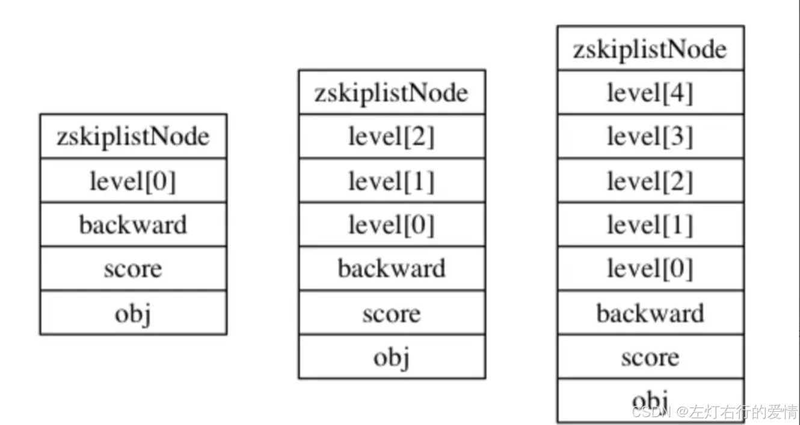

#### 前进指针

每个层都有一个指向表尾方向的前进指针（level[i].forward 属性）， 用于从表头向表尾方向访问节点。  
 下图中虚线代表前进方向  
 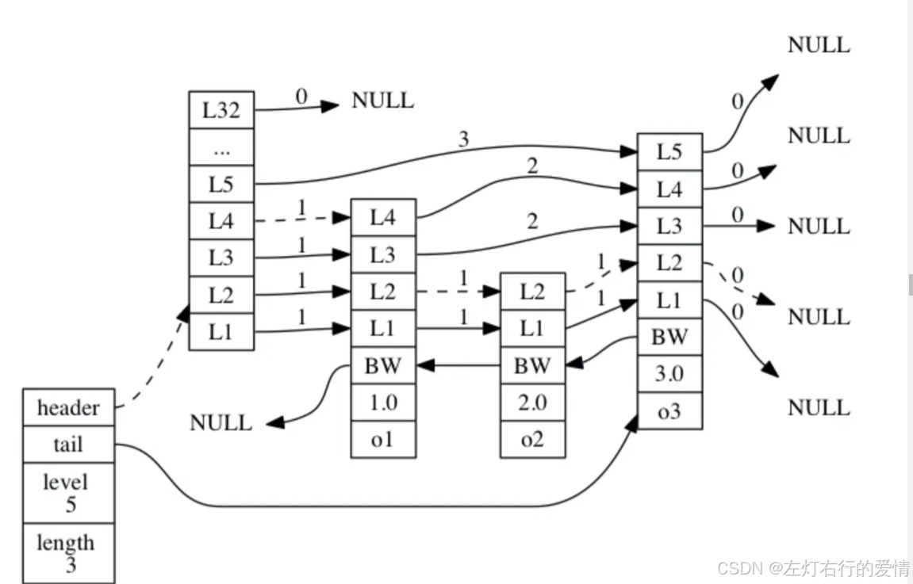

1. 迭代程序首先访问跳跃表的第一个节点（表头）， 然后从第四层的前进指针移动到表中的第二个节点。
2. 在第二个节点时， 程序沿着第二层的前进指针移动到表中的第三个节点。
3. 在第三个节点时， 程序同样沿着第二层的前进指针移动到表中的第四个节点。
4. 当程序再次沿着第四个节点的前进指针移动时， 它碰到一个 NULL ， 程序知道这时已经到达了跳跃表的表尾， 于是结束这次遍历。

#### 后退指针

节点的后退指针（backward 属性）用于从表尾向表头方向访问节点： 跟可以一次跳过多个节点的前进指针不同， 因为每个节点只有一个后退指针， 所以每次只能后退至前一个节点。

#### 跨度

层的跨度（level[i].span 属性）用于记录两个节点之间的距离：

* 两个节点之间的跨度越大， 它们相距得就越远。
* 指向 NULL 的所有前进指针的跨度都为 0 ， 因为它们没有连向任何节点。  
   跨度是用来计算排位（rank）的： **在查找某个节点的过程中， 将沿途访问过的所有层的跨度累计起来， 得到的结果就是目标节点在跳跃表中的排位。**  
   举个例子:  
   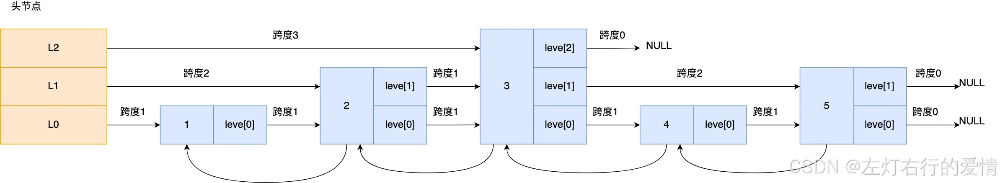  
   查找图中节点 3 在跳表中的排位，从头节点开始查找节点 3，查找的过程只经过了一个层（L2），并且层的跨度是 3，所以节点 3 在跳表中的排位是 3。  
   再举个例子:  
   如下用虚线标记了在跳跃表中查找分值为 2.0 、 成员对象为 o2 的节点时， 沿途经历的层： 在查找节点的过程中， 程序经过了两个跨度为 1 的节点， 因此可以计算出， 目标节点在跳跃表中的排位为 2 。  
   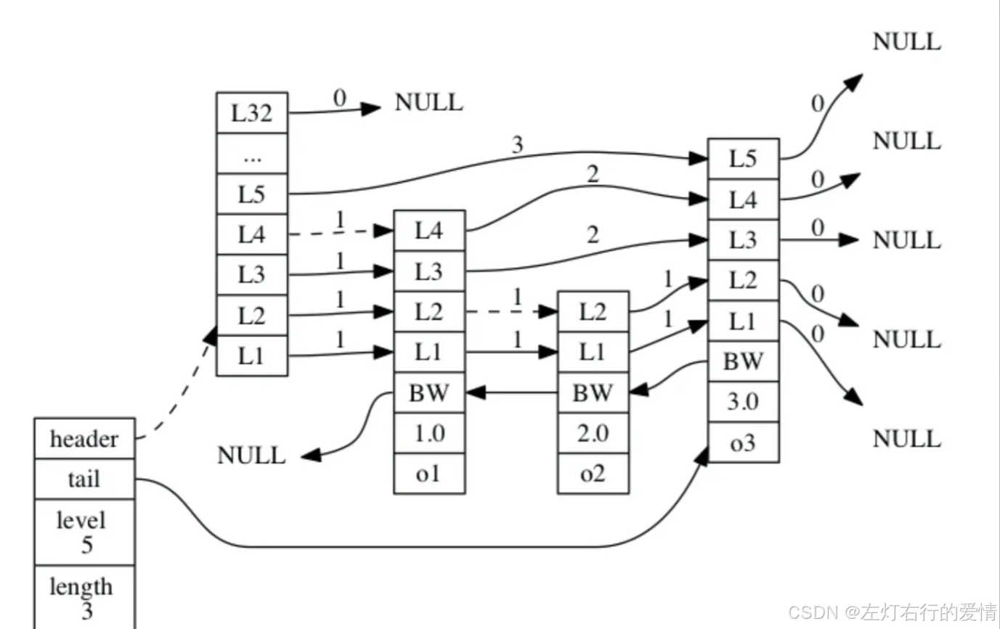

#### 分值和成员

* 节点的分值（score 属性）是一个 double 类型的浮点数， 跳跃表中的所有节点都按分值从小到大来排序。
* 节点的成员对象（obj 属性）是一个指针， 它指向一个字符串对象， 而字符串对象则保存着一个 SDS（简单动态字符串） 值。  
   在同一个跳跃表中， 各个节点保存的成员对象必须是唯一的， 但是多个节点保存的分值却可以是相同的： 分值相同的节点将按照成员对象在字典序中的大小来进行排序， 成员对象较小的节点会排在前面（靠近表头的方向）， 而成员对象较大的节点则会排在后面（靠近表尾的方向）。  
   举个例子， 在下图所示的跳跃表中， 三个跳跃表节点都保存了相同的分值 10086.0 ， 但保存成员对象 o1 的节点却排在保存成员对象 o2 和 o3 的节点之前， 而保存成员对象 o2 的节点又排在保存成员对象 o3 的节点之前， 由此可见， o1 、 o2 、 o3 三个成员对象在字典中的排序为 o1 <= o2 <= o3 。  
   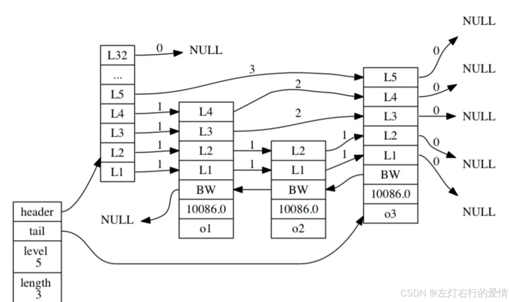

#### 跳跃表

仅靠多个跳跃表节点就可以组成一个跳跃表,如下图:  
 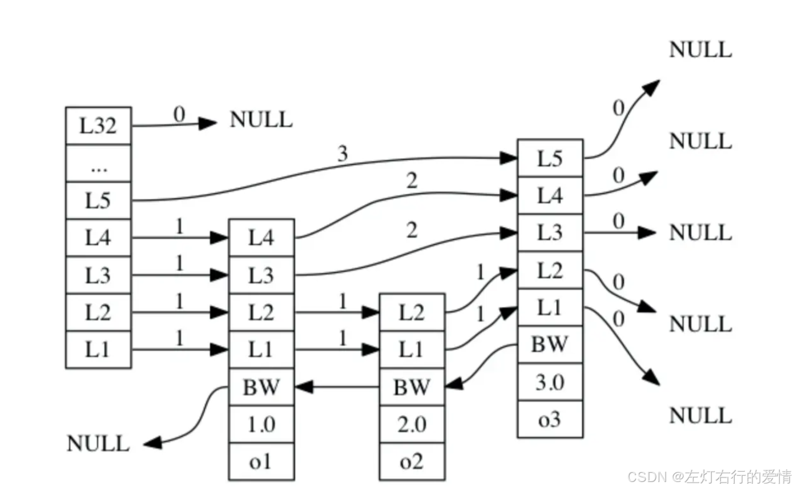  
 但是不太好管理,所以Redis通过使用一个 zskiplist 结构来持有这些节点， 程序可以更方便地对整个跳跃表进行处理， 比如快速访问跳跃表的表头节点和表尾节点， 又或者快速地获取跳跃表节点的数量（也即是跳跃表的长度）等信息，如下图:  
 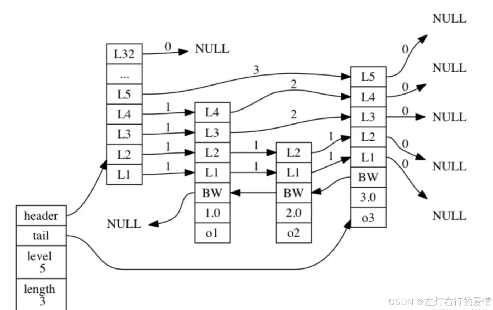  
 zskiplist结构的定义如下:

```
typedef struct zskiplist {

    // 表头节点和表尾节点
    struct zskiplistNode *header, *tail;

    // 表中节点的数量
    unsigned long length;

    // 表中层数最大的节点的层数
    int level;

} zskiplist;


```

* header 和 tail 指针分别指向跳跃表的表头和表尾节点， 通过这两个指针， 程序定位表头节点和表尾节点的复杂度为 O(1) 。
* 通过使用 length 属性来记录节点的数量， 程序可以在 O(1) 复杂度内返回跳跃表的长度。
* level 属性则用于在 O(1) 复杂度内获取跳跃表中层高最大的那个节点的层数量， 注意表头节点的层高并不计算在内。

### 跳表节点查询过程

查找一个跳表节点的过程时，跳表会从头节点的最高层开始，逐一遍历每一层。在遍历某一层的跳表节点时，会用跳表节点中的 SDS 类型的元素和元素的权重来进行判断，共有两个判断条件:

* 当前节点权重<目标权重,跳表访问该层下一个节点
* 当前节点权重=目标权重,且当前节点SDS类型数据<目标数据,跳表访问该层的下一个节点.  
   如果都不满足,或者下一个节点为null.  
   跳过会使用该level的下一层指针,跳到下一层继续查找.

举例:下图有个 3 层级的跳表  
 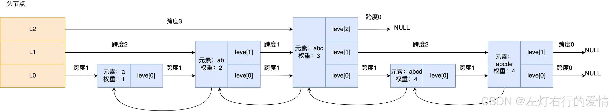  
 如果要查找「元素：abcd，权重：4」的节点，查找的过程是这样的:

1. 先从头节点的最高层开始L2 指向了「元素：abc，权重：3」节点,但是这个节点的权重比要查找节点的小,所以要访问该层上的下一个节点；
2. 该层的下一个节点是空节点,于是就会跳到「元素：abc，权重：3」节点的下一层去找，也就是 leve[1];
3. 「元素：abc，权重：3」节点的 leve[1] 的下一个指针指向了「元素：abcde，权重：4」的节点,这下权重相等,那就要判断SDS类型数据了,判断发现当前节点的 SDS 类型数据>要查找的数据.这时两个条件都不满足(当前权重<目标权重且数据=目标数据),跳到下一层到level[0].
4. 「元素：abc，权重：3」节点的 leve[0] 的下一个指针指向了「元素：abcd，权重：4」的节点，该节点正是要查找的节点，查询结束。

### 跳表节点层数设置

跳表的相邻两层的节点数量的比例会影响跳表的查询性能。  
 举个例子，下图的跳表，第二层的节点数量只有 1 个，而第一层的节点数量有 6 个。  
 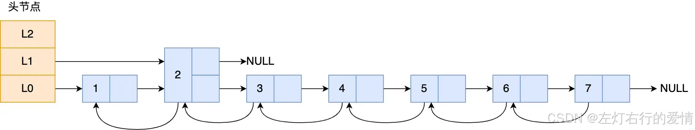  
 如果想要查询节点 6，那基本就跟链表的查询复杂度一样，就需要在第一层的节点中依次顺序查找，复杂度就是 O(N) 了。所以，为了降低查询复杂度，我们就需要维持相邻层结点数间的关系.  
 **跳表的相邻两层的节点数量最理想的比例是 2:1，查找复杂度可以降低到 O(logN)。**  
 下图的跳表就是，相邻两层的节点数量的比例是 2 : 1。  
 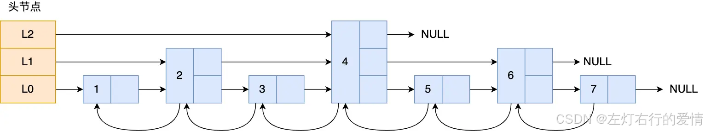  
 那么什么时候增加层数呢?  
 Redis 则采用一种巧妙的方法是，**跳表在创建节点的时候，随机生成每个节点的层数**.

**跳表在创建节点时候，会生成范围为[0-1]的一个随机数，如果这个随机数小于 0.25（相当于概率 25%），那么层数就增加 1 层，然后继续生成下一个随机数,直到随机数的结果大于 0.25 结束，最终确定该节点的层数。**

图中的跳表的「头节点」都是 3 层高，但是其实如果层高最大限制是 64，那么在创建跳表「头节点」的时候，就会直接创建 64 层高的头节点。

### 为什么用跳表而不用平衡树

* 从算法实现难度上来比较，跳表比平衡树要简单得多。  
   平衡树的插入和删除操作可能引发子树的调整，逻辑复杂,而跳表的插入和删除只需要修改相邻节点的指针，操作简单又快速。
* 从内存占用上来比较，跳表比平衡树更灵活一些。  
   平衡树每个节点包含 2 个指针（分别指向左右子树）,而跳表平均每个节点大概是1.3个
