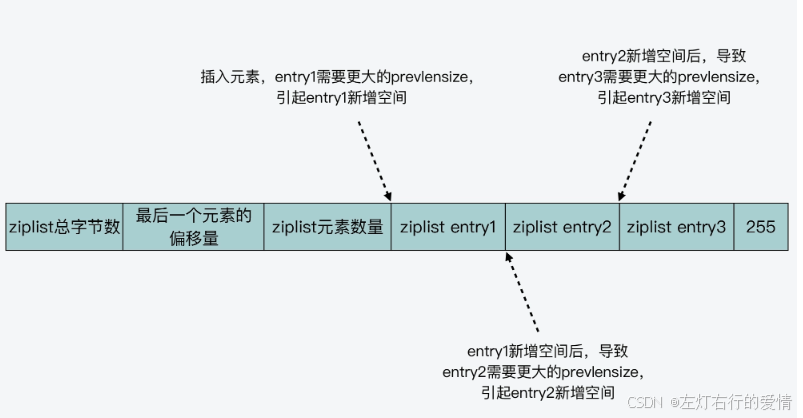
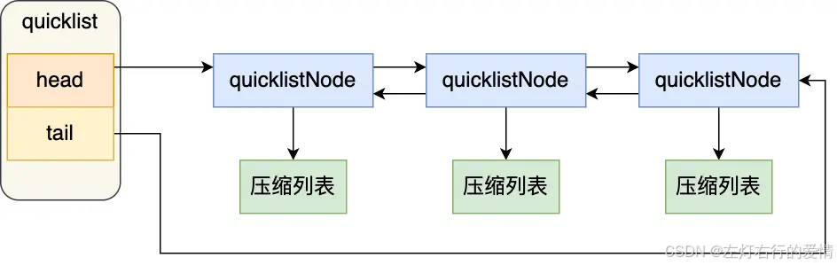

> 原文：[CSDN](https://blog.csdn.net/qq_45852626/article/details/145745965)（历史文章导入，当前状态为草稿）

### 前言

为什么会出现ziplist？有两个原因促进它的出现：  
 对于普通的双端列表(linked list)，它有指向前后的两个指针，对于存储数据小的情况下，通常指针占用的空间将超过数据占用空间；对于redis这种内存型结构，对于这种情况不能容忍  
 Linked list，是一种链表结构，在内存中通常不是连续的，从而导致遍历效率低下  
 ziplist的出现，解决了以上两个问题  
 ziplist 的最大特点，是它被设计成一种内存紧凑型的数据结构，占用一块连续的内存空间，以达到节省内存的目的。  
 但是ziplist会存在查询复杂度高和连锁更新的问题.

* 查询复杂度高  
   因为 ziplist 头尾元数据的大小是固定的，并且在 ziplist 头部记录了最后一个元素的位置，所以，当在 ziplist 中查找第一个或最后一个元素的时候，就可以很快找到。  
   但问题是，当要查找列表中间的元素时，ziplist 就得从列表头或列表尾遍历才行。而当 ziplist 保存的元素过多时，查找中间数据的复杂度就增加了。更糟糕的是，如果 ziplist 里面保存的是字符串，ziplist 在查找某个元素时，还需要逐一判断元素的每个字符，这样又进一步增加了复杂度。
* 连锁更新  
   ziplist 在插入元素时，如果内存空间不够了，ziplist 还需要重新分配一块连续的内存空间，而这还会进一步引发连锁更新的问题。  
   当新插入一个元素时，ziplist 就需要计算其所需的空间大小，并申请相应的内存空间。  
   而当新插入的元素较大时，就会引起插入位置的元素 prevlensize 增加，进而就会导致插入位置的元素所占空间也增加。  
   而如此一来，这种空间新增就会引起连锁更新的问题。  
   实际上，所谓的连锁更新，就是指当一个元素插入后，会引起当前位置元素新增 prevlensize 的空间。而当前位置元素的空间增加后，又会进一步引起该元素的后续元素，其 prevlensize 所需空间的增加。

这样，一旦插入位置后续的所有元素，都会因为前序元素的 prevlenszie 增加，而引起自身空间也要增加，这种每个元素的空间都需要增加的现象，就是连锁更新。  
   
 连锁更新一旦发生，就会导致 ziplist 占用的内存空间要多次重新分配，这就会直接影响到 ziplist 的访问性能。

### 什么是quickList

Redis源码中对quicklist的注释为 A doubly linked list of ziplists；也就是说quicklist是由ziplist组成的双向链表，其中每一个链表节点都是一个独立的ziplist结构，因此，从结构上看，quicklist就是ziplist的升级版,是综合考虑了时间效率与空间效率引入的新型数据结构。  
 它通过结合压缩列表和双端链表的特性来平衡内存效率和操作性能。它通过自动调整列表的结构来优化内存使用和提高访问效率，是 Redis 3.2 版本引入的重要改进之一。

### quickList结构

#### quickList

quicklist 作为一个链表结构，在它的数据结构中，是定义了整个 quicklist 的头、尾指针，这样一来，可以通过 quicklist 的数据结构，来快速定位到 quicklist 的链表头和链表尾。

```
typedef struct quicklist {
    quicklistNode *head;   // quicklist的链表头
    quicklistNode *tail;   // quicklist的链表尾
    unsigned long count;   // 所有ziplist中的总元素个数
    unsigned long len;     // quicklistNodes的个数
    int fill : QL_FILL_BITS;  // 单独解释
    unsigned int compress : QL_COMP_BITS; // 具体含义是两端各有compress个节点不压缩
    ...
} quicklist;


```

##### fill参数

fill用来指明每个quicklistNode中ziplist长度，当fill为正数时，表明每个ziplist最多含有的数据项数，当fill为负数时，如下：

Length -1: 4k，即ziplist节点最大为4KB  
 Length -2: 8k，即ziplist节点最大为8KB  
 Length -3: 16k …  
 Length -4: 32k  
 Length -5: 64k

fill取负数时，必须大于等于-5。可以通过Redis修改参数list-max-ziplist-size配置节点所占内存大小。实际上每个ziplist节点所占的内存会在该值上下浮动。

#### quickListNode

```
typedef struct quicklistNode {
    struct quicklistNode *prev;     //前一个quicklistNode
    struct quicklistNode *next;     //后一个quicklistNode
    unsigned char *zl;              //quicklistNode指向的ziplist
    unsigned int sz;                //ziplist的字节大小
    unsigned int count : 16;        //ziplist中的元素个数 
    unsigned int encoding : 2;   //编码格式，原生字节数组或压缩存储
    unsigned int container : 2;  //存储方式
    unsigned int recompress : 1; //数据是否被压缩
    unsigned int attempted_compress : 1; //数据能否被压缩
    unsigned int extra : 10; //预留的bit位
} quicklistNode;


```

quicklistNode 结构体里包含了前一个节点和下一个节点指针，这样每个 quicklistNode 形成了一个双向链表。  
 但是链表节点的元素不再是单纯保存元素值，而是保存了一个压缩列表，所以 quicklistNode 结构体里有个指向压缩列表的指针 \*zl。  
 下图可以帮你更好理解quickList数据结构:  
 

#### 数据压缩

**考虑quicklistNode节点个数较多时，我们经常访问的是两端的数据，为了进一步节省空间，Redis允许对中间的quicklistNode节点进行压缩，通过修改参数list-compress-depth进行配置，即设置compress参数，该项的具体含义是两端各有compress个节点不压缩。**

为了进一步降低ziplist所占用的空间，Redis允许对ziplist进一步压缩，Redis采用的压缩算法是LZF，压缩过后的数据可以分成多个片段，每个片段有2部分：

* 一部分是解释字段，另一部分是存放具体的数据字段。
* 解释字段可以占用1～3个字节，数据字段可能不存在。  
   举例:解释字段|数据|…|解释字段|数据

##### 压缩

LZF数据压缩的基本思想是：数据与前面重复的，记录重复位置以及重复长度，否则直接记录原始数据内容。  
 压缩算法的流程如下：遍历输入字符串，对当前字符及其后面2个字符进行散列运算，如果在Hash表中找到曾经出现的记录，则计算重复字节的长度以及位置，反之直接输出数据。

##### 解压缩

根据LZF压缩后的数据格式，可以较为容易地实现LZF的解压缩。需要注意的是，可能存在重复数据与当前位置重叠的情况，例如在当前位置前的15个字节处，重复了20个字节，此时需要按位逐个复制。

#### 如何控制每个zipList的大小

* quicklist的节点ziplist越小，越有可能造成更多的内存碎片。极端情况下，一个ziplist只有一个数据entry，也就退化成了linked list.
* quicklist的节点ziplist越大，分配给ziplist的连续内存空间越困难。极端情况下，一个quicklist只有一个ziplist，也就退化成了ziplist.  
   因此，合理配置参数显得至关重要，不同场景可能需要不同配置；redis提供list-max-ziplist-size参数进行配置，默认-2，表示每个ziplist节点大小不超过8KB
