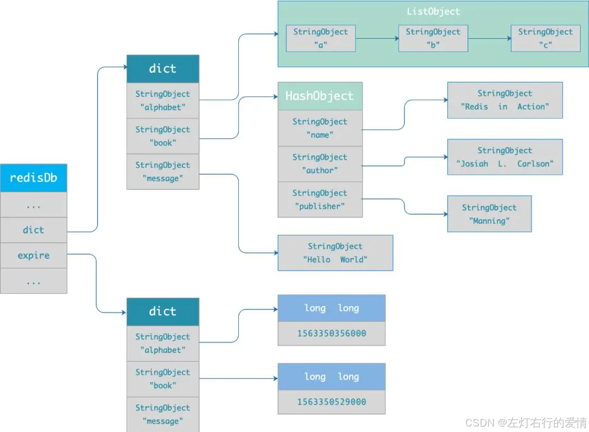
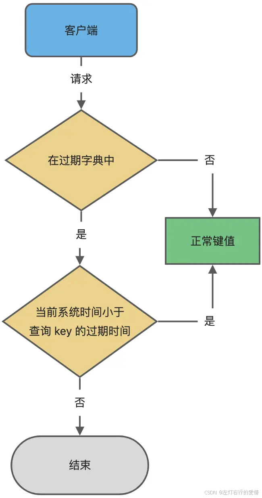
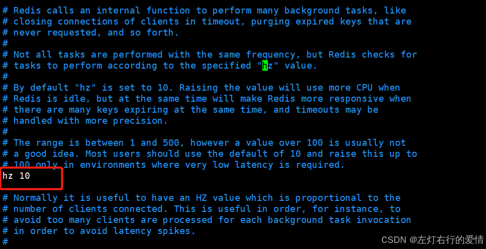
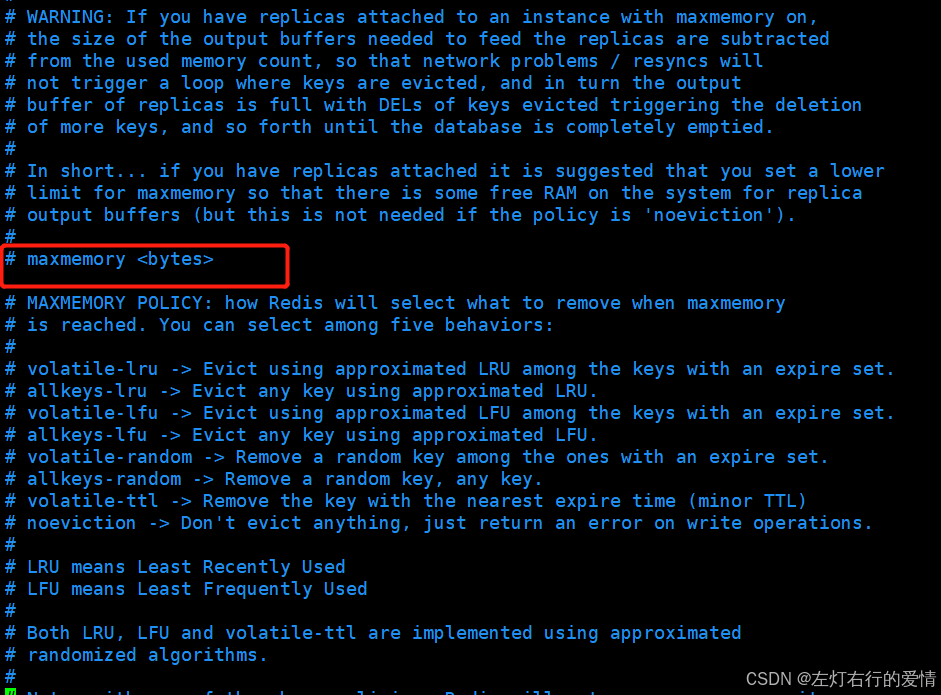
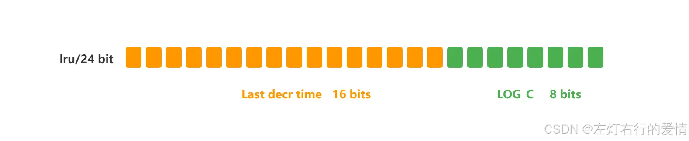
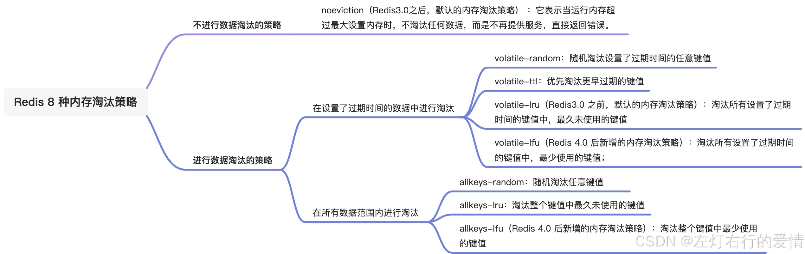

> 原文：[CSDN](https://blog.csdn.net/qq_45852626/article/details/145756115)（历史文章导入，当前状态为草稿）

#### 缓存过期&&内存淘汰
### 过期删除

Redis 是可以对 key 设置过期时间的，因此需要有相应的机制将已过期的键值对删除,而做这个工作的就是过期键值删除策略。

#### 如何设置过期时间

Redis提供了四个命令来设置过期时间（生存时间）。

```
EXPIRE <key> <ttl> ：表示将键 key 的生存时间设置为 ttl 秒。
PEXPIRE <key> <ttl> ：表示将键 key 的生存时间设置为 ttl 毫秒。
EXPIREAT <key> <timestamp> ：表示将键 key 的生存时间设置为 timestamp 所指定的秒数时间戳。
PEXPIREAT <key> <timestamp> ：表示将键 key 的生存时间设置为 timestamp 所指定的毫秒数时间戳。


```

注意:在Redis内部实现中，前面三个设置过期时间的命令最后都会转换成最后一个PEXPIREAT 命令来完成。

在设置字符串时，也可以同时对 key 设置过期时间，共有 3 种命令：

* `set <key> <value> ex <n>`:设置键值对的时候，同时指定过期时间（精确到秒）；
* `set <key> <value> px <n>`:设置键值对的时候，同时指定过期时间（精确到毫秒）；
* `setex <key> <n> <valule>`:设置键值对的时候，同时指定过期时间（精确到秒）。

另外补充几个个知识点：

1. 移除键的过期时间

PERSIST ：表示将key的过期时间移除。

2. 返回键的剩余生存时间

TTL ：以秒的单位返回键 key 的剩余生存时间。

PTTL ：以毫秒的单位返回键 key 的剩余生存时间。

#### 判断key是否过期

在Redis内部，每当我们设置一个键的过期时间时，Redis就会将该键带上过期时间存放到一个过期字典中。  
 当我们查询一个键时，Redis便首先检查该键是否存在过期字典中，如果存在，那就获取其过期时间。  
 然后将过期时间和当前系统时间进行比对，比系统时间大，那就没有过期；反之判定该键过期。

```
typedef struct redisDb {
  dict *dict;    /* 数据库键空间，存放着所有的键值对 */
  dict *expires; /* 键的过期时间 */
  ....
}redisDb;


```

过期字典数据结构结构如下：

* 过期字典的 key 是一个指针，指向某个键对象；
* 过期字典的 value 是一个 long long 类型的整数，这个整数保存了 key 的过期时间；  
   过期字典的数据结构如下图所示：  
     
   字典实际上是哈希表，哈希表的最大好处就是让我们可以用 O(1) 的时间复杂度来快速查找。  
   当我们查询一个 key 时，Redis 首先检查该 key 是否存在于过期字典中：
* 如果不在，则正常读取键值；
* 如果存在，则会获取该 key 的过期时间，然后与当前系统时间进行比对，如果比系统时间大，那就没有过期，否则判定该 key 已过期。  
   过期判断如下图:  
   

#### 过期删除策略有哪些

通常删除某个key，我们有如下三种方式进行处理。

##### 定时删除

在设置某个key 的过期时间同时，我们创建一个定时器，让定时器在该过期时间到来时，立即执行对其进行删除的操作。  
 优点：定时删除对内存是最友好的，能够保存内存的key一旦过期就能立即从内存中删除。  
 缺点：对CPU最不友好，在过期键比较多的时候，删除过期键会占用一部分 CPU 时间，对服务器的响应时间和吞吐量造成影响。

##### 惰性删除

设置该key 过期时间后，我们不去管它，当需要该key时，我们在检查其是否过期，如果过期，我们就删掉它，反之返回该key。  
 优点：对 CPU友好，我们只会在使用该键时才会进行过期检查，对于很多用不到的key不用浪费时间进行过期检查。  
 缺点：对内存不友好，如果一个键已经过期，但是一直没有使用，那么该键就会一直存在内存中，如果数据库中有很多这种使用不到的过期键，这些键便永远不会被删除，内存永远不会释放。从而造成内存泄漏。

##### 定期删除

每隔一段时间，我们就对一些key进行检查，删除里面过期的key。  
 优点：可以通过限制删除操作执行的时长和频率来减少删除操作对 CPU 的影响。另外定期删除，也能有效释放过期键占用的内存。  
 缺点：难以确定删除操作执行的时长和频率。  
 如果执行的太频繁，定期删除策略变得和定时删除策略一样，对CPU不友好。  
 如果执行的太少，那又和惰性删除一样了，过期键占用的内存不会及时得到释放。  
 另外最重要的是，在获取某个键时，如果某个键的过期时间已经到了，但是还没执行定期删除，那么就会返回这个键的值，这是业务不能忍受的错误。

##### Redis过期删除策略

前面讨论了删除过期键的三种策略，发现单一使用某一策略都不能满足实际需求，既然单一策略不能满足，那就只能组合使用。  
 **Redis的过期删除策略就是：惰性删除和定期删除两种策略配合使用。**  
 **惰性删除**：Redis的惰性删除策略由 `db.c/expireIfNeeded` 函数实现，所有键读写命令执行之前都会调用 `expireIfNeeded` 函数对其进行检查，如果过期，则删除该键，然后执行键不存在的操作；未过期则不作操作，继续执行原有的命令。

```
int expireIfNeeded(redisDb *db, robj *key) {
  // 判断 key 是否过期
  if (!keyIsExpired(db,key)) return 0;
   ....
    /* 删除过期键 */
    ....
    // 如果 server.lazyfree_lazy_expire 为 1 表示异步删除,反之同步删除；
     return server.lazyfree_lazy_expire? dbAsyncDelete(db,key) :
      dbSyncDelete(db,key);


```

**定期删除**：由`redis.c/activeExpireCycle` 函数实现，函数以一定的频率运行，每次运行时，都从一定数量的数据库中取出一定数量的随机键进行检查，并删除其中的过期键。  
 **注意：并不是一次运行就检查所有的库，所有的键，而是随机检查一定数量的键。**

定期删除函数的运行频率，在Redis中，规定每秒运行10次,在Redis2.8版本后，可以通过修改配置文件redis.conf 的 hz 选项来调整这个次数。  
   
 看上面对这个参数的解释，建议不要将这个值设置超过 100，否则会对CPU造成比较大的压力。

我们看到，通过过期删除策略，对于某些永远使用不到的键，并且多次定期删除也没选定到并删除，那么这些键同样会一直驻留在内存中，又或者在Redis中存入了大量的键，这些操作可能会导致Redis内存不够用，这时候就需要Redis的内存淘汰策略了。

### 内存淘汰策略

前面说的过期删除策略，是删除已过期的 key，而当 Redis 的运行内存已经超过 Redis 设置的最大内存之后，则会使用内存淘汰策略删除符合条件的 key，以此来保障 Redis 高效的运行。

#### 如何设置Redis最大运行内存

在配置文件redis.conf 中，可以通过参数 maxmemory 来设定最大内  
 存：  
   
 **只有在 Redis 的运行内存达到了我们设置的最大运行内存，才会触发内存淘汰策略。**  
 不同位数的操作系统，maxmemory 的默认值是不同的：

* 在 64 位操作系统中，maxmemory 的默认值是 0，表示没有内存大小限制，那么不管用户存放多少数据到 Redis 中，Redis 也不会对可用内存进行检查，直到 Redis 实例因内存不足而崩溃也无作为。
* 在 32 位操作系统中，maxmemory 的默认值是 3G，因为 32 位的机器最大只支持 4GB 的内存，而系统本身就需要一定的内存资源来支持运行，以 32 位操作系统限制最大 3 GB 的可用内存是非常合理的，这样可以避免因为内存不足而导致 Redis 实例崩溃。

#### Redis内存淘汰策略有哪些

Redis 内存淘汰策略共有八种，这八种策略大体分为「不进行数据淘汰」和「进行数据淘汰」两类策略.

##### 不进行数据淘汰

* noeviction : 不移除任何key，只是返回一个写错误并禁止写入 ，默认选项，一般不会选用。但是如果没用数据写入的话，只是单纯的查询或者删除操作的话，还是可以正常工作。

##### 进行数据淘汰的策略

又可以细分为「在设置了过期时间的数据中进行淘汰」和「在所有数据范围内进行淘汰」这两类策略。

###### 设置了过期时间的数据中进行淘汰

* volatile-random：随机淘汰设置了过期时间的任意键值
* volatile-ttl：优先淘汰更早过期的键值
* volatile-lru（Redis3.0 之前，默认的内存淘汰策略）：淘汰所有设置了过期时间的键值中，最久未使用的键值；
* volatile-lfu（Redis 4.0 后新增的内存淘汰策略）：淘汰所有设置了过期时间的键值中，最少使用的键值；

###### 所有数据范围内进行淘汰

* allkeys-random：随机淘汰任意键值;
* allkeys-lru：淘汰整个键值中最久未使用的键值；
* allkeys-lfu（Redis 4.0 后新增的内存淘汰策略）：淘汰整个键值中最少使用的键值。

#### 如何查看当前 Redis 使用的内存淘汰策略？

可以使用 config get maxmemory-policy 命令，来查看当前 Redis 的内存淘汰策略，命令如下：

```
127.0.0.1:6379> config get maxmemory-policy
1) "maxmemory-policy"
2) "noeviction"


```

可以看出，当前 Redis 使用的是 noeviction 类型的内存淘汰策略，它是 Redis 3.0 之后默认使用的内存淘汰策略，表示当运行内存超过最大设置内存时，不淘汰任何数据，但新增操作会报错。

#### 如何修改Redis内存淘汰策略

设置内存淘汰策略有两种方法：

* 方式一：通过“config set maxmemory-policy <策略>”命令设置。它的优点是设置之后立即生效，不需要重启 Redis 服务，缺点是重启 Redis 之后，设置就会失效。
* 方式二：通过修改 Redis 配置文件修改，设置“maxmemory-policy <策略>”，它的优点是重启 Redis 服务后配置不会丢失，缺点是必须重启 Redis 服务，设置才能生效。

#### LRU算法和LFU算法有什么区别

LFU 内存淘汰算法是 Redis 4.0 之后新增内存淘汰策略，那为什么要新增这个算法？  
 那肯定是为了解决 LRU 算法的问题。  
 如果你学过MySQL里的Buffer Pool,里面也有个对LRU算法进行的优化,个人感觉思路差不多的.

##### 什么是LRU

LRU算法全称是最近最少使用算法（Least Recently Use），广泛的应用于缓存机制中。当缓存使用的空间达到上限后，就需要从已有的数据中淘汰一部分以维持缓存的可用性，而淘汰数据的选择就是通过LRU算法完成的。  
 **LRU算法的基本思想是基于局部性原理的时间局部性：如果一个信息项正在被访问，那么在近期它很可能还会被再次访问。**  
 所以顾名思义，LRU算法会选出最近最少使用的数据进行淘汰。

传统 LRU 算法的实现是基于「链表」结构，链表中的元素按照操作顺序从前往后排列，最新操作的键会被移动到表头，当需要内存淘汰时，只需要删除链表尾部的元素即可，因为链表尾部的元素就代表最久未被使用的元素。

##### Redis的LRU

Redis 并没有使用这样的方式实现 LRU 算法，因为传统的 LRU 算法存在两个问题:

* 需要用链表管理所有的缓存数据，这会带来额外的空间开销
* 当有数据被访问时，需要在链表上把该数据移动到头端，如果有大量数据被访问，就会带来很多链表移动操作，会很耗时，进而会降低 Redis 缓存性能。  
   Redis 实现的是一种近似 LRU 算法，目的是为了更好的节约内存.  
   实现方式是在 Redis 的对象结构体中添加一个额外的字段，用于记录此数据的最后一次访问时间。  
   **当 Redis 进行内存淘汰时，会使用随机采样的方式来淘汰数据，它是随机取 5 个值（此值可配置），然后淘汰最久没有使用的那个。**  
   Redis 实现的 LRU 算法的优点：
* 不用为所有的数据维护一个大链表，节省了空间占用；
* 不用在每次数据访问时都移动链表项，提升了缓存的性能；

但是 LRU 算法有一个问题，**无法解决缓存污染问题**，比如应用一次读取了大量的数据,而这些数据只会被读取这一次，那么这些数据会留存在 Redis 缓存中很长一段时间，造成缓存污染。

##### LFU算法

LFU 全称是 `Least Frequently Used` 翻译为最近最不常用，LFU 算法是根据数据访问次数来淘汰数据的，它的核心思想是“如果数据过去被访问多次，那么将来被访问的频率也更高”。  
 所以， LFU 算法会记录每个数据的访问次数。当一个数据被再次访问时，就会增加该数据的访问次数。  
 这样就解决了偶尔被访问一次之后，数据留存在缓存中很长一段时间的问题，相比于 LRU 算法也更合理一些。

##### Redis如何实现LFU算法的

相比于 LRU 算法的实现，多记录了「**数据的访问频次**」的信息。Redis 对象的结构如下：

```
typedef struct redisObject {
...
 // 24 bits，用于记录对象的访问信息
  unsigned lru:24;  
    ...
} robj;


```

Redis 对象头中的 lru 字段，在 LRU 算法下和 LFU 算法下使用方式并不相同.

###### LRU中

Redis 对象头的 24 bits 的 lru 字段是用来记录 key 的访问时间戳，因此在 LRU 模式下，Redis可以根据对象头中的 lru 字段记录的值，来比较最后一次 key 的访问时间长，从而淘汰最久未被使用的 key。

###### LFU中

Redis对象头的 24 bits 的 lru 字段被分成两段来存储，高 16bit 存储 ldt(Last Decrement Time)，低 8bit 存储 logc(Logistic Counter)。  
 

* ldt 是用来记录 key 的访问时间戳；
* logc 是用来记录 key 的访问频次，它的值越小表示使用频率越低，越容易淘汰，每个新加入的 key 的logc 初始值为 5。  
   **注意，logc 并不是单纯的访问次数，而是访问频次（访问频率），因为 logc 会随时间推移而衰减的。**  
   在每次 key 被访问时，会先对 logc 做一个衰减操作，衰减的值跟前后访问时间的差距有关系，如果上一次访问的时间与这一次访问的时间差距很大，那么衰减的值就越大，这样实现的 LFU 算法是根据**访问频率**来淘汰数据的，而不只是访问次数。  
   访问频率需要考虑 key 的访问是多长时间段内发生的。key 的先前访问距离当前时间越长，那么这个 key 的访问频率相应地也就会降低，这样被淘汰的概率也会更大。

对 logc 做完衰减操作后，就开始对 logc 进行增加操作，增加操作并不是单纯的 + 1，而是根据概率增加，如果 logc 越大的 key，它的 logc 就越难再增加。

### 总结

Redis 使用的过期删除策略是「惰性删除+定期删除」，删除的对象是已过期的 key。


内存淘汰策略是解决内存过大的问题，当 Redis 的运行内存超过最大运行内存时，就会触发内存淘汰策略，Redis 4.0 之后共实现了 8 种内存淘汰策略，如下：  
 
