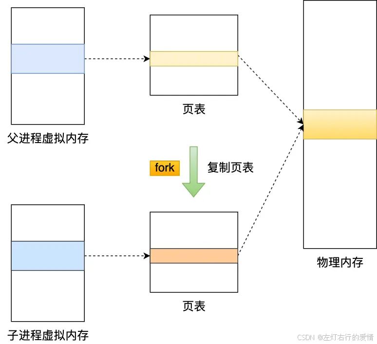
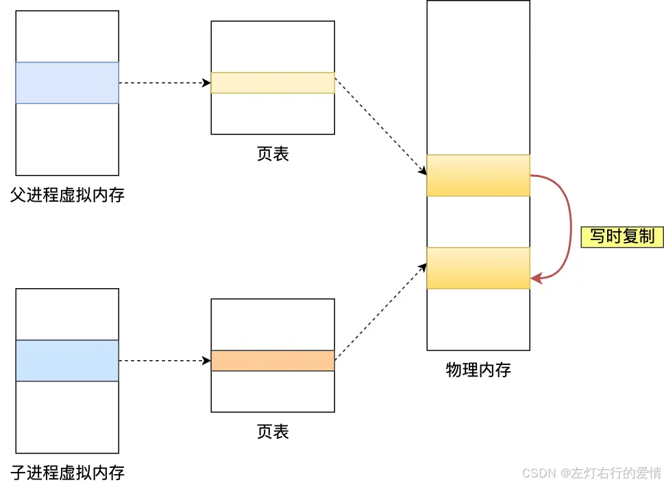
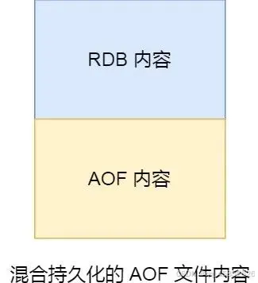

> 原文：[CSDN](https://blog.csdn.net/qq_45852626/article/details/145765328)（历史文章导入，当前状态为草稿）

### 前言

因为Redis的数据都储存在内存中，当进程退出时，所有数据都将丢失。  
 为了保证数据安全，Redis支持RDB持久化机制有效避免数据丢失问题。RDB可以看作在某一时刻Redis的快照（snapshot），非常适合灾难恢复.

### 什么是RDB

RDB就像是一台给Redis内存数据存储拍照的照相机，生成快照保存到磁盘的过程。  
 Redis 的快照是全量快照，也就是说每次执行快照，都是把内存中的「所有数据」都记录到磁盘中。  
 所以可以认为，执行快照是一个比较重的操作，如果频率太频繁，可能会对 Redis 性能产生影响。如果频率太低，服务器故障时，丢失的数据会更多。  
 通常可能设置至少 5 分钟才保存一次快照，这时如果 Redis 出现宕机等情况，则意味着最多可能丢失 5 分钟数据。  
 综上,RDB一般用于数据冷备和复制传输。

### RDB的触发

触发RDB持久化分为手动触发和自动触发。Redis重启读取RDB速度快.  
 Redis 提供了两个命令来生成 RDB 文件，分别是 save 和 bgsave,他们的区别就在于是否在「主线程」里执行.

#### 手动触发

使用save命令：此命令会使用Redis的主线程进程同步存储，阻塞当前的Redis服务器，造成服务不可用，直到RDB过程完成。无论当前服务器数据量大小，线上不要用。

```
127.0.0.1:6379> save
OK
(1.14s)
59117:M 13 Apr 13:34:51.948 * DB saved on disk


```

使用bgsave命令：此命令会通过fork()创建子进程，在后台进程存储。只有fork阶段会阻塞当前Redis服务器，不必到整个RDB过程结束，一般时间很短。因此Redis内部涉及到RDB都采用bgsave命令。这里注意一点，无论RDB还是AOF，由于使用了写时复制，fork出来的子进程不需要拷贝父进程的物理内存空间，但是会复制父进程的空间内存页表。

```
127.0.0.1:6379> bgsave
Background saving started
59117:M 13 Apr 13:44:40.312 * Background saving started by pid 59180
59180:C 13 Apr 13:44:40.314 * DB saved on disk
59117:M 13 Apr 13:44:40.317 * Background saving terminated with success


```

#### 自动触发

一般我们是不会直接用命令生成RDB文件的，Redis支持自动触发RDB持久化机制，配置都在redis.conf文件里面，我们先来看一下文件里关于rdb的默认配置，文章已翻译:

```
# 保存数据库到磁盘：
# 
#   save <秒数> <写操作次数>
#   
#   如果满足给定的秒数和数据库中发生的写操作次数，则保存数据库。
#   
#   以下是示例中的行为：
#   - 每900秒（15分钟）且至少1次写操作时保存
#   - 每300秒（5分钟）且至少10次写操作时保存
#   - 每60秒且至少10000次写操作时保存
#   
# 注意：你可以通过注释掉所有“save”行来完全禁用保存功能。
#
# 也可以通过添加一个空的保存指令（如以下示例）来删除所有之前配置的保存点：
# 
#   save ""
save 900 1
save 300 10
save 60 10000
# 默认情况下，如果启用了RDB快照（至少有一个保存点）且最新的后台保存失败，
# Redis将停止接受写操作。这是为了让用户意识到数据没有正确地持久化到磁盘。
# 否则，可能没有人会注意到，可能会发生灾难。
#
# 如果后台保存进程开始重新工作，Redis将自动重新允许写操作。
#
# 然而，如果你已经设置了合适的Redis服务器和持久化监控，你可能希望禁用此功能，
# 这样即使磁盘、权限等出现问题，Redis也会继续正常工作。
stop-writes-on-bgsave-error yes
# 是否在保存.dump.rdb数据库时使用LZF压缩字符串对象？
# 默认情况下设置为“yes”，因为通常这是一个优化（节省空间）。
# 如果你想节省保存子进程的CPU，可以设置为“no”，但如果你的数据可压缩，数据集的大小可能会更大。
rdbcompression yes
# 从Redis版本5开始，RDB文件的末尾会添加一个CRC64校验和。
# 这使得格式对损坏更具抵抗力，但在保存和加载RDB文件时会带来性能损失（大约10%的开销）。
# 如果你追求最大性能，可以禁用它。
#
# 使用禁用校验和的RDB文件将具有零校验和，这将告诉加载代码跳过校验。
rdbchecksum yes
# 要保存的数据库文件的文件名
dbfilename dump.rdb
# 工作目录：
# 数据库将写入该目录，使用上面指定的文件名（'dbfilename'）进行命名。
# 附加文件（AOF）也将在该目录内创建。
#
# 注意：你必须指定一个目录，而不是文件名。
dir /usr/local/var/db/redis/


```

* **save m n：代表Redis服务器在m秒内数据存在n次修改时，自动触发rdb。这个参数比较关键。**
* stop-writes-on-bgsave-error：如果是yes，当bgsave命令失败时Redis将停止写入操作。
* rdbcompression：是否对RDB文件进行压缩，但是在LZF压缩消耗更多CPU
* rdbchecksum：是否对RDB文件进程校验
* **dbfilename：配置文件名称，默认dump.rdb**
* **dir：配置rdb文件存放的路劲，这个参数比较重要。**

#### 执行快照时,数据可以被修改吗

执行 bgsave 过程中，由于是交给子进程来构建 RDB 文件，主线程还是可以继续工作的，此时主线程可以修改数据吗？  
 答案:  
 执行 bgsave 过程中，Redis 依然可以继续处理操作命令的，也就是数据是能被修改的.  
 只需要依赖一个关键技术: **写时复制技术（Copy-On-Write, COW）**  
 执行 bgsave 命令的时候，会通过 fork() 创建子进程，此时子进程和父进程是共享同一片内存数据的，因为创建子进程的时候，会复制父进程的页表，但是页表指向的物理内存还是一个。  
   
 只有在发生修改内存数据的情况时，物理内存才会被复制一份。  
   
 这样的目的是**为了减少创建子进程时的性能损耗，从而加快创建子进程的速度**，毕竟创建子进程的过程中，是会阻塞主线程的。  
 所以，创建 bgsave 子进程后，由于共享父进程的所有内存数据，于是就可以直接读取主线程（父进程）里的内存数据，并将数据写入到 RDB 文件。

当主线程（父进程）对这些共享的内存数据也都是只读操作，那么，主线程（父进程）和 bgsave 子进程相互不影响。  
 但是，如果主线程（父进程）要修改共享数据里的某一块数据（比如键值对 A）时，就会发生写时复制，这块数据的物理内存就会被复制一份（键值对 A’），然后主线程在这个数据副本（键值对 A’）进行修改操作。  
 与此同时，bgsave 子进程可以继续把原来的数据（键值对 A）写入到 RDB 文件。  
 就是这样，Redis 使用 bgsave 对当前内存中的所有数据做快照，这个操作是由 bgsave 子进程在后台完成的，执行时不会阻塞主线程，这就使得主线程同时可以修改数据。

bgsave 快照过程中，如果主线程修改了共享数据，发生了写时复制后，RDB 快照保存的是原本的内存数据，而主线程刚修改的数据，是没办法在这一时间写入 RDB 文件的，只能交由下一次的 bgsave 快照。

**如果系统恰好在 RDB 快照文件创建完毕后崩溃了，那么 Redis 将会丢失主线程在快照期间修改的数据。**

对于写时复制来说,还有种极端的情况: **如果所有的共享内存都被修改，则此时的内存占用是原先的 2 倍。**  
 所以,针对写操作多的场景，我们要留意下快照过程中内存的变化，防止内存被占满了。

### 如何解决RDB的频率问题

尽管 RDB 比 AOF 的数据恢复速度快，但是快照的频率不好把握

* 如果频率太低，两次快照间一旦服务器发生宕机，就可能会比较多的数据丢失；
* 如果频率太高，频繁写入磁盘和创建子进程会带来额外的性能开销。

那么如何有 RDB 恢复速度快的优点和，又有 AOF 丢失数据少的优点呢?  
 Redis4.0后提出一个方法: 混合使用 AOF 日志和内存快照，也叫混合持久化。  
 如果想要开启混合持久化功能，可以在 Redis 配置文件将下面这个配置项设置成 yes：  
 `aof-use-rdb-preamble yes`   
 混合持久化工作在 AOF 日志重写过程。

当开启了混合持久化时，在 AOF 重写日志时，fork 出来的重写子进程会先将与主线程共享的内存数据以 RDB 方式写入到 AOF 文件，然后主线程处理的操作命令会被记录在重写缓冲区里，重写缓冲区里的增量命令会以 AOF 方式写入到 AOF 文件，写入完成后通知主进程将新的含有 RDB 格式和 AOF 格式的 AOF文件替换旧的的 AOF 文件。  
 使用了混合持久化，AOF 文件的前半部分是 RDB 格式的全量数据，后半部分是 AOF 格式的增量数据。  
   
 重启 Redis 加载数据的时候，由于前半部分是 RDB 内容，这样加载的时候速度会很快.  
 加载完 RDB 的内容后，才会加载后半部分的 AOF 内容，这里的内容是 Redis 后台子进程重写 AOF 期间，主线程处理的操作命令，可以使得数据更少的丢失。
