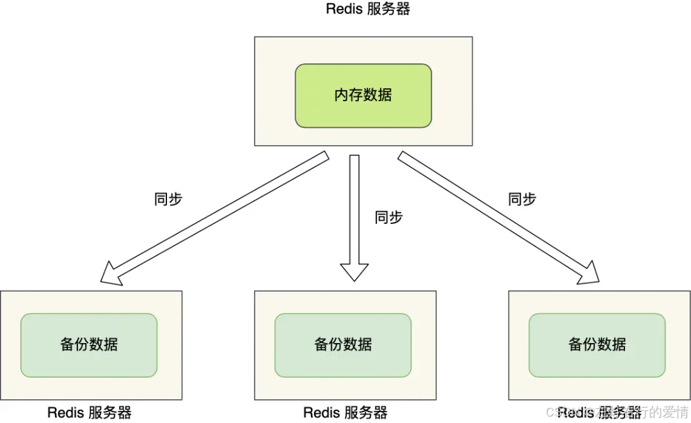
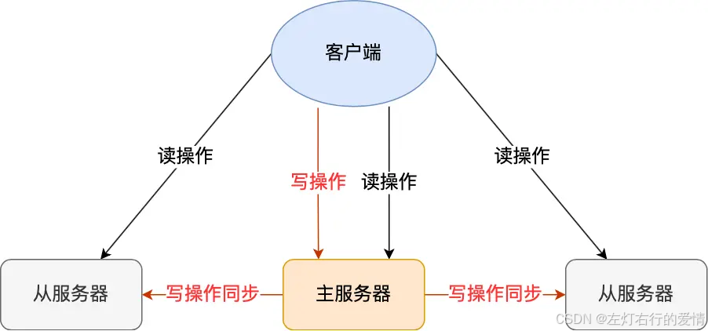
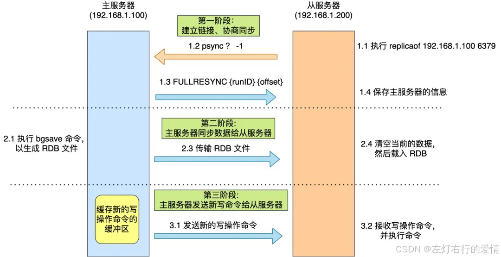
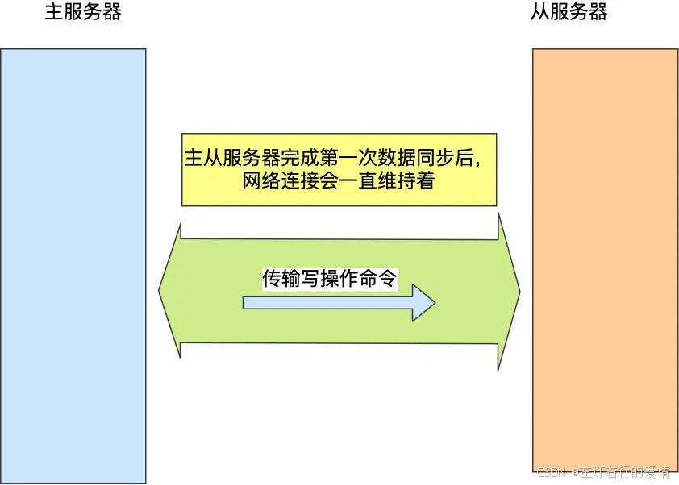
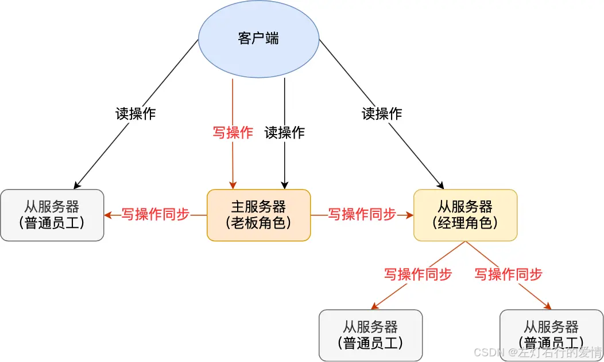
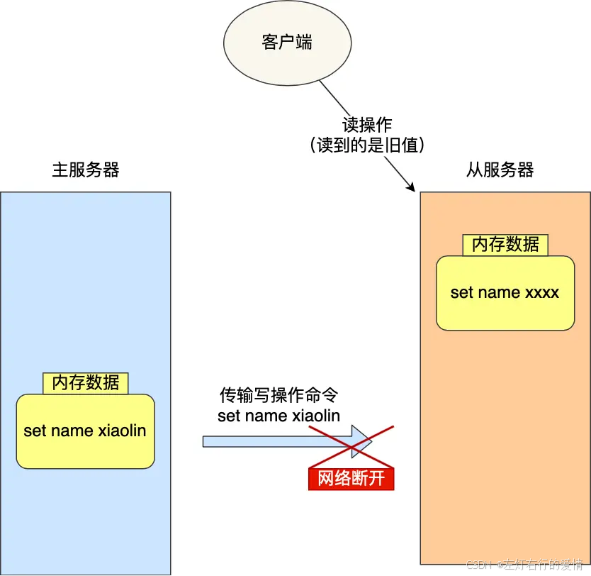
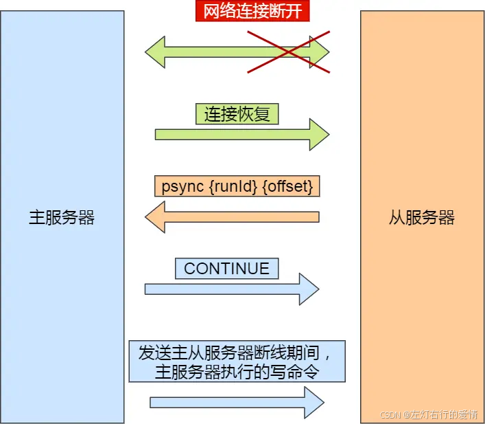
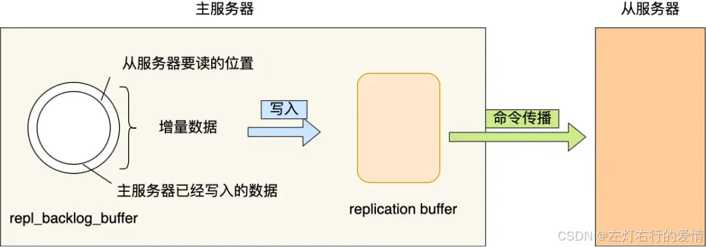
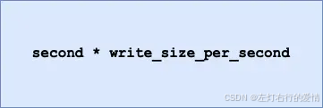

> 原文：[CSDN](https://blog.csdn.net/qq_45852626/article/details/145807906)（历史文章导入，当前状态为草稿）

### 前言

AOF 和 RDB，这两个持久化技术保证了即使在服务器重启的情况下也不会丢失数据（或少量损失）。  
 不过，由于数据都是
存储 
在一台服务器上，如果出事就完犊子了，比如：

* 如果服务器发生了宕机，由于数据恢复是需要点时间，那么这个期间是无法服务新的请求的；
* 如果这台服务器的硬盘出现了故障，可能数据就都丢失了。  
   避免这种单点故障，最好的办法是将数据备份到其他服务器上,让这些服务器也可以对外提供服务，这样即使有一台服务器出现了故障，其他服务器依然可以继续提供服务。  
     
   多台服务器要保存同一份数据，这里问题就来了。  
   这些服务器之间的数据如何保持一致性呢？数据的读写操作是否每台服务器都可以处理？  
   Redis 提供了主从复制模式，来避免上述的问题。

### 什么是主从复制

主从服务器之间采用的是「读写分离」的方式.  
 主服务器可以进行读写操作，当发生写操作时自动将写操作同步给从服务器，而从服务器一般是只读，并接受主服务器同步过来写操作命令，然后执行这条命令。  
   
 所有的数据修改只在主服务器上进行，然后将最新的数据同步给从服务器,这样就使得主从服务器的数据是一致的。  
 同步这两个字说的简单，但是这个同步过程并没有想象中那么简单，要考虑的事情不是一两个。

### 谁是将军

多台服务器之间要通过什么方式来确定谁是主服务器，或者谁是从服务器呢？  
 我们可以使用 replicaof（Redis 5.0 之前使用 slaveof）命令形成主服务器和从服务器的关系。  
 这样谁是将军就可以确定出来了.

```
# 服务器 B 执行这条命令
replicaof <服务器 A 的 IP 地址> <服务器 A 的 Redis 端口号>


```

接着，服务器 B 就会变成服务器 A 的「从服务器」，然后与主服务器进行第一次同步。  
 主从服务器间的第一次同步的过程可分为三个阶段：

* 第一阶段是建立链接、协商同步；
* 第二阶段是主服务器同步数据给从服务器；
* 第三阶段是主服务器发送新写操作命令给从服务器。  
   过程如下图:  
     
   接下来，我在具体介绍每一个阶段都做了什么。

#### 建立链接,协商同步.

执行了 replicaof 命令后，从服务器就会给主服务器发送 psync 命令，表示要进行数据同步。  
 psync 命令包含两个参数，分别是**主服务器的 runID** 和**复制进度 offset**。

* runID，每个 Redis 服务器在启动时都会自动生产一个随机的 ID 来唯一标识自己.当从服务器和主服务器第一次同步时，因为不知道主服务器的 run ID，所以将其设置为 “?”。
* offset，表示复制的进度，第一次同步时，其值为 -1。  
   主服务器收到 psync 命令后，会用 **FULLRESYNC** 作为响应命令返回给对方。  
   并且这个响应命令会带上两个参数：  
   主服务器的 runID 和主服务器目前的复制进度 offset。从服务器收到响应后，会记录这两个值。  
   FULLRESYNC 响应命令的意图是采用**全量复制**的方式，也就是主服务器会把所有的数据都同步给从服务器.  
   所以第一阶段的工作是为了全量复制做准备的.  
   那具体是怎么全量同步的呢?

#### 主服务器同步数据给从服务器

主服务器会执行bgsave命令来生成RDB文件,然后把文件发送给从服务器.  
 从服务器收到RDB文件后,会先清空当前的数据,然后载入RDB文件.  
 注意:主服务器生成RDB不会阻塞主线程,因为bgsave命令是产生了一个子进程来生成RDB文件的工作,是异步工作的,这样Redis依然可以正常处理命令.  
 但是,期间的写操作命令没有记录到刚刚的RDB文件中,这时主从服务器间的数据就不一致了.  
 那么为了保证主从服务器的数据一致性,主服务器在下面三个时间间隙中将受到的写操作命令,写入到replication buffer 缓冲区里:

* 主服务器生成RDB文件期间;
* 主服务器发送RDB文件给从服务器期间;
* 从服务器加载RDB文件期间.

#### 主服务器发送新写操作命令给从服务器

主服务器生成的RDB文件发送完,从服务器收到RDB文件后,丢弃所有旧数据,将RDB数据载入到内存.  
 完成RDB的载入后,会回复一个确认消息给主服务器.  
 主服务器将`replication buffer`缓冲区所记录的写操作命令发送给从服务器,从服务器执行来自主服务器`replication buffer` 缓冲区发来的命令,这时主从服务器的数据就一致了.

### 命令传播

主从服务器在完成第一次同步后，双方之间就会维护一个 TCP 连接。  
   
 后续主服务器可以通过这个连接继续将写操作命令传播给从服务器，然后从服务器执行该命令，使得与主服务器的
数据库 
状态相同。  
 而且这个连接是长连接的，目的是避免频繁的 TCP 连接和断开带来的性能开销。  
 上面的这个过程被称为基于长连接的命令传播，通过这种方式来保证第一次同步后的主从服务器的数据一致性。

### 分摊主服务器的压力

主从服务器第一次数据同步过程,主服务器会做两件耗时操作:

* 生成RDB文件
* 传输RDB文件  
   主服务器可以有多个从服务器的,如果从服务器数量非常多,而且都与主服务器进行全量同步,会带来两个问题:
* 通过bgsave命令来生成RDB文件,主服务器会忙于使用fork()创建子进程,如果主服务器的内存数据过大,执行fork()函数会阻塞主线程,从而使得Redis无法正常处理请求;
* 传输RDB文件会占用主服务器的网络贷款,会对主服务器响应的命令请求产生影响.  
   举个例子:  
   刚创业的公司，由于人不多，所以员工都归老板一个人管，但是随着公司的发展,人员的扩充，老板慢慢就无法承担全部员工的管理工作了。  
   要解决这个问题，老板就需要设立经理职位，由经理管理多名普通员工，然后老板只需要管理经理就好。  
   Redis 也是一样的，从服务器可以有自己的从服务器，我们可以把拥有从服务器的从服务器当作经理角色，它不仅可以接收主服务器的同步数据，自己也可以同时作为主服务器的形式将数据同步给从服务器，组织形式如下图：  
     
   通过这种方式，主服务器生成 RDB 和传输 RDB 的压力可以分摊到充当经理角色的从服务器。  
   那具体怎么做到的呢？  
   其实很简单，我们在「从服务器」上执行下面这条命令，使其作为目标服务器的从服务器：  
   `replicaof <目标服务器的IP> 6379`  
   此时如果目标服务器本身也是「从服务器」，那么该目标服务器就会成为「经理」的角色，不仅可以接受主服务器同步的数据，也会把数据同步给自己旗下的从服务器，从而减轻主服务器的负担。

### 增量复制

主从服务器在完成第一次同步后，就会基于长连接进行命令传播。  
 可是，网络总是不按套路出牌的嘛，说延迟就延迟，说断开就断开。这时从服务器的数据就没办法和主服务器保持一致了，
客户端 
就可能从「从服务器」读到旧的数据。  
   
 如果此时断开的网络，又恢复正常了，要怎么继续保证主从服务器的数据一致性呢？  
 在 Redis 2.8 之前，如果主从服务器在命令同步时出现了网络断开又恢复的情况，从服务器就会和主服务器重新进行一次全量复制，很明显这样的开销太大了，必须要改进一波。  
 所以，从 Redis 2.8 开始，网络断开又恢复后，从主从服务器会采用增量复制的方式继续同步，也就是只会把网络断开期间主服务器接收到的写操作命令，同步给从服务器。  
 网络恢复后的增量复制过程如下图:  
   
 主要是三个步骤:

* 服务器在恢复网络后,会发送 psync 命令给主服务器，此时的 psync 命令里的 offset 参数不是 -1；
* 主服务器收到该命令后，然后用 CONTINUE 响应命令告诉从服务器接下来采用增量复制的方式同步数据；
* 然后主服务将主从服务器 断线期间，所执行的写命令发送给从服务器，然后从服务器执行这些命令。  
   **主服务器怎么知道要将哪些增量数据发送给从服务器呢？**  
   答案藏在这两个东西里：
* `repl_backlog_buffer`，是一个「环形」缓冲区，用于主从服务器断连后，从中找到差异的数据；
* `replication offset`，标记上面那个缓冲区的同步进度，主从服务器都有各自的偏移量，主服务器使用 `master_repl_offset` 来记录自己「写」到的位置，从服务器使用 `slave_repl_offset` 来记录自己「读」到的位置。  
   那 repl\_backlog\_buffer 缓冲区是什么时候写入的呢？

在主服务器进行命令传播时，不仅会将写命令发送给从服务器，还会将写命令写入到 repl\_backlog\_buffer 缓冲区里，因此 这个缓冲区里会保存着最近传播的写命令。  
 网络断开后，当从服务器重新连上主服务器时，从服务器会通过 psync 命令将自己的复制偏移量slave\_repl\_offset 发送给主服务器，主服务器根据自己的 master\_repl\_offset 和 slave\_repl\_offset 之间的差距，然后来决定对从服务器执行哪种同步操作：

* 如果判断出从服务器要读取的数据还在 repl\_backlog\_buffer 缓冲区里，那么主服务器将采用增量同步的方式；
* 相反，如果判断出从服务器要读取的数据已经不存在 repl\_backlog\_buffer 缓冲区里，那么主服务器将采用全量同步的方式。

当主服务器在 repl\_backlog\_buffer 中找到主从服务器差异（增量）的数据后，就会将增量的数据写入到 replication buffer 缓冲区，这个缓冲区我们前面也提到过，它是
缓存 
将要传播给从服务器的命令。  
   
 repl\_backlog\_buffer 缓行缓冲区的默认大小是 1M，并且由于它是一个环形缓冲区，所以当缓冲区写满后，主服务器继续写入的话，就会覆盖之前的数据。  
 因此，当主服务器的写入速度远超于从服务器的读取速度，缓冲区的数据一下就会被覆盖。  
 那么在网络恢复时，如果从服务器想读的数据已经被覆盖了，主服务器就会采用全量同步，这个方式比增量同步的性能损耗要大很多。  
 为了避免在网络恢复时，主服务器频繁地使用全量同步的方式，我们应该调整下 repl\_backlog\_buffer 缓冲区大小，尽可能的大一些,减少出现从服务器要读取的数据被覆盖的概率，从而使得主服务器采用增量同步的方式。  
 那 repl\_backlog\_buffer 缓冲区具体要调整到多大呢？  
 repl\_backlog\_buffer 最小的大小可以根据这面这个公式估算。  
   
 我来解释下这个公式的意思：

* second 为从服务器断线后重新连接上主服务器所需的平均 时间(以秒计算)。
* write\_size\_per\_second 则是主服务器平均每秒产生的写命令数据量大小。  
   举个例子，如果主服务器平均每秒产生 1 MB 的写命令，而从服务器断线之后平均要 5 秒才能重新连接主服务器。  
   那么 repl\_backlog\_buffer 大小就不能低于 5 MB，否则新写地命令就会覆盖旧数据了。  
   当然，为了应对一些突发的情况，可以将 repl\_backlog\_buffer 的大小设置为此基础上的 2 倍，也就是 10 MB。  
   关于 repl\_backlog\_buffer 大小修改的方法，只需要修改配置文件里下面这个参数项的值就可以。  
   `repl-backlog-size 1mb`

### 主从复制中两个Buffer(replication buffer 、repl backlog buffer)有什么区别

replication buffer 、repl backlog buffer 区别如下：

* 出现的阶段不一样
  + repl backlog buffer :在增量复制阶段出现，一个主节点只分配一个 repl backlog buffer.
  + replication buffer : 在全量复制阶段和增量复制阶段都会出现,主节点会给每个新连接的从节点,分配一个 replication buffer；
* 这两个 Buffer 都有大小限制的，当缓冲区满了之后，发生的事情不一样
  + repl backlog buffer 满了: 因为是环形结构，会直接覆盖起始位置数据
  + replication buffer 满了: 会导致连接断开，删除缓存，从节点重新连接，重新开始全量复制
