> 原文：[CSDN](https://blog.csdn.net/qq_45852626/article/details/143355397)（历史文章导入，当前状态为草稿）

#### Redis-常见数据类型和应用
### 前言

Redis中实际操作主要有6个对象,它们的底层会依赖一些数据结构(字符串,跳表,哈希表等),不同对象也有可能依赖相同数据结构,文章以对象为主,再介绍相关联的数据结构. 文章以实践为第一原理,结合《Redis的设计与实现》理论和n个博客构成Redis系列文章.

### 什么是对象

Redis是key-value存储的,key和value在Redis中都被抽象为**对象**!!!  
 key只能为String对象  
 Value支持丰富的对象种类,包括(String,List,Set,Hash等).  
 **Redis并没有直接使用这些数据结构来实现键值对数据库**  
 而是基于这些数据结构构建了一个对象系统.每种对象都用到至少一种数据结构.  
 使用对象的好处:

1. **判断命令范围**—Redis可以在执行命令前,根据对象类型来判断这个对象是否可以执行给定的命令.
2. **优化使用效率**—可以针对不同使用场景,为对象设置多种不同的数据结构实现,从而优化对象在不同场景下的使用效率.
3. **垃圾回收**—基于引用计数技术的内存回收机制,当程序不再使用某个对象的时候,这个对象所占用的内存就会被自动释放.
4. **对象共享机制**—通过引用计数技术实现对象共享机制,通过让那个多个数据库共享一个对象来节约内存.
5. **记录访问时间使用信息**—对象带有时间记录信息,该信息可以用于计算数据库键值空转时长,服务器如果启用maxmemory,空转时间大的键可能被服务器优先删除.

### Redis Object

对象数据结构定义如下:

```
//from Redis 5.0.10
#define LRU_BITS 24
typedef struct redisObject {
    //指哪种Redis对象
    unsigned type:4;
    //哪种底层编码
    unsigned encoding:4;
    //记录对象访问信息，用于内存淘汰
    unsigned lru:LRU_BITS; /* LRU time (relative to global lru_clock) or
                            * LFU data (least significant 8 bits frequency
    //引用计数，描述有多少个指针，指向该对象                        * and most significant 16 bits access time). */
    int refcount;
    //内容指针，指向实际内容
    void *ptr;
} robj;


```

### String对象

String代表字符串,是Redis中最基本的数据对象,最大为512MB.

#### 常用操作

* 创建:产生一个字符串对象数据- SET,SETNX.
* 查询: 查询字符串对象数据- 单个(GET),多个(MGET)
* 更新: SET也可以用来更新
* 删除: 针对String对象本身的销毁-DEL命令

##### 写操作

语法: SET key value  
 功能: 设置一个key的值为特定的value,成功则返回OK.

```
set annimal dog


```

关键参数:

* EX second : 设置键的过期时间是多少秒
* PX millisecond : 设置键的过期时间是多少秒
* NX : 只在键不存在时,才对键进行操作
* XX : 只有键存在时,才对键进行操作

语法 : SETNX  
 功能: 用于指定键不存在时,对键设置指定的值.  
 返回值0 - key存在不操作  
 返回值1- 操作成功

##### 读操作

语法: GET key  
 功能: 查询某个key,存在就返回对应的value,如果不存在返回nil

```
get annimal
"dog"

get sdadjlk
(nil)


```

##### 删除操作

摸鱼写

#### 底层实现

String有三种编码方式: INT,EMBSTR,RAW.  
 选择编码存储的条件:

* INT编码  
   存一个整形,可以用long表示的整数就用这种编码存储
* EMBSTR编码  
   字符串小于等于阈值字节时使用
* RAW编码  
   字符串大于等于阈值字节时使用

##### 源码解释

这个阈值在源码中表示为

```
//object.c 文件下
#define OBJ_ENCODING_EMBSTR_SIZE_LIMIT 44 //当前版本是44字节
robj *createStringObject(const char *ptr, size_t len) {
    if (len <= OBJ_ENCODING_EMBSTR_SIZE_LIMIT)
        return createEmbeddedStringObject(ptr,len);
    else
        return createRawStringObject(ptr,len);
}


```

embstr和raw都是redisObject 和 sds 两个结构组成的.  
 差异在于:  
 embstr下redisObject和sds是连续的内存.而raw编码下的内存是分开的  
 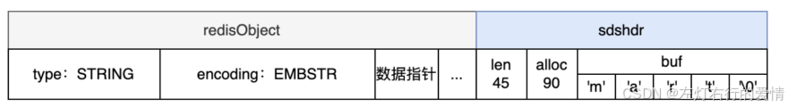  
 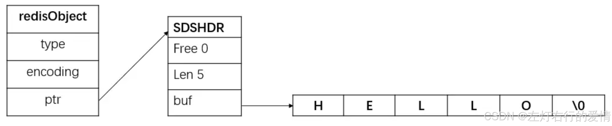

###### embstr和raw 比较

embstr的优点:

1. 会通过一次**内存分配函数**来分配一块连续的内存空间来保存redisObject和SDS
2. 因为数据都保存在一块连续的内存里,可以更好的利用CPU缓存提升性能.  
    缺点:
3. 如果重新分配空间,整体都需要再分配,所以embstr设计为只读.
4. 任何写操作之后的embstr都会变成raw.  
    理念是: 发生过修改的字符串通常会认为是易变的.

raw  
 优点: 存储数据内容很大  
 缺点:  
 会调用两次内存分配函数,一块用于redisObject,另一块用来包含SDShdr

##### 什么是SDS

c语言中字符串都是用一个`\0`结尾的char数组表示.  
 但是对于某些应用来说不一定好用:

* 每次计算字符串长度复杂度为O(N);
* 对字符串追加,需要重新分配内存(数组扩容)
* 非二进制安全(传输数据中被篡改了)

在Redis内部,自付出追加和长度计算都很常见,这两个简单的操作不应该称为性能瓶颈.  
 所以Redis封装了SDS的字符串结构.

Redis中SDS分为 sdshdr8, sdshdr16, sdshdr32, sdshdr64.它们字段属性都一样,区别在于应对不同大小的字符串,以 sdshdr8举例:

```
struct __attribute__ ((__packed__)) sdshdr8 {
    //使用了多少
    uint8_t len; /* used */
    //一共分配多少内存
    uint8_t alloc; /* excluding the header and null terminator */
    //alloc-len : 预留空间大小
    //标记哪个分类,当前为SDS_TYPE_8
    unsigned char flags; /* 3 lsb of type, 5 unused bits */
    char buf[];
};


```

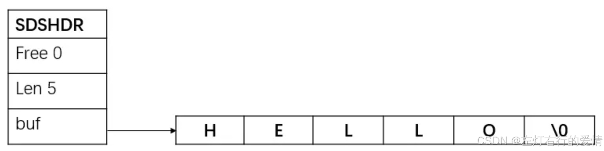  
 所以我们可以看出SDS是如何对症下药解决问题的:

1. 增加长度字段len,快速返回长度
2. 增加空余空间(alloc-len),为后续追加数据留余地;
3. 不再用`\0`作为判断标准,二进制安全  
    SDS会预留空间,那么预留空间大小的规则如下:

* len<1M  
   alloc = 2\*len ,即预留len大小的空间
* len>1M  
   alloc是1M+len,即预留1M大小的空间.  
   简单来说预留空间为(len,1M)

#### 使用场景

可以用来存字节数据,文本数据,序列化后的对象数据等.  
 只要是字符串都可以往里面存的.  
 具体的例子:

1. 缓存场景: value存Json字符串信息,比如:`SET user:1 '{"name":"xiaolin", "age":18}'`
2. 计数场景: Redis处理命令是单线程,所以执行命令的过程是原子的.因此String数据类型适合计数场景(计算访问次数,点赞,转发,库存数量等).比如:`MSET user:1:name wang user:1:age 18 user:2:name li user:2:age 20`

##### 常规计数

Redis 处理命令是单线程，所以执行命令的过程是原子的.  
 因此 String 数据类型适合计数场景.

##### 分布式锁

SET 命令有个 NX 参数可以实现「key不存在才插入」,可以用它来实现分布式锁:

* 如果 key 不存在，则显示插入成功，可以用来表示加锁成功;
* 如果 key 存在，则会显示插入失败, 可以用来表示加锁失败;

一般而言，还会对分布式锁加上过期时间，分布式锁的命令如下:

```
SET lock_key unique_value NX PX 10000


```

* lock\_key 就是 key 键
* unique\_value 是客户端生成的唯一的标识
* NX 代表只在 lock\_key 不存在时，才对 lock\_key 进行设置操作
* PX 10000 表示设置 lock\_key 的过期时间为 10s, 这是为了避免客户端发生异常而无法释放锁

解锁的过程就是将 lock\_key 键删除，但不能乱删.

> 注意: 要保证执行操作的客户端就是加锁的客户端.  
>  解锁的时候,我们要先判断锁的 unique\_value 是否为加锁客户端,是的话，才将 lock\_key 键删除  
>  所以解锁是有两个操作的 — 需要 Lua 脚本来保证解锁的原子性

```
// 释放锁时，先比较 unique_value 是否相等，避免锁的误释放
if redis.call("get",KEYS[1]) == ARGV[1] then
  return redis.call("del",KEYS[1])
  else
    return 0
end


```

### List对象

Redis List 是一组连接起来的字符串集合.  
 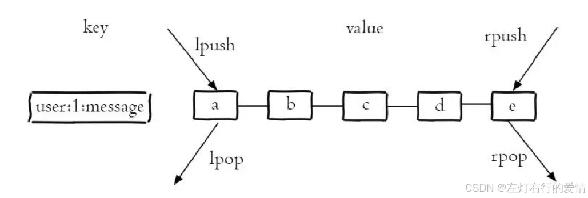

#### 元素限制

目前最大个数是2的32次方-1(新版本为2的64次方-1)

#### 常用操作

##### 创建

产生一个List对象,一般用LPUSH,RPUSH分别对应从左侧进队列和右侧进队列

* LPUSH  
   语法: LPUSH key value  
   功能: 从头部增加元素,返回值为List中元素的总数.

```
LPUSH animal dog cat 
2


```

* RPUSH  
   语法: RPUSH key value  
   功能: 从尾部增加元素,返回值为List中元素的总数

```
RPUSH animal dog cat
2


```

##### 更新

* LPOP  
   语法: LPOP key  
   功能: 移除并获取列表的第一个元素

```
LPOP animal


```

* RPOP  
   语法: LPOP key  
   功能: 移除并获取列表的最后一个元素

```
RPOP animal


```

* LREM  
   语法: LREM key count value  
   功能: 移除值等于value的元素.  
   count=0:移除所有等于value的元素  
   count>0:从左到右移除count个  
   count<0:从右到左移除count个.  
   返回值为被移除元素的数量.

##### 删除

#### 编码方式

List有两种编码方式,一种为ZIPLIST(压缩列表),另一种为LINKEDLIST(双向链表).

##### ZIPLIST

当满足下面条件时用ZIPLIST:

1. 列表对象保存的每个值长度<64字节
2. 列表对象元素<512个

ZIPList编码的列表对象使用压缩列表作为底层实现,每个压缩节点(entry)保存了一个列表元素.  
 内存排列很紧凑,可以有效节约内存空间.  
 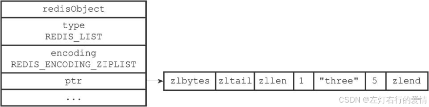

##### LINKEDLIST

如果不满足上面的条件,则使用LINKEDLIST编码.  
 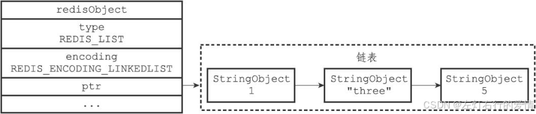  
 可以看到,以链表的形式连接在一起,实际上删除更为灵活,但是内存不足ZIPLIST紧凑.  
 所以只有在列表个数或节点数据长度比较大的时候,才会使用LINKEDLIST编码,以加快处理性能,一定程度上牺牲了内存.

##### QUICKLIST

如果节点非常多,LINKEDLIST链表的节点就很多,会占用不少内存.  
 后面版本引进了QUICKLIST,属于ZIPLIST和LINKEDLIST的结合体.  
 它将linkedLIst按段切分,每一段使用zipLIst来紧凑存储,多个zipLIst使用双向指针连接起来.  
 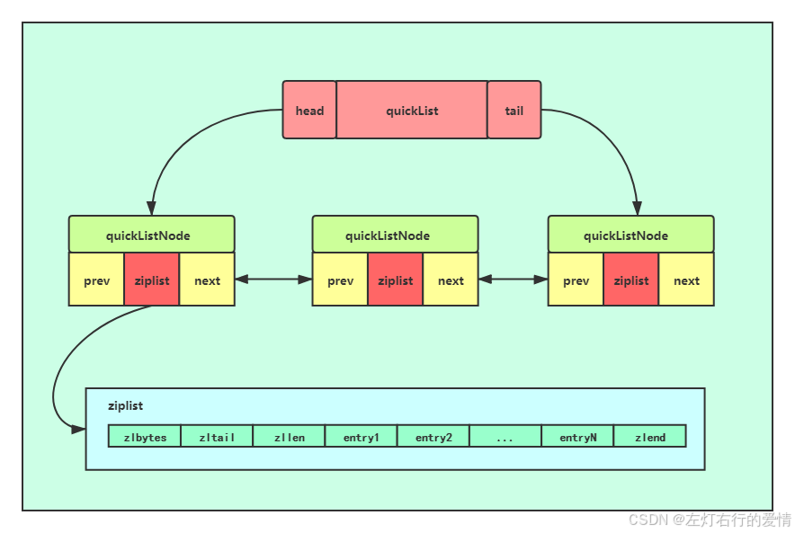

##### LISTPACK编码

ZIPLIST本身存在连锁更新的问题,所以Redis7.0之后,使用LISTPACK的编码模式取代了ZIPLIST,而他们其实本质都是一种压缩的列表,所以其实可以统一叫做压缩列表.

#### 压缩列表

##### 什么是压缩列表

压缩列表指排列紧凑的列表  
 在Redis中有两种编码方式,一种是ZIPLIST,平常说的压缩列表其实一般就是指ZIPLIST,  
 另一种LISTPACK,LISTPACK在Redis7.0后完全替换了ZIPLIST,可以说是进阶版本.

##### 压缩列表的作用

压缩列表是LIst的底层数据结构,提供紧凑型的数据存储方式,能节约内存,小数据量的时候遍历访问性能好(连续+缓存命中率好)  
 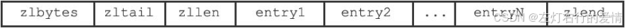

1. zlbytes: ZIPLIST一共占多少字节数,这个包含zlbytes本身占据的字节.
2. zltail: ZIPLIST尾巴节点相对于ZIPLIST的开头(起始指针)便宜的字节数.通过这个字段可以快速定位到尾部节点.
3. zllen: 表示有多少个数据节点
4. entry: 表示压缩列表的数据节点
5. zlend: 一个特殊的entry节点,表示ZIPLIST的结束.

##### ZIPLIST节点的数据结构

  
 previous\_entry\_length是记录前一个节点长度

1. prevlen: 表示上一个节点的数据长度.如果前一个节点长度<254字节,那么prevlen需要一字节来保存长度值;如果前一节点长度>=254,那么prevlen需要用5字节空间来保存长度值.
2. encoding: 编码类型
3. content: 实际数据

* encoding说明  
   encoding是一个整形数据,其二进制编码是由内容数据的类型和内容数据的字节长度两部分组成.

#### 应用场景

##### 消息队列

消息队列存取消息必须要满足三个需求:

* 消息保存
* 保证消息可靠性
* 处理重复的消息  
   Redis的List和Stream两种数据结构都可以满足这三个需求,这里我们介绍List如何满足.

###### 满足消息保存

List 本身就是按先进先出的顺序对数据进行存取的,如果使用 List 作为消息队列保存消息的话,就已经能满足消息保序的需求了。  
 List 可以使用 LPUSH + RPOP （或者反过来，RPUSH+LPOP）命令实现消息队列.  
 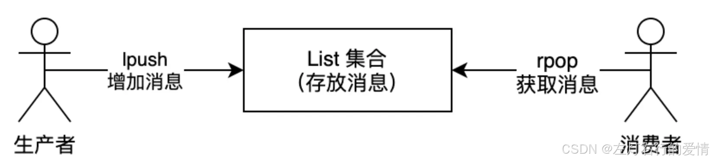

* 生产者使用 LPUSH key value[value…] 将消息插入到队列的头部,如果 key 不存在则会创建一个空的队列再插入消息。
* 消费者使用 RPOP key 依次读取队列的消息，先进先出.  
   但是这样有个风险:在写入数据时,List 并不会主动地通知消费者有新消息写入!  
   如果消费者想要及时处理消息，就需要在程序中不停地调用 RPOP 命令（比如使用一个while(1)循环）.—如果有新消息写入，RPOP命令就会返回结果，否则，RPOP命令返回空值，再继续循环.  
   那这样的话,就算没有消息写入List,消费者也要不停调用RPOP命令.  
   很显然导致消费者CPU一直消耗执行RPOP命令,带来不必要损失.

还好,Redis提供了BRPOP命令,也称为阻塞式读取.  
 **客户端在没有读到队列数据时，自动阻塞，直到有新的数据写入队列，再开始读取新数据.**

###### 如何处理重复的消息

要实现重复消息的判断,需要2个方面的要求:

* 每个消息都有一个全局ID
* 消费者要记录已经处理过的消息的 ID。当收到一条消息后，消费者程序就可以对比收到的消息 ID 和记录的已处理过的消息 ID.

> 注意:**List 并不会为每个消息生成 ID 号，所以我们需要自行为每个消息生成一个全局唯一ID**  
>  生成之后，我们在用 LPUSH 命令把消息插入 List 时，需要在消息中包含这个全局唯一 ID。  
>  举例: LPUSH mq “111000102:stock:99” -全局 ID 为 111000102、库存量为 99 的消息插入了消息队列

###### 如何保证消息可靠性

消费者从 List 中读取一条消息后,List 就不会再留存这条消息了。  
 如果消费者程序在处理消息的过程出现了故障或宕机，就会导致消息没有处理完成,那么，消费者程序再次启动后，就没法再次从 List 中读取消息了。  
 为了解决这个问题:  
 List 类型提供了 BRPOPLPUSH 命令.  
 它的作用是:让消费者程序从一个 List 中读取消息，同时，Redis 会把这个消息再插入到另一个 List（可以叫作备份 List）留存.  
 如果消费者程序读了消息但没能正常处理，等它重启后，就可以从备份 List 中重新读取消息并进行处理了。

###### List 作为消息队列有什么缺陷

List 不支持多个消费者消费同一条消息，因为一旦消费者拉取一条消息后,这条消息就从 List 中删除了，无法被其它消费者再次消费。  
 要实现一条消息可以被多个消费者消费，那么就要将多个消费者组成一个消费组,使得多个消费者可以消费同一条消息，但是 List 类型并不支持消费组的实现。

###### 总结一下

消息保序：使用 LPUSH + RPOP；  
 阻塞读取：使用 BRPOP；  
 重复消息处理：生产者自行实现全局唯一 ID；  
 消息的可靠性：使用 BRPOPLPUSH

### Set

Redis的Set是一个不重复,无序的字符串集合.  
 一个集合最多可以存储 2^32-1 个元素。  
 概念和数学中个的集合基本类似，可以交集，并集，差集等.  
 所以 Set 类型除了支持集合内的增删改查，同时还支持多个集合取交集、并集、差集

##### 常用操作

###### 创建

SADD: 创建产生一个Set对象  
 语法: SADD key member[member…]  
 功能: 添加元素,返回值为成功添加了几个元素

###### 查询

###### SISMEMBER

语法: SISMEMBER key member[member…]  
 功能: 查询元素是否存在

###### SCARD

语法: SCARD key  
 功能: 查询集合元素个数

###### SMEMBERS

语法: SMEMBERS key  
 功能: 查询集合的所有元素

###### SSCAN:查询集合元素数据

语法: SSCAN key cursor[MATCH pattern][COUNT count]  
 功能: 查询集合元素,通过指定游标进行查询,可以指定个数,默认为10

###### SINTER

语法: SINTER key [key…]  
 功能: 返回在第一个集合出现,同时也在后面所有集合出现的元素

###### SUNION

语法: SUNION key [key…]  
 功能: 返回所有集合的并集,集合个数大于等于2

###### SDIFF

语法: SDIFF key [key…]  
 功能: 返回第一个集合有,且后续集合中不存在的元素,集合个数大于等于2.

###### 更新

SADD:增加元素  
 SREM:删除元素  
 语法: SREM key member[member…]  
 功能: 删除元素,返回值为成功删除了几个元素

###### 删除

DEL:删除一个Set对象

##### 底层实现

###### 编码方式

Redis处于性能和内存的综合考虑,支持两种编码模式

* 使用INTSET编码,如果集合元素都是整数,且元素数量不超过512个 -  
   好处是排列比较紧凑,内存占用少,但是查询的时候需要二分查找.
* 如果不满足INTSET条件,就需要用HASHTABLE,能在O(1)的时间就找到一个元素是否存在.

#### 适用场景

集合的主要几个特性，无序、不可重复、支持并交差等操作。  
 那么可以看出比较适合以下特性:

* 用来数据去重和保障数据的唯一性
* 用来统计多个集合的交集、错集和并集  
   但是有潜在风险:  
   **Set 的差集、并集和交集的计算复杂度较高，在数据量较大的情况下，如果直接执行这些计算，会导致 Redis 实例阻塞.**

在主从集群中，为了避免主库因为 Set 做聚合计算（交集、差集、并集）时导致主库被阻塞,我们可以选择一个从库完成聚合统计，或者把数据返回给客户端，由客户端来完成聚合统计.

##### 点赞

Set 类型可以保证一个用户只能点一个赞，这里举例子一个场景,key 是文章id，value 是用户id。  
 点赞:`SADD article:1 uid:1`  
 取消点赞:`SREM article:1 uid:1`  
 获取所有点赞用户:`SMEMBERS article:1`  
 获取对文章1点赞用户数量: `SCARD article:1`  
 判断用户1对文章1是否点赞了:`SISMEMBER article:1 uid:1`

##### 共同关注

Set 类型支持交集运算，所以可以用来计算共同关注的好友、公众号等.  
 key 可以是用户id，value 则是已关注的公众号的id。  
 uid:1 用户关注公众号 id 为 5、6、7、8、9;  
 uid:2 用户关注公众号 id 为 7、8、9、10、11;  
 获取共同关注:

```
SINTER uid:1 uid:2
1) "7"
2) "8"
3) "9"


```

给用户2推荐用户1关注的公众号

```
SDIFF uid:1 uid:2
1) "5"
2) "6"


```

验证某个公众号是否同时被用户1或用户2关注

```
> SISMEMBER uid:1 5
> (integer) 1 # 返回0，说明关注了
> SISMEMBER uid:2 5
> (integer) 0 # 返回0，说明没关注


```

##### 抽奖活动

存储某活动中中奖的用户名 ，Set 类型因为有去重功能，可以保证同一个用户不会中奖两次。  
 key为抽奖活动名，value为员工名称，把所有员工名称放入抽奖箱

```
key为抽奖活动名，value为员工名称，把所有员工名称放入抽奖箱 
(integer) 5


```

如果允许重复中奖，可以使用 SRANDMEMBER 命令

```
# 抽取 1 个一等奖：
> SRANDMEMBER lucky 1
> 1) "Tom"
# 抽取 2 个二等奖：
> SRANDMEMBER lucky 2
> 1) "Mark"
> 2) "Jerry"
> # 抽取 3 个三等奖：
> SRANDMEMBER lucky 3
> 1) "Sary"
2) "Tom"
3) "Jerry"


```

如果不允许重复中奖,使用SPOP命令

```
# 抽取 1 个一等奖：
> SPOP lucky 1
> 1) "Tom"
# 抽取 2 个二等奖：
> SPOP lucky 2
> 1) "Mark"
> 2) "Jerry"
> # 抽取 3 个三等奖：
> SPOP lucky 3
> 1) "Sary"
2) "Sean"
3) "Jerry"


```

### Zset

相比于 Set 类型多了一个排序属性 score（分值）,对于有序集合 ZSet 来说，每个存储元素相当于有两个值组成的，一个是有序集合的元素值，一个是排序值.

有序集合保留了集合不能有重复成员的特性（分值可以重复），但不同的是，有序集合中的元素可以排序。  
 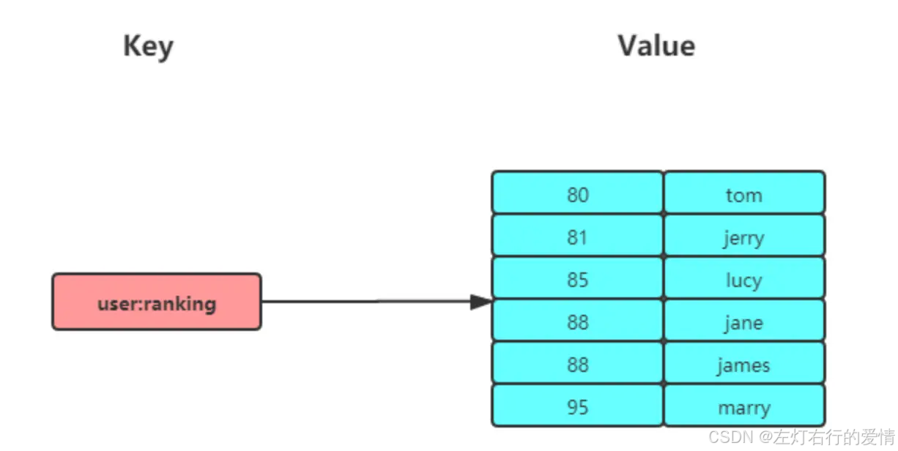

##### 内部实现

Zset 类型的底层数据结构是由压缩列表或跳表实现的:

* 压缩列表: 有序集合的元素个数小于 128 个，并且每个元素的值小于 64 字节.
* 不满足就是跳表.  
   **在 Redis 7.0 中，压缩列表数据结构已经废弃了，交由 listpack 数据结构来实现了**

#### 应用场景

Zset 类型（Sorted Set，有序集合） 可以根据元素的权重来排序，我们可以自己来决定每个元素的权重值。  
 比如说，我们可以根据元素插入 Sorted Set 的时间确定权重值，先插入的元素权重小，后插入的元素权重大。  
 在面对需要展示最新列表、排行榜等场景时，如果数据更新频繁或者需要分页显示,可以优先考虑使用 Sorted Set。

###### 排行榜

有序集合比较典型的使用场景就是排行榜。例如学生成绩的排名榜、游戏积分排行榜、视频播放排名、电商系统中商品的销量排名等。  
 假设我们有一个学生成绩的排行榜，每个学生的成绩会被存储在 Redis 的有序集合中。学生的姓名是集合的成员，成绩（分数）是他们的分数。

* 添加成绩:

```
ZADD student_scores 90 "Alice"
ZADD student_scores 85 "Bob"
ZADD student_scores 78 "Charlie"
ZADD student_scores 92 "David"
ZADD student_scores 88 "Eva"


```

* 查看排行榜

```
ZRANGE student_scores 0 -1 WITHSCORES

结果
1) "Charlie"  78
2) "Bob"      85
3) "Eva"      88
4) "Alice"    90
5) "David"    92


```

* 按分数范围查询

```
ZRANGEBYSCORE student_scores 80 90 WITHSCORES

结果
1) "Bob" 85
2) "Eva" 88
3) "Alice" 90


```

* 查看某个人排名 - Alice

```
ZRANK student_scores "Alice"
(integer) 3


```

* 更新Bob成绩

```
ZINCRBY student_scores 5 "Bob"


```

* 删除Charlie成绩

```
ZREM student_scores "Charlie"


```

### Hash

Hash 是一个键值对（key - value）集合，其中 value 的形式如:`value=[{field1，value1}，...{fieldN，valueN}]`.  
 Hash 特别适合用于存储对象  
 Hash 与 String 对象的区别如下图所示:  
 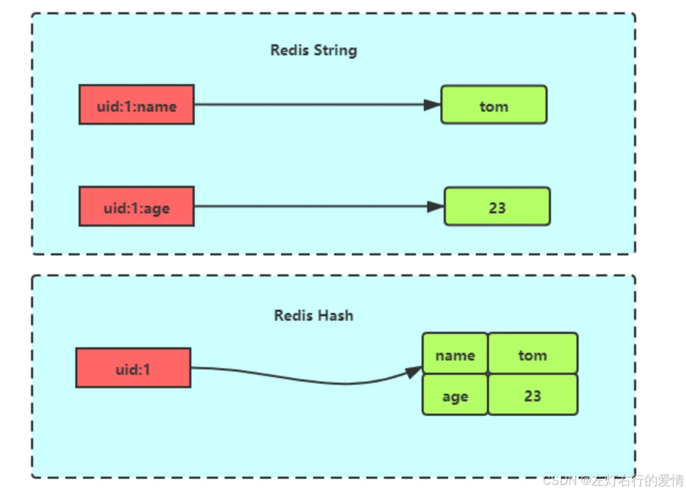

#### 内部实现

Hash 类型的底层数据结构是由压缩列表或哈希表实现的:

* 压缩列表  
   哈希类型元素个数小于 512 个,每个值都小于 64 字节
* 哈希表  
   不满足压缩列表条件就是哈希表  
   **在 Redis 7.0 中，压缩列表数据结构已经废弃了，交由 listpack 数据结构来实现了**

#### 应用场景

Hash 类型的 （key，field， value） 的结构与对象的（对象id， 属性， 值）的结构相似，也可以用来存储对象。  
 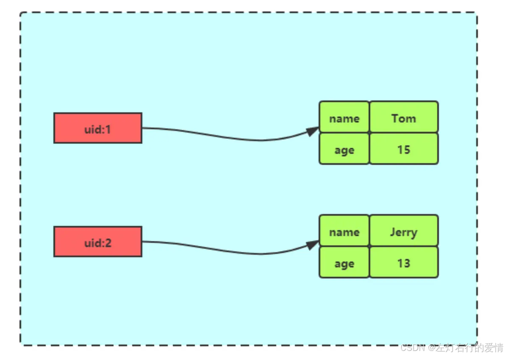  
 String + Json也是存储对象的一种方式，那么存储对象时，到底用 String + json 还是用 Hash 呢？  
 一般对象用 String + Json 存储，对象中某些频繁变化的属性可以考虑抽出来用 Hash 类型存储。

##### 购物车

以用户 id 为 key，商品 id 为 field，商品数量为 value,恰好构成了购物车的3个要素，如下图所示。  
 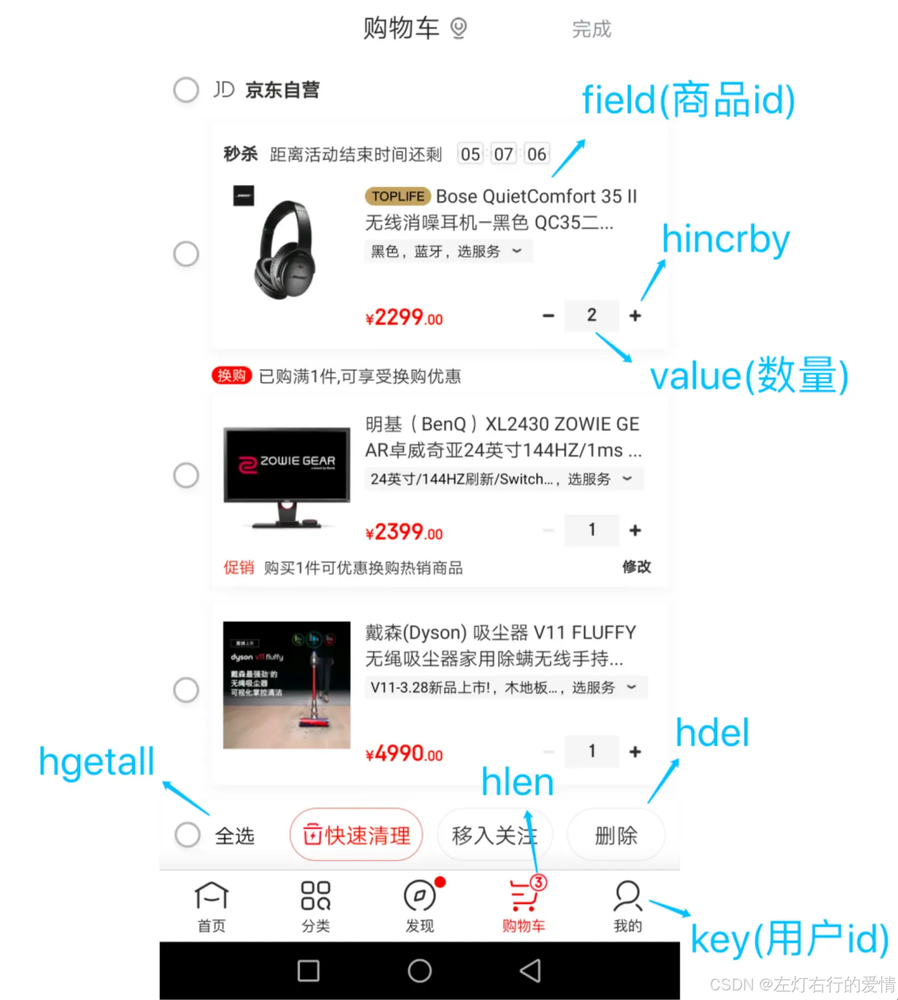  
 涉及的命令如下：

* 添加商品：`HSET cart:{用户id} {商品id} 1`
* 添加数量：`HINCRBY cart:{用户id} {商品id} 1`
* 商品总数：`HLEN cart:{用户id}`
* 删除商品：`HDEL cart:{用户id} {商品id}`
* 获取购物车所有商品：`HGETALL cart:{用户id}`  
   当前仅仅是将商品ID存储到了Redis 中,在回显商品具体信息的时候,还需要拿着商品 id 查询一次数据库，获取完整的商品的信息

### BitMap

Bitmap，即位图，是一串连续的二进制数组（0和1），可以通过偏移量（offset）定位元素。  
 BitMap通过最小的单位bit来进行0|1的设置，表示某个元素的值或者状态，时间复杂度为O(1)。  
 它进行储存将非常节省空间，特别适合一些数据量大且使用二值统计的场景。  
 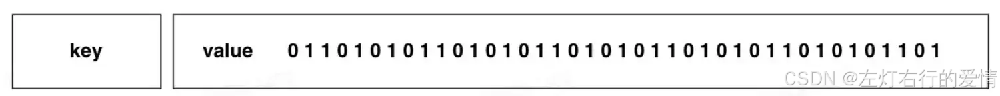

#### 内部实现

Bitmap 本身是用 String 类型作为底层数据结构实现的一种统计二值状态的数据类型.  
 Redis 就把字节数组的每个 bit 位利用起来，用来表示一个元素的二值状态，你可以把 Bitmap 看作是一个 bit 数组。

#### 应用场景

非常适合二值状态统计的场景，这里的二值状态就是指集合元素的取值就只有 0 和 1 两种,在记录海量数据时，Bitmap 能够有效地节省内存空间.

##### 签到打卡

我们只用记录签到（1）或未签到（0），所以它就是非常典型的二值状态.  
 签到统计时，每个用户一天的签到用 1 个 bit 位就能表示，一个月（假设是 31 天）的签到情况用 31 个 bit 位就可以，而一年的签到也只需要用 365 个 bit 位，根本不用太复杂的集合类型。  
 假设我们要统计 ID 100 的用户在 2022 年 6 月份的签到情况.  
 记录用户当日签到  
 `SETBIT uid:sign:100:202206 2 1`  
 检查当日是否有签到  
 `GETBIT uid:sign:100:202206 2`   
 统计该用户在 6 月份的签到次数  
 `BITCOUNT uid:sign:100:202206`  
 统计这个月首次打卡时间  
 Redis 提供了 BITPOS key bitValue [start] [end]指令,返回数据表示 Bitmap 中第一个值为 bitValue 的 offset 位置。  
 `BITPOS uid:sign:100:202206 1`

##### 判断用户登录状态

Bitmap 提供了 GETBIT、SETBIT 操作,通过一个偏移值 offset 对 bit 数组的 offset 位置的 bit 位进行读写操作，需要注意的是 offset 从 0 开始。  
 只需要一个 key = login\_status 表示存储用户登陆状态集合数据,将用户 ID 作为 offset，在线就设置为 1，下线设置 0。  
 通过 GETBIT判断对应的用户是否在线。 5000 万用户只需要 6 MB 的空间.  
 假如我们要判断 ID = 10086 的用户的登陆情况：  
 表示用户登录:`SETBIT login_status 10086 1`  
 检查用户是否登录:`GETBIT login_status 10086`  
 用户登出:`SETBIT login_status 10086 0`

##### 连续签到用户总数

如何统计出这连续 7 天连续打卡用户总数呢?  
 我们把每天的日期作为 Bitmap 的 key，userId 作为 offset，若是打卡则将 offset 位置的 bit 设置成 1。  
 key 对应的集合的每个 bit 位的数据则是一个用户在该日期的打卡记录.  
 一共有 7 个这样的 Bitmap，如果我们能对这 7 个 Bitmap的对应的 bit 位做 『与』运算。  
 同样的 UserID offset 都是一样的，当一个 userID 在 7 个 Bitmap 对应对应的 offset 位置的 bit = 1 就说明该用户 7 天连续打卡。  
 结果保存到一个新 Bitmap 中，我们再通过 BITCOUNT 统计 bit = 1 的个数便得到了连续打卡 7 天的用户总数了。  
 Redis 提供了 BITOP operation destkey key [key …]这个指令用于对一个或者多个 key 的 Bitmap 进行位元操作。

* operation 可以是 and、OR、NOT、XOR。当 BITOP 处理不同长度的字符串时，较短的那个字符串所缺少的部分会被看作 0.空的 key 也被看作是包含 0 的字符串序列。

那如果要统计连续3天连续打卡的用户呢?  
 将三个 bitmap 进行 AND 操作，并将结果保存到 destmap 中,接着对 destmap 执行 BITCOUNT 统计，如下命令:

```
# 与操作
BITOP AND destmap bitmap:01 bitmap:02 bitmap:03
# 统计 bit 位 =  1 的个数
BITCOUNT destmap


```

即使一天产生一个亿的数据，Bitmap 占用的内存也不大，大约占 12 MB 的内存（10^8/8/1024/1024），7 天的 Bitmap 的内存开销约为 84 MB。

### HyperLogLog

Redis HyperLogLog 是 Redis 2.8.9 版本新增的数据类型，是一种用于「统计基数」的数据集合类型，基数统计就是指统计一个集合中不重复的元素个数。  
 HyperLogLog 是统计规则是基于概率完成的，不是非常准确，标准误算率是 0.81%。  
 简单来说 HyperLogLog **提供不精确的去重计数**.  
 那既然计数不精确,那有优点吧.  
 优点是在输入元素的数量或者体积非常非常大时,计算基数所需的内存空间总是固定的、并且是很小的。  
 每个 HyperLogLog 键只需要花费 12 KB 内存，就可以计算接近 2^64 个不同元素的基数，非常节省空间!!!

#### 常见命令

命令很少就3个:

```
# 添加指定元素到 HyperLogLog 中
PFADD key element [element ...]

# 返回给定 HyperLogLog 的基数估算值。
PFCOUNT key [key ...]

# 将多个 HyperLogLog 合并为一个 HyperLogLog
PFMERGE destkey sourcekey [sourcekey ...]


```

#### 应用场景

##### 百万级网页UV计数

统计 UV 时，你可以用 PFADD 命令把访问页面的每个用户都添加到 HyperLogLog 中。  
 `PFADD page1:uv user1 user2 user3 user4 user5`  
 用 PFCOUNT 命令直接获得 page1 的 UV 值了  
 `PFCOUNT page1:uv`  
 标准误算率是 0.81%,你使用 HyperLogLog 统计的 UV 是 100 万,但实际的 UV 可能是 101 万.

### GEO

主要用于存储地理位置信息，并对存储的信息进行操作。  
 在日常生活中，我们越来越依赖搜索“附近的餐馆”、在打车软件上叫车，这些都离不开基于位置信息服务（Location-Based Service，LBS）的应用。  
 LBS 应用访问的数据是和人或物关联的一组经纬度信息，而且要能查询相邻的经纬度范围，GEO 就非常适合应用在 LBS 服务的场景中。

#### 内部实现

GEO 本身并没有设计新的底层数据结构，而是直接使用了 Sorted Set 集合类型。  
 使用 GeoHash 编码方法实现了经纬度到 Sorted Set 中元素权重分数的转换，这其中的两个关键机制就是「对二维地图做区间划分」和「对区间进行编码」。  
 一组经纬度落在某个区间后，就用区间的编码值来表示，并把编码值作为 Sorted Set 元素的权重分数。  
 这样一来，我们就可以把经纬度保存到 Sorted Set 中，利用 Sorted Set 提供的“按权重进行有序范围查找”的特性，实现 LBS 服务中频繁使用的“搜索附近”的需求.

#### 常用命令

```
# 存储指定的地理空间位置，可以将一个或多个经度(longitude)、纬度(latitude)、位置名称(member)添加到指定的 key 中。
GEOADD key longitude latitude member [longitude latitude member ...]
# 从给定的 key 里返回所有指定名称(member)的位置（经度和纬度），不存在的返回 nil。
GEOPOS key member [member ...]
# 返回两个给定位置之间的距离。
GEODIST key member1 member2 [m|km|ft|mi]
# 根据用户给定的经纬度坐标来获取指定范围内的地理位置集合。
GEORADIUS key longitude latitude radius m|km|ft|mi [WITHCOORD] [WITHDIST] [WITHHASH] m|km|ft|mi [WITHCOORD] [WITHDIST] [WITHHASH]


```

#### 应用场景

##### 滴滴叫车

假设车辆 ID 是 33，经纬度位置是（116.034579，39.030452），我们可以用一个 GEO 集合保存所有车辆的经纬度，集合 key 是 cars:locations。  
 执行下面的这个命令，就可以把 ID 号为 33 的车辆的当前经纬度位置存入 GEO 集合中:  
 `GEOADD cars:locations 116.034579 39.030452 33`  
 当用户想要寻找自己附近的网约车时，LBS 应用就可以使用 GEORADIUS 命令。  
 例如，LBS 应用执行下面的命令时，Redis 会根据输入的用户的经纬度信息（116.054579，39.030452 ）查找以这个经纬度为中心的 5 公里内的车辆信息，并返回给 LBS 应用。  
 `GEORADIUS cars:locations 116.054579 39.030452 5 km ASC COUNT 10`

### Stream

基于Reids的消息队列实现有很多种，比如基于PUB/SUB（订阅/发布）模式、基于List的 PUSH和POP一系列命令的实现、基于Sorted-Set的实现。  
 虽然它们都有各自的特点，比如List支持阻塞式的获取消息，Pub/Sub支持消息多播，Sorted Set支持延时消息，但它们有太多的缺点：

* Redis List没有消息多播功能，没有ACK机制，无法重复消费等等。
* Redis Pub/Sub消息无法持久化，只管发送，如果出现网络断开、Redis 宕机等，消息就直接没了，自然也没有ACK机制。
* Redis Sorted Set不支持阻塞式获取消息、不允许重复消费、不支持分组。  
   Redis Stream 是 Redis 5.0 版本新增加的数据类型，Redis 专门为消息队列设计的数据类型。

目前有如下功能:

* 提供了对于消费者和消费者组的阻塞、非阻塞的获取消息的功能。
* 提供了消息多播的功能，同一个消息可被分发给多个单消费者和消费者组；
* 提供了消息持久化的功能，可以让任何消费者访问任何时刻的历史消息；
* 提供了强大的消费者组的功能：
  + 消费者组实现同组多个消费者并行但不重复消费消息的能力，提升消费能力。
  + 消费者组能够记住最新消费的信息，保证消息连续消费；
  + 消费者组能够记住消息转移次数，实现消费失败重试以及永久性故障的消息转移。
  + 消费者组能够记住消息转移次数，借此可以实现死信消息的功能（需自己实现）
  + 消费者组提供了PEL未确认列表和ACK确认机制，保证消息被成功消费，不丢失；

#### 常见命令

* XADD：插入消息，保证有序，可以自动生成全局唯一 ID；
* XLEN ：查询消息长度；
* XREAD：用于读取消息，可以按 ID 读取数据；
* XDEL ： 根据消息 ID 删除消息；
* DEL ：删除整个 Stream；
* XRANGE ：读取区间消息
* XREADGROUP：按消费组形式读取消息；
* XPENDING 和 XACK：
  + XPENDING 命令可以用来查询每个消费组内所有消费者「已读取、但尚未确认」的消息；
  + XACK 命令用于向消息队列确认消息处理已完成；

#### 应用场景

##### 消息队列

生产者通过 XADD 命令插入一条消息：

```
表示让 Redis 为插入的数据自动生成一个全局唯一的 ID
往名称为 mymq 的消息队列中插入一条消息,，消息的键是 name，值是 xioawang
> XADD mymq * name xiaowang "1654254953808-0"


```

Stream本质上是Redis中的key，相关指令根据可以分为两类，分别是消息队列相关指令，消费组相关指令。

* 消息队列相关指令

| 指令名称 | 指令作用 |
| --- | --- |
| **XADD** | 添加消息到队列末尾 |
| **XTRIM** | 限制 Stream 的长度，如果已经超长会进行截取 |
| **XDEL** | 删除消息 |
| **XLEN** | 获取 Stream 中的消息长度 |
| **XRANGE** | 获取消息列表（可以指定范围），忽略删除的消息 |
| **XREVRANGE** | 和 XRANGE 相比，区别在于反向获取，ID 从大到小 |
| **XREAD** | 获取消息（阻塞/非阻塞），返回大于指定 ID 的消息 |

* 消费组相关指令

| 指令名称 | 指令作用 |
| --- | --- |
| **XGROUP CREATE** | 创建消费者组 |
| **XREADGROUP** | 读取消费者组中的消息 |
| **XACK** | ACK 消息，消息被标记为“已处理” |
| **XGROUP SETID** | 设置消费者组最后递送消息的 ID |
| **XGROUP DELCONSUMER** | 删除消费者组 |
| **XPENDING** | 打印待处理消息的详细信息 |
| **XCLAIM** | 转移消息的归属权（长期未被处理/无法处理的消息，转交给其他消费者组处理） |
| **XINFO** | 打印 Stream/Consumer/Group 的详细信息 |
| **XINFO GROUPS** | 打印消费者组的详细信息 |
| **XINFO STREAM** | 打印 Stream 的详细信息 |

#### 项目中Stream的使用

项目中部分web请求的处理是异步处理，web服务调用底层模块异步执行。当底层模块处理完成后需要保存结果并通知web服务，所以使用Stream作为保存的载体。  
 当底层模块处理完成后需要保存结果并通知web服务，所以使用Stream作为保存的载体。  
 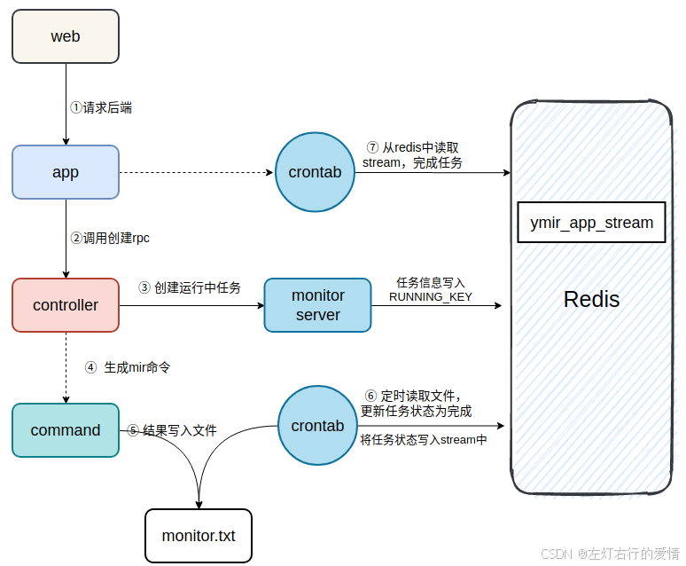

#### Stream 和专业消息队列对比

专业的消息队列包括：

RabbitMQ  
 RocketMQ  
 Kafka  
 一个专业的消息队列，必须要满足两个条件：

消息不丢  
 消息可堆积  
 下面从这两个方面来对比Stream和专业消息队列。

##### 消息不丢

消息队列的使用模型如下：  
   
 要保证消息不丢，就需要在生产者、中间件、消费者这三个方面来分析。

* 生产者  
   消息发送失败或发送超时，这两种情况会导致数据丢失，可以使用重试来解决。不依赖消息中间件，需要业务实现。
* 消费者  
   消费者存在读取消息未处理完就异常宕机了，消费者要还能重新读取消息。Stream和其他消息中间件都能做到。
* 队列中间件  
   中间件要保证数据不丢失。 Redis 在以下 2 个场景下，都会导致数据丢失：

1. AOF 持久化配置为每秒写盘，Redis 宕机时会存在丢失最后1秒数据的可能
2. 主从复制的集群，主从切换时，从库还未同步完成主库发来的数据，就被提成主库，也存在丢失数据的可能。  
    基于以上原因可以推断出，Redis 本身的无法保证严格的数据完整性。

专业队列如何解决数据丢失问题：  
 RabbitMQ 或 Kafka 这类专业的队列中间件，在使用时一般是部署一个集群。生产者在发布消息时，队列中间件通常会写「多个节点」，以此保证消息冗余。这样一来，即便其中一个节点挂了，集群也能的数据不丢失。

##### 消息积压

因为 Redis 的数据都存储在内存中，这就意味着一旦发生消息积压，则会导致 Redis 的内存持续增长，如果超过机器内存上限，就会面临 OOM 的风险。

所以，Redis 的 Stream 提供了可以指定队列最大长度的功能，就是为了避免这种情况发生。

但 Kafka、RabbitMQ 这类消息队列就不一样了，它们的数据都会存储在磁盘上，磁盘的成本要比内存小得多，当消息积压时，无非就是多占用一些磁盘空间，磁盘相比于内存在面对积压时能轻松应对。

##### 使用场景

* 适用  
   适用业务场景：

1. 场景足够简单
2. 对于数据丢失不敏感
3. 消息积压概率比较小  
    满足以上场景把 Redis 当作队列是完全可以的。  
    基于redis的高性能和使用内存的机制使得其的性能优于大部分消息队列。在小规模场景会有更出色的表现。

* 不适用

1. 对于数据丢失非常敏感，如订单系统
2. 写入量非常大，并发请求大
3. 消息积压时会占用很多的内存资源，消息数据量大  
    这些业务场景下建议使用专业的消息队列中间件。

#### 总结

把 Redis 当作队列来使用时，始终面临两个问题：  
 Redis 本身可能会丢数据  
 面对消息积压，Redis 内存资源紧张

##### 优点

使用成本低。几乎每一个项目都会使用Redis，用Stream做消息队列就不需要额外再引入中间件，减少系统复杂性，运维成本，硬件资源。

##### 缺点

1. Redis 的数据都存储在内存中，内存持续增长超过机器内存上限，就会面临 OOM 的风险
2. Stream 作为Redis的一种数据结构，Redis 在持久化或主从切换时有丢失数据的风险，所以Stream也有丢失消息的风险
3. 所有的消息会一直保存在Stream中，没有删除机制。要么定时清除，那么设置队列的长度自动丢弃先入列消息

##### 题外话

技术选型出了技术本身之外还要考虑公司团队能否匹配技术。

Kafka、RabbitMQ 是非常专业的消息中间件，但它们的部署和运维，相比于 Redis 来说，也会更复杂一些。

如果在一个大公司，公司本身就有优秀的运维团队，那么使用这些中间件肯定没问题，因为有足够优秀的人能 hold 住这些中间件，公司也会投入人力和时间在这个方向上。

但是在一个初创公司，业务正处在快速发展期，暂时没有能 hold 住这些中间件的团队和人，如果贸然使用这些组件，当发生故障时，排查问题也会变得很困难，甚至会阻碍业务的发展。
