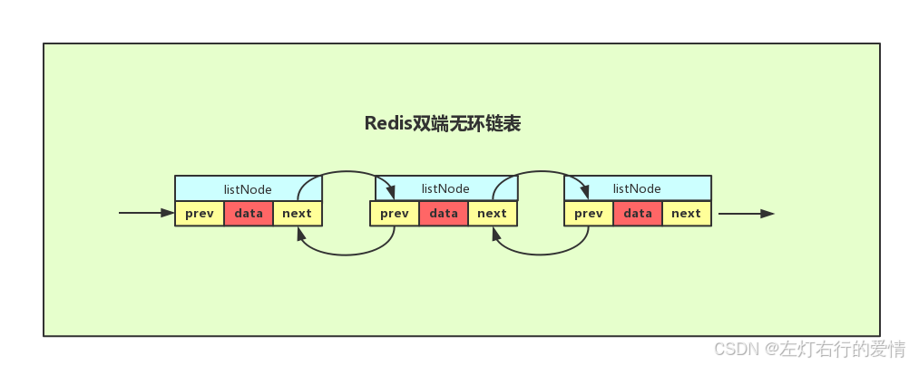
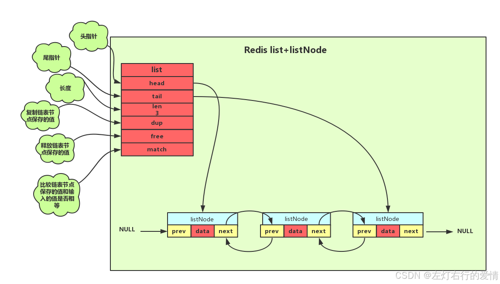
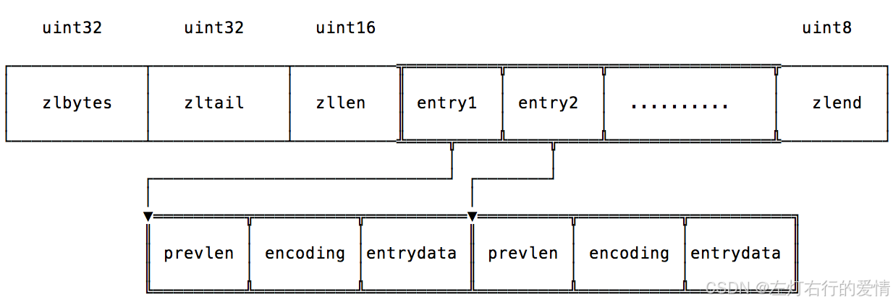

> 原文：[CSDN](https://blog.csdn.net/qq_45852626/article/details/145724458)（历史文章导入，当前状态为草稿）

#### 结构设计

Redis 的链表是双向无环链表  
   
 它的结构也非常简单:

```
typedef struct listNode
{ 
	// 前置节点 
	struct listNode *prev; 
	// 后置节点 
	struct listNode *next; 
	// 节点的值 
	void *value; 
} listNode;


```

但是我们去操作的话并不是去操作listNode,而是list.  
 首先是redis希望我们去专心业务逻辑,而不用担心链表的指针操作,内存管理等底层细节,简化我们的使用门槛.  
 那总结下来由以下几点:

* 抽象与封装
  + 隐藏实现细节：Redis 的链表是双向无环链表，但用户无需关心底层实现。通过 LIST 提供的接口（如 LPUSH、RPOP 等），用户可以专注于业务逻辑，而不必担心链表的指针操作、内存管理等底层细节。
  + 简化使用：直接操作链表需要用户处理复杂的指针操作和边界条件，而 LIST 提供了简单易用的 API，降低了使用门槛。
* 数据安全与一致性
  + 防止误操作：直接操作链表可能导致数据损坏或不一致。例如，用户可能错误地修改指针，导致链表断裂或形成环状结构。
  + 事务支持：Redis 的 LIST 操作支持事务（如 MULTI、EXEC），确保多个操作的原子性，而直接操作链表无法保证这一点。
* 性能优化
  + 高效实现：Redis 的 LIST 操作经过高度优化，能够充分利用底层数据结构的特性。例如，LPUSH 和 RPUSH 的时间复杂度为 O(1)，而直接操作链表可能无法达到同样的性能。
  + 内存管理：Redis 负责链表节点的内存分配和释放，避免了用户手动管理内存的复杂性和潜在的内存泄漏问题。
* 功能扩展
  + 丰富的操作：Redis 的 LIST 提供了丰富的操作，如 LINDEX（按索引获取元素）、LRANGE（获取范围元素）、BLPOP（阻塞式弹出）等，这些功能直接操作链表难以实现。
  + 支持多种场景：LIST 可以用作队列、栈、消息队列等，而直接操作链表需要用户自己实现这些功能。

上述也体现了Redis的设计哲学:  
 **Redis 的设计目标之一是提供简单、高效、通用的数据结构，而不是让用户直接操作底层实现。通过提供 LIST，Redis 将链表的复杂性封装起来，同时提供了强大的功能和性能。**

  
 list的结构如下：

```
typedef struct list{
    //表头节点
    listNode *head;
    //表尾节点
    listNode *tail;
    //链表所包含的节点数量
    unsigned long len;
    //节点值复制函数
    void *(*dup)(void *ptr);
    //节点值释放函数
    void *(*free)(void *ptr);
    //节点值对比函数
    int (*match)(void *ptr,void *key);
}list;


```

#### 使用命令

| 操作 \ 时间复杂度 | 数组 | 单链表 | 双向链表 |
| --- | --- | --- | --- |
| **rpush** (从右边添加元素) | O(1) | O(1) | O(1) |
| **lpush** (从左边添加元素) | O(N) | O(1) | O(1) |
| **lpop** (从右边删除元素) | O(1) | O(1) | O(1) |
| **rpop** (从左边删除元素) | O(N) | O(1) | O(1) |
| **lindex** (获取指定索引下标的元素) | O(1) | O(N) | O(N) |
| **len** (获取长度) | O(N) | O(N) | O(1) |
| **linsert** (向某个元素前或后插入元素) | O(N) | O(N) | O(1) |
| **lrem** (删除指定元素) | O(N) | O(N) | O(N) |
| **lset** (修改指定索引下标元素) | O(N) | O(N) | O(N) |

#### 缺点

1. 链表每个节点之间的内存都是不连续的，意味着无法很好利用 CPU 缓存。
2. 保存一个链表节点的值都需要一个链表节点结构头的分配，内存开销较大。

因此，Redis 3.0 的 List 对象在数据量比较少的情况下，会采用「压缩列表」作为底层数据结构的实现，它的优势是节省内存空间，并且是内存紧凑型的数据结构。  
 不过，压缩列表存在性能问题，所以 Redis 在 3.2 版本设计了新的数据结构quicklist，并将 List 对象的底层数据结构改由 quicklist 实现。  
 然后在 Redis 5.0 设计了新的数据结构 listpack，沿用了压缩列表紧凑型的内存布局，最终在最新的 Redis版本，将 Hash 对象和 Zset 对象的底层数据结构实现之一的压缩列表，替换成由 listpack 实现。

### 压缩列表

压缩列表 ziplist 在 redis 中的应用也非常广泛，它是我们常用的 zset ，list 和 hash 结构的底层实现之一。当我们的容器对象的元素个数小于一定条件时，redis 会使用 ziplist 的方式储存，来减少内存的使用。

#### 为什么元素较少时使用ziplist

ziplist 它本身是一块连续的内存块，所以它的读写是 顺序I/O，从底层的磁盘读写来说，顺序I/O 的效率肯定是高于 随机I/O 。那为什么不都用 顺序I/O 的 ziplist 代替 随机I/O 呢，因为 ziplist 是连续内存，当你元素数量多了，意味着当你创建和扩展的时候需要操作更多的内存，所以 ziplist 针对元素少的时候才能提升效率。

#### 结构布局

ziplist 是经过特殊编码的双向列表结构，用来提高内存使用效率。它可以储存字符串或者整数值，其中整数值被编码成实际的整数，而不是字符串形式。  
 它可以在 O(1) 时间内对列表的两端进行 push 和 pop 操作。但是，**因为每个操作都需要重新分配 ziplist 使用的内存，所以实际的复杂度与 ziplist 使用的内存大小有关。**

```
<zlbytes> <zltail> <zllen> <entry> <entry> ... <entry> <zlend>


```



| 属性 | 字节数 | 含义 |
| --- | --- | --- |
| **zlbytes** | 4 | 压缩列表占用的内存字节数：在对压缩列表进行内存重分配，或者计算 `zlend` 的位置时使用。 |
| **zltail** | 4 | 压缩列表表尾节点的偏移量：用来倒序遍历压缩列表。 |
| **zllen** | 2 | 记录了压缩列表包含的节点数量：  - 当这个属性的值小于 `UINT16_MAX`（65535）时，这个属性的值就是压缩列表包含节点的数量；  - 当这个值等于 `UINT16_MAX` 时，节点的真实数量需要遍历整个压缩列表才能计算得出。 |
| **entry[]** | 待定 | 节点数组，包含元素的具体信息。 |
| **zlend** | 1 | 特殊值 `0xFF`（十进制 255），用于标记压缩列表的末端。 |

ziplist中的每个节点 entry 的结构如下：  
 `<prevlen> <encoding> <entry-data>`

##### prevlen

prevlen 表示前一个元素的长度，以便能够从后向前遍历列表。  
 它有一套特别的编码方式：  
 如果这个长度<254字节，那么它占用1个字节；  
 当长度≥254时，占用5个字节，第一个字节被设置为254 (0xFE)，其余的4个字节记录前一个条目的长度  
 prevlen 用 5 bytes表示时，不代表长度一定大于等于254，这是为了减少 realloc 和 memmove 提高效率。

##### encoding

记录了当前节点实际数据的「类型和长度」，类型主要有两种：字符串和整数。

##### data

记录了当前节点的实际数据，类型和长度都由 encoding 决定；

#### 连锁更新

压缩列表新增某个元素或修改某个元素时，如果空间不够,压缩列表占用的内存空间就需要重新分配。  
 当新插入的元素较大时，可能会导致后续元素的 prevlen 占用空间都发生变化，从而引起「连锁更新」问题，导致每个元素的空间都要重新分配，造成访问压缩列表性能的下降。

这个很好理解,prevlen里面长度存储的是上一个节点的.  
 这种在特殊情况下产生的连续多次空间扩展操作就叫做「连锁更新」，就像多米诺牌的效应一样
