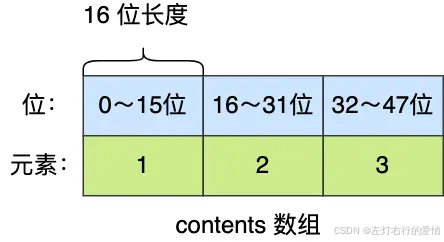
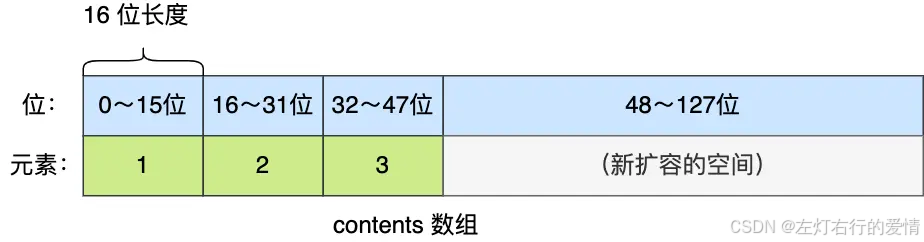
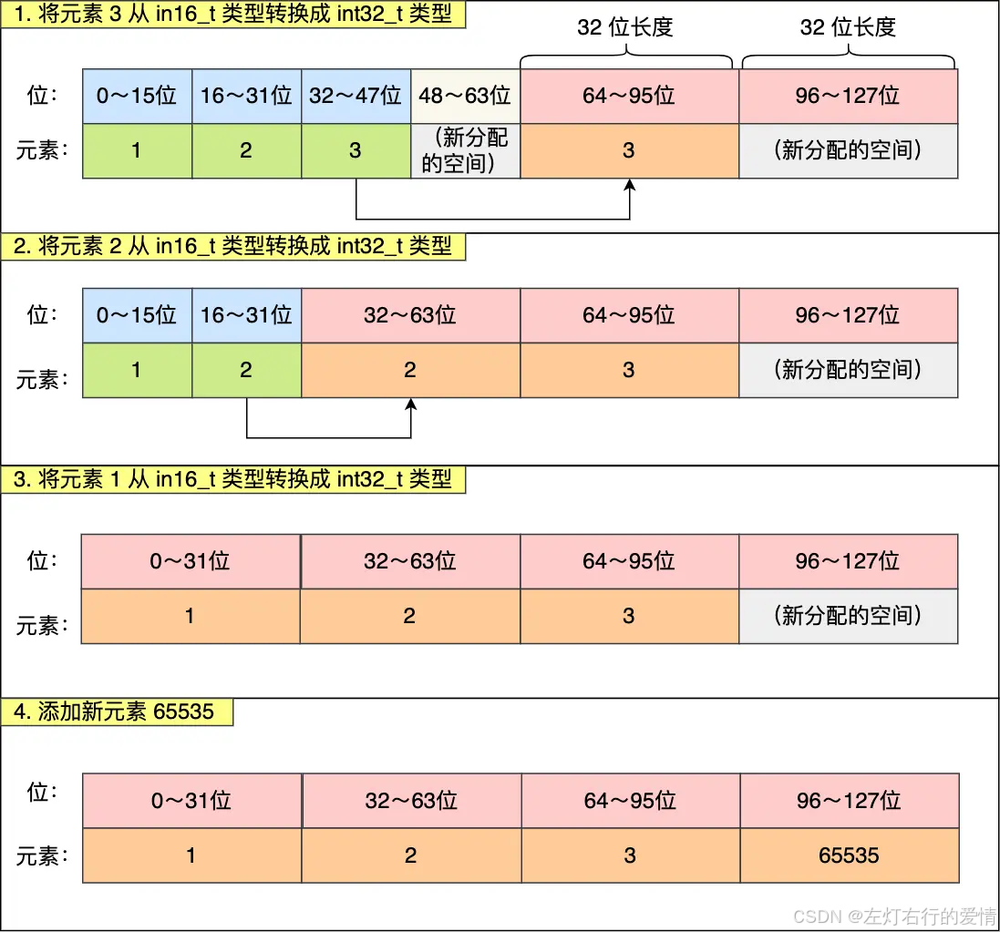

> 原文：[CSDN](https://blog.csdn.net/qq_45852626/article/details/145729512)（历史文章导入，当前状态为草稿）

### 前言

整数集合是 Set 对象的底层实现之一。当一个 Set 对象只包含整数值元素，并且元素数量不大时，就会使用整数集这个数据结构作为底层实现。  
 它的一个优点就是可以节省很多内存.  
 虽然字典结构的效率很高，但是它的实现结构相对复杂并且会分配较多的内存空间。

### 数据结构

整数集合本质上是一块连续内存空间，它的结构定义如下：

```
typedef struct intset {
     //编码方式
    uint32_t encoding;
     //集合包含的元素数量
    uint32_t length;
     //保存元素的数组
    int8_t contents [];
} intset;


```

contents 记录我们实际的数据集合，虽然我们看到结构体中给数组元素的类型定死成 int8\_t，但实际上这个 int8\_t 定义的毫无意义，实际上 redis 无论是读取数组元素还是新增元素进去都依赖 encoding 和 length 两个字段直接操作的内存。  
 这就不得不提到下面我们要说的升级操作.

### 整数集合的升级操作

整数集合会有一个升级规则，就是当我们将一个新元素加入到整数集合里面，如果新元素的类型（int32\_t）比整数集合现有所有元素的类型（int16\_t）都要长时，整数集合需要先进行升级，也就是按新元素的类型（int32\_t）扩展 contents 数组的空间大小，然后才能将新元素加入到整数集合里，当然升级的过程中，也要维持整数集合的有序性。  
 整数集合升级的过程不会重新分配一个新类型的数组，而是在原本的数组上扩展空间，然后在将每个元素按间隔类型大小分割，如果 encoding 属性值为 INTSET\_ENC\_INT16，则每个元素的间隔就是 16 位。  
 举个例子，假设有一个整数集合里有 3 个类型为 int16\_t 的元素。  
   
 往这个整数集合中加入一个新元素 65535，这个新元素需要用 int32\_t 类型来保存，所以整数集合要进行升级操作，首先需要为 contents 数组扩容，在原本空间的大小之上再扩容多 80 位（4x32-3x16=80），这样就能保存下 4 个类型为 int32\_t 的元素。  
   
 扩容完 contents 数组空间大小后，需要将之前的三个元素转换为 int32\_t 类型，并将转换后的元素放置到正确的位上面，并且需要维持底层数组的有序性不变，整个转换过程如下：  
   
 可以看到是有点麻烦,但是这样是有好处的.  
 如果要让一个数组同时保存 int16\_t、int32\_t、int64\_t 类型的元素，最简单做法就是直接使用 int64\_t 类型的数组。  
 不过这样的话，当如果元素都是 int16\_t 类型的，就会造成内存浪费的情况。  
 如果一直向整数集合添加 int16\_t 类型的元素，那么整数集合的底层实现就一直是用 int16\_t 类型的数组，只有在我们要将 int32\_t 类型或 int64\_t 类型的元素添加到集合时，才会对数组进行升级操作。  
 因此，整数集合升级的好处是节省内存资源。

但是有点致命的是,整数集合并不支持降级操作.

扩展代码如下:

```
static intset *intsetUpgradeAndAdd(intset *is, int64_t value) {
    //intset目前的编码
    uint8_t curenc = intrev32ifbe(is->encoding);
    //intset即将扩展到的编码
    uint8_t newenc = _intsetValueEncoding(value);
    int length = intrev32ifbe(is->length);
    int prepend = value < 0 ? 1 : 0;

    //根据新的元素内存大小重新分配 intset 内存大小
    is->encoding = intrev32ifbe(newenc);
    is = intsetResize(is,intrev32ifbe(is->length)+1);
    //开始扩大它占用的比特位
    while(length--)
_intsetSet(is,length+prepend,_intsetGetEncoded(is,length,curenc));

    //将新元素放进 intset 中
    if (prepend)
        _intsetSet(is,0,value);
    else
        _intsetSet(is,intrev32ifbe(is->length),value);
    is->length = intrev32ifbe(intrev32ifbe(is->length)+1);
    return is;
}


```

### 总结

总结一下，整数集合(intset)使用了非常简洁的数据结构，可以更少的占用内存存储一些整数，但终究是基于数组的，也就避免不了不能存储大量数据的缺点。总体来说，插入一个元素，最好情况 O(logN)，最坏的情况是 O(N)，摊还时间复杂度为 O(N)，查找一个元素，根据索引下标时间复杂度在 O(1)。当 intset 中的元素超过 512 个，或者向其中添加了字符串，redis 会将 intset 转换成字典。
