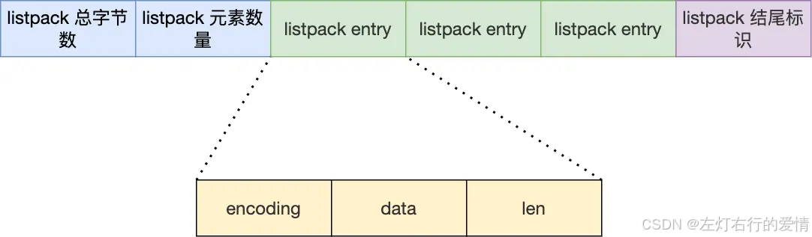
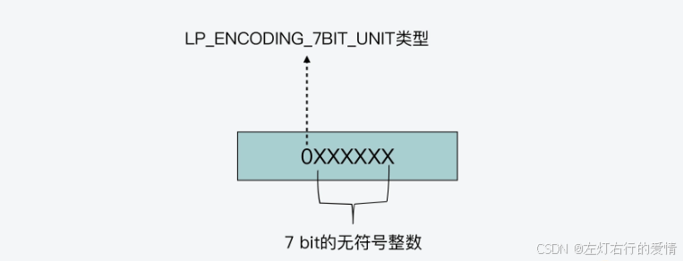
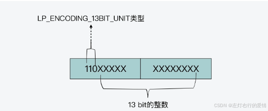
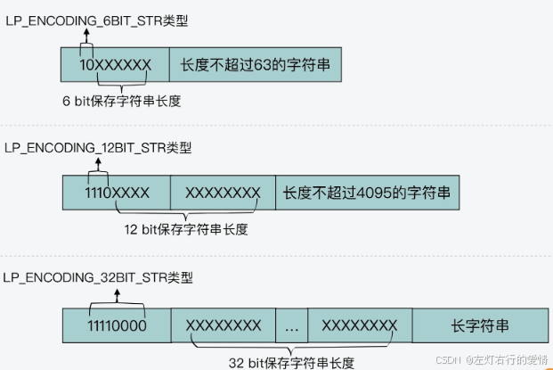
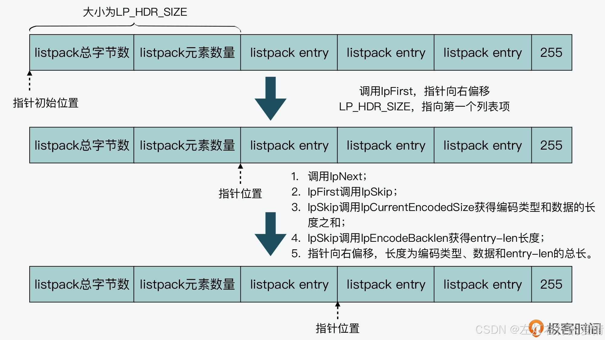
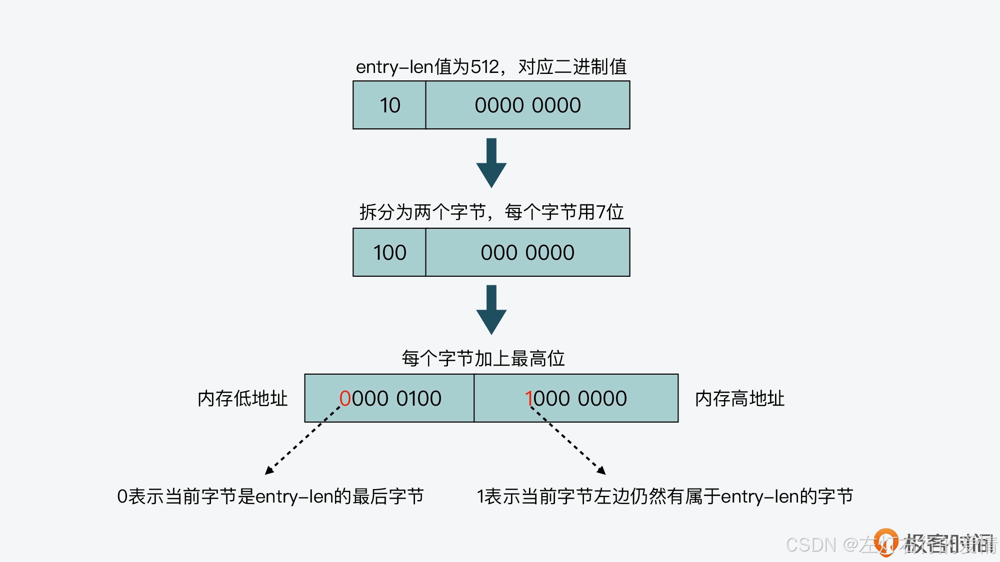

> 原文：[CSDN](https://blog.csdn.net/qq_45852626/article/details/145747076)（历史文章导入，当前状态为草稿）

## 前言

quicklist 虽然通过控制 quicklistNode 结构里的压缩列表的大小或者元素个数，来减少连锁更新带来的性能影响，但是并没有完全解决连锁更新的问题。  
 因为 quicklistNode 还是用了压缩列表来保存元素，压缩列表连锁更新的问题，来源于它的结构设计，所以要想彻底解决这个问题，需要设计一个新的数据结构。  
 Redis 在 5.0 新设计一个数据结构叫 listpack，目的是替代压缩列表，它最大特点是 listpack 中每个节点不再包含前一个节点的长度了，压缩列表每个节点正因为需要保存前一个节点的长度字段，就会有连锁更新的隐患.

## 什么是listPack

listpack 也叫紧凑列表，它的特点就是用一块连续的内存空间来紧凑地保存数据，同时为了节省内存空间，**listpack 列表项使用了多种编码方式，来表示不同长度的数据**，这些
数据包 
括整数和字符串。

Redis
源码 
对于listpack的解释为 A lists of strings serialization format，一个字符串列表的序列化格式，也就是将一个字符串列表进行序列化存储。Redis listpack可用于存储字符串或者是整型…

为了避免 ziplist 引起的连锁更新问题，listpack 中的每个列表项不再像 ziplist 列表项那样，保存其前一个列表项的长度，它只会包含三个方面内容，分别是当前元素的编码
类 
型（entry-encoding）、元素数据 (entry-data)，以及编码类型和元素数据这两部分的长度 (entry-len)，如下图所示。



### 结构

```
/* Each entry in the listpack is either a string or an integer. */
typedef struct {
    /* When string is used, it is provided with the length (slen). */
    unsigned char *sval;
    uint32_t slen;
    /* When integer is used, 'sval' is NULL, and lval holds the value. */
    long long lval;
} listpackEntry;


```

* slen，不同于ziplist，listpackEntry 中的 len 记录的是**当前 entry 的编码类型和长度，而非上一个entry的长度。**
* \*sval，当存储的数据为**字符串**时，使用该成员变量
* lval，当存储的数据为**整数**，使用该成员变量

关于 listpack 列表项的设计，你需要重点掌握两方面的要点，分别是列表项元素的编码类型，以及列表项避免连锁更新的方法.

### 列表项元素的编码类型

**listpack 元素会对不同长度的整数和字符串进行编码.**

#### 整数编码

* LP\_ENCODING\_7BIT\_UINT  
   对于整数编码来说，当 listpack 元素的编码类型为 `LP_ENCODING_7BIT_UINT` 时，表示元素的实际数据是一个 7 bit 的无符号整数。  
   又因为 `LP_ENCODING_7BIT_UINT` 本身的宏定义值为 0，所以编码类型的值也相应为 0，占 1 个 bit。  
   此时，编码类型和元素实际数据共用 1 个字节(8bit)，这个字节的最高位为 0，表示编码类型，后续的 7 位用来存储 7 bit 的无符号整数，如下图所示：  
   
* LP\_ENCODING\_13BIT\_INT  
   这表示元素的实际数据是 13 bit 的整数。  
   因为 LP\_ENCODING\_13BIT\_INT 的宏定义值为 0xC0，转换为二进制值是 1100 0000，所以，这个二进制值中的后 5 位和后续的 1 个字节，共 13 位，会用来保存 13bit 的整数。而该二进制值中的前 3 位 110，则用来表示当前的编码类型。  
     
   在了解了 LP\_ENCODING\_7BIT\_UINT 和 LP\_ENCODING\_13BIT\_INT 这两种编码类型后，剩下的 LP\_ENCODING\_16BIT\_INT、LP\_ENCODING\_24BIT\_INT、LP\_ENCODING\_32BIT\_INT 和 LP\_ENCODING\_64BIT\_INT，你应该也就能知道它们的编码方式了。  
   这四种类型是分别用 2 字节（16 bit）、3 字节（24 bit）、4 字节（32 bit）和 8 字节（64 bit）来保存整数数据。同时，它们的编码类型本身占 1 字节，编码类型值分别是它们的宏定义值。

#### 字符串编码

对于字符串编码来说，一共有三种类型，分别是 `LP_ENCODING_6BIT_STR、LP_ENCODING_12BIT_STR 和 LP_ENCODING_32BIT_STR`。从刚才的介绍中，你可以看到，整数编码类型名称中 BIT 前面的数字，表示的是整数的长度。因此类似的，字符串编码类型名称中 BIT 前的数字，表示的就是字符串的长度。

* LP\_ENCODING\_6BIT\_STR  
   当编码类型为 `LP_ENCODING_6BIT_STR` 时，编码类型占 1 字节。该类型的宏定义值是 0x80，对应的二进制值是 1000 0000，这其中的前 2 位是用来标识编码类型本身，而后 6 位保存的是字符串长度。然后，列表项中的数据部分保存了实际的字符串。  
   下面的图展示了三种字符串编码类型和数据的布局，你可以看下  
   

### 避免连锁更新的实现方式

在 listpack 中，因为每个列表项只记录自己的长度，而不会像 ziplist 中的列表项那样，会记录前一项的长度。所以，当我们在 listpack 中新增或修改元素时，**实际上只会涉及每个列表项自己的操作**，而不会影响后续列表项的长度变化，这就避免了连锁更新。  
 你可能会有疑问：**如果 listpack 列表项只记录当前项的长度，那么 listpack 支持从左向右正向查询列表，或是从右向左反向查询列表吗？**  
 listpack 是能支持正、反向查询列表的。  
 下面的内容第一次看会有点难理解,多看几次就好了.

#### 从左向右查询

当应用程序从左向右正向查询 listpack 时，我们可以先调用 lpFirst 函数。该函数的参数是指向 listpack 头的指针，它在执行时，会让指针向右偏移 LP\_HDR\_SIZE 大小，也就是跳过 listpack 头。你可以看下 lpFirst 函数的代码，如下所示：

```
unsigned char *lpFirst(unsigned char *lp) {
    lp += LP_HDR_SIZE; //跳过listpack头部6个字节
    if (lp[0] == LP_EOF) return NULL;  //如果已经是listpack的末尾结束字节，则返回NULL
    return lp;
}


```

再调用 lpNext 函数，该函数的参数包括了指向 listpack 某个列表项的指针。lpNext 函数会进一步调用 lpSkip 函数，并传入当前列表项的指针，如下所示：

```
unsigned char *lpNext(unsigned char *lp, unsigned char *p) {
    ...
    p = lpSkip(p);  //调用lpSkip函数，偏移指针指向下一个列表项
    if (p[0] == LP_EOF) return NULL;
    return p;
}


```

最后，lpSkip 函数会先后调用 lpCurrentEncodedSize 和 lpEncodeBacklen 这两个函数。

* lpCurrentEncodedSize函数  
   根据当前列表项第 1 个字节的取值，来计算当前项的编码类型，并根据编码类型，计算当前项编码类型和实际数据的总长度。
* lpEncodeBacklen 函数  
   会根据编码类型和实际数据的长度之和，进一步计算列表项最后一部分 entry-len 本身的长度

这样一来，lpSkip 函数就知道当前项的编码类型、实际数据和 entry-len 的总长度了，也就可以将当前项指针向右偏移相应的长度，从而实现查到下一个列表项的目的。



#### 从右向左

我们根据 listpack 头中记录的 listpack 总长度，就可以直接定位到 listapck 的尾部结束标记。  
 然后，我们可以调用 lpPrev 函数，该函数的参数包括指向某个列表项的指针，并返回指向当前列表项前一项的指针。  
 lpPrev 函数中的关键一步就是调用 `lpDecodeBacklen` 函数。`lpDecodeBacklen` 函数会从右向左，逐个字节地读取当前列表项的 entry-len。  
 **有个问题:lpDecodeBacklen 函数如何判断 entry-len 是否结束了呢？**  
 这就依赖于 entry-len 的编码方式了。entry-len 每个字节的最高位，是用来表示当前字节是否为 entry-len 的最后一个字节，这里存在两种情况，分别是：

* 最高位为 1，表示 entry-len 还没有结束，当前字节的左边字节仍然表示 entry-len 的内容；
* 最高位为 0，表示当前字节已经是 entry-len 最后一个字节了。  
   而 entry-len 每个字节的低 7 位，则记录了实际的长度信息。这里你需要注意的是，entry-len 每个字节的低 7 位采用了大端模式存储，也就是说，entry-len 的低位字节保存在内存高地址上。  
     
   正是因为有了 entry-len 的特别编码方式，lpDecodeBacklen 函数就可以从当前列表项起始位置的指针开始，向左逐个字节解析，得到前一项的 entry-len 值。  
   这也是 lpDecodeBacklen 函数的返回值。而从刚才的介绍中，我们知道 entry-len 记录了编码类型和实际数据的长度之和。  
   因此，lpPrev 函数会再调用 lpEncodeBacklen 函数，来计算得到 entry-len 本身长度，这样一来，我们就可以得到前一项的总长度，而 lpPrev 函数也就可以将指针指向前一项的起始位置了。所以按照这个方法，listpack 就实现了从右向左的查询功能。

## 总结

Redis 在内存紧凑型列表的设计与实现上，从 ziplist 到 quicklist，再到 listpack，我们可以看到 Redis 在内存空间开销和访问性能之间的设计取舍.
