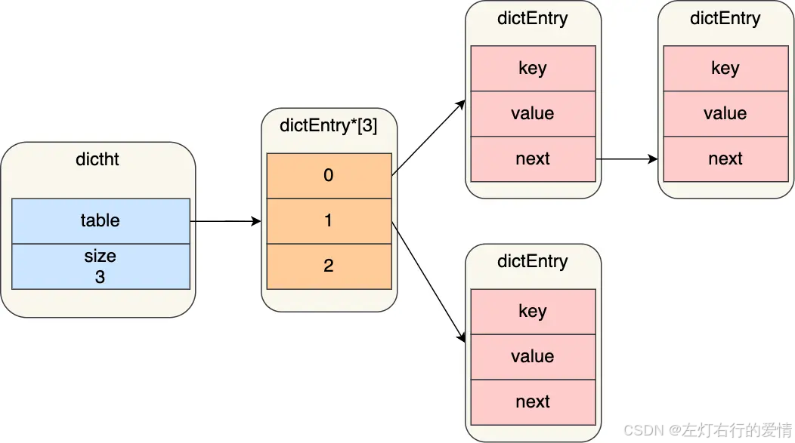
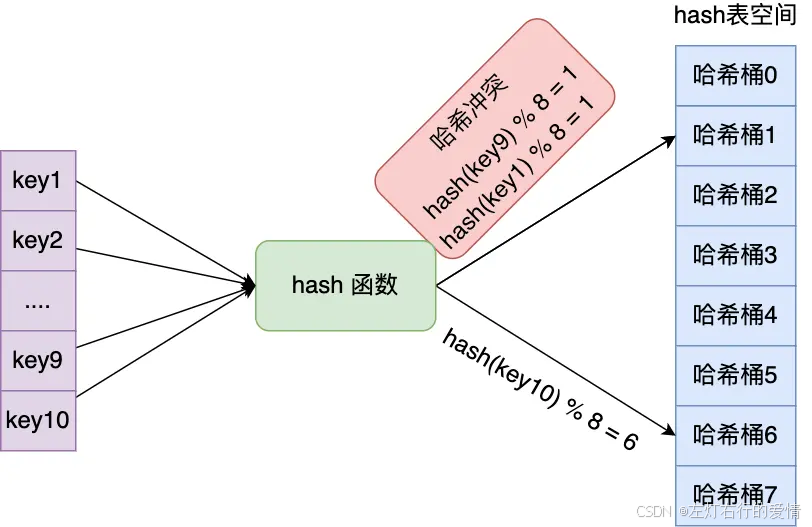
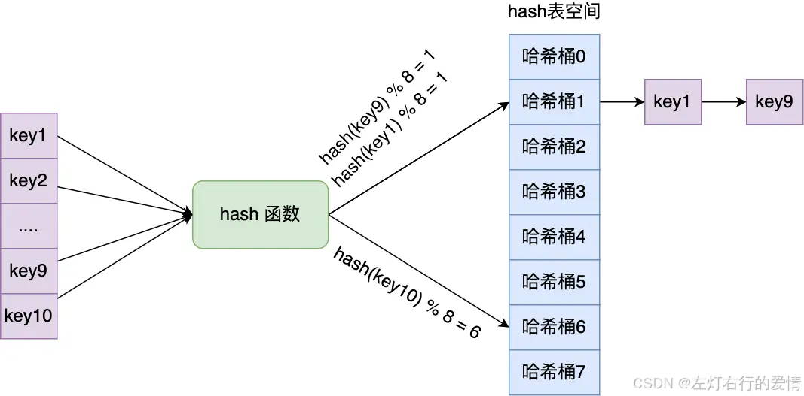
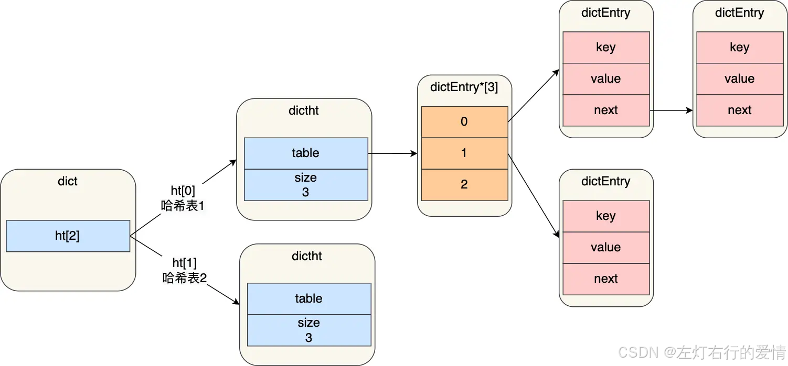
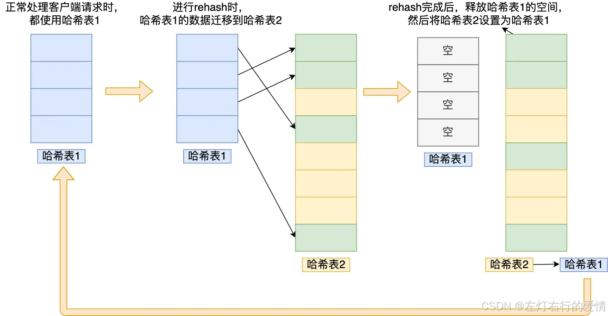
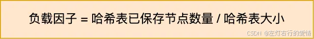
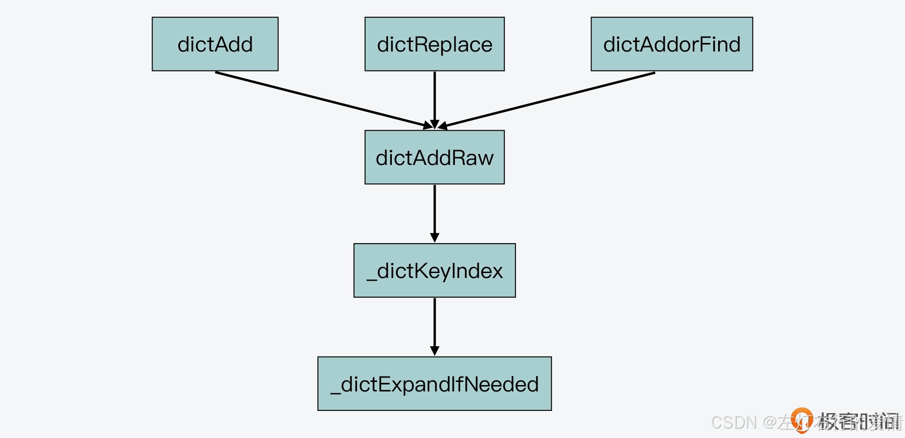

> 原文：[CSDN](https://blog.csdn.net/qq_45852626/article/details/145727660)（历史文章导入，当前状态为草稿）

## 前言

Hash 表是一种非常关键的
数据结构 
。  
 比如在
数据库系统
中，Hash 表被用来辅助 SQL 查询。  
 而对于 Redis 键值数据库来说，Hash 表既是键值对中的一种值
类 
型，同时，Redis 也使用一个全局 Hash 表来保存所有的键值对，从而既满足应用存取 Hash 结构数据需求，又能提供快速查询功能。  
 Hash 表应用如此广泛的一个重要原因，就是从理论上来说，它能以 O(1) 的复杂度快速查询数据。  
 Hash 表通过 Hash 函数的计算，就能定位数据在表中的位置，紧接着可以对数据进行操作，这就使得数据操作非常快速。  
 但是在实际应用 Hash 表时，当数据量不断增加，它的性能就经常会受到**哈希冲突**和 **rehash 开销**的影响。  
 而这两个问题的核心，其实都来自于 Hash 表要保存的数据量，超过了当前 Hash 表能容纳的数据量。  
 Redis 为我们提供了一个经典的 Hash 表实现方案。  
 针对哈希冲突，Redis 采用了链式哈希，在不扩容哈希表的前提下，将具有相同哈希值的数据链接起来，以便这些数据在表中仍然可以被查询到；  
 对于 rehash 开销，Redis 实现了渐进式 rehash 设计，进而缓解了 rehash 操作带来的额外开销对系统的性能影响。

## 什么是全局哈希表

Redis的全局哈希表是一个内部数据结构，用于存储Redis服务器中的所有键值对。全局哈希表通常是一个由哈希桶组成的数组。每个哈希桶可以保存一个或多个键值对，这些键值对通过哈希函数映射到特定的哈希桶中。当发生哈希冲突（即多个键哈希到同一个桶）时，Redis会使用链表或其他数据结构来解决冲突。  
 一个哈希表就是一个数组，数组每个元素叫哈希桶，每个哈希桶保存键值对数据。然而哈希桶中的元素不是 value 本身，而是指向 value 的指针，即 value 存储的
内存 
地址.

## 哈希结构设计

```
typedef struct dictht{
    //哈希表数组
    dictEntry **table;
    //哈希表大小
    unsigned long size;
    //哈希表大小掩码，用于计算索引值
    //总是等于 size-1
    unsigned long sizemask;
    //该哈希表已有节点的数量
    unsigned long used;
 
}dictht


```

哈希表是由数组 table 组成，table 中每个元素都是指向 dict.h/dictEntry 结构，dictEntry 结构定义如下：

```
typedef struct dictEntry{
     //键
     void *key;
     //值
     union{
          void *val;
          uint64_tu64;
          int64_ts64;
     }v;
 
     //指向下一个哈希表节点，形成链表
     struct dictEntry *next;
}dictEntry


```

在 dictEntry 结构体中，键值对的值是由一个联合体 v 定义的。这个联合体 v 中包含了指向实际值的指针 \*val，还包含了无符号的 64 位整数、有符号的 64 位整数，以及 double 类的值。  
 我之所以要提醒你注意这里，其实是为了说明，**这种实现方法是一种节省内存的开发小技巧，非常值得学习。**  
 因为当值为整数或双精度浮点数时，由于其本身就是 64 位，就可以不用指针指向了，而是可以直接存在键值对的结构体中，这样就避免了再用一个指针，从而节省了内存空间。

注意这里还有一个指向下一个哈希表节点的指针，我们知道哈希表最大的问题是存在哈希冲突，如何解决哈希冲突，有开放地址法和链地址法。这里采用的便是链地址法，通过next这个指针可以将多个哈希值相同的键值对连接在一起，用来解决哈希冲突。  
 

## 哈希冲突

哈希表实际上是一个数组，数组里每一个元素就是一个哈希桶。  
 当一个键值对的键经过 Hash 函数计算后得到哈希值，再将(哈希值 % 哈希表大小)取模计算，得到的结果值就是该 key-value 对应的数组元素位置，也就是第几个哈希桶。  
 有个例子:  
 有一个可以存放 8 个哈希桶的哈希表。key1 经过哈希函数计算后，再将「哈希值 % 8 」进行取模计算，结果值为 1，那么就对应哈希桶 1，类似的，key9 和 key10 分别对应哈希桶 1 和桶 6。  
 

### 链式哈希

所谓的链式哈希，就是用一个链表把映射到 Hash 表同一桶中的键给连接起来。下面我们就来看看 Redis 是如何实现链式哈希的，以及为何链式哈希能够帮助解决哈希冲突。  
 Redis 在每个 dictEntry 的结构设计中，除了包含指向键和值的指针，还包含了指向下一个哈希项的指针.  
 因此多个哈希表节点可以用 next 指针构成一个单项链表，被分配到同一个哈希桶上的多个节点可以用这个单项链表连接起来，这样就解决了哈希冲突。  
 举个例子:  
 key1 和 key9 经过哈希计算后，都落在同一个哈希桶，链式哈希的话，key1 就会通过 next 指针指向 key9，形成一个单向链表。  
   
 链式哈希局限性也很明显，随着链表长度的增加，在查询这一位置上的数据的耗时就会增加，毕竟链表的查询的时间复杂度是 O(n)。  
 要想解决这一问题，就需要进行 rehash，也就是对哈希表的大小进行扩展。

### rehash

rehash 操作，其实就是指扩大 Hash 表空间。而 Redis 实现 rehash 的基本思路是这样的：

#### 两个哈希表

Redis 准备了两个哈希表，用于 rehash 时交替保存数据。  
 Redis 在 dict.h 文件中使用 dictht 结构体定义了 Hash 表。不过，在实际使用 Hash 表时，Redis 又在 dict.h 文件中，定义了一个 dict 结构体。这个结构体中有一个数组（ht[2]），包含了两个 Hash 表 ht[0]和 ht[1]。dict 结构体的代码定义如下所示：

```
typedef struct dict {
    …
    dictht ht[2]; //两个Hash表，交替使用，用于rehash操作
    long rehashidx; //Hash表是否在进行rehash的标识，-1表示没有进行rehash
    …
} dict;


```

  
 在正常服务请求阶段，插入的数据，都会写入到「哈希表 1」，此时的「哈希表 2 」 并没有被分配空间  
 两个表的交替使用流程:

* 给「哈希表 2」 分配空间，一般会比「哈希表 1」 大一倍（两倍的意思）；
* 将「哈希表 1 」的数据迁移到「哈希表 2」 中；
* 迁移完成后，「哈希表 1 」的空间会被释放，并把「哈希表 2」 设置为「哈希表 1」，然后在「哈希表 2」 新创建一个空白的哈希表，为下次 rehash 做准备。

  
 看起来挺合理的,但是在第二步的时候有问题,如果「哈希表 1 」的数据量非常大，那么在迁移至「哈希表 2 」的时候，因为会涉及大量的数据拷贝，此时可能会对 Redis 造成阻塞，无法服务其他请求。

### 渐进式rehash

将数据的迁移的工作不再是一次性迁移完成，而是分多次迁移。  
 迁移步骤如下:

1. 给「哈希表 2」 分配空间；
2. 在 rehash 进行期间，每次哈希表元素进行新增、删除、查找或者更新操作时，Redis 除了会执行对应的操作之外，还会顺序将「哈希表 1 」中索引位置上的所有 key-value 迁移到「哈希表 2」 上；
3. 随着处理客户端发起的哈希表操作请求数量越多，最终在某个时间点会把「哈希表 1 」的所有 key-value 迁移到「哈希表 2」，从而完成 rehash 操作。
4. 这样就巧妙地把一次性大量数据迁移工作的开销，分摊到了多次处理请求的过程中,避免了一次性 rehash 的耗时操作。  
    在渐进式 rehash 进行期间，哈希表元素的删除、查找、更新等操作都会在这两个哈希表进行。  
    比如，查找一个 key 的值的话，先会在「哈希表 1」 里面进行查找，如果没找到，就会继续到哈希表 2 里面进行找到。  
    另外在渐进式 rehash 进行期间，新增一个 key-value 时，会被保存到「哈希表 2 」里面.

### rehash触发条件

#### 简单版本

rehash 的触发条件跟\*\*负载因子（load factor）\*\*有关系。  
   
 触发 rehash 操作的条件，主要有两个：

* 负载因子≥1,且没有执行 RDB 快照或没有进行 AOF 重写的时候
* 负载因子≥5,说明哈希冲突非常严重了，不管有没有有在执行 RDB 快照或 AOF 重写，都会强制进行 rehash 操作

#### 进阶版本

Redis 用来判断是否触发 rehash 的函数是`_dictExpandIfNeeded`。

`_dictExpandIfNeeded` 函数中定义了三个扩容条件。

条件一：ht[0]的大小为 0。  
 条件二：ht[0]承载的元素个数已经超过了 ht[0]的大小，同时 Hash 表可以进行扩容。  
 条件三：ht[0]承载的元素个数，是 ht[0]的大小的 `dict_force_resize_ratio` 倍，其中，`dict_force_resize_ratio` 的默认值是 5。  
 代码如下:

```
//如果Hash表为空，将Hash表扩为初始大小
if (d->ht[0].size == 0) 
   return dictExpand(d, DICT_HT_INITIAL_SIZE);
 
//如果Hash表承载的元素个数超过其当前大小，并且可以进行扩容，或者Hash表承载的元素个数已是当前大小的5倍
if (d->ht[0].used >= d->ht[0].size &&(dict_can_resize ||
              d->ht[0].used/d->ht[0].size > dict_force_resize_ratio))
{
    return dictExpand(d, d->ht[0].used*2);
}


```

你可能要问了，这里的 dict\_can\_resize 变量值是啥呀？其实，这个变量值是在 dictEnableResize 和 dictDisableResize 两个函数中设置的，它们的作用分别是启用和禁止哈希表执行 rehash 功能，如下所示：

```
void dictEnableResize(void) {
    dict_can_resize = 1;
}
 
void dictDisableResize(void) {
    dict_can_resize = 0;
}


```

然后，这两个函数又被封装在了 `updateDictResizePolicy` 函数中。  
 `updateDictResizePolicy` 函数是用来启用或禁用 rehash 扩容功能的，这个函数调用 `dictEnableResize` 函数启用扩容功能的条件是：当前没有 RDB 子进程，并且也没有 AOF 子进程。这就对应了 Redis 没有执行 RDB 快照和没有进行 AOF 重写的场景。你可以参考下面给出的代码：

```
void updateDictResizePolicy(void) {
    if (server.rdb_child_pid == -1 && server.aof_child_pid == -1)
        dictEnableResize();
    else
        dictDisableResize();
}


```

好，到这里我们就了解了 `_dictExpandIfNeeded` 对 rehash 的判断触发条件，那么现在，我们再来看下 Redis 会在哪些函数中，调用 `_dictExpandIfNeeded` 进行判断。  
 首先，通过在dict.c文件中查看 `_dictExpandIfNeeded` 的被调用关系，我们可以发现，`_dictExpandIfNeeded` 是被 `_dictKeyIndex` 函数调用的，而 `_dictKeyIndex` 函数又会被 `dictAddRaw` 函数调用，然后 `dictAddRaw` 会被以下三个函数调用:

* dictAdd：用来往 Hash 表中添加一个键值对。
* dictRelace：用来往 Hash 表中添加一个键值对，或者键值对存在时，修改键值对。
* dictAddorFind：直接调用 dictAddRaw。  
   因此，当我们往 Redis 中写入新的键值对或是修改键值对时，Redis 都会判断下是否需要进行 rehash。这里你可以参考下面给出的示意图，其中就展示了 \_dictExpandIfNeeded 被调用的关系,如下图:  
     
   简而言之，Redis 中触发 rehash 操作的关键，就是 \_dictExpandIfNeeded 函数和 updateDictResizePolicy 函数。\_dictExpandIfNeeded 函数会根据 Hash 表的负载因子以及能否进行 rehash 的标识，判断是否进行 rehash，而 updateDictResizePolicy 函数会根据 RDB 和 AOF 的执行情况，启用或禁用 rehash。

### 扩容会扩多大呢

rehash 对 Hash 表空间的扩容是通过调用 `dictExpand` 函数来完成的。`dictExpand` 函数的参数有两个:一个是要扩容的 Hash 表，另一个是要扩到的容量.  
 下面的代码就展示了 dictExpand 函数的原型定义：  
 `int dictExpand(dict *d, unsigned long size);`  
 ，我们就可以根据前面提到的 `_dictExpandIfNeeded` 函数，来判断是否要对其进行扩容。而一旦判断要扩容，Redis 在执行 rehash 操作时，对 Hash 表扩容的思路也很简单，就是如果当前表的已用空间大小为 size，那么就将表扩容到 size2 的大小。  
 当 `_dictExpandIfNeeded` 函数在判断了需要进行 rehash 后，就调用 dictExpand 进行扩容。这里你可以看到，rehash 的扩容大小是当前 ht[0]已使用大小的 2 倍:  
 `dictExpand(d, d->ht[0].used*2);`

而在 dictExpand 函数中，具体执行是由 \_dictNextPower 函数完成的，以下代码显示的 Hash 表扩容的操作，就是从 Hash 表的初始大小（DICT\_HT\_INITIAL\_SIZE），不停地乘以 2，直到达到目标大小:

```
static unsigned long _dictNextPower(unsigned long size)
{
    //哈希表的初始大小
    unsigned long i = DICT_HT_INITIAL_SIZE;
    //如果要扩容的大小已经超过最大值，则返回最大值加1
    if (size >= LONG_MAX) return LONG_MAX + 1LU;
    //扩容大小没有超过最大值
    while(1) {
        //如果扩容大小大于等于最大值，就返回截至当前扩到的大小
        if (i >= size)
            return i;
        //每一步扩容都在现有大小基础上乘以2
        i *= 2;
    }
}


```
