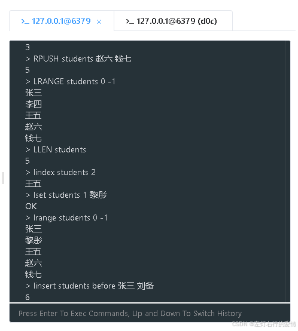
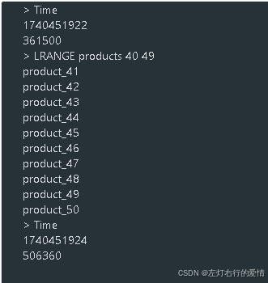
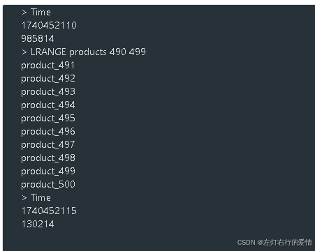
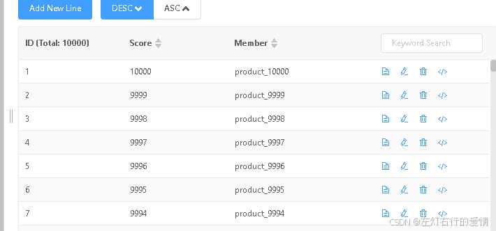

> 原文：[CSDN](https://blog.csdn.net/qq_45852626/article/details/145847450)（历史文章导入，当前状态为草稿）

#### 列表实操
### 前言

之前总结过-列表的数据结构,但是只是理论知识肯定是不行的,思来想去,总结了一些实操例子和实操场景,个人觉得还是很有用的,尤其是后面的场景,平时有我遇见的然后总结下来,例子都是我自己跑过的,没什么问题,有问题评论区见.

### 简单练习

##### 基本的LPUSH和RPUSH操作

1. 创建一个名为"students"的列表，从左侧依次添加"张三"、“李四”、“王五”
2. 从右侧添加"赵六"、“钱七”
3. 查看整个列表内容
4. 获取列表长度

```
> LPUSH students 王五 李四 张三
3
> RPUSH students 赵六 钱七
5
> LRANGE students 0 -1
张三
李四
王五
赵六
钱七
> LLEN students
5


```

##### 列表元素的访问与修改

1. 获取"students"列表的第3个元素
2. 将第2个元素修改为"黎彤"
3. 查看修改后的列表

```
> lindex students 2
王五
> lset students 1 黎彤
OK
> lrange students 0 -1
张三
黎彤
王五
赵六
钱七


```

##### 列表元素的插入和删除

1. 在"张三"之前插入"刘备"
2. 在"钱七"之后插入"孙权"
3. 删除一个值为"黎彤"的元素
4. 从左侧弹出一个元素
5. 从右侧弹出一个元素
6. 查看当前列表

```
> linsert students before 张三 刘备
6
> linsert students after 钱七 孙权
7
> lrange students 0 -1
刘备
张三
黎彤
王五
赵六
钱七
孙权

> lrem students 1 黎彤
1
> lpop students
刘备
> rpop students
孙权
> lrange students 0 -1
张三
王五
赵六
钱七


```

##### 列表阻塞操作

如何创建终端连接,因为我用的是可视化工具,所以只需要打开多个查询窗口即可,如下图是打开了两个:  
   
 列表阻塞操作是Redis提供的一种特殊功能，允许客户端在列表为空时进入等待状态，直到有新元素被添加到列表中。这种操作主要通过BLPOP、BRPOP、BRPOPLPUSH等命令实现。  
 阻塞操作的核心特点是：

* 当列表有元素时，立即返回元素
* 当列表为空时，不立即返回，而是等待（阻塞）
* 可以设置最大等待时间
* 如果在等待时间内有元素被添加到列表，立即返回该元素
* 如果等待超时，返回nil

1. 创建一个新的终端连接到Redis
2. 在第一个终端中执行阻塞弹出操作，等待"tasks"列表的元素
3. 在第二个终端中向"tasks"列表添加一个元素
4. 观察第一个终端的结果

```
第一个终端:
> blpop tasks 30
第二个终端:
> lpush tasks "紧急任务"
1
回头看第一个终端会输出数据:
> blpop tasks 30
tasks
紧急任务


```

### 困难练习

下面所有代码都经过本人验证,放心跑.  
 只是很简单的去结合场景.如果真是具体业务场景,是要麻烦很多的.  
 实操目的是熟悉常用列表命令!!!

#### 分页列表

实现一个产品列表的分页功能，包含1000个产品，每页显示10个。  
 任务:

1. 创建包含1000个产品的列表
2. 实现获取第5页产品的功能
3. 实现获取第50页产品的功能
4. 比较两次操作的性能差异

```
# 创建产品列表
DEL products
EVAL "for i=1,1000 do redis.call('RPUSH', 'products', 'product_'..i) end" 0
# 获取第5页（索引40-49）
TIME
LRANGE products 40 49
TIME

# 获取第50页（索引490-499）
TIME
LRANGE products 490 499
TIME


```

获取第5页用时:  
 

获取第50页用时:  
   
 可以看到第50页的访问时间会明显长于第5页,这说明LRANGE操作的时间复杂度与索引位置成正比,对于大型列表，不适合用LRANGE实现远端分页.  
 那怎么办呢?下面有个优化方案

```
# 使用HSCAN实现分页（先将数据转为哈希表）
DEL products_hash
EVAL "for i=1,1000 do redis.call('HSET', 'products_hash', i, 'product_'..i) end" 0
HSCAN products_hash 0 COUNT 10
HSCAN products_hash 490 COUNT 10


```

为什么呢?  
 列表分页必须从头遍历到490个元素(获取第50页),页码越大,性能越差.  
 而用哈希表:

```
HSCAN products_hash 0 COUNT 10      # 第1页
HSCAN products_hash [cursor] COUNT 10  # 下一页


```

它使用的是游标(cursor)机制，每次返回一个新游标.  
 下次从该游标继续扫描，不需要从头开始,性能相对稳定，不受页码影响.  
 ok,那你可能要问了:  
 那如果我用哈希查10页和第1000页,查第10页返回的游标对于查1000页有帮助?

##### 游标机制

首先HSCAN的游标机制可能确实容易引起误解,我们可以解释一下它:

* 游标不是页码：游标不直接对应于"第几页"，而是一个内部扫描位置的标识
* 游标不是线性的：游标值与数据在哈希表中的位置没有线性关系
* 游标是无状态的：Redis不会记住之前的扫描位置，每次都需要提供游标  
   那就是说游标不是页码,且非线性无状态,那我们访问1000页怎么办?  
   首先如果说我们直接跳转到1000页,那使用HSCAN是没办法的.  
   因为如果我们要访问1000页,使用HSCAN必须要从头开始,执行HSCAN大概1000次!每次使用上一次返回的游标:

```
# 第1次扫描
HSCAN products_hash 0 COUNT 10  # 返回游标值cursor1

# 第2次扫描
HSCAN products_hash cursor1 COUNT 10  # 返回游标值cursor2

# 第3次扫描
HSCAN products_hash cursor2 COUNT 10  # 返回游标值cursor3

# ... 重复大约997次 ...

# 第1000次扫描
HSCAN products_hash cursor999 COUNT 10  # 这才是第1000页的数据


```

但是即使是这样,HSCAN仍然比LRANGE好!  
 虽然HSCAN不支持直接跳页，但它仍有重要优势：

* 增量式扫描：HSCAN每次只锁定少量数据，不会阻塞Redis
* 内存效率：不需要一次性将大量数据加载到内存
* 服务器友好：对Redis服务器的影响较小

##### 业务上考虑直接访问任意页

那如果我们要直接访问任意页.怎么办呢? = =  
 首先从业务上考虑,直接访问任意页实际上是比较少见的,就像我们在一些社交媒体(qq,微博),或者电商平台(淘宝,京东),大家基本上都只关注前几页的热门商品,我个人基本只看前三页(超过第二页都很少).  
 其次,用户都访问到第1000页还没找到想要的,这个通常意味着用户的搜索策略不精确,你想想都看1000页了要花多长时间,还没找到想看到的,这对于用户是无法容忍的!  
 最后这种深度分页会导致数据库和缓存压力比较大,从技术上来看会增加技术成本.

那么话说回来,也不能说就一定不会有这样的场景是吧.  
 比如一些数据分析工具它需要访问特定的数据段,管理后台要定位特定记录,所以还是要考虑有这样业务时如何实现.

##### 如何高效分页

这里只针对中小型数据集(百万级以下),注意是基于有序集合(Sorted Set)去分页.

* 数据准备

```
# 清除旧数据
DEL products_sorted

# 批量添加产品数据(使用Lua脚本)
EVAL "for i=1,10000 do redis.call('ZADD', 'products_sorted', i, 'product_'..i) end; return 'OK'" 0


```



* 分页公式

```
起始索引 = (页码 - 1) * 每页大小
结束索引 = 起始索引 + 每页大小 - 1


```

* 直接访问任意页

```
# 获取第1页(每页20条)
ZRANGE products_sorted 0 19

# 获取第50页
ZRANGE products_sorted 980 999

# 获取第500页
ZRANGE products_sorted 9980 9999


```

* 获取分页元数据

```
# 获取总记录数
ZCARD products_sorted

# 使用Lua脚本获取完整的分页信息
EVAL "
local key = ARGV[1]
local page = tonumber(ARGV[2])
local page_size = tonumber(ARGV[3])

local start = (page - 1) * page_size
local stop = start + page_size - 1
local total = redis.call('ZCARD', key)
local total_pages = math.ceil(total / page_size)
local items = redis.call('ZRANGE', key, start, stop)

return {total, total_pages, items}
" 0 products_sorted 500 20


```

当前也不能我说快就快,下面是我测试的在不同数据量下性能表现:  
 以下是在不同数据量下ZRANGE操作的典型性能表现：

| 数据量 | 直接访问第1页 | 直接访问第1000页 | 内存占用 |
| --- | --- | --- | --- |
| 1,000条 | <1ms | <1ms | ~100KB |
| 10,000条 | <1ms | <1ms | ~1MB |
| 100,000条 | <1ms | 1-2ms | ~10MB |
| 1,000,000条 | 1-2ms | 2-5ms | ~100MB |

这些数据说明，即使在百万级数据集上，有序集合的分页性能依然非常出色，可以实现毫秒级的响应时间。

##### 局限性

在数据量上:  
 当数据量超过千万级时，单个ZSET的内存占用会变得相当大，可能影响Redis的整体性能。  
 条件查询上:  
 ZSET不支持复杂的多条件查询和过滤，如果需要’价格在100-200之间且评分大于4.5的产品’这样的查询，单纯使用ZSET是无法实现的，需要结合其他数据结构或使用RediSearch模块。  
 写入性能上:  
 ZSET的写入操作(ZADD)复杂度为O(log(N))，在数据量极大且写入频繁的场景下，可能成为性能瓶颈

##### 小结

有序集合(ZSET)是Redis中实现中小型数据集分页的最佳选择，主要基于以下几个关键优势:

* ZSET提供了O(log(N) + M)的时间复杂度来访问任意范围的元素，其中N是集合大小，M是返回的元素数量。这意味着即使在百万级数据上，直接跳转到任意页面的性能依然很高。
* ZSET内置了排序能力，每个元素都关联一个分数，可以自动按分数排序，无需额外的排序操作。这对于实现’按时间排序’、'按价格排序’等常见分页场景非常便利。
* ZSET的内部实现结合了跳跃表和哈希表的优势，既能高效地进行范围查询，又能O(1)时间复杂度查找单个元素
* 对于百万级以下的数据集，ZSET的内存占用是合理的，而且Redis会根据数据量自动选择最优的内部编码方式。存储100万个简单元素的ZSET大约需要100MB左右的内存.

当前对于其他不同场景还有很多方法去实现,但是我都不太熟悉,等后面能力比较强了再回来填坑.

#### 实现限时排行版轮换

实现一个每小时更新一次的热门文章排行榜系统。

1. 创建当前小时的排行榜
2. 添加文章到排行榜
3. 模拟小时更替，保留旧排行榜同时创建新排行榜
4. 获取当前和前一小时的排行榜
5. 清理24小时前的排行榜

```
# 设置当前时间（假设为10点）
SET current_hour 10

# 创建当前小时排行榜
DEL trending_articles:10
RPUSH trending_articles:10 "文章A" "文章B" "文章C"

# 添加新热门文章
LPUSH trending_articles:10 "文章D" "文章E"

# 获取当前排行榜
LRANGE trending_articles:10 0 -1

# 模拟小时更替（11点）
SET current_hour 11
DEL trending_articles:11
RPUSH trending_articles:11 "文章E" "文章D" "文章F"

# 获取当前和前一小时排行榜
LRANGE trending_articles:11 0 4
LRANGE trending_articles:10 0 4

# 清理24小时前的排行榜（假设为前一天11点的数据）
DEL trending_articles:$(redis-cli GET current_hour | awk '{print $1-24}')


```

#### 消息队列可靠性实现

实现一个可靠的消息队列，确保消息处理失败时不会丢失。

1. 创建待处理队列和处理中队列
2. 模拟消费者获取并处理消息
3. 模拟处理成功和失败的情况
4. 实现超时未确认的消息回收机制

```
# 创建队列
DEL pending_tasks processing_tasks completed_tasks
# 添加任务
RPUSH pending_tasks "任务1" "任务2" "任务3" "任务4" "任务5"
# 消费者获取任务
RPOPLPUSH pending_tasks processing_tasks
# 查看两个队列
LRANGE pending_tasks 0 -1
LRANGE processing_tasks 0 -1
# 模拟处理成功
RPOPLPUSH processing_tasks completed_tasks
# 模拟处理失败（将任务放回待处理队列）
RPOPLPUSH processing_tasks pending_tasks
# 实现超时回收（Lua脚本）
EVAL "
local processing = redis.call('LRANGE', 'processing_tasks', 0, -1)
for i, task in ipairs(processing) do
    local task_info = cjson.decode(task)
    if (tonumber(task_info.timestamp) + 300) < tonumber(ARGV[1]) then
        redis.call('RPOPLPUSH', 'processing_tasks', 'pending_tasks')
    end
end
return 'OK'
" 0 $(date +%s)


```

#### 分布式锁实现

使用Redis列表实现一个简单的分布式锁机制。

1. 创建锁列表
2. 实现获取锁的功能
3. 实现释放锁的功能
4. 实现锁超时自动释放

```
# 创建锁列表
DEL resource_locks

# 获取锁（原子操作）
-- 参数说明：
-- KEYS[1]: lock_name = "resource_locks"    -- 锁的名称
-- ARGV[1]: client_id = "client-123"        -- 客户端ID
-- ARGV[2]: timeout = "30"                  -- 锁的超时时间
EVAL "
local lock_name = KEYS[1]
local client_id = ARGV[1]
local timeout = ARGV[2]
-- 将客户端ID和超时时间组合成锁信息
local lock_info = client_id..':'..timeout
-- 检查锁是否存在（通过检查列表长度）
if redis.call('LLEN', lock_name) == 0 then
   -- 如果列表为空，说明没有锁，则添加锁
    redis.call('LPUSH', lock_name, lock_info)
    return 1  -- 获取锁成功
else
    return 0  -- 锁已被占用，获取失败
end
" 1 resource_locks "client-123" "30"


# 释放锁（原子操作）

EVAL "
local lock_name = KEYS[1]
local client_id = ARGV[1]

local lock_value = redis.call('LINDEX', lock_name, 0)
-- 检查锁是否存在且属于该客户端
if lock_value and string.find(lock_value, client_id) then
    redis.call('LPOP', lock_name)
    return 1
else
    return 0
end


# 锁超时自动释放（定期执行）
-- 参数说明：
-- KEYS[1]: lock_name = "resource_locks"           -- 锁的名称
-- ARGV[1]: current_time = $(date +%s)            -- 当前时间戳
EVAL "
local lock_name = KEYS[1]
local current_time = tonumber(ARGV[1])
-- 获取锁列表中的第一个元素（最新的锁）
local lock_value = redis.call('LINDEX', lock_name, 0)
if lock_value then
    local parts = {}
    for part in string.gmatch(lock_value, '[^:]+') do
        table.insert(parts, part)
    end
    local client_id = parts[1]   -- 获取客户端ID
    local timeout = tonumber(parts[2])  -- 获取超时时间
    if current_time > timeout then
        redis.call('LPOP', lock_name)  -- 移除超时的锁
        return 1      -- 返回1表示锁被释放
    end
end
return 0     -- 返回0表示锁未被释放 


```

### 总结

本来还有一些,但是我写着写着感觉如果不介绍一些rua脚本的内容,现在意义也不大,如果只是练习指令,上面的应该已经足够了.  
 关于业务场景的,后面我们单独出内容去聊.
