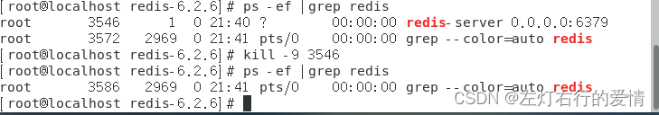
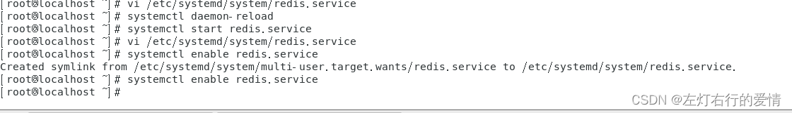
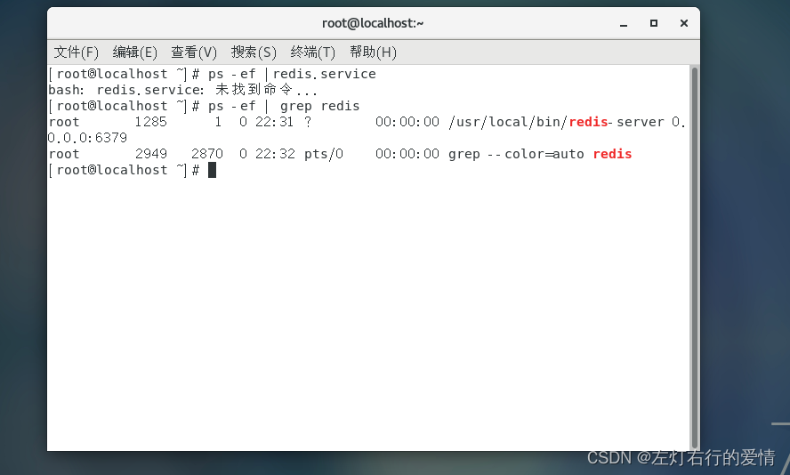

> 原文：[CSDN](https://blog.csdn.net/qq_45852626/article/details/127291307)（历史文章导入，当前状态为草稿）

## Redis实操
## 启动Redis

### Redis启动

方式一：默认启动

```
在任意目录输入redis-server
这种启动属于前台启动，会阻塞整个会话窗口。
停止方式：
关闭窗口/CTRL+C。
不推荐使用


```

方式二：指定配置启动

```
#进入Redis安装目录
cd ....../redis-版本号
#启动
redis-server  redis.conf

#停止方式
通过管程删除
ps -ef | grep redis
kill -9 redsi线程号


```

启动  
 停止  
 方式三：开机自启(不建议）

```
新建一个系统服务文件
vi /etc/systemd/system/reids.service


复制下面内容到文件中
[Unit]
Description=redis-server
After=network.target
[Service]
Type=forking
//注意这里的地址按每个人的配置
ExecStart=/usr/local/bin/redis-server /root/redis-6.2.6/redis.conf
PrivateTmp=true
[Install]
WantedBy=multi-user.target

#保存文件，执行命令，设置redis为开机启动
#重新加载配置文件
systemctl daemon-reload
#启动服务
systemctl start redis.service
#开机启动
systemctl enable redis.service


```

  
 重启后查询管程redis线程是否运行



### Redis客户端

#### Redis命令行客户端 （自带redis—cli）

`redis-cli [option] [commonds]`

1. 常见的option：

* -h 127.0.0.1：指定要连接的redis节点的IP地址，默认是127.0.0.1
* -p 6379：指定要连接的redis节点的端口，默认是6379
* -a123321：指定redis的访问密码

2. 里面的commonds指的是Redis的操作命令

* ping：与redis服务端做心跳测试，服务端正常会返回pong
