> 原文：[CSDN](https://blog.csdn.net/qq_45852626/article/details/128675758)（历史文章导入，当前状态为草稿）

#### Git分支不过如此
### 前言

每一种版本控制都以某种形式支持分支。  
 使用分支的好处就是你可以从开发主线上分离开来，在不影响主线的同时继续工作。  
 在之前的版本控制系统中，这个是奢侈昂贵的操作，经常需要创建一个源代码目录的完整副本，对大型项目来说花费大量时间。  
 有了Git分支模型，将Git从版本控制系统家族区分出来，它以难以置信的轻量级，新建操作几乎可以在瞬间完成，并且在不同分支见切换起来也超快。  
 Git在工作流程中频繁使用分支与合并，当你理解分支的概念并熟练运用后，你才会意识到为什么Git是一个强大独特的工具，并且会改变你的开发方式。

#### 什么是分支

我们要想理解Git分支的实现方式，需要回顾一下Git是如何储存数据的。  
 **Git保存的不是文件的差异或者变化量，而是一系列文件快照。**  
 在Git提交时，会保存一个提交对象，该对象包含一个指向暂存内容快照的指针，包含本次提交的作者等相关附属信息，包含0个或n个指向该提交对象的父对象指针：首次提交是没有直接祖先的，普通提交有一个祖先，2个或n个分支合并产生的提交则有多个祖先。

在这里我们举个栗子：  
 假设工作目录有三个文件，准备将它们暂存后提交。  
 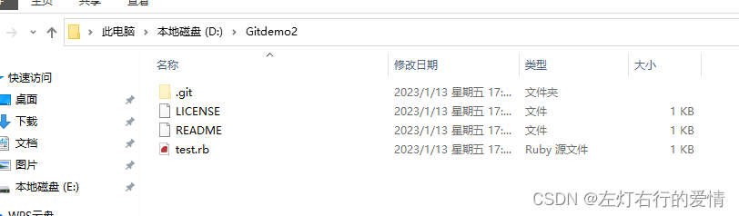

暂存操作会对每一个文件计算校验和（SHA-1哈希字串），然后把当前版本的文件快照保存到Git仓库中（使用blob类型的对象存储这些快照），并将校验和加入暂存区域：  
 先执行git add README test.rb LICENSE  
 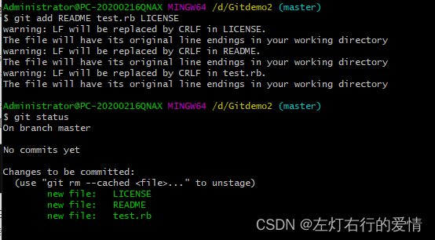

然后执行git commit -m “initial commit of my project”  
 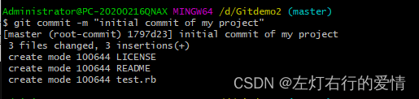

当git commit 新建一个提交对象前，Git会先计算每一个子目录（本栗子中就是项目根目录）的校验和，然后在Git仓库中将这些目录保存为树（tree）对象。  
 之后Git创建的提交对象，除了包含相关提交信息以外，还包含这个树对象（项目根目录）的指针，如此它就可以在将来需要的时候，重现此次快照的内容了。

不要蒙兄弟们，我们来分析一下：  
 现在Git仓库中有五个对象：  
 三个表示快照内容的blob对象（之前聊过，文件是由blob方式储存的）；  
 一个记录着目录树内容以及各个文件对应blob对象索引的tree对象；  
 一个包含指向tree对象（根目录）的索引和其他提交信息元数据的commit对象。

用个图来解释就是：  
 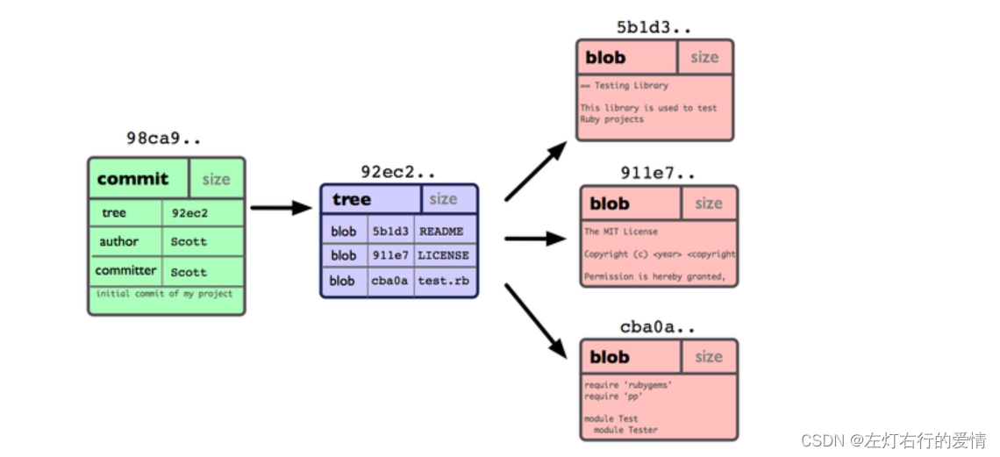

图（1-1）——单个提交对象在仓库中的数据结构

做些修改再次提交，那么这次提交对象包含一个指向上次提交对象的指针（下图中的parent对象）。两次提交后，仓库历史会变成下图的样子：

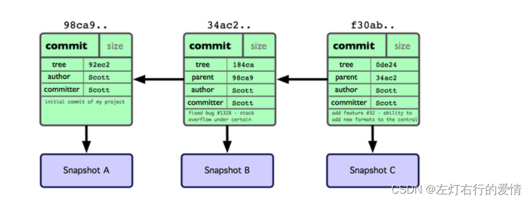  
 图（3-2）——多个提交对象之间的链接关系

---

现在来谈分支。  
 Git分支，本质上仅仅是指向commit对象的可变指针。GIt会使用master作为分支的默认名字。  
 在若干次提交后，我们其实已经有一个指向最后一次提交对象的master分支，它在每次提交的时候都会自动向前移动。  
 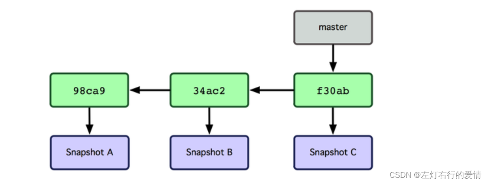  
 图（3-3）——某个提交对象往回看的历史

那么，Git又是如何创建一个新的分支的呢？答案很简单，创建一个新的分支指针。  
 比如新建一个testing分支，我们使用`git branch`命令

```
$ git branch testing


```

这会在当前commit对象上新建一个分支指针：  
 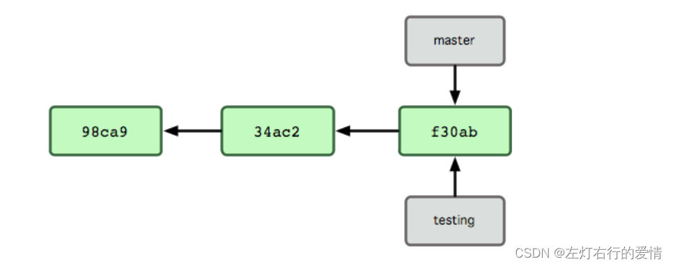  
 图（1-4）——多个分支指向提交数据的历史

有个问题：Git是如何知道你当前在哪个分支上工作的呢？  
 答：它保存着一个名为HEAD的特别指针。  
 在Git中，它表示一个指向你正在工作中的本地分支的指针（理解为当前分支的别名就行）  
 我们之前仅仅是建立一个新的分支，但不会自动切换到这个分支上去，所以我们现在易燃还在master分支里工作：  
 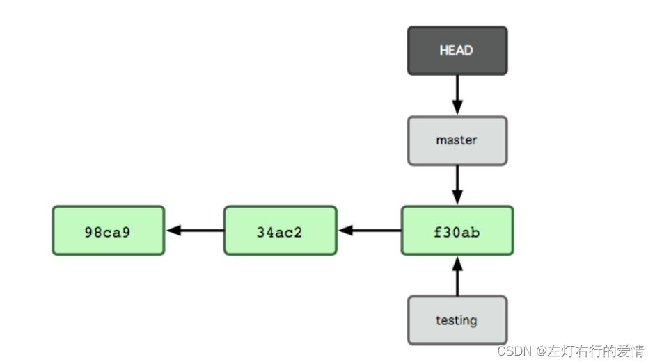  
 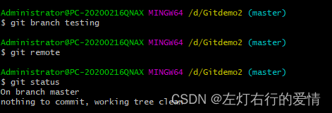  
 如果我们要切换到其他分支，执行`git checkout`命令：  
 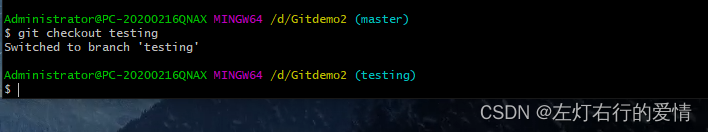  
 这时候HEAD就指向了testing分支：  
 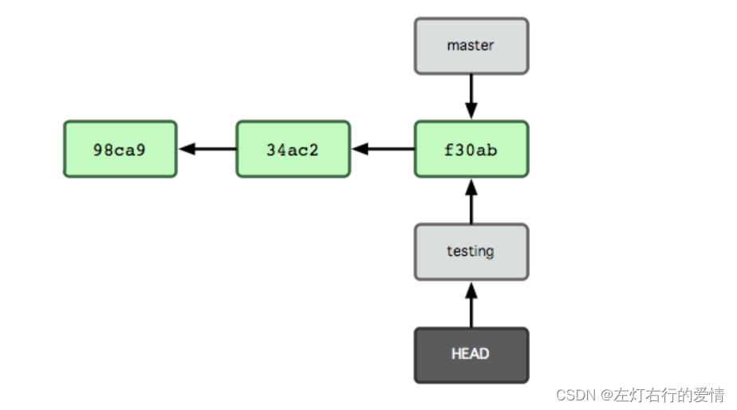  
 图（1-6）——HEAD转换分支时指向新的分支

可能你会问了 ，感觉有点麻烦，这样做带给我们什么好处？

我们再提交一次就可以发现里面的秘密：

```
$ vim test.rb
  $ git commit -a -m 'made a change'


```

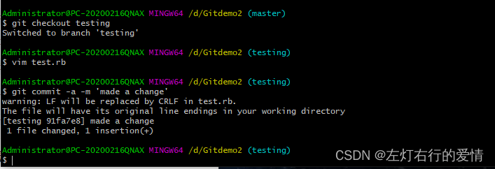  
 展示提交后的结果：  
 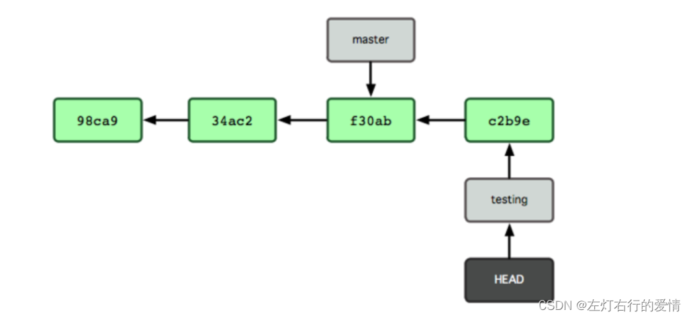  
 图（1-7）——每次提交后HEAD随着分支一起向前移动  
 所以你可以看到，testing向前移动了一格，而master仍然指向原先`git checkout`时所在的`commit`对象，现在我们回到`master`分支看看：

```
$ git checkout master


```

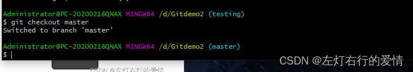  
 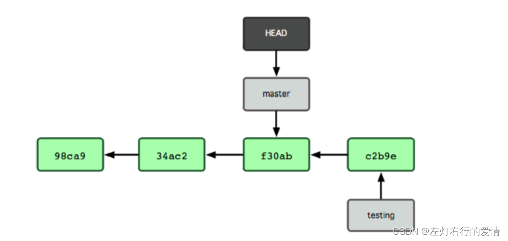  
 图（1-8）——HEAD在一次checkout之后移动到了另一个分支  
 我们解读一下：这条命令做了两件事情，它把HEAD指针移动到了master分支，并且把工作目录中的文件换成了master分支所指向的快照内容。  
 也就是说，现在开始所做的改动，将始于本项目中较老的版本。  
 它的主要作用是将testing分支里作出的修改暂时取消，这样我们就可以向另一个方向进行开发。  
 我们作些修改后再次提交：  
 执行代码

```
$ vim test.rb
    $ git commit -a -m 'made other changes'


```

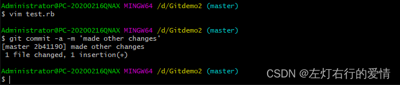  
 现在我们的项目提交历史产生了分叉，因为刚才我们创建了 一个分支，转换到其中做了一些工作，然后又回到原来的主分支进行了另外一些工作。  
 这些改变分别孤立在不同的分支里：我们可以在不同分支里反复切换，并在时机成熟时把它们合并到一起。而所有这些工作，仅仅需要`branch`和`checkout`这两条命令就可以完成。  
 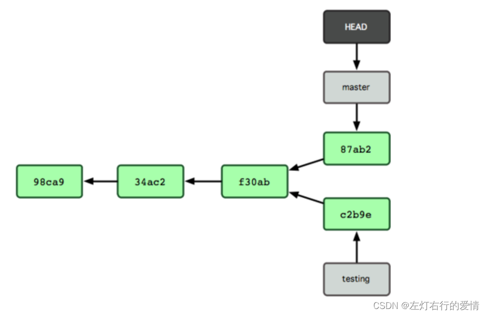  
 图（1-9）不同流向的分支历史  
 由于Git分支实际上仅仅是一个包含所指对象检验和（40个字符长度SHA-1字串）的文件，所以创建和销毁一个分支就变得非常廉价了。

#### 分支的新建与合并

我们举个例子来说：  
 1.开发一个网站。  
 2.实现某个需求，创建一个分支。  
 3.在这个分支上开展工作。  
 此时，突然接到一个电话说出了一个bug很严重需要紧急修补，那么我们可以按照下面的方式处理：  
 1.返回到原先已经发布到生产服务器上的分支。  
 2.为这次紧急修补建立一个新分支，并在其中修复问题。  
 3.通过测试后，回到生产服务器所在的分支，将修补分支合并起来，然后再推送到生产服务器上。  
 4.切换到之前实现新需求的分支，继续工作。

##### 分支的新建与切换

首先，假设你正在项目中工作，并且已经提交了几次更新：  
 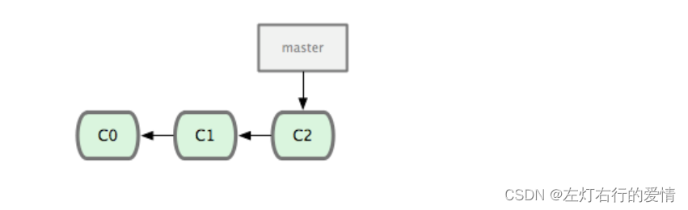  
 图（2-1）——一个提交历史

现在，你需要去修补问题追踪系统上#53问题。  
 这里我们把新建的分支取名为iss53，要新建并切换该分支，运行`git checkout`并加上`- b`参数：

```
$ git checkout -b iss53


```

相当于执行下面两条命令：

```
$ git branch iss53
  $ git checkout iss53


```

该命令执行结果：

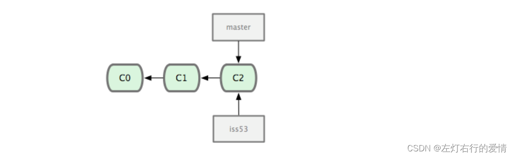  
 图（2-2）——创建了一个新分支的指针。  
 接着你开始尝试修复问题，在提交了若干次更新后，`iss53`分支的指针也会随着向前前进，因为它就是当前分支（换句话说，当前的HEAD指针正指向iss53）：

```
//举个修改的例子
$ vim index.html
   $ git commit -a -m 'added a new footer [issue 53]'


```

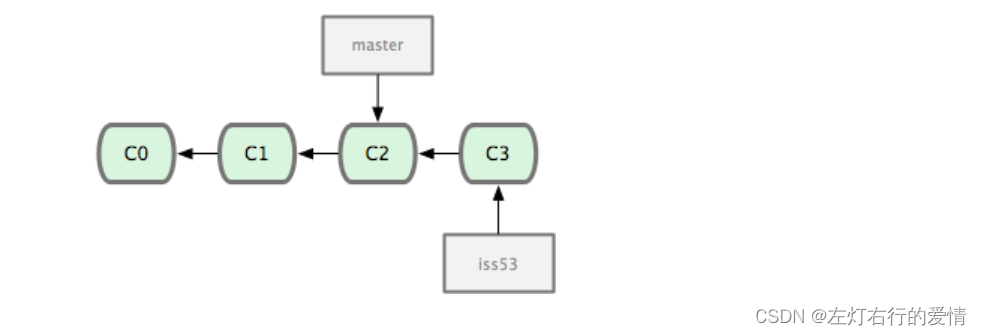  
 图（2-3）——iss53分支随着工作进展向前推进。

现在你接到了网站问题的紧急电话，需要马上修补。  
 有了Git，我们就不需要同时发布这个补丁和iss53里作出修改，也不需要再创建和发布该补丁到服务器之前大费力气来复原这些修改。  
 我们唯一需要做的是切换回master分支。（再次之前，留心你的暂存区或者工作目录里，那些还没有提交的修改，它会和你即将检出的分支产生冲突从而阻止Git切换分支）

切换master分支：

```
$ git checkout master


```

此时工作目录中的内容和你在解决问题#53之前一模一样，我们可以几种精力修补。  
 有一点需要牢记：Git会把工作目录的内容恢复为检出某分支时它所指向的那个提交对象的快照。它会自动添加，删除和修改文件以确保目录的内容和你当时提交的完全一样。

接下来，我们要紧急修补。我们创建一个紧急修补分支`hotfix`来搞定：

```
$ git checkout -b 'hotfix'
  $ vim index.html
    $ git commit -a -m 'fixed the broken email address'


```

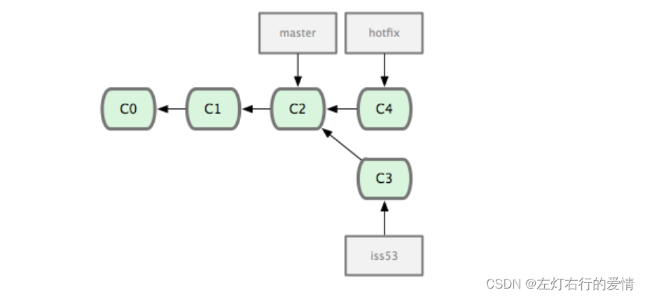  
 图（2-4）——hotfix分支是从master分支所在点分化出来的。  
 有必要做些测试，确保修补是成功的，然后回到master分支把它合并起来，然后发布到生产服务器，用`git merge`命令来进行合并：

```
$ git checkout master
   $ git merge hotfix
   
 Updating f42c576..3a0874c
    Fast forward
    README | 1 -
    1 files changed, 0 insertions(+), 1 deletions(-)


```

注意，合并出现了“Fast forward”的提示。由于当前`master`分支所在的提交对象是要并入的`hotfix`分支的直接上游，Git只需把master分支指针直接右移。换句话说，如果顺着一个分支走下去可以到达另一个分支的话，那么Git在合并两者时，只会简单地把指针右移，因为这种单线的历史分支不存在任何需要解决的分歧，所以这种合并过程可以称为快进（Fast forward）。

现在最新的修改已经在当前master分支所指向的提交对象中了，可以部署到生产服务器上去了。  
 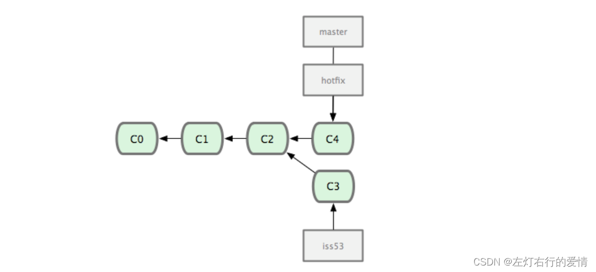  
 图（2-5）——合并之后，master和hotfix分支指向同一位置。

在修补发布之后，你想要回到被打扰之前的工作。  
 由于当前hotfix分支和master分支都指向相同的提交对象，所以hotfix已经完成了历史使命，可以删掉了。  
 使用`git branch -d`选项执行删除操作：

```
$ git branch -d hotfix


```

现在回到之前未完成#53问题修复分支上继续工作：

```
$ git  checkout iss53
  $ vim index.html
   $ git commit -a -m 'finished the new footer' 
      [iss53]: created ad82d7a: "finished the new footer [issue 53]"
    1 files changed, 1 insertions(+), 0 deletions(-)


```

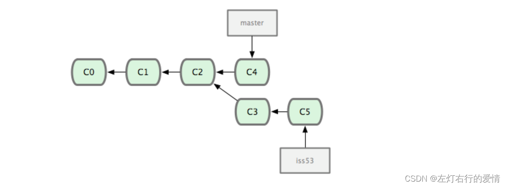  
 图（2-5）——iss53分支可以不受影响继续推进  
 不用担心之前hotfix分支的修改内容尚未包含到iss53中来。  
 如果确实需要纳入此次修补，可以用`git merge master`把master分支合并到iss53；  
 或者等iss53完成之后，再将iss53分支中的更新并入到master。

##### 分支的合并

在问题#53先关的工作完成之后，可以合并回master分支。  
 实际操作同前面合并hotfix分支差不多，只需回到master分支，运行git merge命令指定要合并进来的分支：

```
$ git checkout master
  $ git merge iss53
    Merge made by recursive.
    README | 1 +
    1 files changed, 1 insertions(+), 0 deletions(-)


```

注意，这次合并操作的底层实现，并不同于之前hotfix的并入方式。因为这次你的开发历史是从更早的地方开始分叉的。见（下图3-1）  
 由于当前master分支所 指向的对象（C4）并不是iss53的直接祖先，Git不得不进行一些额外的处理。  
 就此例而言，Git会用两个分支的末端（C4和C5）以及它们的共同祖先进行一次简单的三方合并计算。  
 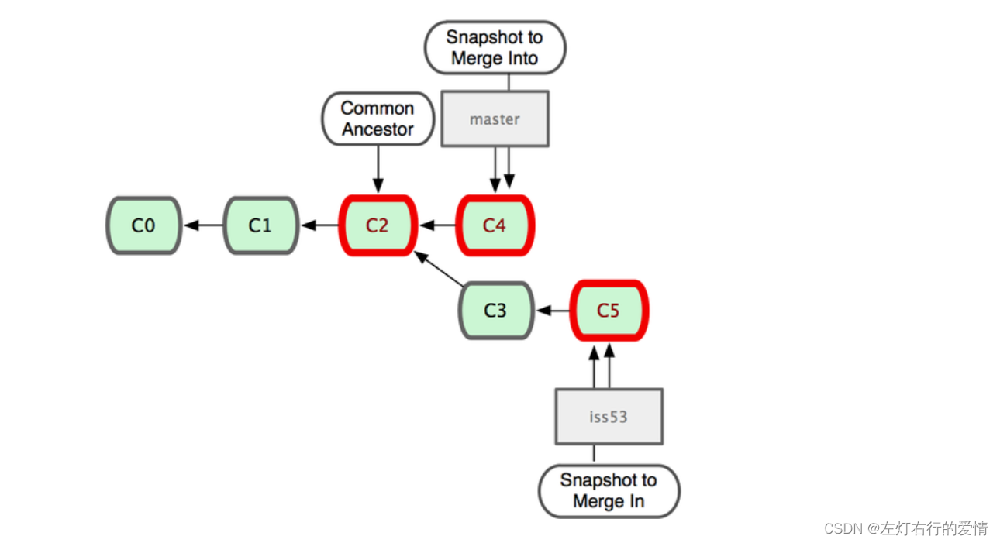  
 图（3-1）——Git分支合并自动识别出最佳的同源合并点。  
 这次Git没有简单地把分支指针右移，而是对三方合并后的结果重新做一个新的快照，并自动创建一个指向它的提交对象（C6）。  
 这个提交对象比较特殊，它有着两个祖先（C4和C5）。  
 值得一提的是Git可以自己裁决哪个共同祖先才是最佳合并基础；  
 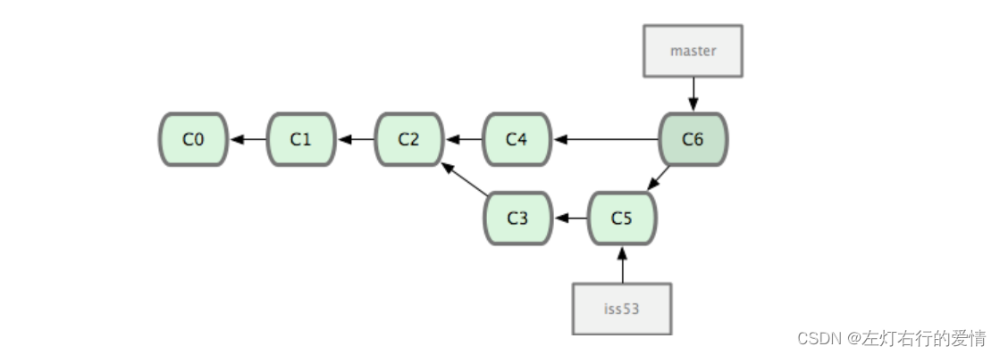  
 图（3-2）——Git自动创建一个包含了合并结果的提交对象。  
 之前工作成功已经合并到了master了，那么iss53也就没用了。你就可以就此删除它，并在问题追踪系统里关闭该问题。

```
$ git branch -d iss53


```

##### 遇到冲突时的分支合并

有时候合并操作并不会如此顺利。  
 如果在不同的分支中都修改了同一个文件的统一部分，Git就无法干净地把两者合到一起。（逻辑上说，这种问题只能由人来裁决）  
 如果你在解决问题#53的过程中修改了hotfix中修改的部分，将得到类似下面的结果：

```
$ git merge iss53
    Auto-merging index.html
    CONFLICT (content): Merge conflict in index.html
    Automatic merge failed; fix conflicts and then commit the result.


```

Git做了合并，但是没有提交，它会停下来等你解决冲突。要看看哪些文件在合并时发生冲突，可以使用`git status`来查看：

```
[master*]$ git status
    index.html: needs merge
    # On branch master
    # Changes not staged for commit:
    # (use "git add <file>..." to update what will be committed)
    # (use "git checkout -- <file>..." to discard changes in working directory)
    #
    # unmerged: index.html
    #


```

任何包含未解决冲突的文件都会以未合并（unmergeed）的状态列出。  
 Git会在有冲突的文件里加入标准的冲突解决标记，可以通过手工定位并解决这些冲突。  
 可以看到文件包含类似下面这样的部分：

```
<<<<<<< HEAD:index.html
    <div id="footer">contact : email.support@github.com</div>
    =======
    <div id="footer">
    please contact us at support@github.com
    </div>
    >>>>>>> iss53:index.html


```

可以看到`=======`隔开的上半部分，是HEAD（即master分支，在运行merge命令时所切换到的分支）中的内容，下半部分是在iss53分支中的内容。  
 解决冲突的办法无非是二者选其一或者我们亲自整合到一起。比如你可以通过这段内容替换为先这样来解决：

```
<div id="footer">
    please contact us at email.support@github.com
    </div>


```

这个解决方案各采纳了两个分支的一部分，还删除了 <<<<<<<，======= 和 >>>>>>> 这些行。  
 在解决了所有文件里的所有冲突后，运行`git add`将它们标记为已解决状态。（实际上就是来一次快照保存到暂存区域）  
 因为一旦暂存，就表示冲突已经解决。如果你想用一个有图形界面的工具来解决这些问题，不妨运行`git mergetool`，它会调用一个可视化的合并工具并引导你解决所有冲突：

```
$ git mergetool
    merge tool candidates: kdiff3 tkdiff xxdiff meld gvimdiff opendiff emerge vimdiff
    Merging the files: index.html

    Normal merge conflict for 'index.html':
    {local}: modified
    {remote}: modified
    Hit return to start merge resolution tool (opendiff):


```

退出合并工具后，Git会询问你合并是否成功。如果回答是，它会为你把相关文件暂存起来，以表明状态为你解决。  
 再运行一次`git status`来确认所有冲突都已解决：

```
$ git status
    # On branch master
    # Changes to be committed:
    # (use "git reset HEAD <file>..." to unstage)
    #
    # modified: index.html
    #


```

如果觉得满意了，并且所有冲突都已经解决，也就是进入了暂存区，就可以用`git commit`来完成这次合并提交。提交的记录差不多是这样：

```
Merge branch 'iss53'

    Conflicts:
    index.html
    #
    # It looks like you may be committing a MERGE.
    # If this is not correct, please remove the file
    # .git/MERGE_HEAD
    # and try again.
    #


```

##### 分支的管理

我们学习了创建，合并和删除分支。除此之外，还需要学习如何管理分支，日后的常规工作中会经常用到下面介绍的管理命令。  
 使用`git branch` 命令 不仅仅能创建爱你和删除分支，如果不加任何参数，它会给出当前所有分支的清单：

```
$ git branch
    iss53
    *master
    testing


```

注意看master分支前的\*字符，它表示当前所在的分支。也就是说，master分支将随着开发进度前移。  
 若要查看各个分支最后一个提交对象的信息，运行`git branch -v`：

```
$ git branch -v
    iss53 93b412c fix javascript issue
    * master 7a98805 Merge branch 'iss53'
    testing 782fd34 add scott to the author list in the readmes


```

要从该清单中筛选出你已经（或尚未）与当前分支合并的分支，可以用`--merge`和`--no-merged`选项。  
 比如`git branch --merge`查看哪些分支已被并入当前分支（哪些分支是当前分支的直接上游）：

```
$ git branch --merged
    iss53
    * master


```

之前我们已经合并了iss53，所以这里会看到它。  
 一般来说，列表中没有\*的分支通常可以用`git branch -d`来删掉。  
 原因很简单，既然已经把它们所包含的工作整合到了其他分支，删掉也不会损失什么。

另外可以用`git branch --no-merged`查看尚未合并的工作：

```
$ git branch --no-merged
    testing


```

它会显示还未合并进来的分支。由于这些分支中还包含着尚未合并进来的分支。由于这些分支还包含着尚未合并进来的工作成果，所以简单地用`git branch -d`删除该分支会提示错误，因为那样会丢失数据：

```
$ git branch -d testing
    error: The branch 'testing' is not an ancestor of your current HEAD.
    If you are sure you want to delete it, run 'git branch -D testing'.


```

不过如果你确实想删除该分支上的改动，可以用大写的删除选项-D强制执行，就像上面提示信息给出的那样。

### 分支开发的工作流程

Git给我们提供了简单的第三方合并，我们反复多次把某个分支合并到另一分支比较方便，每个分支用于完成特定的任务，在开发中，我们可以随时把某个特性分支的成功合并到其他分支中。  
 这些分支全部都是本地分支。当使用分支及合并的时候，一切都是在自己的 Git 仓库中进行的 — 完全不涉及与服务器的交互。

#### 长期分支

开发中习惯于在master分支中保留完全稳定的代码（已发布或即将发布的代码）。  
 同时也有一个develop的平行分支，专门用于后续的开发等，一旦后面代码稳定，就整合到master里。  
 这样就确保合并到主干分支的代码都是稳定并通过测试的，只需要等待下一次发布即可。  
 那么我们可以看出来，上面提交的对象是不断右移的指针。所以稳定分支总是落后的，前沿分支会比较靠前。  
 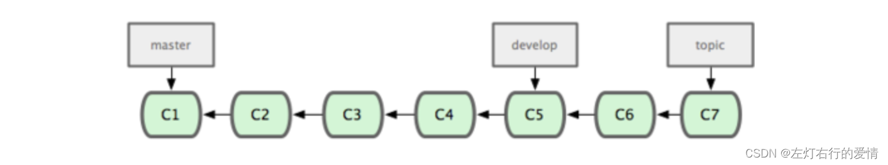  
 也可以想象为工作流水线，经过测试的提交对象集合被筛选到更稳定的流水线。  
 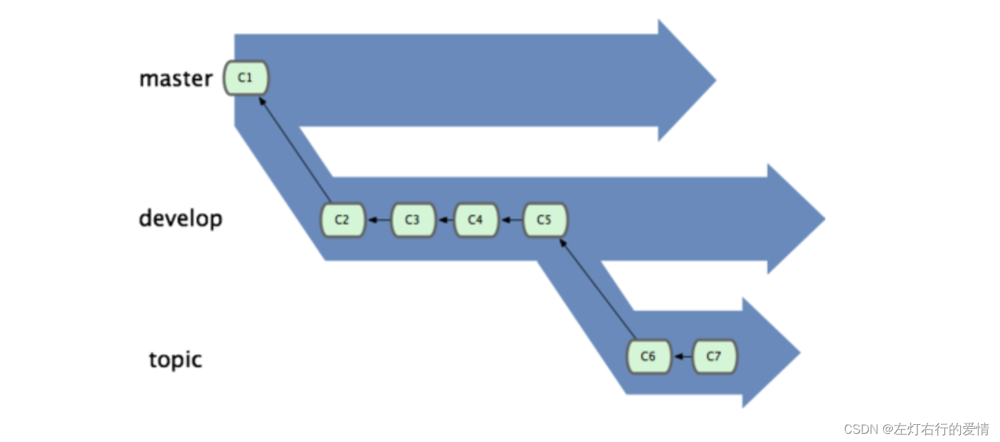

#### 特性分支

特性分支：短期，用来实现单一特性或与其相关工作的分支。

前面我们创建了`iss53` 和`hotfix`这两个特性分支，提交了若干更新后，把它们合并到主干分支，然后删除。  
 所以非常方便我们进行语境切换——因为工作分散在不同的流水线中。

##### 例子

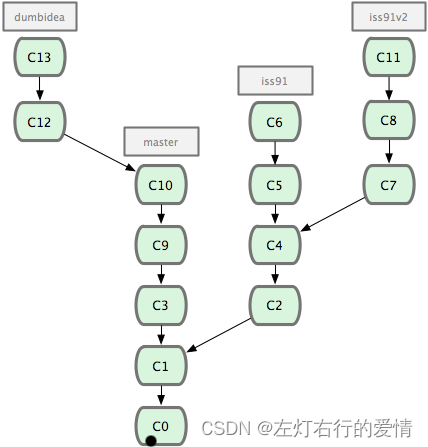  
 图的过程如下：

1. 从master开发到C1，然后开启新分支iss91尝试修复91号缺陷。
2. 提交到C6时，有想出一个解决该问题的办法，从C4分出一个分支iss91v2.
3. 开发到C8时，又回到主干master中提交C9和C10。
4. 再回到iss91v2开发，提交到C11。
5. 又想出一个不确定的方法，从master最新提交的C10处开一个新分支dumbidea做试验。  
    现在，假设我们做两件事情：
6. 最终决定使用第二个解决方案——iss91v2的方法。
7. 抛弃原来iss91分支，合并dumbidea分支 到master分支中。  
    最后结果如图所示：  
    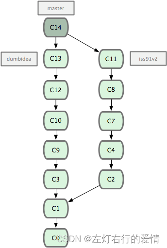

#### 远程分支

远程分支：远程仓库中的分支索引，无法移动的本地分支，只有在git进行网络交互时才会更新。  
 下面用（远程仓库/分支名）来表示远程分支。  
 比如：origin 仓库网络通讯时 master 分支的样子——origin/master 分支。

远程分支会有一点难解释，远程分支虽然方便，但是也会有很多问题，参考书中说的也不是很明白，我整理后发现好一些，希望你能看明白。

假设团队有个地址为`git.ourcompany.com`的Git服务器。当我们开始克隆时，git自动为我们将远程仓库命名为origin，并下载所有数据，建立一个指向它的master分支指针，在本地命名为`origin/master`（但是我们无法更改其数据。  
 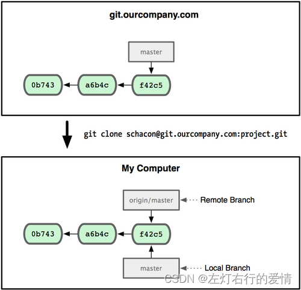

**背景：**  
 我们在master分支做了改动，与此同时，其他人也向仓库推送了他们的更新，那么服务器上master分支就会向前推进。  
 我们本地的提交历史正朝不同方向发展，但是只要不和服务器通讯，`origin/master` 指针仍然保持原位不会移动。  
 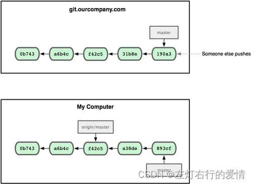  
 我们可以运行命令`git fetch origin`来同步远程服务器上的数据到本地。该命令会找到origin是哪个服务器，从上面获取你尚未拥有的数据，更新你本地的数据库，然后把`origin/master`的指针移到它最新的位置上。  
 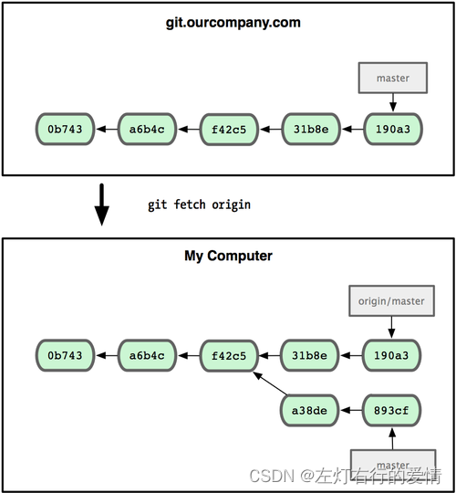  
 为了演示拥有多个远程分支（在不同的远程服务器上）的项目是如何工作的，假设还有一台内部服务器`git.team1.ourcompany.com`，这里命名teamone（代替完整git url，方便使用）。  
 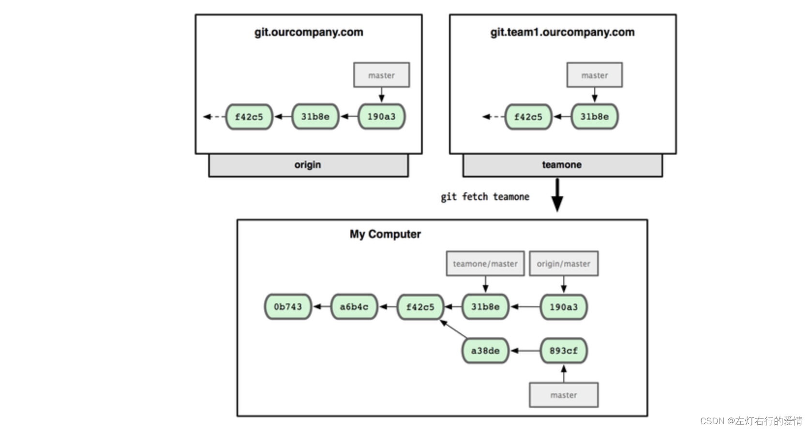  
 我们使用`git fetch teamone` 来获取小组服务器上还没有的数据。  
 由于当前该服务器上的内容是origin服务器的子集，所以不会下载任何数据，而只是简单地创建一个名为`teamone/master`的远程分支，指向teamone服务器上master分支所在的提交对象31b8e。

##### 推送本地分支

和别人分享某个本地分支，需要把它推送到一个你拥有写权限的远程仓库。  
 我们创建的本地分支不会因为写入而被自动同步到引入的远程服务器上，需要明确执行推送分支的操作。对于无意分享的分支，我们可以尽管保留为私人分支好了，而只推送那些协同工作要用到的特性分支。

假如你有`serverfix`的分支和别人一起开发，可以运行`git push (远程仓库名)(分支名)`:

```
$ git push origin serverfix
    Counting objects: 20, done.
    Compressing objects: 100% (14/14), done.
    Writing objects: 100% (15/15), 1.74 KiB, done.
    Total 15 (delta 5), reused 0 (delta 0)
    To git@github.com:schacon/simplegit.git
    * [new branch] serverfix -> serverfix


```

接下来，别人再次从服务器上获取数据时，他们将得到一个新的远程分支`origin/serverfix`，并指向服务器上`serverfix`所指向的版本：

```
$ git fetch origin
    remote: Counting objects: 20, done.
    remote: Compressing objects: 100% (14/14), done.
    remote: Total 15 (delta 5), reused 0 (delta 0)
    Unpacking objects: 100% (15/15), done.
    From git@github.com:schacon/simplegit
    * [new branch] serverfix -> origin/serverfix


```

在 fetch 操作下载好新的远程分支之后，仍然无法在本地编辑该远程仓库中的分支。换句话说，在本例中，你不会有一个新的 serverfix 分支，有的只是一个你无法移动的 origin/serverfix 指针。

如果想要一份自己的 serverfix 来开发，可以在远程分支的基础上分化出一个新的分支来：

```
$ git checkout -b serverfix origin/serverfix
    Branch serverfix set up to track remote branch refs/remotes/origin/serverfix.
    Switched to a new branch "serverfix"


```

这会切换到新建的 serverfix 本地分支，其内容同远程分支 origin/serverfix 一致，这样你就可以在里面继续开发了。

##### 跟踪远程分支

跟踪分支：从远程分支**checkout**出来的**本地分支**，和某个远程分支有直接联系的本地分支。  
 在跟踪分支中输入`git push`，git会自行判断应该向哪个服务器的哪个分支推送数据。  
 如果输入`git pull`，git会回去所有远程索引，并把他们的数据都合并到本地分支。

##### 删除远程分支

如果不需要某个远程分支，可以用`git push [远程名]:[分支名]`。  
 举个🌰：

```
$ git push origin :serverfix
    To git@github.com:schacon/simplegit.git
    - [deleted] serverfix


```

#### 分支的衍合

一个分支的修改整合到另一个分支的办法有两种：merge，rebase。

##### 基本的衍合

###### merge

现在我们有分叉情景，各自提交了更新。  
 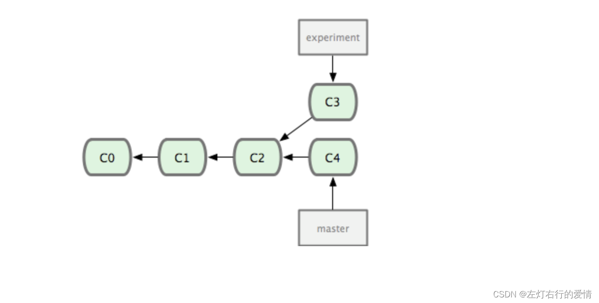  
 我们可以通过merge命令，它会把上面两个分支最新的快照（C3和C4）以及二者最新的共同祖先（C2）进行三方合并，合并后会产生一个新的提交对象（C5），如下图：  
 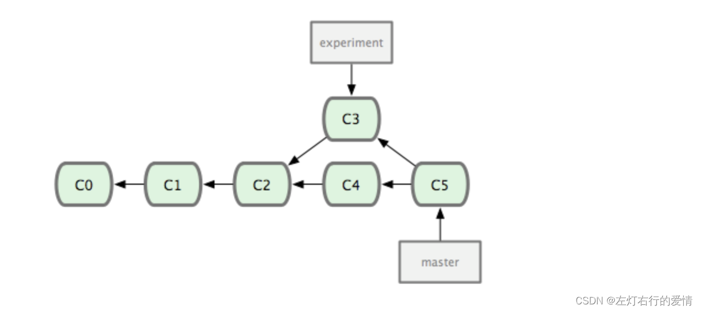

###### rebase

我们还有一个选择，就说在C3里产生的变化补丁在C4的基础上重新打一遍。这种操作叫做衍合（rebase）。有了它，我们可以把一个分支里提交的改变转移到另一个分支里重放一遍。

```
$ git checkout experiment
    $ git rebase master
    First, rewinding head to replay your work on top of it...
    Applying: added staged command


```
