> 原文：[CSDN](https://blog.csdn.net/qq_45852626/article/details/128272455)（历史文章导入，当前状态为草稿）

## 前言

这篇文章会以图片+代码+自己理解的例子作为出发点，引导式学习，全文参考书籍和大牛博客，文章是我总结+自己理解的一个笔记。  
 后续开一个专辑来深入详细聊一聊Git，每个例子都是我手动测试过的，跟着跑没有问题，如果有问题的话，欢迎留言私信一起讨论。

## 版本控制

版本控制是记录一个或若干文件内容的变化，以便于将来查询特定版本修订情况的系统。  
 采用
版本控制系统 
（Version-Controll-System，VCS）是一个非常好的选择，利用它你可以做到将某个文件或者整个项目回退到某个时间点状态。  
 也可以比较文件的变化细节，找出最后谁修改了哪些地方，找出怪异问题的出现原因等待。

### 本地版本控制系统

我之前就是习惯复制整个项目目录来保存不同版本（同时改名+备份时间）。  
 好处在于：简单，无脑用。  
 坏处：容易混淆所在的目录，而且文件一丢，数据没办法撤销恢复。  
 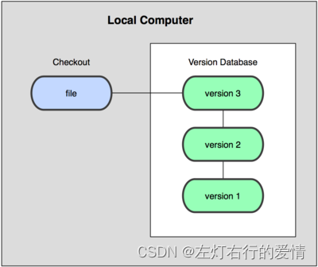

### 集中化版本控制系统

如果是在不同系统上开发者如何协同工作呢？  
 集中化版本控制系统（Centralized Version Control Systems，CVCS）应运而生。  
 有一个单一的集中管理的服务器，保存所有文件的修订版本，协同工作的人通过客户端连到这台服务器，取出最新的文件或者提交更新。  
 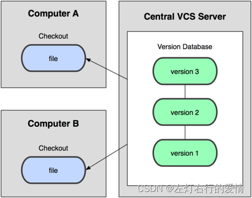  
 好处：  
 相比于老式的本地VCS来说，每个人都可以一定程度看到项目中其他人在干什么。  
 管理员可以轻松掌握开发者权限，并且管理CVCS比各个客户端维护本地数据库来的容易。  
 坏处：  
 如果中央服务器出现单点故障，如果宕机，那么谁都无法提交更新；  
 如果是磁盘发生故障，碰巧没做备份，就有丢失数据的风险。

### 分布式 控制系统

根据上述的情况，分布式控制系统（Distrubuted Version Control System，简称DVCS）面世了。  
 客户端并不只是提取最新版本的文件快照，而是把代码仓库完整地镜像下来。  
 如果任何一处协同工作用的服务器发生故障，事后都可以用任何一个镜像出来的本地仓库回复。  
 因为每一次的提取操作，实际上都是一次对代码仓库的完整备份。  
 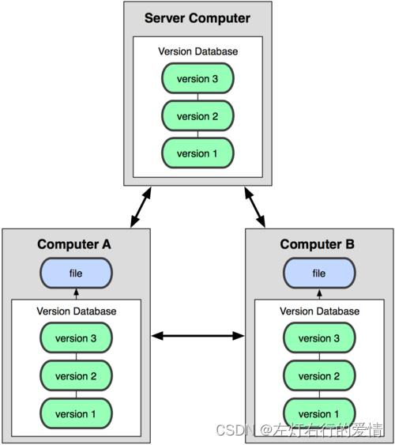

## Git使用详解

### Git基础理解

* 直接记录快照，而非差异比较  
   Git和其他版本控制系统的主要差异在于，Git只关心文件**数据的整体是否发生变化**，而大多数其他系统则只关心文件内容的具体差异。  
   举个例子：  
   比如CVS每次记录有哪些文件作了更新，以及都更新了哪些行的内容，如下图：  
   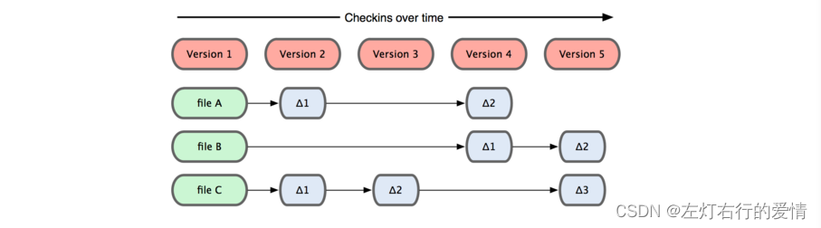  
   而对于Git则并不保存这些前后变化的差异数据。  
   实际上，Git更像是把变化的文件作**快照**后，记录在一个微型的文件系统中。  
   每次提交更新时，它会纵览一遍所有文件的指纹信息并对文件作一快照，然后保存一个指向这次快照的**索引**。  
   若文件没有变化，Git不会再次保存，而只对上次保存的快照作一链接，如下图：  
   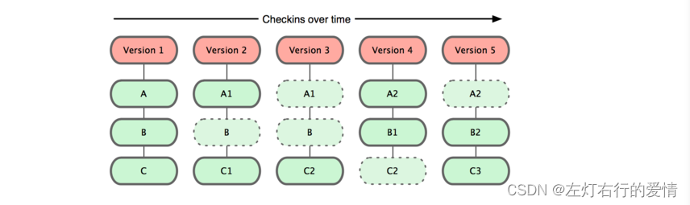
* 近乎所有操作都是本地执行  
   Git的绝大多数操作都只需要访问本地文件和资源，不用联网，如果你用CVCS的话，基本上所有操作都需要联网。  
   因为Git在本地磁盘就保存着所有当前项目的历史更新，所以处理起来速度也快。  
   举个例子：  
   背景：你需要浏览项目的历史更新摘要。  
   Git——本地数据库读取后展示给你看，可以马上翻阅，无需等待。如果你想看当前版本的文件和一个月前的版本之间有什么差异，Git会取出一个月前的快照和当前文件作一次差异运算，而不用请求远程服务器来做这件事，或者是把老版本拉到本地来作比较。  
   CVCS——没有网络或断开VPN你无法做任何事情。
* 时刻保持数据完整性  
   在保存到Git之前，所有数据都要进行内容的\*\*校验和（checksum）\*\*计算，并将此结果作为数据的唯一标识和索引。  
   也就是说，你修改文件或者目录后，Git会不知道。  
   这项特性作为Git设计哲学，在整体架构的最底层。  
   如果文件在传输时不完整，或者磁盘损坏导致文件数据缺失，Git都能立即察觉。  
   Git使用SHA-1算法计算校验和，通过对文件的内容和目录的结构计算出一个SHA-1哈希值，作为指纹字符串。  
   举个例子：  
   `24b9da6552252987aa493b52f8696cd6d3b00373`  
   Git的工作完全依赖于这类指纹字符串，所以你会经常看到这样的哈希值。实际上，**所有保存在Git数据库中的东西都是用此哈希值来作索引的，而不是靠文件名。**
* 多数操作仅添加数据  
   常用Git操作大多仅仅是把数据添加到数据库中。  
   因为任何一种不可逆操作：比如删除数据；都会使回退或者重现历史版本变得困难重重。  
   在别的VCS中，若还没有提交更新，就有可能丢失或者或者混淆一些修改的内容。  
   但在Git里，一旦提交快照之后就完全不用担心丢失数据，特别是养成定期推送到其他仓库的习惯。  
   这种搞可靠性会有很高的安全性。
* 文件的三种状态  
   对于任何一个文件，在Git内都只有三种状态：已提交（Committed），已修改（Modified）和已暂存（Staged）。  
   已提交：表示该文件已经被安全地保存在本地数据库中了；  
   已修改：修改了某个文件，但还没有提交保存；  
   已暂存：把已修改的文件放在下次提交时要保存的清单中。  
   在Git管理项目时，文件流转的三个工作区域：Git的工作目录，暂存区域，以及本地仓库。  
   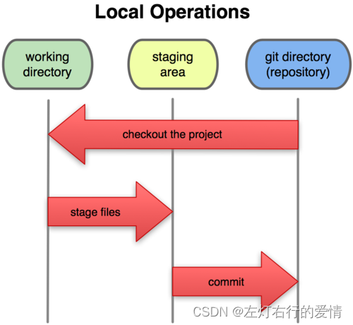  
   每个项目都有一个Git目录（如果是git clone出来的话，就是其中.git目录；  
   如果是git clone -bare的话，新建的目录本身就是git目录），它是Git用来保存元数据和对象数据库的地方。  
   该目录非常重要，每次克隆镜像仓库时，实际拷贝就是这个目录里面的数据。  
   从项目中取出某个版本的所有文件和目录，用以开始后续工作叫做工作目录。  
   这些文件实际上都是**Git目录中的压缩对象数据库**中提取出来的，接下来就可以在工作目录中对这些文件进行编辑。  
   所谓暂存区域只不过是个简单的文件，一般都放在Git目录中。有时候会被称为索引文件，但标准说法还是暂存区域。

基本的Git工作流程如下：

1. 在工作目录中修改某些文件
2. 对修改后的文件进行快照，然后保存到暂存区域
3. 提交更新，将保存在暂存区域的文件快照永久转储到Git目录中。

所以我们我从文件所处位置来判断状态：  
 如果是Git目录中保存着特定版本文件，就属于已提交状态；  
 如果作了修改并放入暂存区域，就属于已暂存状态；  
 如果自上次取出后，作了修改但还没有放到暂存区域，就是已修改状态。

### Git基础指令

#### 取得项目的Git仓库

取得Git项目仓库的方法有两种：一——现存目录下，通过导入所有文件来创建新的Git仓库；二——从已有的Git仓库克隆出一个新的镜像仓库来。

* 在工作目录中初始化新仓库  
   要对现有的某个项目开始用Git管理，只需到此项目所在的目录，执行：

```
git init


```

初始化后，在当前目录下出现一个名为.git的目录，所有Git需要的数据和资源都存放在这个目录中。（不过目前，仅仅是按照既有的结构框架初始化里面所有的文件和目录，还没有开始跟踪管理项目中的任何一个文件）

这里我们先进到E盘中，然后调用git init，效果如下：  
 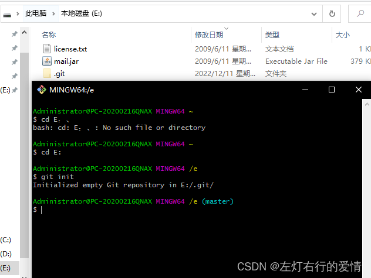  
 .git里面的目录结构：  
 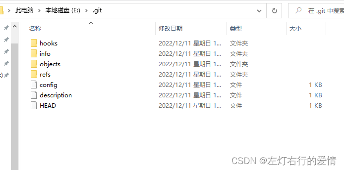

如果当前目录下有几个文件想要纳入版本控制，需要先用git add命令告诉Git开始对这些文件进行跟踪，然后提交：

```
 git add *.c
    $ git add README
    $ git commit -m 'initial project version'


```

这些我们后面解释，现在我们得到了一个维护若干文件的Git仓库。

* 从现有仓库克隆  
   如果想对某个开源项目出一份力，先把这个项目的Git仓库复制一份出来，使用`git clone`命令。  
   克隆仓库的命令格式为：`git clone [url]`。  
   比如，要克隆gitee上一个项目，我们只需要拿到它的URL连接。

```
git@gitee.com:xxx/Spring-shiro.git


```

这会在当前目录下创建一个名为Spring-shiro的目录，其中包含了一个.git目录，用来保存下载下来的所有版本记录，然后从中取出最新版本的文件拷贝。  
 如果你进去这个新建的目录，你会看到项目中所有文件已经在里面了，准备好后续的开发和使用。  
 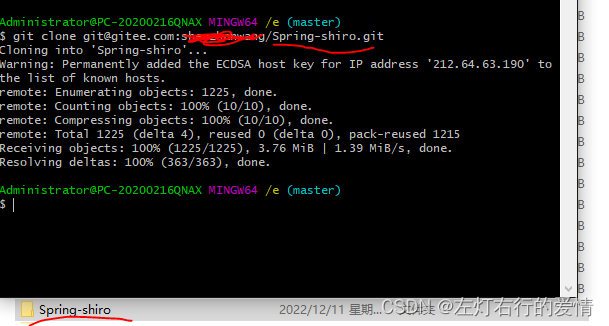  
 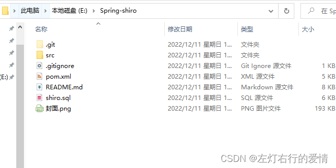

#### 记录每次更新的仓库

现在我们手上有了一个真实项目的Git仓库，并从这个仓库取出了所有文件的工作拷贝。  
 对这些文件进行修改，在完成一个阶段的目标之后，提交本次更新到仓库。

注意：工作目录下面的所有文件都不外乎两种状态——已跟踪或未跟踪。  
 已跟踪——本来就纳入版本控制管理的文件，在上次快照中有它们的记录，工作一段时间后，它们的状态可能是未更新，已修改或者已放入暂存区。  
 而其他文件都属于未跟踪文件——它们没有上次更新的快照，也不在当前的暂存区域。  
 初次克隆某个仓库时，工作目录中的文件都属于已跟踪文件，且状态为未修改。  
 在编辑过某些文件之后，Git将这些文件标为已修改。  
 我们逐步将这些**修改过的文件放到暂存区域**，直到最后一次性提交所有这些暂存起来的文件，如此重复。  
 如下图所示：  
 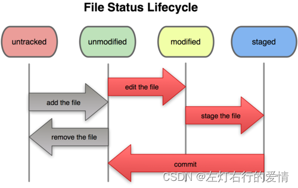

##### 检查当前文件状态

要确定哪些文件当前处于什么状态，可以用git status 命令。  
 如果在克隆仓库之后立即执行此命令，会看到类似这样的输出：

```
git status


```

如果你看见这样的输出：  
 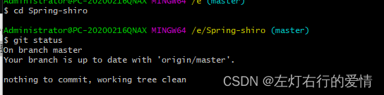  
 说明你现在的工作目录相当干净。也就是说，所有已跟踪文件在上次提交后都未被更改过。  
 上面信息还显示了：  
 当前目录没有出现任何处于未跟踪的新文件。（否则会列出来）  
 显示了当前所在的分支是master，这是默认的分支名称。

接着我们用vim创建一个新文件 Wang，保存退出后运行git status会看见该文件出现在未跟踪文件列表中：  
 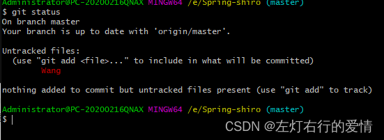  
 状态报告中可以看到新建的Wang文件出现在Untracked files下面。  
 未跟踪的文件意味着Git在之前的快照（提交）中没有这些文件；  
 Git不会自动将之纳入跟踪范围，除非你明明白白地告诉它“我需要跟踪该文件”，因而不用担心把临时文件什么的也归入版本管理（只不过在这个例子中，我们确实想要跟中Wang这个文件）

##### 跟踪文件

使用命令git add开始跟踪一个新文件。所以要跟踪Wang文件，运行：

```
git add Wang


```

使用命令git add开始跟踪一个新文件，所以，要跟踪Wang文件，运行：

```
git add Wang


```

此时再运行 git status命令，会看到Wang文件已被跟踪，并处于暂存状态：  
 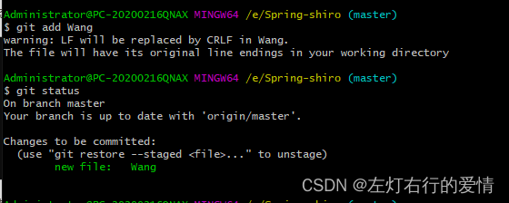  
 只要在“Changes to be Committed”这行下面的，就说明是已暂存状态。  
 如果此时提交，那么该文件此时此刻的版本将被留存在历史记录中。  
 你可能会想起之前我们使用git init后就运行了git add命令，开始跟踪当前目录下的文件。  
 在git add后面可以指明要跟踪的文件或目录路径。  
 如果是目录的话，就说明要递归跟踪该目录下的所有文件。（其实，git add的潜台词就是把目标文件快照放入暂存区域）

##### 暂存已修改文件

现在我们修改下之前跟踪过的文件Wang，再次运行status命令，会看到这样的状态报告：  
 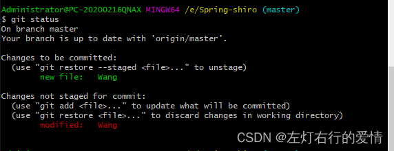  
 文件Wang出现在Changes not staged for committed下面，说明已跟踪文件的内容发生了变化，但还没有放到暂存区。要暂存这次更新，需要运行git add命令（这是个多功能命令，根据目标文件状态不同，此命令效果也不同：可以用于跟踪新文件，或者把已跟踪的文件放到暂存区，还能用于合并时把有冲突的文件标记为已解决状态等）。  
 现在让我们运行git add将Wang放在缓存区，然后再看看git status 的输出：  
 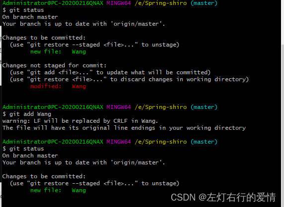  
 下次提交就会记录到仓库中。假设此时，你想要在Wang里加条注释，重新编辑存盘后提交，且慢！再运行git status看一下：  
 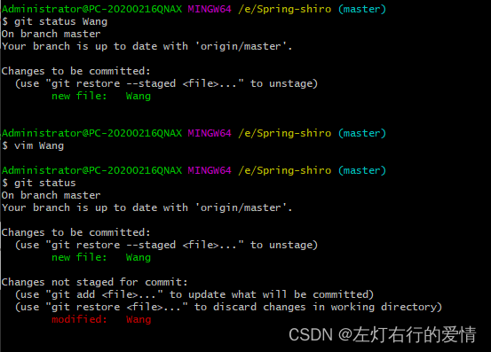  
 什么情况？Wang文件出现了两次？！  
 一次是未暂存，一次是已暂存，怎么回事呢？  
 实际上Git暂存了你运行git add 命令时的版本，如果现在提交，提交的是添加注释前的版本，而非当前工作目录的版本，所以当我们运行git add后再做修订的文件，需要重新运行git add把最新版本的重新暂存起来。  
 如下图：  
 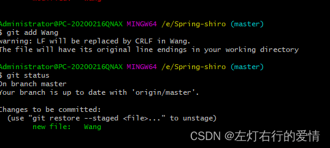

##### 忽略某些文件

有些文件无需纳入Git管理，我们也不希望它们总出现在未跟踪文件列表。  
 通常一些自动生成的文件（日志文件，编译过程中创建的临时文件等），我们可以创建一个名为.gitignore文件，列出要忽略的文件模式，举个实际例子：

```
cat .gitignore
    *.[oa]    //忽略所有以.o或.a结尾的文件。（一般这类对象文件和存档文件都是编译过程出现的，我们用不着跟踪它们的版本）
    *~         //忽略所有以波浪符（~）结尾的文件。（许多文本编译软件都用这样的文件名来保存副本）


```

此外，你可能还需要忽略log，tmp或pid目录，以及自动生成的文档。  
 要养成一开始就设置好.gitignore文件的习惯，以免将来误提交这类无用的文件。  
 文件.gitignore的格式规范如下：

* 所有空行或者以注释符号#开头的行都会被Git忽略
* 可以使用标准的glob模式匹配（指shell使用的简化了正则表达式）
* 匹配模式最后跟反斜杠(/)说明要忽略的是目录
* 要忽略指定模式以外的文件或目录，可以在模式前加上惊叹号（！）取反。

举个例子吧：

```
# 此为注释 – 将被 Git 忽略
    # 忽略所有 .a 结尾的文件
    *.a
    # 但 lib.a 除外
    !lib.a
    # 仅仅忽略项目根目录下的 TODO 文件，不包括 subdir/TODO
    /TODO
    # 忽略 build/ 目录下的所有文件
    build/
    # 会忽略 doc/notes.txt 但不包括 doc/server/arch.txt
    doc/*.txt


```

##### 查看已暂存和未暂存的更新

git status的显示比较简单，仅仅是列出修改过的文件；  
 如果想看具体修改了什么，就可以用git 
diff 
命令。  
 它可以回答我们两个问题：  
 当前做的哪些更新还没有暂存？  
 有哪些更新已经暂存起来准备好了下次提交？  
 git diff会使用文件补丁的格式显示具体添加和删除的行。

创建一个新文件benchmarks.rb,编辑后把最新版本暂存下来：  
 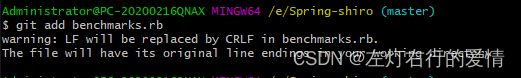

再次修改benchmarks.rb不暂存,运行status命令将会看到：  
 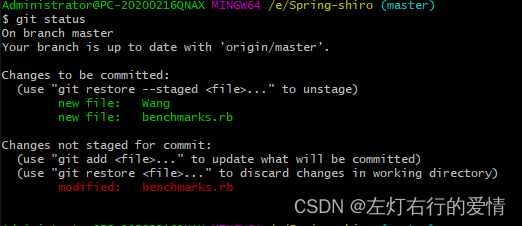  
 （这里请忽略Wang）  
 要查看尚未暂存的文件更新了哪些部分，不加参数直接输入git diff：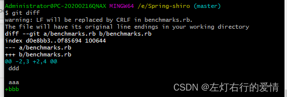  
 此命令比较的是工作目录中当前文件和暂存区域快照之间的差异，也就是**修改之后还没有暂存起来的变化内容**。

* 如果你想看已经暂存起来的文件和上次提交时的快照之间的差异，可以用 `git diff --cached`命令:  
   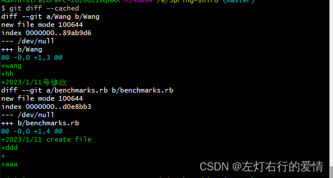

##### 提交更新

现在暂存区域已经准备妥当可以提交了。  
 在此之前，一定要确认还有什么修改过的或新建的文件还没有git add过，否则提交的时候不会记录这些还没暂存起来的变化。所以，每次提交前，先用git status 看下，是不是都已经暂存起来了，然后再运行提交命令 git commit

```
$ git commit


```

这种方式会启动文本编译器**以便输入本次提交的说明**。  
 编译器会显示类似下面的文本信息：  
 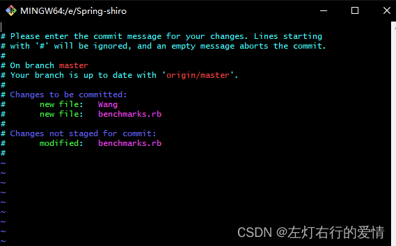  
 可以看到，默认的提交消息包含最后一次运行git status 的输出，放在注释里。

另外也可以用 -m参数后跟提交说明的方式，在一行命令中提交更新：  
 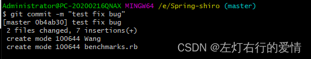  
 现在你已经完成了你第一个提交！提交后我们可以看出来，是在哪个分支（master）提交的，本次提交的完整SHA-1校验和是什么（0b4ab30），以及在本次提交后，有多少文件修订过，多少行添改和删改过。

**需要注意的是：提交时记录的是放在“暂存区域”的快照，任何还未暂存的仍然保持已修改的状态，可以在下次提交时纳入版本管理。每一次运行提交操作，都是对你项目作一次快照，以后可以回到这个状态，或者进行比较**

##### 跳过使用暂存区域

尽管使用暂存区域的方式可以精心准备要提交的细节，但有时候这么做略显繁琐。  
 Git就会自动把所有已经跟踪过的文件暂存起来一并提交，从而跳过git add步骤：  
 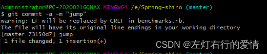  
 我们上面是不需要再去git add 文件了。很方便吧^ ^。

##### 移除文件

在Git中重命名某个文件，仓库中存储的元数据并不会体现出这是一次改名操作。  
 不过Git会推断出究竟发生什么。  
 要在Git中对文件改名，用下面这个命令：

```
$ git mv file_from  file_to


```

实际上，即使此时查看状态信息，也会明白无误地看到关于重命名操作的说明：  
 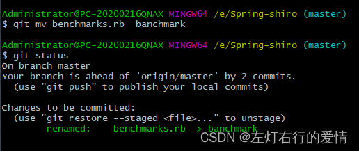  
 其实，运行git mv 就相当于运行了下面三个命令：

```
$ mv benchmarks.rb  benchmark
$ git rm  benchmarks.rb
$ git add benchmark 


```

如此分开的操作，Git也会意识到这是一次改名，五哦一不管何种方式都一样。  
 不过有时候用其他工具批处理改名的话，要记得在提交前删除老的文件名，再添加新的文件名。

#### 远程操作的使用

同他人协作开发某个项目时，需要管理这些远程仓库，以便推送或拉取数据，分享各自的工作进展。  
 管理远程仓库的工作，包括添加远程库，移除废弃的远程库，管理各式远程库分支，定义是否跟踪这些分支，等等。

##### 查看当前的远程库

查看当前配置有哪些远程仓库，可以用git remote 命令，它会列举每个远程库的简短名字。  
 在克隆完某个项目后，至少可以看到一个名为
origin
的远程库，Git默认使用这个名字来标识你所克隆的原始仓库：  
 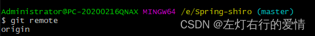  
 可以在这个命令后面加“-v”选项（verbose的简写，取首字母），显示对应的克隆地址：  
 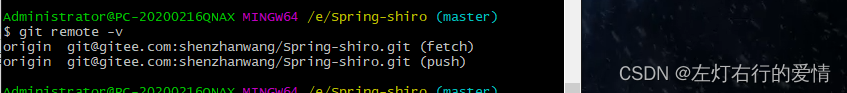  
 如果有多个仓库，则会全部取出。

---

##### 换项目举例

**这里我们换个栗子去举例，我们现在有个项目叫做springaop，  
 我们会通过这个项目去展示下面的内容。**

##### 添加远程仓库

先指定一个简单的名字，以便将来引用 ，运行指令

```
git remote add [shortname] [url]


```

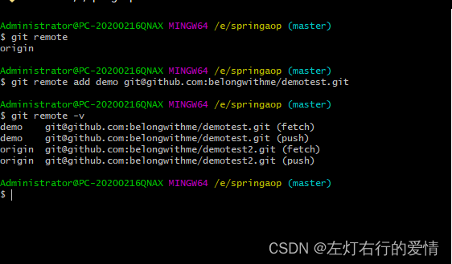

现在我们可以使用字符串demo代指对应的仓库地址了。  
 举个栗子：  
 我们要抓取所有demo有的的，但是本地仓库没有的，可以运行git fetch demo：

```
git fetch demo
```
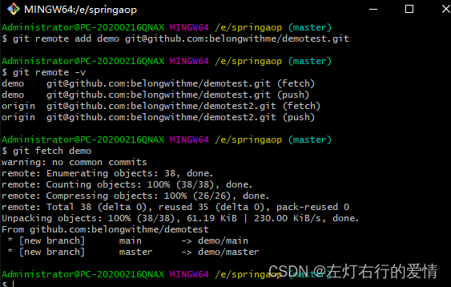
现在demo的主干分支（master）已经完全可以在本地访问了，对应的名字是demo/master，你可以将它合并到自己的某个分支，或者切换到这个分支，看可有些什么有趣的更新。

#### 推送数据到远程仓库
项目进行到一个阶段，要同别人分享目前的成果，可以将本地仓库中的数据推送到远程仓库。
实现这个任务的命令很简单：```$ git push 【remote-name】【branch-name】```。
如果要把本地的master分支推送到oringin服务器上（克隆操作会自动使用默认master和origin的名字），可以运行下面命令：
```bash
$ git push origin master


```
