> 原文：[CSDN](https://blog.csdn.net/qq_45852626/article/details/125694580)（历史文章导入，当前状态为草稿）

### 简介

#### ArrayList是 Java 集合中出场率最多的一个类。

底层是基于数组实现，根据元素的增加而动态扩容，可以理解为它是加强版的数组。**ArrayList允许元素为null**。它是线程不安全的，**在多线程下**，不建议使用ArrayList。

#### 结构图

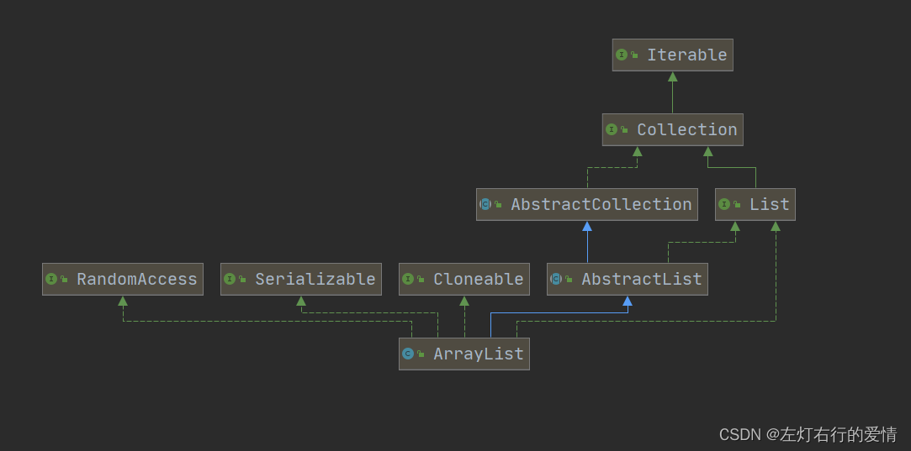  
 代码实现（实现继承关系)：  
 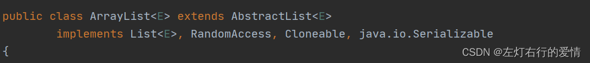

1. AbstractList：继承AbstractList抽象类，使用实现的公共方法。  
    解读：  
    AbstactList:查看Java Doc发现**此类提供List接口的基本实现**，以最大程度地减少实现由“随机访问”数据存储（例如数组）支持的此接口所需的工作。 对于顺序访问数据（例如链表），应优先使用AbstractSequentialList代替此类。  
    对于这段话的解释，我刚开始是比较蒙的，平时也没有接触过，后来学习后发现里面大有文章。

首先给出两个图  
 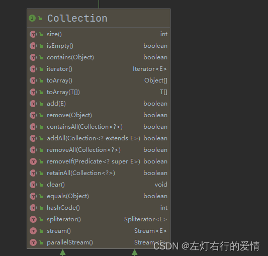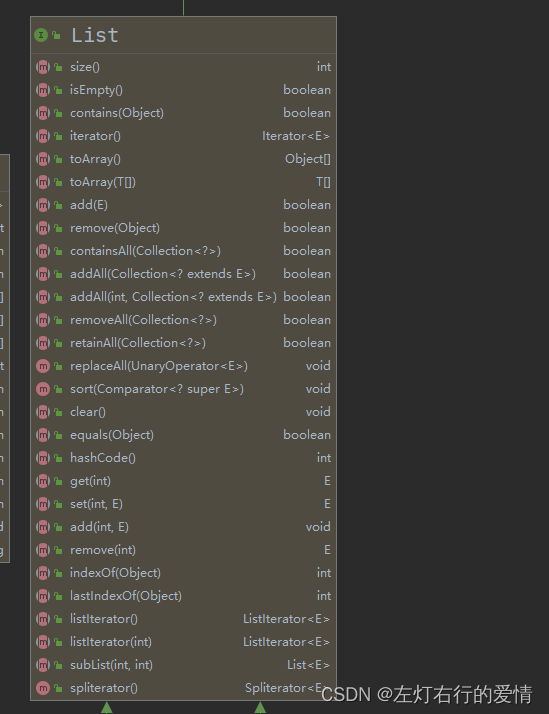  
 List 接口继承了 Collection 接口，在 Collection 接口的基础上增加了一些方法。  
 对比 Collection 接口，可以发现，**List 加了很多根据下标操作集合的方法**，所以当你要分析方法的抽象方法是来自于List还是Collection时，你可以观察一下参数里面是否有下标，如果有就是来自List，没有就是Collection。综上我们了解到了，**List接口在Collection基础上，进一步加强了List根据下标去操作的特性**。

有了这个铺垫，结合上面给的AbstractList概念，我们再来看AbstractList 抽象类:  
 我们现在已经了解到了**此类提供List接口的基本实现**，它是对 List 接口的初步实现，也是对 Collection 的进一步实现。**进一步解释就是实现了 List 的抽象类，他实现了 List 接口中的大部分方法，同时他继承了 AbstractCollection ，沿用了一些 AbstractCollection 中的实现。这两个抽象类可以看成是模板方法模式的一种体现。**  
 聪明的你看到这里是不是发现一个问题？  
   
 既然AbstractList 抽象类是对 List 接口的初步实现，也是对 Collection 的进一步实现，那么为什么在ArrayList的继承关系中，在已经继承了AbstractList还要去实现List接口？  
 如图：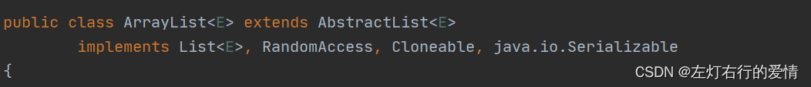  
 其实这个问题无关紧要，查了查网上的解释，觉得是因为可读性。，查stackoverflow上有个回答这么说的：I’ve asked Josh Bloch, and he informs me that it was a mistake. He used to think, long ago, that there was some value in it, but he since “saw the light”. Clearly JDK maintainers haven’t considered 
this 
 to be worth backing out later.  
 翻译过来大概就是：我问过 Josh Bloch，他告诉我这是一个错误。很久以前，他曾经认为它有一些价值，但他后来“看到了光明”。很明显，JDK 维护者认为这不值得以后撤销。

#### 如何实现AbstractList

* 要实现不可修改的AbstractList。  
   只需要扩展此类并为get(int)和size()方法提供实现即可。  
   实现如下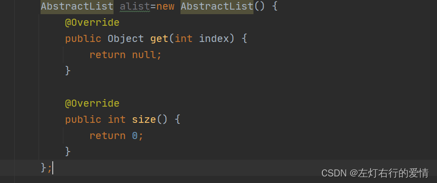  
   如果直接去用，则报错（语法也不通过），如图：  
   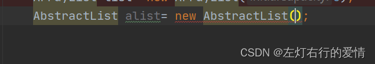
* 实现可修改的AbstractList。  
   必须另外重写set(int, E)方法（否则抛出UnsupportedOperationException ）。
* 实现可变大小的AbstractList。
* 必须另外重写add(int, E)和remove(int)方法。举个add的例子，remove同理，感兴趣可以试一试，如图：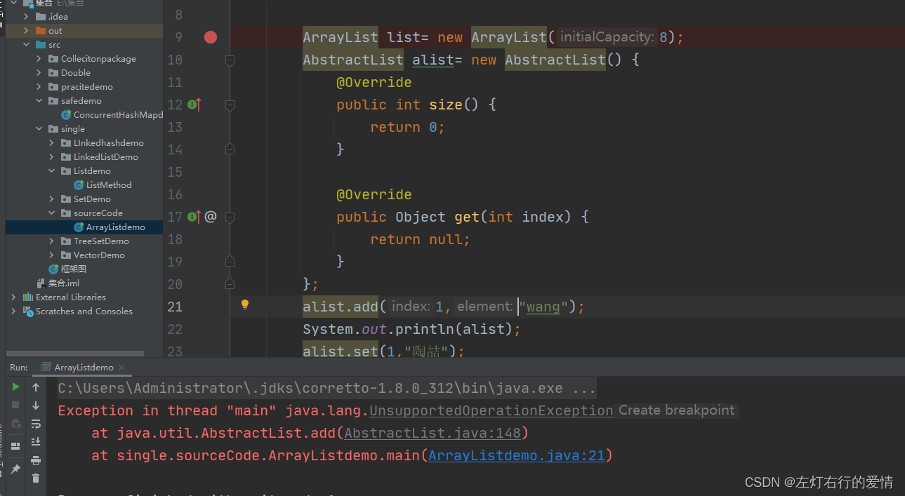  
   所以，看到这我们都明白了，这个类不支持一些实现与抽象方法，比如set()，add()，remove()等List新引入的接口。  
   要使用就必须由子类去重写，那么子类都有谁呢？  
   ArrayList类，Vector类，AbstractSequentialList抽象类。  
   顺便提一嘴：get()不能确定子类是链表还是数组，所以get()需要强制要求子类去实现。  
   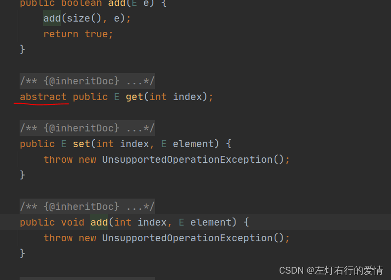

2. List：实现List接口操作规范，增删遍历等操作。
3. RandomAccess：提供随机访问功能。  
    解读：ist集合中用的较多的就是ArrayList 和 LinkedList 两个类，这两者作比较你可以发现，**ArrayList有这个接口，但是LinkedList没有**，如图：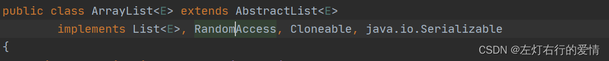  
    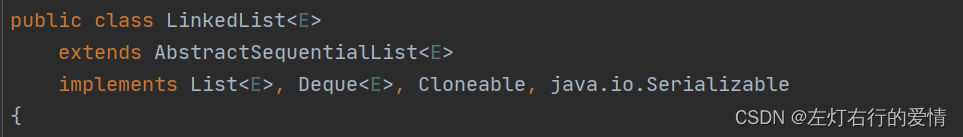  
    现在我们去看看这个RandomAccess，进入后发现接口里面什么都没有= =。  
    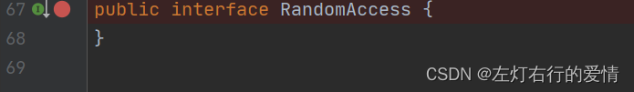  
    不慌，我们去看看doc，通过这个我们了解到，这个接口是作为标志接口。

```
Marker interface used by <tt>List</tt> implementations to indicate that
 * they support fast (generally constant time) random access. 


```

意思大概是这个RandomAccess 是一个标志接口，\*\*它的作用是实现List集合支持快速随机访问。\*\*主要用途是允许通用算法更改其行为，以便在应用于随机或顺序访问列表时提供良好的性能，如果有实现了这个接口的 List，那么使用for循环的方式获取数据会优于用迭代器获取数据。  
 总结就是实现RandomAccess接口的的List可以通过简单的for循环来访问数据比使用iterator访问来的高效快速。

4. Cloneable：提供可拷贝功能  
    a.**java对象要支持clone这个功能，但不是所有对象都应该可以clone**，所以这里需要让用户自己标记出哪些类可以clone。  
    b.clone是一个特殊的多态操作，最好有JVM的直接支持，即使是自己自定义的clone()最好也要调用JVM提供的基础实现再去添加自己要添加的功能  
    c.从JVM的角度看，这就是一个标记接口而已，实现了就打上cloneable标记，没实现就没有。  
    这段参考一个知乎大牛的文章，这是老早之前做的笔记，现在链接找不到了= =。
5. Serializable: 提供可序列化功能。  
    解读：这块要详细解读有点复杂，后面我会连接上redis相关的数据库知识揉在一起说，保证过瘾，先挖个坑嘿嘿= =。  
    咳咳，先看一下这个接口发现什么都没有  
    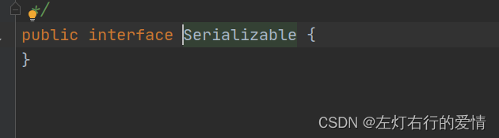  
    目前我们先简单认定实现这个接口会提供可序列化功能。

### 源码分析

#### javaDoc分析

```
/**
 * Resizable-array implementation of the <tt>List</tt> interface.  
 *  可变化的数组 实现了list接口

 *Implements all optional list operations, and permits all elements, including  <tt>null</tt>. 
  实现了所有list操作，并允许有所有元素，包括null。

In addition to implementing the <tt>List</tt> interface,
除了实现list接口之外，
 * this class provides methods to manipulate the size of the array that is used internally to store the list.  (This class is roughly equivalent to
 * <tt>Vector</tt>, except that it is unsynchronized.)
 * 它还在提供了方法在内部去使用，操作存储list的数组大小（等价于不加synchronized的Vector），
 *
 * <p>The <tt>size</tt>, <tt>isEmpty</tt>, <tt>get</tt>, <tt>set</tt>, <tt>iterator</tt>, and <tt>listIterator</tt> operations run in constant time.  
 * 上面说的方法的运行时间复杂度都是常数（恒定）（O（1））

The <tt>add</tt> operation runs in <i>amortized constant time</i>,that is, adding n elements requires O(n) time.  
All of the other operations run in linear time (roughly speaking).  
add操作方法 均摊时间复杂度是O（1）；那么添加n个元素需要O(n)
所有其他方法的时间复杂度都是线性的

The constant factor is low compared to that for the <tt>LinkedList</tt> implementation.
现实是稳定性不如LinkedList的实现

 * <p>Each <tt>ArrayList</tt> instance has a <i>capacity</i>.  
 * 每一个ArrayList 实例都有一个容量

The capacity is the size of the array used to store the elements in the list.  
这个容量代表了用于存储list元素的数组大小

It is always at least as large as the list size. 
它总是和list大小一样大
 As elements are added to an ArrayList,its capacity grows automatically. 
 当有元素添加到ArrayList时，容量的也会自动增加。
  The details of the growth policy are not specified beyond the fact that adding an element has constant amortized time cost.
 但是这个扩容机制并不是完全确定的，而且每次添加一个元素会消耗特定不变的缓冲时间
 * <p>An application can increase the capacity of an <tt>ArrayList</tt> instance
 * before adding a large number of elements using the <tt>ensureCapacity</tt>
 * operation. 
 * 程序可以在添加大量元素前选择增加一些容量
 This may reduce the amount of incremental reallocation.
 这个举动可能会减少扩容次数从而降低额外时间开销
 
 *
 * <p><strong>Note that this implementation is not synchronized.</strong>
 * ArrayList不是同步的。
 * If multiple threads access an <tt>ArrayList</tt> instance concurrently,
 * 如果多个线程同时进入了同一个ArrayList
 * and at least one of the threads modifies the list structurally,
 * 同时至少有一个线程操作list结构
 *  it <i>must</i> be synchronized externally. 
 * 则必需在外部加锁（synchronized）
 (A structural modification is
 * any operation that adds or deletes one or more elements, or explicitly
 * resizes the backing array; merely setting the value of an element is not
 * a structural modification.)  
 * 结构修改是添加或删除一个或多个元素，或者调整数组大小的任何操作;仅仅设置元素的值不是结构修改
This is typically accomplished by synchronizing on some object that naturally encapsulates the list.
这通常是通过对一些自然封装的list对象进行同步来实现的

 * If no such object exists, the list should be "wrapped" using the
 * {@link Collections#synchronizedList Collections.synchronizedList}
 * method. Collections.synchronizedList
 * 如果这样的对象不存在，list应该使用Collections.synchronizedList方法
 This is best done at creation time, to prevent accidental
 * unsynchronized access to the list:<pre>
 *   List list = Collections.synchronizedList(new ArrayList(...));
 * 最好是用在创建时，防止意外无锁进入到list中 例子：List list = Collections.synchronizedList(new ArrayList(...))


 * </pre><p><a name="fail-fast">
 * The iterators returned by this class's {@link #iterator() iterator} and
 * {@link #listIterator(int) listIterator} methods are <em>fail-fast</em>:</a>
 * if the list is structurally modified at any time after the iterator is
 * created, in any way except through the iterator's own
 * {@link ListIterator#remove() remove} or {@link ListIterator#add(Object) add} methods, 
 * the iterator will throw a
 * {@link ConcurrentModificationException}. 
 * 当一个线程进行iterators操作时，如果有其他线程对ArrayList进行修改，会触发fail-fast机制，抛出ConcurrentModificationException异常，通常是ListIterator#remove() remove或ListIterator#add(Object) add这两种情况。
 *  Thus, in the face of concurrent modification, the iterator fails quickly and cleanly, rather
 * than risking arbitrary, non-deterministic behavior at an undetermined time in the future.
 * 因此。在这种并行修改情况下，线程会明确快速的触发失败fail-fast，而不是在未来不确定的时间里冒着武断、不确定性行为的风险。
 *
 * <p>Note that the fail-fast behavior of an iterator cannot be guaranteed
 * as it is, generally speaking, impossible to make any hard guarantees in the
 * presence of unsynchronized concurrent modification.  Fail-fast iterators
 * throw {@code ConcurrentModificationException} on a best-effort basis.
 * Therefore, it would be wrong to write a program that depended on this
 * exception for its correctness:  <i>the fail-fast behavior of iterators
 * should be used only to detect bugs.</i>
 *但是在非同步的情况下，fail-fast并不确保每次都会触发，因此依赖此异常的代码都是错误的，这个异常仅仅只是为了发现代码bug而已。
 * <p>This class is a member of the
 * <a href="{@docRoot}/../technotes/guides/collections/index.html">
 * Java Collections Framework</a>.
 *
 * @author  Josh Bloch
 * @author  Neal Gafter
 * @see     Collection
 * @see     List
 * @see     LinkedList
 * @see     Vector
 * @since   1.2
 */


```

纯中文如下：  
 可变化的数组 实现了list接口，实现了所有list操作，并允许有所有元素，包括null。  
 除了实现list接口之外，它还在提供了方法在内部去使用，操作存储list的数组大小（等价于不加synchronized的Vector），  
 上面说的方法的运行
时间复杂度 
都是常数（恒定）（O（1）），add操作方法 均摊时间复杂度是O（1）；那么添加n个元素需要O(n)  
 所有其他方法的时间复杂度都是线性的，现实是稳定性不如LinkedList的实现。  
 每一个ArrayList 实例都有一个容量，这个容量代表了用于存储list元素的数组大小，它总是和list大小一样大，  
 当有元素添加到ArrayList时，容量的也会自动增加。  
 但是这个扩容机制并不是完全确定的，而且每次添加一个元素会消耗特定不变的缓冲时间，  
 程序可以在添加大量元素前选择增加一些容量，这个举动可能会减少扩容次数从而降低额外时间开销。

ArrayList线程是不安全的。如果多个线程同时进入了同一个ArrayList，同时至少有一个线程操作list结构，则必需在外部加锁（synchronized）。  
 结构修改是添加或删除一个或多个元素，或者调整数组大小的任何操作;仅仅设置元素的值不是结构修改，  
 这通常是通过对一些自然封装的list对象进行同步来实现的，如果这样的对象不存在，list应该使用Collections.synchronizedList方法，最好是用在创建时，防止意外无锁进入到list中 例子：List list = Collections.synchronizedList(new ArrayList(…))。

当一个线程进行iterators操作时，如果有其他线程对ArrayList进行修改，会触发fail-fast机制，抛出ConcurrentModificationException异常，通常是ListIterator#remove() remove或ListIterator#add(Object) add这两种情况。因此。在这种并行修改情况下，线程会明确快速的触发失败fail-fast，而不是在未来不确定的时间里冒着武断、不确定性行为的风险。  
 但是在非同步的情况下，fail-fast并不确保每次都会触发，因此依赖此异常的代码都是错误的，这个异常仅仅只是为了发现代码bug而已。

#### 静态变量

```
 private static final long serialVersionUID = 8683452581122892189L;

    /**
     * Default initial capacity.默认的初始容量为10
     */
    private static final int DEFAULT_CAPACITY = 10;
    CAPACITY 表示的实数组的大小，而不是实际存储的元素个数——size,它表示的实存储能力，size是已经存入元素的个数。

    /**
     * Shared empty array instance used for empty instances.
     * 用于ArrayList空实例的共享空数组实例
     */
    private static final Object[] EMPTY_ELEMENTDATA = {};

    /**
     * Shared empty array instance used for default sized empty instances.
      We distinguish this from EMPTY_ELEMENTDATA to know how much to inflate when
     * first element is added.
     * 用于默认大小的空实例的共享空数组实例。无参构造时候会使用该空数组
     * 我们将它与EMPTY_ELEMENTDATA区分开来，
     * 以了解添加第一个元素时要膨胀多少。
     */
    private static final Object[] DEFAULTCAPACITY_EMPTY_ELEMENTDATA = {};


```

解释一下`EMPTY_ELEMENTDATA`和`DEFAULTCAPACITY_EMPTY_ELEMENTDATA`的用途:

* EMPTY\_ELEMENTDATA  
   这是一个空数组,当我们创建一个空的`ArrayList`并且不打算立刻添加元素时,这个数组会被使用.  
   主要目的是节省内存,因为所有这样的空`ArrayList`都会共享同一个空数组实例.而不是为每个新的空`ArrayList`分配新的内存.
* DEFAULTCAPCITY\_EMPTY\_ELEMENTDATA  
   这是一个空数组,当我们使用无参构造函数(例如`new ArrayList<>()`)创建一个`ArrayList`时,这个数组会被用作初始的内部存储.  
   主要目的是为了延迟容量分配,当我们首次向这个`ArrayList`添加元素时,它就知道目前是一个默认大小的空列表,并且需要扩容到默认的初始容量(`ArrayList中通常是10`).  
   这样可以避免在列表创建时就立即分配更多的内存,而是等到真正需要时才进行扩容

#### 成员变量

```
 /**
     * The array buffer into which the elements of the ArrayList are stored.
     * 存储ArrayList元素的数组缓冲区。
     * The capacity of the ArrayList is the length of this array buffer.
     * 数组列表的容量就是这个数组缓冲区的长度
     *  Any empty ArrayList with elementData == DEFAULTCAPACITY_EMPTY_ELEMENTDATA
     * will be expanded to DEFAULT_CAPACITY when the first element is added.
     * 任何的element data = = default capacity _ EMPTY _ element data的空ArrayList数组添加第一个元素时，将扩展到DEFAULT_CAPACITY。
     */
     
    transient Object[] elementData;//non-private to simplify nested class access   非私有以简化嵌套类访问
  注意elementData是transient修饰的,elementData不是private的

    /**
     * The size of the ArrayList (the number of elements it contains).
     *
     * @serial
     */
    private int size;


```

有两个个问题需要我们去思考，

1. 首先是如果我们用transient去修饰elementData，它代表了变量不参与序列化和反序列化，那么当我们对ArrayList反序列化后是不是没有数据了？
2. 为什么elementData不是private呢？  
    首先我们回答第一个问题：  
    a.ArrayList 基于数组实现，并且具有动态扩容特性，因此保存元素的数组不一定都会被使用，那么就没必要全部进行序列化。  
    对于elementData它是一个缓存数组，它通常会预留一些容量，等容量不足时再扩充容量，那么有些空间可能就没有实际存储元素.  
    b.由于ArrayList仍然需要序列化其实际内容,因此它实现了writeObject和readObject方法来自定义序列化过程,这样保证只序列化实际存储的那些元素，而不是整个数组，从而节省空间和时间。  
    c.注意:element不参与默认的序列化和反序列化，不代表没有进行序列化和反序列化。

代码如下：

```
     *Save the state of the <tt>ArrayList</tt> instance to a stream (that is, serialize it).
     *将ArrayList实例的状态保存到一个流中(即序列化它)。
     * @serialData The length of the array backing the <tt>ArrayList</tt>
     *             instance is emitted (int), followed by all of its elements
     *             (each an <tt>Object</tt>) in the proper order.

    private void writeObject(java.io.ObjectOutputStream s)
        throws java.io.IOException{
        // Write out element count, and any hidden stuff
        int expectedModCount = modCount;
        s.defaultWriteObject();

        // Write out size as capacity for behavioural compatibility with clone()
        s.writeInt(size);

        // Write out all elements in the proper order.
        按照正确的顺序写出所有的元素。
        for (int i=0; i<size; i++) {
            s.writeObject(elementData[i]);
        }

        if (modCount != expectedModCount) {
            throw new ConcurrentModificationException();
        }
    }


```

d.反序列化时调用readObject，从ObjectInputStream获取size和element，再恢复到elementData。  
 代码如下：

```
     * Reconstitute the <tt>ArrayList</tt> instance from a stream (that is,
     * deserialize it).
     * 从流中重建ArrayList实例(即反序列化它)。
    
        private void readObject(java.io.ObjectInputStream s) throws java.io.IOException, ClassNotFoundException {
        
        elementData = EMPTY_ELEMENTDATA;

        // Read in size, and any hidden stuff
        s.defaultReadObject();

        // Read in capacity
        s.readInt(); // ignored

        if (size > 0) {
            // be like clone(), allocate array based upon size not capacity
            int capacity = calculateCapacity(elementData, size);
            SharedSecrets.getJavaOISAccess().checkArray(s, Object[].class, capacity);
            ensureCapacityInternal(size);

            Object[] a = elementData;
            // Read in all elements in the proper order.
            for (int i=0; i<size; i++) {
                a[i] = s.readObject();
            }
        }
    }


```

e:综上ArrayList 实现了 writeObject() 和 readObject() 来只序列化数组中有元素填充那部分内容。  
 第二个问题的回答：  
 首先看这段英文  
 non-private to simplify nested class access：非私有以简化嵌套类访问  
 为什么要设置为非私有，目的是简化嵌套类的访问，那么我们来解释一下嵌套类的访问。  
 解释如下：内部类虽然可以直接访问外部类的成员，但是当访问的成员是私有的时候，是有些不同的。  
 虽然我们在编码时，外部类和内部类是写在同一个源码文件中的，但是要知道的是在编译之后，内部类和外部类会被编译为不同的 class 文件，那么此时如何维持外部类的私有属性在内部类中的可见性？  
 java 使用了 `synthetic method`(合成方法) 来解决这个问题。  
 当内部类中直接使用了外部类的某个私有成员时，会在外部类中自动生成一个静态方法，方法权限是包可见的，方法参数是外部类的实例，方法实现就是返回了传入实例的该私有变量。  
 这样，在内部类中也可以通过使用此静态方法来访问外部类的私有成员了，当然，前提是内部类要持有外部类对象的引用。  
 同理，外部类中在创建了内部类的对象之后，也是能够直接使用内部类的私有成员和方法的，也是用过 `synthetic method` 来实现的。  
 这就是 `elementData` 直接声明为包可见的原因，简化了通过 `synthetic` `method` 来访问这一步骤。  
 我们下面用代码举个例子,展示Java
编译器 
如何使用合成方法来维持外部类的私有属性在内部类中的可见性。

```
// 外部类 OuterClass  
public class OuterClass {  
    // 外部类的私有成员变量  
    private int privateVar = 42;  
  
    // 内部类 InnerClass  
    class InnerClass {  
        void accessOuterPrivateVar() {  
            // 内部类直接访问外部类的私有成员变量  
            System.out.println("Accessing outer privateVar: " + privateVar);  
        }  
    }  
  
    public static void main(String[] args) {  
        OuterClass outer = new OuterClass();  
        InnerClass inner = outer.new InnerClass();  
        inner.accessOuterPrivateVar(); // 调用内部类方法，该方法访问了外部类的私有变量  
    }  
}


```

`OuterClass`有一个私有变量`privateVar`,而内部类`InnerClass`直接访问了这个私有变量.  
 编辑这段代码时,Java编译器会生成两个.class文件:`OuterClass.class`和`OuterClass$InnerClass.class`.  
 为了允许`InnerClass`访问`OuterClass`的私有成员`privateVar`,编译器会在`OuterClass`中生成一个合成方法.  
 这个方法是包级私有的(默认访问权限),它的命名会遵循特定的规则,比如:`access$000`(注意是编译器自动生成的,每次编辑都可能不同)  
 我们使用反编译工具(比如:javap)来查看编译后的字节码,如下:

```
// Synthetic method, not visible in source code  
static int access$000(OuterClass outerClassInstance) {  
    return outerClassInstance.privateVar;  
}


```

这个合成方法允许`InnerClass`在其内部实现中通过调用`OuterClass.access$000(this$0)`来间接访问`privateVar`,其中`this$0`是编译器自动生成的另一个引用,它指向包含当前内部类实例的外部类实例.

#### 构造方法

构造方法有三种，无参，有参（指定初始化容量大小），有参（传入一个集合）  
 第一种无参，源码如下：

```
/**
     * Constructs an empty list with an initial capacity of ten.
     * 构造一个初始容量为10的空列表。
     */
    public ArrayList() {
        this.elementData = DEFAULTCAPACITY_EMPTY_ELEMENTDATA;
    }


```

这里我们注意到了，无参情况下，elementData使用默认空数组。  
 第二种有参（指定初始化大小），源码如下：

```
 *Constructs an empty list with the specified initial capacity.
 构造一个具有指定初始容量的空列表。

 *@param  initialCapacity  the initial capacity of the list   
 参数代表 初始容量列表的初始容量
 
 *@throws IllegalArgumentException if the specified initial capacity  is negative
 如果指定的初始容量为负则报错IllegalArgumentException
 
public ArrayList(int initialCapacity) {
    if (initialCapacity > 0) { //当参数大小>0时,创建一个Object数组
        this.elementData = new Object[initialCapacity];
    } else if (initialCapacity == 0) {/当参数大小=0时，使用EMPTY_ELEMENTDATA空数组
        this.elementData = EMPTY_ELEMENTDATA;
    } else {
        throw new IllegalArgumentException("Illegal Capacity: "+
                                           initialCapacity);
    }
}


```

第三种，有参并且传入一个集合，源码如下：

```
 /**
     * Constructs a list containing the elements of the specified
     * collection, in the order they are returned by the collection's
     * iterator.
     * 按照集合的迭代器返回的顺序，构造一个包含指定集合元素的列表。
     *
     * @param c the collection whose elements are to be placed into this list
     * @throws NullPointerException if the specified collection is null
     */
    public ArrayList(Collection<? extends E> c) {
        Object[] a = c.toArray();
        if ((size = a.length) != 0) {//先判断是否为空数组
            if (c.getClass() == ArrayList.class) {//判断c是否为ArrayList
                elementData = a;
            } else {
                elementData = Arrays.copyOf(a, size, Object[].class);  
            }
        } else {
            // replace with empty array.如果传入集合长度为0，elementData 用EMPTY_ELEMENTDATA替换
            elementData = EMPTY_ELEMENTDATA;
        }
    }


```

#### 扩容机制

当`ArrayList`的元素数量超过其当前容量时,就会触发扩容操作.  
 **关键参数**

* elementData:存储实际元素的数组
* EMPTY\_ELEMENTDATA: 共享空数组
* DEFAULTCAPCITY\_EMPTY\_ELEMENTDATA:空数组,方便添加元素后容量计算需要添加多少
* size: 当前ArrayList中元素的个数
* DEFAULT\_CAPACITY: 默认初始容量,一般为10
* MAX\_ARRAY\_SIZE: 数组的最大容量,一般为Integer.MAX\_VALUE -  
   8
* minCapacity: 最小需要容量
* modCount: 记录被修改的次数

**扩容触发条件**  
 扩容会在两种情况下触发:

1. 添加元素时,`size`超过`elementData`的长度
2. 使用带有指定初始容量的构造方法,并且该初始容量大于默认容量,也会触发扩容

**扩容机制**  
 扩容机制分为两种:

* 自动扩容机制  
   `grow`方法是`ArrayList`需要时自动调用的内部扩容机制
* 手动扩容机制  
   `ensureCapacity`方法提供了一个公开的接口,允许用户根据需求手动触发扩容操作,以优化性能.

##### 手动扩容

###### ensureCapacity(int minCapacity)方法

```
 /**
     * Increases the capacity of this <tt>ArrayList</tt> instance, if
     * necessary, to ensure that it can hold at least the number of elements
     * specified by the minimum capacity argument.
     * 如有必要，增加此ArrayList实例的容量，以确保它至少可以容纳由最小容量参数指定的元素数量。
     *
     * @param   minCapacity   the desired minimum capacity         所需的最小容量
     */
    public void ensureCapacity(int minCapacity) {
        int minExpand = (elementData != DEFAULTCAPACITY_EMPTY_ELEMENTDATA)
            // any size if not default element table
            ? 0
            // larger than default for default empty table. It's already
            // supposed to be at default size.
            : DEFAULT_CAPACITY;

        if (minCapacity > minExpand) {
            ensureExplicitCapacity(minCapacity);
        }
    }


```

解读：  
 作用是根据参数`minCapacity`确保内部数据数组`elementData`有足够的容量.  
 解释一下
关键代码
:计算最小扩展容量

```
int minExpand = (elementData != DEFAULTCAPACITY_EMPTY_ELEMENTDATA)  
    ? 0  
    : DEFAULT_CAPACITY;
2. 如果elementData不是默认空数组,说明ArrayList已经有一些元素,将minExpand设置为0,意味着不需要一个额外的阈值来决定何时扩容，只要请求的容量大于当前容量，就应该扩容.
3. 如果elementData仍然默认是空数组,说明ArrayList是新创建未添加元素,此时minExpand被设置为默认大小(10),只有当需要的容量>默认容量时,扩容才会发生.


```

###### ensureExplicitCapacity(int minCapacity)方法

`ensureExplicitCapacity`方法确保`ArrayList`有足够的容量来存储至少`minCapacity`个元素，如果当前容量不足，则通过调用`grow`方法来扩容数组。这是`ArrayList`动态调整其容量以满足存储需求的重要机制之一。

```
private void ensureExplicitCapacity(int minCapacity) {
/**
用于快速失败迭代器(fail-fast iterator)的计数器.
每当ArrayList的结构发生变化(添加,删除或扩容)时,modCount都会增加.
如果迭代器在创建之后检测到modCount发生了变化,它会抛出ConcurrentModificationException.以防止在迭代过程中并发修改列表
**/
        modCount++;
        
         // 不满足要求的容量则进行扩容，也就是数组大小不够了
        if (minCapacity - elementData.length > 0)        
            grow(minCapacity);
    }


```

##### 自动扩容

###### grow(int minCapacity)方法 扩容逻辑在这里

```
     * Increases the capacity to ensure that it can hold at least the
     * number of elements specified by the minimum capacity argument.
     * 增加容量以保证至少可以存储指定参数数量的元素
     *
     * @param minCapacity the desired minimum capacity   期望的最小容量
     */
    private void grow(int minCapacity) {
        // overflow-conscious code
        int oldCapacity = elementData.length;// 原容量大小
        int newCapacity = oldCapacity + (oldCapacity >> 1);//这里是扩容规则
        //要是扩容后的数组的长度还是小于需要的最小容量，那么就把需要的最小容量给newCapacity
        if (newCapacity - minCapacity < 0)     
            newCapacity = minCapacity;
            //看一下新扩容的大小是否超过最大标准
        if (newCapacity - MAX_ARRAY_SIZE > 0)    
            newCapacity = hugeCapacity(minCapacity);
        // minCapacity is usually close to size, so this is a win:最小容量通常接近大小，因此这是一个成功之处:
        elementData = Arrays.copyOf(elementData, newCapacity);
    }


```

扩容规则：**新数组容量大小=旧数组+旧数组/2(上面的>>1是位运算，代表二进制向右移动一位，10进制为/2）**

###### hugeCapacity(int minCapacity)方法

```
   private static int hugeCapacity(int minCapacity) {
   //发生了整数溢出(正常容量不为负数)
        if (minCapacity < 0) // overflow         
            throw new OutOfMemoryError();
        return (minCapacity > MAX_ARRAY_SIZE) ?
            Integer.MAX_VALUE :
            MAX_ARRAY_SIZE;
            这里，容量最大值为Max_ARRAY_SIZE，为什么还会返回Integer.MAX_VALUE呢？
            如果minCapacity>MAX_ARRAY_SIZE，说明此时容器大小已经为MAX_ARRAY_SIZE.
            静态变量中描述了MAX_ARRAY_SIZE = Integer.MAX_VALUE - 8;
            一些虚拟机在数组中保留一些标题字，尝试分配更大的数组可能会导致OOM。
            注意这里只是可能，所以不如尝试扩容到Integer.MAX_VALUE，可能会成功。
            
    }


```

###### 扩展一下Arrays.copyOf(elementData, newCapacity)：

```
 /**
     * Copies the specified array, truncating or padding with nulls (if necessary)       复制指定的数组，截断或填充(如有必要)
     * so the copy has the specified length.  For all indices that are   所以，副本具有指定的长度。
     * valid in both the original array and the copy, the two arrays will  .对于在原始数组和新的拷贝数组中都有效的
     * contain identical values. ，这两个数组将包含相同的值。
     *  For any indices that are valid in the          
     * copy but not the original, the copy will contain <tt>null</tt>.对于任何有效的值赋值但是并不是原件，副本会包含null
     * Such indices will exist if and only if the specified length当且仅当指定长度时，此类值才会存在大于原始数组的值
     * is greater than that of the original array.
     * The resulting array is of the class <tt>newType</tt>.
     *
     * @param <U> the class of the objects in the original array  原始数组中对象的类
     * @param <T> the class of the objects in the returned array 要返回数组中对象的类
     * @param original the array to be copied  要复制的数组
     * @param newLength the length of the copy to be returned 要返回数组拷贝的新长度
     * @param newType the class of the copy to be returned   要返回数组返回的类型
     * @return a copy of the original array, truncated or padded with nulls
     *     to obtain the specified length         被截断或用空值填充以获得指定的长度 原始数组的拷贝数组
     * @throws NegativeArraySizeException if <tt>newLength</tt> is negative
     * @throws NullPointerException if <tt>original</tt> is null
     * @throws ArrayStoreException if an element copied from
     *     <tt>original</tt> is not of a runtime type that can be stored in
     *     an array of class <tt>newType</tt>
     * @since 1.6
     */
    public static <T,U> T[] copyOf(U[] original, int newLength, Class<? extends T[]> newType) {
        @SuppressWarnings("unchecked")
        T[] copy = ((Object)newType == (Object)Object[].class) //判断 newType 是否是 Object 数组
            ? (T[]) new Object[newLength]
            : (T[]) Array.newInstance(newType.getComponentType(), newLength);//创建类型与newType一样，长度为newLength的新数组
            //f方法：newType.getComponentType()返回数组内的元素类型，不是数组时，返回 null
        System.arraycopy(original, 0, copy, 0,
                         Math.min(original.length, newLength));//复制数组
        return copy;
    }


```

###### calculateCapacity(Object[] elementData, int minCapacity) 方法

该方法目的计算`ArrayList`所需容量

```
 private static int calculateCapacity(Object[] elementData, int minCapacity) {
 //如果elementData是默认空数组,该方法会返回默认容量和minCapacity(请求的容量)之间的较大值
        if (elementData == DEFAULTCAPACITY_EMPTY_ELEMENTDATA) {  
            return Math.max(DEFAULT_CAPACITY, minCapacity);
        }
        return minCapacity;
    }


```

###### ensureCapacityInternal(int minCapacity)方法

辅助方法,用于确保列表的内部数组elementData具有足够的容量来存储至少DEFAULT\_CAPACITY个元素

```
 private void ensureCapacityInternal(int minCapacity) {
        ensureExplicitCapacity(calculateCapacity(elementData, minCapacity));
    }


```

###### 静态变量`private static final int MAX_ARRAY_SIZE = Integer.MAX_VALUE - 8;`

解读一下doc的描述：  
 /\*\*  
 \* The maximum size of array to allocate. 要分配的最大数组大小。  
 \* Some VMs reserve some 
header
 words in an array.一些虚拟机在数组中保留一些头字。  
 \* Attempts to allocate larger arrays may result in 尝试分配更大的阵列可能会导致内存不足错误  
 \* OutOfMemoryError: Requested array size exceeds VM limit 报错：OutOfMemoryError  
 \*/

上面的源码都是分开解读的，下面会用add方法尝试去串起来。

#### 介绍一下add方法：

##### 源码

```
 /**
     * Appends the specified element to the end of this list.   //增加指定的元素到list末尾
     *
     * @param e element to be appended to this list    //将会被添加到list末尾的元素e
     * @return <tt>true</tt> (as specified by {@link Collection#add})
     */
    public boolean add(E e) {
        ensureCapacityInternal(size + 1);  // Increments modCount!!   增加modCount
        elementData[size++] = e;
        return true;
    }


```

上面我们已经介绍过ensureCapacityInternal方法，现在我们串一下，首先回顾一下ensureCapacityInternal方法的代码：

```
private void ensureCapacityInternal(int minCapacity) {
        ensureExplicitCapacity(calculateCapacity(elementData, minCapacity));
    }


```

这里我们可以看到，ensureCapacityInternal的方法里还要一个嵌套的方法`ensureExplicitCapacity(calculateCapacity(elementData, minCapacity));`  
 我们先看里面的`calculateCapacity(elementData, minCapacity)`  
 它的代码如下：

```
 private static int calculateCapacity(Object[] elementData, int minCapacity) {
       if (elementData == DEFAULTCAPACITY_EMPTY_ELEMENTDATA) {  
           return Math.max(DEFAULT_CAPACITY, minCapacity);
       }
       return minCapacity;
   }


```

上面我们解读过这个方法，我们把注意力放在参数的传递上，当我们第一次调用add方法时，传入到calculateCapacity里面的参数：第一个为elementData对象，第二个为我们在add方法里面写的size+1（也就是后面的minCapacity）。  
 那么第一次调用add时，这个minCapacity是为1，填上一个坑!  
 参数明白是干嘛的了，现在看calculateCapacity里面的代码，它的目的就是确定你传进来的这个数组，是不是无参构造创建的对象，如果是的话，则将`DEFAULT_CAPACITY（10）`作为ArrayList的容量，然后返回确认的容量值。

接着运行外边的方法ensureExplicitCapacity。  
 首先它先将modCount++，这个成员变量记录着集合的修改次数，也就每次add或者remove它的值都会加1。  
 接着重点来了，**它有一个判断，判断你确认的容量值是不是大于原数组的大小，如果是的，则扩容。**  
 举个例子：如果我们是第一次add，且我们是无参构造的对象。（这个例子看完，聪明的你可以去尝试一下debug，去再了解一下有参构造的流程，只要你好好的看这个例子，有参的过程不在话下）  
 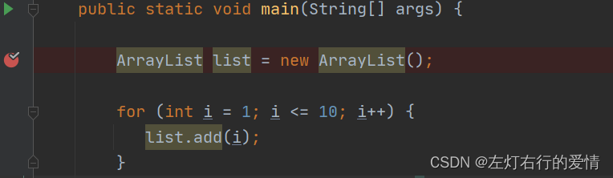  
 接着进入无参构造方法，且elementData对象是DEFAULTCAPACITY\_EMPTY\_ELEMENTDATA  
 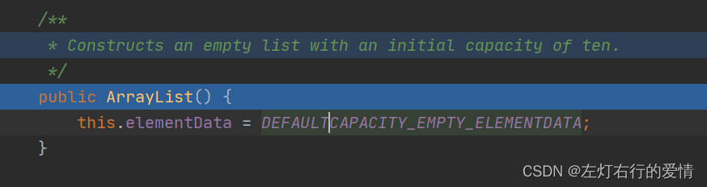  
 接着进入第一次add的过程如下：  
 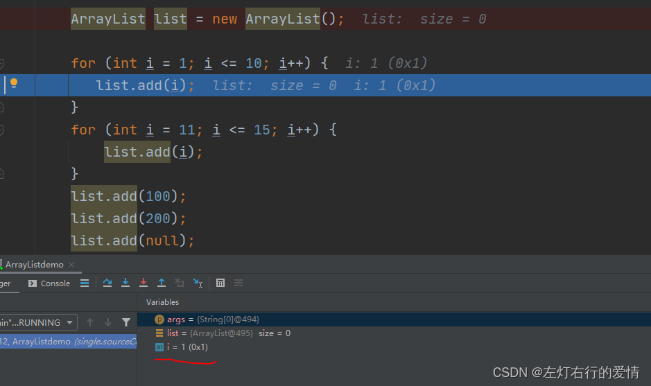  
 首先要执行 ensureCapacityInternal(size + 1)，注意此时的参数size=0,e=1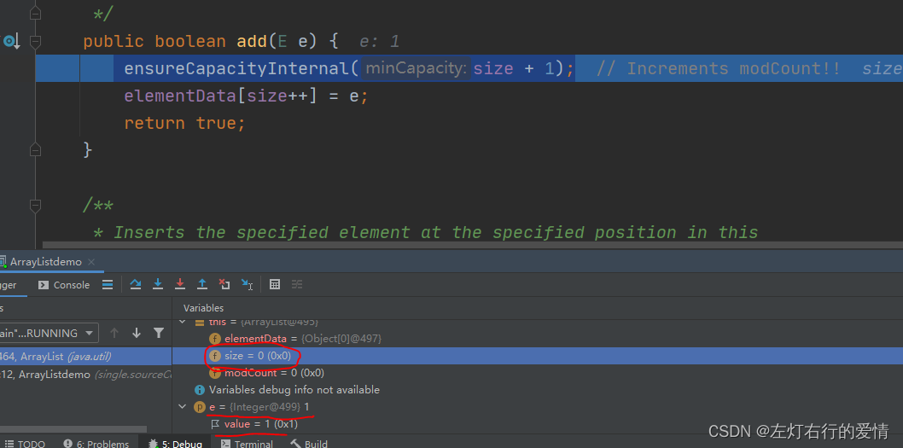接着进入ensureCapacityInternal(int minCapacity)，这里们很清楚，这里的minCapacity是1  
 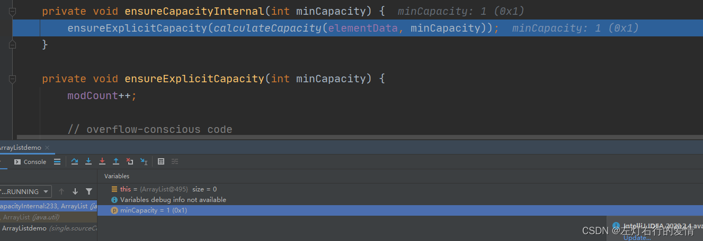  
 然后执行ensureExplicitCapacity嵌套的方法calculateCapacity(Object[] elementData, int minCapacity)  
 进入之后首先判断我们构造函数的对象是不是无参的。  
 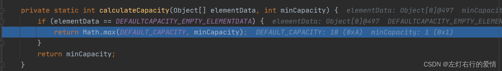  
 这里因为我们是无参的构造，所以进入的if判断，注意这里的max参数的值，DEFAULT\_CAPACITY=10，minCapacity=1，所以我们将要返回的无疑是DEFAULT\_CAPACITY=10.  
 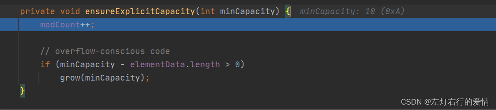  
 这里我们看到了minCapacity变为了10.  
 接着我们要进入if判断，**我们要扩容的值-原数组大小，如果>0，则进行扩容。**  
 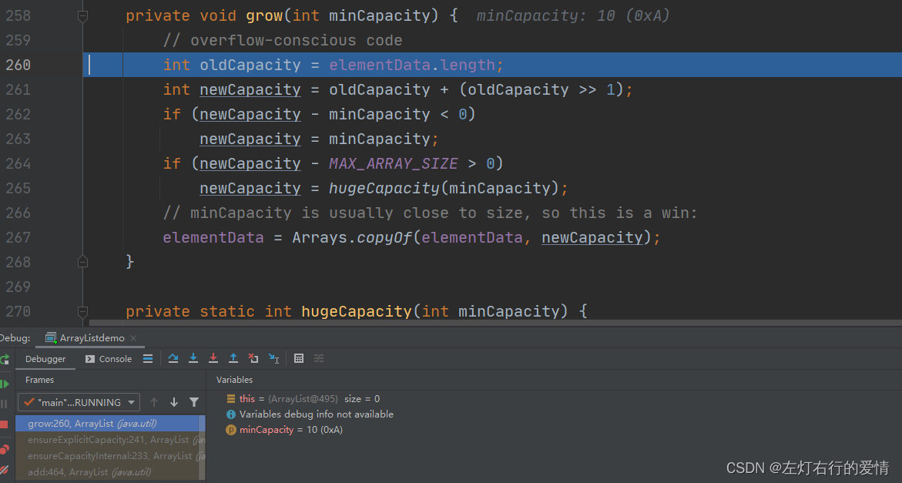  
 然后我们在上面已经介绍过，这里简单看一下执行过程里面的参数大小和改变。  
 刚进入时：  
 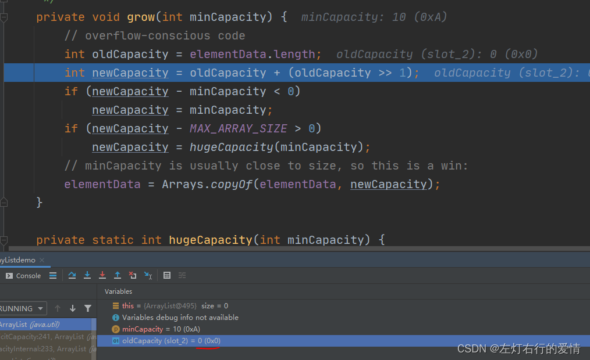  
 执行扩容算法后：因为原先老数组大小为0，所以扩容1.5倍依旧为0  
 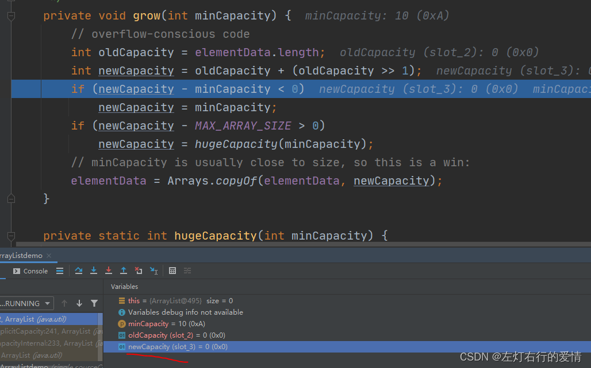  
 下面执行判断逻辑，第一个判断：newCapacity - minCapacity < 0，新容量大小是否大于预设容量大小，这里明显0-10<0,所以进入方法块：  
 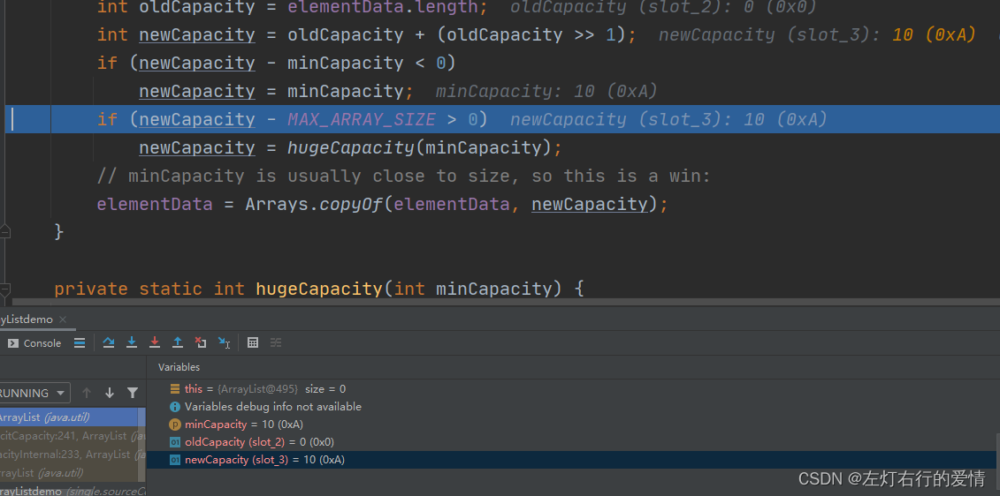  
 我们可以看到，新数组容量变为了10，之后执行第二个判断：newCapacity - MAX\_ARRAY\_SIZE > 0，目的是看一下新扩容大小是否超过最大标准，这里显然不大于，所以进行下一步：  
 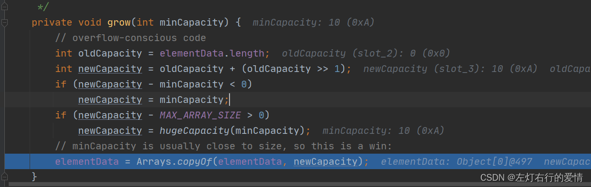  
 接下来是数组的拷贝转移：  
 首先进入  
 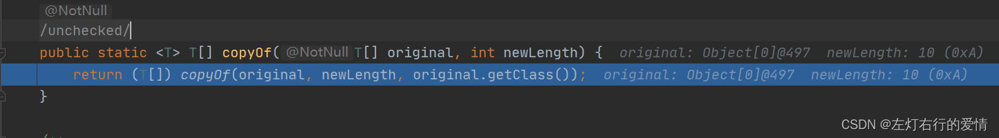  
 接着进入：注意参数  
 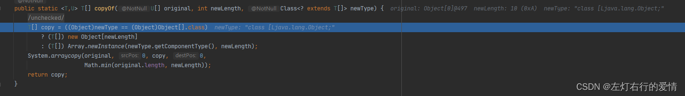  
 这里先比较数组类型，然后创建数组。然后进行拷贝，最后返回拷贝好的数组copy。  
 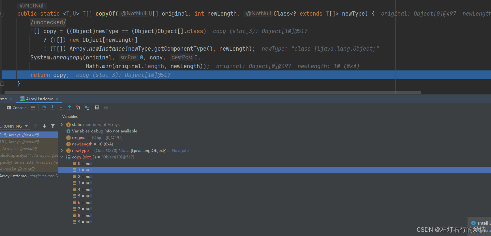  
 之后一步步返回到开始的地方：  
 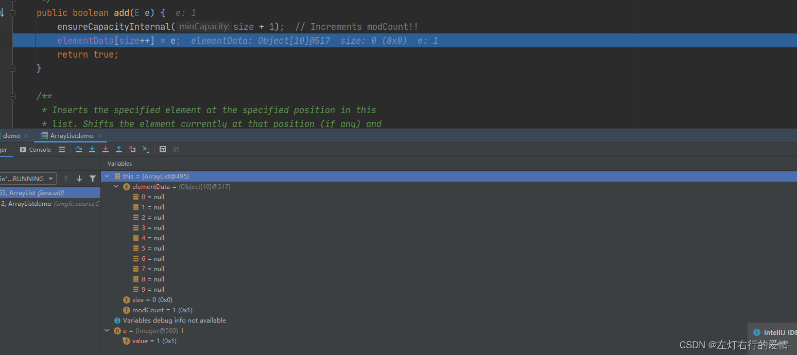  
 执行代码后add方法完成：  
 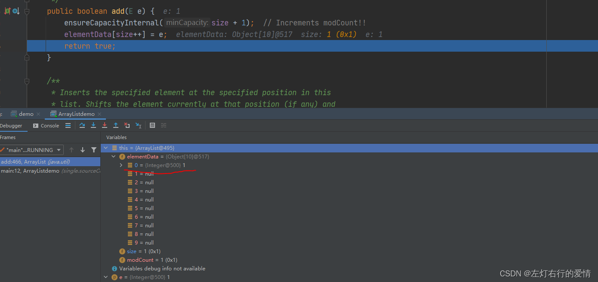  
 至此，我们add的过程和ArrayList的扩容机制已经相当熟悉啦= =。

### 结尾

文章写到这就不继续了，这些属于ArrayList的精华部分，下面再去写一些方法是怎么回事意义不大，希望刚学习的你可以比葫芦画瓢，自己动手，丰衣足食，对这个系列感兴趣点个关注收藏，后面继续= =。2万字码的手都掉了，不知道有谁看hhh。
