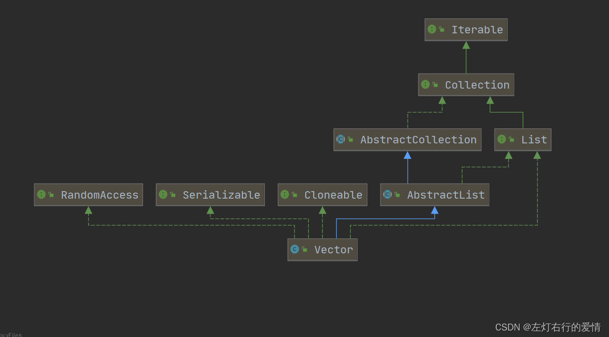
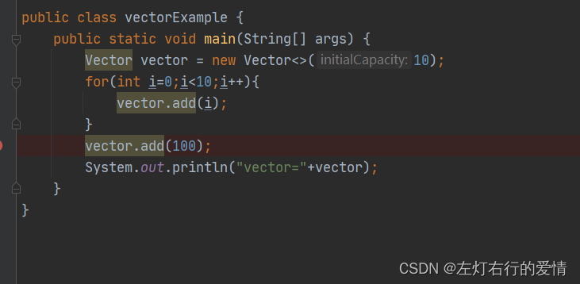
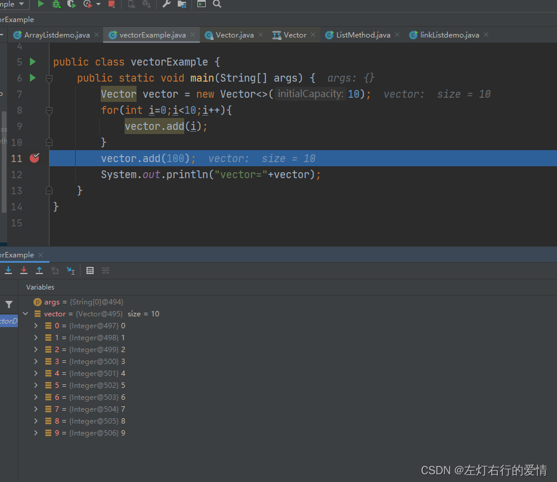
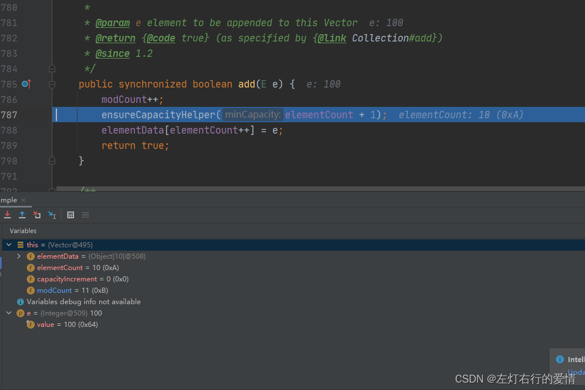
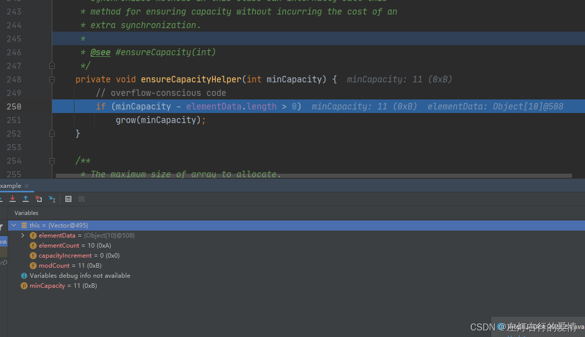
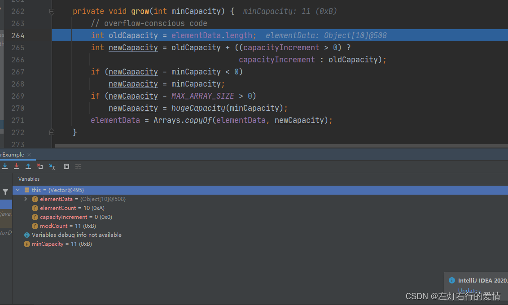
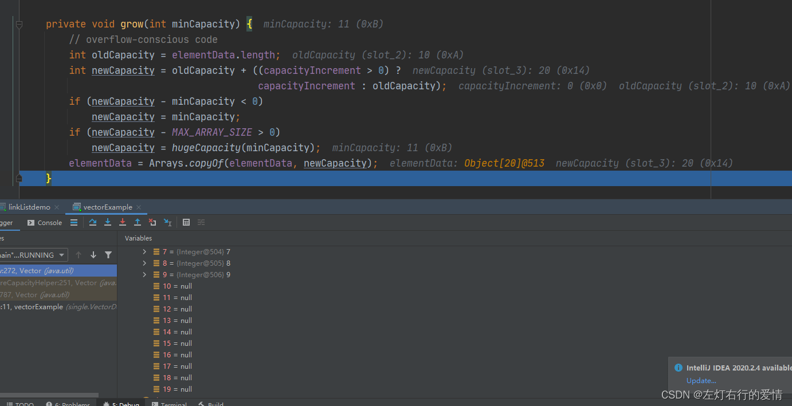
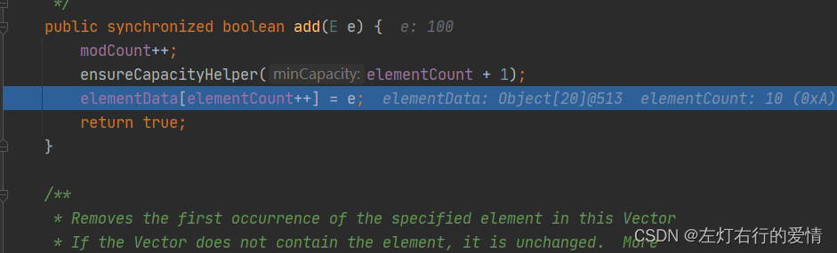

> 原文：[CSDN](https://blog.csdn.net/qq_45852626/article/details/125781311)（历史文章导入，当前状态为草稿）

一：简单介绍  
它的底层是一个对象数组`protected Object[] elementData`，和ArrayList有一些
类 
似，其内部都是通过一个容量能够动态增长的数组来实现的。  
不同点是Vector是线程安全的（但只是相对来说。。。），用以用于
多线程 
的环境下。  
二：继承关系  
  
代码实现：

```
public class Vector<E>
    extends AbstractList<E>
    implements List<E>, RandomAccess, Cloneable, java.io.Serializable


```

1.继承了AbstractList，作用是实现了List接口，这个在ArrayList那篇有详细解读  
2:实现了RandomAccess接口，提供随机访问功能  
3：实现了Cloneable接口，提供
克隆 
功能  
4：实现了Serializable，支持序列化

三：源码分析  
(1)：doc解读

```
/**
 * The {@code Vector} class implements a growable array of
 * objects.
 * Vector类实现了可增长的对象数组 
 * Like an array, it contains components that can be
 * accessed using an integer index. 
 * 像数组一样，它包含可以使用索引进行访问组件。
 * However, the size of a {@code Vector} can grow or shrink as needed to accommodate adding and removing items after the {@code Vector} has been created.
    但是，Vector的大小可以根据需要增大或减小，方便创建后添加或删除元素。
 * <p>Each vector tries to optimize storage management by maintaining a
 * {@code capacity} and a {@code capacityIncrement}. 
每一个vector尝试维护capacity和capacityIncrement来优化存储管理
The {@code capacity} is always at least as large as the vector
 * size; 
 * capacity始终至少与vector大小一样大
 it is usually larger because as components are added to the
 * vector, the vector's storage increases in chunks the size of
 * {@code capacityIncrement}. 
但实际上通常更大，当元素被添加时，vector的存储以块大小添加capacityIncrement。

An application can increase the
 * capacity of a vector before inserting a large number of
 * components; 
程序可以在插入大量组件之前增加vector的容量
this reduces the amount of incremental reallocation.
这减少了增量重分配的次数
 
 * <p><a name="fail-fast">
 * The iterators returned by this class's {@link #iterator() iterator} and {@link #listIterator(int) listIterator} methods are <em>fail-fast</em></a>:
 * 构造器返回的迭代器是fail-fast：
 * if the vector is structurally modified at any time after the iterator is
created, in any way except through the iterator's own {@link ListIterator#remove() remove} or {@link ListIterator#add(Object) add} methods, the iterator will throw a {@link ConcurrentModificationException}.  
如果创建迭代器以后的任何时间对vector结构进行修改，除了迭代器自己的remove或add方法以外，迭代器将抛出ConcurrentModificationException异常。
Thus, in the face of concurrent modification, the iterator fails quickly and cleanly, rather  than risking arbitrary, non-deterministic behavior at an undetermined time in the future.  
因此，在并发修改的情况下，迭代器迅速彻底地失败，而不是在将来某个不确定的时间冒着任意，非确定性行为的风险。
The {@link Enumeration Enumerations} returned by the {@link #elements() elements} method are <em>not</em> fail-fast.
  Enumerations返回elements方法不是fail-fast。
 * <p>Note that the fail-fast behavior of an iterator cannot be guaranteed as it is, generally speaking, impossible to make any hard guarantees in the presence of unsynchronized concurrent modification. 
 * 注意！迭代器的fail-fast行为没有保证，一般来说，在有不同步并发修改时，不会做出硬性保证。
 *  Fail-fast iterators throw{@codeConcurrentModificationException} on a best-effort basis.    fail-fast迭代器尽力去抛出异常ConcurrentModificationException
 * Therefore, it would be wrong to write a program that depended on this exception for its correctness:  <i>the fail-fast behavior of iterators should be used only to detect bugs.</i>
 * 因此，编写设计程序依赖此异常程序确保其正确性是错误的：
 * 最好用fail-fast去检查bug。
 *
 * <p>As of the Java 2 platform v1.2, this class was retrofitted to
 * implement the {@link List} interface, making it a member of the
 * <a href="{@docRoot}/../technotes/guides/collections/index.html">
 * Java Collections Framework</a>.  Unlike the new collection
 * implementations, {@code Vector} is synchronized.  If a thread-safe
 * implementation is not needed, it is recommended to use {@link
 * ArrayList} in place of {@code Vector}.
 * 从Java 2平台v1.2开始，该类被改进以实现List接口，使其成为Java Collections Framework的成员。 与新集合实现不同， Vector是同步的。 如不需要线程安全实现，建议使用ArrayList代替Vector 。
 *
 * @author  Lee Boynton
 * @author  Jonathan Payne
 * @see Collection
 * @see LinkedList
 * @since   JDK1.0
 */


```

(2)：静态变量

```
  /** use serialVersionUID from JDK 1.0.2 for interoperability */  序列版本号
    private static final long serialVersionUID = -2767605614048989439L;


```

(3)：成员变量

```
  /**
     * The array buffer into which the components of the vector are
     * stored. 存储向量组件的数组缓冲区。
     * The capacity of the vector is the length of this array buffer,
     * and is at least large enough to contain all the vector's elements.
     *向量的容量是这个数组缓冲区的长度，
       并且至少大到足以包含所有向量的元素。
     * <p>Any array elements following the last element in the Vector are null.Vector中最后一个元素后面的任何数组元素都为空。
     *
     * @serial
     */
    protected Object[] elementData;   //保存Vector数据的数组 

    /**
     * The number of valid components in this {@code Vector} object.  此{@code Vector}对象中有效组件的数量。
     * Components {@code elementData[0]} through
     * {@code elementData[elementCount-1]} are the actual items.     
     * 组件elementData[0]到elementData[elementCount-1]是实际数据。
     *
     * @serial
     */
    protected int elementCount;   // 实际数据数量 

    /**
     * The amount by which the capacity of the vector is automatically
     * incremented when its size becomes greater than its capacity.  If
     * the capacity increment is less than or equal to zero, the capacity
     * of the vector is doubled each time it needs to grow.
     *当矢量大小超过其容量时，矢量容量自动递增的量。
      如果容量增量小于或等于零，则每次需要增长时，矢量的容量加倍。
     * @serial
     */
    protected int capacityIncrement;  // 容量增长系数 


```

(4)：构造方法  
一共有四个：  
第一个：空参，初始容量为10

```
 public Vector() {
        this(10);
    }


```

第二个：有参，指定初始容量

```
 /**
     * Constructs an empty vector with the specified initial capacity and
     * with its capacity increment equal to zero.
     * 创建一个指定容量大小的空数组，并且增量为0
     *
     * @param   initialCapacity   the initial capacity of the vector
     * @throws IllegalArgumentException if the specified initial capacity
     *         is negative
     */
    public Vector(int initialCapacity) {
        this(initialCapacity, 0);
    }


```

第三个：有参，指定初始容量和扩容时的增长系数

```
  /**
     * Constructs an empty vector with the specified initial capacity and
     * capacity increment.
     * 创建一个指定容量大小和增长系数的空Vector
     *
     * @param   initialCapacity     the initial capacity of the vector
     * @param   capacityIncrement   the amount by which the capacity is
     *                              increased when the vector overflows
     * @throws IllegalArgumentException if the specified initial capacity
     *         is negative
     */
    public Vector(int initialCapacity, int capacityIncrement) {
        super();
        if (initialCapacity < 0)
            throw new IllegalArgumentException("Illegal Capacity: "+
                                               initialCapacity);
        this.elementData = new Object[initialCapacity];
        this.capacityIncrement = capacityIncrement;
    }


```

第四个：有参，根据其他集合创建Vector

```
 public Vector(Collection<? extends E> c) {
        Object[] a = c.toArray();
        elementCount = a.length;
        if (c.getClass() == ArrayList.class) {
            elementData = a;
        } else {
            elementData = Arrays.copyOf(a, elementCount, Object[].class);
        }
    }


```

(5)：扩容机制解读：  
之前我们已经学习过ArrayList的扩容机制，那么现在再来看Vector就很简单了，它和ArrayList的扩容思想非常类似，只是关键地方有一点点不同而已。  
我们先来简单介绍一下这几个方法，最后用一个add方法的例子串起来，学习时注意观察参数。

a：ensureCapacity(int minCapacity)方法：

```
  public synchronized void ensureCapacity(int minCapacity) {
        if (minCapacity > 0) {
            modCount++;
            ensureCapacityHelper(minCapacity);
        }
    }


```

目的是确定Vector容量  
b： ensureCapacityHelper(int minCapacity)方法： 确定Vector容量的帮助方法

```
private void ensureCapacityHelper(int minCapacity) {
       // overflow-conscious code
       if (minCapacity - elementData.length > 0)       要扩容的大小是否大于现在数组大小
           grow(minCapacity);
           }


```

c：grow(int minCapacity)方法：核心扩容方法

```
private void grow(int minCapacity) {
        // overflow-conscious code
        int oldCapacity = elementData.length;
        int newCapacity = oldCapacity + ((capacityIncrement > 0) ?          
                                         capacityIncrement : oldCapacity);
                                         如果容量增量大于0,增新容量为老容量加上容量增量,否则新容量是老容量的两倍
        if (newCapacity - minCapacity < 0) 如果此时新容量减去建议最大容量的值还是小于0,那么新容量等于最小容量
            newCapacity = minCapacity;
        if (newCapacity - MAX_ARRAY_SIZE > 0)扩容后大小超过数组最大值
            newCapacity = hugeCapacity(minCapacity);
        elementData = Arrays.copyOf(elementData, newCapacity);
    }


```

d：

```
private static int hugeCapacity(int minCapacity) {
       if (minCapacity < 0) // overflow
           throw new OutOfMemoryError();
       return (minCapacity > MAX_ARRAY_SIZE) ?
           Integer.MAX_VALUE :
           MAX_ARRAY_SIZE;
  这里，容量最大值为Max_ARRAY_SIZE，为什么还会返回Integer.MAX_VALUE呢？
           如果minCapacity>MAX_ARRAY_SIZE，说明此时容器大小已经为MAX_ARRAY_SIZE.
           静态变量中描述了MAX_ARRAY_SIZE = Integer.MAX_VALUE - 8;
           一些虚拟机在数组中保留一些标题字，尝试分配更大的数组可能会导致OOM。
           注意这里只是可能，所以不如尝试扩容到Integer.MAX_VALUE，可能会成功。

   }


```

这里扩容不多说了，看过ArrayList再来看这个一看就明白了，下面用add方法举个栗子。  
(6)：add方法例子  
例子代码：

```
 public static void main(String[] args) {
        Vector vector = new Vector<>(10);
        for(int i=0;i<10;i++){
            vector.add(i);
        }
        vector.add(100);
        System.out.println("vector="+vector);
    }


```

  
运行到11行，准备进行扩容：  
  
进入add代码里：

```
   public synchronized boolean add(E e) {
        modCount++;
        ensureCapacityHelper(elementCount + 1);
        elementData[elementCount++] = e;
        return true;
    }


```

  
进入ensureCapacityHelper(elementCount + 1)方法：  
  
这里进入if判断，minCapacity为11，element.length为10，所以进入if方法块,执行grow方法：

  
执行完后完成扩容：  
  
最后完成赋值：  


到这里Vector方法就介绍完了，感兴趣自己去debug再看一看。
