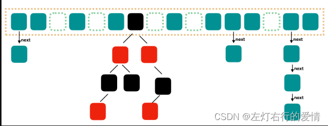
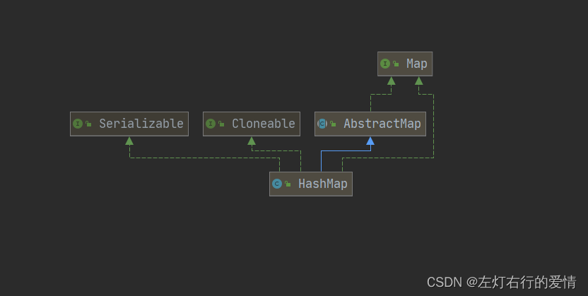
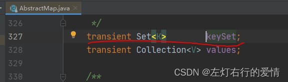
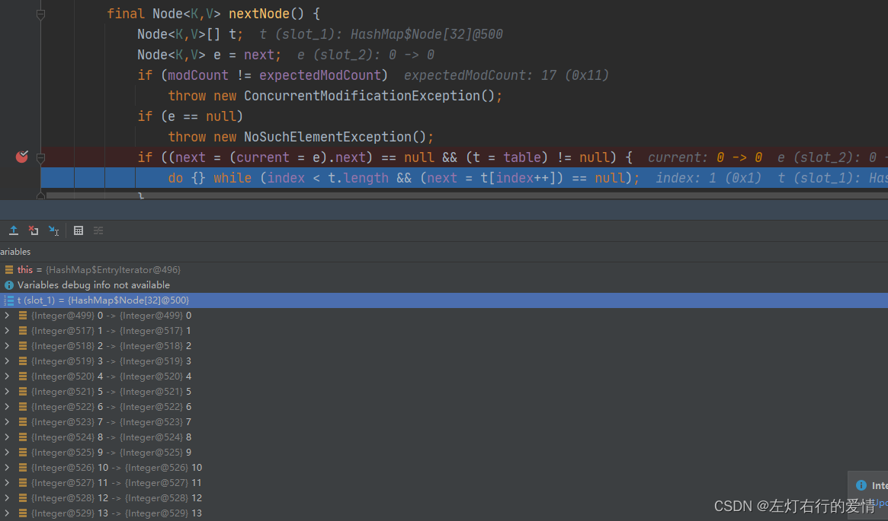
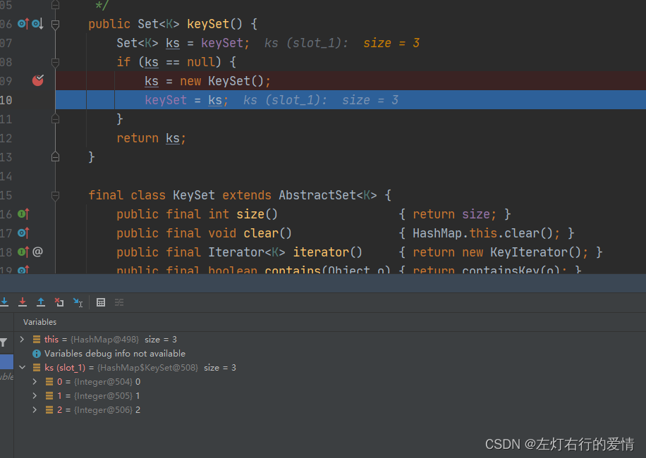
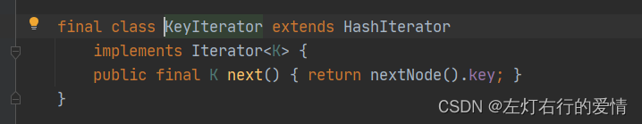
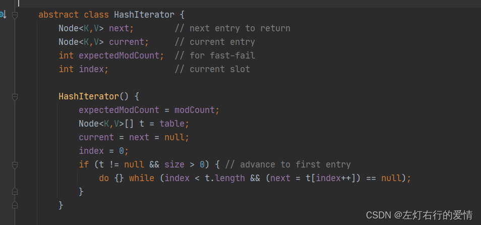
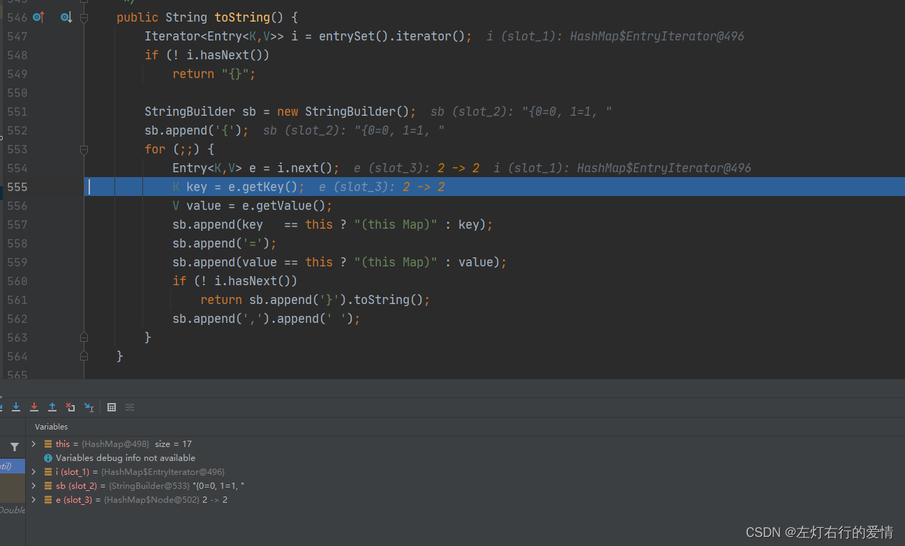
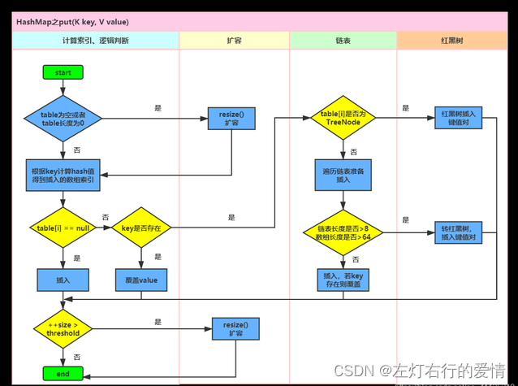

> 原文：[CSDN](https://blog.csdn.net/qq_45852626/article/details/125796898)（历史文章导入，当前状态为草稿）

#### Map与HashMap一文解决
### 前言：

本来按顺序来解读的话呢，这节应该分享的是Collection接口下Set接口下的HashSet实现
类 
，但是HashSet的本质实际上是HashMap，我觉得不如先把本质分析一下，到时候回头看HashSet就简单很多了，也避免了HashSet和HashMap分不清的问题。

### Map实现类

一：简单介绍、

1. Map提供了一种映射关系，它里面的元素是以键值对(key-value）的形式存储的，能够实现根据key快速查找value，并且可以是任何引用类型的数据，然后封装到HashMap$Node对象中。
2. Map中的key不允许重复，重复时发生替换，key可以为null，但是只能有一个，value为null可以有多个。
3. key和value之间存在单向一对一的关系，即通过指定的key总能找到对应的value。
4. Map接口下的集合类都属于双列结合，元素都是键值对形式存在  
    二：简单方法例子

```
        Map map = new HashMap();
        map.put("就是爱你", "陶喆");
        map.put("流沙", "陶喆");
        map.put("Melody", "陶喆");
        map.put("普通朋友", "陶喆");
        System.out.println(map);//{流沙=陶喆, 普通朋友=陶喆, Melody=陶喆, 就是爱你=陶喆}
//        map.remove("流沙");
//        System.out.println(map);//{普通朋友=陶喆, Melody=陶喆, 就是爱你=陶喆}
//        System.out.println(map.get("普通朋友"));//陶喆
//        System.out.println(map.size());//3
//        System.out.println(map.isEmpty());//false
//        map.clear();
//        System.out.println(map);//{}
        System.out.println(map.containsKey("飞机场的10:30"));//false
        System.out.println(map.containsKey("就是爱你"));//true


```

### HashMap核心解读

兄弟们，重头戏来了，这个太重要了，面试必问的重头戏☆☆☆☆☆。

#### 简单介绍

##### HashMap的本质是hash表。

hash表是一种数据结构（关联数组抽象数据类型），**在hash表中增删查操作性能非常高**，在不考虑hash冲突情况下，**通过hash函数计算桶单元或槽位数组中的索引来一次定位即可完成，时间复杂度O(1)。**

所以，你可以将HashMap看为链表加数组的一种数据结构：数组被分为一个个桶（bucket），每个桶存储有一个或多个Entry对象，每个Entry对象包含四个属性key（键）、value（值），hash（hash值），next(指向下一个Entry），通过哈希值决定了Entry对象在哪个数组的寻址；hash值相同的Entry对象（即发生hash碰撞），就把插入的Entry对象跟这个位置上的其他Entry对象通过next属性以链表形式存储形成一个链表。如果**链表大小超过树形转换的阈值（TREEIFY\_THRESHOLD= 8），链表就会被改造为树形结构。**

JDK1.8之前，采用的是数组+链表，链表主要是解决hash碰撞（两个对象调用HashCode()的哈希码值一致导致数组索引相同）而存在的，链表的优点在于增加，删除速度快，但是查询效率低。

Jdk1.8之后，采用的是数组+链表/红黑树，之所以改为**红黑树，是为了提高查询效率，因为遍历链表的时间复杂度是O(n)，而遍历红黑树的时间复杂度是O(logn)**,顺便一提，对于HashMap根据key来查找的时间复杂度则取决于桶里的数据结构

##### HashMap的基本结构

我们需要理解几个概念，以便我们更好的了解HashMap。  
 bucket：HashMap中数组对应的索引位置（槽位）。  
 bin：在HashMap中，有多个元素的key都计算到同一个bucket中，我们会通过链表或红黑树的方式来存储，这个链表或者红黑树就是bin。  
 

#### 继承关系

  
 代码如下：

```
public class HashMap<K,V> extends AbstractMap<K,V>
    implements Map<K,V>, Cloneable, Serializable 


```

1：AbstractMap：此类提供了Map接口的骨干实现，从而最大限度地减少了实现此接口所需的工作，子类可以继承该抽象类来决定具体如何实现键值对的映射。它和ArrayList的AbstractList是一样的作用。  
 2:Cloneable：提供可拷贝功能  
 3:Serializable: 提供可序列化功能。  
 在这里的描述都不细致，因为在ArrayList那节都已经解读过了，感兴趣可以去看看前面的ArrayList解读。

#### 源码分析

##### javaDoc分析

```
/**
 * Hash table based implementation of the <tt>Map</tt> interface.  This
 * implementation provides all of the optional map operations, and permits
 * <tt>null</tt> values and the <tt>null</tt> key.  (The <tt>HashMap</tt>
 * class is roughly equivalent to <tt>Hashtable</tt>, except that it is
 * unsynchronized and permits nulls.) 
 *基于Hash表的Map接口的实现
 * 这个实现提供了所有可选的映射操作，而且允许键和值为null。（HashMap粗略等同于Hashtable，除了它不是非同步性并且允许null值出现）
 *This class makes no guarantees as to the order of the map; in particular, it does not guarantee that the order will remain constant over time.
 不保证顺序性
 *
 
 * <p>This implementation provides constant-time performance for the basic
 * operations (<tt>get</tt> and <tt>put</tt>), assuming the hash function
 * disperses the elements properly among the buckets. 
 * 这个实现提供了恒定性能的get和put方法，假设HashMap将所有的元素均匀分散在桶中
 *  Iteration over collection views requires time proportional to the "capacity" of the
 * <tt>HashMap</tt> instance (the number of buckets) plus its size (the number
 * of key-value mappings).  
 * 容器进行迭代或者汇总的时间与容器的容量成正比
 * 
 * Thus, it's very important not to set the initial capacity too high (or the load factor too low) if iteration performance is important.
 *因此，不要将初始化的容量设置的过大或者负载因子设置的过低，这对于迭代的性能很重要。
 * <p>An instance of <tt>HashMap</tt> has two parameters that affect its
 * performance: <i>initial capacity</i> and <i>load factor</i>.  
 * HashMap的实例有两个参数，初始化容量和负载因子。
 * The <i>capacity</i> is the number of buckets in the hash table, and the initial
 * capacity is simply the capacity at the time the hash table is created. 
 * 初始容量就是hash表创建时初始的桶数量
 *  The <i>load factor</i> is a measure of how full the hash table is allowed to
 * get before its capacity is automatically increased.  
 * 负载因子则是hash表允许内部有多少元素的衡量，它在其容量扩容前获取。
 * 
 * When the number of entries in the hash table exceeds the product of the load factor and the current capacity, the hash table is <i>rehashed</i> ( that is, internal data structures are rebuilt) so that the hash table has approximately twice the number of buckets.
 * 当hash表的size超过了负载因子和当前容量的乘积，hash表通过rehash方式进行重建扩容，大约是桶数量的两倍。
 * 
 *
 * <p>As a general rule, the default load factor (.75) offers a good
 * tradeoff between time and space costs.  
 * 通常来说，负载因子的大小为0.75，这个数据是权衡过对时间和空间的影响。
 * Higher values decrease the space overhead but increase the lookup cost (reflected in most of the operations of the <tt>HashMap</tt> class, including
 * <tt>get</tt> and <tt>put</tt>).  
 * 负载因子越高，空间的开销越小，但是检索的时间成本就越高。（反映在大多数的HashMap操作中，包括get，put方法）

 * The expected number of entries in  the map and its load factor should be taken into account when setting its initial capacity, so as to minimize the number of
rehash operations. 
在设置初始容量时，要考虑map中预期的数据和其负载因子，以减少后面rehash操作的次数。

 If the initial capacity is greater than the maximum number of entries divided by the load factor, no rehash operations will ever occur.
 如果初始化容量大于数据/负载因子，则不会发生rehash操作。
 *
 * <p>If many mappings are to be stored in a <tt>HashMap</tt>
 * instance, creating it with a sufficiently large capacity will allow
 * the mappings to be stored more efficiently than letting it perform
 * automatic rehashing as needed to grow the table.  
如果有大量数据需要存储到HashMap的实例中，那么足够大的初始化容量来创建这个hash表将会比初始化容量比较小后面需要不断扩容的hash表更有效率
Note that using  many keys with the same {@code hashCode()} is a sure way to slow down performance of any hash table. 
如果有多个元素的hashcode值相同，会导致hashtable的性能降低

To ameliorate impact, when keys are {@link Comparable}, this class may use comparison order among keys to help break ties.
为了提升性能，可以将Comparable作为key，使用这些元素之间的比较顺序来避免这个问题
 *
 * <p><strong>Note that this implementation is not synchronized.</strong>
 * If multiple threads access a hash map concurrently, and at least one of
 * the threads modifies the map structurally, it <i>must</i> be
 * synchronized externally.  (A structural modification is any operation
 * that adds or deletes one or more mappings; merely changing the value
 * associated with a key that an instance already contains is not a
 * structural modification.)  
 *  注意HashMap是非同步的，如果多线程并发环境下，最后的这个线程如果修改了HashMap的结构，它必须在外部加上同步方法。结构修改是指任何添加或者删除操作，仅仅是改变value则不是属于结构修改
 * 
 * This is typically accomplished by synchronizing on some object that naturally encapsulates the map.
 * 这通常是在自然封装的映射对象上同步。
 *
 * If no such object exists, the map should be "wrapped" using the
 * {@link Collections#synchronizedMap Collections.synchronizedMap}
 * method.  
 * 如果没有这些对象，那么请使用Collections.synchronizedMap方法。
 * This is best done at creation time, to prevent accidental
 * unsynchronized access to the map:<pre>
 *   Map m = Collections.synchronizedMap(new HashMap(...));</pre>
 *最好是在对象创建完成之后访问，以防止不同步的访问方法。
 * <p>The iterators returned by all of this class's "collection view methods"
 * are <i>fail-fast</i>: if the map is structurally modified at any time after
 * the iterator is created, in any way except through the iterator's own
 * <tt>remove</tt> method, the iterator will throw a {@link ConcurrentModificationException}.  
 * 迭代器返回了这个类的所有集合视图方法，这个方法也是fail-fast的，在迭代器创建之后，如果Map的结构被修改，将会抛出ConcurrentModificationException。
Thus, in the face of concurrent  modification, the iterator fails quickly and cleanly, rather than risking arbitrary, non-deterministic behavior at an undetermined time in the future.
因此，为了应对并发修改，迭代器会迅速的执行fail-fast，而不是冒险执行那些未来可能会有的未确定的行为。

 *
 * <p>Note that the fail-fast behavior of an iterator cannot be guaranteed
 * as it is, generally speaking, impossible to make any hard guarantees in the
 * presence of unsynchronized concurrent modification.  
 * 注意，迭代器快速失败行为并不能得到保证，因为通常而言，在非同步的并发修改时不可能做出任何确定性的保证。

 *Fail-fast iterators  throw <tt>ConcurrentModificationException</tt> on a best-effort basis.
 fail-fast机制将最大努力的抛出ConcurrentModificationException
 
 * Therefore, it would be wrong to write a program that depended on this
 * exception for its correctness: <i>the fail-fast behavior of iterators
 * should be used only to detect bugs.</i>
 *不要让程序依赖这个异常来保证其正确性，fail-fast机制只能用来检测bug。
 * <p>This class is a member of the
 * <a href="{@docRoot}/../technotes/guides/collections/index.html">
 * Java Collections Framework</a>.
 *
 * @param <K> the type of keys maintained by this map
 * @param <V> the type of mapped values
 *
 * @author  Doug Lea
 * @author  Josh Bloch
 * @author  Arthur van Hoff
 * @author  Neal Gafter
 * @see     Object#hashCode()
 * @see     Collection
 * @see     Map
 * @see     TreeMap
 * @see     Hashtable
 * @since   1.2
 */


```

##### 静态变量

```
//序列化Id，作为唯一识别标志，用于序列化和反序列化
   private static final long serialVersionUID = 362498820763181265L;
    /**
     * The default initial capacity - MUST be a power of two. 默认初始化容量-必需是2的幂
     */
    static final int DEFAULT_INITIAL_CAPACITY = 1 << 4; // aka 16   大小为16

    /**
     * The maximum capacity, used if a higher value is implicitly specified
     * by either of the constructors with arguments.
     * MUST be a power of two <= 1<<30.
     */
     最大容量：2的30次方
    static final int MAXIMUM_CAPACITY = 1 << 30;

    /**
     * The load factor used when none specified in constructor.
     * 构造函数中未指定负载因子时使用的负载因子。
     */
    static final float DEFAULT_LOAD_FACTOR = 0.75f; 负载因子，扩容时使用

    /**
     * The bin count threshold for using a tree rather than list for a
     * bin.  Bins are converted to trees when adding an element to a
     * bin with at least this many nodes. The value must be greater
     * than 2 and should be at least 8 to mesh with assumptions in
     * tree removal about conversion back to plain bins upon
     * shrinkage.
     */
     一个桶树化的阈值。
     当桶中元素个数超过这个值时，需要使用红黑树节点替换链表节点。
    static final int TREEIFY_THRESHOLD = 8;

    /**
     * The bin count threshold for untreeifying a (split) bin during a
     * resize operation. Should be less than TREEIFY_THRESHOLD, and at
     * most 6 to mesh with shrinkage detection under removal.
     */
     一个树的链表还原阈值
     当扩容时，桶中元素个数<这个值，会把树形的桶元素切分为链表结构
    static final int UNTREEIFY_THRESHOLD = 6;

    /**
     * The smallest table capacity for which bins may be treeified.
     * (Otherwise the table is resized if too many nodes in a bin.)
     * Should be at least 4 * TREEIFY_THRESHOLD to avoid conflicts
     * between resizing and treeification thresholds.
     */
     哈希表的最小树形化容量
     当哈希表中的容量>这个值时，表中的桶才能进行树化
     否则桶内元素太多时会扩容，而不是树化
     为了避免进行扩容，树化选择的冲突，这个值不能小于4*TREEIFY_THRESHOLD
    static final int MIN_TREEIFY_CAPACITY = 64;


```

##### 成员变量

```
   /**
     * The table, initialized on first use, and resized as
     * necessary. When allocated, length is always a power of two.
     * (We also tolerate length zero in some operations to allow
     * bootstrapping mechanics that are currently not needed.)
     */
     存储元素的数组,也被称为bucket数组.
     table是Nodes数组，在第一次使用的时候才初始化，并调整为必要的大小。
     当分配的时候，长度总是2的幂次方。
     在某些操作时，长度可能是0（通常不需要这样）
     注意transient修饰符，HashMap本身有特别的序列化操作，不是传统的序列化方式
    transient Node<K,V>[] table;

    /**
     * Holds cached entrySet(). Note that AbstractMap fields are used
     * for keySet() and values().
     */
     它是一个缓存视图，抽象类AbstractMap 使用的是keySet和values
     这个方便去遍历，它将原有的Map集合中的键和值作为一个整体返回Set集合
     再将包含键值对的对象Set集合转化为Iterator接口对象，然后获取集合中的所有键值对映射关系，再从映射关系中取键和值
     注意,它也是懒加载的,只在首次访问时创建
    transient Set<Map.Entry<K,V>> entrySet;

    /**
     * The number of key-value mappings contained in this map.
     */
     hashMap元素的数目
    transient int size;

    /**
     * The number of times this HashMap has been structurally modified
     * Structural modifications are those that change the number of mappings in
     * the HashMap or otherwise modify its internal structure (e.g.,
     * rehash).  This field is used to make iterators on Collection-views of
     * the HashMap fail-fast.  (See ConcurrentModificationException).
     */
     表示在HashMap结构上修改的次数，目的是使得建立在hashMap集合上的视图的迭代器执行fail-fast，抛出异常ConcurrentModificationException
    transient int modCount;

    /**
     * The next size value at which to resize (capacity * load factor).
     *
     * @serial
     */
    // (The javadoc description is true upon serialization.
    // Additionally, if the table array has not been allocated, this
    // field holds the initial array capacity, or zero signifying
    // DEFAULT_INITIAL_CAPACITY.)
    调整table大小啊的一个阈值，其结果为当前的容量*负载因子
    如果table没有分配，这个阈值为0或者为 DEFAULT_INITIAL_CAPACITY
    int threshold;

    /**
     * The load factor for the hash table.
     *
     * @serial
     */
     负载因子,它会影响HashMap扩容时机和空间利用率
    final float loadFactor;


```

##### 构造函数

HashMap的构造函数一共有四种：  
 1.无参

```
   /**
     * Constructs an empty <tt>HashMap</tt> with the default initial capacity
     * (16) and the default load factor (0.75).
     * 默认负载因子为0.75，默认容量为16
     */
    public HashMap() {
        this.loadFactor = DEFAULT_LOAD_FACTOR; // all other fields defaulted
    }


```

第二种.有参（参数为
初始化 
容量）

```
 /**
     * Constructs an empty <tt>HashMap</tt> with the specified initial
     * capacity and the default load factor (0.75).
     *
     * @param  initialCapacity the initial capacity.
     * @throws IllegalArgumentException if the initial capacity is negative.
     */
    public HashMap(int initialCapacity) {
        this(initialCapacity, DEFAULT_LOAD_FACTOR);
    }
默认负载因子为0.75


```

第三种.有参(参数为初始化容量和负载因子)

```
 /**
     * Constructs an empty <tt>HashMap</tt> with the specified initial
     * capacity and load factor.
     *
     * @param  initialCapacity the initial capacity
     * @param  loadFactor      the load factor
     * @throws IllegalArgumentException if the initial capacity is negative
     *         or the load factor is nonpositive
     */
    public HashMap(int initialCapacity, float loadFactor) {
        if (initialCapacity < 0)
            throw new IllegalArgumentException("Illegal initial capacity: " +
                                               initialCapacity);
        if (initialCapacity > MAXIMUM_CAPACITY)
            initialCapacity = MAXIMUM_CAPACITY;
        if (loadFactor <= 0 || Float.isNaN(loadFactor))
            throw new IllegalArgumentException("Illegal load factor: " +
                                               loadFactor);
        this.loadFactor = loadFactor;
        this.threshold = tableSizeFor(initialCapacity);
    }
    这里面有对参数的判断：
   1. initialCapacity的有效范围要位于：0-MAXIMUM_CAPACITY之间，否则抛出IllegalArgumentException异常
   2. loadFactor不能小于0或者不为数字。
    之后根据数量算出tableSizeFor
    这里贴出tableSizeFor方法：
      /**
     * Returns a power of two size for the given target capacity.
     * 返回给定目标容量的2的幂。
     */
    static final int tableSizeFor(int cap) {  //返回一个最接近cap的2^n幂
        int n = cap - 1;
        n |= n >>> 1;
        n |= n >>> 2;
        n |= n >>> 4;
        n |= n >>> 8;
        n |= n >>> 16;
        return (n < 0) ? 1 : (n >= MAXIMUM_CAPACITY) ? MAXIMUM_CAPACITY : n + 1;
    }


```

第四种：参数为Map集合  
 HashMap可以将另外一个Map直接变成一个新的HashMap。

```
  /**
     * Constructs a new <tt>HashMap</tt> with the same mappings as the
     * specified <tt>Map</tt>.  The <tt>HashMap</tt> is created with
     * default load factor (0.75) and an initial capacity sufficient to
     * hold the mappings in the specified <tt>Map</tt>.
     *
     * @param   m the map whose mappings are to be placed in this map
     * @throws  NullPointerException if the specified map is null
     */
    public HashMap(Map<? extends K, ? extends V> m) {
        this.loadFactor = DEFAULT_LOAD_FACTOR;//负载因子为0.75
        putMapEntries(m, false);
    }
    这个构造函数方法体里调用了putMapEntries。可以将Map的Entrys全部插入。
    方法如下：
      /**
     * Implements Map.putAll and Map constructor.
     *
     * @param m the map
     * @param evict false when initially constructing this map, else
     * true (relayed to method afterNodeInsertion).
     */
    final void putMapEntries(Map<? extends K, ? extends V> m, boolean evict) {
        int s = m.size();
        if (s > 0) { 
        //如果插入的map不为空
            if (table == null) { // pre-size
                float ft = ((float)s / loadFactor) + 1.0F;//计算负载因子
                int t = ((ft < (float)MAXIMUM_CAPACITY) ?
                         (int)ft : MAXIMUM_CAPACITY);
                if (t > threshold)
                    threshold = tableSizeFor(t);//计算出阈值
            }
            else if (s > threshold)  //如果插入的size大于阈值则扩容
                resize();
            
            for (Map.Entry<? extends K, ? extends V> e : m.entrySet()) {//遍历插入
                K key = e.getKey();
                V value = e.getValue();
                putVal(hash(key), key, value, false, evict);
            }
        }
    }


```

##### 重点内部类解读

###### Node ：

Node是构成桶中链表的基本元素。

```
  /**
     * Basic hash bin node, used for most entries.  (See below for
     * TreeNode subclass, and in LinkedHashMap for its Entry subclass.)
     */
    static class Node<K,V> implements Map.Entry<K,V> {
        final int hash;
        final K key;
        V value;
        Node<K,V> next;
        注意hash和key 用了final修饰是不可改变的，但是值是可以改变的。
        由于是链表结构，又维护了一个next的指针，指向下一个元素。

   构造函数：
        Node(int hash, K key, V value, Node<K,V> next) {
            this.hash = hash;
            this.key = key;
            this.value = value;
            this.next = next;
        }
重点方法：
 public final int hashCode() {
            return Objects.hashCode(key) ^ Objects.hashCode(value);
        }
        hashCode方法里执行了一个异或，作为自身的哈希值，
        如果键值相同，返回0。
        
   public final boolean equals(Object o) {
            if (o == this)     //判断对象o和自身地址是否相同
                return true;
            if (o instanceof Map.Entry) {    //判断o是否为Map.Entry接口的实现类
                Map.Entry<?,?> e = (Map.Entry<?,?>)o;
                if (Objects.equals(key, e.getKey()) && 
                    Objects.equals(value, e.getValue()))//判断键和值是否相等
                    return true;
            }
            return false;
        }


```

###### TreeNode

TreeNode是hashMap树化后组成树的基本节点，继承了LInkedHashMap.Entry，而LInkedHashMap.Entry又继承Node。  
 它里面方法主要是红黑树的各种该操作，代码量很大，难度较高，后面我们整体分析玩集合后单开一节去说它，这里有个概念就行。

###### keySet

keySet是一个成员变量,它的类型是Set,用于存储HashMap中所有的键.  
 它继承于AbstractSet，里面的元素还是Map.Entry<K,V>.  
 这个keySet变量并不是在hashMap实例化时就立刻填充了所有的键,而是使用了一种延迟初始化的策略,也就是懒加载.  
 它实现了Set接口，但是没有组织数据的功能，外部也无法直接获取一个KeySet对象。  
 我们可以通过调用hashMap.KeySet()方法，将映射表中的所有键组织成Set结构。我们将这种结合内部的集合成为视图。  
 keyset并不是新的集合类，简单看做HashMap中部分数据的组织形式，方便迭代查找操作就可以了。

```
  /**
     * Returns a {@link Set} view of the keys contained in this map.
     *  一个包含map全部key的视图
     * The set is backed by the map, so changes to the map are
     * reflected in the set, and vice-versa. 
     * 视图和集合中的操作是互相影响的。
 
     *  If the map is modified while an iteration over the set is in progress (except through  the iterator's own <tt>remove</tt> operation), the results of the iteration are undefined.  
     * 如果在对集合进行迭代的过程中修改了映射(除了通过迭代器自己的< tt >删除</tt >操作)，迭代的结果是undefined的。
     * 
     * The set supports element removal,which removes the corresponding mapping from the map, via the <tt>Iterator.remove</tt><tt>Set.remove</tt<tt>removeAll</tt>, <tt>retainAll</tt>, and <tt>clear</tt>
     * operations.  It does not support the <tt>add</tt> or <tt>addAll</tt>
     * operations.
     * 具体支持操作有remove，removeAll，retain，clear，不支持add和addALL操作
     *
     * @return a set view of the keys contained in this map
     */
    public Set<K> keySet() {    //注意留意一下这里，此时这个方法体里并没有把HashMap中的键添加到Set集合中。
        Set<K> ks = keySet;
        if (ks == null) {
            ks = new KeySet();
            keySet = ks;
        }
        return ks;
    }
    

   这里的keySet是HashMap的内部类，可以看到它里面的方法对应执行的都是HashMap的方法。
   通过这种方式，HashMap可以提供一个高效，与映射本身紧密集成的键集合视图，而不需要复制键或维护单独的数据结构
    final class KeySet extends AbstractSet<K> {
        public final int size()                 { return size; }
        public final void clear()               { HashMap.this.clear(); }
        public final Iterator<K> iterator()     { return new KeyIterator(); }
        public final boolean contains(Object o) { return containsKey(o); }
        public final boolean remove(Object key) {
            return removeNode(hash(key), key, null, false, true) != null;
        }
        public final Spliterator<K> spliterator() {
            return new KeySpliterator<>(HashMap.this, 0, -1, 0, 0);
        }
        //这个 forEach 方法提供了一种遍历 HashMap 中所有键并对每个键执行特定操作的方式，同时确保了遍历过程中的线程安全性
        public final void forEach(Consumer<? super K> action) {
            Node<K,V>[] tab;
            if (action == null)
                throw new NullPointerException();
            if (size > 0 && (tab = table) != null) {
            //这里记录了遍历开始前的 `modCount` 值。
                int mc = modCount;
                //外层循环：遍历了数组 `tab` 中的每个槽位（bucket）
                //内层循环：遍历了每个槽位中的链表（或红黑树），直到找到 `null` 为止。在遍历过程中，使用 `action.accept(e.key)` 对每个键执行传入的操作
                for (int i = 0; i < tab.length; ++i) {
                    for (Node<K,V> e = tab[i]; e != null; e = e.next)
                        action.accept(e.key);
                }
                if (modCount != mc)
                    throw new ConcurrentModificationException();
            }
        }
    }

Java8引入的函数式接口之一。
主要用于表示接受一个输入参数并且不返回结果的操作。
@FunctionalInterface
public interface Consumer<T> {

    void accept(T t);

    default Consumer<T> andThen(Consumer<? super T> after) {
        Objects.requireNonNull(after);
        return (T t) -> { accept(t); after.accept(t); };
    }
}


```

这里深入分析一下，为什么在keyset中HashMap没有把键添加到Set集合中，那么它是通过什么样的逻辑方法添加键呢？  
 我们深入分析一下keyset的底层调用逻辑：

```
    public Set<K> keySet() {   
        Set<K> ks = keySet;   // 这里的keySet是什么？


```

  
 可以看到，这是AbstractMap里面的一个成员变量（用transient修饰，返回值是一个set集合)，  
 我们看后面的代码：

```
 if (ks == null) {                //如果发现ks的引用为null，则构建一个KetSet。
            ks = new KeySet();
            keySet = ks;
        }


```

这里的KetSet是构造函数里面的：

```
final class KeySet extends AbstractSet<K> {
        public final int size()                 { return size; }
        public final void clear()               { HashMap.this.clear(); }
        public final Iterator<K> iterator()     { return new KeyIterator(); 
}      //就是它


```

我们继续看什么是KeyIterator：

```
    final class KeyIterator extends HashIterator implements Iterator<K> {
        public final K next() { 
        return nextNode().key;
      }
}


```

这就很明了，我们再去看什么是nextNode：

```
  final Node<K,V> nextNode() {
            Node<K,V>[] t; 保存hash数组的table
            Node<K,V> e = next;   保存当前节点的下一个节点
            if (modCount != expectedModCount)   判断修改次数
                throw new ConcurrentModificationException();
            if (e == null)   如果下一个节点为null
                throw new NoSuchElementException();
                 判断：当前节点的下一个节点是否为null&&hash数组的table是否为null
            if ((next = (current = e).next) == null && (t = table) != null) {  
                do {
                } while (index < t.length && (next = t[index++]) == null);  循环判断：用于找到下一个非空桶的位置
                两个条件:
                1. 确保索引index没有超出哈希数组table的范围。
                2. 获取table中索引为index的桶，并赋值给next。然后，增加index的值。如果这个桶是空的（即null），则继续循环。
                目的:这个循环的目的是为了找到下一个非空的桶，并将next指向该桶的第一个节点。这样，在下次调用nextNode()时，可以从这个非空桶开始迭代。
            }
            return e;
        }


```

t：保存hash数组的table  
   
 index：数组的索引

进一步解释一下这两行代码：

```
  if ((next = (current = e).next) == null && (t = table) != null) {
                do {} while (index < t.length && (next = t[index++]) == null);
    }


```

因为hashmap的结构是数组加链表，索引我们不光要判断链表，还要去判断数组，if里面是判断链表返回不为空的节点，while里是数组的判断。  
 现在我们分析过了keyset的底层调用逻辑.  
 **有个问题还需要思考：它到底怎么把键加入到keyset里面的？**  
 我们上面一路分析下来，发现事情并不简单，我们并没有发现keyset返回了一个集合（集合里保存了HashMap所有的Key），它只是创建了一个KeySet类的对象，并没有把HashMap的key都加入进来，之后方法就返回了。  
   
 而我们在调试代码的时候，可以明显的看出，执行完`ks=new KeySet()`后，ks中就已经有元素了.  
 **那么到底是什么时候HashMap的key加入到KeySet集合中的呢？**

我们之前看keySet类的构造函数，发现只有默认构造函数，如果不是在keySet构造函数里把HashMap的可以加入进来，那么可能是KeySet的父类构造函数中加入进来：  
   
 然而我们通过上图可以看到，都是空实现。。。  
 这部分真的卡了我好久= =！  
 当我们调用HashMap的keySet方法时，我们得到一个Set视图，这个视图代表了HashMap中所有的键，这个Set视图并不是通过复制HashMap中所有的键来创建的，而是提供了一个窗口或接口来直接访问HashMap中的键。  
 **所以关键点在于：keySet返回的Set对象并不包含实际的键数据，它只是提供了一种方式来遍历和查看HashMap中的键。当你使用迭代器或for-each循环遍历这个set时，它会在内部访问HashMap的数据结构，并逐个返回键。**

**细心的你可能发现了：调试代码中，key没有加入到set中，idea是如何显示出ks有元素的？**  
 原因在于:idea显示对象信息时，会调用对象的toString方法。。。。  
 注意：这个调用是隐式的！！！  
 AbstractMap中的toString方法：  
 

##### EntrySet

这个和keySet很相似。  
 Map中采用Entry内部类来表示一个映射项，映射项包含key和value（其实键值对就是Entry）  
 来看代码吧，你会发现和keySet很相似

```
 final class EntrySet extends AbstractSet<Map.Entry<K,V>> {
        public final int size()                 { return size; }
        public final void clear()               { HashMap.this.clear(); }
        public final Iterator<Map.Entry<K,V>> iterator() {
            return new EntryIterator();
        }
        public final boolean contains(Object o) {
            if (!(o instanceof Map.Entry))
                return false;
            Map.Entry<?,?> e = (Map.Entry<?,?>) o;
            Object key = e.getKey();
            Node<K,V> candidate = getNode(hash(key), key);
            return candidate != null && candidate.equals(e);
        }
        public final boolean remove(Object o) {
            if (o instanceof Map.Entry) {
                Map.Entry<?,?> e = (Map.Entry<?,?>) o;
                Object key = e.getKey();
                Object value = e.getValue();
                return removeNode(hash(key), key, value, true, true) != null;
            }
            return false;
        }
        public final Spliterator<Map.Entry<K,V>> spliterator() {
            return new EntrySpliterator<>(HashMap.this, 0, -1, 0, 0);
        }
        public final void forEach(Consumer<? super Map.Entry<K,V>> action) {
            Node<K,V>[] tab;
            if (action == null)
                throw new NullPointerException();
            if (size > 0 && (tab = table) != null) {
                int mc = modCount;
                for (int i = 0; i < tab.length; ++i) {
                    for (Node<K,V> e = tab[i]; e != null; e = e.next)
                        action.accept(e);
                }
                if (modCount != mc)
                    throw new ConcurrentModificationException();
            }
        }
    }


```

它的细节基本和keySet一样。

###### values

和EntrySet与KeySet同理，只是accept中的参数是e.value而不是上面两个内部类的e.key  
 代码如下：

```
final class Values extends AbstractCollection<V> {
        public final int size()                 { return size; }
        public final void clear()               { HashMap.this.clear(); }
        public final Iterator<V> iterator()     { return new ValueIterator(); }
        public final boolean contains(Object o) { return containsValue(o); }
        public final Spliterator<V> spliterator() {
            return new ValueSpliterator<>(HashMap.this, 0, -1, 0, 0);
        }
        public final void forEach(Consumer<? super V> action) {
            Node<K,V>[] tab;
            if (action == null)
                throw new NullPointerException();
            if (size > 0 && (tab = table) != null) {
                int mc = modCount;
                for (int i = 0; i < tab.length; ++i) {
                    for (Node<K,V> e = tab[i]; e != null; e = e.next)
                        action.accept(e.value);
                }
                if (modCount != mc)
                    throw new ConcurrentModificationException();
            }
        }
    }


```

#### HashMap 的扩容。☆☆☆☆☆

现在我们来解读这里面最最最重要的内容了！  
 看到这我们再明确HashMap的几个名词：

1. `static final float DEFAULT_LOAD_FACTOR = 0.75f;`负载因子，扩容时使用
2. 一个桶树化的阈值。  
    当桶中元素个数超过这个值时，需要使用红黑树节点替换链表节点。  
    `static final int TREEIFY_THRESHOLD = 8;`
3. 哈希表的最小树形化容量  
    当哈希表中的容量>这个值时，表中的桶才能进行树化  
    否则桶内元素太多时会扩容，而不是树化  
    为了避免进行扩容，树化选择的冲突，这个值不能小于  
    4\*TREEIFY\_THRESHOLD  
    `static final int MIN_TREEIFY_CAPACITY = 64;`
4. hashMap元素的数目  
    `transient int size;`
5. 负载因子  
    `final float loadFactor;`
6. table是Nodes数组，在第一次使用的时候才初始化，并调整为必要的大小。  
    当分配的时候，长度总是2的幂次方。  
    在某些操作时，长度可能是0（通常不需要这样）  
    注意transient修饰符，HashMap本身有特别的序列化操作，不是传统的序列化方式  
    `transient Node<K,V>[] table;`

##### Put方法

我们以put函数举例子进行扩容：

首先我们来看一下put函数：

```
  public V put(K key, V value) {
        return putVal(hash(key), key, value, false, true);
    }


```

真正的核心方法是putVal：

```
     * @param hash hash for key    //  hash值
     * @param key the key         //key值
     * @param value the value to put // value值
     * @param onlyIfAbsent if true, don't change existing value    /这里onlyIfAbsent为false即在key值相同的时候，用新的value值替换原始值，如果为ture，则不改变value值
     * @param evict if false, the table is in creation mode.  表是否在创建模式，如果为false，则表是在创建模式。
     * @return previous value, or null if none     
     */
    final V putVal(int hash, K key, V value, boolean onlyIfAbsent,
                   boolean evict) {
        Node<K,V>[] tab;
         Node<K,V> p;
          int n, i;
          //如果当前HashMap的table数组还未定义或者还没有初始化长度，则先通过扩容resize()进行扩容，并返回扩容后的长度n。
        if ((tab = table) == null || (n = tab.length) == 0)
            n = (tab = resize()).length;
            /**通过数组的长度与hash值做&运算，如果为空则当前创建的节点就是根节点
 这里判断执行了两个操作:
  1. n-1 :计算桶数组长度-1.由于桶数组的长度n总是2的幂，n-1的二进制表示所有位都是1，其位数与桶数组大小的位数相同
  2. &操作：将hash与n-1进行按位与操作。目的是保留hash值的低位，这些地位决定了键应该放在哪个桶中。由于n-1的所有位都是1，
 这个操作相当于取hash值的低几位（具体几位取决与n的大小）
这行判断代码同时完成了三个操作：索引计算，节点访问，空检查。
**/
        if ((p = tab[i = (n - 1) & hash]) == null)
            tab[i] = newNode(hash, key, value, null);
//若该位置已经有元素了，我们需要进行一些操作
        else {         
            Node<K,V> e;
             K k;
             //如果插入的key与原来的key相同，则进行替换
            if (p.hash == hash &&
                ((k = p.key) == key || (key != null && key.equals(k))))
                e = p;
             //如果key不同的情况下，判断当前Node是否为TreeNode，如果是则执行putTreeVal将新的元素插入到红黑树上
            else if (p instanceof TreeNode)
                e = ((TreeNode<K,V>)p).putTreeVal(this, tab, hash, key, value);
                //如果不是TreeNode，则进行链表的遍历
            else {
                for (int binCount = 0; ; ++binCount) {   //注意这里循环没有终止条件
                //如果在链表最后一个节点之后没有找到相同的元素，则直接new Node插入
                    if ((e = p.next) == null) {
                        p.next = newNode(hash, key, value, null);
                      //如果此时binCount从0开始超过了8（包含8），转为红黑树（但这里并不是直接转，因为进到treeifyBin还有一个判断是HashMap容量是否大于64，HashMap从链表转化为红黑树一定是两个条件都符合）
                        if (binCount >= TREEIFY_THRESHOLD - 1) // -1 for 1st
                            treeifyBin(tab, hash);
                        break;
                    }
                   //如果在最后一个链表节点之前找到key值相同的节点（上面那个是通过数组的下标，和这个不相同），则替换
                    if (e.hash == hash &&
                        ((k = e.key) == key || (key != null && key.equals(k))))
                        break;
                    p = e;
                }
            }
//如果e不为null，说明找到了与给定键相匹配的节点
            if (e != null) { // existing mapping for key
                V oldValue = e.value;
               // 如果找到了匹配的节点，那么e.value就是该键对应的旧值。这个旧值稍后会返回给调用者。
                if (!onlyIfAbsent || oldValue == null)
                //如果满足更新条件，则将节点的值更新为value。
                    e.value = value;
                    //这是一个回调方法，用于在访问节点后执行某些操作。在标准的HashMap中，这个方法通常什么都不做，但在一些继承自HashMap的类（如LinkedHashMap）中，它可能会用于维护双向链表等结构。
                afterNodeAccess(e);
                return oldValue;
            }
        }
        ++modCount;
        //判断临界值，是否扩容。
        if (++size > threshold)        
            resize();       //扩容方法
        afterNodeInsertion(evict);   //插入之后的平衡操作
        return null;
    }


```

估计看完源码脑子有点蒙，下面梳理一下put方法的具体逻辑：

1. 判断键值对数组table[i] 是否为null，如果是则进行resize()扩容
2. 根据键key计算hash值得到了插入数组的索引i，如果tab[i]==null则直接插入，执行第6条逻辑，否则执行第三条逻辑
3. 判断tab[i]的第一个元素与插入元素的key的hashcode&equals是否相等，相等则覆盖，否则执行第四步逻辑
4. 判断tab[i]是否是红黑树节点TreeNode，是则在红黑树插入节点，否则执行第五步。
5. 遍历tab[i]判断链表是否>8.大于8则可能转成红黑树（当然必需数组要>64），满足则在红黑树插入节点；  
    否则在链表中插入；在遍历链表的过程中如果存在key的hashCode&Equals相等则替换即可。
6. 插入成功，判断hashmap的size是否超过threshold的值，超过则扩容。  
    

##### resize扩容方法

接下来我们解析resize核心扩容方法,如果触发了阈值threshold，则会调用resize方法进行扩容，容量规则为2的幂次：  
 变量定义：

* oldTab： 指向当前的哈希表
* lodCap： 当前哈希表的容量
* oldThr： 当前的阈值（元素数量超过此值时，哈希表会进行扩容）
* newCap：新哈希表的容量
* newThr： 新哈希表的阈值

```
  final Node<K,V>[] resize() {
        Node<K,V>[] oldTab = table;
        //oldCap为table的size
        int oldCap = (oldTab == null) ? 0 : oldTab.length;
        int oldThr = threshold;
        int newCap, newThr = 0;
        //判断当以前的容量>0,也就是hashMap中已经有元素了，或者new对象的时候设置了初始容量
        if (oldCap > 0) {
        //再次判断以前的容量是否超过(包含等于) 1<<30,则设置临界值为int的最大值2^31-1
            if (oldCap >= MAXIMUM_CAPACITY) {
                threshold = Integer.MAX_VALUE;
                return oldTab;
            }
            //如果以前的容量<限制的最大容量，同时又大于或等于默认的容量16，这里newCap为oldCap的二倍
            else if ((newCap = oldCap << 1) < MAXIMUM_CAPACITY &&
                     oldCap >= DEFAULT_INITIAL_CAPACITY)
                newThr = oldThr << 1; // double threshold   
 //设置临界值为以前临界值的2倍，因为threshold=loadFactor *capacity，capacity扩大了2倍，loadFactor不变，所以这里吧threshold扩大2倍
        }
        /**
        刚开始看到这我有点蒙，迷了好久奇怪为什么突然来这么一句，后来发现这个判断是和构造器有关：
        我们留意一个HashMap的有参构造，在public HashMap(int initialCapacity, float loadFactor) 里面有这么一句代码--- this.threshold = tableSizeFor(initialCapacity);表示在调用构造器时，默认是将初始容量赋值给了threshold临界值，因此也相当于将上一次初始容量赋值给了新的容量。
        所以，当调用了HashMap(int InitialCapacity)构造器，还没有添加元素时会触发这个判断。
        **/
        else if (oldThr > 0) // initial capacity was placed in threshold
            newCap = oldThr;
            //调用了默认构造器，初始容量没有设置，因此使用默认容量DEFAULT_INITIAL_CAPACITY(160，临界值就是16*0.75
        else {            
           // zero initial threshold signifies using defaults
            newCap = DEFAULT_INITIAL_CAPACITY;
            newThr = (int)(DEFAULT_LOAD_FACTOR * DEFAULT_INITIAL_CAPACITY);
        }
        //对临界值做判断，确保不为0.上面两种情况(oldCap>0和oldThr>0,)并没有计算newThr
        if (newThr == 0) {
            float ft = (float)newCap * loadFactor;
            newThr = (newCap < MAXIMUM_CAPACITY &&
                   ft < (float)MAXIMUM_CAPACITY ?
                      (int)ft : Integer.MAX_VALUE);
        }
        threshold = newThr;
        @SuppressWarnings({"rawtypes","unchecked"})
        //构造新表，初始化表中数据
        Node<K,V>[] newTab = (Node<K,V>[])new Node[newCap];
        table = newTab;   //将新表赋值给table
        if (oldTab != null) {
        //遍历将原来table中的数据放到扩容后的新表中
            for (int j = 0; j < oldCap; ++j) {
                Node<K,V> e;
                
                if ((e = oldTab[j]) != null) {
                    oldTab[j] = null;
                    //没有链表的Node节点，直接放到新的table中下标为【e.hash &    		             	      
                     (newCap - 1)】位置即可
                    if (e.next == null)
                        newTab[e.hash & (newCap - 1)] = e;
                      //如果是treeNode节点，则树上的节点放到newTab中
                    else if (e instanceof TreeNode)
                        ((TreeNode<K,V>)e).split(this, newTab, j, oldCap);
                       //如果e后面还有链表节点，则遍历e所在的链表
                    else { // preserve order  //保证顺序
                        Node<K,V> loHead = null, loTail = null;      //低位首尾节点
                        Node<K,V> hiHead = null, hiTail = null;      //高位首尾节点
                       //这里的低位是指数组从0-oldCap-1，高位则是oldCap-newCap-1
                        Node<K,V> next;
                        do {
                        //记录下一个节点
                            next = e.next;
                            /**
                            newTab的容量是以前旧表容量的两倍，数组table下标并不是根据循环逐步递增的，而是通过(table.length-1) & hash计算得到的，因此扩容后，存放的位置就可能发生变化，发生的变化由特定的算法得到：e.hash&oldCap
                            举个例子
                            e.hash=18   它的二进制为 0000  1010
                            oldCap=32  它的二进制为  0001 0000   
                            &运算规则：两个同时为1，结果为1，否则为0
                            &运算得 ：                          0000 0000
                            所以元素扩容后不发生变化,也就是该元素在新数组的位置和在老数组的位置是相同的，可以放在低位链表
                            **/
                            if ((e.hash & oldCap) == 0) {
                                if (loTail == null)    //如果没有尾，说明链表为空
                                    loHead = e;      //头节点指向该元素
                                else
                                    loTail.next = e;         //如果有尾，表示链表不为nul，把该元素挂在链表尾部
                                loTail = e;          //尾结点设置为当前元素
                            }
                            /**
                            如果元素扩容后发生位置变化，运算结果不为0，说明hash值>老数组的长度
                            此时该元素应该放置到新数组的高位位置上
                            **/
                            else {
                                if (hiTail == null)
                                    hiHead = e;
                                else
                                    hiTail.next = e;
                                hiTail = e;
                            }
                        } while ((e = next) != null);
                        
                        if (loTail != null) {       //低位元素组成的链表放在原来的位置上
                            loTail.next = null;
                            newTab[j] = loHead;
                        }
                        if (hiTail != null) {                  //高位元素组成的链表放置位置在原来位置上偏移了老数组长度个位置
                            hiTail.next = null;
                            newTab[j + oldCap] = hiHead;
                        }
                    }
                }
            }
        }
        return newTab;
    }


```

### 结尾

以上核心的HashMap已经梳理完毕了，后面等我们聊到并发集合时候，会将不同jdk版本的HashMap进行比较，目前我们只做基本的了解。
