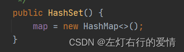
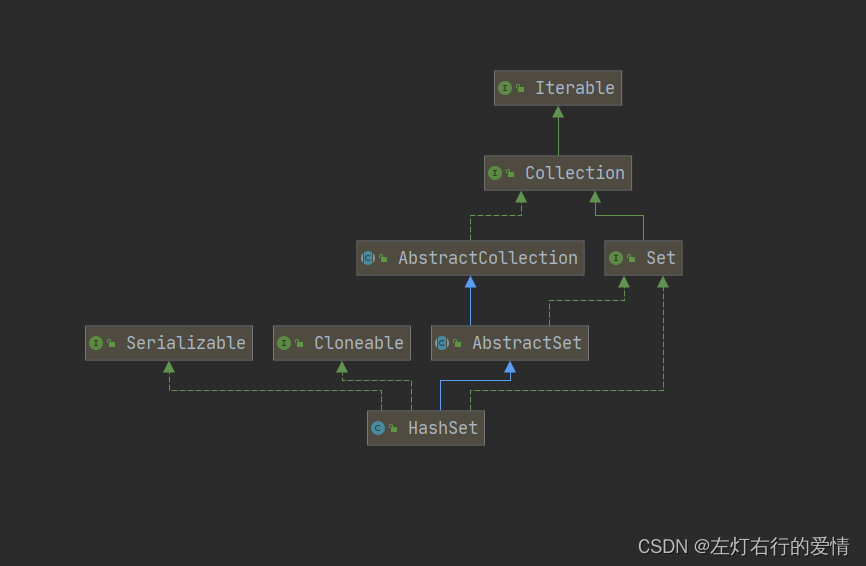

> 原文：[CSDN](https://blog.csdn.net/qq_45852626/article/details/125951275)（历史文章导入，当前状态为草稿）

#### HashSet解读
### 前言

我们之前已经学习了HashMap的核心思想和逻辑，现在再来看HashSet就已经很简单了，因为HashSet的底层就是HashMap= =。  
 简单看一眼：  
 

#### 一： 简单介绍

1：Hashset实现了set接口，实际上是HashMap，  
 2：它可以存放null，但是只能存一个。  
 3：不能有重复的对象，可以达到一个去重的效果。  
 4：不保证元素是有序的，取决于hash后，再确定索引结果  
 5：线程不安全，因为HashMap线程不安全，它自然不安全。

##### HashMap和HashSet的区别

HashSet 的底层实现确实是基于 HashMap 的，但这并不意味着 HashSet 必须提供键值对的存储功能。  
 HashSet 是 HashMap 的一个“视图”或“封装”，它只使用了 HashMap 的键（key）部分来存储元素，而忽略了值（value）部分。  
 在 HashSet 的内部实现中，每个元素都被存储为 HashMap 的一个键，而对应的值通常是一个固定的对象（例如，PRESENT），因为这个值对于 HashSet 的功能来说并不重要。HashSet 的主要目的是提供一个不包含重复元素的集合，因此它只需要利用 HashMap 的键的唯一性特性。  
 HashSet 提供了一个简洁的接口来存储不重复的元素集合，而隐藏了其底层实现的复杂性。我们不需要关心键值对的概念，只需要将元素添加到集合中，并确保它们的唯一性。  
 简言之,HashSet使用HashMap作为底层实现是一种设计上的选择,旨在重用代码,提高性能和简化实现,同时为用户提供了一个专注于元素唯一性的简洁接口.

#### 二：继承图&结构

  
 代码实现如下：

```
public class HashSet<E>
    extends AbstractSet<E>
    implements Set<E>, Cloneable, java.io.Serializable


```

1:AbstractSet：此
类 
提供了Set接口的骨干实现，从而最大限度地减少了实现此接口所需的工作。  
 2:Cloneable：提供可拷贝功能  
 3:Serializable: 提供可序列化功能。  
 在这里的描述都不细致，因为在ArrayList那节都已经解读过了，感兴趣可以去看看前面的ArrayList解读。

#### 三：源码分析

##### javaDoc分析

```
/**
 * This class implements the <tt>Set</tt> interface, backed by a hash table
 * (actually a <tt>HashMap</tt> instance). 
 * 这个类实现了set接口，并且有hash表的支持（实际上是hashMap）
 *  It makes no guarantees as to the iteration order of the set; in particular, it does not guarantee that the order will remain constant over time. 
它不保证集合的迭代顺序，尤其是，不保证顺序随时间不变
 *  This class permits the <tt>null</tt>element.
 * 这个类允许null元素出现
 *
 * <p>This class offers constant time performance for the basic operations
 * (<tt>add</tt>, <tt>remove</tt>, <tt>contains</tt> and <tt>size</tt>),
 * assuming the hash function disperses the elements properly among the
 * buckets.
 * 这个类提供的操作（add，remove，contains，size）都是常数级时间复杂度，
 * 假定hash函数将分散元素到桶中
 * 
 * Iterating over this set requires time proportional to the sum of
 * the <tt>HashSet</tt> instance's size (the number of elements) plus the
 * "capacity" of the backing <tt>HashMap</tt> instance (the number of
 * buckets).  
 * 迭代此集合需要的时间与hashSet元素数量加上后备HashMap的容量（桶数）之和成正比例。
 * 
 * Thus, it's very important not to set the initial capacity too
 * high (or the load factor too low) if iteration performance is important.
 *所以，为了迭代的性能，不要将初始容量设置的过高（或负载因子太低）非常重要。
 * <p><strong>Note that this implementation is not synchronized.</strong>
 * 注意，此实现不同步
 * If multiple threads access a hash set concurrently, and at least one of
 * the threads modifies the set, it <i>must</i> be synchronized externally.
 * 如果多个线程同时访问，并且至少有一个线程修改了该集合，则必需在外部进行同步。
 * This is typically accomplished by synchronizing on some object that
 * naturally encapsulates the set.
 *这通常在自然封装集合的某个对象上进行同步来实现
 * If no such object exists, the set should be "wrapped" using the
 * {@link Collections#synchronizedSet Collections.synchronizedSet}
 * method. 
 * 如果不存在此类对象，则应使用Collections.synchronizedSet方法“包装”该集合 。
 * This is best done at creation time, to prevent accidental
 * unsynchronized access to the set:<pre>
 *   Set s = Collections.synchronizedSet(new HashSet(...));</pre>
 *这最好在创建时完成，以防止对集合的意外不同步访问：
  Set s = Collections.synchronizedSet(new HashSet(...)); 

 * <p>The iterators returned by this class's <tt>iterator</tt> method are
 * <i>fail-fast</i>: if the set is modified at any time after the iterator is
 * created, in any way except through the iterator's own <tt>remove</tt>
 * method, the Iterator throws a {@link ConcurrentModificationException}.
 * 此类的iterator方法返回的迭代器是快速失败的 ：如果在创建迭代器之后的任何时间修改该集，除了通过迭代器自己的remove方法之外，迭代器抛出ConcurrentModificationException 。
 * Thus, in the face of concurrent modification, the iterator fails quickly
 * and cleanly, rather than risking arbitrary, non-deterministic behavior at
 * an undetermined time in the future.
 *因此，在并发修改的情况下，迭代器快速而干净地失败，而不是在未来的未确定时间冒任意，非确定性行为的风险。
 * <p>Note that the fail-fast behavior of an iterator cannot be guaranteed
 * as it is, generally speaking, impossible to make any hard guarantees in the
 * presence of unsynchronized concurrent modification. 
 * 请注意，迭代器的快速失败行为无法得到保证，因为一般来说，在存在不同步的并发修改时，不可能做出任何硬性保证。
 *  Fail-fast iterators throw <tt>ConcurrentModificationException</tt> on a best
 * -effort basis.
 * 失败快速迭代器以尽力而为的方式抛出ConcurrentModificationException 。
 * 
 *  Therefore, it would be wrong to write a program that depended on this
 * exception for its correctness: <i>the fail-fast behavior of iterators
 * should be used only to detect bugs.</i>
 *因此，编写依赖于此异常的程序以确保其正确性是错误的： 迭代器的快速失败行为应该仅用于检测错误。


```

##### 构造方法

HashSet的构造方法有四种：  
 1：无参构造

```
 /**
     * Constructs a new, empty set; the backing <tt>HashMap</tt> instance has
     * default initial capacity (16) and load factor (0.75).
     */
    public HashSet() {
        map = new HashMap<>();
    }


```

##### 成员变量&&静态变量

成员变量：

```
    private transient HashMap<E,Object> map;  //底层采用HashMap存储


```

静态变量：

```
static final long serialVersionUID = -5024744406713321676L;//序列号

 private static final Object PRESENT = new Object();
 这个非常重要，因为HashMap接收的是键值对，而HashSet是单列只有值，所以这里HashSet采用的方法是把值存在HashMap键的位置，而值则填充一个静态变量present。


```

##### 有参构造（参数是集合）

```
  /**
     * Constructs a new set containing the elements in the specified
     * collection.  The <tt>HashMap</tt> is created with default load factor
     * (0.75) and an initial capacity sufficient to contain the elements in
     * the specified collection.
     * 构造一个包含指定集合中元素的新集合。 
     * HashMap使用默认加载因子（0.75）创建，初始容量足以包含指定集合中的元素。
     *
     * @param c the collection whose elements are to be placed into this set
     * @throws NullPointerException if the specified collection is null
     */
    public HashSet(Collection<? extends E> c) {
        map = new HashMap<>(Math.max((int) (c.size()/.75f) + 1, 16));
        addAll(c);
    }
    这里Math.max((int) (c.size()/.75f)是给HashMap足够的存储空间。


```

3：有参构造（参数是初始容量和负载因子）

```
   /**
     * Constructs a new, empty set; the backing <tt>HashMap</tt> instance has
     * the specified initial capacity and the specified load factor.
     * 构造一个新的空集; 依赖HashMap实例具有指定的初始容量和指定的加载因子。
     *
     * @param      initialCapacity   the initial capacity of the hash map
     * @param      loadFactor        the load factor of the hash map
     * @throws     IllegalArgumentException if the initial capacity is less
     *             than zero, or if the load factor is nonpositive
     */
    public HashSet(int initialCapacity, float loadFactor) {
        map = new HashMap<>(initialCapacity, loadFactor);
    }


```

4：有参（参数只有初始容量）

```
 public HashSet(int initialCapacity) {
        map = new HashMap<>(initialCapacity);
    }


```

(3)： 方法举例  
 因为HashSet就是依赖HashMap，所以它的底层就是HashMap，你可以把HashSet看做一个人偶，背后操作它的是HashMap。  
 以add方法举例  
 浅看一眼源码：

```
   public boolean add(E e) {
        return map.put(e, PRESENT)==null;  
    }


```

所以看到这我们明白了，HashMap会了，HashSet自然就会了，不多说了。  
 后面我们会更加深入去探讨集合，目前了解这么多已经足够了。
