> 原文：[CSDN](https://blog.csdn.net/qq_45852626/article/details/125552009)（历史文章导入，当前状态为草稿）

## 集合框架&&Collection接口介绍）
## 简单介绍

### 什么是集合

Java是面向对象的编程语言，对其描述事物都是通过对象来体现，因为万物皆对象，所以基本数据类型是不足以满足我们的需求，这时我们需要一个容器来实现我们的需求。  
 之前我们学过数组，但是数组的长度是固定的，很难适应多变的需求，那么有没有一种容器，可以存储对象，而且长度可变，操作方便呢？有的，那就是**集合**。

### 集合和数组的对比

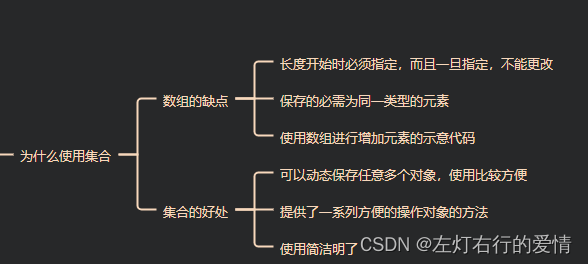

### 集合框架介绍

Java集合主要由两个跟接口Collection和Map派生出来的.  
 Collection派生出3个子接口:List,Set,Queue.  
 List:代表有序可重复集合,可直接根据元素的索引来访问  
 Set:代表无序不可重复集合,只能根据元素本身来访问  
 Queue:队列集合  
 Map:代表存储key-value对的集合,可以根据元素的key来访问value.  
 单列集合  
 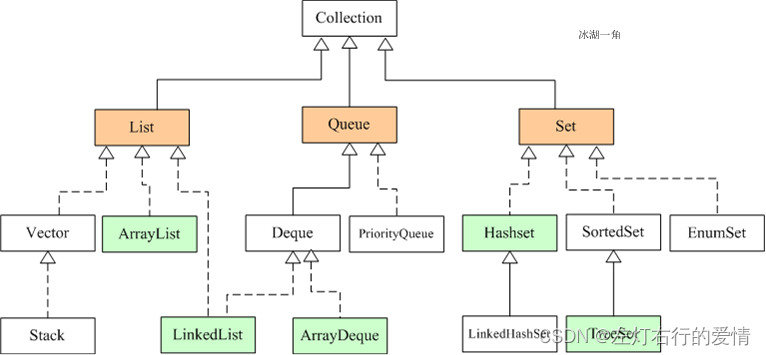

双列  
 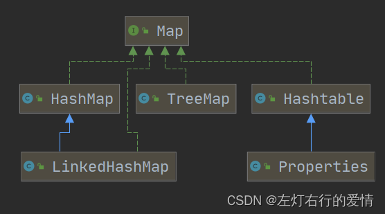

## Collection集合

### collection简介

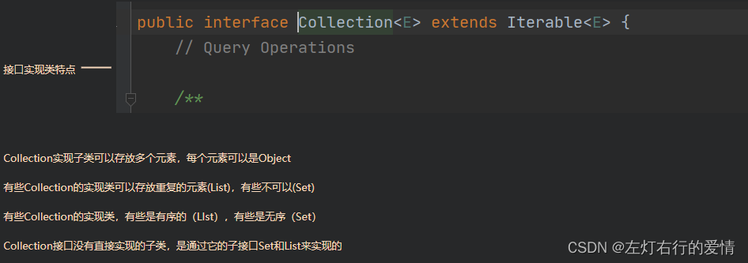

### collection方法

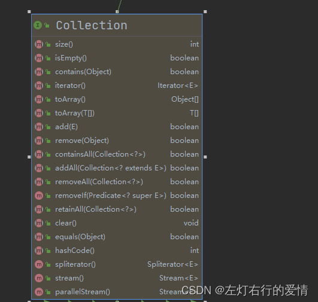  
 以下演示部分方法代码

```
   //add:添加单个元素
        collection.add("自导自演的悲剧");
        collection.add("陶喆");
        collection.add(true);
        System.out.println(collection);//[自导自演的悲剧, 陶喆, true]

        remove:
        删除指定元素(只能删除指定元素，不能删除脚标)

        collection.remove(0);//[自导自演的悲剧, 陶喆, true]
        System.out.println(collection);
        //???为什么不是删除第一个元素
        collection父类方法只提供删除指定元素

        List list = new ArrayList();
        list.add("自导自演的悲剧");
        list.add("陶喆");
        list.add(true);
        list.remove(0);
        System.out.println(list);


        //查找元素是否存在contains
        System.out.println(collection.contains("陶喆")); //true

        //size:获取元素个数
       System.out.println(collection.size());//colleciton内容[自导自演的悲剧, 陶喆, true]  3

        //isEmpty:判断是否为空
        System.out.println(collection.isEmpty());//false
        //clear:清空
        collection.clear();
        System.out.println(collection);//[]

        //addAll:添加多个元素
//    错误用法    collection.addAll("10:30 的飞机场","流沙","十七岁");，源码里给的参数是collection
        ArrayList arrayList=new ArrayList();
        arrayList.add("如果我真心爱你能否改变结局");
        arrayList.add("还是不懂珍惜");
        arrayList.add("还是搞砸一切");
        collection.addAll(arrayList);
        System.out.println(collection);//[自导自演的悲剧, 陶喆, true, 如果我真心爱你能否改变结局, 还是不懂珍惜, 还是搞砸一切]

    //removeAll:删除多个元素
    collection.removeAll(collection);
    System.out.println(collection);//[]


```

### collection遍历方式

方式一：使用Iterator（迭代器）  
 简介：  
 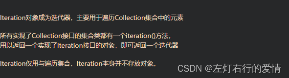  
 执行原理：  
 单例集合数据存储结构如下：  
 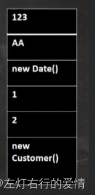  
 我们通过构造一个迭代器，使用里面的next方法移动指针，从上到下（实际是从前往后，这里方便理解竖起来了）移动指针。  
 注意：在调用`iteration.next()`方法之前必需调用`iteration.hasNext()`进行检测  
 若不调用，且下一条记录无效，直接调用`it.next()`会抛出`NoSuchElementException`异常

代码如下：

```
    Collection col = new ArrayList();
        col.add(new demo("陶喆同名专辑", "陶喆", "1997-12-06"));
        col.add(new demo("心中的日月", "王力宏", "2004-12-31"));
        col.add(new demo("不可思议", "王力宏", "2003-10-15"));
        System.out.println(col);
//第一种迭代器方式
        Iterator iterator = col.iterator();
        while (iterator.hasNext()) {
            Object obj = iterator.next();
            System.out.println(obj);
        }
       // 如果希望再次遍历，需要重置一下遍迭代器
        iterator =col.iterator();


```

方法二：使用for循环增强  
 增强for循环，其实是简化版的iteration，本质是一样的底层依旧是迭代器，  
 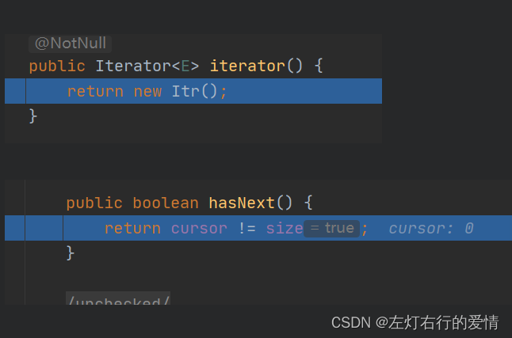

只能遍历集合或数组  
 基本语法：  
 for（元素类型 元素名：集合名/数组名）{  
 访问元素  
 }  
 代码如下：

```
   //第二种，增强for循环
        for(Object demo :col){
            System.out.println(demo);
        }


```

## List接口

### 简介

此接口可以对列表中每个元素的插入位置进行精确的控制，我们可以根据元素的整数索引(与数组的索引是一个道理)访问元素，并搜索列表中的元素。List 接口允许存放重复的元素和Null元素，并且元素都是有序的（Set 接口不允许存放重复元素，元素是无序的）  
 集合中可以有重复的元素，可以通过 equals 方法来比较是否为重复的元素。

**为什么List中的元素可以有序且重复呢?**  
 它的设计理念就是要有这两个特性,即有序性和可重复性  
 实现细节如下:  
 List接口通过数组或链表数据结构来实现,这些数据结构本身就能够支持有序性和可重复性  
 无论是数组实现还是链表实现,它们本身都不限制元素的唯一性,且顺序一个是靠索引位置,一个是节点之间的链接关系来维护,所以可以实现这两个特性.

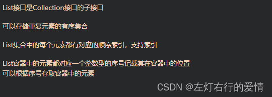

### 方法示例

```
        ArrayList<Object> obj = new ArrayList<>();
        //void add(Object eles)
        //void add (int index ,Object eles) :在index位置插入eles
        obj.add("Melodrama");
        obj.add("Lorde");
        obj.add("新发现的专辑");
        obj.add(1, "2017-06-16");
        //System.out.println(obj);//[Melodrama, 2017-06-16, Lorde, 新发现的专辑]
        ArrayList<Object> obj1 = new ArrayList<>();
        obj1.add("王力宏");
        obj1.add("陶喆");

        //boolean addAll(int index,Collection eles)
        //从index位置开始将eles中所有元素添加进来
        //obj.addAll(0,obj1);
        //System.out.println(obj);//[王力宏, 陶喆, Melodrama, 2017-06-16, Lorde, 新发现的专辑]

        //int indexOf(Object obj)
        //返回obj在当前集合中末次出现的位置,从1开始
        //System.out.println(obj.indexOf("王力宏"));//-1
        //System.out.println(obj.indexOf("Lorde"));//2

        //int lastIndexOf(Object obj)
        //返回obj在当前集合中末次出现的位置
        obj.add("Lorde");
        System.out.println(obj);//[Melodrama, 2017-06-16, Lorde, 新发现的专辑, Lorde]
        System.out.println(obj.lastIndexOf("Lorde"));//4

        // Object remove(int index)
        //移除指定index位置的元素，并返回此元素
        System.out.println(obj);
       System.out.println(obj.remove(1));//用索引是返回元素
       System.out.println(obj.remove("Lorde"));//用object是返回boolean

        //Object set(int index,Object ele)
        //设置指定index位置为ele，相当于替换
        System.out.println(obj);//[Melodrama, 2017-06-16, Lorde, 新发现的专辑]
        obj.set(0,"王一");
        System.out.println(obj);//[王一, 2017-06-16, Lorde, 新发现的专辑]

        //List subList(int fromIndex,int toIndex)
        //返回从fromIndex到toIndex位置的子集合[前闭后开)
        System.out.println(obj);//[Melodrama, 2017-06-16, Lorde, 新发现的专辑]
        System.out.println(obj.subList(0,2));//[Melodrama, 2017-06-16]


```

## Set集合

### 简介

注重独一无二的性质,该体系集合可以知道某物是否已近存在于集合中,不会存储重复的元素  
 用于存储无序(存入和取出的顺序不一定相同)元素，值不能重复。  
 里面存储的是无序的不重复元素，没有索引，可以采用迭代器或增强for来获取元素。

**如何实现无序性,唯一性和不能存储null值的?**  
 这些特性主要是基于Set集合的定义和使用场景

* 无序性  
   Set被设计为无序,主要因为它关注的是元素的唯一性而不是顺序.  
   这种设计可以使得Set集合在内部可以使用更高效的数据结构来存储元素(哈希表-hashBased或树结构-treeBased),从而提供更快的元素查找,添加和删除操作.
* 唯一性  
   为了实现这种功能,Set集合在添加新元素时通常会进行检查(使用哈希值或排序规则),确保新元素与集合中已有的元素不重复.
* 不能存储null值  
   这并非是所有Set实现的通用规则.  
   是否能存储null值取决于具体的Set实现.
* 基于哈希表的Set实现(如HashSet): 通常允许**存储一个null元素**,因为它们使用哈希值来存储和查找元素,而null可以被视为具有特定哈希值的特殊元素.
* 基于排序的Set实现(如TreeSet): 通常不允许存储null元素,因为要依赖元素的比较成功来维护集合,null无法参数比较(抛出NullPointException),因此这些实现都不允许存储null值

### ☆☆☆☆☆这里需要注意一下对象的相等性

1. 引用到堆上同一个对象的两个引用是相等的。  
    对两个引用调用hashCode方法，会得到相同的结果。
2. 如果不覆盖hashCode，两个不同的对象的hashCode值是不可能相等的。  
    如果对象所属的类没有覆盖Object的hashCode方法的话，hashCode会返回**每个对象特有的序号**（java是**依据对象的内存地址计算出的此序号**），所以两个不同的对象的hashCode值是不可能相等的。
3. 如果想要让两个不同的Person对象视为相等的该怎么办呢？  
    **必须覆盖Object继下来的hashCode方法和equals方法。**  
    因为Object hashCode方法返回的是该对象的内存地址，所以必须重写hashCode方法，才能保证两个不同的对象具有相同的hashCode，**同时也需要两个不同对象比较equals方法会返回true，两个条件都要满足。**  
    例子：  
    **没有重写hashCode和equals方法的前提下，set集合可以添加相同内容的对象**，代码如下

```
public class HashSetPractice {
    public static void main(String[] args) {
        HashSet hashSet=new HashSet();
        hashSet.add(new Employee("wang",18));
        hashSet.add(new Employee("hao",18));
        hashSet.add(new Employee("wang",18));

        System.out.println(hashSet);
    }
}

class Employee{
    private String name;
    private int age;

    public Employee(String name, int age) {
        this.name = name;
        this.age = age;
    }

    public String getName() {
        return name;
    }

    public void setName(String name) {
        this.name = name;
    }

    public int getAge() {
        return age;
    }

    public void setAge(int age) {
        this.age = age;
    }

    @Override
    public String toString() {
        return "Employee{" +
                "name='" + name + '\'' +
                ", age=" + age +
                '}';
    }

}


```

结果：  
 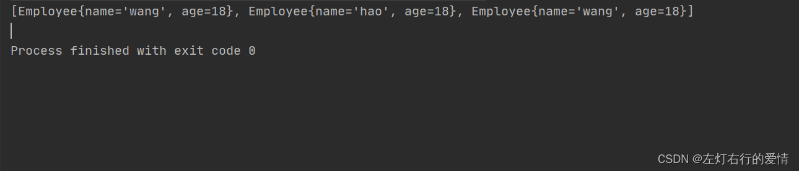

更改hashCode和Equals方法：

```
public class HashSetPractice {
    public static void main(String[] args) {
        HashSet hashSet=new HashSet();
        hashSet.add(new Employee("wang",18));
        hashSet.add(new Employee("hao",18));
        hashSet.add(new Employee("wang",18));

        System.out.println(hashSet);
    }
}

class Employee{
    private String name;
    private int age;

    public Employee(String name, int age) {
        this.name = name;
        this.age = age;
    }

    public String getName() {
        return name;
    }

    public void setName(String name) {
        this.name = name;
    }

    public int getAge() {
        return age;
    }

    public void setAge(int age) {
        this.age = age;
    }

    @Override
    public String toString() {
        return "Employee{" +
                "name='" + name + '\'' +
                ", age=" + age +
                '}';
    }

    @Override
    public boolean equals(Object o) {
        if (this == o) return true;
        if (o == null || getClass() != o.getClass()) return false;

        Employee employee = (Employee) o;

        if (age != employee.age) return false;
        return name != null ? name.equals(employee.name) : employee.name == null;
    }

    @Override
    public int hashCode() {
        int result = name != null ? name.hashCode() : 0;
        result = 31 * result + age;
        return result;
    }
}


```

结果如下：  
 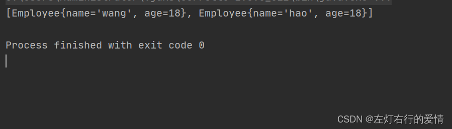  
 这里只是简单介绍一下Set这个接口，**它的方法**和List没有什么区别,list和set下面的实现类在后面的文章分享。

## Queue

Java中集合的主要作用就是装盛其他数据和实现常见的数据结构,  
 所以当我们用到栈和队列,链表和数组等常见的数据结构时就应该想到可以直接使用JDK给我们提供的集合框架.  
 比如我们要用到队列时就应该想到使用LinkedList和ArrayDeque.

### 接口介绍

Queue除了有Collection接口的操作外,还定义了一组针对队列的特殊操作.  
 通常来说Queue是按照先进先出(FIFO)的方式来管理其中的元素,但优先队列是一个例外.  
 Deque接口继承自Queue接口,但Deque支持同时从两端添加或移除元素,因此又被认为是双端队列.  
 所以,Deque接口的视线可以被当做FIFO队列使用,也可以被当做LIFO队列(栈)来使用.  
 官方也是推荐用Deque替代Stack.  
 Deque主要实现类有ArrayDeque和LinkedList.

### 接口预览

Queue可以被当做一个队列来使用,实现FIFO操作,主要提供下面的操作

```
public interface Queue<E> extends Collection<E> {
    //向队列尾部插入一个元素，并返回true
    //如果队列已满，抛出IllegalStateException异常
    boolean add(E e);

    //向队列尾部插入一个元素，并返回true
    //如果队列已满，返回false
    boolean offer(E e);

    //取出队列头部的元素，并从队列中移除
    //队列为空，抛出NoSuchElementException异常
    E remove();

    //取出队列头部的元素，并从队列中移除
    //队列为空，返回null
    E poll();

    //取出队列头部的元素，但并不移除
    //如果队列为空，抛出NoSuchElementException异常
    E element();

    //取出队列头部的元素，但并不移除
    //队列为空，返回null
    E peek();
}


```

### Deque接口

双端队列,可以操作队列的头尾,适合当栈来使用  
 下面表格列举Queue和Deque接口的对应方法:

| Queue方法 | Deque方法 |
| --- | --- |
| add(e) | addLast(e) |
| offer(e) | offerLast(e) |
| remove() | removeFirst() |
| poll() | pollFirst() |
| element() | getFirst() |
| peek() | peekFirst() |

如果当栈用

| Stack方法 | Deque方法 |
| --- | --- |
| push(e) | addFirst(e) |
| pop() | removeFirst() |
| peek() | peekFirst() |
