> 原文：[CSDN](https://blog.csdn.net/qq_45852626/article/details/125789204)（历史文章导入，当前状态为草稿）

### 前言

新的专辑会深度总结并发编程的知识体系，力所能及地专精，同时也是我学习路上的一个总结，希望也能帮助有需要的人。  
 本章考虑到篇幅的问题，涉及到的方法都只是做了简略的文字描述，后面我会尽快更新源码部分，**方法部分看不明白没事**，后面结合着源码就懂了。

### 进程和线程：从零开始理解

#### 进程是什么？想象一家餐厅

假设你开了一家餐厅：

* 这家餐厅就是一个"进程"
* 餐厅需要场地、厨房设备、餐桌椅等资源
* 开一家新餐厅需要租场地、装修、采购设备，成本很高
* 每家餐厅都是独立经营的，一家餐厅的问题通常不会影响其他餐厅

#### 线程是什么？想象餐厅里的员工

在这家餐厅里工作的员工就是"线程"：

* 一个厨师是一个线程
* 一个服务员是一个线程
* 一个收银员是一个线程
* 所有员工共享餐厅的资源（厨房、餐具等）
* 招聘一个新员工比开一家新餐厅容易得多

#### 具体例子：微信应用

当你打开微信时：

1. 系统创建了一个"微信进程"
2. 这个进程获得了一定的内存空间和其他资源
3. 在这个进程内部，有多个线程在工作：

* 一个线程负责显示界面
* 一个线程负责接收消息
* 一个线程负责播放语音
* 一个线程负责上传照片  
   如果微信崩溃了，只影响微信应用本身，不会导致手机上的其他应用（如支付宝）也崩溃。

### 为什么需要进程和线程？

#### 没有进程会怎样？

想象一下，如果电脑上所有程序都在同一个大环境中运行：

* 一个程序崩溃可能导致整个系统崩溃
* 恶意程序可以轻易访问其他程序的数据
* 资源分配和管理极其复杂

#### 没有线程会怎样？

如果一个程序只能有一个执行流：

* 当程序需要等待用户输入时，什么都做不了
* 无法同时执行多个任务（如一边下载文件，一边播放音乐）
* 无法充分利用多核处理器

### 进程和线程

#### 进程

1：程序由**指令和数据**构成，但是如果指令要运行，数据要读写，就必须将指令加载至**CPU**，数据加载至**内存**。  
 在指令运行过程中还需要用到磁盘，网络等设备。  
 2：进程就是用来加载指令，管理内存，管理IO的。  
 可以把**进程视为程序的一个实例**，大部分程序可以同时运行多个实例进程，有的只能启动一个实例进程。

从JVM的角度来说，每个进程都有自己独立的内存空间，这个先暂时了解一下，后面开JVM专辑的时候我们会好好聊聊这个问题。

#### 线程

1：一个进程之内可以分一到多个线程，这些线程都有各自的计数器，堆栈和局部变量等属性，并且能访问共享的内存变量。  
 2：一个线程就是一个指令流，将指令流的一条条指令以一定的顺序交给CPU执行。  
 3：Java中，**线程作为操作系统的最小调度单位**，**进程作为操作系统的资源分配的最小单位**，也叫做轻量级进程(Light Weight Process),在windows里进程不活动，只是作为线程的容器。  
 我们可以举个例子看一下：

```
public class demo_1{
    public static void main(String[] args) {
        // 获取Java线程管理MXBean
        ThreadMXBean threadMXBean = ManagementFactory.getThreadMXBean();
        // 不需要获取同步的monitor和synchronizer信息，仅获取线程和线程堆栈信息
        ThreadInfo[] threadInfos = threadMXBean.dumpAllThreads(false, false);
        // 遍历线程信息，仅打印线程ID和线程名称信息
        for (ThreadInfo threadInfo : threadInfos) {
            System.out.println("[" + threadInfo.getThreadId() + "] " + threadInfo.
                    getThreadName());
        }
    }
}


```

结果：

```
Signal Dispatcher　 // 分发处理发送给JVM信号的线程
Finalizer　　　　   // 调用对象finalize方法的线程
 Reference Handler   // 清除Reference的线程
 main　  　　　　    // main线程，用户程序入口
  。。。其他等等


```

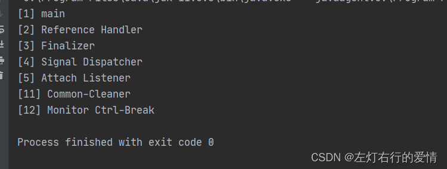  
 我们可以看到一个java程序的运行不仅仅是main方法的运行，而是main线程和多个线程同时运行

#### 进程和线程的对比

1. 进程基本上相互独立，而线程存在于进程内，是进程的一个子集
2. 进程拥有**共享的资源**，如内存空间等，仅供其内部的线程共享
3. 进程间的通信较为复杂：同一台计算机通信为Ipc，不同计算机通信需要通过网络，并遵守协议
4. 线程通信相对简单，因为它们共享进程内的内存
5. 线程更轻量，线程上下文切换成本一般比进程上下文切换低.  
    不同进程之间是不共享内存空间的，所以进程要做任务切换就要**切换内存映射地址**，而一个进程创建的所有线程，都是共享一个内存空间，所以线程做任务切换成本就很低了，**现代操作系统都是基于更轻量的线程来调度，我们提到的“任务切换”都是指“线程切换”。**

#### 通俗理解进程和线程的区别

##### 独立性

进程：就像不同的房子，各自有独立的空间和设施  
 线程：像同一个房子里的不同房间，共享水电和其他资源

##### 通信难易度

进程间通信：像两个房子之间传递信息，需要特殊方式（如打电话、发信）  
 线程间通信：像房子内部房间之间交流，直接说话就行

##### 创建和销毁的成本

进程：像建造和拆除一座房子，成本高  
 线程：像在房子里增加或减少一个人，成本低

#### 什么是上下文切换？

首先我们先了解什么是上下文  
 上下文是**指某一时间点CPU寄存器和程序计数器的内容**。  
 而想到真正了解上下文切换需要操作系统的知识，这里我们简单了解它大致的作用。  
 简单来说：**当前任务执行完CPU时间片切换到另一个任务之前回先保存自己的状态，以便下次再切换回这个任务，可以继续执行这个任务，任务从保存到再加载的过程就是一次上下文切换。**  
 上下文频繁的切换会影响多线程的执行速度。

### 并发&&并行

#### 并发

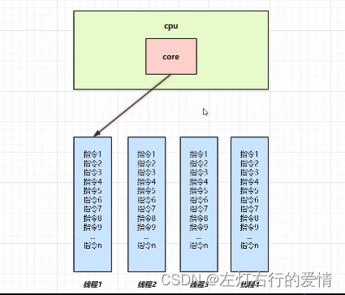

单核CPU下，线程实际还是串行执行的，**操作系统中有一个组件叫做任务调度器，将cpu的时间片分给不同的线程使用  
 只是cpu在线程间的切换非常快，人感觉是同步运行的，但是本质是串行**

并行：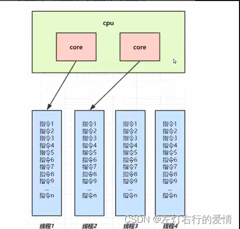多核CPU下，每个核都可以调度运行线程，这时候线程可以并行，同一时间做多件事。

#### 异步调用

方法的调度有两种：同步和异步  
 首先介绍同步：需要等待结果的返回才会继续向下运行  
 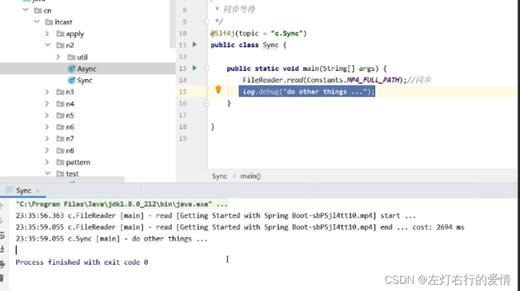  
 异步：不需要等待结果，就能继续运行  
 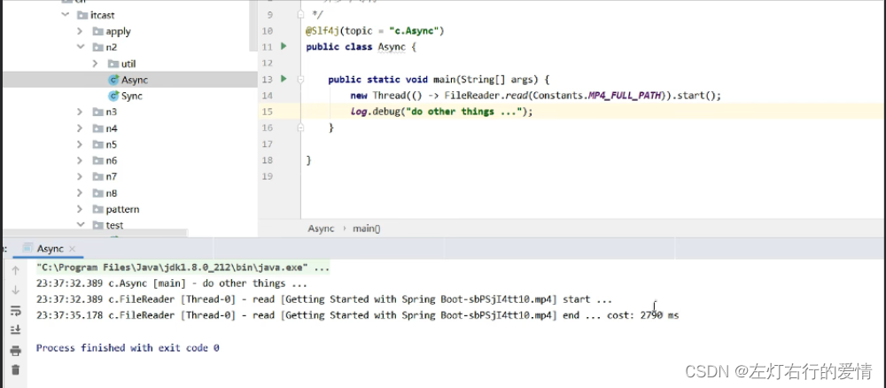  
 多线程可以让方法的执行变成异步，比如读取磁盘文件

我们可以列举几个应用场景：  
 1：在项目中，有需要视频文件转换格式等费时操作，这时候开一个新线程处理，避免阻塞主线程  
 2：tomcat的异步servlet也是类似目的  
 3：ui程序中，开线程进行其他操作，避免阻塞ui线程

#### 提高效率问题

对于单核的CPU：  
 多线程不能实际提高程序运行效率，只是为了能够在不同的任务之间切换，不同线程轮流使用CPU，不至于一个线程总占用CPU  
 对于多核CPU：  
 1：可以并行跑多个程序，但能否提高程序运行效率还要分情况  
 2：有些任务经过精心设计，将任务拆分，并行执行，当然可以提高程序的运行效率。  
 但不是所有的计算任务都能拆分（参考阿姆达尔定律,在这不列举了，有兴趣百度吧）  
 3：不是所有的任务都需要拆分，任务的目的如果不同，谈拆分和效率没有意义  
 4：IO操作不占用cpu，只是我们一般拷贝文件使用的是【阻塞IO】的API，这时相当于线程虽然不用cpu，但需要一直等待IO结束，没能充分利用线程。  
 所以才有后面的【非阻塞IO】和【异步IO】优化

### 稍微深入一下线程

#### 创建

创建有三种方法：

##### 通过继承Thread创建线程

优点：方便传参，可以在子类加成员变量，通过set方法设置参数或构造函数传参  
 缺点：Java不支持多继承

```
public static void main(String[] args){
Thread th =new MyThread();
th.start();
}
class MyThread extends Thread{
public void run(){
System.out.println("嘿嘿");
}
}


```

##### 使用Runnable配合Thread

优点：用`Runnable`让任务脱离了`Thread`继承体系，更灵活  
 接口带有`@FunctionalInterface`，可以使用`lambda`表达式简化操作  
 有三种写法：  
 a：

```
public class Thread_1 {
    public static void main(String[] args) {
        //创建线程任务
        Runnable r= new Runnable() {
            @Override
            public void run() {
                System.out.println("在梅边");
            }
        };
        
        Thread t =new Thread(r);
        t.start();
    }
}


```

b：

```
public class Thread_2 {
    private static class MyRunnable implements Runnable{
        @Override
        public void run() {
            System.out.println("在梅边落花似雪纷纷绵绵谁人怜");
        }
    }

    public static void main(String[] args) {
        MyRunnable r =new MyRunnable();
        Thread th =new Thread(r);
        th.start();
    }
}


```

c：

```
public class Thread_3 {
    public static void main(String[] args) {
        //创建线程任务
        Runnable r =()->{
            System.out.println("哥们儿");
            System.out.println("王力宏");
        };
        Thread t =new Thread(r);
        t.start();
    }
}


```

##### 使用FutureTask与Thread

优点：可以拿到返回结果

```
public class Thread_4 {
    public static void main(String[] args) throws ExecutionException, InterruptedException {
        FutureTask<String> futureTask = new FutureTask<>(new wang());
        Thread thread =new Thread(futureTask);
        thread.start();
        System.out.println(futureTask.get());

    }
}

class wang implements Callable<String>{

        /**
         * Computes a result, or throws an exception if unable to do so.
         *
         * @return computed result
         * @throws Exception if unable to compute a result
         */
        @Override
        public String call() throws Exception {
            return "花田错";
        }
    }


```

#### 查看进程线程的方法：

这里有三种情况分别是windows，linux，java。

##### windows

任务管理器查看  
   
 两个指令 tasklist查看进程，taskkill杀死进程

##### linux

```
ps -fe  查看所有进程

ps -fT -p <pid> 查看某个进程的所有线程

kill 杀死进程

top 按大写H切换是否显示线程

top -H -p <pid> 查看某个进程的所有线程


```

##### Java

jps命令查看所有java进程  
 jstack 查看某个Java进程的所有线程状态

#### 线程运行原理

这里要说到栈和栈帧的概念

##### 栈

栈就是**CPU寄存器里某个指针指向的一片内存区域**，每个Java线程都有一个私有的Java虚拟机栈，创建线程的同时栈也被创建。  
 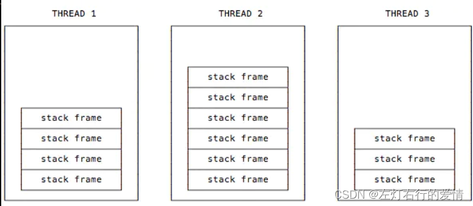

##### 栈帧

一个JVM栈由许多帧组成，称为“栈帧”  
 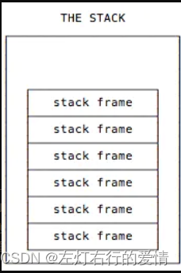  
 每个线程只能有一个活动栈帧，对应着当前正在执行的那个方法  
 需要我们去注意线程状态  
 a：  
 首先是术语  
 **当前方法**——线程正在执行的方法  
 **当前帧**——当前方法对应的栈帧  
 **当前类**——当前方法对应的类  
 **常量池**——当前类对应的常量池  
 执行一个方法时，JVM会保存当前类和当前常量池的轨迹。  
 当JVM执行，需要操作栈帧中数据的指令时，JVM会在当前栈帧中处理

b：当一个线程创建时  
 JVM会为这个线程创建一个新的Stack。  
 一个Java Stack 在一个个独立的栈帧中存储了线程的状态  
 JVM只会在Java Stack中做两个操作：Push 和Pop

c：当一个线程正在执行方法时  
 JVM将创建一个新的栈帧并且把它push到栈顶。  
 此时新的栈帧就变成了当前栈帧，方法执行时，  
 使用栈帧来存储 参数 ，局部变量， 中间指令以及其他数据

#### 线程上下文切换详解

发生上下文切换的时机：  
 CPU不再执行当前的线程，转而执行另一个线程的代码的原因有下面几种：

1. 线程的cpu时间片用完
2. 垃圾回收
3. 有更高优先级的线程需要运行
4. 线程自己调用了`sleep，yield，wait，join，synchronized，lock`等方法。

当上下文切换发生时，需要由操作系统保存当前线程的状态，并恢复另一个线程的状态，Java中对应的概念就是程序计数器`（Program Counter Register）`，**它的作用是记住下一条jvm指令的执行地址，是线程私有的**。

保存的状态包括：  
 程序计数器，虚拟机栈中每个栈帧的消息（如局部变量，操作数栈，返回地址等）  
 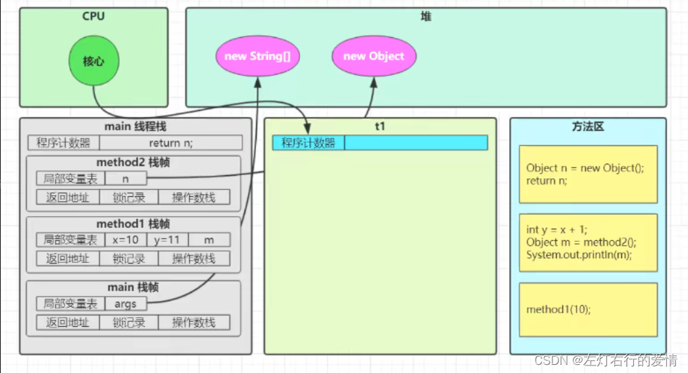

#### 常见方法

##### start &&run

被创建的`Thread`对象直接调用重写`run`方法时，`run`方法是在主线程中被执行的，而不是在我们创建的线程中执行，如果想到在创建的线程中执行`run`方法，需要使用`Thread`对象的`start`方法。  
 简言之，如果我们不`start`直接`run`，这个`run`方法可以执行，但是还是在`main`方法中执行的，并不是在创建的线程中执行。  
 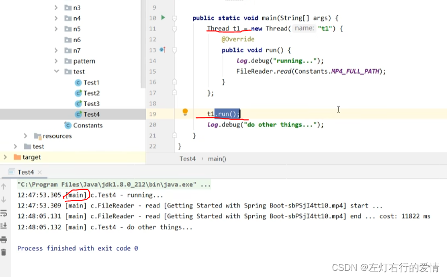

##### Sleep方法

1：调用`Sleep`会让当前线程从`Running`进入`Timed Waiting`状态  
 2：其他线程可以使用`interrput`方法打断正在睡眠的线程，这时`sleep`方法会抛出`InterruptedException`异常  
 3：睡眠结束后的线程未必会立刻得到执行，要等时间片  
 4：建议用`TimeUnit`的`sleep`代替`Thread`的`sleep`来获得更好的可读性  
 适用的场景：

1. 防止`cpu`占用`100%`
2. 在没有`cpu`计算时，防止`while(true)`空转浪费`cpu`，这时可以使用`yield`或`sleep`来让出`cpu`的使用权给其他程序
3. 可以用`wait`或条件变量达到类似的效果，但是需要加锁，并且需要唤醒操作，一般适用于要进行同步的场景
4. `sleep`适用于无需锁同步的场景

##### yield方法

1. 调用`yield`会让当前线程从`Running`进入`Runnable`就绪状态（仍然有可能被执行），然后调度执行其他线程。
2. 具体的实现依赖于操作系统的任务调度器

##### join方法

3. 用于等待某个线程结束
4. 哪个线程内调用`join`方法，就等待哪个线程结束，然后再去执行其他线程  
    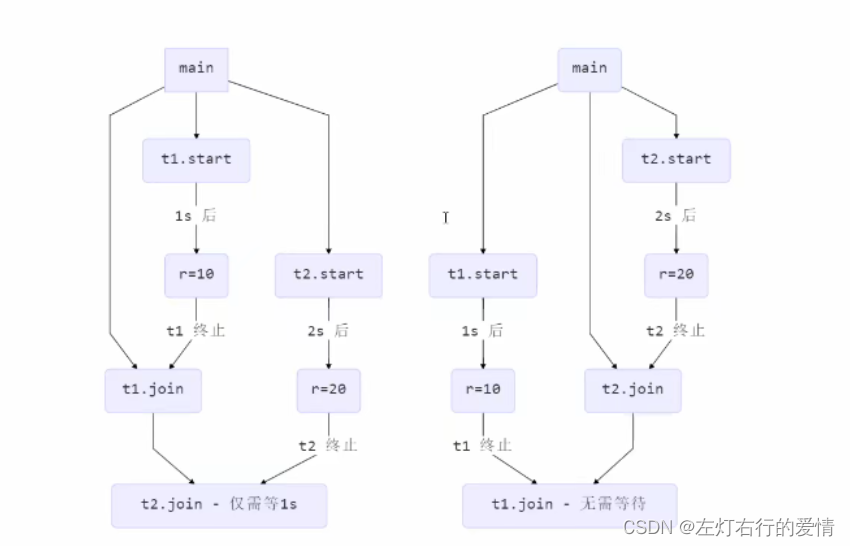

##### interrupt方法

1. 用于打断阻塞`(sleep，wait，join....)`的线程。
2. 处于阻塞状态的线程，cpu不会给其分配时间片

打断阻塞：  
 如果是打断因`sleep ，wait，join`方法而被阻塞的线程，会将打断标记置为`false`。  
 我们要注意，线程在运行时被打断，打断标记会置为`true`  
 如果正常运行的线程被打断后，不会停止，会继续执行。  
 如果要让线程在被打断后停下来，需要使用打断标记来判断。  
 。  
 这里顺便提一嘴**两阶段终止模式**(下一篇我会详细描述解析，这里留个印象就行)：  
 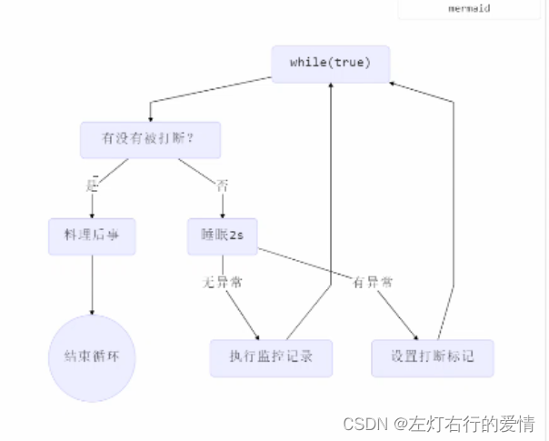

#### 主线程与守护线程

默认情况下，Java进程需要等待所有线程都运行结束，才会结束。  
 有一种特殊的线程叫做守护线程，只要其他非守护线程运行结束了，即使守护线程的代码没有执行完，  
 也会强制结束。  
 **注意：  
 1：垃圾回收器线程是一种守护线程  
 2：`Tomcat`中的`Acceptor`和`Poller`线程都是守护线程  
 所以`Tomcat`接受到`shutdown`命令后，不会等待它们处理完当前请求。**

#### 线程状态

分两个层面来说

##### 操作系统层面

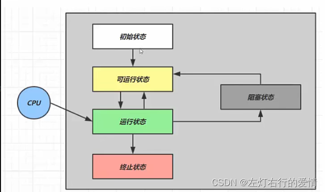  
 1-初始状态：仅是在语言层面创建了线程对象，还未与操作系统线程关联  
 2-可运行状态：（就绪状态）指该**线程已经被创建**（与操作系统线程关联），可以由CPU调度执行  
 3-运行状态：指获取了CPU时间片运行中的状态，如果CPU时间片用完，会从【运行状态】切换至【可运行状态】，会导致线程的上下文切换。  
 4-阻塞状态：  
 a：如果调用了阻塞API，如BIO读写文件，这时**线程实际不会用到CPU**，会导致线程上下文切换，进入【阻塞状态】。  
 b：等BIO操作完毕，会由操作系统唤醒阻塞的线程，转换至【可运行状态】  
 c：与【可运行状态】的区别是，**对【阻塞状态】的线程来说只要它们一直不唤醒，调度器就一直不会考虑调度它们**  
 5-终止状态：  
 表示线程已经执行完毕，生命周期已经结束，不会再转换为其他状态

##### Java API层面

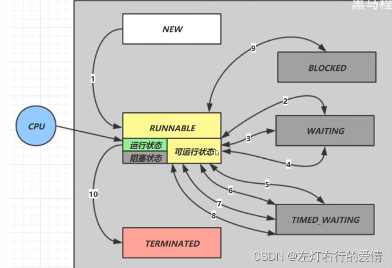  
 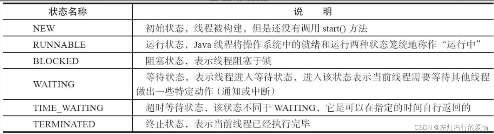

### 结尾

关于进程和线程，这是在操作系统和JVM都有描述，这里等我们后面更到操作系统专辑，会详细深入探讨，这里我们目标专注于并发编程核心内容上，进程和线程知道这么多已经足够应对接下来的学习了。
