> 原文：[CSDN](https://blog.csdn.net/qq_45852626/article/details/126007233)（历史文章导入，当前状态为草稿）

### 前言

本篇文章会介绍的内容不少，按需观看，全部了解会让你对锁的概念加深一层。

### 共享问题

一个程序运行多个线程本身是没有问题,多个线程访问共享资源可能会出现问题  
 其实多个线程如果只访问共享资源也没问题,但如果多个线程**对共享资源读写操作时发生指令交错**，就会出现问题。

#### 临界区

一段代码块内如果存在对共享资源的多线程读写操作，称**这段代码块**为临界区。  
 举个例子：  
 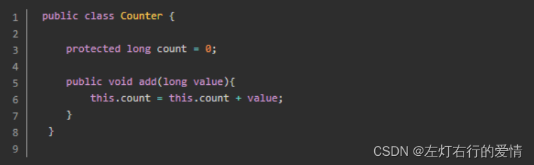  
 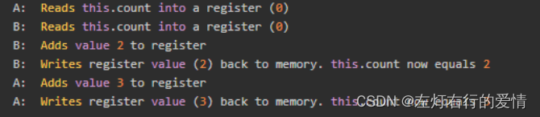  
 我们如果按照上述的执行顺序，`counter`最后结果会是3，但我们都知道最后的值应该为5才对，但由于上述指令是交叉执行的，所以最后会导致不一样的结果。

##### 临界区的吞吐量

1. 小的临界区直接将整个代码上锁即可避免资源竞速
2. 大的临界区为了执行效率，最好将代码分为小的临界区，并分别同步的不同的临界区。  
    因为我们知道`synchronized`的关键字的影响是比较大的，如果我们直接同步整个临界区  
    很可能会影响临界区的吞吐量。  
    举个例子：  
    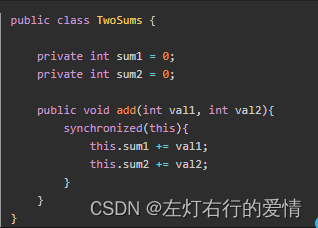  
    为了避免资源竞速，我们将两个加法操作同步了，这样的话，在某一个时刻，只有一个时刻可以执行加法操作。  
    然而，因为两个`sum`变量都是互相独立的，所以我们可以将两个变量分别分成不同的同步块，如下图  
    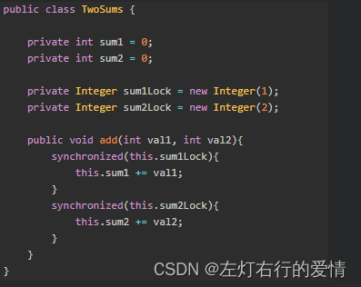

##### 竞态条件

1. 多个线程在临界区执行，由于代码的执行序列不同而导致结果无法预测  
    多个线程竞争同一个资源时，对资源的访问顺序就变的很关键
2. 一个临界区，当多个线程访问临界区时，就会出现资源竞速的问题

##### 解决手段

避免资源竞速问题，我们必须保证临界区代码必须原子性。  
 一个线程进入临界区执行时，其他线程不能进入这个线程执行，除非那个线程离开了临界区

1. 阻塞式解决方案：`synchronized ，Lock`
2. 非阻塞式的解决方案：原子变量

### synchronize初步理解

简单介绍：`synchronized`，俗称【对象锁】  
 它采用**互斥**的方式让同一时刻至多只有一个线程能持有【对象锁】  
 其他线程再想获取这个【对象锁】时就会阻塞住。  
 这样能保证拥有锁的线程可以安全的执行临界区内的代码，不用担心线程上下文切换  
 它有三大特性：  
 **原子性，可见性，有序性**（后边我们会详细解释）  
 我们举个例子来说明`synchronized`的作用（这里参照黑马课程来说）  
 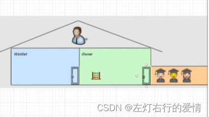  
 1：我们可以把`synchronized`中的对象比作一个房间`（room）`，这个房间只有唯一的入口（门），房间只能一次进入一个人。我们把线程t1，t2，t3想象成三个人。  
 2：当t1执行到`synchronized`时，相当于t1进入了房间，并且锁住了门拿走了钥匙，在门里执行代码。  
 3：如果这时t3也运行到了`synchronized`，发现门被锁住了，只能在门外等待，发生了上下文切换，阻塞住了。  
 4：如果这中间t1的cpu时间片不幸用完，**被上帝踢出了门外（锁住的对象也不一定一直执行下去，这里涉及到时间片）**，这时门还是锁住的。  
 5：但是t1仍然拿着钥匙，t3进程还在阻塞状态进不来，只有下次轮到t1再次获得时间片时才能开门进入。  
 6：当t1执行完`synchronized`块内代码，这时候才会从房间出来并解开门上的锁，唤醒t3把要吃给它。  
 7：这时t3线程才可以进入房间，锁上门拿走钥匙，执行代码。  
 下面用流程图帮助理解（有t1和t2两个线程）：  
 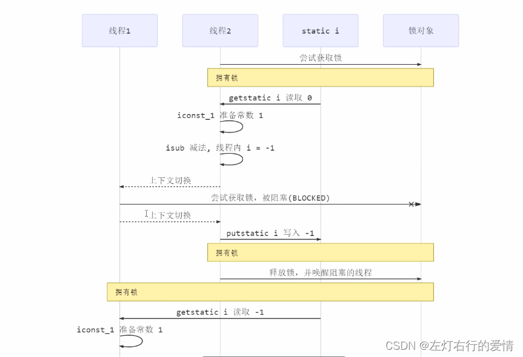  
 补充一点：`synchronized`实际是用对象锁保证了临界区代码的原子性，**临界区内的代码对外是不可分割的，不会被线程切换所打断**

#### synchronized语法

##### 简单框架：

```
synchronized(对象){
//临界区
}


```

##### 同步非静态方法上：锁作用于对象本身

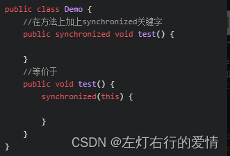

##### 同步静态方法上：锁作用于类

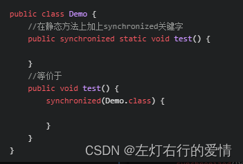

##### 同步类关键字：锁作用于类

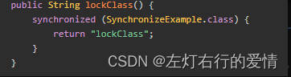

##### 同步this，锁作用于本身

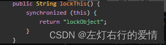

### 变量的线程安全分析

#### 逃离方法

逃离方法的作用范围通常指的是一个对象或数据从一个方法内部被传递到方法外部,从而可能在多线程环境中被多个线程共享和访问.  
 举个例子来说:

```
public class Example {  
    private static Object sharedObject; // 静态成员变量，可以被多个线程共享  
  
    public static void main(String[] args) {  
        // 假设启动了两个线程，它们都调用了methodA  
        new Thread(() -> methodA()).start();  
        new Thread(() -> methodA()).start();  
    }  
  
    public static void methodA() {  
        Object localObject = new Object(); // 局部变量，本身是线程安全的  
        // ... 对localObject进行操作 ...  
 
        //我们把这个局部变量引用的对象赋值给了一个静态成员变量  
        sharedObject = localObject; // 这里就是“逃离方法”的发生地  
  
        // 此时，sharedObject可以在其他线程中被访问和修改，因此可能引发线程安全问题  
    }  
  
    public static void methodB() {  
        // 另一个线程可能同时访问sharedObject，导致线程不安全的情况  
        if (sharedObject != null) {  
            // ... 对sharedObject进行操作 ...  
        }  
    }  
}


```

#### 成员变量和静态变量是否线程安全

1. 如果它们没有共享，则线程安全
2. 如果它们被共享了，根据它们的状态是否能够改变，分两种情况  
    2.1. 如果只有读操作，则线程安全  
    2.2. 如果有读写操作，则这段代码是临界区，需要考虑是否线程安全

#### 局部变量是否线程安全

1. 局部变量是线程安全的
2. 局部变量引用的对象则未必  
    2.1. 如果该对象没有逃离方法的作用访问，它是线程安全的  
    2.2. 如果该对象逃离方法的作用范围，需要考虑线程是否安全

#### 局部变量线程安全分析

#### 局部变量

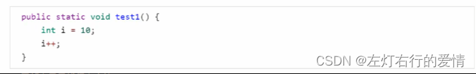  
 它的字节码（注意：局部变量和静态变量不一样，局部变量只有一步iinc）  
 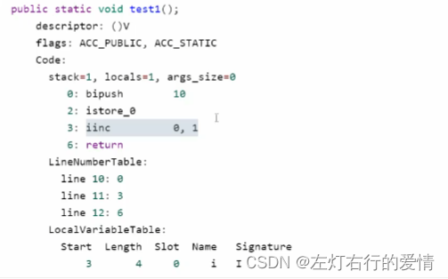局部变量是线程安全的——每个方法都在对应线程的栈中创建栈帧，不会被其他线程共享，如下图：

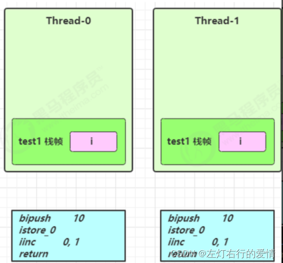  
 **如果一个变量需要跨越方法的边界，就必须创建在堆里**。顺便一提，Java中，数组是对象。  
 每个线程都有自己的调用栈，局部变量保存在线程各自的调用栈里，不会共享，自然也就不存在并发问题。

##### 局部变量的引用

线程不安全的情况：如果调用的对象被共享，且执行了读写操作，则线程不安全  
 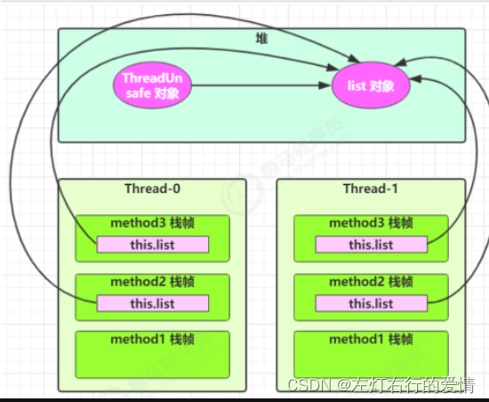  
 如果是局部变量，则会在堆中创建对应的对象，不存在线程安全问题：  
 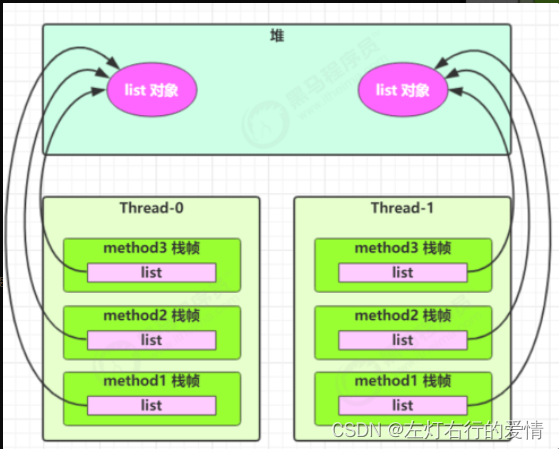

##### 暴露引用

子类覆盖方法，导致list成为共享资源  
 预防方法-----添加final，private，体会开闭原则中的【闭】

### 常见的线程安全类

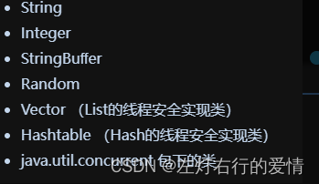  
 它们每个方法都是原子（都被加上了`synchronized`），但是它们多个方法的组合不是原子的，所以可能出现线程问题，如下图：  
 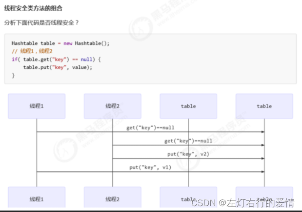

#### 不可变类线程安全性

`String，Integer`等都是不可变类，因为其内部的状态不可以改变，这些方法的返回值都创建了一个新的对象，而不是直接改变`String，Integer`对象本身，因此它们的方法都是线程安全。

#### synchronized两种使用形式

##### 同步方法

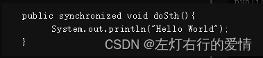对于同步方法，通过反编译我们可以看出，JVM采用`ACC_SYNCHRONIZED`标记符来实现同步，如下图所示：  
 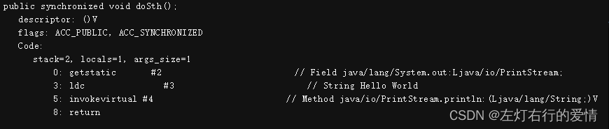  
 **注意**：

1. 方法级的同步是隐式的。(同步不是通过明确的字节码指令实现的,而是由JVM在内部自动处理的)
2. 同步方法的常量池中会有一个`ACC_SYNCHRONIZED`标志。
3. 当某个线程要访问某个方法的时候，会检查是否有`ACC_SYNCHRONIZED`，如果有设 置，则需要先获得监视器锁，然后开始执行方法，方法执行之后再释放监视器锁。
4. 这时如果其他线程来请求执行方法，会因为无法获得监视器锁而被阻断住。
5. 值得注意的是，如果在方法执行过程中，发生了异常，并且方法内部并没有处理该异常，那么在**异常被抛到方法外面之前监视器锁会被自动释放。**

##### 同步代码块

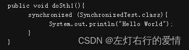  
 JVM采用`monitorenter、monitorexit`两个指令来实现同步，如下图：  
 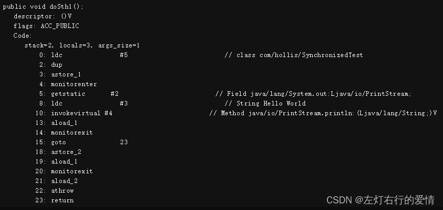

1. 可以把执行`monitorenter`指令理解为加锁，执行`monitorexit`理解为释放锁。
2. 每个对象维护着一个记录着被锁次数的计数器。
3. 未被锁定的对象的该计数器为0，当一个线程获得锁（执行`monitorenter`）后，该计数器自增变为 1 ，当同一个线程再次获得该对象的锁的时候，计数器再次自增。
4. 当同一个线程释放锁（执行`monitorexit`指令）的时候，计数器再自减。
5. 当计数器为0的时候。锁将被释放，其他线程便可以获得锁。

#### Monitor（监视器/管程）

##### 什么是Monitor？

1. 管程 (英语：`Monitors`，也称为监视器) 是一种程序结构，结构内的多个子程序（对象或模块）形成的多个工作线程互斥访问共享资源。
2. 这些共享资源一般是硬件设备或一群变量。
3. 管程实现了在一个时间点，最多只有一个线程在执行管程的某个子程序。
4. 与那些通过修改数据结构实现互斥访问的并发程序设计相比，管程实现很大程度上简化了程序设计。
5. 管程提供了一种机制，线程可以临时放弃互斥访问，等待某些条件得到满足后，重新获得执行权恢复它的互斥访问。

解释一下1. 中的意思:  
 **管程实际上是一种特殊的程序结构或设计模式，它为多线程或多进程环境提供了一种机制，以确保对共享资源的正确访问。  
 在管程内部，可以有多个子程序、对象或模块。这些都可以被视为管程的一部分，并可能涉及到对共享资源的访问或修改。  
 当多个工作线程（或其他执行单元）试图访问管程内的共享资源时，管程确保这些访问是互斥的。这意味着在任何时候，只有一个线程能够访问或修改这些资源，从而避免了数据竞争和不一致状态。  
 管程提供了一种结构化的方法来管理对共享资源的并发访问，确保在任何时候只有一个执行单元能够访问这些资源，从而保持数据的一致性和完整性。**

不知道你是否思考过一个问题：为什么`Java1.5`之前仅仅提供了`synchronized`关键字和`wait(),notify(),notifyAll()`这三个看似从天而降的方法？  
 难道不提供信号量这种编程原语去解决吗？我们通过学习操作系统了解到：信号量可以解决所有并发问题。  
 后来发现了原因，`Java`采用的是管程技术，`synchronized`和`wait，notify，notifyAll`这三个办法都是管程的组成部分。

而**管程和信号量是等价的**（用管程可以实现信号量，也能用信号量实现管程），因为管程更容易使用，所以Java选择了管程。  
 综上所述，管程指的是：**管理共享变量以及对共享变量的操作过程，让他们之间并发。**  
 用Java领域的语言描述为：**管理类的成员变量和成员方法，让这个类是线程安全的。**

##### Monitor结构

我们在这里只列举最重要的去说明  
 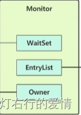

* WaitSet：  
   调用了`wait()`方法并因此进入等待状态的线程集合.  
   这些线程在等待某个条件成立,或者等待被其他线程通过调用同一个对象的`notify()`和`notifyAll()`方法来唤醒.  
   **重要的是要理解,线程在调用wait之前必须已经获取到了相关对象的锁,而在调用wait()之后会释放这个锁(注意还会释放!!!),并进入等待状态.**
* Owner：  
   代表了当前`Monitor`对象是否被线程所持有，如果持有，`monitor`对象不为`null`，否则为`null`。
* EntryList：  
   存放竞争锁失败的线程，对其阻塞（存放`blocked`状态的线程）。

##### MESA模型

管程在发展过程中出现过三种不同的管程模型，目前广泛运用的就是这个MESA模型，最重要的是Java管程的实现参考也是MESA模型。

并发编程领域，有两个核心问题：

1. 互斥—即同一时刻只允许一个线程访问共享资源
2. 同步—即线程之间如何通信，协作。  
    这两个核心问题都是管程可以解决的。

* 先看一下管程如何解决互斥问题  
   管程将共享变量及其对共享变量的操作统一封装起来，只允许一个线程进入管程。后面我们要聊的互斥锁，背后的模型就是它。
* 管程如何解决同步问题  
   管程引入了条件变量和等待队列。  
   当线程不符合条件变量，便会去等待队列(`WaitList`)中等待，等到符合条件变量再唤醒（唤醒后不是马上去执行，而是重新进入到就绪队列（入口等待队列`EntryList`）重新竞争）。

综上：  
 `Java`内置的管程方案(`synchronized`)使用简单，`synchronized`关键字修饰的代码块，在编译期会自动生成相关加锁和解锁的代码，但是仅支持一个条件变量；  
 而`Java SDK`并发包实现的管程支持多个条件变量，不过并发包里的锁，需要开发人员自己进行加锁和解锁操作。

问题：  
 当一个线程试图访问同步代码块时，它首先必须得到锁，退出或抛出异常时必需释放锁。  
 那么锁到底存在哪里呢？锁里面会存储什么信息呢？  
 答案：  
 `synchronized`用的锁是存在`Java`对象头里的。  
 如果对象是数组类型，虚拟机用3个字宽存储到对象头  
 如果对象是非数组类型，则用2个字宽存储对象头

### 什么是Java对象头

#### 普通对象的Java对象头

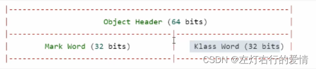

#### 数组对象的Java对象头

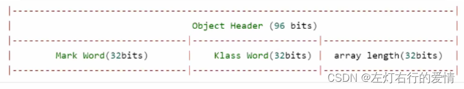

#### Mark Word结构

32位虚拟机  
 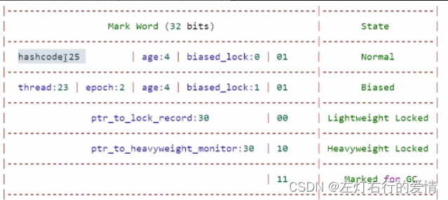

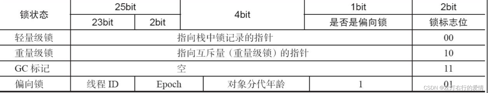

在32位的`HotSpot`虚拟机 中对象未被锁定的状态下，`Mark Word`的32个Bits空间中的25Bits用于存储对象哈希码(`HashCode`)，  
 4Bits用于存储对象分代年龄，  
 1Bit固定为0，表示非偏向锁  
 **2Bits用于存储锁标志位。**  
 **这里们只需要注意`MarkWord`中的最后两位和`biased_lock`：**  
 `biased_lock`=0且后两位为01 不加锁正常  
 `biased_lock`=1且后两位为01 偏向锁锁  
 后两位为00 轻量级锁  
 后两位为01 重量级锁  
 `Mark Word` 里面的内容：  
 解释一下`State`下的名词：  
 `Normal`：正常状态，未加锁  
 `Biased`：偏向锁  
 `Lightweight Locked`：轻量级锁  
 `Heavyweight Locked`: 重量级锁

关于对象头里的`Klass World`，它的作用是找到类对象，这里不深究。

### 总结

并发编程里两大核心问题——互斥和同步，管程都能解决，很多并发工具类底层都是管程实现的，一定要掌握好管程。
