> 原文：[CSDN](https://blog.csdn.net/qq_45852626/article/details/126026623)（历史文章导入，当前状态为草稿）

### 前言

上一篇文章我们已经了解管程和锁的基本概念，这一章我们来更深入的了解他们的用处，还有一些扩展知识。

### 轻量级锁

#### 应用场景

当一个对象被多个线程所访问，但**访问的时间**是错开的（不存在竞争）  
 此时就可以使用轻量级锁来优化（两个方法同步块，利用同一个锁加锁）

#### 流程

1. JVM会在当前线程的栈帧中创建锁记录（Lock Record）对象，用来存储锁对象目前的Mark Word的拷贝,每一个线程的栈帧都会包含一个锁记录对象，内部可以存储锁定对象的mark word（不再一开始就使用Monitor）,若一个线程获得锁时发现是轻量级锁,它会将对象的Mark Word复制到栈帧中的所记录LockRecord中。  
    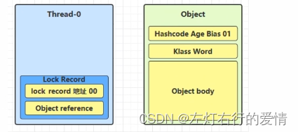
2. 让锁记录中的Object reference指向锁对象(Object），并尝试用cas去替换Object中的mark word，将此mark word放入lock record中保存。  
    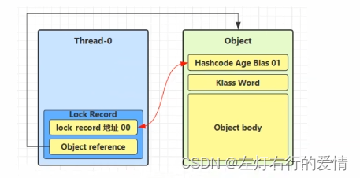  
    3：如果cas替换成功，则将Object 的对象头替换为锁记录的地址和状态00(轻量锁状态)，并由该线程给对象加锁。  
    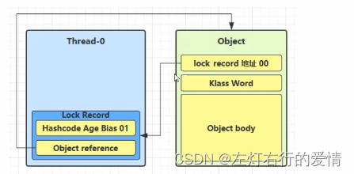  
    4：如果cas失败，有两种情况  
    a.如果是其他线程已经持有了改Object的轻量级锁，这表明有竞争，进入锁膨胀过程  
    b.如果是自己执行了synchronized锁重入，那么再添加一跳Lock Record作为重入的计数，如下图：  
    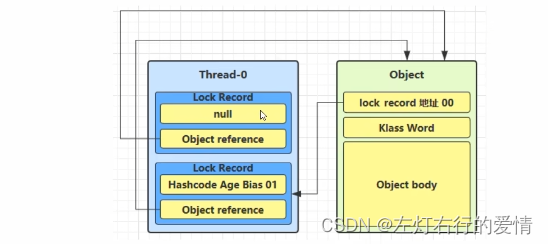  
    b.1：当退出锁代码块时（解锁），如果有取值为null的锁记录，表示有重入，这时重置锁记录，表示重入计数-1。  
    b.2：当退出锁代码块时（解锁），锁记录值不为null，这时使用cas将Mark Word的值恢复给对象头（如果失败，说明轻量级锁进行了锁膨胀或已经升级为重量级锁，进入重量级锁解锁流程）。

### 锁膨胀

#### 发生场景

如果一个线程在给一个对象加轻量级锁时，cas替换操作失败（因为此时其他线程已经给对象加了轻量级锁），此时该线程就会进入锁膨胀过程。  
 当Thread\_0要给对象加锁时，Thread\_1已经给对象加轻量级锁了，那么此时会给对象加重量级锁（使用Monitor）。  
 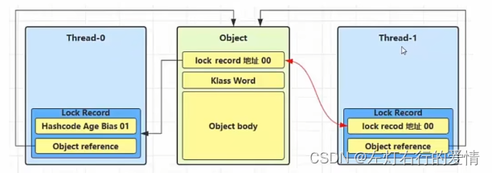  
 流程

1. 将对象头的Mark Word改为Monitor地址，并且状态改为10（重量级锁）
2. 将该Thread\_1线程放入EntryList中，并进入阻塞状态(blocked)  
    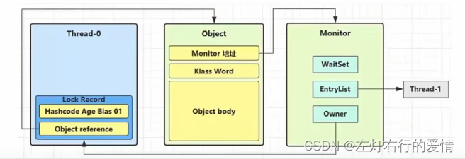
3. 当Thread\_0退出同步块解锁时，使用cas将Mark Word的值恢复给对象头，发生失败。这时会进入重量级解锁流程，即按照Monitor地址找到Monitor对象，设置Owner为null，唤醒EntryList中BLOCKED线程

### 自旋优化（自旋锁）

**概念**  
 是指当一个线程在获取锁的时候，如果锁已经被其它线程获取，那么该线程将循环等待，  
 然后不断的判断锁是否能够被成功获取，直到获取到锁才会退出循环。  
 **优点**  
 自旋锁不会使线程状态发生切换，一直处于用户态，即线程一直都是active的；不会使线程进入阻塞状态，减少了不必要的上下文切换，执行速度快。  
 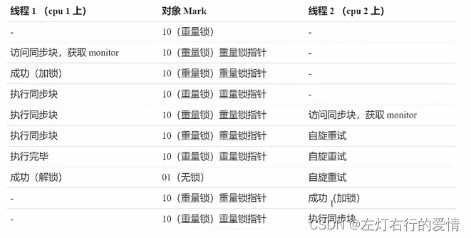  
 重量级锁竞争，还可以使用自旋来进行优化  
 如果当前线程自旋成功（即这时候持锁线程已经退出了同步块，释放了锁），  
 这时当前线程就可以避免阻塞。

如果自旋失败，则堵塞。  
 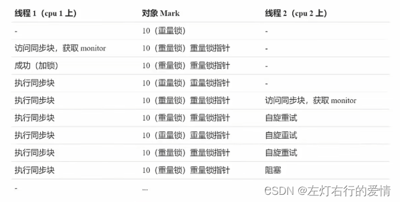  
 Java6之后自旋锁是自适应的，比如对象刚刚的一次自旋操作成功过，  
 那么就会认为自旋成功的可能性高，就会多自旋几次  
 反之，就少自旋或不自旋，比较智能。  
 自旋会占用CPU时间，单核CPU自旋就是浪费  
 多核CPU自旋才能发挥优势  
 Java7 之后不能控制是否开启自旋功能

### 偏向锁

#### 背景

用于优化轻量级锁重入，原因在于：**轻量级锁在没有竞争时**，每次重入（该线程执行的方法再次锁住该对象）操作仍需要cas替换操作，这样会使性能降低。  
 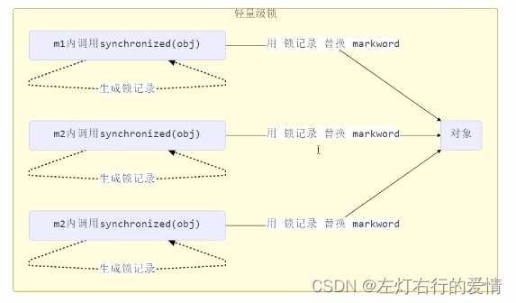  
 每次都需要重新比较lock record和object的关系。

#### 优化过程

在第一次cas时会将线程的Id写入对象Mark Word中。  
 以后发现这个线程Id就是自己的，表示没有竞争，不需要再去cas，以后只要不发送竞争  
 这个对象就归该线程所有。  
 注意：偏向锁默认是有延迟的，不会在程序一启动就生效，而是会在程序运行一段时间（几秒之后），  
 才会对创建的对象设置为偏向状态。  
 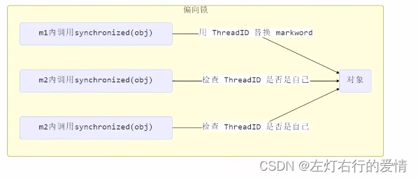

#### 撤销偏向

1. 调用对象HashCode  
    调用了对象hashcode，但偏向锁的对象Mark Word中存储的是线程id，如果调用hashcode会导致偏向锁被撤销（轻量级锁会在锁记录中记录hashcode，重量级锁会在Monitor中记录hashcode）
2. 多个线程使用该对象  
    当有其他线程使用偏向锁对象时，会将偏向锁升级为轻量级锁。
3. 调用了wait/notify方法（因为此方法为重量级所有，会导致锁膨胀而使用重量锁）

#### 批量重偏向

1. 如果对象被多个线程访问，但是线程间不存在竞争，这时偏向T1的对象仍有机会重新偏向T2  
    （重偏向会重置Thread ID）
2. 当撤销超过20次后（超过阈值）,  
    JVM会觉得是不是偏向错了，这时会在给对象加锁时  
    重新偏向至加锁线程。

#### 批量撤销

当撤销偏向锁的阈值超过40以后，就会将整个类的对象都改为不可偏向的

#### 锁消除

当对象不可能被共享时，JIT即时编译器会把锁消除。

### ReentrantLock

ReentrantLock是一把**可重入锁**和**互斥锁**，它具有与synchronized关键字相同的含有隐式监视器(monitor)的基本行为和语义，但是它比synchronized具有更多的方法和功能。

* 和synchronized相比具有的优点  
   可中断，可设置超时时间，可设置公平锁，支持多个条件变量。  
   与synchronized一样，都支持可重入。
* synchronized与Lock锁之间的区别

1. synchronized一般和Object的wait，notify，notifyAll联合一起使用；  
    而lock一般和Condition类的await，signal，signalAll使用；
2. 还有上面所说的优点。

#### 基本语法

```
//获取ReentrantLock对象
private ReentrantLock lock = new ReentrantLock();
//加锁
lock.lock();
try {
 //需要执行的代码
}finally {
 //释放锁
 lock.unlock();
}


```

#### 可重入

同一个线程如果首次获得了这把锁，因为它是这把锁的拥有者，  
 因此有权利再次获得这把锁  
 如果是不可重入锁，那么第二次获得锁时，自己也会被锁挡住

#### 可打断

如果某个线程处于阻塞状态，可以调用其interrupt方法让其停止阻塞，获得锁失败  
 简而言之：处于阻塞状态的线程，被打断了就不用阻塞了，直接停止运行

#### 锁超时

1. 使用lock.tryLock方法会返回获取锁是否成功。如果成功则返回true，反之则返回false。
2. 并且tryLock方法可以指定等待时间，参数为：tryLock（long timeout，TimeUnit unit），其中timeout为最长等待时间，TimeUnit为时间单位  
    简言之：获取失败了，获取超时会被打断，不再阻塞，直接停止运行

#### 公平锁

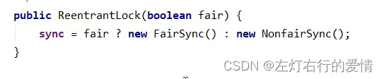  
 线程获取锁失败，进入阻塞队列，先进入的线程会在锁被释放后先获得锁，这样的获取方式就是公平的。  
 注意：默认是不公平锁，需要在创建的时候指定为公平锁。

#### 条件变量

* 概念  
   synchronized中也有条件变量，类比waitSet休息室，当条件不满足时进入waitSet等待；  
   ReentrantLock的条件变量比synchrond强大在于，它支持多个条件变量，ReentrantLock支持多间休息室，有专门的各功能休息室，唤醒时也是按休息室来唤醒（synchronized是那些不满足条件的线程都在一间休息室等消息）
* 使用要点

1. await前需要获得锁。
2. await执行后，会释放锁，进入conditionObject等待
3. await的线程被唤醒（或打断，或超时）取重新竞争lock锁
4. 竞争lock锁成功后，从await后继续执行

这里我们对ReentrantLock有个大致了解，后面我们会详细分析它的源码= =，怕说太多不好全部理解，后面介绍完乐观锁，顺带着总结分析这些源码。
