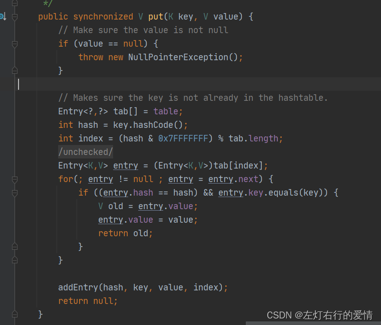

> 原文：[CSDN](https://blog.csdn.net/qq_45852626/article/details/126122998)（历史文章导入，当前状态为草稿）

## 前言

之前我们学习过了集合，并发编程，现在我们来学习并发容器，在并发编程中，经常听到Java集合类，同步容器，并发容器，那么他们之间有哪些分类，优劣呢，我们先把这个框架给分清楚了，这样后面学习的时候不会乱。

### 集合容器

大家熟知的集合类ArrayList，LinkedList，HashMap这些容器这些容器都是非线程安全的，如果多个线程并发访问这些容器时，会出现问题。因此，在编写程序时，如果是在多线程环境下，必需要求程序员手动地在任何访问到这些容器的地方进行同步处理，但是这样使用起来十分麻烦。

### 同步容器

基于集合容器出现的问题，Java给用户提供了同步容器。  
可以简单理解为通过synchronized来实现同步的容器。主要分类为：  
1.Vector  
2.Stack  
3.HashTable  
4.Collections.synchronized方法生成  
举个例子：  
  
  
我们可以看到，这些容器实现线程安全的方式就是将它们的封装起来，并在需要同步的方法上添加关键字synchronized。  
只是，这样做的代价是削弱了并发性，当多个线程共同竞争容器级的锁时，吞吐量就会降低。

### 并发容器

为了解决同步容器的性能问题，并发容器出现了。  
Java.util.concurrent包下提供了多种并发容器。  
并发容器是专门针对多线程并发设计的，使用了锁分段技术，只对操作的位置进行同步操作，其他没有操作的位置可以被其他线程访问，提高了程序的吞吐量。  
采用了CAS算法和部分代码使用synchronized锁保证线程安全。

综上来说：  
1.单线程中操作普通容器时，代码都是串行执行，同一时刻只能put或get一个数据到容器中  
2.多线程中操作同步容器时，多个线程排队去执行，同一时刻也是只能put或get一个数据到同步容器中  
3.在多线程中操作并发容器时，可以多个线程同时去执行，同一时刻可以有多个线程去put或get多个数据到并发容器中

结构上来说呢JUC安全集合有三大类：Blocking类，CopyOnWrite类，Concurrent类，后面我们会对每个类里面重点的集合进行分析。
