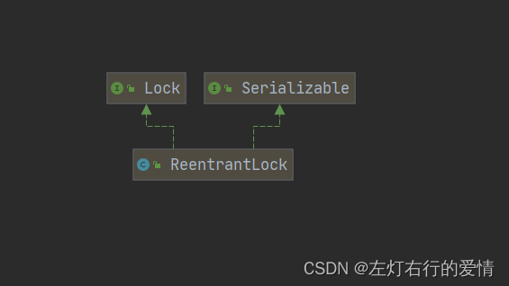
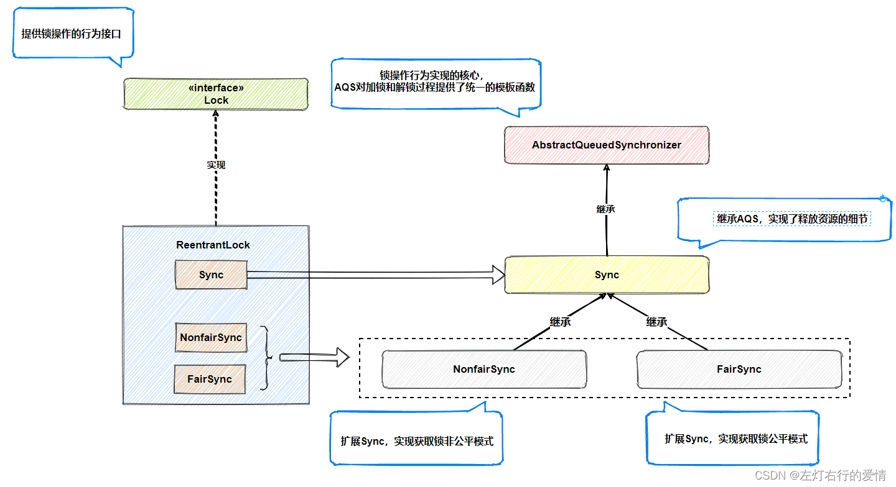

> 原文：[CSDN](https://blog.csdn.net/qq_45852626/article/details/126131210)（历史文章导入，当前状态为草稿）

## 前言

上一篇文章我们细说了AQS，如果我们搞明白了一些AQS，再来学习ReentrantLock就很容易了，相对来说简单了许多，核心还是AQS的那些东西，本篇我们敞开了聊聊ReentrantLock细节内容。

## ReentrantLock出现的原因

ReentrantLock是java并发包下重要的同步工具，实现了可重入互斥锁，它的设计和synchronized作用相同。  
早期因为synchronized效率较低，大量使用了 系统调用的重量级锁，导致用户态与内核态来回不断的
切换 
，影响系统效率，所以产生了基于Unsafe并发同步框架AQS设计出了ReentranLock。

## 继承结构

  
代码实现：

```
public class ReentrantLock implements Lock, java.io.Serializable 


```

1.Serializable：实现了可序列化  
2.Lock：Java对锁的统一规范  
我们之前已经看到Lock的代码了，这里再贴一遍吧，不多解释了，有疑问的可以去看看上篇AQS（强烈建议看玩AQS再来看ReetrantLock）

```
public interface Lock {
    void lock();
    void lockInterruptibly() throws InterruptedException;

    boolean tryLock();
    boolean tryLock(long time, TimeUnit unit) throws InterruptedException;
    
    void unlock();
    
    Condition newCondition();
}


```

## Doc注释解析

```
/**
 * A reentrant mutual exclusion {@link Lock} with the same basic
 * behavior and semantics as the implicit monitor lock accessed using
 * {@code synchronized} methods and statements, but with extended
 * capabilities.
 *ReentrantLock是可重入的互斥锁，有着和Synchronized隐式莞城所一样的功能，同时也有更多扩展
 * <p>A {@code ReentrantLock} is <em>owned</em> by the thread last
 * successfully locking, but not yet unlocking it. 
 * ReentrantLock由赏赐成功锁定且没有解锁的线程所有
 * A thread invoking {@code lock} will return, successfully acquiring the lock, when
 * the lock is not owned by another thread. 
 * 当该锁不属于另一个线程时，调用lock的线程返回，并成功获得该锁。
 * The method will return immediately if the current thread already owns the lock. 
 * 如果当前线程已经持有锁，该方法立刻返回。
 * This can be checked using methods {@link #isHeldByCurrentThread}, and {@link
 * #getHoldCount}.
 * 可以使用isHeldCurrentThread和getHoldCount进行检查
 *
 * <p>The constructor for this class accepts an optional
 * <em>fairness</em> parameter.
 * 此类构造函数接受一个可选的公平参数
 *   When set {@code true}, under contention, locks favor granting access to the longest-waiting thread.
 * 在争用情况下，锁会倾向授予等待时间最长的线程访问
 *Otherwise this lock does not guarantee any particular access order. 
 否则，此锁不能保证按任何特定方式的顺序
  Programs using fair locks accessed by many threads may display lower overall    throughput (i.e., are slower; often much slower) than those using the default setting, but have smaller variances in times to obtain locks and guarantee lack of starvation.
 * 使用多线程访问的公平锁定程序可能会比默认设置的程序由较慢吞吐量（通常慢很多）但是获得锁并保证没有饥饿的时间差异较小
 *  Note however, that fairness of locks does not guarantee fairness of thread scheduling.
 * 注意，锁的公平性不能保证线程调度的公平性
 *  Thus, one of many threads using a fair lock may obtain it multiple times in succession while other  active threads are not progressing and not currently holding the lock.
 * 所以，使用公平锁的许多线程之一可能连续多次获得它，而其他活动线程未进行且当前未持有锁
 * Also note that the untimed {@link #tryLock()} method does not honor the fairness setting.
 * 还有，未定时的trylock方法不支持公平性设置
 *  It will succeed if the lock is available even if other threads are waiting.
 *如果锁定可用，即使其他线程正在等待，它依旧将成功
 * <p>It is recommended practice to <em>always</em> immediately
 * follow a call to {@code lock} with a {@code try} block, most
 * typically in a before/after construction such as:
 * 建议实践总是使用try之后立刻lock，最常用的是在构造前后
 *
 *  <pre> {@code
 * class X {
 *   private final ReentrantLock lock = new ReentrantLock();
 *   // ...
 *
 *   public void m() {
 *     lock.lock();  // block until condition holds
 *     try {
 *       // ... method body
 *     } finally {
 *       lock.unlock()
 *     }
 *   }
 * }}</pre>
 *
 * <p>In addition to implementing the {@link Lock} interface, this
 * class defines a number of {@code public} and {@code protected}
 * methods for inspecting the state of the lock. 
 * 除了实现lock接口之外，此类还定义了许多public和protected的方法来检查锁的状态
 *  Some of these methods are only useful for instrumentation and monitoring.
 *其中的一些方法仅仅用于监控
 * <p>Serialization of this class behaves in the same way as built-in
 * locks: a deserialized lock is in the unlocked state, regardless of
 * its state when serialized.
 *此类的序列化和内置锁的行为相同，反序列化的锁处于解锁状态，而不管序列化时锁的状态如何。
 * <p>This lock supports a maximum of 2147483647 recursive locks by
 * the same thread. Attempts to exceed this limit result in
 * {@link Error} throws from locking methods.
 *此锁同一线程最多支持2147483647个递归锁，尝试超过此限制会导致方法被锁定且抛出Error异常。
 */


```

## 成员变量&&构造函数

成员变量：  
Only one  
`private final Sync sync;`  
它的构造函数围绕这个成员变量来实现公平与非公平锁

构造函数：  
1.

```
  public ReentrantLock() {
        sync = new NonfairSync();
    }


```

我们可以看到，默认情况下是非公平锁


```
  public ReentrantLock(boolean fair) {
        sync = fair ? new FairSync() : new NonfairSync();
    }


```

我们可以通过构造函数里的fair参数来判断为哪种
类 
型的锁实现  
true----公平锁 FairSync()  
false—非公平锁NonfairSync()

## 重要的内部类

ReentranLock的内部类有三种，抽象类Sync，公平锁与非公平锁。  
一：抽象类Sync

```
    abstract static class Sync extends AbstractQueuedSynchronizer {
        private static final long serialVersionUID = -5179523762034025860L;

          子类主要是实现这个方法！
        abstract void lock();

     
        final boolean nonfairTryAcquire(int acquires) {
        获取当前线程
            final Thread current = Thread.currentThread();
            获取当前state的值
            int c = getState();
            由于我们这里是非公平锁，所以只要c=0（没有线程持有锁），那么不管等待队列中是否有线程，我们直接来抢锁。
            if (c == 0) {
                if (compareAndSetState(0, acquires)) {使用cas确保只有一个线程成功
                    setExclusiveOwnerThread(current);成功设置锁的owner为当前线程
                    return true;
                }
            }
            如果不为0，且当前线程为此锁的Owner，说明我们再次重入
            else if (current == getExclusiveOwnerThread()) {
            将state的值+acquires（通常是+1）
                int nextc = c + acquires;
                if (nextc < 0) 如果相加之后<0，则说明字段溢出，抛出异常
                    throw new Error("Maximum lock count exceeded");
                setState(nextc);通过set修改状态
                return true;
            }
            return false; 如果都不是，则获取锁失败。
        }
我们可以看出，非公平锁一上来并不排队，而是先执行一次竞争（压根不管CLH队列里面有谁）,如果第一次竞争失败，我们会调用tryAcquire的方法让这个线程入队（CLH队列）。
而公平锁的话，直接调用AQS自带的排队方法，根据队列里的情况来处理。
非公平与公平之间的区别就在于是否排队

        protected final boolean tryRelease(int releases) {
        获取当前state的状态并-release（通常为-1）
            int c = getState() - releases;
            如果当前线程不是Owner，抛出异常（因为这里我们是释放锁，如果都没有持有锁，释放就无从谈起）
            if (Thread.currentThread() != getExclusiveOwnerThread())
                throw new IllegalMonitorStateException();
            boolean free = false;
            如果c为0，则表示完全释放了锁
            if (c == 0) {
                free = true;
                setExclusiveOwnerThread(null);将Owner状态设置为null
            }
            setState(c); 修改状态
            return free;   返回free的值
        }
        该线程是否正在独占资源
        protected final boolean isHeldExclusively() {
            return getExclusiveOwnerThread() == Thread.currentThread();
        }

    }


```

二：NonfairSync

```
 static final class NonfairSync extends Sync {
        private static final long serialVersionUID = 7316153563782823691L;

        /
        final void lock() {
        非公平锁，刚开始先竞争一次
            if (compareAndSetState(0, 1))
                setExclusiveOwnerThread(Thread.currentThread());
            else
            竞争失败，调用acquire进行入队，执行AQS通用操作
                acquire(1);
        }

        protected final boolean tryAcquire(int acquires) {
        tryAcquire调用起那么nonfairTryAcquire方法（Sync内部类里的）
            return nonfairTryAcquire(acquires);
        }
    }


```

三：FairSync

```
   static final class FairSync extends Sync {
        private static final long serialVersionUID = -3000897897090466540L;

        final void lock() {
        注意与非公平锁的区别，此处直接执行acquire(1)，
        而非公平锁一开始需要先竞争一次
            acquire(1);
        }

        /**
         * Fair version of tryAcquire.  Don't grant access unless
         * recursive call or no waiters or is first.
         */
        protected final boolean tryAcquire(int acquires) {
        获取当前线程
            final Thread current = Thread.currentThread();
            获得state（锁状态）
            int c = getState();
            if (c == 0) {
            如果队列中不具有前驱节点，并且cas抢锁（与非公平锁线程抢）成功
                if (!hasQueuedPredecessors() &&
                    compareAndSetState(0, acquires)) {
                    setExclusiveOwnerThread(current);设置owner为此线程
                    return true;
                }
            }
            如果锁的线程为当前线程
            else if (current == getExclusiveOwnerThread()) {
            锁重入，state准备+1
                int nextc = c + acquires;
                if (nextc < 0)为负数说明越界，抛异常
                    throw new Error("Maximum lock count exceeded");
                setState(nextc);
                return true;
            }
            return false;
        }
    }


```

公平锁需要根据队列情况来抢锁，每次都需要判断是否为队列唤醒的节点

## 形象总结一下ReentrantLock

这里引用阿星大佬的一个图  
  
可以对着这个图看一看源码，很清晰

## 总结

学好AQS再来学ReentrantLock是很重要的，只看博客不去自己调也不行，加油。

参考博客：  
https://blog.csdn.net/m0\_37199770/article/details/116011641?spm=1001.2014.3001.5502
