> 原文：[CSDN](https://blog.csdn.net/qq_45852626/article/details/125993672)（历史文章导入，当前状态为草稿）

## Thread源码解析
 本文着重分析代码，理清里面的逻辑，我们主要分析Thread。

## 继承结构

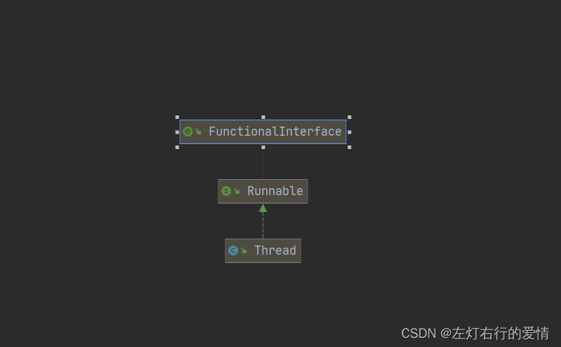  
 代码实现：

```
public
class Thread implements Runnable 


```

Thread类实现了Runnable，我们也在前文提到过，需要启动一个线程，需要继承Thread或者实现Runnable接口，本质来说都是实现了Runnable接口。

### Doc解读

```
/**
 * A <i>thread</i> is a thread of execution in a program. The Java
 * Virtual Machine allows an application to have multiple threads of
 * execution running concurrently.
 * <p>
 * thread是程序中执行的线程，Jvm允许在一个程序中分配多个线程并发执行
 * 
 * Every thread has a priority. 
 * 每个线程都有优先级
 * Threads with higher priority are executed in preference to threads with lower priority. 
 * 那些具有较高优先级的线程会优先于较低优先级的线程执行
 * Each thread may or may not also be marked as a daemon. 
 * 每一个线程都可以标记为守护线程
 * When code running in some thread creates a new {@code Thread} object, the new thread has its priority initially set equal to the priority of the creating thread, and is a daemon thread if and only if the
creating thread is a daemon.
当运行在某个线程中的代码创建一个新的线程对象时，新的线程最初优先级与线程优先级相等，
当且仅当创建线程是守护线程的时候，被创建的新线程才是守护线程
 * <p>
 * When a Java Virtual Machine starts up, there is usually a single
 * non-daemon thread (which typically calls the method named
 * {@code main} of some designated class).
 * 当JVM启动的时候，通常有一个单独的非守护线(通常调用main方法所在的类命名)
 *  The Java VirtualMachine continues to execute threads until either of the following
 * occurs:
 * Java虚拟机会继续执行线程，直到出现如下情况：
 * <ul>
 * <li>The {@code exit} method of class {@code Runtime} has been
 *     called and the security manager has permitted the exit operation
 *     to take place.
 * 运行时Runtime调用exit方法，安全管理器允许执行退出操作
 * <li>All threads that are not daemon threads have died, either by
 *     returning from the call to the {@code run} method or by
 *     throwing an exception that propagates beyond the {@code run}
 *     method.
 * 所有不是守护线程的线程都"死"了，要么从调用run的方法返回，要么抛出一个run方法之外的异常
 * </ul>
 * <p>
 * There are two ways to create a new thread of execution. 
 * 通常有两种方式创建一个线程
 * One is to declare a class to be a subclass of {@code Thread}. 
 * 一种是继承Thread类
 * This subclass should override the {@code run} method of class {@code Thread}.
 * 子类应该重写run方法
 *  An instance of the subclass can then be allocated and started.
 * 然后子类的实例是可分配的并启动
 *  For example, a thread that computes primes larger than a stated value could be written as follows:
 * 例如，计算质数的线程大于指定值可写成：
 * <hr><blockquote><pre>
 *     class PrimeThread extends Thread {
 *         long minPrime;
 *         PrimeThread(long minPrime) {
 *             this.minPrime = minPrime;
 *         }
 *
 *         public void run() {
 *             // compute primes larger than minPrime
 *             &nbsp;.&nbsp;.&nbsp;.
 *         }
 *     }
 * </pre></blockquote><hr>
 * <p>
 * The following code would then create a thread and start it running:
 * 然后通过如下代码来创建线程
 * <blockquote><pre>
 *     PrimeThread p = new PrimeThread(143);
 *     p.start();
 * </pre></blockquote>
 * <p>
 * 
 * The other way to create a thread is to declare a class that
 * implements the {@code Runnable} interface. 
 * 创建线程的另外一种方法是申明一个类去实现Runnable解耦。
 * That class then implements the {@code run} method. 
 * 这个类实现run方法
 * An instance of the class can then be allocated, passed as an argument when creating {@code Thread}, and started.
然后类的实例也会被分配，在创建时作为Thread的参数传递给Thread，接着启动
 *  The same example in this other style looks like the following:
 * 看起来如下所示：
 * <hr><blockquote><pre>
 *     class PrimeRun implements Runnable {
 *         long minPrime;
 *         PrimeRun(long minPrime) {
 *             this.minPrime = minPrime;
 *         }
 *
 *         public void run() {
 *             // compute primes larger than minPrime
 *             &nbsp;.&nbsp;.&nbsp;.
 *         }
 *     }
 * </pre></blockquote><hr>
 * <p>
 * The following code would then create a thread and start it running:
 * 之后通过如下代码创建：
 * <blockquote><pre>
 *     PrimeRun p = new PrimeRun(143);
 *     new Thread(p).start();
 * </pre></blockquote>
 * <p>
 * Every thread has a name for identification purposes. More than
 * one thread may have the same name. If a name is not specified when
 * a thread is created, a new name is generated for it.
 * 每一个线程都有一个用于标识的名字。
 * 超过一个线程可以有相同的名字，如果在创建线程时未指定名称，将自动生成一个新名称
 * <p>
 * Unless otherwise noted, passing a {@code null} argument to a constructor
 * or method in this class will cause a {@link NullPointerException} to be
 * thrown.
 *除非另有说明，否则将null参数传递给null中的构造函数或方法将导致抛出NullPointerException 。


```

## 成员变量

由于比较多，我分两部分来说明，第一部分是刚开始学习比较常遇见的，后面则是另外的，

```
 private volatile String name;  //线程名称
 
 private int priority;    //线程优先级，默认为5，范围1-10；

  /* Whether or not the thread is a daemon thread. */
  private boolean daemon = false;        //守护线程状态，默认为false

  /*
     * Thread ID
     */
    private final long tid;         //线程的ID
 /*
     * Java thread status for tools, default indicates thread 'not yet started'
     */
    private volatile int threadStatus;   //Java线程状态，0表示未启动
 /* The group of this thread */
    private ThreadGroup group;    //线程组


```

```
private Thread threadQ;

private long eetop;

private boolean single_step;

private boolean stillborn = false; //JVM状态，默认为false

private Runnable target; //将被执行的Runnable实现类         

private ClassLoader contextClassLoader; //这个线程上下文的类加载器

private AccessControlContext inheritedAccessControlContext;  //该线程继承的AccessControlContext

private static int threadInitNumber; //用于匿名线程的自动编号

ThreadLocal.ThreadLocalMap threadLocals = null;  //属于此线程的ThreadLocal,这个映射关系通过ThreadLocal维持

ThreadLocal.ThreadLocalMap inheritableThreadLocals = null; //这个线程的InheritableThreadLocal，其映射关系通过InheritableThreadLocal维持

private long stackSize;    //此线程的请求的堆栈的大小，如果创建者的请求堆栈大小为0，则不指定堆栈大小，由jvm来自行决定。一些jvm会忽略这个参数。

private long nativeParkEventPointer; //在本机线程终止后持续存在的jvm私有状态。
private static long threadSeqNumber;   //用于生成线程的ID

volatile Object parkBlocker;  //提供给LockSupport调用的参数

private volatile Interruptible blocker;     //此线程在可中断的IO操作中被阻塞的对象，阻塞程序的中断方法应该在设置了这个线程中断状态之后被调用


```

## 常量

```
    public static final int MIN_PRIORITY = 1;

    public static final int NORM_PRIORITY = 5;

    public static final int MAX_PRIORITY = 10;


```

## 构造方法

构造方法有很多，不必一次记完，根据需要学习就行，这里做一个总结。

### Thread()

```
  public Thread() {
        this(null, null, "Thread-" + nextThreadNum(), 0);
    }


```

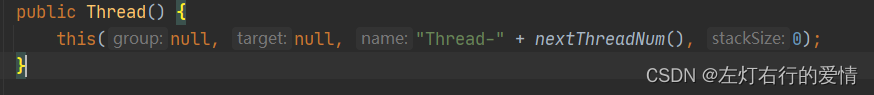

### Thread(Runnable target)

```
   public Thread(Runnable target) {
        this(null, target, "Thread-" + nextThreadNum(), 0);
    }


```

这个方法通常用Runnable启动线程的方法，实际上Runnable对象被放置在了target变量中，之后通过jvm启动线程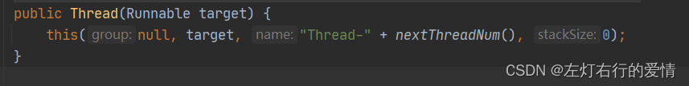

### Thread(Runnable target, AccessControlContext acc)

```
   Thread(Runnable target, AccessControlContext acc) {
        this(null, target, "Thread-" + nextThreadNum(), 0, acc, false);
    }


```

传入Runnable同时也可以指定AccessControlContext（根据其封装的上下文做出系统资源访问决策。）  
 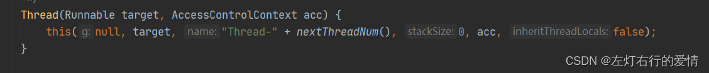

### Thread(ThreadGroup group, Runnable target)

```
 public Thread(ThreadGroup group, Runnable target) {
      this(group, target, "Thread-" + nextThreadNum(), 0);
  }


```

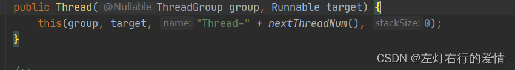  
 使用线程组。  
 如果有安全管理器，则线程由安全管理器返回SecurityManager.getThreadGroup()。  
 如果没有安全管理器或者SecurityManager.getThreadGroup()返回为空，则返回当前的线程组。

### Thread(String name)

```
   public Thread(String name) {
        this(null, null, name, 0);
    }


```

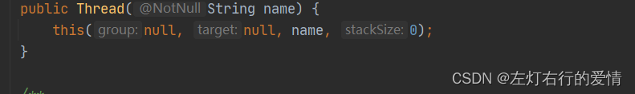 指定线程的名称

### Thread(ThreadGroup group, String name)

```
   public Thread(ThreadGroup group, String name) {
        this(group, null, name, 0);
    }


```

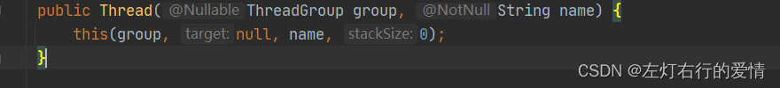

### Thread(Runnable target, String name)

```
   public Thread(Runnable target, String name) {
        this(null, target, name, 0);
    }


```

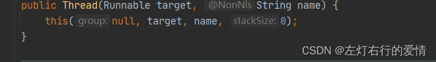

### Thread(ThreadGroup group, Runnable target, String name)

```
  public Thread(ThreadGroup group, Runnable target, String name) {
    init(group, target, name, 0);
}


```

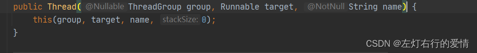

### Thread(ThreadGroup group, Runnable target, String name,long stackSize)

```
   public Thread(ThreadGroup group, Runnable target, String name,
                  long stackSize) {
        this(group, target, name, stackSize, null, true);
    }


```

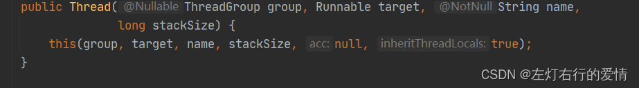

### Thread(ThreadGroup group, Runnable target, String name,long stackSize, boolean inheritThreadLocals)

```
  public Thread(ThreadGroup group, Runnable target, String name,
                  long stackSize, boolean inheritThreadLocals) {
        this(group, target, name, stackSize, null, inheritThreadLocals);
    }


```

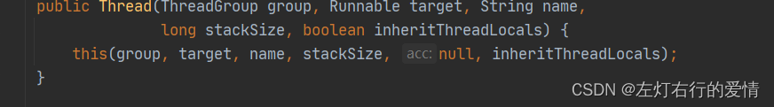  
 我们来详细的介绍一下最后一个构造方法，因为前面所有的构造方法中的this，最后指向的都是最后一个构造方法  
 我们看看this里面的代码：

```
   private Thread(ThreadGroup g, Runnable target, String name,
                   long stackSize, AccessControlContext acc,
                   boolean inheritThreadLocals) {
         //name如果为null，则返回异常
         name在其他方法中如果不指定会自动生成，通常为：
         "Thread-"+nextThreadNum()
        if (name == null) {
            throw new NullPointerException("name cannot be null");
        }

        this.name = name;
        //指定父线程
        Thread parent = currentThread();
        //安全管理器
        SecurityManager security = System.getSecurityManager();
         //如果线程组为null
        if (g == null) {
            /* Determine if it's an applet or not */

            /* If there is a security manager, ask the security manager
               what to do. */
               
            if (security != null) {
            //如果有安全管理器，则会请求管理器进行设置
                g = security.getThreadGroup();
            }

            /* If the security manager doesn't have a strong opinion
               on the matter, use the parent thread group. */
            if (g == null) {
            //如果没有安全管理器，那么将会获取父线程所在的线程组
                g = parent.getThreadGroup();
            }
        }

        /* checkAccess regardless of whether or not threadgroup is
           explicitly passed in. */
        g.checkAccess();

        /*
         * Do we have the required permissions?
         */
        if (security != null) {
            if (isCCLOverridden(getClass())) {
                security.checkPermission(
                        SecurityConstants.SUBCLASS_IMPLEMENTATION_PERMISSION);
            }
        }

        g.addUnstarted();

        this.group = g;
        this.daemon = parent.isDaemon();
        this.priority = parent.getPriority();
        if (security == null || isCCLOverridden(parent.getClass()))
            this.contextClassLoader = parent.getContextClassLoader();
        else
            this.contextClassLoader = parent.contextClassLoader;
        this.inheritedAccessControlContext =
                acc != null ? acc : AccessController.getContext();
        this.target = target;
        setPriority(priority);
        if (inheritThreadLocals && parent.inheritableThreadLocals != null)
            this.inheritableThreadLocals =
                ThreadLocal.createInheritedMap(parent.inheritableThreadLocals);
        /* Stash the specified stack size in case the VM cares */
        this.stackSize = stackSize;

        /* Set thread ID */
        this.tid = nextThreadID();
    }


```

## native方法

Thread大部分逻辑都是由JVM完成，因此核心的方法都是native方法

```
//确保registerNatives是<clinit>做的第一件事,这个代码要放在代码的最前面。
private static native void registerNatives();
//返回当前线程
@HotSpotIntrinsicCandidate
public static native Thread currentThread();
  //当前线程在获取CPU执行权之后，让出，之后让等待队列的线程重新竞争。有可能是当前线程再次抢到执行权，也有可能是其他线程。
public static native void yield();
//休眠
public static native void sleep(long millis) throws InterruptedException;
//启动
private native void start0();
//测试某个值是否被中断 中断状态根据传入的ClearInterrupted值进行重置
@HotSpotIntrinsicCandidate
private native boolean isInterrupted(boolean ClearInterrupted);
//测试线程是否是存活状态
public final native boolean isAlive();
//计算线程中的堆栈数，此线程必须被暂停 ，这个方法已不再建议使用
@Deprecated(since="1.2", forRemoval=true)
public native int countStackFrames();
//当且仅当当前线程在指定的对象上保持监视器锁时，才返回 true。    
public static native boolean holdsLock(Object obj);
//导出线程堆栈信息
private static native StackTraceElement[][] dumpThreads(Thread[] threads);
//get线程
private static native Thread[] getThreads();
//设置优先级
private native void setPriority0(int newPriority);
//停止
private native void stop0(Object o);
//挂起
private native void suspend0();
//重置
private native void resume0();
//中断
private native void interrupt0();
//设置线程名称
private native void setNativeName(String name);


```

## 重要的非native方法

### start

```
  public synchronized void start() {
   
        if (threadStatus != 0)  //验证线程状态
            throw new IllegalThreadStateException();

        boolean started = false;
        try {
            start0();    //实际上还是调用native方法
            started = true;  //修改start状态
        } finally {
            try {
                if (!started) {
                    group.threadStartFailed(this);
                }
            } catch (Throwable ignore) {
            }
        }
    }


```

### setDaemon

设置守护线程状态：

```
  public final void setDaemon(boolean on) {
        checkAccess();         
        if (isAlive()) {
            throw new IllegalThreadStateException();
        }
        daemon = on;
    }


```

### checkAccess

检查访问状态：

```
  public final void checkAccess() {
        SecurityManager security = System.getSecurityManager();
        if (security != null) {
            security.checkAccess(this);
        }
    }


```

### join

join将当前运行的线程阻塞，之后让join的持有线程执行完之后再继续执行。等待时间为传入的参数。

```
  public final synchronized void join(long millis)
    throws InterruptedException {
    //获得当前时间
        long base = System.currentTimeMillis();
        long now = 0;

        if (millis < 0) {
            throw new IllegalArgumentException("timeout value is negative");
        }

        if (millis == 0) {
        如果当前线程可用，则调用wait
            while (isAlive()) {
                wait(0);
            }
        } else {   执行时间>0的情况
            while (isAlive()) {
            通过wait方法delay
                long delay = millis - now;         //循环计算延期时间
                if (delay <= 0) {          
                    break;
                }
                wait(delay);
                now = System.currentTimeMillis() - base;
            }
        }
    }


```

wait(0)会一直阻塞，知道notify才会返回，join方法的底层实际上是wait方法

### sleep

sleep通过native方法实现

```
  public static void sleep(long millis, int nanos)
    throws InterruptedException {
        if (millis < 0) {
            throw new IllegalArgumentException("timeout value is negative");
        }
       
        if (nanos < 0 || nanos > 999999) {
            throw new IllegalArgumentException(
                                "nanosecond timeout value out of range");
        }

        if (nanos >= 500000 || (nanos != 0 && millis == 0)) {
            millis++;
        }

        sleep(millis);
    }


```

上面只是判断哪了值的范围，本质还是native

### Interrupt

```
 public void interrupt() {
 如果调用中断的是线程本身，则不需要进行安全性分析
        if (this != Thread.currentThread()) {
            checkAccess();

            // thread may be blocked in an I/O operation
            synchronized (blockerLock) {
                Interruptible b = blocker;
                if (b != null) {
                    interrupt0();  // set interrupt status  
                    b.interrupt(this);
                    return;
                }
            }
        }

        // set interrupt status
        interrupt0();      //中断线程
    }


```

### stop方法

```
   public final void stop() {
        SecurityManager security = System.getSecurityManager();
        if (security != null) {
            checkAccess();
            if (this != Thread.currentThread()) {
                security.checkPermission(SecurityConstants.STOP_THREAD_PERMISSION);
            }
        }
        // A zero status value corresponds to "NEW", it can't change to
        // not-NEW because we hold the lock.
        if (threadStatus != 0) {
            resume(); // Wake up thread if it was suspended; no-op otherwise
        }

        // The VM can handle all thread states
        stop0(new ThreadDeath());
    }


```

## 重要内部类

### Caches

Cache缓存了子类安全审计的结果。

```
private static class Caches {
    //缓存子类安全审计结果
    static final ConcurrentMap<WeakClassKey,Boolean> subclassAudits =
        new ConcurrentHashMap<>();

    //对审计子类的weak引用进行排队
    static final ReferenceQueue<Class<?>> subclassAuditsQueue =
        new ReferenceQueue<>();
}


```

### WeakClassKey

弱引用对象的key

```
static class WeakClassKey extends WeakReference<Class<?>> {

    private final int hash;

    WeakClassKey(Class<?> cl, ReferenceQueue<Class<?>> refQueue) {
        super(cl, refQueue);
        hash = System.identityHashCode(cl);
    }

    @Override
    public int hashCode() {
        return hash;
    }

    @Override
    public boolean equals(Object obj) {
        if (obj == this)
            return true;
        if (obj instanceof WeakClassKey) {
            Object referent = get();
            return (referent != null) &&
                   (referent == ((WeakClassKey) obj).get());
        } else {
            return false;
        }
    }
}


```

### State

线程的状态内部枚举类。这个线程的状态有NEW、RUNNABLE、BLOCKED、WAITING、TIMED\_WAITING、TERMINATED状态。

```
public enum State {

    NEW,
    
    RUNNABLE,
  
    BLOCKED,

    WAITING,

    TIMED_WAITING,

    TERMINATED;
}


```
