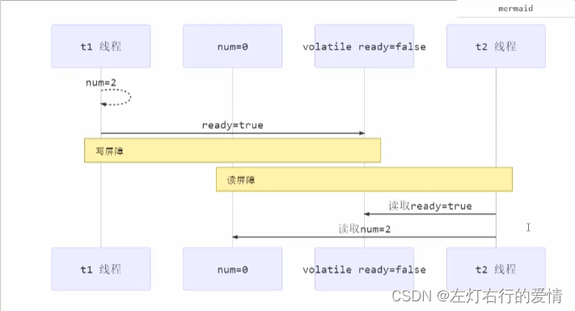
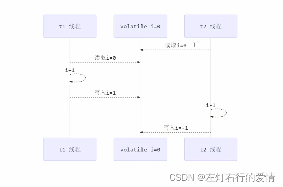
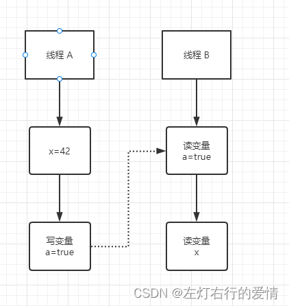

> 原文：[CSDN](https://blog.csdn.net/qq_45852626/article/details/126050732)（历史文章导入，当前状态为草稿）

## 内存模型\_2
## 前言

上一章我们了解到，在并发场景中，因为可见性，原子性，有序性导致的问题常常会违背我们的直觉，从而成为并发编程BUG之源。  
 这三者在编程领域属于共性问题，所有的编程语言都会遇到，那么作为Java，自然也有针对这三者的技术方案，而且在编程语言里属于领先地位，今天我们学会了Java解决，对于理解其他语言的解决方案有触类旁通的效果。

## Java的内存 模型 怎么解决这三个核心问题

我们已经了解到了：  
 1：导致可见性的原因是**缓存**  
 2：导致有序性的原因是**编译优化**  
 那么解决可见性，有序性最直接的方法就是禁用缓存和编译优化，只是问题虽然解决了，我们程序的性能直接gg。  
 那么合理的方案应该是**按需禁用缓存以及编译优化**。  
 Java内存模型是个很复杂的概念，可以从不同的视角来解读，站在我们这些程序员的视角，本质上可以理解为，**Java内存模型规范了JVM如何提供按需禁用缓存和编译优化的方法**，具体来说，这些方法包括`volatile，synchronized，final`三个关键字，以及六项`Happens-Before`规则，这也是我们这章核心内容。

### Volatile

Volatile关键字并不是Java语言的特产，c语言里也有，它最初始的意义就是**禁用CPU缓存**。  
 例如，我们声明一个volatile变量`volatile int x =0;`，它表达的是：告诉编译器，对这个变量的读写，不能使用
CPU 
缓存，必须从内存中读取或者写入。  
 我们深入探讨一下Volatile底层实现原理——**内存屏障**（Memory Fence）  
 1：对Volatile变量的写指令后加入写屏障  
 2：对volatile变量的读指令前加入读屏障

#### 如何保证可见性

注意，下面的ready是volatile变量。

1. 写屏障（sfence）保证在该屏障之前，对共享变量的改动，都同步到主存当中

```
public void  action1(){
num=2;
ready=true       //ready是volatile赋值带写屏障
//写屏障
}


```

2. 读屏障（Ifence）保证在该屏障后，对共享变量的读取，加载的是主存中最新数据

```
public void action2(){
//读屏障
//ready是volatile读取值带读屏障
if(ready){
r=num+num;
}else{
r=1;
}
}


```



#### 如何保证有序性

1：写屏障会确保指令排序时，不会将写屏障之前的代码排在写屏障之后。  
 2：读屏障会确保指令重排时，不会将读屏障之后的代码排在读屏障之前。

注意：**volatile不能解决指令交错问题**

1. 写屏障仅仅保证之后的读 能够读到最新的结果，但不能保证读跑到前面去。
2. 有序性保证也仅仅保证了本线程相关代码不被重排序  
      
    t1虽然在写入i=1加入了写屏障，但是并不能保证t2线程是先读的，所以t2线程读到的还是0；

### Happens-Before规则

如何理解Happens-Before呢？如果仅凭字面意思为先行发生，但是Happens-Before并不是说前面一个操作发生在后续操作的前面，它真正表达的是：**前面一个操作的结果对后续操作是可见的**。  
 所以正式说法是：Happens-Before约束了编译器的优化行为，虽然允许编译器优化，但是要求编译器优化后一定遵守Happens-Before规则。  
 我们以一个例子来解读一格Happens-Before的六条规则：  
 例子：

```
class VolatileDemo{
int x=0;
volatile boolean a =false;

public void writer(){
x=42;
a=true;
}
public void reader(){
if(a=true){
//这里x会是多少呢
}}
}


```

问题：  
 假设线程A执行writer方法，按照volatile语义，会把变量"a=true"写入内存；  
 假设线程B执行
reader
方法，同样按照volatile语义，线程B会从内存中读取变量a，如果线程B看到"a==true"时，  
 那么线程B看到的变量x是多少?  
 答：直觉来看，应该是42，实际上，如果java版本低于1.5运行，x可能是42或者是0；  
 java版本高于1.5，x就等于42.

分析一下，为什么1.5版本会出现x=0呢？  
 聪明的你一定知道，x可能被cpu缓存而导致可见性问题。这个问题在1.5之后被完美解决。  
 Java内存模型在1.5版本对volatile语义进行了增强，怎么增强的呢？答案就是Happens-before。

#### 规则一

在一个线程中，按照程序顺序，前面的操作Happens-Before于后续的任意操作。  
 这比较符合单线程里面的思维：程序前面对某个变量的修改一定对后续操作可见。

#### 规则二

对一个volatile变量的写操作，Happens-Before于后续对这个volatile变量的读操作。

这个看起来有点难懂，对一个volatile变量写操作相对于后续这个volatile变量的读操作可见，  
 这怎么看都是禁用缓存的意思，感觉和1.5版本以前语义没有变化呀？  
 这需要我们去关联一下规则三。

#### 规则三

传递性，如果A Happens-Before B，且B Happens-Before C，那么A Happens-Before C。

我们将规则三运用到例子中，看看发生了什么  
 

1. “x=42” Happens-Before 写变量 “a=true”，这是规则一的内容
2. 写变量 “a=true” Happens-Before 读变量 “a=true” ，这是规则二内容

再根据这个传递性规则，我们得到结果：“x=42” Happens-Before 读变量 “a=true” 。这意味着什么呢？

如果说线程B读到了 “a=true”，那么线程A设置的"x=42"对线程B是可见的。这就是1.5版本对volatile语义的增强。

#### 规则四

对一个锁的解锁 Happens-Before 于后续对这个锁的加锁。  
 我们都知道，管程中的锁在Java里是隐式实现的，我们举个例子：

```
synchronized(this){  //此处自动加锁
//x是共享变量，初始值=10
if(this.x<12){
this.x=12;
}
}//此处自动解锁


```

所以结合规则四——管程中的锁规则，可以理解为：假设x的初始值是10，线程A执行完代码块后x的值会变成12（执行完自动释放锁），线程B进入代码块时，能够看到线程A对x的写操作，也就是线程B能够看到x==12.  
 这个也是符合我们的直觉，不难理解。

#### 规则五

线程start()规则 ，这条关于线程启动的，主线程A启动子线程B后，子线程B能够看到 主线程在启动子线程B前的操作。  
 举个例子来看：

```
Thread B =new Thread(()->{
//主线程调用B.start()之前
//所有对共享变量的修改，此处皆可见
//此例中，var=77
})；
//此处对共享变量var进行修改
var =77；
//主线程启动子线程
B.start()；


```

#### 规则六

线程join()规则 ，主线程A等待子线程B完成(主线程A通过子线程B的join()方法实现)，当子线程B完成后(主线程A中join()方法返回),主线程能够看到子线程的操作。所谓的看到，指的是对**共享变量**的操作。  
 换句话说：在线程A中，调用线程B的join()并成功返回，那么线程B中的任意操作Happens-Before于该join()操作的返回  
 举个例子：

```
class A{
Thread B =new Thread(()->{
//此处对共享变量var修改
var =66;
})；
//此处对共享变量var进行修改
//则这个修改结果对线程B可见
var =77；
//主线程启动子线程
B.start()；
B.join()
//子线程所有对共享变量的修改
//在主线程调用B.join()之后皆可见
}


```

### 经常被我们忽略的Final

前面我们聊过volatile是禁用缓存以及编译优化，那么有没有一个方法告诉编译器优化得更好一点呢？  
 这个可以有，就是final关键字。

Final修饰变量时，初衷是告诉编译器：这个变量永不改变，拼死优化它。

这里我们注意一下，构造函数的错误重排可能会导致线程看到final变量的值会变化，举个例子：

```
final int x;
public demo(){
x=3;
y=4;
global.obj =this;  //这里就是讲this改变
}


```

原因就是：在构造函数里面将this赋值给了全局变量
global
.obj，这就是逸出，线程通过global.obj读取x是有可能读到0的。  
 当然在java1.5版本以后，对final类型变量的重排进行了约束，现在只要提供正确构造函数就没有这种现象了。

## 总结

Java内存模式主要分为两个部分，一部分面向编写并发程序的应用开发人员，另一部分面向
JVM 
实现人员，我们目前只关注前者，这部分的核心内容就是Happens-Before，后面关于Jvm部分，等我们开JVM专辑会再介绍。
