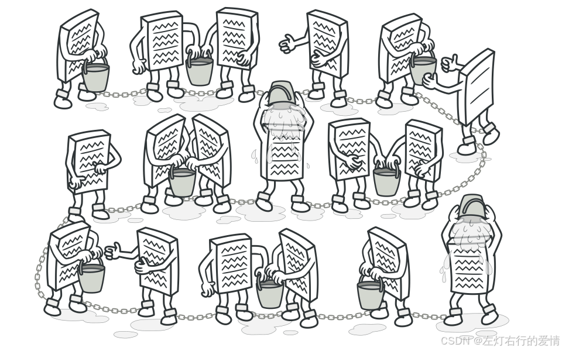
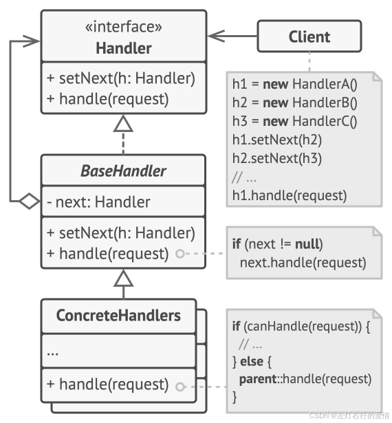
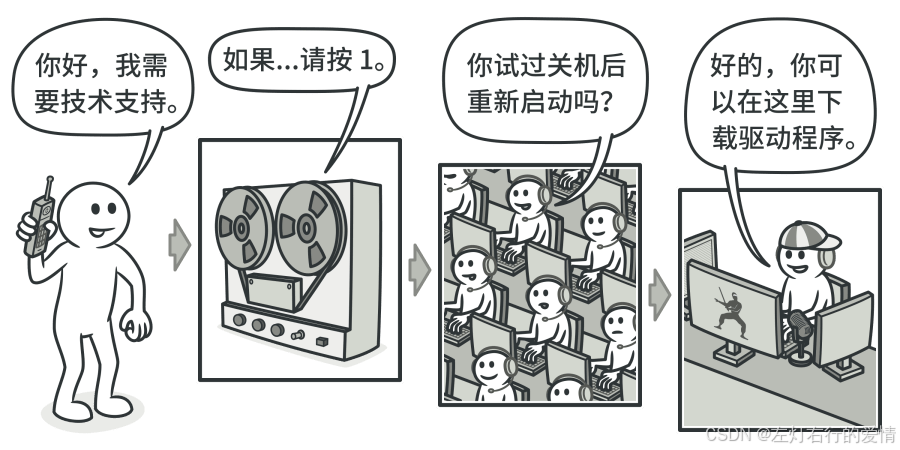

> 原文：[CSDN](https://blog.csdn.net/qq_45852626/article/details/150583196)（历史文章导入，当前状态为草稿）

## 责任链模式
## 前言

责任链是我觉得比较好理解,也是开发中比较能经常看到的设计模式,我个人认为它的核心思想: **把请求的发送者和接受者解耦,让多个对象都有机会处理这个请求.  
 将这些对象连成一条链,沿着这条链传递请求,直到有一个对象处理它为止.**  
 

## 什么是责任链模式

责任链模式（Chain of Responsibility Pattern）是一种行为设计模式，它允许将请求沿着一个处理链传递，直到链中的某个对象处理它。  
 这样，发送者无需知道哪个对象将处理请求，所有的处理对象都可以尝试处理请求或将请求传递给链上的下一个对象。

### 责任链模式结构–静态结构-例子一

  
 上图说明:

* **1. 处理者 （Handler）** 声明了所有具体处理者的通用接口。 该接口通常仅包含单个方法用于请求处理， 但有时其还会包含一个设置链上下个处理者的方法。
* **2. 基础处理者 （Base Handler）** 是一个可选的类， 你可以将所有处理者共用的样本代码放置在其中。  
   **通常情况下， 该类中定义了一个保存对于下个处理者引用的成员变量。** 客户端可通过将处理者传递给上个处理者的构造函数或设定方法来创建链。 该类还可以实现默认的处理行为： 确定下个处理者存在后再将请求传递给它。
* **3. 具体处理者 （Concrete Handlers）** 包含处理请求的实际代码。 每个处理者接收到请求后， 都必须决定是否进行处理， 以及是否沿着链传递请求。  
   处理者通常是独立且不可变的， 需要通过构造函数一次性地获得所有必要地数据。
* **4. 客户端 （Client）** 可根据程序逻辑一次性或者动态地生成链。 值得注意的是， 请求可发送给链上的任意一个处理者， 而非必须是第一个处理者。

### 责任链模式结构–静态结构-例子二

implements


extends


extends


extends


extends


uses


nextHandler


Client


- validationChain: CouponValidationHandler


+applyCoupon(order, coupon)


«interface»


CouponValidationHandler


+setNext(handler)


+validate(order, coupon)


AbstractCouponValidationHandler


\# nextHandler: CouponValidationHandler


+setNext(handler)


+next(order, coupon)


BasicValidationHandler


+validate(order, coupon)


UserEligibilityHandler


+validate(order, coupon)


OrderThresholdHandler


+validate(order, coupon)


OtherHandler


note "更多具体处理器"

**图解说明：**

* **Client (客户端)**：在我们的例子中就是 `CouponService`。它持有一个责任链的头节点`(validationChain)`，并且是请求的发起者。
* **CouponValidationHandler (处理器接口)**：定义了所有处理器必须遵守的契约，即 `setNext()` (设置下一个节点) 和 `validate()` (执行校验) 方法。
* **AbstractCouponValidationHandler (抽象基类)**：这是一个可选但推荐的实现。它实现了接口，并封装了公共的逻辑，比如 `nextHandler` 成员变量和向下传递请求的 `next()` 方法。这让具体的处理器实现更简单。
* **Concrete Handlers (具体处理器)**：例如 `BasicValidationHandler, UserEligibilityHandler` 等。它们继承自抽象基类，并实现了各自具体的校验逻辑。

**关系解释：**

* `Client 使用 (uses) CouponValidationHandler` 接口来工作，它不关心具体的实现类，实现了依赖倒置。
* 每个 `AbstractCouponValidationHandler` 内部都可能持有另一个 `CouponValidationHandler` 的引用 `(nextHandler)`，这就是“链”的形成方式。

### 责任链模式结构–动态执行过程-时序图

这个图生动地展示了当一个优惠券校验请求到来时，它如何在链条中一步步被传递和处理的。

CouponService


BasicValidationHandler


UserEligibilityHandler


OrderThresholdHandler


validate(order, coupon)


1


1. 基础校验

validate(order, coupon)


2


2. 用户资格校验

validate(order, coupon)


3


3. 订单金额校验

Result.success()


4

Result.fail("金额不足")


5


alt


[金额达到门槛]

[金额未达到门槛]

Result.fail("用户资格不符")


6


alt


[用户资格通过]

[用户资格不符]

Result.fail("优惠券无效")


7


alt


[基础校验通过]

[基础校验失败]


CouponService


BasicValidationHandler


UserEligibilityHandler


OrderThresholdHandler

## 真实世界类比

  
 最近， 你刚为自己的电脑购买并安装了一个新的硬件设备。你喜爱的 Linux 系统并不支持新硬件设备。 你无奈拨打技术支持电话。

1. 首先你会听到自动回复器的机器合成语音， 它提供了针对各种问题的九个常用解决方案， 但其中没有一个与你遇到的问题相关。
2. 过了一会儿， 机器人将你转接到人工接听人员处,这位接听人员同样无法提供任何具体的解决方案。 他不断地引用手册中冗长的内容， 并不会仔细聆听你的回应。 在第 10 次听到 “你是否关闭计算机后重新启动呢？” 这句话后， 你要求与一位真正的工程师通话。
3. 最后， 接听人员将你的电话转接给了工程师,工程师告诉了你新硬件设备驱动程序的下载网址， 以及如何在 Linux 系统上进行安装。 问题终于解决了！ 你挂断了电话， 满心欢喜。

## 责任链优化工作中代码场景

我这边不方便直接贴公司代码,就用我实习期间做的优惠券模块的业务去重写一个场景解释.

### 原代码问题

业务背景:  
 一个用户在结算时使用一张优惠券，系统需要做什么？  
 通常，后台逻辑会进行一系列的校验，如果你用普通的代码实现，很可能写出下面这样的“地狱代码” (if-else hell).

```
// 反面教材：冗长且难以维护的if-else结构
public Result applyCoupon(Order order, Coupon coupon) {
    // 1. 基础校验
    if (coupon == null) {
        return Result.fail("优惠券不存在");
    }
    if (coupon.isExpired()) {
        return Result.fail("优惠券已过期");
    }
    if (coupon.isUsed()) {
        return Result.fail("优惠券已被使用");
    }

    // 2. 用户资格校验
    if (coupon.isForNewUser() && !order.getUser().isNew()) {
        return Result.fail("该优惠券仅限新用户使用");
    }
    if (coupon.isForVip() && !order.getUser().isVip()) {
        return Result.fail("该优惠券仅限VIP会员使用");
    }

    // 3. 订单金额校验
    if (order.getTotalPrice() < coupon.getMinimumSpend()) {
        return Result.fail("订单金额未达到优惠券使用门槛");
    }

    // 4. 商品范围校验
    if (!isApplicableForProducts(order.getProducts(), coupon.getApplicableProducts())) {
        return Result.fail("优惠券不适用于订单中的商品");
    }

    // 5. 互斥性校验 (比如：此优惠券不能和秒杀活动同时使用)
    if (order.hasSeckillPromotion() && coupon.isMutuallyExclusive()) {
        return Result.fail("优惠券不能与秒杀活动同享");
    }

    // ... 未来可能还有更多、更复杂的校验 ...

    // 所有校验通过，计算优惠金额
    calculateDiscount(order, coupon);
    return Result.success("优惠券使用成功");
}


```

这段代码有什么问题？

* **违反单一职责原则**：一个方法承担了所有的校验逻辑，非常臃肿。
* **扩展性极差**：如果产品经理提出一个新的校验规则（例如，“仅限周五使用”），你就必须深入这个复杂的 if-else 结构，小心翼翼地增加新的分支，极易引入Bug。
* **复用性差**：如果其他地方也需要“商品范围校验”，你很难把这段逻辑优雅地抽离出来复用。
* **灵活性差**：如果需要动态地调整校验顺序（例如，先把计算密集的商品校验放到最后），修改起来会非常麻烦。  
   这就是责任链模式的用武之地。**我们可以将每一个校验逻辑点，都抽象成一个独立的处理器（Handler）。**

### 责任链模式重构优惠券校验流程

我们可以构建一个优惠券校验的“责任链”，让订单和优惠券信息在这个链条上流动。  
 核心组件设计：

* **处理上下文（Context）**：创建一个对象，用来封装在链条上传递的所有数据，例如 Order、Coupon 以及校验结果。
* **处理器接口（Handler Interface）**：定义所有处理器的共同行为。
* **具体的处理器实现（Concrete Handlers）**：每个实现类只负责一个具体的校验逻辑。

#### 第1步：定义处理器接口和抽象基类

```
/**
 * 优惠券校验处理器的接口
 */
public interface CouponValidationHandler {
    /**
     * 设置下一个处理器
     * @param nextHandler 下一个处理器
     */
    void setNext(CouponValidationHandler nextHandler);

    /**
     * 核心处理方法
     * @param order 订单信息
     * @param coupon 优惠券信息
     * @return 校验结果
     */
    Result validate(Order order, Coupon coupon);
}

/**
 * 抽象基类，封装公共的“传递”逻辑
 */
public abstract class AbstractCouponValidationHandler implements CouponValidationHandler {
    protected CouponValidationHandler nextHandler;

    @Override
    public void setNext(CouponValidationHandler nextHandler) {
        this.nextHandler = nextHandler;
    }

    // 模板方法：如果当前处理器不需要处理或处理后需要继续，则传递给下一个
    protected Result next(Order order, Coupon coupon) {
        if (this.nextHandler != null) {
            return this.nextHandler.validate(order, coupon);
        }
        // 如果没有下一个处理器了，说明所有校验都通过了
        return Result.success();
    }
}


```

#### 第2步：创建具体的处理器

每一个if分支，都可以变成一个独立的Handler类。

```
// 1. 基础有效性校验处理器
public class BasicValidationHandler extends AbstractCouponValidationHandler {
    @Override
    public Result validate(Order order, Coupon coupon) {
        if (coupon == null || coupon.isExpired() || coupon.isUsed()) {
            return Result.fail("优惠券无效、已过期或已被使用");
        }
        // 校验通过，传递给下一个处理器
        return next(order, coupon);
    }
}

// 2. 用户资格校验处理器
public class UserEligibilityHandler extends AbstractCouponValidationHandler {
    @Override
    public Result validate(Order order, Coupon coupon) {
        if (coupon.isForVip() && !order.getUser().isVip()) {
            return Result.fail("该优惠券仅限VIP会员使用");
        }
        // ... 其他用户相关的校验
        return next(order, coupon);
    }
}

// 3. 订单金额门槛处理器
public class OrderThresholdHandler extends AbstractCouponValidationHandler {
    @Override
    public Result validate(Order order, Coupon coupon) {
        if (order.getTotalPrice() < coupon.getMinimumSpend()) {
            return Result.fail("订单金额未达到使用门槛");
        }
        return next(order, coupon);
    }
}

// ... 还可以创建 ProductScopeHandler, MutualExclusivityHandler 等等


```

#### 第3步：构建和使用责任链

在你的`Service`层，你可以像搭积木一样，根据业务需要来“组装”这条校验链。

```
@Service
public class CouponService {

    private final CouponValidationHandler validationChain;

    // 使用构造函数注入或@PostConstruct来构建链条
    public CouponService() {
        // 1. 创建所有处理器实例
        CouponValidationHandler basicHandler = new BasicValidationHandler();
        CouponValidationHandler userHandler = new UserEligibilityHandler();
        CouponValidationHandler thresholdHandler = new OrderThresholdHandler();
        // ... 其他处理器

        // 2. 像链表一样将它们串联起来
        basicHandler.setNext(userHandler);
        userHandler.setNext(thresholdHandler);

        // 3. 将链条的头节点保存起来
        this.validationChain = basicHandler;
    }

    public Result applyCoupon(Order order, Coupon coupon) {
        // 客户端只需调用链条的第一个处理器即可
        Result validationResult = this.validationChain.validate(order, coupon);
        if (!validationResult.isSuccess()) {
            return validationResult;
        }

        // 所有校验通过，执行最终的优惠计算
        calculateDiscount(order, coupon);
        return Result.success("优惠券使用成功");
    }
}


```

### 责任链的好处

采用责任链模式重构后，代码在下面几个方面都会更好:

1. **高内聚，低耦合**：每个校验逻辑被封装在独立的类中，职责清晰。校验逻辑的变化不会影响到`CouponService`或其他处理器。
2. **极佳的扩展性**：假设要增加“仅限周五使用”的新规则？那么只需新建一个 `FridayOnlyHandler`，然后在构建链条时把它插入到合适的位置即可，无需修改任何现有代码。这完全符合开闭原则 `(Open-Closed Principle)`。
3. **灵活性**：可以根据不同类型的优惠券（如平台券、商家券）动态地构建不同的校验链，或者轻松地调整校验顺序。
4. **代码更清晰**：`CouponService`的核心逻辑变得非常简单，它只负责启动校验链和处理最终结果，具体的校验细节被委托给了链条。

## 责任链用在哪里呢?

**当你遇到一个请求需要经过一系列处理步骤，而这些步骤的处理逻辑、顺序可能会变化或扩展时，就应该立刻想到责任链模式。**  
 它特别适合各种形式的流程化处理和 **过滤器（Filter）** 场景。  
 开发中，除了电商优惠券校验，其他经典应用场景还包括：

1. Servlet的过滤器链 (Filter Chain)：每个Filter处理HTTP请求的一部分（如编码、认证、日志），然后传递给下一个Filter。
2. MyBatis的插件机制 (Interceptor)：通过责任链模式对SQL执行过程进行拦截和增强。
3. Spring Security的认证授权流程：也是通过一系列的过滤器链来完成的。

下面两篇文章分别解释了MyBatis的插件机制和Spring Security的认证授权流程,感兴趣可以进阶看一下.

**MyBatis的插件机制**: MyBatis的插件机制  
 **Spring Security的认证授权流程**:pring Security的认证授权流程
