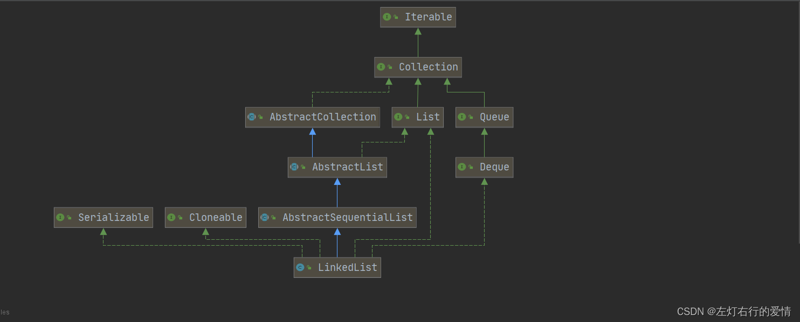
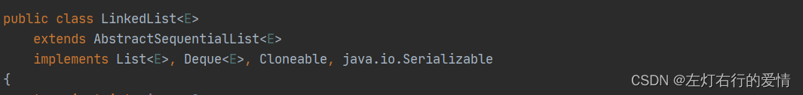
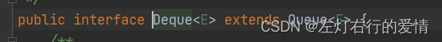

> 原文：[CSDN](https://blog.csdn.net/qq_45852626/article/details/125743610)（历史文章导入，当前状态为草稿）

### 前言

我们之前了解过了ArrayList,现在再来看LinkedList就已经很简单了，但值得一提的是，两者的数据结构不同导致了他们在使用场景注定是有区别的。

#### 简介

##### 简单说明

1. 底层实现了双向链表和双端队列特点（如果你还不了解链表，建议先去学习一下，或者参考我之前写的文章https://blog.csdn.net/qq\_45852626/article/details/122464194?spm=1001.2014.3001.5501），实现了栈和队列的操作方法，可以作为栈、队列使用
2. 它可以添加任意元素（元素可以重复），包括null
3. 它是线程不安全，没有实现同步（没有锁维护）

##### 底层结构

1. 维护了一个双向链表，所以不存在容量不足的问题，因此没有扩容的方法
2. 维护了两个属性first和last分别指向首节点和尾结点
3. 每个节点里面维护了prev，next，item三个属性  
    prev指向前一个，next指向后一个，item是元素。

### LinkedList结构

#### 结构图



#### 继承和实现的方法和接口

代码：  
 

1. AbstractSequentialList：继承AbstractList抽象类，使用实现的公共方法。  
    这个建议去看ArrayList那篇，已经解读过了，在这不多说了。
2. List：实现List接口操作规范，增删遍历等操作。
3. Cloneable：提供可拷贝功能.
4. Deque：继承自Queue，在Queue的增删查基础上，增加了双端操作对应的接口，外加push/pop的栈操作  
      
    定义线性Collection，它实际是双端队列的简称(double ended queue)，大多数Deque接口的实现不会限制元素数量，但是这里有限制，最大容量为Integer.MAX\_VALUE
5. Serializable 接口： 实现了该接口标示了类可以被序列化和反序列化。

### 源码分析

#### DOC解读

```
/**
 * Doubly-linked list implementation of the {@code List} and {@code Deque} interfaces.  
 * 双向链表实现了List和Deque接口
 * Implements all optional list operations, and permits all            
 * elements (including {@code null}).         实现了所有list操作，并且允许有null元素
 *
 * <p>All of the operations perform as could be expected for a doubly-linked
 * list.  
 * 所有的操作都和双向链表是一样的
 * Operations that index into the list will traverse the list from
 * the beginning or the end, whichever is closer to the specified index.
 *索引到列表的操作将会从列表开始或结束位置（以距离索引更新的位置为准）去遍历列表。
 * <p><strong>Note that this implementation is not synchronized.</strong>
 * 注意它并没有采用synchronized锁实现，
 * If multiple threads access a linked list concurrently, and at least
 * one of the threads modifies the list structurally, it <i>must</i> be
 * synchronized externally.  (A structural modification is any operation
 * that adds or deletes one or more elements; merely setting the value of
 * an element is not a structural modification.) 
 * 如果多线程并发的访问一个链表，并且至少有一个线程修改了链表的结构，
 * 那么它必需采用同步的方式，（结构修改是指添加或删除一个或多个元素的任何操作。仅仅改变元素的值不算结构的修改）。
 *  This is typically  accomplished by synchronizing on some object that naturally
 * encapsulates the list.
 * 这通常是通过自然封装列表对象进行同步实现	
 *
 * If no such object exists, the list should be "wrapped" using the
 * {@link Collections#synchronizedList Collections.synchronizedList}
 * method.  
 * 如果这样的对象不存在，list应该使用Collections.synchronizedList方法
 * This is best done at creation time, to prevent accidental
 * unsynchronized access to the list:<pre>
 *   List list = Collections.synchronizedList(new LinkedList(...));</pre>
 *最好是用在创建时，防止意外无锁进入到list中，例子： List list = Collections.synchronizedList(new LinkedList(...))
 
 * <p>The iterators returned by this class's {@code iterator} and
 * {@code listIterator} methods are <i>fail-fast</i>: if the list is
 * structurally modified at any time after the iterator is created, in
 * any way except through the Iterator's own {@code remove} or
 * {@code add} methods, the iterator will throw a {@link
 * ConcurrentModificationException}. 
当一个线程进行iterators操作时，如果有其他线程对ArrayList进行修改，会触发fail-fast机制，抛出ConcurrentModificationException异常，通常是ListIterator#remove() remove或ListIterator#add(Object) add这两种情况。

 * modification, the iterator fails quickly and cleanly, rather than
 * risking arbitrary, non-deterministic behavior at an undetermined
 * time in the future.
 * 因此。在这种并行修改情况下，线程会明确快速的触发失败fail-fast，而不是在未来不确定的时间里冒着武断、不确定性行为的风险。
 *
 * <p>Note that the fail-fast behavior of an iterator cannot be guaranteed
 * as it is, generally speaking, impossible to make any hard guarantees in the
 * presence of unsynchronized concurrent modification.  Fail-fast iterators
 * throw {@code ConcurrentModificationException} on a best-effort basis.
 * Therefore, it would be wrong to write a program that depended on this
 * exception for its correctness:   <i>the fail-fast behavior of iterators
 * should be used only to detect bugs.</i>
 * 但是在非同步的情况下，fail-fast并不确保每次都会触发，因此依赖此异常的代码都是错误的，这个异常仅仅只是为了发现代码bug而已。
 *
 * <p>This class is a member of the
 * <a href="{@docRoot}/../technotes/guides/collections/index.html">
 * Java Collections Framework</a>.
 *
 * @author  Josh Bloch
 * @see     List
 * @see     ArrayList
 * @since 1.2
 * @param <E> the type of elements held in this collection
 */


```

中文翻译如下：  
 双向链表实现了List和Deque接口，实现了所有list操作，**并且允许有null元素**，所有的操作都和双向链表是一样的，索引到列表的操作将会从列表开始或结束位置（以距离索引更新的位置为准）去遍历列表。  
 注意它并没有采用synchronized锁实现，如果多线程并发的访问一个链表，并且至少有一个线程修改了链表的结构，  
 那么它必需采用同步的方式，（结构修改是指添加或删除一个或多个元素的任何操作。仅仅改变元素的值不算结构的修改）。  
 那么它必需采用同步的方式，（结构修改是指添加或删除一个或多个元素的任何操作。仅仅改变元素的值不算结构的修改），这通常是通过自然封装列表对象进行同步实现。  
 如果这样的对象不存在，list应该使用Collections.synchronizedList方法，最好是用在创建时，防止意外无锁进入到list中，例子： `List list = Collections.synchronizedList(new LinkedList(...))`  
 当一个线程进行iterators操作时，如果有其他线程对ArrayList进行修改，会触发fail-fast机制，抛出ConcurrentModificationException异常，通常是ListIterator#remove() remove或ListIterator#add(Object) add这两种情况，因此。在这种并行修改情况下，线程会明确快速的触发失败fail-fast，而不是在未来不确定的时间里冒着武断、不确定性行为的风险。但是在非同步的情况下，fail-fast并不确保每次都会触发，因此依赖此异常的代码都是错误的，这个异常仅仅只是为了发现代码bug而已。

#### 成员变量

```
  transient int size = 0;    //表示链表长度

    /**
     * Pointer to first node. 指向第一个节点
     * Invariant: (first == null && last == null) ||
     *            (first.prev == null && first.item != null)
     */
    transient Node<E> first;

    /**
     * Pointer to last node. 指向最后一个节点
     * Invariant: (first == null && last == null) ||
     *            (last.next == null && last.item != null)
     */
    transient Node<E> last;


注意这三个变量都是transient修饰符修饰，在序列化的时候它们会被忽略


```

上面的Node是链表中的元素，它的代码如下：

```
   private static class Node<E> {
        E item;   
        Node<E> next;
        Node<E> prev;
两个指针，next指向后一个，prev指向前一个元素
        Node(Node<E> prev, E element, Node<E> next) {  //支持泛型
            this.item = element;    
            this.next = next;
            this.prev = prev;
        }
    }


```

#### 构造方法

它的构造方法有两种，第一种是无参构造，第二种有参并且参数是集合。  
 第一种无参构造，代码如下：

```
  /**
     * Constructs an empty list.  //无参构造
     */
    public LinkedList() {
    }


```

第二种有参，参数是集合，代码如下：

```
  /**
     * Constructs a list containing the elements of the specified
     * collection, in the order they are returned by the collection's
     * iterator.
     * 构建一个list通过指定的集合，按顺序通过集合构造器返回
     *
     * @param  c the collection whose elements are to be placed into this list
     * @throws NullPointerException if the specified collection is null
     */
    public LinkedList(Collection<? extends E> c) {
        this();
        addAll(c);
    }


```

#### 常用方法分析

##### boolean add(E e)方法：

```
  /**
     * Appends the specified element to the end of this list.
     * 添加指定元素到list结尾
     *
     * <p>This method is equivalent to {@link #addLast}.
     *
     * @param e element to be appended to this list
     * @return {@code true} (as specified by {@link Collection#add})
     */
    public boolean add(E e) {
        linkLast(e);
        return true;
    }        
 可以看到add方法体力还有一个方法，下面分析这个方法
     /**
     * Links e as last element.
     */
    void linkLast(E e) {
        final Node<E> l = last;      //记录尾结点为I
        final Node<E> newNode = new Node<>(l, e, null); //构建要添加的节点
        last = newNode;       //将要添加的节点赋给last
        if (l == null)     //判断list是否为空
            first = newNode;
        else
            l.next = newNode;
        size++;   //增加链表长度
        modCount++;//增加集合修改次数，这是实现fail-fast机制的基础
    }


```

##### void add(int index, E element)方法：

```
  /**
     * Inserts the specified element at the specified position in this list.
     * 在指定的位置插入指定的元素
     * Shifts the element currently at that position (if any) and any
     * subsequent elements to the right (adds one to their indices).
     *当前位置的元素（如有）和任何后面的元素向右移动（将索引+1）
     * @param index index at which the specified element is to be inserted
     * @param element element to be inserted
     * @throws IndexOutOfBoundsException {@inheritDoc}
     */
    public void add(int index, E element) {
        checkPositionIndex(index);  //索引是否合法

        if (index == size)   //如果当前索引=链表大小，直接尾插法即可
            linkLast(element);
        else       否则
            linkBefore(element, node(index));
    }
我们先来看 checkPositionIndex(index)这个方法：
   private void checkPositionIndex(int index) {
        if (!isPositionIndex(index))
            throw new IndexOutOfBoundsException(outOfBoundsMsg(index));
    }
进一步查看isPositionIndex：
 /**
     * Tells if the argument is the index of a valid position for an
     * iterator or an add operation.
     */
    private boolean isPositionIndex(int index) {
        return index >= 0 && index <= size;
    }
它的作用是检查索引是否符合规范。

尾插法我们看过了，这里去看linkBefore(element, node(index))方法;

  /**
     * Inserts element e before non-null Node succ.     在非空节点succ前插入元素e
     */
    void linkBefore(E e, Node<E> succ) {
        // assert succ != null;     断言 succ!=null
        final Node<E> pred = succ.prev;     //存储succ的前一个节点
        final Node<E> newNode = new Node<>(pred, e, succ); //构建要添加的节点,第一个参数为前指针，第二个为元素，第三个是后指针
        
        succ.prev = newNode; //   将要添加的元素移到指定元素之前（链表元素的移动本质是指针的指向，这里指定元素的前指针指向了newNode，就相当于newNode移动到指定元素前面）
        if (pred == null)   如果位于第一个元素，直接把newNode赋值给链表队首
            first = newNode;
        else
            pred.next = newNode;     //将前节点的后指针指向新加节点。
        size++;
        modCount++;
    }
    这里是不是对succ有点陌生，其实我们要注意linkBefore(element, node(index))中的node(index）：
      /**
     * Returns the (non-null) Node at the specified element index. 返回指定索引的非空节点
     */
    Node<E> node(int index) {
        // assert isElementIndex(index);

        if (index < (size >> 1)) {        //如果索引小于size的一半 ，>>是位运算
            Node<E> x = first;
            for (int i = 0; i < index; i++)   //这是是从头查找
                x = x.next;
            return x;
        } else {                   //如果索引大于等于size一半
            Node<E> x = last;
            for (int i = size - 1; i > index; i--)      从尾部开始找
                x = x.prev;
            return x;
        }
    }


```

##### E get(int index)方法：

```
   /**
     * Returns the element at the specified position in this list.返回列表中指定位置的元素
     *
     * @param index index of the element to return
     * @return the element at the specified position in this list
     * @throws IndexOutOfBoundsException {@inheritDoc}
     */
    public E get(int index) {
        checkElementIndex(index);
        return node(index).item;
    }
 再看里面的 checkElementIndex(index)：
    private void checkElementIndex(int index) {
        if (!isElementIndex(index))   //做一个索引验证
            throw new IndexOutOfBoundsException(outOfBoundsMsg(index));
    }
    里面的 isElementIndex(index）：
      /**
     * Tells if the argument is the index of an existing element.
     */
    private boolean isElementIndex(int index) {
        return index >= 0 && index < size;
    }


return 方法里的node：
  /**
     * Returns the (non-null) Node at the specified element index.
     */
    Node<E> node(int index) {
        // assert isElementIndex(index);

        if (index < (size >> 1)) {
            Node<E> x = first;
            for (int i = 0; i < index; i++)
                x = x.next;
            return x;
        } else {
            Node<E> x = last;
            for (int i = size - 1; i > index; i--)
                x = x.prev;
            return x;
        }
    }
   


```

##### remove(int index)方法：

```
  /**
     * Removes the element at the specified position in this list.  Shifts any
     * subsequent elements to the left (subtracts one from their indices).
     * Returns the element that was removed from the list.
     *
     * @param index the index of the element to be removed
     * @return the element previously at the specified position
     * @throws IndexOutOfBoundsException {@inheritDoc}
     */
    public E remove(int index) {
        checkElementIndex(index);
        return unlink(node(index));
    }

我们关注重点unlink(node(index)中的unlink，其他的方法上面提过很多次了
   /**
     * Unlinks non-null node x.
     */
    E unlink(Node<E> x) {
        // assert x != null;
        final E element = x.item;
        final Node<E> next = x.next;
        final Node<E> prev = x.prev;

        if (prev == null) {     //如果元素位于队首，直接将下一个节点设为队首
            first = next;
        } else {               
            prev.next = next;   
            x.prev = null;
        }

        if (next == null) {      //如果后面没有元素,将队尾设置为x的后节点
            last = prev;
        } else {                                  
            next.prev = prev;
            x.next = null;
        }

        x.item = null;          
        size--;
        modCount++;
        return element;
    }

这个方法的本质就是元素的前后节点指针修改，再将移除的元素内部的指针也修改为null以便GC回收。
最后size--，modCount++；


```

### 结尾

其他方法不作为核心去了解了，有兴趣了或需要了多学学链表，这些方法一看就明白了，LinkedList基本上不怎么用。。。性能比较低。
