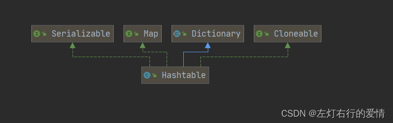
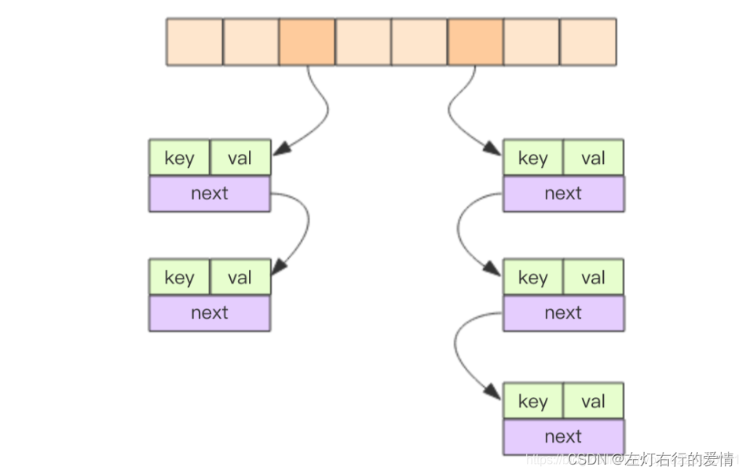

> 原文：[CSDN](https://blog.csdn.net/qq_45852626/article/details/125968262)（历史文章导入，当前状态为草稿）

#### 简单介绍

##### HashTable特点

1：键和值都不允许为null  
2：使用方法和HashMap基本一样  
3：hashTable是线程安全的，hashMap是线程不安全的

##### 继承结构关系

  
代码实现如下：

```
public class Hashtable<K,V>
    extends Dictionary<K,V>
    implements Map<K,V>, Cloneable, java.io.Serializable


```

DIctionary： 表示键值存储库，操作与Map相似，但是已经过时了，在
java 
的后续发展中，逐渐被Map取代了。

##### Doc解读

```
/**
 * This class implements a hash table, which maps keys to values. 
 * 这个类实现了Hash 表，它将key映射到值上
   Any non-<code>null</code> object can be used as a key or as a value. 
 *任何非空的对象都可以作为key或者value使用（换言之不允许有null出现）
 * To successfully store and retrieve objects from a hashtable, the
 * objects used as keys must implement the <code>hashCode</code>
 * method and the <code>equals</code> method. <p>
 *为了成功地从hash表中存储和检索对象，作为key的对象必需实现hashcode和equals方法。
 * An instance of <code>Hashtable</code> has two parameters that affect its
 * performance: <i>initial capacity</i> and <i>load factor</i>. 
 * 一个Hashtable的实力要有两个参数：初始容量和负载因子
 *  The <i>capacity</i> is the number of <i>buckets</i> in the hash table, and the
 * <i>initial capacity</i> is simply the capacity at the time the hash table
 * is created.  
 * 容量Capacity是hash表中桶的数量，初始容量则是在创建hash表的时候同时创建的
 * Note that the hash table is <i>open</i>: in the case of a "hash
 * collision", a single bucket stores multiple entries, which must be searched
 * sequentially.  
 * 需要注意的是，hash表是开放状态的，在hash冲突情况下，一个桶存储了多个条目，那么必需按顺序对这些条目进行搜索
 * 
 * The <i>load factor</i> is a measure of how full the hash table is allowed to get before its capacity is automatically increased.
 * 负载因子是一个度量hash表在其容量自动增加之前可以达到完整程度。
 * 
 * The initial capacity and load factor parameters are merely hints to
 * the implementation.  
 * 初始容量和负载因子只是对实现的提示
 * The exact details as to when and whether the rehash
 * method is invoked are implementation-dependent.<p>
 *对于何时以及是否调用rehash扩容方法的确切细节取决于实现。
 * Generally, the default load factor (.75) offers a good tradeoff between
 * time and space costs. 
 * 通常情况下，负载因子默认为0.75，这是在时间和空间成本上的一个平衡。
 *  Higher values decrease the space overhead but
 * increase the time cost to look up an entry (which is reflected in most
 * <tt>Hashtable</tt> operations, including <tt>get</tt> and <tt>put</tt>).<p>
 *如果这个值太高虽然会降低空间的开销，但是检索的时候会增加时间成本，
 这在大多数哈希表的操作中，表现在get和put方法上。
 * The initial capacity controls a tradeoff between wasted space and the
 * need for <code>rehash</code> operations, which are time-consuming.
 * 初始容量是空间浪费和rehash操作的折衷，因为rehash非常耗时
 * No <code>rehash</code> operations will <i>ever</i> occur if the initial
 * capacity is greater than the maximum number of entries the <tt>Hashtable</tt> will contain divided    by its load factor.
 * 如果初始容量>hashtable将包含的最大条目和负载因子之商，那么不会发生任何rehash操作
 *   However,setting the initial capacity too high can waste space.<p>
 *然而，这会造成空间浪费
 * If many entries are to be made into a <code>Hashtable</code>,
 * creating it with a sufficiently large capacity may allow the
 * entries to be inserted more efficiently than letting it perform
 * automatic rehashing as needed to grow the table. <p>
如果许多条目被创建到hashtable中，创建一个足够大的容量允许这些条目插入，比让这些条目插入之后触发rehash操作更有效率。
 * This example creates a hashtable of numbers. It uses the names of
 * the numbers as keys:
 * 如下这个例子创建了一个数字的hash表，它使用名称做为数字的key。
 * <pre>   {@code
 *   Hashtable<String, Integer> numbers
 *     = new Hashtable<String, Integer>();
 *   numbers.put("one", 1);
 *   numbers.put("two", 2);
 *   numbers.put("three", 3);}</pre>
 *
 * <p>To retrieve a number, use the following code:  为了检索一个号码，用如下代码
 * <pre>   {@code
 *   Integer n = numbers.get("two");
 *   if (n != null) {
 *     System.out.println("two = " + n);
 *   }}</pre>
 *
 * <p>The iterators returned by the <tt>iterator</tt> method of the collections
 * returned by all of this class's "collection view methods" are
 * <em>fail-fast</em>:
 * 由此类所有"集合视图方法" 返回的集合的iterator方法返回的迭代器是fail-fast：
 *  if the Hashtable is structurally modified at any time
 * after the iterator is created, in any way except through the iterator's own
 * <tt>remove</tt> method, the iterator will throw a {@link
 * ConcurrentModificationException}.  
 * 如果在创建迭代器之后的任何时候对Hashtable进行结构修改，除非通过迭代器自己的remove方法，迭代器将抛出ConcurrentModificationException 。
 * 
 * Thus, in the face of concurrent
 * modification, the iterator fails quickly and cleanly, rather than risking
 * arbitrary, non-deterministic behavior at an undetermined time in the future.
因此，在并发修改的情况下，迭代器快速而干净地失败，而不是在未来的未确定时间冒任意，非确定性行为的风险。
 * The Enumerations returned by Hashtable's keys and elements methods are
 * <em>not</em> fail-fast.
 *  Hashtable的keys和elements方法返回的枚举不是快速失败的
 *
 * <p>Note that the fail-fast behavior of an iterator cannot be guaranteed
 * as it is, generally speaking, impossible to make any hard guarantees in the
 * presence of unsynchronized concurrent modification. 
 * 请注意，迭代器的快速失败行为无法得到保证，因为一般来说，在存在不同步的并发修改时，不可能做出任何硬性保证。
 *  Fail-fast iterators
 * throw <tt>ConcurrentModificationException</tt> on a best-effort basis.
 * 失败快速迭代器以尽力而为的方式抛出ConcurrentModificationException 
 * Therefore, it would be wrong to write a program that depended on this
 * exception for its correctness: <i>the fail-fast behavior of iterators
 * should be used only to detect bugs.</i>
 * 因此，编写依赖于此异常的程序以确保其正确性是错误的： 迭代器的快速失败行为应该仅用于检测错误。


```

##### 核心内部 类 Entry

Hashtable与Hashmap相似，Hashtable内部也是采用内部类来实现这些复杂的结构，主要是对键值对的封装  
先看这个类的成员变量：

```
       final int hash;  //值的hashCode
        final K key;
        V value;
        Entry<K,V> next;    //表示下一个节点


```

再来看构造函数：

```
    protected Entry(int hash, K key, V value, Entry<K,V> next) {
            this.hash = hash;
            this.key =  key;
            this.value = value;
            this.next = next;
        }


```

比较核心的方法：

```
      public boolean equals(Object o) {
            if (!(o instanceof Map.Entry))    //先判断传入对象的类型
                return false;
            Map.Entry<?,?> e = (Map.Entry<?,?>)o;

            return (key==null ? e.getKey()==null : key.equals(e.getKey())) &&
               (value==null ? e.getValue()==null : value.equals(e.getValue()));
        }

        public int hashCode() {
            return hash ^ Objects.hashCode(value);    //将hash和value的hashCode进行异或运算
            在HashMap中是key和value的hashCode进行异或运算，注意区分
            代码的结果实际上没有区别，但是hashMap中的hash属性已经被修改了，需要用高位部分混淆
            hashMap和HashTable中元素hash属性的计算是有区别的。


```

Entry全部代码：

```
private static class Entry<K,V> implements Map.Entry<K,V> {
        final int hash;
        final K key;
        V value;
        Entry<K,V> next;

        protected Entry(int hash, K key, V value, Entry<K,V> next) {
            this.hash = hash;
            this.key =  key;
            this.value = value;
            this.next = next;
        }

        @SuppressWarnings("unchecked")
        protected Object clone() {
            return new Entry<>(hash, key, value,
                                  (next==null ? null : (Entry<K,V>) next.clone()));
        }

        // Map.Entry Ops

        public K getKey() {
            return key;
        }

        public V getValue() {
            return value;
        }

        public V setValue(V value) {
            if (value == null)
                throw new NullPointerException();

            V oldValue = this.value;
            this.value = value;
            return oldValue;
        }

        public boolean equals(Object o) {
            if (!(o instanceof Map.Entry))
                return false;
            Map.Entry<?,?> e = (Map.Entry<?,?>)o;

            return (key==null ? e.getKey()==null : key.equals(e.getKey())) &&
               (value==null ? e.getValue()==null : value.equals(e.getValue()));
        }

        public int hashCode() {
            return hash ^ Objects.hashCode(value);
        }

        public String toString() {
            return key.toString()+"="+value.toString();
        }
    }


```

##### 成员变量

```
  /**
     * The hash table data.
     */
    private transient Entry<?,?>[] table;

    /**
     * The total number of entries in the hash table.
     */
    private transient int count;    //当前Hashtable的实际大小

    /**
     * The table is rehashed when its size exceeds this threshold.  (The
     * value of this field is (int)(capacity * loadFactor).)
     *
     * @serial
     */
    private int threshold;   //扩容阈值 = capacity * loadFactor

    /**
     * The load factor for the hashtable.
     *
     * @serial
     */
    private float loadFactor;       //负载因子，默认0.75


```

HashMap以及HashTable相关存储元素的数组等属性都是transient修饰，在序列化的时候不会被序列化，而是类自己实现了序列化和反序列化的方法。  
不同的虚拟机或者不同操作系统上，hashcode的算法可能会造成相同的值经过hash之后其hashcode不一致。这样就容易造成实际上反序列化之后的HashTable与之前的HashTable不同。

##### 静态变量

```
/**
     * The number of times this Hashtable has been structurally modified
     * Structural modifications are those that change the number of entries in
     * the Hashtable or otherwise modify its internal structure (e.g.,
     * rehash).  This field is used to make iterators on Collection-views of
     * the Hashtable fail-fast.  (See ConcurrentModificationException).
     */
    private transient int modCount = 0;  

    /** use serialVersionUID from JDK 1.0.2 for interoperability */
    private static final long serialVersionUID = 1421746759512286392L;

private static final int MAX_ARRAY_SIZE = Integer.MAX_VALUE - 8;


```

这里对为啥MAX\_ARRAY\_SIZE不是Integer.MAX\_VALUE进行了解释。再某些
jvm 
中，数组是需要一些头信息的，因此如果直接将int数组分配为Integer.MAX\_VALUE，则会造成OOM。所以这里的长度是Integer.MAX\_VALUE - 8;

##### HashTable的 数据结构

  
我们学过了HashMap，现在来看HashTable就很简单了，内部构成是通过拉链法实现单向链表。

##### HashTable的构造函数

构造函数有四种：  
1：无参构造

```
  /**
     * Constructs a new, empty hashtable with a default initial capacity (11)
     * and load factor (0.75).
     */
    public Hashtable() {
        this(11, 0.75f);
    }


```

2：有参（参数为初始容量,负载因子默认为0.75）

```
  public Hashtable(int initialCapacity) {
        this(initialCapacity, 0.75f);
    }


```

3：有参（参数是初始容量和负载因子）

```
  public Hashtable(int initialCapacity, float loadFactor) {
        if (initialCapacity < 0)        
            throw new IllegalArgumentException("Illegal Capacity: "+
                                               initialCapacity);
        if (loadFactor <= 0 || Float.isNaN(loadFactor))
            throw new IllegalArgumentException("Illegal Load: "+loadFactor);

        if (initialCapacity==0)
            initialCapacity = 1;
        this.loadFactor = loadFactor;
        table = new Entry<?,?>[initialCapacity];
        threshold = (int)Math.min(initialCapacity * loadFactor, MAX_ARRAY_SIZE + 1);
    }


```

第四种：有参（参数是集合） 根据原有map产生一个新map构造方法

```
 public Hashtable(Map<? extends K, ? extends V> t) {
        this(Math.max(2*t.size(), 11), 0.75f);
        putAll(t);//putAll方法是一个同步方法，内部通过遍历，之后对put方法进行调用
    }


```

##### 扩容原理

我们以put方法为引子，注意hashtable支持同步：

```
public synchronized V put(K key, V value) {
        // Make sure the value is not null
        if (value == null) {     //判断值是否为null
            throw new NullPointerException();
        }

        // Makes sure the key is not already in the hashtable.
        Entry<?,?> tab[] = table;
        int hash = key.hashCode();
        //计算索引 
        int index = (hash & 0x7FFFFFFF) % tab.length;
       // 0x7FFFFFFF是Integer.Max_VALUE的值，这一步为了防止索引值超出整形范围，然后根据数组长度求余可以将索引控制在数组范围内
        @SuppressWarnings("unchecked")
        Entry<K,V> entry = (Entry<K,V>)tab[index];
        //下面的for循环是用来搜索HashTable是否包含当前要添加的对象，如果包含则直接更新value的值
        for(; entry != null ; entry = entry.next) {
            if ((entry.hash == hash) && entry.key.equals(key)) {
                V old = entry.value;
                entry.value = value;
                return old;
            }
        }
       
        addEntry(hash, key, value, index);//把要添加的对象添加到HashTable
        return null;
    }


```

下面进入addEntry方法：

```
   private void addEntry(int hash, K key, V value, int index) {
        modCount++;    //目的是让fail-fast可以监控到

        Entry<?,?> tab[] = table;
        if (count >= threshold) {            count元素的数量，如果超过阈值则扩容
            // Rehash the table if the threshold is exceeded
            rehash();                
 //扩容方法，该操作会重新创建一个更大的数组，并重新分配所有的数据
            tab = table;            
            hash = key.hashCode();
            //重新计算索引
            index = (hash & 0x7FFFFFFF) % tab.length;
        }

        // Creates the new entry.
        @SuppressWarnings("unchecked")
        Entry<K,V> e = (Entry<K,V>) tab[index];
        //在索引处创建元素，将这个元素添加到链表的末尾
        tab[index] = new Entry<>(hash, key, value, e);
        count++;     
    }


```

我们最后去看扩容方法resize：

```
  protected void rehash() {
        int oldCapacity = table.length;//原始的table容量
        Entry<?,?>[] oldMap = table;     //原始的table

        // overflow-conscious code
        int newCapacity = (oldCapacity << 1) + 1;   //扩容长度是原来两倍+1
        if (newCapacity - MAX_ARRAY_SIZE > 0) {     //如果新容量大于最大值
            if (oldCapacity == MAX_ARRAY_SIZE)   //如果旧容量大于最大值
                // Keep running with MAX_ARRAY_SIZE buckets
                return;
            newCapacity = MAX_ARRAY_SIZE;   反之将新容量设置到最大值
        }
        Entry<?,?>[] newMap = new Entry<?,?>[newCapacity];//创建新的数组

        modCount++;
        threshold = (int)Math.min(newCapacity * loadFactor, MAX_ARRAY_SIZE + 1);//重新计算阈值
        table = newMap;

        for (int i = oldCapacity ; i-- > 0 ;) {
            for (Entry<K,V> old = (Entry<K,V>)oldMap[i] ; old != null ; ) {
                Entry<K,V> e = old;
                old = old.next;
               //注意这个计算槽位的方法
                int index = (e.hash & 0x7FFFFFFF) % newCapacity;
                e.next = (Entry<K,V>)newMap[index];
                newMap[index] = e;
            }
        }
    }


```

1:因为采用的是&运算，这样一来任何大于0x7FFFFFFF都将只保留0x7FFFFFFF覆盖的低位部分。高位部分会舍去。  
2:由于Hashtable的长度不一定满足2的幂，因此其计算槽位不能用位运算。  
3:这里直接用%。显然其效率要低于Hashmap中的位运算操作。  
4:由于在Hashtable中，rehash并没提供给外部访问，而调用rehash的位置只有addEntry方法。因此这个方法没有加同步关键字。  
5:另外HashTable并没提供缩容机制，也不存在HashMap中红黑树和链表互相转换的问题。因此其逻辑要简单得多。

##### 结束语

1：HashMap是不支持同步的，不能用于并发场景。而Hashtable的对外的方法都是synchronized的，这样HashTable就能在同步的情况下使用。  
2：如果不需要考虑线程安全问题可以使用 HashMap 作为替代，如果需要线程安全的高并发可以使用 ConcurrentHashMap，一般不需要使用 HashTable，所以这个类了解就好= = 。
