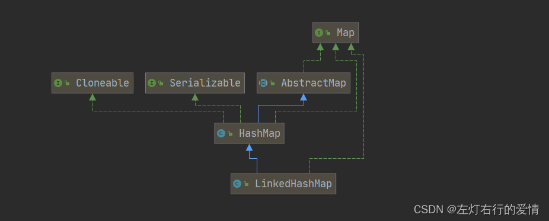
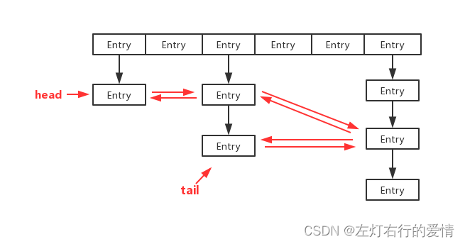
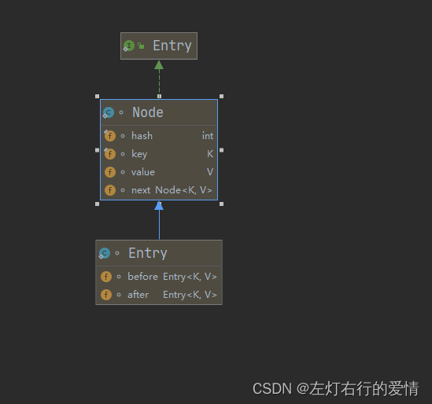

> 原文：[CSDN](https://blog.csdn.net/qq_45852626/article/details/125979672)（历史文章导入，当前状态为草稿）

#### 前言

在我们刚学习LInkedList的时候我们知道，LinkedList实际上性能不会比ArrayList高很多，因为LinkedList只有在前向插入的时候性能才会比ArrayList高。  
LinkedList虽然在remove和insert操作不需要拷贝数据，但是寻址需要时间（从链表中找到需要操作的节点），只能挨个遍历。  
那么有没有一种数据结构，能够把查询链表某一个元素所需要的时间复杂度O(n)变为O(1)呢？  
LInkedHashMap就是这样的一种数据结构，综合了HashMap和链表的有点，虽然数据结构相对来说比较复杂，但是在某些场景下，性能要更好一些。

##### 继承结构关系

  
代码实现：

```
public class LinkedHashMap<K,V>
    extends HashMap<K,V>
    implements Map<K,V>


```

这个我觉得不必多说了。

##### Doc解析

```
/**
 * <p>Hash table and linked list implementation of the <tt>Map</tt> interface,
 * with predictable iteration order.  
 * Map接口的hash表和链表实现，具有可预测的迭代顺序
 * 
 * This implementation differs from <tt>HashMap</tt> in that it maintains a doubly-linked list running through all of its entries. 
 * 此实现与hashMap不同之处在于它维护了一个贯穿其所有entry的双向列表
 *  This linked list defines the iteration ordering,which is normally the order in which keys were inserted into the map (<i>insertion-order</i>). 
 * 这个链表定义了迭代排序，通常是通过键插入映射的顺序（插入顺序）
 *  Note that insertion order is not affected if a key is <i>re-inserted</i> into the map.  注意，如果将键重新插入，不会影响插入顺序
 * (A key <tt>k</tt> is reinserted into a map <tt>m</tt> if <tt>m.put(k, v)</tt> is invoked when <tt>m.containsKey(k)</tt> would return <tt>true</tt> immediately prior tothe invocation.)
 *一个键k重新插入map集合m，其迭代顺序不会改变，
 * <p>This implementation spares its clients from the unspecified, generally
 * chaotic ordering provided by {@link HashMap} (and {@link Hashtable}),
 * without incurring the increased cost associated with {@link TreeMap}.  
 * 这个实现避免了用户使用hashMap和hashtable提供的未指定的，混乱的排序，同时又不会像TreeMap那样为了达到有序而带来额外的开销。
 * It can be used to produce a copy of a map that has the same order as the
 * original, regardless of the original map's implementation:
 * 它可以生成一些具有原始顺序的副本，在实现过程中完全不考虑原始的实现
 * <pre>
 *     void foo(Map m) {
 *         Map copy = new LinkedHashMap(m);
 *         ...
 *     }
 * </pre>
 * This technique is particularly useful if a module takes a map on input,
 * copies it, and later returns results whose order is determined by that of
 * the copy.  (Clients generally appreciate having things returned in the same
 * order they were presented.)
 *如果一个模块输入的时候获取一个map，然后返回结果，其顺序由复制时的顺序而决定，这种技术非常有用
 （客户通常喜欢按提交的顺序返回物品）
 
 * <p>A special {@link #LinkedHashMap(int,float,boolean) constructor} is
 * provided to create a linked hash map whose order of iteration is the order
 * in which its entries were last accessed, from least-recently accessed to
 * most-recently (<i>access-order</i>).  
 * 特殊的构造函数LinkedHashMap(int,float,boolean) 提供创建迭代顺序为上次访问顺序的链表hash结构，
 * This kind of map is well-suited to building LRU caches. 
 * 这种map能很好的构建LRU缓存
 *  Invoking the {@code put}, {@code putIfAbsent}, {@code get}, {@code getOrDefault}, {@code compute}, {@code computeIfAbsent}, {@code computeIfPresent}, or {@code merge} methods results in an access to the corresponding entry (assuming it exists after the invocation completes). 
 * 调用put、  get、getOrDefault、compute、computeIfPresent、merge等方法将导致对应条目的访问（假设它在调用完成后存在）。
The {@code replace} methods only result in an access of the entry if the value is replaced. 
仅仅在值会替换的时候，replace才会访问条目

 The {@code putAll} method generates one entry access for each mapping in the specified map, in the order that  key-value mappings are provided by the specified map's entry set iterator.
 putAll方法为指定映射中的每个映射生成一个条目访问，顺序是指映射的条目和迭代器提供的键值映射
 <i>No other methods generate entry accesses.</i>  
  * 没有其他的访问生成入口要访问。
 In particular, operations on collection-views do <i>not</i> affect the order of iteration of the backing map.
 通常情况下，对集合视图操作不会影响备份映射的迭代顺序

 * <p>The {@link #removeEldestEntry(Map.Entry)} method may be overridden to impose a policy for removing stale mappings automatically when new mappings are added to the map.
 * removeEldestEntry(Map.Entry)方法可能会被重写，以便向Map中添加新的映射时强制执行一个策略，以便自动删除过时的映射。
 *
 * <p>This class provides all of the optional <tt>Map</tt> operations, and
 * permits null elements.  
 * 此类提供所有可选的map操作，并允许null元素。

 * Like <tt>HashMap</tt>, it provides constant-time performance for the basic operations (<tt>add</tt>, <tt>contains</tt> and <tt>remove</tt>), assuming the hash function disperses elements* properly among the buckets.  
 * 像HashMap，它提供了操作有恒定常数级时间的表现（add，contains，remove），假设hash有足够的离散，元素都分布在各个桶中
 * Performance is likely to be just slightly below that of <tt>HashMap</tt>, due to the added expense of maintaining the linked list, with one exception: 
 * 性能只比HashMap略低，比链表时间略高。但有一个情况例外：
 * Iteration over the collection-views of a <tt>LinkedHashMap</tt> requires time proportional to the <i>size</i>of the map, regardless of its capacity.  
 * 对于LinkedHashMap的集合视图进行迭代所需的时间与映射大小成正比，无论容量如何。
 * Iteration over a <tt>HashMap</tt> is likely to be more expensive, requiring time proportional to its <i>capacity</i>.
 *在HashMap上迭代的性能可能比较低，需要的时间与其桶的数量有关。
 * <p>A linked hash map has two parameters that affect its performance:
 * <i>initial capacity</i> and <i>load factor</i>.  
 * LInkedHashMap有两个参数会影响性能：初始容量和负载因子
 * They are defined precisely as for <tt>HashMap</tt>. 
 * 他们在HashMap中有精确的定义。
 *  Note, however, that the penalty for choosing an excessively high value for initial capacity is less severe for this class than for <tt>HashMap</tt>, as iteration times for this class are unaffected  by capacity.
 * 但是注意，对于LinkedHashMap来说，一旦初始容量选择过高带来的弊端比HashMap要轻，因为LinkedHashMap的迭代次数不受容量的影响。
 *
 * <p><strong>Note that this implementation is not synchronized.</strong>
 * LinkedHashMap是不同步的
 * If multiple threads access a linked hash map concurrently, and at least
 * one of the threads modifies the map structurally, it <em>must</em> be
 * synchronized externally.  
 * 如果多个线程需要同时访问，并且至少有一个线程在结构上对其进行了修改，则它必须在外部同步。
 * This is typically accomplished by synchronizing on some object that naturally encapsulates the map.
 *这通常是在一些自然封装的映射的对象上来同步实现的。
 * If no such object exists, the map should be "wrapped" using the
 * {@link Collections#synchronizedMap Collections.synchronizedMap}
 * method.  This is best done at creation time, to prevent accidental
 * unsynchronized access to the map:<pre>
 * 
 *   Map m = Collections.synchronizedMap(new LinkedHashMap(...));</pre>
 *如果没有这样的对象，那么应该用Collections.synchronizedMap将这个对象包裹。最好在对象创建的时候就完成，以免造成非同步的访问。Map m = Collections.synchronizedMap(new LinkedHashMap(...));
 
 * A structural modification is any operation that adds or deletes one or more
 * mappings or, in the case of access-ordered linked hash maps, affects
 * iteration order. 
 * 结构修改时添加或者删除一个或者多个操作的任何映射操作。或者在访问顺序LinkedHashMap的情况下，影响其迭代顺序的任何操作。
 *  In insertion-ordered linked hash maps, merely changing the value associated with a key that is already contained in the map is not a structural modification.  
 * 在插入顺序的LinkedHashMap中，仅仅是更改map中已包含的key相关的值不是结构修改。
 * <strong>In access-ordered linked hash maps, merely querying the map with <tt>get</tt> is a structural modification. </strong>)
 *在有访问顺序的linkedHashmap中，仅仅使用get进行查询也是一种结构修改。
 * <p>The iterators returned by the <tt>iterator</tt> method of the collections
 * returned by all of this class's collection view methods are <em>fail-fast</em>: 
 * if the map is structurally modified at any time after the iterator is created, in any way except through the iterator's own <tt>remove</tt> method, the iterator will throw a {@link ConcurrentModificationException}. 
 * 类的所有集合视图方法返回的collections的iterator方法都是fail-fast的。
 * 如果迭代器在创建之后任何时候被修改，以任何方式（除了迭代器自己的remove）对map进行修改。迭代器将抛出ConcurrentModificationException。
 *  Thus, in the face of concurrent
 * modification, the iterator fails quickly and cleanly, rather than risking
 * arbitrary, non-deterministic behavior at an undetermined time in the future.
 *因此在并发修改的情况下，迭代器会快速的失败，而不是将来在某个不确定的时间，冒着任意的的不确定的风险。
 * <p>Note that the fail-fast behavior of an iterator cannot be guaranteed
 * as it is, generally speaking, impossible to make any hard guarantees in the
 * presence of unsynchronized concurrent modification. 
 * 需要注意的是迭代器的fail-fast行为不能得到保证，因为一般来说，存在不同步的并发修改时不可能做出任何保证。
 *  Fail-fast iterators
 * throw <tt>ConcurrentModificationException</tt> on a best-effort basis.
 * fail-fast机制尽力的抛出了ConcurrentModificationException，
 * Therefore, it would be wrong to write a program that depended on this
 * exception for its correctness:   <i>the fail-fast behavior of iterators
 * should be used only to detect bugs.</i>
 *因此在编写一个依赖于这个异常来保证其正确性的程序是错误的。迭代器的fail-fast机制只用于检测bug。


```

##### 数据结构

  
我们需要注意，LinkedHashMap实际上是一个Entry节点链入双向链表的HashMap,通过维护一个Entry的双向链表，保证了插入Entry中顺序

##### Entry内部类

(1)：Entry的继承结构  
  
代码实现：

```
 /**
     * HashMap.Node subclass for normal LinkedHashMap entries.
     */
    static class Entry<K,V> extends HashMap.Node<K,V> {
        Entry<K,V> before, after;
        Entry(int hash, K key, V value, Node<K,V> next) {
            super(hash, key, value, next);
        }
    }


```

Entry主要作用是实现对Node节点的链表化。  
构建一个新的双向链表来作为HashMap的扩展。  
之后LinkedHashMap可以作为链表使用。  
Entry抓哟增加了before和after两个指针，以将HashMap的全部Entry转成成双向链表

##### 成员变量&&静态变量

成员变量：

```
 /**
     * The head (eldest) of the doubly linked list.
     */
    transient LinkedHashMap.Entry<K,V> head;双向链表的头部

    /**
     * The tail (youngest) of the doubly linked list.
     */
    transient LinkedHashMap.Entry<K,V> tail;双向链表的尾部

    /**
     * The iteration ordering method for this linked hash map: <tt>true</tt>
     * for access-order, <tt>false</tt> for insertion-order.
     *
     * @serial
     */
    final boolean accessOrder;链表的迭代顺序，true---按访问顺序（最近访问的元素将被移动到head），false---插入顺序


```

这三个变量都用了translent修饰。

静态变量：

```
 private static final long serialVersionUID = 3801124242820219131L;  序列号


```

##### 构造函数

五种构造方法：  
1：无参构造

```
 public LinkedHashMap() {
        super();            //使用默认初始大小和负载因子0.75
        accessOrder = false;     //链表的迭代顺序是插入迭代
    }


```

super：

```
 public HashMap() {
        this.loadFactor = DEFAULT_LOAD_FACTOR; // all other fields defaulted
    }


```

2：有参构造(参数为初始容量)

```
public LinkedHashMap(int initialCapacity) {
        super(initialCapacity);
        accessOrder = false;
    }
      /**
     * Constructs an empty <tt>HashMap</tt> with the specified initial
     * capacity and the default load factor (0.75).
     *
     * @param  initialCapacity the initial capacity.
     * @throws IllegalArgumentException if the initial capacity is negative.
     */
    public HashMap(int initialCapacity) {
        this(initialCapacity, DEFAULT_LOAD_FACTOR);
    }


```

3：有参构造(参数为初始容量和负载因子)

```
  public LinkedHashMap(int initialCapacity, float loadFactor) {
        super(initialCapacity, loadFactor);
        accessOrder = false;
    }
  public HashMap(int initialCapacity, float loadFactor) {
        if (initialCapacity < 0)
            throw new IllegalArgumentException("Illegal initial capacity: " +
                                               initialCapacity);
        if (initialCapacity > MAXIMUM_CAPACITY)
            initialCapacity = MAXIMUM_CAPACITY;
        if (loadFactor <= 0 || Float.isNaN(loadFactor))
            throw new IllegalArgumentException("Illegal load factor: " +
                                               loadFactor);
        this.loadFactor = loadFactor;
        this.threshold = tableSizeFor(initialCapacity);
    }


```

4：有参构造(参数为集合)

```
 public LinkedHashMap(Map<? extends K, ? extends V> m) {
        super();
        accessOrder = false;
        putMapEntries(m, false);
    }
    super为：
     public HashMap() {
        this.loadFactor = DEFAULT_LOAD_FACTOR; // all other fields defaulted
    }


```

5：有参构造（参数为初始容量，负载因子，迭代顺序）

```
   public LinkedHashMap(int initialCapacity,
                         float loadFactor,
                         boolean accessOrder) {
        super(initialCapacity, loadFactor);
        this.accessOrder = accessOrder;
    }


```

##### LinkedHashMap存取

我们先来看存储  
你在LinkedHashMap的源码中找不到put方法，因为它完美继承了HashMap的put(Key,Value)的方法  
其源码：

```
 public V put(K key, V value) {
        return putVal(hash(key), key, value, false, true);
    }


```

核心方法是putVal：

```
 * @param hash hash for key    //  hash值
     * @param key the key         //key值
     * @param value the value to put // value值
     * @param onlyIfAbsent if true, don't change existing value    /这里onlyIfAbsent为false即在key值相同的时候，用新的value值替换原始值，如果为ture，则不改变value值
     * @param evict if false, the table is in creation mode.  表是否在创建模式，如果为false，则表是在创建模式。
     * @return previous value, or null if none     
     */
    final V putVal(int hash, K key, V value, boolean onlyIfAbsent,
                   boolean evict) {
        Node<K,V>[] tab;
         Node<K,V> p;
          int n, i;
          //如果当前HashMap的table数组还未定义或者还没有初始化长度，则先通过扩容resize()进行扩容，并返回扩容后的长度n。
        if ((tab = table) == null || (n = tab.length) == 0)
            n = (tab = resize()).length;
通过数组的长度与hash值做&运算，如果为空则当前创建的节点就是根节点
        if ((p = tab[i = (n - 1) & hash]) == null)
            tab[i] = newNode(hash, key, value, null);
//若该位置已经有元素了，我们需要进行一些操作
        else {         
            Node<K,V> e;
             K k;
             //如果插入的key与原来的key相同，则进行替换
            if (p.hash == hash &&
                ((k = p.key) == key || (key != null && key.equals(k))))
                e = p;
             //如果key不同的情况下，判断当前Node是否为TreeNode，如果是则执行putTreeVal将新的元素插入到红黑树上
            else if (p instanceof TreeNode)
                e = ((TreeNode<K,V>)p).putTreeVal(this, tab, hash, key, value);
                //如果不是TreeNode，则进行链表的遍历
            else {
                for (int binCount = 0; ; ++binCount) {   //注意这里循环没有终止条件
                //如果在链表最后一个节点之后没有找到相同的元素，则直接new Node插入
                    if ((e = p.next) == null) {
                        p.next = newNode(hash, key, value, null);
                      //如果此时binCount从0开始超过了8（包含8），转为红黑树（但这里并不是直接转，因为进到treeifyBin还有一个判断是HashMap容量是否大于64，HashMap从链表转化为红黑树一定是两个条件都符合）
                        if (binCount >= TREEIFY_THRESHOLD - 1) // -1 for 1st
                            treeifyBin(tab, hash);
                        break;
                    }
                   //如果在最后一个链表节点之前找到key值相同的节点（上面那个是通过数组的下标，和这个不相同），则替换
                    if (e.hash == hash &&
                        ((k = e.key) == key || (key != null && key.equals(k))))
                        break;
                    p = e;
                }
            }
如果上面我们找到了对应key的的Node节点，如果不存在上面会新建节点，这里对e的值数据进行处理
            if (e != null) { // existing mapping for key
                V oldValue = e.value;
                if (!onlyIfAbsent || oldValue == null)
                    e.value = value;
                afterNodeAccess(e);
                return oldValue;
            }
        }
        ++modCount;
        //判断临界值，是否扩容。
        if (++size > threshold)        
            resize();       //扩容方法
        afterNodeInsertion(evict);   //插入之后的平衡操作
        return null;
    }


```

我们回头去看HashMap中的put方法，可以发现，putVal是final修饰的，这意味着LinkedHashMap无法重写这个方法。  
由于putVal中全部都是对HashMap是否需要树化的操作，HashMap是否考虑到put之后链表的关系如何维护呢？  
实际上在HashMap中的putVal中，已经预留了后处理的方法：

```
   // Callbacks to allow LinkedHashMap post-actions
    void afterNodeAccess(Node<K,V> p) { }      //访问
    void afterNodeInsertion(boolean evict) { }    //插入
    void afterNodeRemoval(Node<K,V> p) { }   //删除


```

这三个方法在HashMap中都是空实现，为了预留给LinkedHashMap进行使用的。

我们可以称他们为维护链表的操作，接下来我们一个个进行分析：  
1：afterNodeAccess：

```
//在节点被访问后根据accessOrder判断是否需要调整链表顺序，如果accessOrder为true，那么被access的节点就要移动到tail(尾部，也就是最新的节点) 
  void afterNodeAccess(Node<K,V> e) { /  / move node to last
        LinkedHashMap.Entry<K,V> last;    //链表尾节点
        //判断当前accessOrder是否为true，且当前节点不为尾结点
        if (accessOrder && (last = tail) != e) {
            LinkedHashMap.Entry<K,V> p =
                (LinkedHashMap.Entry<K,V>)e,  //p指向待删除元素
                 b = p.before, 
                 a = p.after;
            // 将p的after置为null
            p.after = null;
            if (b == null)   //如果e前面没有节点，将e后面的节点置为首节点
                head = a;
            else                //如果e前面有节点，将e前面节点的后置指针指向e后面的节点
                b.after = a;
            if (a != null)         //如果e后面有节点，将后面节点的前置节点指向e前面节点
                a.before = b;
            else              //如果e后面没有节点，将e前面节点置为尾结点
                last = b;
            if (last == null)            将p放在尾部   
                head = p;
            else {                               
                p.before = last;
                last.after = p;
            }
            tail = p;                       
            ++modCount;
        }
    }


```

2：afterNodeInsertion

```
  void afterNodeInsertion(boolean evict) { // possibly remove eldest
        LinkedHashMap.Entry<K,V> first;
        if (evict && (first = head) != null && removeEldestEntry(first)) {
            K key = first.key;
            removeNode(hash(key), key, null, false, true);
        }
    }
      protected boolean removeEldestEntry(Map.Entry<K,V> eldest) {
        return false;
    }


```

这个方法目的是删除最老的节点（head节点），但是这个方法默认是不执行的，留给我们自己扩展，因为removeEldestEntry默认为false。  
3：afterNodeRemoval

```
 void afterNodeRemoval(Node<K,V> e) { // unlink
        LinkedHashMap.Entry<K,V> p =
            (LinkedHashMap.Entry<K,V>)e, b = p.before, a = p.after;
        p.before = p.after = null;
        if (b == null)
            head = a;
        else
            b.after = a;
        if (a == null)
            tail = b;
        else
            a.before = b;
    }


```

这个方法目的是删除元素之后，将这个元素的前后元素重写组成链表。

现在我们来看读取方法get：

```
  public V get(Object key) {
        Node<K,V> e;
        if ((e = getNode(hash(key), key)) == null)
            return null;
        if (accessOrder)
            afterNodeAccess(e);
        return e.value;
    }
实际上get方法调用的还是HashMap中的getNode，之后再调用afterNodeAccess进行整理。
而accessOrder方法最关键的就是通过这个afterNodeAccess方法来调整链表顺序。
  final Node<K,V> getNode(int hash, Object key) {
        Node<K,V>[] tab;
         Node<K,V> first, e; 
         int n; K k;
         //通过位运算计算桶位置
        if ((tab = table) != null && (n = tab.length) > 0 &&
            (first = tab[(n - 1) & hash]) != null) {
             
            if (first.hash == hash && // always check first node
                ((k = first.key) == key || (key != null && key.equals(k))))
                如果hash值相同，则判断key是否相等
                return first;
                如果不等则遍历链表或者红黑树
            if ((e = first.next) != null) {
                if (first instanceof TreeNode)
                    return ((TreeNode<K,V>)first).getTreeNode(hash, key);

                do {                     //   遍历链表
                    if (e.hash == hash &&
                        ((k = e.key) == key || (key != null && key.equals(k))))
                        return e;
                } while ((e = e.next) != null);
            }
        }
        return null;
    }


```

get方法中核心的就是根据hash值，从链表或者红黑树中搜索结果。如果为红黑树，则通过红黑树的方式查找。因为红黑树是颗排序的树，红黑树的效率会比链表全表扫描有显著提高。

##### 结束语

LinkedHashMap可以理解为HashMap又维护了一个双向链表，所以我们理解了HashMap，LinkedHashMap就很容易理解，本文把比较核心的内容解析了一下，还有一些零碎的用法，如果你有需要去看一下源码，有了这些铺垫，相信理解起来就很容易了。
