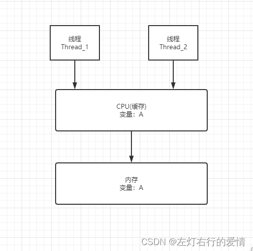
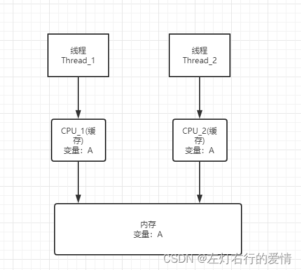
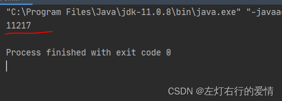
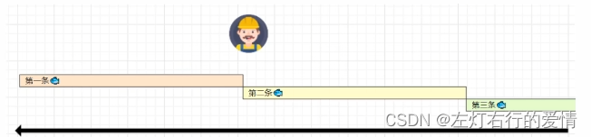
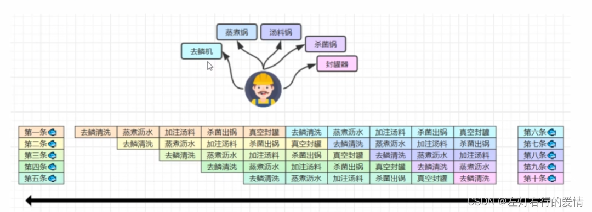
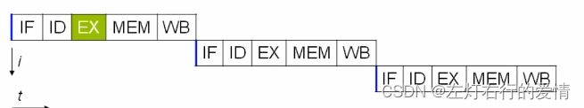
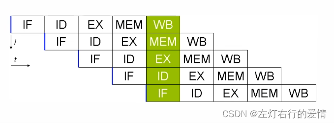

> 原文：[CSDN](https://blog.csdn.net/qq_45852626/article/details/126028285)（历史文章导入，当前状态为草稿）

#### 内存模型\_1
### 前言

编写并发编程是非常困难的事情，并发程序的Bug往往是反常识的，很多错误诡异的出现又诡异的消失，让人抓狂。  
 我们想到快速精准地解决并发的问题，理解事情的本质是一件非常重要的事情，本文逐步放你深入，带你了解为什么并发编程那么容易出问题。

### 什么是Java内存模式

Java内存模式也叫`Java Memory Mode，JMM`。它是Java虚拟机规范定义的，在JVM运行时将**数据分区域存储**，简单来说就是不同数据放在不同地方。通常叫运行时数据区域。

### 并发编程问题根源

我们的CPU，内存，I/O设备都不断迭代，不断朝着更快方向努力，但是有一个核心矛盾一直存在，就是这三者的速度差异。  
 大致比例为CPU：内存：IO=1:400：4000000.  
 程序里大部分语句都要访问内存，有些还要访问IO，我们由木桶理论知道，程序整体的性能取决于最慢的操作——读写IO设备。  
 为了合理利用CPU的高性能，平衡这三者的速度差异，计算机体系机构，操作系统，编译程序偶读做出贡献，主要体现为：  
 1：CPU增加了缓存，用来均衡与内存的速度差异  
 2：操作系统增加了进程，线程，以分时复用CPU，进而均衡CPU与IO设备的速度差异。  
 3：编译程序优化指令执行次序，使得缓存能够得到更加合理的利用。

我们写的程序都在默默享受这些发明带来便利，但是并发很多诡异问题根源也在这里。

#### 源头一：缓存导致可见性问题

1. 在单核时代，所有线程都在一颗CPU执行，CPU缓存与内存的数据一致性很容易解决，因为所有线程操作都是同一个CPU的缓存，一个线程对缓存写，另一个线程一定可以看到。  
    

而对于一个线程对共享变量的修改，另外一个线程能够立刻看到，我们成为可见性。

2. 在多核时代，每颗CPU都有自己的缓存，当多个线程在不同CPU执行时，这些线程操作的是不同的CPU缓存。  
      
    线程`Thread_1`操作的是`CPU_1`上的缓存，而线程`Thread_2`操作是`CPU_2`上的缓存，很明显这时候线程`Thread_1`对变量A的操作对于线程`Thread_2`而言就不具备可见性了，这个就属于硬件程序员给软件程序员挖的“坑”。

举个例子代码验证一下,每执行一次`add10K`方法，都会循环10000次count+=1操作，下面我们创建两个线程，每个线程调用一次`add10K`方法，然后我们来看看最后结果为多少：

```
public class JMM {
    private long count=0;
    private void add10k(){
        int idx=0;
        while(idx++<10000){
            count+=1;
        }
    }
    public static long calc() throws InterruptedException {
        final JMM Jmm =new JMM();
        Thread th1=new Thread(()->{
            Jmm.add10k();
        });

        Thread th2 =new Thread(()->{
            Jmm.add10k();
        });

        th1.start();
        th2.start();
        //等待两个线程执行结束
        th1.join();
        th2.join();
        return Jmm.count;
    }
    public static void main(String[] args) throws InterruptedException {
      long c=calc();
        System.out.println(c);
    }
}


```

  
 我们本以为得到结果为20000，但实际上我们得到的结果为10000-20000之间的随机数，为什么？  
 假设线程A和线程B同时开始执行：  
 第一次都会将count=0读入到各自的CPU缓存里，执行完count+=1之后，各自CPU缓存里的值都是1。  
 同时写入内存后，我们会发现内存中是1，而不是我们期望的2.  
 本质上由于各自的CPU缓存里都有了count的值，两个线程都是基于CPU缓存里的count值来计算，所以最终导致count的值都是<20000，这就是**缓存的可见性问题**。

#### 源头二：线程切换带来原子性问题

1. 我们都知道IO操作很慢，早期操作系统发明了多线程，即使在单核的CPU上我们也可以一边听着歌，一边写BUG。  
    操作系统允许某个进程执行一小段时间，例如50ms，过来50ms操作系统就会重新选择一个进程来执行（任务切换），这个50ms称为**时间片**。
2. 在一个时间片内，如果一个进程进行一个IO操作，例如读一个文件，这个时候该进程可以把自己标记为“休眠状态”，并出让CPU的使用权，待文件读入内存，操作系统会把这个休眠的进程唤醒，唤醒的进程就有机会重新获得CPU的使用权。
3. 这里的进程在等待IO时之所以会释放CPU使用权，是为了让CPU在这段等待时间里可以做别的事情，这样CPU的使用率就上来了；  
    此外，如果这时有另一个进程也读文件，读文件的操作就会排队，磁盘驱动在完成一个进程的读操作后，发现有排队的 任务，就会立即启动下一个读操作，这样IO的使用率也上来了。
4. 早期的操作系统基于进程来调度CPU，不同进程间是不共享内存空间的，所以进程要做任务切换就要**切换内存映射地址**；  
    一个进程创建的所有线程，都是共享一个内存空间的，所以线程做任务切换成本就很低了。  
    线代操作系统都基于更轻量的线程来调度，我们提到的任务切换，都是指线程切换。
5. Java并发程序都是基于多线程的，自然也会涉及到任务切换，让人意外的是，任务切换是并发编程里诡异Bug的源头之一。  
    为什么任务切换会带来bug呢？我们来看看下面的举例：  
    我们现在基本都使用高级语言编程，高级语言里一条语句往往需要多条CPU指令完成，例如`count+=1`；至少需要三条cpu指令。  
    指令一：首先，需要把变量count从内存加载到CPU的寄存器。  
    指令二：之后，在寄存器中执行+1操作。  
    指令三：最后，将结果写入内存（缓存机制导致可能写入的是CPU缓存而不是内存）。

**操作系统做任务切换，可以发生在任何一条CPU指令执行完！**  
 我们潜意识就觉得`count+=1`这个操作是一个不可分割的整体，就像一个原子一样，线程切换不会发生在中间。  
 只是我们要注意，**CPU能保证原子操作是CPU指令级别的，而不是高级语言的操作符！**

#### 源头三：编译优化带来的有序性问题

有一个问题我们要意识到，JVM会在不影响正确性的前提下，可以调整语句的执行顺序！  
 这种特性称为**指令重排**，多线程下指令重排会影响正确性。

有一个鱼罐头的故事和你分享：  
 加工一条鱼需要50分钟，每次只能加工一条鱼。  
 鱼罐头的加工流程细分为5个步骤：  
 去鳞清洗：10分钟  
 蒸煮里水：10分钟  
 加注汤料：10分钟  
 杀菌出锅：10分钟  
 真空封罐：10分钟  
   
 即使只有一个工人，最理想的情况：他能够在10分钟之内同时做好5件事，因为对第一条鱼的真空装罐，不会影响第二条鱼的杀菌出锅。  
   
 了解完这个故事，我们再来看看什么是指令重排序优化  
 事实上，现在处理器会设计为一个时钟周期完成一条执行时间最长的CPU指令，这么做的原因是指令还可以再划分为一个个更小的的阶段，例如：每条指令都可以分为：取指令-指令译码-指令执行-内存访问-数据写回 这五个阶段。  
   
 那么它有什么用呢？  
 现代CPU支持多级指令流水线，例如支持同时执行取指令-指令译码-指令执行-内存访问-数据写回的处理器，就可以称为五级指令流水线。  
 这时CPU可以在一个时钟周期内，同时运行五条指令的不同阶段，本质上流水线技术不能缩短单条指令的 执行时间，但它变相地提高了指令地吞吐率。  
   
 所以在不改变程序结果的前提下，这些指令的各个阶段可以通过**重排序**和组合来实现**指令级并行**，这一技术占据了计算架构的重要地位。  
 注意：指令重排的前提是，重排指令不能影响结果，例如：

```
//可以重排
int a =10;
int b=20;
System.out.println(a+b);


```

```
//不能重排的例子
int a=10;
int b=a-5;


```

在Java领域还有一个经典的案例就是利用双重检查创建单例对象，这个我们后面会详细介绍。

### 总结

只要我们能够深刻理解可见性，原子性，有序性在并发场景下的原理，很多并发BUG都可以理解，可以诊断，后面我们还会更一章内容，看Java是如何应对这些问题的。
